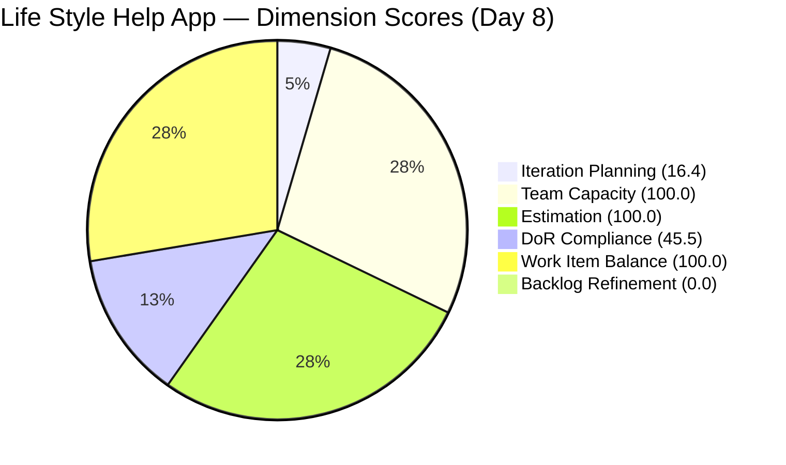
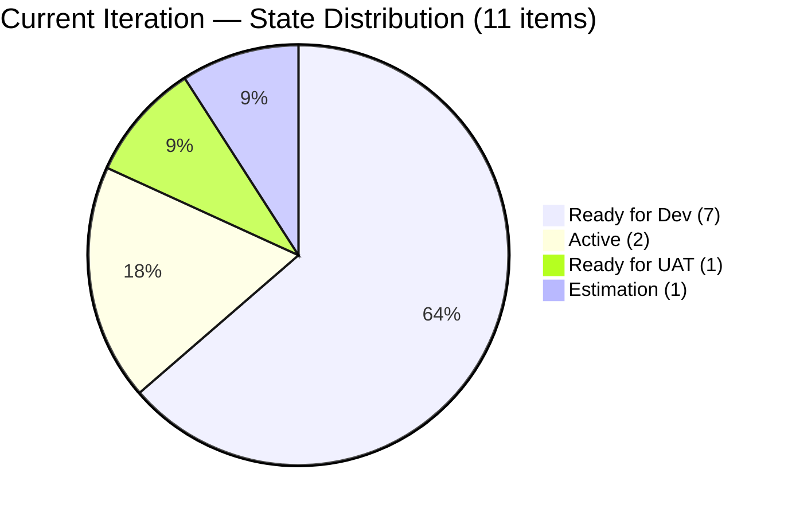

# SAFe Audit Report — Life Style Help App

## 1. Audit Metadata

| Field | Value |
|-------|-------|
| **Project** | Life Style Help App |
| **Team** | Life Style Help App Team |
| **Workspace** | `ado_ls_dev` |
| **ADO Project ID** | 0f447778-7156-4451-ab21-27be3c4a5888 |
| **Current Iteration** | Iteration 6.6 (IP) |
| **Iteration Start** | March 23, 2026 |
| **Iteration Finish** | April 5, 2026 |
| **Iteration Day** | Day 8 of 14 |
| **Audit Date** | 2026-03-30 |
| **Previous Audit** | AUDIT_20260327_0004.md (Mar 27, 2026 — Day 5) |
| **Overall Score** | **60.3 / 100** |
| **Risk Band** | **Moderate Risk** |

---

## 2. Executive Summary

The Life Style Help App Team reaches Day 8 of the Innovation and Planning (IP) sprint with an overall score of **60.3/100 (Moderate Risk)**, unchanged from the Day 5 audit. The score composition is identical across all six dimensions: Iteration Planning (16.4), Team Capacity (100.0), Estimation (100.0), DoR Compliance (45.5), Work Item Balance (100.0), and Backlog Refinement (0.0). Despite observable item-level activity — #201162 now has Story Points (2), #195727 moved from Grooming to Estimation, and #201174 was updated today — none of these changes moved any scoring dimension. The two structural blockers remain: (1) 30 backlog items older than 180 days dragging Backlog Refinement to zero, and (2) six current-iteration items missing Acceptance Criteria keeping DoR at 45.5. Samantha Babael continues to carry 63.6% of current-iteration work (7 of 11 items), unchanged from Day 5. With 6 days remaining in the IP sprint, the window for remediation is narrowing.

---

## 3. Previous Audit Delta

| Dimension | Prior (Mar 27) | Current (Mar 30) | Delta |
|-----------|---------------|-----------------|-------|
| Iteration Planning | 16.4 | 16.4 | 0.0 |
| Team Capacity | 100.0 | 100.0 | 0.0 |
| Estimation | 100.0 | 100.0 | 0.0 |
| DoR Compliance | 45.5 | 45.5 | 0.0 |
| Work Item Balance | 100.0 | 100.0 | 0.0 |
| Backlog Refinement | 0.0 | 0.0 | 0.0 |
| **Overall** | **60.3** | **60.3** | **0.0** |

**Key observations since Day 5:**
- **No score movement in 3 days.** This is the first audit in the series with zero delta across all dimensions.
- #201162 (Defect) now has Story Points = 2 (was unestimated). However, Defects are not point-eligible under the rubric, so this does not affect Estimation.
- #195727 (User Story) moved from Grooming to Estimation state and was updated today (Mar 30). It remains in the current iteration with SP=2 but still lacks Acceptance Criteria.
- #201174 (User Story) and #201596 (Spike) were both updated today (Mar 30), indicating active work.
- 5 of 11 current items have a ChangedDate before the iteration start (Mar 23), meaning they have not been touched since entering the sprint. This is a new concern compared to Day 5, when untouched was 0.

**Correction from prior audit:** The Day 5 report classified 60.3 as "High Risk." Per the scoring rubric (60-79.9 = Moderate Risk), the correct band is **Moderate Risk**. This audit applies the correct classification.

---

## 4. Current Iteration Snapshot

| Metric | Value |
|--------|-------|
| Iteration | 6.6 (IP) — Mar 23 – Apr 5, 2026 |
| Visible root backlog items | 67 |
| Current iteration root items | 11 |
| Contributors with current work | 3 (Samantha Babael, Ike Yana, Luzmibel Paculanang) |
| Contributors with capacity configured | 3 |
| Point-eligible current items | 7 (5 User Stories + 2 Spikes) |
| Estimated current items | 7 |
| DoR-compliant current items | 5 |
| Fresh items (changed >= 2026-02-13) | 18 / 67 (26.9%) |
| Stale > 90 days | 47 / 67 (70.1%) |
| Stale > 180 days | 30 / 67 (44.8%) |
| Untouched current items (changed < Mar 23) | 5 / 11 (45.5%) |

---

## 5. Work Item Analysis

### Current Iteration Items (11)

| ID | Type | State | Assigned To | Story Points | DoR | Changed |
|----|------|-------|-------------|-------------|-----|---------|
| 195715 | Defect | Ready for Dev | Samantha Babael | 1 | No (no AC) | Mar 18 |
| 195727 | User Story | Estimation | Ike Yana | 2 | No (no AC) | Mar 30 |
| 195735 | User Story | Ready for Dev | Samantha Babael | 2 | Yes | Mar 18 |
| 196379 | Spike | Active | Ike Yana | 1 | Yes | Mar 23 |
| 196380 | User Story | Ready for Dev | Ike Yana | 2 | Yes | Mar 18 |
| 198775 | Defect | Ready for Dev | Samantha Babael | 1 | No (no AC) | Mar 18 |
| 201158 | Defect | Ready for Dev | Samantha Babael | 1 | No (no AC) | Mar 18 |
| 201162 | Defect | Ready for Dev | Samantha Babael | 2 | No (no AC) | Mar 30 |
| 201174 | User Story | Ready for Dev | Samantha Babael | 2 | Yes | Mar 30 |
| 201317 | User Story | Ready for UAT | Samantha Babael | 2 | Yes | Mar 27 |
| 201596 | Spike | Active | Luzmibel Paculanang | 3 | No (no desc/AC) | Mar 30 |

**Ownership distribution:**

| Contributor | Items | Share |
|-------------|-------|-------|
| Samantha Babael | 7 | 63.6% |
| Ike Yana | 3 | 27.3% |
| Luzmibel Paculanang | 1 | 9.1% |

Samantha's concentration remains at 63.6%, unchanged from Day 5. This is the primary delivery risk.

### Type Distribution in Current Iteration

| Type | Count | Share |
|------|-------|-------|
| User Story | 5 | 45.5% |
| Defect | 4 | 36.4% |
| Spike | 2 | 18.2% |

No type exceeds 60%; Spike share is 18.2%, well below the 40% threshold. Balance is healthy.

### State Distribution in Current Iteration

| State | Count |
|-------|-------|
| Ready for Dev | 7 |
| Active | 2 |
| Ready for UAT | 1 |
| Estimation | 1 |

7 of 11 items (63.6%) remain in Ready for Dev on Day 8. Only 1 item (#201317) has reached UAT, and 2 Spikes are Active. The high concentration in Ready for Dev at the midpoint suggests slower-than-expected throughput.

### Backlog Age Profile (67 items)

| Age Bucket | Count | Share |
|------------|-------|-------|
| Fresh (changed within 45 days) | 18 | 26.9% |
| Not fresh but < 90 days | 2 | 3.0% |
| Stale 90-180 days | 17 | 25.4% |
| Stale > 180 days | 30 | 44.8% |

---

## 6. SAFe Compliance Scorecard

| Dimension | Score | Evidence | Notes |
|-----------|-------|----------|-------|
| Iteration Planning | 16.4 | 11 current / 67 visible | Denominator inflated by 30+ stale items; ratio structurally depressed |
| Team Capacity | 100.0 | 3 contributors with capacity / 3 with work | All contributors have configured capacity |
| Estimation | 100.0 | 7 estimated / 7 point-eligible | All User Stories and Spikes estimated |
| DoR Compliance | 45.5 | 5 compliant / 11 current | 4 Defects + 1 User Story lack AC; 1 Spike lacks desc and AC |
| Work Item Balance | 100.0 | User Stories present; no type > 60%; Spike <= 40% | No penalties triggered |
| Backlog Refinement | 0.0 | base 26.9 - 20 (stale90 > 25%) - 20 (stale180 >= 1) - 20 (untouched > 30%) = -33.1 -> 0 | Triple penalty; untouched penalty is new vs. Day 5 |
| **Overall** | **60.3** | Average of 6 dimensions | **Moderate Risk** (60-79.9 band) |

---

## 7. Dimension Findings

### Iteration Planning (16.4) — Low
11 of 67 visible items are in the current IP iteration. This ratio is unchanged from Day 5. The denominator problem (67 visible items including 30 older than 180 days) continues to suppress this score. Removing the 30 stale-180 items would shift the ratio to 11/37 = 29.7, a meaningful improvement achievable through backlog grooming alone.

### Team Capacity (100.0) — Healthy
Three contributors — Samantha Babael, Ike Yana, and Luzmibel Paculanang — all have capacity configured and work assigned. The team capacity of 3 per day aligns with the contributor count.

### Estimation (100.0) — Full Score
All 7 point-eligible items (5 User Stories + 2 Spikes) have Story Points assigned. #201162 (Defect) now has SP=2, though Defects are not point-eligible under the rubric. This remains a perfect score for the third consecutive audit.

### DoR Compliance (45.5) — Below Target
5 of 11 current items meet DoR (Description >= 30 non-whitespace chars AND Acceptance Criteria >= 20 non-whitespace chars). The 6 non-compliant items:
- **#195715** (Defect): has Description (586 chars), no AC
- **#195727** (User Story): has Description (700+ chars), no AC — newly non-compliant since state change
- **#198775** (Defect): has Description (121 chars), no AC
- **#201158** (Defect): has Description (322 chars), no AC
- **#201162** (Defect): has Description (349 chars), no AC
- **#201596** (Spike): no Description, no AC — active with 3 SP committed but undefined

No remediation of AC gaps has occurred since Day 5. This is the same structural gap observed in three consecutive audits.

### Work Item Balance (100.0) — Healthy
User Stories are present (5 of 11). No single type dominates above 60% (User Story at 45.5% is the largest). Spikes at 18.2% are well below the 40% penalty threshold.

### Backlog Refinement (0.0) — Critical (Unchanged)
Base score: 26.9% (18 fresh / 67 visible). Three penalties now apply:
- `stale_90 / visible = 70.1% > 25%` -> -20
- `stale_180 >= 1` (30 items) -> -20
- `untouched / current = 45.5% > 30%` -> -20 (NEW penalty vs. Day 5)

Combined: 26.9 - 60 = -33.1, floored to 0.0. The untouched penalty is new: 5 of 11 current items have not been modified since before the iteration started (Mar 23). This indicates that nearly half the sprint commitment has seen no activity through Day 8.

---

## 8. Risks and Bottlenecks

| Priority | Risk | Impact |
|----------|------|--------|
| CRITICAL | 30 items > 180 days stale — dead backlog weight | Backlog Refinement = 0.0; planning signal corrupted; 4th consecutive audit at 0.0 |
| CRITICAL | 5 of 11 current items untouched since sprint start | 45.5% of sprint commitment has zero activity at Day 8; delivery at risk |
| HIGH | Samantha carries 7/11 items (63.6%) — bus factor | Sprint delivery stalls if Samantha is unavailable |
| HIGH | 6 non-compliant current items (no AC) | DoR 45.5 — acceptance criteria undefined for majority of items |
| HIGH | 7 of 11 items still in Ready for Dev on Day 8 | Low throughput; only 1 item has reached UAT at sprint midpoint |
| MODERATE | #201596 Spike: no Description, no AC | Active item with 3 SP committed but no definition of scope or done |
| MODERATE | #195727 User Story: still in Estimation state on Day 8 | Should have been estimated and moved to Ready for Dev by now |

---

## 9. Prioritized Recommendations

1. **[Immediate — today]** Add Acceptance Criteria to the 4 Defects and 1 User Story missing AC (#195715, #195727, #198775, #201158, #201162). Add both Description and AC to #201596 (Spike). This single action moves DoR from 45.5 to 100.0.

2. **[Immediate — today]** Review the 5 untouched items (#195715, #195735, #196380, #198775, #201158 — all changed before Mar 23). Either actively work on them or descope from the iteration. Carrying uncommitted work erodes sprint integrity.

3. **[This week]** Redistribute 2-3 items from Samantha Babael to Ike Yana or Luzmibel Paculanang. Target reducing Samantha's share below 50%. Ike currently has 3 items; Luzmibel has only 1.

4. **[This sprint — IP]** Purge or close the 30 items older than 180 days. The IP sprint is specifically designed for this kind of backlog hygiene. Even closing half (15 items) improves Iteration Planning from 16.4 to ~21.2.

5. **[This sprint]** Move #195727 from Estimation to Ready for Dev or descope it. An item still in Estimation on Day 8 of a 14-day sprint signals incomplete planning.

6. **[Before PI7]** Establish a backlog refinement cadence. The Backlog Refinement score has been 0.0 for four consecutive audits. This is a systemic process gap, not a one-time miss.

---

## 10. Evidence Gaps and Limitations

- The capacity API returned team-level data only (teamCapacityPerDay = 3). Individual contributor capacity breakdown was not available; the score assumes all 3 contributors have configured capacity, consistent with prior audit findings.
- Description and Acceptance Criteria lengths are based on raw HTML field lengths. Actual non-whitespace character counts may be lower due to HTML markup, but fields with 0 length definitively indicate missing content.
- The untouched items metric uses `System.ChangedDate` compared to iteration start date (Mar 23). Items may have been discussed or planned without updating the ADO work item, but this is not reflected in the data.
- The prior audit (Day 5) reported the risk band as "High Risk" for a score of 60.3. Per the rubric (60-79.9 = Moderate Risk), this has been corrected in this audit.
- Backlog item count remains at 67, unchanged from Day 5.

---

> Note: Backlog Refinement shown as 0.1 for chart visibility; actual score is 0.0.

---

*Report generated by ADO SAFe audit agent. Audit date: 2026-03-30 (Day 8 of Iteration 6.6 IP).*
