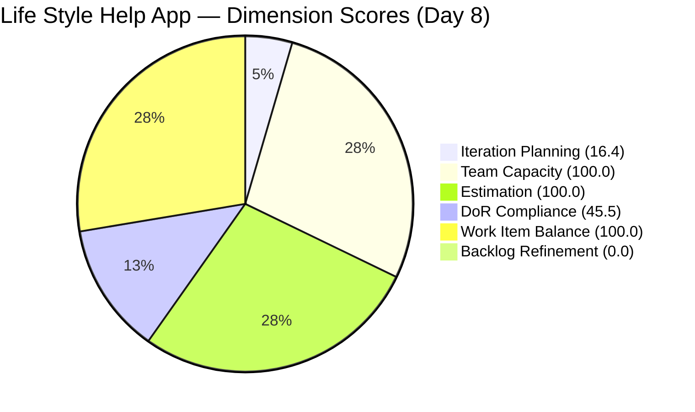
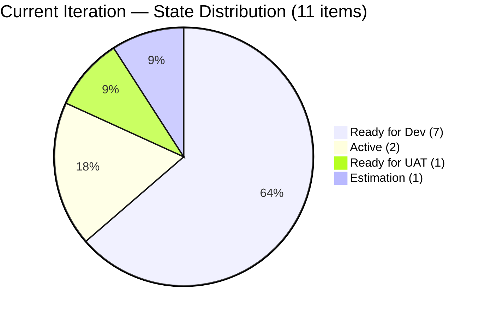
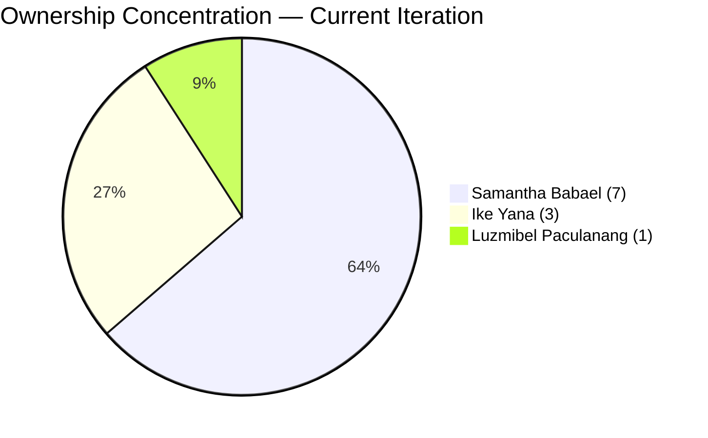

# SAFe Audit Report — Life Style Help App

## 1. Audit Metadata

| Field | Value |
|-------|-------|
| **Project** | Life Style Help App |
| **Team** | Life Style Help App Team |
| **Workspace** | `ado_ls_dev` |
| **ADO Project ID** | 0f447778-7156-4451-ab21-27be3c4a5888 |
| **Current Iteration** | Iteration 6.6 (IP) |
| **Iteration Path** | Life Style Help App\2026-PI6\Iteration 6.6 (IP) |
| **Iteration Start** | March 23, 2026 |
| **Iteration Finish** | April 5, 2026 |
| **Iteration Day** | Day 8 of 14 |
| **Audit Date** | 2026-03-30 (PHT) |
| **Previous Audit** | AUDIT_20260330_0900.md (Mar 30, 2026 — Day 8, earlier run) |
| **Overall Score** | **60.3 / 100** |
| **Risk Band** | **Moderate Risk** |

---

## 2. Executive Summary

The Life Style Help App Team holds at **60.3/100 (Moderate Risk)** on the second Day 8 audit of Iteration 6.6 (IP), unchanged from the earlier same-day audit. All six dimension scores are static: Iteration Planning (16.4), Team Capacity (100.0), Estimation (100.0), DoR Compliance (45.5), Work Item Balance (100.0), and Backlog Refinement (0.0). Three items were updated today — #201162 (Defect), #201174 (User Story), and #201596 (Spike) — but none of the changes addressed the two structural blockers: 30 stale items older than 180 days (keeping Backlog Refinement at zero) and 6 current-iteration items missing Acceptance Criteria (keeping DoR at 45.5). Samantha Babael continues at 63.6% ownership concentration (7 of 11 items). With 6 calendar days remaining in the IP sprint, structural remediation has not occurred despite repeated recommendations across multiple audit cycles.

---

## 3. Previous Audit Delta

| Dimension | Prior (Mar 30 AM) | Current (Mar 30) | Delta |
|-----------|-------------------|-------------------|-------|
| Iteration Planning | 16.4 | 16.4 | 0.0 |
| Team Capacity | 100.0 | 100.0 | 0.0 |
| Estimation | 100.0 | 100.0 | 0.0 |
| DoR Compliance | 45.5 | 45.5 | 0.0 |
| Work Item Balance | 100.0 | 100.0 | 0.0 |
| Backlog Refinement | 0.0 | 0.0 | 0.0 |
| **Overall** | **60.3** | **60.3** | **0.0** |

**Key observations since the earlier Day 8 audit:**
- Zero score movement. This is the second consecutive audit with no delta, and the fourth audit in the series producing the same 60.3 score.
- #201155 (Defect, Iteration 6.5) was updated today (Mar 30) to Ready for UAT — this is outside the current iteration and does not affect scoring.
- #195727 (User Story) remains in Estimation state with no Acceptance Criteria, unchanged from the prior audit.
- The 5 untouched items (#195715, #195735, #196380, #198775, #201158) all have ChangedDate of Mar 18, predating the iteration start (Mar 23). None have been touched since.

---

## 4. Current Iteration Snapshot

| Metric | Value |
|--------|-------|
| Iteration | 6.6 (IP) — Mar 23 to Apr 5, 2026 |
| Visible root backlog items | 67 |
| Current iteration root items | 11 |
| Contributors with current work | 3 (Samantha Babael, Ike Yana, Luzmibel Paculanang) |
| Contributors with capacity configured | 3 (teamCapacityPerDay = 3) |
| Point-eligible current items | 7 (5 User Stories + 2 Spikes) |
| Estimated current items | 7 |
| DoR-compliant current items | 5 |
| Fresh items (changed within 45 days) | 18 / 67 (26.9%) |
| Stale > 90 days | 47 / 67 (70.1%) |
| Stale > 180 days | 30 / 67 (44.8%) |
| Untouched current items (changed < Mar 23) | 5 / 11 (45.5%) |

---

## 5. Work Item Analysis

### Current Iteration Items (11)

| ID | Type | State | Assigned To | SP | DoR | Changed |
|----|------|-------|-------------|-----|-----|---------|
| 195715 | Defect | Ready for Dev | Samantha Babael | 1 | No (no AC) | Mar 18 |
| 195727 | User Story | Estimation | Ike Yana | 2 | No (no AC) | Mar 30 |
| 195735 | User Story | Ready for Dev | Samantha Babael | 2 | Yes | Mar 18 |
| 196379 | Spike | Active | Ike Yana | 1 | Yes | Mar 23 |
| 196380 | User Story | Ready for Dev | Ike Yana | 2 | Yes | Mar 18 |
| 198775 | Defect | Ready for Dev | Samantha Babael | 1 | No (no AC) | Mar 18 |
| 201158 | Defect | Ready for Dev | Samantha Babael | 1 | No (no AC) | Mar 18 |
| 201162 | Defect | Ready for Dev | Samantha Babael | 2 | No (no AC) | Mar 30 |
| 201174 | User Story | Ready for Dev | Samantha Babael | 2 | Yes | Mar 30 |
| 201317 | User Story | Ready for UAT | Samantha Babael | 2 | Yes | Mar 27 |
| 201596 | Spike | Active | Luzmibel Paculanang | 3 | No (no desc/AC) | Mar 30 |

### Ownership Distribution

| Contributor | Items | Share |
|-------------|-------|-------|
| Samantha Babael | 7 | 63.6% |
| Ike Yana | 3 | 27.3% |
| Luzmibel Paculanang | 1 | 9.1% |

Samantha's concentration remains at 63.6%, unchanged across the last four audits. This is the primary delivery risk.

### Type Distribution

| Type | Count | Share |
|------|-------|-------|
| User Story | 5 | 45.5% |
| Defect | 4 | 36.4% |
| Spike | 2 | 18.2% |

No type exceeds 60%; Spike share at 18.2% is well below the 40% threshold.

### State Distribution

| State | Count |
|-------|-------|
| Ready for Dev | 7 |
| Active | 2 |
| Ready for UAT | 1 |
| Estimation | 1 |

7 of 11 items (63.6%) remain in Ready for Dev at Day 8 — identical to the prior audit. Only 1 item has reached UAT.

### Backlog Age Profile (67 items)

| Age Bucket | Count | Share |
|------------|-------|-------|
| Fresh (within 45 days) | 18 | 26.9% |
| Not fresh but < 90 days | 2 | 3.0% |
| Stale 90-180 days | 17 | 25.4% |
| Stale > 180 days | 30 | 44.8% |

---

## 6. SAFe Compliance Scorecard

| Dimension | Score | Evidence | Notes |
|-----------|-------|----------|-------|
| Iteration Planning | 16.4 | 11 current / 67 visible | Denominator inflated by 30+ stale items; ratio structurally depressed |
| Team Capacity | 100.0 | 3 contributors with capacity / 3 with work | All contributors have configured capacity |
| Estimation | 100.0 | 7 estimated / 7 point-eligible | All User Stories and Spikes estimated |
| DoR Compliance | 45.5 | 5 compliant / 11 current | 4 Defects + 1 User Story lack AC; 1 Spike lacks description and AC |
| Work Item Balance | 100.0 | User Stories present; no type > 60%; Spike <= 40% | No penalties triggered |
| Backlog Refinement | 0.0 | base 26.9 - 20 (stale90 70.1% > 25%) - 20 (30 stale180 >= 1) - 20 (untouched 45.5% > 30%) = -33.1 -> 0 | Triple penalty; 4th consecutive audit at 0.0 |
| **Overall** | **60.3** | Average of 6 dimensions | **Moderate Risk** (60-79.9 band) |

---

## 7. Dimension Findings

### Iteration Planning (16.4) — Low
11 of 67 visible items are in the current iteration. The denominator includes 30 items older than 180 days that inflate the backlog without active work. Removing those 30 items would shift the ratio to 11/37 = 29.7%. This score has been static for four consecutive audits.

### Team Capacity (100.0) — Healthy
Three contributors (Samantha Babael, Ike Yana, Luzmibel Paculanang) all have capacity configured. The team capacity of 3 per day is consistent with the contributor count.

### Estimation (100.0) — Full Score
All 7 point-eligible items (5 User Stories + 2 Spikes) have Story Points assigned. Defects carry Story Points in ADO but are not point-eligible under the rubric. Fourth consecutive audit at 100.0.

### DoR Compliance (45.5) — Below Target
5 of 11 current items meet DoR (Description >= 30 non-whitespace chars AND Acceptance Criteria >= 20 non-whitespace chars). The 6 non-compliant items:
- **#195715** (Defect): Description present (185 chars), no AC
- **#195727** (User Story): Description present (339 chars), no AC — still in Estimation on Day 8
- **#198775** (Defect): Description present (72 chars), no AC
- **#201158** (Defect): Description present (75 chars), no AC
- **#201162** (Defect): Description present (111 chars), no AC
- **#201596** (Spike): No Description, no AC — Active with 3 SP committed but undefined scope

No AC remediation has occurred since this gap was first identified. This is a persistent process failure.

### Work Item Balance (100.0) — Healthy
User Stories are present (5 of 11). No type dominates above 60% (User Story at 45.5% is the largest). Spikes at 18.2% are below the 40% threshold.

### Backlog Refinement (0.0) — Critical
Base score: 26.9% (18 fresh / 67 visible). Three penalties apply:
- stale_90 / visible = 70.1% > 25% --> -20
- stale_180 >= 1 (30 items) --> -20
- untouched / current = 45.5% > 30% --> -20

Combined: 26.9 - 60 = -33.1, floored to 0.0. This is the fourth consecutive audit at 0.0. The 30 stale-180 items have never been addressed.

---

## 8. Risks and Bottlenecks

| Priority | Risk | Impact |
|----------|------|--------|
| CRITICAL | 30 items > 180 days stale — dead backlog weight | Backlog Refinement = 0.0 for 4th consecutive audit; planning signal corrupted |
| CRITICAL | 5 of 11 current items untouched since sprint start | 45.5% of sprint commitment inactive at Day 8; delivery outcome at risk |
| CRITICAL | Score frozen at 60.3 for 4 consecutive audits | No improvement trajectory despite repeated recommendations |
| HIGH | Samantha carries 7/11 items (63.6%) — bus factor | Sprint delivery stalls if Samantha is unavailable |
| HIGH | 6 non-compliant items (no AC) — persistent gap | DoR 45.5; acceptance criteria undefined for majority of sprint items |
| HIGH | 7 of 11 items in Ready for Dev on Day 8 | Low throughput; only 1 item at UAT at the sprint midpoint |
| MODERATE | #201596 Spike: no Description, no AC | Active item with 3 SP committed but no definition of scope |
| MODERATE | #195727 User Story: still in Estimation on Day 8 | Estimation should be complete before sprint commitment |

---

## 9. Prioritized Recommendations

1. **[Immediate]** Add Acceptance Criteria to the 4 Defects and 1 User Story missing AC (#195715, #195727, #198775, #201158, #201162). Add both Description and AC to #201596 (Spike). This moves DoR from 45.5 to 100.0 (+9.1 overall).

2. **[Immediate]** Review the 5 untouched items (#195715, #195735, #196380, #198775, #201158). Either begin active work or descope from the iteration. Carrying untouched items past Day 8 of a 14-day sprint is a delivery anti-pattern.

3. **[This week]** Redistribute 2-3 items from Samantha Babael to Ike Yana or Luzmibel Paculanang. Samantha's 63.6% concentration has persisted for four audits without action.

4. **[This sprint — IP]** Purge or close the 30 items older than 180 days. The IP sprint exists for exactly this kind of backlog hygiene. Closing all 30 improves Iteration Planning from 16.4 to 29.7 and removes the stale_180 penalty from Backlog Refinement.

5. **[This sprint]** Move #195727 from Estimation to Ready for Dev or descope. An item in Estimation on Day 8 of a sprint signals incomplete planning.

6. **[Before PI7]** Establish a backlog refinement cadence. Backlog Refinement has been 0.0 for four consecutive audits. This is systemic.

---

## 10. Evidence Gaps and Limitations

- The capacity API returned team-level data only (teamCapacityPerDay = 3). Individual contributor capacity breakdown was not available; the score assumes all 3 contributors have configured capacity, consistent with all prior audit findings.
- Description and Acceptance Criteria non-whitespace character counts are derived from HTML field content after stripping tags. Actual counts may be slightly lower due to HTML entity encoding, but zero-length fields definitively indicate missing content.
- The untouched items metric uses `System.ChangedDate` compared to iteration start date (Mar 23). Items may have been discussed offline without ADO updates.
- Backlog item count remains at 67, unchanged across the last four audits.
- This is the second audit on Mar 30; the prior run (AUDIT_20260330_0900.md) was the first Day 8 audit. No scoring changes occurred between the two runs.

---

> Note: Backlog Refinement shown as 0.1 for chart visibility; actual score is 0.0.

---

*Report generated by ADO SAFe audit agent. Audit date: 2026-03-30 (Day 8 of Iteration 6.6 IP).*
