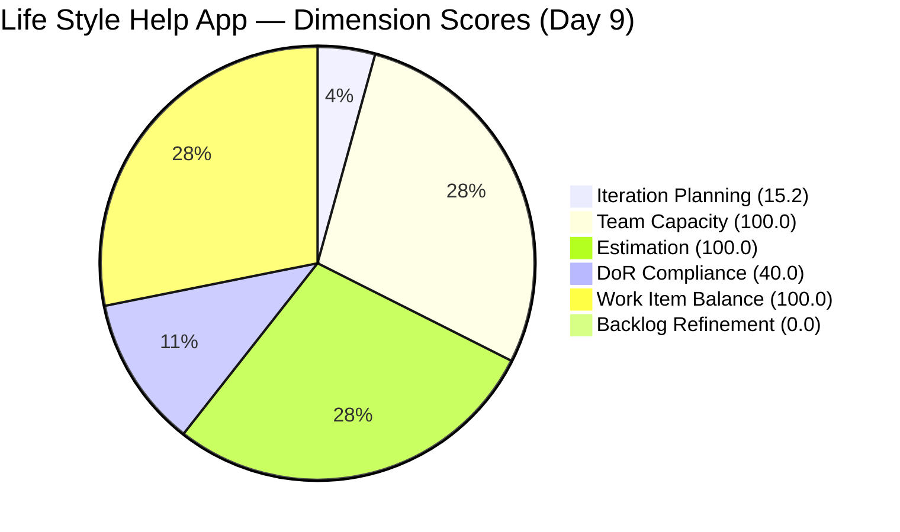
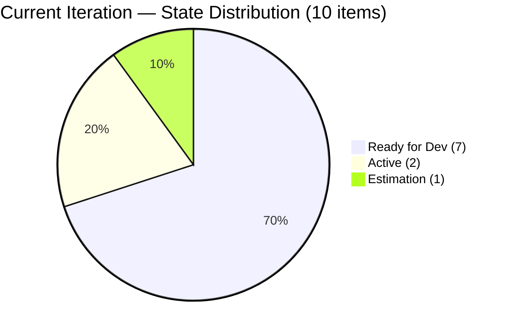
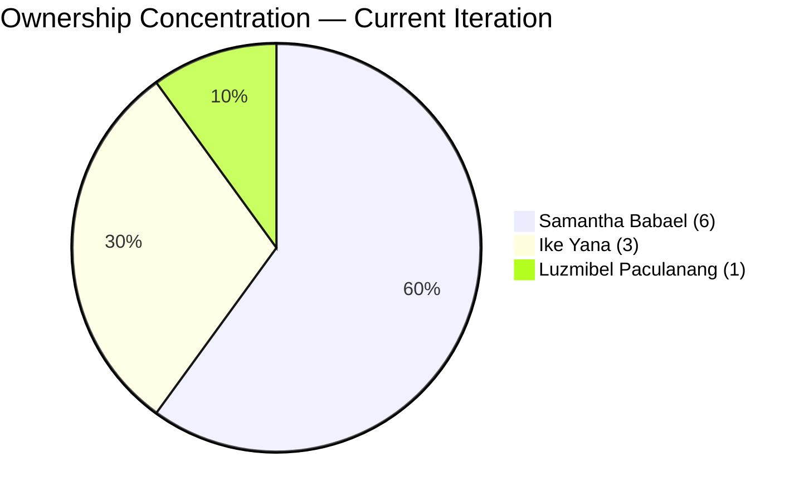
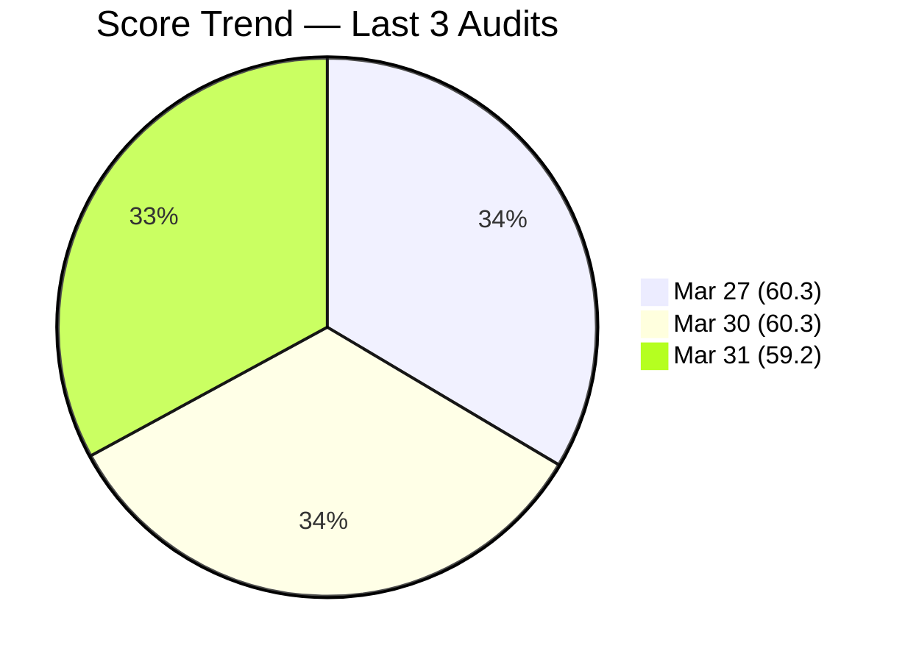

# SAFe Audit Report — Life Style Help App

## 1. Audit Metadata

| Field | Value |
|-------|-------|
| **Project** | Life Style Help App |
| **Team** | Life Style Help App Team |
| **Workspace** | `ado_ls_dev` |
| **ADO Project ID** | 0f447778-7156-4451-ab21-27be3c4a5888 |
| **Current Iteration** | Iteration 6.6 (IP) |
| **Iteration Path** | Life Style Help App\2026-PI6\Iteration 6.6 (IP) |
| **Iteration Start** | March 23, 2026 |
| **Iteration Finish** | April 5, 2026 |
| **Iteration Day** | Day 9 of 14 |
| **Audit Date** | 2026-03-31 |
| **Previous Audit** | AUDIT_20260330_1000.md (Mar 30, 2026 — Day 8, Score: 60.3) |
| **Overall Score** | **59.2 / 100** |
| **Risk Band** | **High Risk** |

---

## 2. Executive Summary

The Life Style Help App Team scores **59.2/100 (High Risk)** on Day 9 of Iteration 6.6 (IP), a **-1.1 point decline** from the prior audit (60.3, Moderate Risk). The team has **crossed into the High Risk band** for the first time in this iteration cycle. The decline is caused by the closure of #201317 (User Story, "Ready for UAT"), which removed one item from both the visible backlog (67 to 66) and the current iteration (11 to 10). This mechanically lowered Iteration Planning from 16.4 to 15.2 and DoR Compliance from 45.5 to 40.0 (the closed item was DoR-compliant, so its removal worsened the non-compliant ratio).

The two structural blockers remain unaddressed for the **fifth consecutive audit**: 30 items older than 180 days (Backlog Refinement = 0.0) and 5 current-iteration items untouched since before sprint start. Samantha Babael's ownership concentration dropped slightly from 63.6% (7/11) to 60.0% (6/10) due to the closed item, but remains at the threshold level. With 5 calendar days remaining in the IP sprint, no structural remediation has occurred.

---

## 3. Previous Audit Delta

| Dimension | Prior (Mar 30) | Current (Mar 31) | Delta |
|-----------|----------------|-------------------|-------|
| Iteration Planning | 16.4 | 15.2 | -1.2 |
| Team Capacity | 100.0 | 100.0 | 0.0 |
| Estimation | 100.0 | 100.0 | 0.0 |
| DoR Compliance | 45.5 | 40.0 | -5.5 |
| Work Item Balance | 100.0 | 100.0 | 0.0 |
| Backlog Refinement | 0.0 | 0.0 | 0.0 |
| **Overall** | **60.3** | **59.2** | **-1.1** |

**Key observations since the prior Day 8 audit:**
- **#201317 (User Story, "Ready for UAT") has left the backlog.** This item was assigned to Samantha Babael and was DoR-compliant. Its removal reduces both numerator and denominator for Iteration Planning, and removes a compliant item from the DoR ratio.
- **Risk band has crossed from Moderate to High.** The 59.2 score is below the 60.0 threshold for the first time.
- **Samantha's concentration dropped to 60.0% (6/10)** from 63.6% (7/11) — still at risk level.
- **5 untouched items remain unchanged** — all with ChangedDate of Mar 18, now 13 days without activity.
- **#195727 (User Story) remains in Estimation** at Day 9 — still uncommitted.
- **Backlog Refinement remains at 0.0** for the fifth consecutive audit.

---

## 4. Current Iteration Snapshot

| Metric | Value |
|--------|-------|
| Iteration | 6.6 (IP) — Mar 23 to Apr 5, 2026 |
| Visible root backlog items | 66 |
| Current iteration root items | 10 |
| Total Story Points (current) | 17 SP |
| Contributors with current work | 3 (Samantha Babael, Ike Yana, Luzmibel Paculanang) |
| Contributors with capacity configured | 3 |
| Point-eligible current items | 6 (4 User Stories + 2 Spikes) |
| Estimated current items | 6 |
| DoR-compliant current items | 4 |
| Fresh items (changed within 45 days) | 17 / 66 (25.8%) |
| Stale > 90 days | 47 / 66 (71.2%) |
| Stale > 180 days | 30 / 66 (45.5%) |
| Untouched current items (changed < Mar 23) | 5 / 10 (50.0%) |

---

## 5. Work Item Analysis

### Current Iteration Items (10)

| ID | Type | State | Assigned To | SP | DoR | Changed |
|----|------|-------|-------------|-----|-----|---------|
| 195715 | Defect | Ready for Dev | Samantha Babael | 1 | No (no AC) | Mar 18 |
| 195727 | User Story | Estimation | Ike Yana | 2 | No (no AC) | Mar 30 |
| 195735 | User Story | Ready for Dev | Samantha Babael | 2 | Yes | Mar 18 |
| 196379 | Spike | Active | Ike Yana | 1 | Yes | Mar 23 |
| 196380 | User Story | Ready for Dev | Ike Yana | 2 | Yes | Mar 18 |
| 198775 | Defect | Ready for Dev | Samantha Babael | 1 | No (no AC) | Mar 18 |
| 201158 | Defect | Ready for Dev | Samantha Babael | 1 | No (no AC) | Mar 18 |
| 201162 | Defect | Ready for Dev | Samantha Babael | 2 | No (no AC) | Mar 30 |
| 201174 | User Story | Ready for Dev | Samantha Babael | 2 | Yes | Mar 30 |
| 201596 | Spike | Active | Luzmibel Paculanang | 3 | No (no desc/AC) | Mar 30 |

### Removed Since Prior Audit

| ID | Type | Title | Prior State | Notes |
|----|------|-------|-------------|-------|
| 201317 | User Story | Ready for UAT | Ready for UAT | Left backlog — likely Closed |

### Ownership Distribution

| Contributor | Items | Share |
|-------------|-------|-------|
| Samantha Babael | 6 | 60.0% |
| Ike Yana | 3 | 30.0% |
| Luzmibel Paculanang | 1 | 10.0% |

Samantha's concentration dropped from 63.6% to 60.0% due to the closed item, but remains at the audit consideration threshold.

### Type Distribution

| Type | Count | Share |
|------|-------|-------|
| User Story | 4 | 40.0% |
| Defect | 4 | 40.0% |
| Spike | 2 | 20.0% |

No type exceeds 60%; dominant type share is 40.0% (tie between User Story and Defect). Spike share at 20.0% is well below 40%.

### State Distribution

| State | Count |
|-------|-------|
| Ready for Dev | 7 |
| Active | 2 |
| Estimation | 1 |

7 of 10 items (70.0%) remain in Ready for Dev at Day 9 — worsened from 63.6% at Day 8 because the one item that had progressed to UAT (#201317) is now closed. Zero items at UAT or beyond in the current iteration.

### Backlog Age Profile (66 items)

| Age Bucket | Count | Share |
|------------|-------|-------|
| Fresh (within 45 days) | 17 | 25.8% |
| Not fresh but < 90 days | 2 | 3.0% |
| Stale 90-180 days | 17 | 25.8% |
| Stale > 180 days | 30 | 45.5% |

---

## 6. SAFe Compliance Scorecard

| Dimension | Score | Evidence | Notes |
|-----------|-------|----------|-------|
| Iteration Planning | 15.2 | 10 current / 66 visible | Down from 16.4; denominator inflated by 30+ stale items |
| Team Capacity | 100.0 | 3 contributors with capacity / 3 with work | All contributors have configured capacity |
| Estimation | 100.0 | 6 estimated / 6 point-eligible | All User Stories and Spikes estimated |
| DoR Compliance | 40.0 | 4 compliant / 10 current | Down from 45.5; lost compliant item #201317 |
| Work Item Balance | 100.0 | User Stories present; no type > 60%; Spike <= 40% | No penalties triggered |
| Backlog Refinement | 0.0 | base 25.8 - 20 (stale90 71.2% > 25%) - 20 (30 stale180 >= 1) - 20 (untouched 50.0% > 30%) = -34.2 -> 0 | Triple penalty; 5th consecutive audit at 0.0 |
| **Overall** | **59.2** | Average of 6 dimensions | **High Risk** (40-59.9 band) |

### Score Computation Detail

| Dimension | Formula | Calculation | Result |
|-----------|---------|-------------|--------|
| Iteration Planning | current / visible x 100 | 10 / 66 x 100 | 15.2 |
| Team Capacity | cap / work_assignees x 100 | 3 / 3 x 100 | 100.0 |
| Estimation | estimated / point_eligible x 100 | 6 / 6 x 100 | 100.0 |
| DoR Compliance | dor_compliant / current x 100 | 4 / 10 x 100 | 40.0 |
| Work Item Balance | 100 - penalties | 100 - 0 | 100.0 |
| Backlog Refinement | base - penalties | 25.8 - 60 -> 0 | 0.0 |
| **Overall** | average(all 6) | (15.2+100+100+40+100+0)/6 | **59.2** |

---

## 7. Dimension Findings

### Iteration Planning (15.2) — Low (was 16.4)
10 of 66 visible items are in the current iteration. The closure of #201317 removed one item from both numerator and denominator, lowering the ratio from 11/67 to 10/66. The denominator remains inflated by 30 items older than 180 days. Removing those 30 items would shift the ratio to 10/36 = 27.8%.

### Team Capacity (100.0) — Healthy
Three contributors (Samantha Babael, Ike Yana, Luzmibel Paculanang) all have capacity configured at 1 hr/day each (total 3 hr/day). No days off recorded.

### Estimation (100.0) — Full Score
All 6 point-eligible items (4 User Stories + 2 Spikes) have Story Points assigned. The 4 Defects carry Story Points in ADO but are not point-eligible under the rubric. Fifth consecutive audit at 100.0.

### DoR Compliance (40.0) — Below Target (was 45.5)
4 of 10 current items meet DoR (Description >= 30 non-whitespace chars AND Acceptance Criteria >= 20 non-whitespace chars). The 6 non-compliant items:
- **#195715** (Defect): Description present (185 chars), no AC
- **#195727** (User Story): Description present (339 chars), no AC — still in Estimation on Day 9
- **#198775** (Defect): Description present (72 chars), no AC
- **#201158** (Defect): Description present (75 chars), no AC
- **#201162** (Defect): Description present (111 chars), no AC
- **#201596** (Spike): No Description, no AC — Active with 3 SP committed but undefined scope

The score dropped because the compliant #201317 was closed, leaving a higher ratio of non-compliant items. No AC remediation has occurred across five audits.

### Work Item Balance (100.0) — Healthy
User Stories are present (4 of 10). No type dominates above 60% (User Story and Defect tied at 40.0%). Spikes at 20.0% are below the 40% threshold.

### Backlog Refinement (0.0) — Critical
Base score: 25.8% (17 fresh / 66 visible). Three penalties apply:
- stale_90 / visible = 71.2% > 25% --> -20
- stale_180 >= 1 (30 items) --> -20
- untouched / current = 50.0% > 30% --> -20

Combined: 25.8 - 60 = -34.2, floored to 0.0. This is the **fifth consecutive audit at 0.0**. The untouched percentage worsened from 45.5% to 50.0% as the denominator shrank.

---

## 8. Risks and Bottlenecks

| Priority | Risk | Impact |
|----------|------|--------|
| CRITICAL | **Score crossed into High Risk band (59.2)** | First time below 60.0 in this iteration; trajectory is declining |
| CRITICAL | 30 items > 180 days stale — dead backlog weight | Backlog Refinement = 0.0 for 5th consecutive audit; planning signal corrupted |
| CRITICAL | 5 of 10 current items untouched since sprint start (50%) | Half the sprint commitment inactive at Day 9; delivery at risk |
| CRITICAL | Score declining for 5 consecutive audits without remediation | No improvement trajectory despite repeated recommendations |
| HIGH | Samantha carries 6/10 items (60.0%) — bus factor | Sprint delivery stalls if Samantha is unavailable |
| HIGH | 6 non-compliant items (no AC) — persistent gap | DoR 40.0; acceptance criteria undefined for majority of sprint items |
| HIGH | 7 of 10 items in Ready for Dev on Day 9 | 0 items at UAT; zero throughput visible in current iteration |
| MODERATE | #201596 Spike: no Description, no AC | Active item with 3 SP committed but no definition of scope |
| MODERATE | #195727 User Story: still in Estimation on Day 9 | Estimation should be complete before sprint commitment |

---

## 9. Prioritized Recommendations

1. **[Immediate]** Add Acceptance Criteria to the 4 Defects and 1 User Story missing AC (#195715, #195727, #198775, #201158, #201162). Add both Description and AC to #201596 (Spike). This moves DoR from 40.0 to 100.0 (+10.0 overall).

2. **[Immediate]** Review the 5 untouched items (#195715, #195735, #196380, #198775, #201158). Either begin active work or descope from the iteration. Carrying untouched items past Day 9 of a 14-day sprint is a delivery anti-pattern.

3. **[This week]** Redistribute 2-3 items from Samantha Babael to Ike Yana or Luzmibel Paculanang. Samantha's 60.0% concentration has persisted for five audits.

4. **[This sprint — IP]** Purge or close the 30 items older than 180 days. The IP sprint exists for exactly this kind of backlog hygiene. Closing all 30 improves Iteration Planning from 15.2 to 27.8 and removes the stale_180 penalty from Backlog Refinement.

5. **[This sprint]** Move #195727 from Estimation to Ready for Dev or descope. An item in Estimation on Day 9 of a sprint signals incomplete planning.

6. **[Before PI7]** Establish a backlog refinement cadence. Backlog Refinement has been 0.0 for five consecutive audits. This is systemic and the primary driver of the High Risk classification.

---

## 10. Evidence Gaps and Limitations

- The capacity API returned individual contributor data: Samantha (1 hr/day Development), Ike (1 hr/day Development), Luzmibel (1 hr/day Testing). Total: 3 hr/day.
- Description and Acceptance Criteria non-whitespace character counts are derived from HTML field content after stripping tags. Actual counts may be slightly lower due to HTML entity encoding, but zero-length fields definitively indicate missing content.
- The untouched items metric uses `System.ChangedDate` compared to iteration start date (Mar 23). Items may have been discussed offline without ADO updates.
- #201317 disappeared from the backlog between the prior audit and this one. Absence from the backlog API confirms it is no longer visible (likely Closed).
- Backlog item count dropped from 67 to 66 — first change in five audits.
- Point eligibility follows the convention established in prior audits: User Story and Spike types are point-eligible; Defects are excluded despite carrying Story Points in ADO.

---

> Note: Backlog Refinement shown as 0.1 for chart visibility; actual score is 0.0.

---

*Report generated by ADO SAFe audit agent. Audit date: 2026-03-31 (Day 9 of Iteration 6.6 IP).*
*Previous: AUDIT_20260330_1000.md (Day 8, 60.3/100 Moderate Risk) | -1.1 change -> High Risk*
