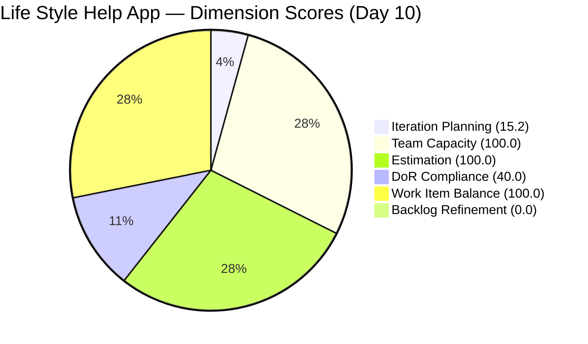
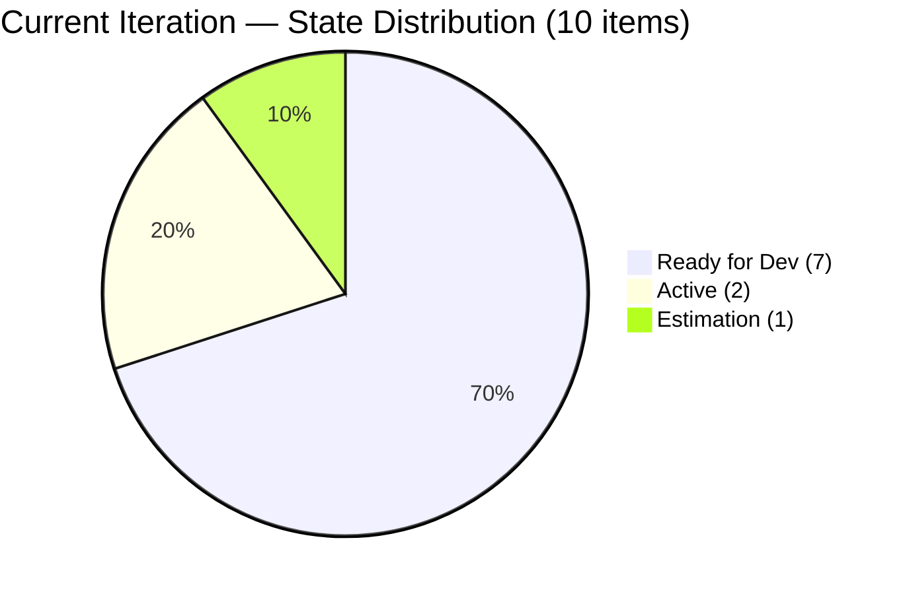
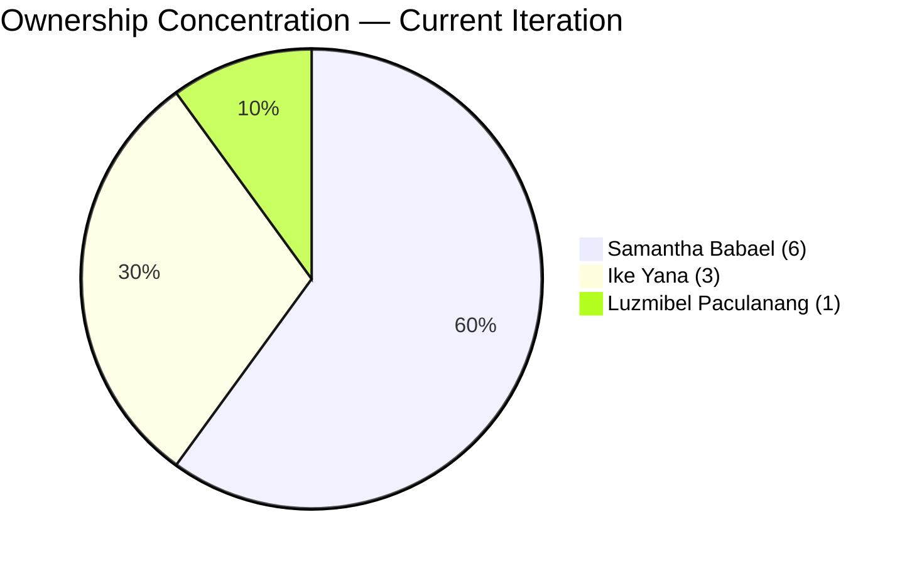
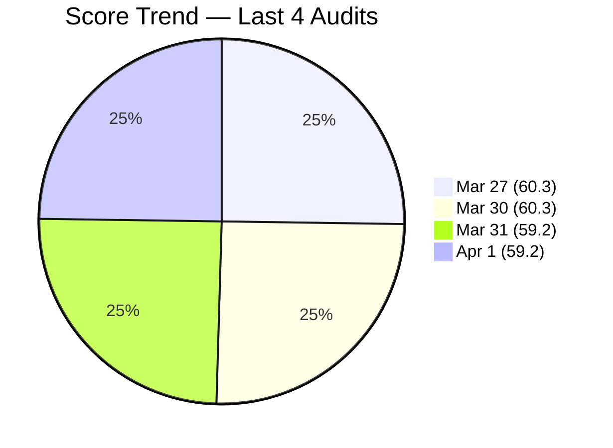

# SAFe Audit Report — Life Style Help App

## 1. Audit Metadata

| Field | Value |
|-------|-------|
| **Project** | Life Style Help App |
| **Team** | Life Style Help App Team |
| **Workspace** | `ado_ls_dev` |
| **ADO Project ID** | 0f447778-7156-4451-ab21-27be3c4a5888 |
| **Current Iteration** | Iteration 6.6 (IP) |
| **Iteration Path** | Life Style Help App\2026-PI6\Iteration 6.6 (IP) |
| **Iteration Start** | March 23, 2026 |
| **Iteration Finish** | April 5, 2026 |
| **Iteration Day** | Day 10 of 14 |
| **Audit Date** | 2026-04-01 |
| **Previous Audit** | AUDIT_20260331_0900.md (Mar 31, 2026 — Day 9, Score: 59.2) |
| **Overall Score** | **59.2 / 100** |
| **Risk Band** | **High Risk** |

---

## 2. Executive Summary

The Life Style Help App Team holds at **59.2/100 (High Risk)** on Day 10 of Iteration 6.6 (IP), **unchanged from the prior audit** (Day 9, 59.2). Zero backlog changes were detected between audits — the same 66 visible items, 10 current iteration items, and identical work item states persist. No work items changed state, no new items entered or left the backlog, and no DoR remediation occurred.

The team is now **4 calendar days from the IP sprint end** with 7 of 10 items still in Ready for Dev, 5 items untouched since before sprint start, and 30 items older than 180 days. Backlog Refinement remains at **0.0 for the sixth consecutive audit**. Samantha Babael continues to own 60.0% of current iteration items.

This is the **second consecutive audit in the High Risk band** and the score has been declining or flat for six consecutive audits without structural remediation.

---

## 3. Previous Audit Delta

| Dimension | Prior (Mar 31, Day 9) | Current (Apr 1, Day 10) | Delta |
|-----------|----------------------|-------------------------|-------|
| Iteration Planning | 15.2 | 15.2 | 0.0 |
| Team Capacity | 100.0 | 100.0 | 0.0 |
| Estimation | 100.0 | 100.0 | 0.0 |
| DoR Compliance | 40.0 | 40.0 | 0.0 |
| Work Item Balance | 100.0 | 100.0 | 0.0 |
| Backlog Refinement | 0.0 | 0.0 | 0.0 |
| **Overall** | **59.2** | **59.2** | **0.0** |

**Key observations since the prior Day 9 audit:**
- **Zero score movement.** All six dimensions are unchanged. This is the first audit with zero delta in this iteration cycle.
- **No work item state changes detected.** All 66 backlog items retain their prior states and ChangedDates.
- **5 untouched items remain unchanged** — all with ChangedDate of Mar 18, now 14 days without activity (the entire sprint duration).
- **7 of 10 items remain in Ready for Dev** at Day 10 — identical to Day 9.
- **#195727 (User Story) remains in Estimation** at Day 10 — uncommitted for the entire sprint.
- **Backlog Refinement remains at 0.0** for the sixth consecutive audit.
- **30 items stale >180 days** — no backlog hygiene performed despite IP sprint purpose.

---

## 4. Current Iteration Snapshot

| Metric | Value |
|--------|-------|
| Iteration | 6.6 (IP) — Mar 23 to Apr 5, 2026 |
| Visible root backlog items | 66 |
| Current iteration root items | 10 |
| Total Story Points (current) | 17 SP |
| Contributors with current work | 3 (Samantha Babael, Ike Yana, Luzmibel Paculanang) |
| Contributors with capacity configured | 3 |
| Point-eligible current items | 6 (4 User Stories + 2 Spikes) |
| Estimated current items | 6 |
| DoR-compliant current items | 4 |
| Fresh items (changed within 45 days) | 17 / 66 (25.8%) |
| Stale > 90 days | 47 / 66 (71.2%) |
| Stale > 180 days | 30 / 66 (45.5%) |
| Untouched current items (changed < Mar 23) | 5 / 10 (50.0%) |

---

## 5. Work Item Analysis

### Current Iteration Items (10)

| ID | Type | State | Assigned To | SP | DoR | Changed |
|----|------|-------|-------------|-----|-----|---------|
| 195715 | Defect | Ready for Dev | Samantha Babael | 1 | No (no AC) | Mar 18 |
| 195727 | User Story | Estimation | Ike Yana | 2 | No (no AC) | Mar 30 |
| 195735 | User Story | Ready for Dev | Samantha Babael | 2 | Yes | Mar 18 |
| 196379 | Spike | Active | Ike Yana | 1 | Yes | Mar 23 |
| 196380 | User Story | Ready for Dev | Ike Yana | 2 | Yes | Mar 18 |
| 198775 | Defect | Ready for Dev | Samantha Babael | 1 | No (no AC) | Mar 18 |
| 201158 | Defect | Ready for Dev | Samantha Babael | 1 | No (no AC) | Mar 18 |
| 201162 | Defect | Ready for Dev | Samantha Babael | 2 | No (no AC) | Mar 30 |
| 201174 | User Story | Ready for Dev | Samantha Babael | 2 | Yes | Mar 30 |
| 201596 | Spike | Active | Luzmibel Paculanang | 3 | No (no desc/AC) | Mar 30 |

### Ownership Distribution

| Contributor | Items | Share |
|-------------|-------|-------|
| Samantha Babael | 6 | 60.0% |
| Ike Yana | 3 | 30.0% |
| Luzmibel Paculanang | 1 | 10.0% |

Samantha's concentration remains at 60.0% — unchanged for six consecutive audits and at the audit consideration threshold.

### Type Distribution

| Type | Count | Share |
|------|-------|-------|
| User Story | 4 | 40.0% |
| Defect | 4 | 40.0% |
| Spike | 2 | 20.0% |

No type exceeds 60%; dominant type share is 40.0% (tie between User Story and Defect). Spike share at 20.0% is well below 40%.

### State Distribution

| State | Count |
|-------|-------|
| Ready for Dev | 7 |
| Active | 2 |
| Estimation | 1 |

7 of 10 items (70.0%) remain in Ready for Dev at Day 10. Zero items at UAT or beyond. This distribution has been identical since Day 8.

### Backlog Age Profile (66 items)

| Age Bucket | Count | Share |
|------------|-------|-------|
| Fresh (within 45 days) | 17 | 25.8% |
| Not fresh but < 90 days | 2 | 3.0% |
| Stale 90-180 days | 17 | 25.8% |
| Stale > 180 days | 30 | 45.5% |

---

## 6. SAFe Compliance Scorecard

| Dimension | Score | Evidence | Notes |
|-----------|-------|----------|-------|
| Iteration Planning | 15.2 | 10 current / 66 visible | Unchanged; denominator inflated by 30+ stale items |
| Team Capacity | 100.0 | 3 contributors with capacity / 3 with work | All contributors have configured capacity |
| Estimation | 100.0 | 6 estimated / 6 point-eligible | All User Stories and Spikes estimated |
| DoR Compliance | 40.0 | 4 compliant / 10 current | Unchanged; 6 items still missing AC |
| Work Item Balance | 100.0 | User Stories present; no type > 60%; Spike <= 40% | No penalties triggered |
| Backlog Refinement | 0.0 | base 25.8 - 20 (stale90 71.2% > 25%) - 20 (30 stale180 >= 1) - 20 (untouched 50.0% > 30%) = -34.2 -> 0 | Triple penalty; 6th consecutive audit at 0.0 |
| **Overall** | **59.2** | Average of 6 dimensions | **High Risk** (40-59.9 band) |

### Score Computation Detail

| Dimension | Formula | Calculation | Result |
|-----------|---------|-------------|--------|
| Iteration Planning | current / visible x 100 | 10 / 66 x 100 | 15.2 |
| Team Capacity | cap / work_assignees x 100 | 3 / 3 x 100 | 100.0 |
| Estimation | estimated / point_eligible x 100 | 6 / 6 x 100 | 100.0 |
| DoR Compliance | dor_compliant / current x 100 | 4 / 10 x 100 | 40.0 |
| Work Item Balance | 100 - penalties | 100 - 0 | 100.0 |
| Backlog Refinement | base - penalties | 25.8 - 60 -> 0 | 0.0 |
| **Overall** | average(all 6) | (15.2+100+100+40+100+0)/6 | **59.2** |

---

## 7. Dimension Findings

### Iteration Planning (15.2) — Low (unchanged)
10 of 66 visible items are in the current iteration. The ratio has not changed since Day 9. The denominator remains inflated by 30 items older than 180 days. Removing those 30 items would shift the ratio to 10/36 = 27.8%. The IP sprint is 71% elapsed with no structural backlog work performed.

### Team Capacity (100.0) — Healthy
Three contributors (Samantha Babael, Ike Yana, Luzmibel Paculanang) all have capacity configured at 1 hr/day each (total 3 hr/day). No days off recorded.

### Estimation (100.0) — Full Score
All 6 point-eligible items (4 User Stories + 2 Spikes) have Story Points assigned. The 4 Defects carry Story Points in ADO but are not point-eligible under the rubric. Sixth consecutive audit at 100.0.

### DoR Compliance (40.0) — Below Target (unchanged)
4 of 10 current items meet DoR (Description >= 30 non-whitespace chars AND Acceptance Criteria >= 20 non-whitespace chars). The 6 non-compliant items remain identical to the prior audit:
- **#195715** (Defect): Description present (185 chars), no AC
- **#195727** (User Story): Description present (333 chars), no AC — still in Estimation on Day 10
- **#198775** (Defect): Description present (72 chars), no AC
- **#201158** (Defect): Description present (75 chars), no AC
- **#201162** (Defect): Description present (111 chars), no AC
- **#201596** (Spike): No Description, no AC — Active with 3 SP committed but undefined scope

No AC remediation has occurred across six audits.

### Work Item Balance (100.0) — Healthy
User Stories are present (4 of 10). No type dominates above 60% (User Story and Defect tied at 40.0%). Spikes at 20.0% are below the 40% threshold.

### Backlog Refinement (0.0) — Critical
Base score: 25.8% (17 fresh / 66 visible). Three penalties apply:
- stale_90 / visible = 71.2% > 25% --> -20
- stale_180 >= 1 (30 items) --> -20
- untouched / current = 50.0% > 30% --> -20

Combined: 25.8 - 60 = -34.2, floored to 0.0. This is the **sixth consecutive audit at 0.0**. The untouched items (#195715, #195735, #196380, #198775, #201158) have now been inactive for the entire 14-day sprint duration (all changed Mar 18).

---

## 8. Risks and Bottlenecks

| Priority | Risk | Impact |
|----------|------|--------|
| CRITICAL | **Score frozen at 59.2 (High Risk) for 2 consecutive audits** | No improvement trajectory; 4 days remain in IP sprint |
| CRITICAL | **5 items untouched for entire sprint (14 days)** | These items will never be completed this iteration; effectively dead weight |
| CRITICAL | **30 items > 180 days stale — no IP hygiene performed** | Backlog Refinement = 0.0 for 6th consecutive audit; IP sprint purpose unfulfilled |
| CRITICAL | **Score declining or flat for 6 consecutive audits without remediation** | Systemic non-response to audit recommendations |
| HIGH | **Samantha carries 6/10 items (60.0%) — bus factor** | Sprint delivery stalls if Samantha is unavailable |
| HIGH | **6 non-compliant items (no AC) — persistent gap** | DoR 40.0; acceptance criteria undefined for majority of sprint items |
| HIGH | **7 of 10 items in Ready for Dev on Day 10** | 0 items at UAT; zero throughput visible with only 4 days remaining |
| HIGH | **#195727 User Story still in Estimation on Day 10** | Item has been in Estimation for the entire sprint; indicates planning failure |
| MODERATE | **#201596 Spike: no Description, no AC** | Active item with 3 SP committed but no definition of scope |

---

## 9. Prioritized Recommendations

1. **[Immediate — Today]** Add Acceptance Criteria to the 4 Defects and 1 User Story missing AC (#195715, #195727, #198775, #201158, #201162). Add both Description and AC to #201596 (Spike). This moves DoR from 40.0 to 100.0 (+10.0 overall).

2. **[Immediate — Today]** Descope the 5 untouched items (#195715, #195735, #196380, #198775, #201158) from the iteration. These have been inactive for 14 days. Move them to the PI6 backlog or PI7 planning. Carrying them inflates the untouched penalty.

3. **[This week — Before Apr 5]** Purge or close the 30 items older than 180 days. The IP sprint exists for exactly this kind of backlog hygiene. With 4 days remaining, this is the last opportunity. Closing all 30 improves Iteration Planning and removes the stale_180 penalty from Backlog Refinement.

4. **[This week]** Redistribute 2-3 items from Samantha Babael to Ike Yana or Luzmibel Paculanang. Samantha's 60.0% concentration has persisted for six audits.

5. **[This week]** Move #195727 from Estimation to Ready for Dev or descope. An item in Estimation for the entire sprint is a planning failure.

6. **[Before PI7]** Establish a backlog refinement cadence. Backlog Refinement has been 0.0 for six consecutive audits. This is systemic and the primary driver of the High Risk classification.

---

## 10. Evidence Gaps and Limitations

- The capacity API returned individual contributor data: Samantha (1 hr/day Development), Ike (1 hr/day Development), Luzmibel (1 hr/day Testing). Total: 3 hr/day.
- Description and Acceptance Criteria non-whitespace character counts are derived from HTML field content after stripping tags. Actual counts may be slightly lower due to HTML entity encoding, but zero-length fields definitively indicate missing content.
- The untouched items metric uses `System.ChangedDate` compared to iteration start date (Mar 23). Items may have been discussed offline without ADO updates.
- No backlog changes detected between Mar 31 and Apr 1. The board appears frozen.
- Point eligibility follows the convention established in prior audits: User Story and Spike types are point-eligible; Defects are excluded despite carrying Story Points in ADO.
- Backlog item count remains at 66 — unchanged for two consecutive audits.

---

> Note: Backlog Refinement shown as 0.1 for chart visibility; actual score is 0.0.

---

*Report generated by ADO SAFe audit agent. Audit date: 2026-04-01 (Day 10 of Iteration 6.6 IP).*
*Previous: AUDIT_20260331_0900.md (Day 9, 59.2/100 High Risk) | 0.0 change*
