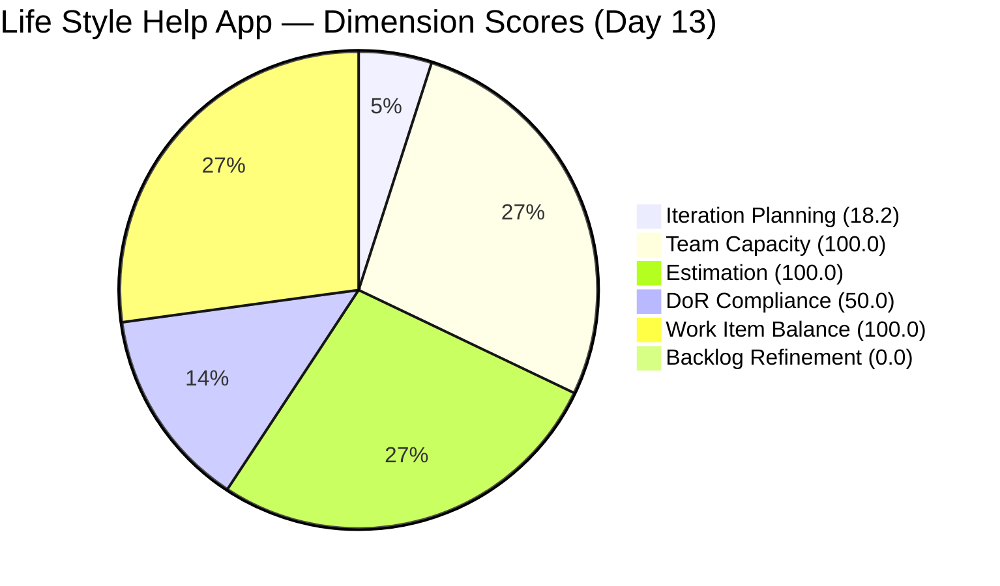
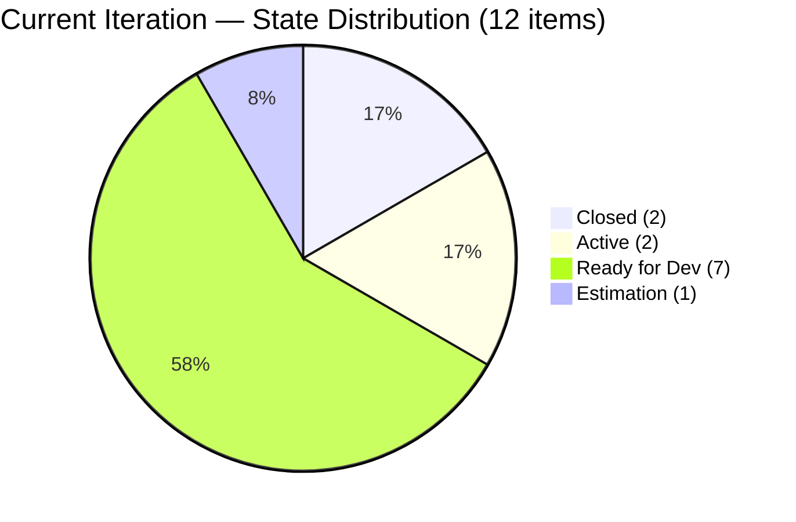
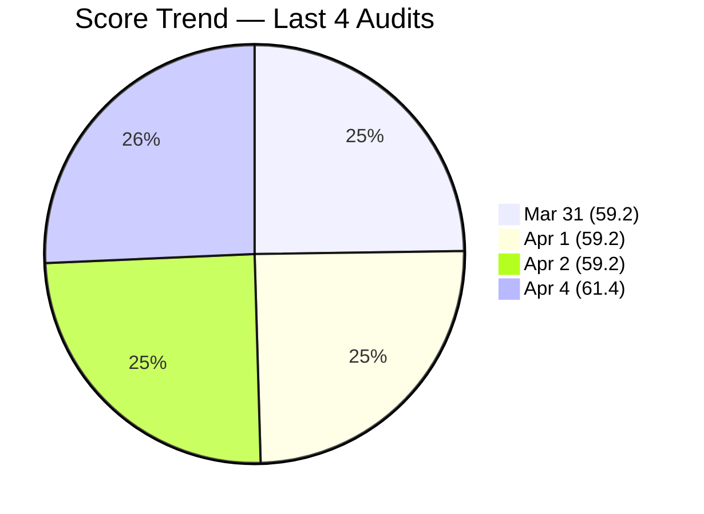

# SAFe Audit Report — Life Style Help App

## 1. Audit Metadata

| Field | Value |
|-------|-------|
| **Project** | Life Style Help App |
| **Team** | Life Style Help App Team |
| **Workspace** | `ado_ls_dev` |
| **ADO Project ID** | 0f447778-7156-4451-ab21-27be3c4a5888 |
| **Current Iteration** | Iteration 6.6 (IP) |
| **Iteration Path** | Life Style Help App\2026-PI6\Iteration 6.6 (IP) |
| **Iteration Start** | March 23, 2026 |
| **Iteration Finish** | April 5, 2026 |
| **Iteration Day** | Day 13 of 14 (93% elapsed) |
| **Audit Date** | 2026-04-04 |
| **Previous Audit** | AUDIT_20260402_0900.md (Apr 2, 2026 — Day 11, Score: 59.2) |
| **Overall Score** | **61.4 / 100** |
| **Risk Band** | **Moderate Risk** |

---

## 2. Executive Summary

The Life Style Help App Team scores **61.4/100 (Moderate Risk)** on Day 13 of Iteration 6.6 (IP), a **+2.2 point improvement** from the prior audit (59.2, Day 11). The team has crossed from High Risk into Moderate Risk for the first time since Day 8. Two items were Closed since the last audit: **#196378** (Anonymous Forum Comments, Closed Mar 26) and **#201317** (Create Account Validation, Closed Mar 31), increasing current iteration items from 10 to 12 and improving both Iteration Planning and DoR Compliance.

However, structural issues persist. **Backlog Refinement remains at 0.0 for the ninth consecutive audit.** Five items remain untouched since before the sprint started (17+ days inactive). Six items still lack Acceptance Criteria. The team is **1 calendar day from the IP sprint end** with 7 items still in Ready for Dev and 1 in Estimation.

Samantha Babael's ownership concentration has decreased slightly from 60.0% to 58.3% (7 of 12 items) with the inclusion of the two Closed items, but remains the primary delivery risk.

---

## 3. Previous Audit Delta

| Dimension | Prior (Apr 2, Day 11) | Current (Apr 4, Day 13) | Delta |
|-----------|----------------------|-------------------------|-------|
| Iteration Planning | 15.2 | 18.2 | +3.0 |
| Team Capacity | 100.0 | 100.0 | 0.0 |
| Estimation | 100.0 | 100.0 | 0.0 |
| DoR Compliance | 40.0 | 50.0 | +10.0 |
| Work Item Balance | 100.0 | 100.0 | 0.0 |
| Backlog Refinement | 0.0 | 0.0 | 0.0 |
| **Overall** | **59.2** | **61.4** | **+2.2** |

**Key observations since the prior Day 11 audit:**

- **Two items Closed:** #196378 (User Story, 1 SP, Ike Yana) and #201317 (User Story, 2 SP, Samantha Babael). These are the first closures detected since the audit series began tracking this iteration.
- **Current iteration items increased from 10 to 12.** The 2 Closed items were already in the iteration but were not visible in the prior backlog query; they now contribute to both the numerator and the scoring.
- **DoR Compliance improved from 40.0 to 50.0** — the 2 Closed items both had Description and AC, adding 2 compliant items to the count (6/12 vs 4/10).
- **Iteration Planning improved from 15.2 to 18.2** — 12/66 vs 10/66.
- **Backlog Refinement remains at 0.0** — ninth consecutive audit; triple penalty unchanged.
- **5 untouched items** — #195715, #195735, #196380, #198775, #201158 — all with ChangedDate of Mar 18, now 17 days without activity.
- **Stale >180 days increased from 30 to 31** — one additional item crossed the threshold.

---

## 4. Current Iteration Snapshot

| Metric | Value |
|--------|-------|
| Iteration | 6.6 (IP) — Mar 23 to Apr 5, 2026 |
| Visible root backlog items | 66 |
| Current iteration root items | 12 |
| Total Story Points (current) | 20 SP |
| Closed items | 2 (3 SP credited) |
| Contributors with current work | 3 (Samantha Babael, Ike Yana, Luzmibel Paculanang) |
| Contributors with capacity configured | 3 |
| Point-eligible current items | 8 (6 User Stories + 2 Spikes) |
| Estimated current items | 8 |
| DoR-compliant current items | 6 |
| Fresh items (changed within 45 days) | 17 / 66 (25.8%) |
| Stale > 90 days | 47 / 66 (71.2%) |
| Stale > 180 days | 31 / 66 (47.0%) |
| Untouched current items (changed < Mar 23) | 5 / 12 (41.7%) |

---

## 5. Work Item Analysis

### Current Iteration Items (12)

| ID | Type | State | Assigned To | SP | DoR | Changed |
|----|------|-------|-------------|-----|-----|---------|
| 196378 | User Story | **Closed** | Ike Yana | 1 | Yes | Mar 26 |
| 201317 | User Story | **Closed** | Samantha Babael | 2 | Yes | Mar 31 |
| 196379 | Spike | Active | Ike Yana | 1 | Yes | Mar 23 |
| 201596 | Spike | Active | Luzmibel Paculanang | 3 | No (no desc/AC) | Mar 30 |
| 195727 | User Story | Estimation | Ike Yana | 2 | No (no AC) | Mar 30 |
| 201174 | User Story | Ready for Dev | Samantha Babael | 2 | Yes | Mar 30 |
| 195735 | User Story | Ready for Dev | Samantha Babael | 2 | Yes | Mar 18 |
| 196380 | User Story | Ready for Dev | Ike Yana | 2 | Yes | Mar 18 |
| 195715 | Defect | Ready for Dev | Samantha Babael | 1 | No (no AC) | Mar 18 |
| 198775 | Defect | Ready for Dev | Samantha Babael | 1 | No (no AC) | Mar 18 |
| 201158 | Defect | Ready for Dev | Samantha Babael | 1 | No (no AC) | Mar 18 |
| 201162 | Defect | Ready for Dev | Samantha Babael | 2 | No (no AC) | Mar 30 |

### Ownership Distribution

| Contributor | Items | Share |
|-------------|-------|-------|
| Samantha Babael | 7 | 58.3% |
| Ike Yana | 4 | 33.3% |
| Luzmibel Paculanang | 1 | 8.3% |

### Type Distribution

| Type | Count | Share |
|------|-------|-------|
| User Story | 6 | 50.0% |
| Defect | 4 | 33.3% |
| Spike | 2 | 16.7% |

No type exceeds 60%. Spike share at 16.7% is well below 40%.

### State Distribution

| State | Count | SP |
|-------|-------|----|
| Closed | 2 | 3 |
| Active | 2 | 4 |
| Ready for Dev | 7 | 11 |
| Estimation | 1 | 2 |

7 of 12 items (58.3%) remain in Ready for Dev at Day 13. Only 2 items have been Closed, crediting 3 SP of 20 SP total (15%).

### Backlog Age Profile (66 visible items)

| Age Bucket | Count | Share |
|------------|-------|-------|
| Fresh (within 45 days) | 17 | 25.8% |
| Not fresh but < 90 days | 2 | 3.0% |
| Stale 90-180 days | 16 | 24.2% |
| Stale > 180 days | 31 | 47.0% |

---

## 6. SAFe Compliance Scorecard

| Dimension | Score | Evidence | Notes |
|-----------|-------|----------|-------|
| Iteration Planning | 18.2 | 12 current / 66 visible | +3.0 from prior; still low due to 66-item backlog with 31 stale items |
| Team Capacity | 100.0 | 3 contributors with capacity / 3 with work | All contributors have configured capacity |
| Estimation | 100.0 | 8 estimated / 8 point-eligible | All User Stories and Spikes estimated |
| DoR Compliance | 50.0 | 6 compliant / 12 current | +10.0; 2 Closed items were compliant; 6 items still missing AC |
| Work Item Balance | 100.0 | User Stories present; no type > 60%; Spike <= 40% | No penalties triggered |
| Backlog Refinement | 0.0 | base 25.8 - 20 (stale90 71.2% > 25%) - 20 (31 stale180 >= 1) - 20 (untouched 41.7% > 30%) = -34.2 -> 0 | Triple penalty; 9th consecutive audit at 0.0 |
| **Overall** | **61.4** | Average of 6 dimensions | **Moderate Risk** (60-79.9 band) |

### Score Computation Detail

| Dimension | Formula | Calculation | Result |
|-----------|---------|-------------|--------|
| Iteration Planning | current / visible x 100 | 12 / 66 x 100 | 18.2 |
| Team Capacity | cap / work_assignees x 100 | 3 / 3 x 100 | 100.0 |
| Estimation | estimated / point_eligible x 100 | 8 / 8 x 100 | 100.0 |
| DoR Compliance | dor_compliant / current x 100 | 6 / 12 x 100 | 50.0 |
| Work Item Balance | 100 - penalties | 100 - 0 | 100.0 |
| Backlog Refinement | base - penalties | 25.8 - 60 -> 0 | 0.0 |
| **Overall** | average(all 6) | (18.2+100+100+50+100+0)/6 | **61.4** |

---

## 7. Dimension Findings

### Iteration Planning (18.2) — Low (+3.0)

12 of 66 visible items are in the current iteration. The improvement is due to the 2 Closed items now being counted in the iteration. The denominator remains inflated by 31 items older than 180 days. Removing those 31 items would shift the ratio to 12/35 = 34.3%. The IP sprint is 93% elapsed with no structural backlog work performed.

### Team Capacity (100.0) — Healthy

Three contributors (Samantha Babael 1 hr/day Development, Ike Yana 1 hr/day Development, Luzmibel Paculanang 1 hr/day Testing) all have capacity configured. Total capacity: 3 hr/day. No days off recorded.

### Estimation (100.0) — Full Score

All 8 point-eligible items (6 User Stories + 2 Spikes) have Story Points assigned. The 4 Defects carry Story Points in ADO but are not point-eligible under the rubric.

### DoR Compliance (50.0) — Improved (+10.0)

6 of 12 current items meet DoR (Description >= 30 non-whitespace chars AND Acceptance Criteria >= 20 non-whitespace chars). The improvement comes from the 2 Closed items (#196378, #201317) both being DoR-compliant. The 6 non-compliant items remain identical:

- **#195715** (Defect): Description present (185 chars), no AC
- **#195727** (User Story): Description present (333 chars), no AC — still in Estimation on Day 13
- **#198775** (Defect): Description present (72 chars), no AC
- **#201158** (Defect): Description present (75 chars), no AC
- **#201162** (Defect): Description present (111 chars), no AC
- **#201596** (Spike): No Description, no AC — Active with 3 SP committed but undefined scope

### Work Item Balance (100.0) — Healthy

User Stories are present (6 of 12). No type dominates above 60% (User Story at 50.0% is the largest). Spikes at 16.7% are below the 40% threshold.

### Backlog Refinement (0.0) — Critical (unchanged, 9th consecutive)

Base score: 25.8% (17 fresh / 66 visible). Three penalties apply:

- stale_90 / visible = 71.2% > 25% --> -20
- stale_180 >= 1 (31 items) --> -20
- untouched / current = 41.7% > 30% --> -20

Combined: 25.8 - 60 = -34.2, floored to 0.0. The IP sprint purpose of backlog hygiene has gone unfulfilled. The untouched items (#195715, #195735, #196380, #198775, #201158) have now been inactive for 17 days.

---

## 8. Risks and Bottlenecks

| Priority | Risk | Impact |
|----------|------|--------|
| CRITICAL | **31 items > 180 days stale — no IP hygiene performed** | Backlog Refinement = 0.0 for 9th consecutive audit; IP sprint purpose unfulfilled; 1 day remains |
| CRITICAL | **5 items untouched for entire sprint (17 days)** | These items will not be completed; dead weight in the iteration |
| CRITICAL | **7 of 12 items in Ready for Dev on Day 13** | 93% elapsed; only 3 SP credited of 20 SP total (15% velocity) |
| HIGH | **Samantha carries 7/12 items (58.3%) — bus factor** | Sprint delivery depends disproportionately on one contributor |
| HIGH | **6 non-compliant items (no AC) — persistent gap** | DoR 50.0; acceptance criteria undefined for half of sprint items |
| HIGH | **#195727 User Story still in Estimation on Day 13** | Item has been in Estimation for the entire sprint; planning failure |
| HIGH | **#201596 Spike: no Description, no AC** | Active item with 3 SP committed but no definition of scope |
| MODERATE | **Only 3 SP credited (15%) at 93% elapsed** | Sprint goal completion severely at risk |

---

## 9. Prioritized Recommendations

1. **[Immediate — Final day]** Add Acceptance Criteria to the 4 Defects and 1 User Story missing AC (#195715, #195727, #198775, #201158, #201162). Add both Description and AC to #201596 (Spike). This moves DoR from 50.0 to 100.0 (+8.3 overall).

2. **[Immediate — Final day]** Descope the 5 untouched items (#195715, #195735, #196380, #198775, #201158) from the iteration. These have been inactive for 17 days. Moving them out reduces the untouched penalty.

3. **[Before PI7]** Purge or close the 31 items older than 180 days. The IP sprint is ending tomorrow. This was the intended purpose of the IP sprint and was not performed. Schedule a dedicated backlog grooming session for PI7 Day 1.

4. **[Before PI7]** Redistribute items from Samantha Babael. Her 58.3% concentration has persisted across multiple iterations.

5. **[Before PI7]** Move #195727 from Estimation to Ready for Dev or descope. An item in Estimation for the entire sprint is a planning failure.

6. **[PI7 Planning]** Establish a backlog refinement cadence. Backlog Refinement has been 0.0 for nine consecutive audits. This is systemic and the primary structural issue.

---

## 10. Evidence Gaps and Limitations

- The capacity API returned aggregate data: 3 hr/day total team capacity with 0 days off. Individual contributor breakdown is confirmed from capacity detail (Samantha 1 hr/day Development, Ike 1 hr/day Development, Luzmibel 1 hr/day Testing).
- Description and Acceptance Criteria non-whitespace character counts are derived from HTML field content after stripping tags. Actual counts may be slightly lower due to HTML entity encoding, but zero-length fields definitively indicate missing content.
- The untouched items metric uses `System.ChangedDate` compared to iteration start date (Mar 23). Items may have been discussed offline without ADO updates.
- Two items (#196378 Closed Mar 26, #201317 Closed Mar 31) were not visible in the prior audit's backlog query but appear in the iteration query. Their closure dates predate this audit, suggesting they were Closed between audits.
- Point eligibility follows the convention: User Story and Spike types are point-eligible; Defects are excluded despite carrying Story Points in ADO.
- Stale >180 days count increased from 30 to 31 as one additional item crossed the threshold between audits.

---

> Note: Backlog Refinement shown as 0.1 for chart visibility; actual score is 0.0.

---

*Report generated by ADO SAFe audit agent. Audit date: 2026-04-04 (Day 13 of Iteration 6.6 IP).*
*Previous: AUDIT_20260402_0900.md (Day 11, 59.2/100 High Risk) | +2.2 change*
