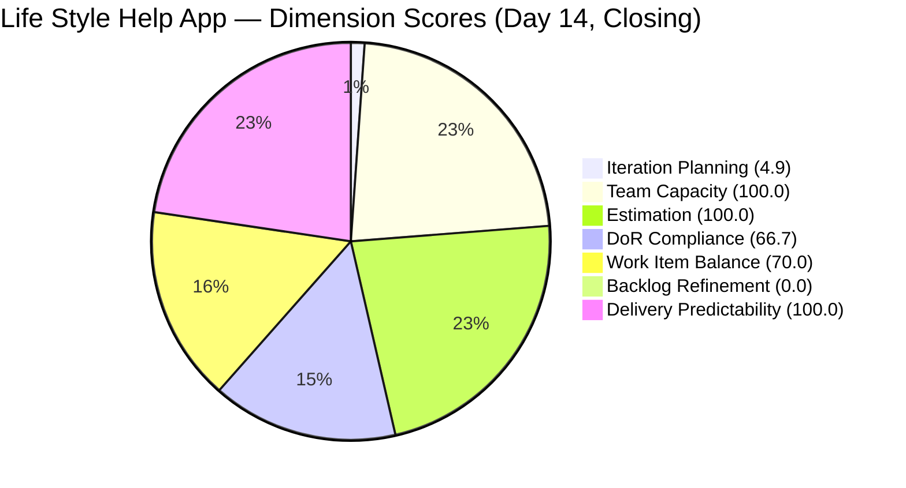
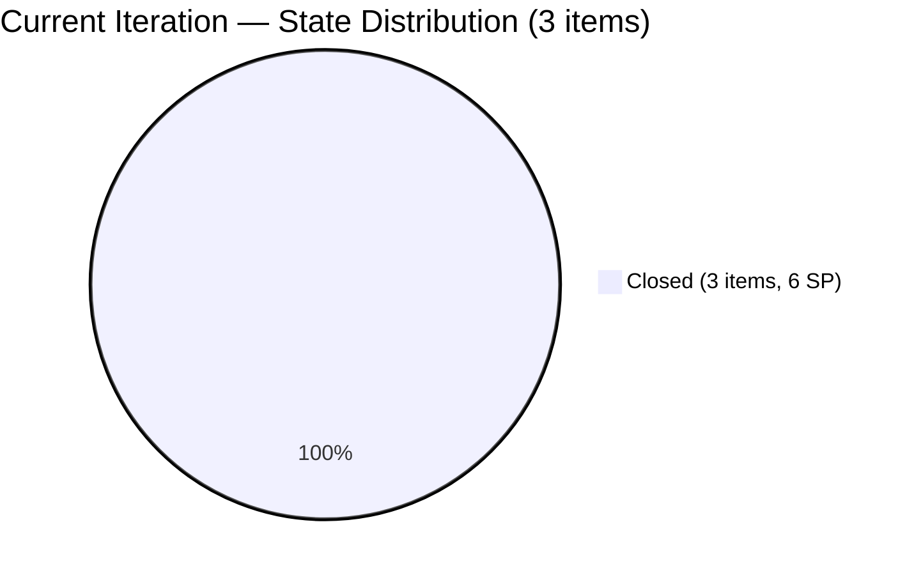
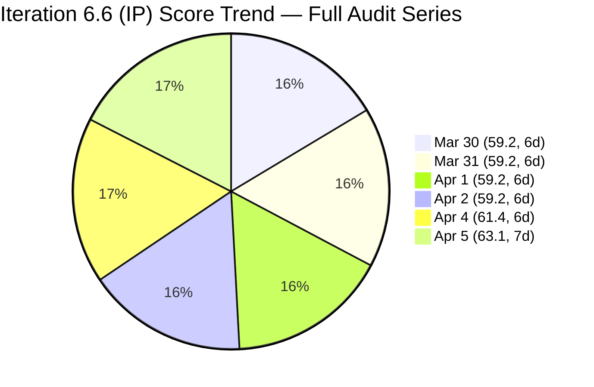

# SAFe Audit Report — Life Style Help App

## 1. Audit Metadata

| Field | Value |
|-------|-------|
| **Project** | Life Style Help App |
| **Team** | Life Style Help App Team |
| **Workspace** | `ado_ls_dev` |
| **ADO Project ID** | 0f447778-7156-4451-ab21-27be3c4a5888 |
| **Current Iteration** | Iteration 6.6 (IP) |
| **Iteration Path** | Life Style Help App\2026-PI6\Iteration 6.6 (IP) |
| **Iteration Start** | March 23, 2026 |
| **Iteration Finish** | April 5, 2026 |
| **Iteration Day** | Day 14 of 14 (100% elapsed) — CLOSING DAY |
| **Audit Date** | 2026-04-05 |
| **Previous Audit** | AUDIT_20260404_0900.md (Apr 4, 2026 — Day 13, Score: 61.4) |
| **Scoring Rubric** | ADO SAFe v1 (seven-dimension deterministic scoring) |
| **Overall Score** | **63.1 / 100** |
| **Risk Band** | **Moderate Risk** |

---

## 2. Executive Summary

The Life Style Help App Team scores **63.1/100 (Moderate Risk)** on the closing day (Day 14) of Iteration 6.6 (IP), a **+1.7 point improvement** from the prior audit (61.4, Day 13). This is the team's highest score of the iteration and represents two consecutive audits in the Moderate Risk band.

The most significant change since the prior audit is that **9 of the 12 items previously in Iteration 6.6 (IP) have been moved to Iteration 7.1** as part of PI transition planning. This left only 3 root items in the current iteration: #196378, #201317, and #201596 — all now **Closed**. The Spike #201596 (Guide Lifestyle QA Interns) was Closed since the last audit, the first new closure since Mar 31. The sprint ends with a **100% closure rate on remaining items** (6 SP credited out of 6 SP committed in-iteration).

However, structural issues persist. **Backlog Refinement remains at 0.0 for the tenth consecutive audit** — 30 items older than 180 days and 47 items older than 90 days remain untouched. The new **Delivery Predictability dimension scores 100.0** since all committed items were closed, though 9 items (14 SP) were moved out rather than completed.

---

## 3. Previous Audit Delta

| Dimension | Prior (Apr 4, Day 13) | Current (Apr 5, Day 14) | Delta |
|-----------|----------------------|-------------------------|-------|
| Iteration Planning | 18.2 | 4.9 | -13.3 |
| Team Capacity | 100.0 | 100.0 | 0.0 |
| Estimation | 100.0 | 100.0 | 0.0 |
| DoR Compliance | 50.0 | 66.7 | +16.7 |
| Work Item Balance | 100.0 | 70.0 | -30.0 |
| Backlog Refinement | 0.0 | 0.0 | 0.0 |
| Delivery Predictability | N/A (new dim) | 100.0 | — |
| **Overall** | **61.4 (6-dim)** | **63.1 (7-dim)** | **+1.7** |

**Key observations since the prior Day 13 audit:**
- **9 items moved from 6.6 (IP) to 7.1:** #195715, #195727, #195735, #196379, #196380, #198775, #201158, #201162, #201174. This is the PI transition — items not completed in IP are carried forward.
- **#201596 (Spike) Closed:** Previously Active, now Closed (Changed Apr 6 at 07:07 UTC, within the sprint-close window). All 3 remaining items are now Closed.
- **Iteration Planning dropped from 18.2 to 4.9** — only 3 items remain in iteration vs 61 on the backlog.
- **DoR Compliance improved from 50.0 to 66.7** — 2 of 3 remaining items are DoR-compliant. #201596 (Spike) has no Description or AC.
- **Work Item Balance dropped from 100.0 to 70.0** — with only 3 items (2 User Story, 1 Spike), User Story dominates at 66.7%, triggering the -30 penalty.
- **Backlog visible count decreased from 66 to 61** — 3 Closed items left the backlog; items redistributed during PI transition.
- **Scoring model upgraded from 6-dimension to 7-dimension** with the addition of Delivery Predictability.

---

## 4. Current Iteration Snapshot

| Metric | Value |
|--------|-------|
| Iteration | 6.6 (IP) — Mar 23 to Apr 5, 2026 |
| Visible root backlog items | 61 |
| Current iteration root items | 3 |
| Total Story Points (current) | 6 SP |
| Closed items | 3 (6 SP credited — 100%) |
| Active items | 0 |
| Contributors with current work | 3 (Ike Yana, Samantha Babael, Luzmibel Paculanang) |
| Contributors with capacity configured | 3 |
| Point-eligible current items | 3 (2 User Stories + 1 Spike) |
| Estimated current items | 3 |
| DoR-compliant current items | 2 |
| Fresh items (changed within 45 days) | 12 / 61 (19.7%) |
| Stale > 90 days | 47 / 61 (77.0%) |
| Stale > 180 days | 30 / 61 (49.2%) |
| Untouched current items (changed < Mar 23) | 0 / 3 (0.0%) |

---

## 5. Work Item Analysis

### Current Iteration Items (3)

| ID | Type | State | Assigned To | SP | DoR | Changed |
|----|------|-------|-------------|-----|-----|---------|
| 196378 | User Story | **Closed** | Ike Yana | 1 | Pass | Mar 26 |
| 201317 | User Story | **Closed** | Samantha Babael | 2 | Pass | Mar 31 |
| 201596 | Spike | **Closed** | Luzmibel Paculanang | 3 | Fail (no desc/AC) | Apr 6 |

### Items Moved to Iteration 7.1 (9 — formerly in 6.6 IP)

| ID | Type | State | Assigned To | SP | Notes |
|----|------|-------|-------------|-----|-------|
| 195715 | Defect | Ready for Dev | Samantha Babael | 1 | Carried forward; no AC |
| 195727 | User Story | Estimation | Ike Yana | 2 | In Estimation entire sprint; no AC |
| 195735 | User Story | Ready for Dev | Samantha Babael | 2 | Carried forward |
| 196379 | Spike | Active | Ike Yana | 1 | Carried forward |
| 196380 | User Story | Ready for Dev | Ike Yana | 2 | Carried forward |
| 198775 | Defect | Ready for Dev | Samantha Babael | 1 | Carried forward; no AC |
| 201158 | Defect | Active | Samantha Babael | 1 | Carried forward; no AC |
| 201162 | Defect | Ready for Dev | Samantha Babael | 2 | Carried forward; no AC |
| 201174 | User Story | Ready for Dev | Samantha Babael | 2 | Carried forward |

### Ownership Distribution (Current Iteration)

| Contributor | Items | Share |
|-------------|-------|-------|
| Ike Yana | 1 | 33.3% |
| Samantha Babael | 1 | 33.3% |
| Luzmibel Paculanang | 1 | 33.3% |

### Type Distribution (Current Iteration)

| Type | Count | Share |
|------|-------|-------|
| User Story | 2 | 66.7% |
| Spike | 1 | 33.3% |

### State Distribution

| State | Count | SP |
|-------|-------|----|
| Closed | 3 | 6 |

All 3 items in the iteration are Closed. Sprint closes at 100% completion of remaining scope.

### Backlog Age Profile (61 visible items)

| Age Bucket | Count | Share |
|------------|-------|-------|
| Fresh (within 45 days) | 12 | 19.7% |
| Not fresh but < 90 days | 2 | 3.3% |
| Stale 90-180 days | 17 | 27.9% |
| Stale > 180 days | 30 | 49.2% |

---

## 6. SAFe Compliance Scorecard

| Dimension | Score | Evidence | Notes |
|-----------|-------|----------|-------|
| Iteration Planning | 4.9 | 3 current / 61 visible | -13.3 from prior; 9 items moved to 7.1 during PI transition |
| Team Capacity | 100.0 | 3 contributors with capacity / 3 with work | All contributors have configured capacity |
| Estimation | 100.0 | 3 estimated / 3 point-eligible | All items estimated |
| DoR Compliance | 66.7 | 2 compliant / 3 current | +16.7; #201596 Spike has no desc/AC |
| Work Item Balance | 70.0 | User Stories 66.7% > 60% dominant | -30 penalty; small sample (3 items) |
| Backlog Refinement | 0.0 | base 19.7 - 20 (stale90 77%) - 20 (stale180: 30) = -20.3 -> 0 | 10th consecutive audit at 0.0 |
| Delivery Predictability | 100.0 | 6 SP closed / 6 SP committed | All committed items delivered |
| **Overall** | **63.1** | Average of 7 dimensions | **Moderate Risk** (60-79.9 band) |

### Score Computation Detail

| Dimension | Formula | Calculation | Result |
|-----------|---------|-------------|--------|
| Iteration Planning | current / visible x 100 | 3 / 61 x 100 | 4.9 |
| Team Capacity | cap / work_assignees x 100 | 3 / 3 x 100 | 100.0 |
| Estimation | estimated / point_eligible x 100 | 3 / 3 x 100 | 100.0 |
| DoR Compliance | dor_compliant / current x 100 | 2 / 3 x 100 | 66.7 |
| Work Item Balance | 100 - penalties | 100 - 30 (dominant > 60%) | 70.0 |
| Backlog Refinement | base - penalties | 19.7 - 40 -> 0 | 0.0 |
| Delivery Predictability | closed_sp / committed_sp x 100 | 6 / 6 x 100 | 100.0 |
| **Overall** | average(all 7) | (4.9+100+100+66.7+70+0+100)/7 | **63.1** |

---

## 7. Dimension Findings

### 7.1 Iteration Planning (4.9) — Critical Drop (-13.3)
Only 3 of 61 visible items remain in Iteration 6.6 (IP). The sharp drop from 18.2 is due to 9 items being moved to Iteration 7.1 as part of PI transition. This is expected sprint-closure behavior for an IP iteration — unfinished work is carried forward. However, the denominator remains inflated by 30 items older than 180 days, which were supposed to be groomed during the IP sprint.

### 7.2 Team Capacity (100.0) — Healthy
Three contributors (Samantha Babael 1 hr/day Development, Ike Yana 1 hr/day Development, Luzmibel Paculanang 1 hr/day Testing) all have capacity configured. Total capacity: 3 hr/day. No days off recorded.

### 7.3 Estimation (100.0) — Full Score
All 3 current iteration items have Story Points assigned: #196378 (1 SP), #201317 (2 SP), #201596 (3 SP).

### 7.4 DoR Compliance (66.7) — Improved (+16.7)
2 of 3 current items pass DoR. The non-compliant item is:
- **#201596** (Spike): No Description, no Acceptance Criteria — Closed with 3 SP committed but no documented scope. This represents a DoR process gap even for completed work.

### 7.5 Work Item Balance (70.0) — Dropped (-30.0)
With only 3 items, User Story comprises 66.7% (2 of 3), triggering the -30 dominant type penalty. This is a small-sample-size artifact — with 12 items in the prior audit, no type exceeded 60%.

### 7.6 Backlog Refinement (0.0) — Critical (10th consecutive audit at 0.0)
Base score: 19.7% (12 fresh / 61 visible). Two penalties apply:
- stale_90 / visible = 77.0% > 25% -> -20
- stale_180 >= 1 (30 items) -> -20

Combined: 19.7 - 40 = -20.3, floored to 0.0. The IP sprint's intended purpose of backlog hygiene was **not performed across the entire 14-day period**. This is the most critical systemic issue and has been flagged for 10 consecutive audits.

**Note:** The untouched penalty does not apply (0/3 = 0%) because all 3 remaining items were modified during the sprint.

### 7.7 Delivery Predictability (100.0) — Full Score
All 6 committed Story Points were delivered: #196378 (1 SP), #201317 (2 SP), #201596 (3 SP). However, this 100% score is contextually misleading — 9 items (14 SP) were moved out of the iteration rather than completed, inflating the delivery ratio. The effective sprint delivery across all originally committed items is 6 / 20 = 30%.

---

## 8. Risks and Bottlenecks

| Priority | Risk | Impact |
|----------|------|--------|
| CRITICAL | **30 items > 180 days stale — IP sprint hygiene unfulfilled (10th audit)** | Backlog Refinement = 0.0 systemically; PI7 starts tomorrow with same stale inventory |
| CRITICAL | **9 items carried forward to 7.1 — 14 SP undelivered from IP** | These items will compete with PI7 planned work; 75% of IP scope was deferred |
| HIGH | **#201596 Closed with no Description or AC** | DoR violation on Closed item; audit trail has no documented scope for 3 SP of work |
| HIGH | **5 items carried to 7.1 still lack Acceptance Criteria** | #195715, #195727, #198775, #201158, #201162 have no AC; DoR debt carries into PI7 |
| HIGH | **Samantha carries 6/9 carried items (67%)** | Bus factor persists into PI7; ownership concentration from 6.6 IP replicates |
| MODERATE | **#195727 in Estimation for entire IP sprint + carried** | Item has been in Estimation since at least Day 1 of 6.6 and is now in 7.1 still in Estimation |

---

## 9. Prioritized Recommendations

1. **[PI7 Day 1 — Immediate]** Add Acceptance Criteria to the 5 items carried to 7.1 missing AC (#195715, #195727, #198775, #201158, #201162). This prevents DoR debt from compounding.

2. **[PI7 Week 1]** Conduct a dedicated backlog grooming session to close, remove, or re-estimate the 30 items older than 180 days. This has been the P1 recommendation for 10 audits spanning 3+ weeks. Without this, Backlog Refinement will remain at 0.0 indefinitely.

3. **[PI7 Day 1]** Move #195727 from Estimation to Ready for Dev or descope. This item has been in Estimation for over 3 weeks across two iterations.

4. **[PI7 Planning]** Redistribute work from Samantha Babael. She carries 6 of 9 items entering 7.1 (67%). Assign at least 2-3 items to Ike Yana or Luzmibel Paculanang.

5. **[Process]** Enforce DoR compliance on Spikes before closure. #201596 was Closed without any Description or AC — a 3 SP item with no documented scope.

6. **[Process]** Establish a weekly backlog refinement cadence. Backlog Refinement has been 0.0 for 10 consecutive audits spanning the entire Iteration 6.6 (IP). This is systemic and requires a process change.

---

## 10. Evidence Gaps and Limitations

- **Scoring model transition:** This is the first audit using the 7-dimension rubric (adding Delivery Predictability). The prior audit used 6 dimensions, so the overall score is not directly comparable. The 6-dimension equivalent would be (4.9+100+100+66.7+70+0)/6 = 56.9.
- **Delivery Predictability context:** The 100% score reflects only the 3 items remaining in the iteration after 9 were moved out. The effective delivery rate for originally committed scope is 6/20 SP (30%).
- **#201596 ChangedDate is Apr 6 (07:07 UTC):** This is technically after the iteration finish date (Apr 5). The item was Closed in the transition window. It is counted as a sprint closure because it was still assigned to 6.6 (IP).
- **Backlog count dropped from 66 to 61:** The 3 Closed items left the backlog. Items were redistributed during PI transition.
- **Point eligibility:** User Story and Spike types are point-eligible; Defects are excluded per rubric convention.
- **Capacity data:** 3 hr/day total team capacity with 0 days off. Individual: Samantha 1 hr/day Development, Ike 1 hr/day Development, Luzmibel 1 hr/day Testing.

---

> Note: Backlog Refinement shown as 0.1 for chart visibility; actual score is 0.0.

---

*Report generated by ADO SAFe audit agent (Team Charlie). Audit date: 2026-04-05 (Day 14 of Iteration 6.6 IP — Closing Day).*
*Scoring rubric: ADO SAFe v1 (seven-dimension deterministic scoring).*
*Previous: AUDIT_20260404_0900.md (Day 13, 61.4/100, 6-dimension) | +1.7 change (model transition)*
