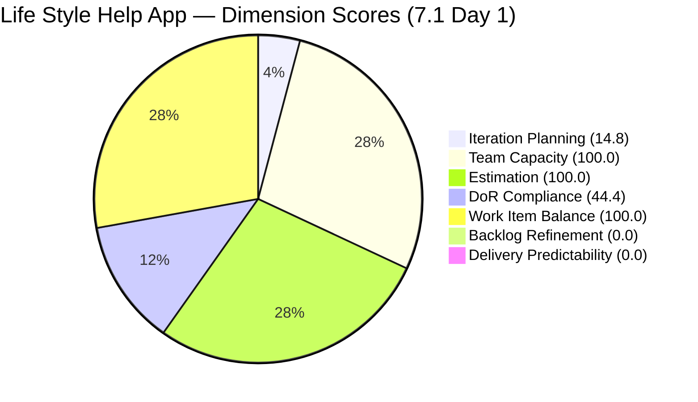
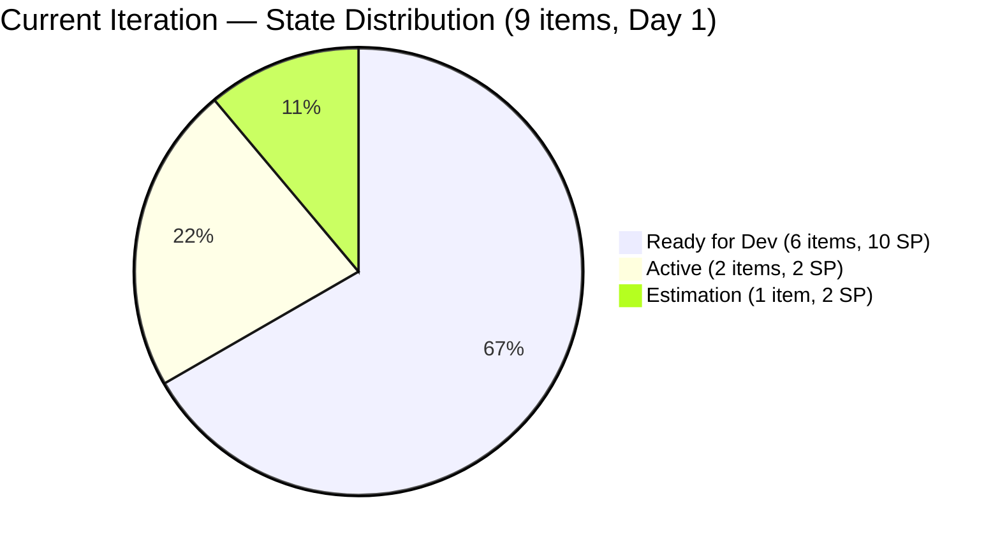
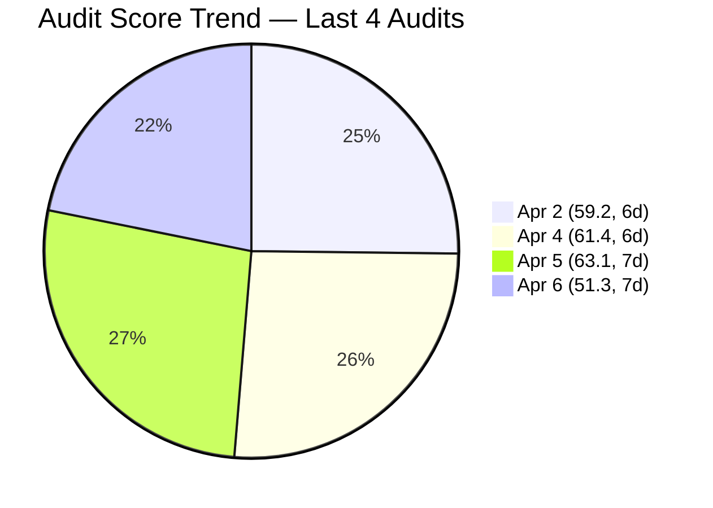

# SAFe Audit Report — Life Style Help App

## 1. Audit Metadata

| Field | Value |
|-------|-------|
| **Project** | Life Style Help App |
| **Team** | Life Style Help App Team |
| **Workspace** | `ado_ls_dev` |
| **ADO Project ID** | 0f447778-7156-4451-ab21-27be3c4a5888 |
| **Current Iteration** | Iteration 7.1 |
| **Iteration Path** | Life Style Help App\2026-PI7\Iteration 7.1 |
| **Iteration Start** | April 6, 2026 |
| **Iteration Finish** | April 19, 2026 |
| **Iteration Day** | Day 1 of 14 (7% elapsed) |
| **Audit Date** | 2026-04-06 (PST) |
| **Previous Audit** | AUDIT_20260405_0900.md (Apr 5, 2026 — Day 14 closing, Iteration 6.6 IP, Score: 63.1) |
| **Scoring Rubric** | ADO SAFe v1 (seven-dimension deterministic scoring) |
| **Overall Score** | **51.3 / 100** |
| **Risk Band** | **High Risk** |

---

## 2. Executive Summary

The Life Style Help App Team scores **51.3/100 (High Risk)** on Day 1 of Iteration 7.1, the opening sprint of PI7. This is an **-11.8 point drop** from the prior closing audit of Iteration 6.6 IP (63.1, Moderate Risk), pushing the team into the High Risk band for the first time in the audit series.

The drop is driven by two zero-scoring dimensions: **Backlog Refinement (0.0)** continues its systemic failure from 11 consecutive audits, and **Delivery Predictability (0.0)** is expected on Day 1 with no closed items. Additionally, **DoR Compliance plummeted to 44.4** because 5 of the 9 items carried forward from 6.6 IP still lack Acceptance Criteria — the exact deficiency flagged as P1 in the closing audit.

The 9 items now in Iteration 7.1 are the same 9 items that were moved out of 6.6 IP during PI transition. No new items were added for PI7 planning. **Samantha Babael carries 6 of 9 items (67%)**, the same ownership concentration flagged in the prior audit. The backlog remains burdened with **30 items older than 180 days** that have never been groomed.

---

## 3. Previous Audit Delta

| Dimension | Prior (Apr 5, 6.6 IP Day 14) | Current (Apr 6, 7.1 Day 1) | Delta |
|-----------|-------------------------------|------------------------------|-------|
| Iteration Planning | 4.9 | 14.8 | +9.9 |
| Team Capacity | 100.0 | 100.0 | 0.0 |
| Estimation | 100.0 | 100.0 | 0.0 |
| DoR Compliance | 66.7 | 44.4 | -22.3 |
| Work Item Balance | 70.0 | 100.0 | +30.0 |
| Backlog Refinement | 0.0 | 0.0 | 0.0 |
| Delivery Predictability | 100.0 | 0.0 | -100.0 |
| **Overall** | **63.1** | **51.3** | **-11.8** |

**Key observations:**

- **New iteration, new PI:** Iteration 7.1 is the first sprint of PI7. The 9 items are carried forward from 6.6 IP — these were the items moved to 7.1 during the IP closing.
- **Iteration Planning improved from 4.9 to 14.8** — 9 items in iteration vs 3 in the closing snapshot. Denominator remains 61.
- **DoR Compliance dropped from 66.7 to 44.4** — with 9 items now evaluated (vs 3), the 5 items missing AC (#195715, #195727, #198775, #201158, #201162) are exposed. This was the P1 recommendation from the closing audit.
- **Work Item Balance improved from 70.0 to 100.0** — with 9 items across 3 types (User Story, Defect, Spike), no type exceeds 60% dominance.
- **Delivery Predictability dropped from 100.0 to 0.0** — expected on Day 1 with 0 SP closed. The prior 100.0 reflected closing-day completion of remaining scope.
- **3 Closed items from 6.6 IP** (#196378, #201317, #201596) are no longer on the backlog — they dropped off after sprint closure.
- **Capacity updated:** Luzmibel Paculanang has 2 days off (Apr 9-10) in 7.1.

---

## 4. Current Iteration Snapshot

| Metric | Value |
|--------|-------|
| Iteration | 7.1 — Apr 6 to Apr 19, 2026 |
| Visible root backlog items | 61 |
| Current iteration root items | 9 |
| Total Story Points (current) | 14 SP |
| Closed items | 0 |
| Active items | 2 (#196379, #201158) |
| Ready for Dev / Estimation | 7 |
| Contributors with current work | 2 (Samantha Babael, Ike Yana) |
| Contributors with capacity configured | 2 (Samantha, Ike — both have capacity) |
| Point-eligible current items | 9 |
| Estimated current items | 9 |
| DoR-compliant current items | 4 |
| Fresh items (changed within 45 days) | 12 / 61 (19.7%) |
| Stale > 90 days | 47 / 61 (77.0%) |
| Stale > 180 days | 30 / 61 (49.2%) |
| Untouched current items (changed < Apr 6) | 0 / 9 (0.0%) |

---

## 5. Work Item Analysis

### Current Iteration Items (9)

| ID | Type | State | Assigned To | SP | DoR | Changed |
|----|------|-------|-------------|-----|-----|---------|
| 195715 | Defect | Ready for Dev | Samantha Babael | 1 | Fail (no AC) | Apr 6 |
| 195727 | User Story | Estimation | Ike Yana | 2 | Fail (no AC) | Apr 6 |
| 195735 | User Story | Ready for Dev | Samantha Babael | 2 | Pass | Apr 6 |
| 196379 | Spike | Active | Ike Yana | 1 | Pass | Apr 6 |
| 196380 | User Story | Ready for Dev | Ike Yana | 2 | Pass | Apr 6 |
| 198775 | Defect | Ready for Dev | Samantha Babael | 1 | Fail (no AC) | Apr 6 |
| 201158 | Defect | Active | Samantha Babael | 1 | Fail (no AC) | Apr 6 |
| 201162 | Defect | Ready for Dev | Samantha Babael | 2 | Fail (no AC) | Apr 6 |
| 201174 | User Story | Ready for Dev | Samantha Babael | 2 | Pass | Apr 6 |

### Ownership Distribution (Current Iteration)

| Contributor | Items | SP | Share |
|-------------|-------|----|-------|
| Samantha Babael | 6 | 9 | 66.7% |
| Ike Yana | 3 | 5 | 33.3% |

### Type Distribution (Current Iteration)

| Type | Count | Share |
|------|-------|-------|
| User Story | 4 | 44.4% |
| Defect | 4 | 44.4% |
| Spike | 1 | 11.1% |

### State Distribution

| State | Count | SP |
|-------|-------|----|
| Ready for Dev | 6 | 10 |
| Active | 2 | 2 |
| Estimation | 1 | 2 |

### Backlog Age Profile (61 visible items)

| Age Bucket | Count | Share |
|------------|-------|-------|
| Fresh (within 45 days) | 12 | 19.7% |
| Not fresh but < 90 days | 2 | 3.3% |
| Stale 90-180 days | 17 | 27.9% |
| Stale > 180 days | 30 | 49.2% |

---

## 6. SAFe Compliance Scorecard

| Dimension | Score | Evidence | Notes |
|-----------|-------|----------|-------|
| Iteration Planning | 14.8 | 9 current / 61 visible | +9.9 from prior; PI7 starts with carried items |
| Team Capacity | 100.0 | 2 contributors with capacity / 2 with work | Samantha + Ike configured; Luzmibel has capacity but no items |
| Estimation | 100.0 | 9 estimated / 9 point-eligible | All items estimated |
| DoR Compliance | 44.4 | 4 compliant / 9 current | -22.3; 5 items lack Acceptance Criteria |
| Work Item Balance | 100.0 | No penalties triggered | User Story 44%, Defect 44%, Spike 11% |
| Backlog Refinement | 0.0 | base 19.7 - 20 (stale90 77%) - 20 (stale180: 30) = -20.3 -> 0 | 11th consecutive audit at 0.0 |
| Delivery Predictability | 0.0 | 0 SP closed / 14 SP committed | Early-sprint Day 1 — low delivery expected |
| **Overall** | **51.3** | Average of 7 dimensions | **High Risk** (40-59.9 band) |

### Score Computation Detail

| Dimension | Formula | Calculation | Result |
|-----------|---------|-------------|--------|
| Iteration Planning | current / visible x 100 | 9 / 61 x 100 | 14.8 |
| Team Capacity | cap / work_assignees x 100 | 2 / 2 x 100 | 100.0 |
| Estimation | estimated / point_eligible x 100 | 9 / 9 x 100 | 100.0 |
| DoR Compliance | dor_compliant / current x 100 | 4 / 9 x 100 | 44.4 |
| Work Item Balance | 100 - penalties | 100 - 0 | 100.0 |
| Backlog Refinement | base - penalties | 19.7 - 40 -> 0 | 0.0 |
| Delivery Predictability | closed_sp / committed_sp x 100 | 0 / 14 x 100 | 0.0 |
| **Overall** | average(all 7) | (14.8+100+100+44.4+100+0+0)/7 | **51.3** |

---

## 7. Dimension Findings

### 7.1 Iteration Planning (14.8) — Improved (+9.9)

9 of 61 visible backlog items are in Iteration 7.1. The improvement from 4.9 is mechanical — the closing audit had only 3 items remaining after PI transition. The denominator remains 61, unchanged from the prior audit. The fundamental issue is the denominator inflation from 30 items older than 180 days that were never groomed during the IP sprint.

### 7.2 Team Capacity (100.0) — Healthy

Samantha Babael (1 hr/day Development) and Ike Yana (1 hr/day Development) are the two contributors with assigned work, and both have capacity configured. Luzmibel Paculanang (1 hr/day Testing) has capacity configured but no items assigned in the current iteration. Total team capacity: 3 hr/day with 2 days off for Luzmibel (Apr 9-10).

### 7.3 Estimation (100.0) — Full Score

All 9 current iteration items have Story Points assigned. Total committed: 14 SP.

### 7.4 DoR Compliance (44.4) — Critical Drop (-22.3)

Only 4 of 9 items pass DoR. The 5 non-compliant items all lack Acceptance Criteria:

- **#195715** (Defect): Description present, no AC
- **#195727** (User Story): Description present, no AC
- **#198775** (Defect): Description present, no AC
- **#201158** (Defect): Description present, no AC
- **#201162** (Defect): Description present, no AC

These are the same 5 items flagged as P1 in the closing audit (AUDIT_20260405_0900.md). The recommendation to add AC before PI7 Day 1 was not executed.

### 7.5 Work Item Balance (100.0) — Full Score (+30.0)

With 9 items across 3 types — User Story (44.4%), Defect (44.4%), Spike (11.1%) — no single type exceeds 60%. The improvement from 70.0 is due to the larger, more diverse item set compared to the 3-item closing snapshot.

### 7.6 Backlog Refinement (0.0) — Critical (11th consecutive audit at 0.0)

Base score: 19.7% (12 fresh / 61 visible). Penalties:

- stale_90 / visible = 77.0% > 25% -> -20
- stale_180 >= 1 (30 items) -> -20
- untouched = 0% -> no penalty

Combined: 19.7 - 40 = -20.3, floored to 0.0. The PI7 opening inherits the same stale backlog that the IP sprint was supposed to clean. This is now the **longest-running systemic failure** across all audited teams — 11 consecutive audits spanning 4 weeks with zero improvement.

### 7.7 Delivery Predictability (0.0) — Early-Sprint Day 1

0 of 14 committed SP closed. This is expected on Day 1 and carries an early-sprint annotation. No formula adjustment applied per rubric.

---

## 8. Risks and Bottlenecks

| Priority | Risk | Impact |
|----------|------|--------|
| CRITICAL | **30 items > 180 days stale — 11th consecutive audit at BR 0.0** | Backlog Refinement will remain 0.0 until these items are groomed; PI7 starts with same debt |
| CRITICAL | **5 of 9 iteration items lack Acceptance Criteria** | DoR = 44.4 (High Risk); developers begin work without documented scope; defect regression risk |
| HIGH | **Samantha carries 6/9 items (67%)** | Single-person delivery risk; if Samantha is blocked, 67% of sprint scope stalls |
| HIGH | **#195727 in Estimation for 4+ weeks** | Item has been in Estimation since at least Iteration 6.6 IP Day 1 (Mar 23); no forward movement |
| HIGH | **Luzmibel has no iteration items despite having capacity** | Testing capacity unused; no QA items in sprint; 2 days off further reduces her availability |
| MODERATE | **All items carried forward — no new PI7 planning work** | Sprint contains only unfinished 6.6 IP work; no evidence of PI7 planning or new feature intake |

---

## 9. Prioritized Recommendations

1. **[Day 1 — Immediate]** Add Acceptance Criteria to the 5 items missing AC: #195715, #195727, #198775, #201158, #201162. This is the **P1 recommendation from the closing audit, now carried to its 2nd sprint unactioned**. Estimated effort: 30-45 minutes. Impact: DoR rises from 44.4 to 100.0 (+55.6 points on that dimension, +7.9 overall).

2. **[Week 1]** Conduct a dedicated backlog grooming session to close, remove, or re-estimate the 30 items older than 180 days. This has been the top recommendation for **11 consecutive audits spanning 4+ weeks**. Without this, Backlog Refinement will remain permanently at 0.0.

3. **[Day 1]** Move #195727 from Estimation to Ready for Dev or descope it entirely. This item has been in Estimation for over 4 weeks across two iterations.

4. **[Day 1-2]** Assign at least 2-3 items to Luzmibel Paculanang or redistribute from Samantha. Currently 0 items are assigned to Luzmibel despite her having capacity configured. Samantha's 67% ownership concentration is a bus factor risk.

5. **[Week 1]** Add new PI7 feature work to the sprint. Currently all 9 items are carry-forward from 6.6 IP — there is no evidence of PI7 planning or new capability intake.

6. **[Process]** Establish a recurring weekly backlog refinement ceremony. The 0.0 score for 11 audits indicates the absence of any regular grooming practice.

---

## 10. Evidence Gaps and Limitations

- **Day 1 context:** Delivery Predictability at 0.0 is expected and annotated as early-sprint. This dimension will normalize as the sprint progresses.
- **Carry-forward items:** All 9 iteration items were moved from 6.6 IP. Their ChangedDate of Apr 6 reflects the PI transition move, not substantive work. Prior states and history are from the 6.6 IP sprint.
- **Luzmibel capacity anomaly:** Luzmibel has 1 hr/day Testing capacity configured but no items assigned in the iteration. She was assigned to #201596 (Spike, Closed in 6.6 IP) but has no 7.1 items.
- **Backlog count stable at 61:** The 3 Closed items from 6.6 IP dropped off the backlog. No new items were added to the backlog for PI7 planning in this workspace.
- **Point eligibility:** All work item types in the Stories and Deliverables backlog (User Story, Defect, Spike) expose Story Points and are treated as point-eligible per rubric.

---

> Note: Backlog Refinement and Delivery Predictability shown as 0.1 for chart visibility; actual scores are 0.0.

---

*Report generated by ADO SAFe audit agent (Team Charlie). Audit date: 2026-04-06 (Day 1 of Iteration 7.1).*
*Scoring rubric: ADO SAFe v1 (seven-dimension deterministic scoring).*
*Previous: AUDIT_20260405_0900.md (Day 14 closing, 63.1/100, Iteration 6.6 IP) | -11.8 change (new iteration)*
