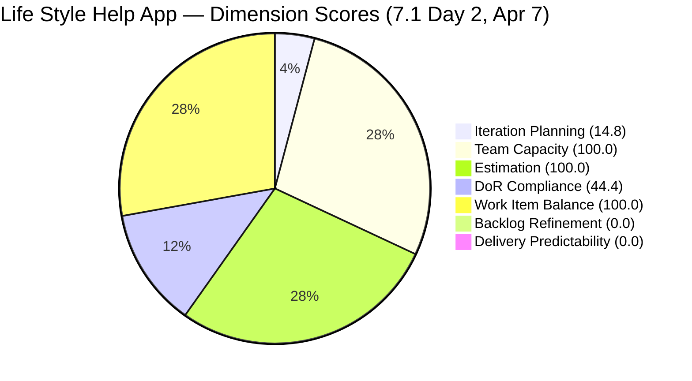
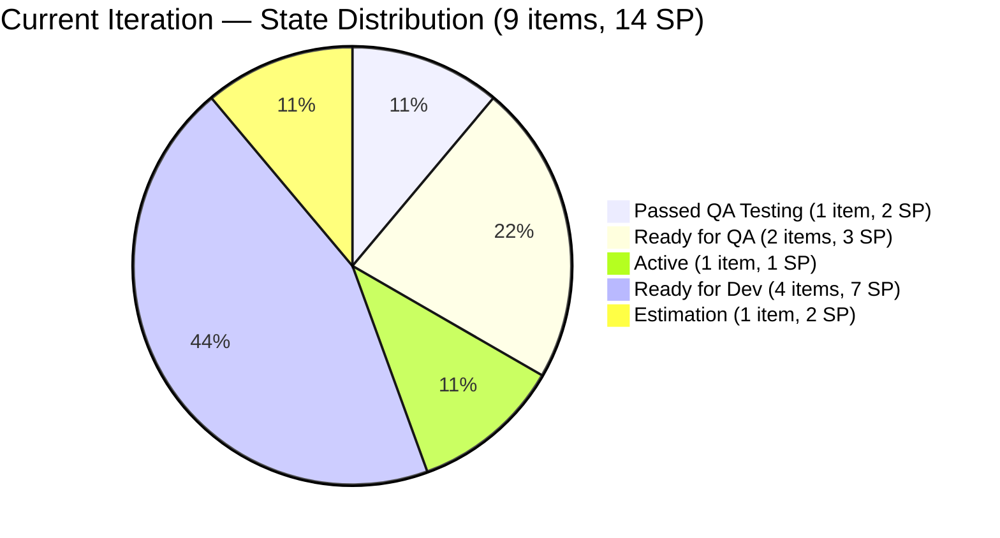
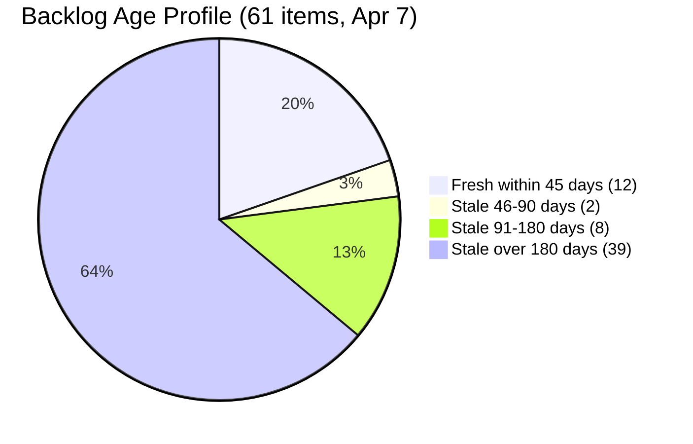
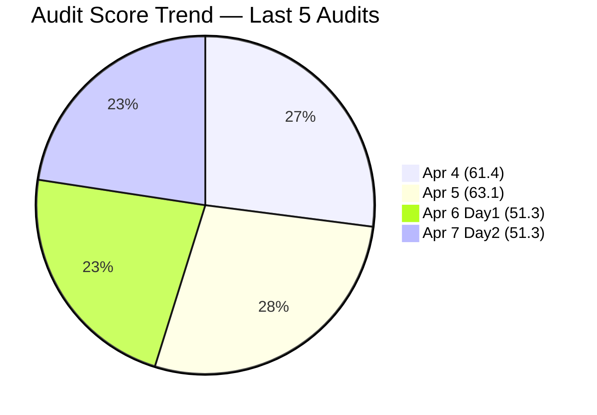

# SAFe Audit Report — Life Style Help App

## 1. Audit Metadata

| Field | Value |
|-------|-------|
| **Project** | Life Style Help App |
| **Team** | Life Style Help App Team |
| **Workspace** | `ado_ls_dev` |
| **ADO Project ID** | 0f447778-7156-4451-ab21-27be3c4a5888 |
| **Current Iteration** | Iteration 7.1 |
| **Iteration Path** | Life Style Help App\2026-PI7\Iteration 7.1 |
| **Iteration Start** | April 6, 2026 |
| **Iteration Finish** | April 19, 2026 |
| **Iteration Day** | Day 2 of 14 (14% elapsed) |
| **Audit Date** | 2026-04-07 |
| **Previous Audit** | AUDIT_20260406_0900.md (Apr 6, 2026 — Day 1, Iteration 7.1, Score: 51.3) |
| **Scoring Rubric** | ADO SAFe v1 (seven-dimension deterministic scoring) |
| **Overall Score** | **51.3 / 100** |
| **Risk Band** | **High Risk** |

---

## 2. Executive Summary

The Life Style Help App Team holds at **51.3/100 (High Risk)** on Day 2 of Iteration 7.1 — unchanged from Day 1. The score stability masks meaningful delivery progress: three items advanced in state (#195735 moved to Ready for QA, #201158 moved to Ready for QA, #201174 reached Passed QA Testing), indicating active work but not yet closed Story Points.

The most significant negative development is a **stale_180 count jump from 30 to 39 items** — an increase of 9 items in a single day. This is not due to new old work appearing; rather, items that were previously within the 180-day staleness window crossed the threshold on April 7. This makes the Backlog Refinement dimension permanently pinned at 0.0 with an even more severe penalty profile.

The five DoR failures from Day 1 remain unresolved. Acceptance Criteria has not been added to #195715, #195727, #198775, #201158, or #201162 — this is the **third consecutive sprint** this recommendation has been carried without action. Samantha Babael's ownership concentration remains at 67% (6 of 9 items).

---

## 3. Previous Audit Delta

| Dimension | Prior (Apr 6, 7.1 Day 1) | Current (Apr 7, 7.1 Day 2) | Delta |
|-----------|--------------------------|------------------------------|-------|
| Iteration Planning | 14.8 | 14.8 | 0.0 |
| Team Capacity | 100.0 | 100.0 | 0.0 |
| Estimation | 100.0 | 100.0 | 0.0 |
| DoR Compliance | 44.4 | 44.4 | 0.0 |
| Work Item Balance | 100.0 | 100.0 | 0.0 |
| Backlog Refinement | 0.0 | 0.0 | 0.0 |
| Delivery Predictability | 0.0 | 0.0 | 0.0 |
| **Overall** | **51.3** | **51.3** | **0.0** |

**Key observations:**

- **Score unchanged at 51.3** — numerical stability does not indicate process stagnation; three items advanced in state today.
- **State movement:** #195735 (US, Samantha) advanced to Ready for QA; #201158 (Defect, Samantha) advanced to Ready for QA; #201174 (US, Samantha) reached Passed QA Testing. These items are approaching closure.
- **stale_180 jumped from 30 to 39** — 9 additional items crossed the 180-day staleness boundary on Apr 7. The Backlog Refinement penalty profile is now more severe than Day 1.
- **DoR failures unchanged** — the 5 items lacking Acceptance Criteria (#195715, #195727, #198775, #201158, #201162) remain non-compliant. This is the P1 recommendation carried from the Iteration 6.6 IP closing audit (Apr 5) through Day 1 (Apr 6) and now Day 2 (Apr 7).
- **No closed Story Points** — 0 SP closed / 14 SP committed. Delivery Predictability remains 0.0. Items in Ready for QA and Passed QA Testing pipeline signals upcoming closures if QA is completed.

---

## 4. Current Iteration Snapshot

| Metric | Value |
|--------|-------|
| Iteration | 7.1 — Apr 6 to Apr 19, 2026 |
| Visible root backlog items | 61 |
| Current iteration root items | 9 |
| Total Story Points (current) | 14 SP |
| Closed Story Points | 0 SP |
| Items in QA pipeline (Ready for QA + Passed QA) | 3 (#195735, #201158, #201174) |
| Active items | 1 (#196379) |
| Ready for Dev / Estimation | 5 |
| Contributors with current work | 2 (Samantha Babael, Ike Yana) |
| Contributors with capacity configured | 2 (Samantha, Ike) |
| Point-eligible current items | 9 |
| Estimated current items | 9 |
| DoR-compliant current items | 4 |
| Fresh items (changed within 45 days) | 12 / 61 (19.7%) |
| Stale > 90 days | 47 / 61 (77.0%) |
| Stale > 180 days | 39 / 61 (63.9%) |
| Untouched current items (changed < Apr 6) | 0 / 9 (0.0%) |

---

## 5. Work Item Analysis

### Current Iteration Items (9)

| ID | Type | State | Assigned To | SP | DoR | Changed |
|----|------|-------|-------------|-----|-----|---------|
| 195715 | Defect | Ready for Dev | Samantha Babael | 1 | Fail (no AC) | Apr 6 |
| 195727 | User Story | Estimation | Ike Yana | 2 | Fail (no AC) | Apr 6 |
| 195735 | User Story | Ready for QA | Samantha Babael | 2 | Pass | Apr 7 |
| 196379 | Spike | Active | Ike Yana | 1 | Pass | Apr 6 |
| 196380 | User Story | Ready for Dev | Ike Yana | 2 | Pass | Apr 6 |
| 198775 | Defect | Ready for Dev | Samantha Babael | 1 | Fail (no AC) | Apr 6 |
| 201158 | Defect | Ready for QA | Samantha Babael | 1 | Fail (no AC) | Apr 7 |
| 201162 | Defect | Ready for Dev | Samantha Babael | 2 | Fail (no AC) | Apr 6 |
| 201174 | User Story | Passed QA Testing | Samantha Babael | 2 | Pass | Apr 7 |

> Note: #201158 and #201162 have Acceptance Criteria missing despite being in Ready for QA and Ready for Dev. This violates DoR and represents a process gap — items were advanced without full DoR compliance.

### Ownership Distribution (Current Iteration)

| Contributor | Items | SP | Share |
|-------------|-------|----|-------|
| Samantha Babael | 6 | 9 | 66.7% |
| Ike Yana | 3 | 5 | 33.3% |

### Type Distribution (Current Iteration)

| Type | Count | Share |
|------|-------|-------|
| User Story | 4 | 44.4% |
| Defect | 4 | 44.4% |
| Spike | 1 | 11.1% |

### State Distribution

| State | Count | SP |
|-------|-------|----|
| Passed QA Testing | 1 | 2 |
| Ready for QA | 2 | 3 |
| Active | 1 | 1 |
| Ready for Dev | 4 | 7 |
| Estimation | 1 | 2 |

### Backlog Age Profile (61 visible items)

| Age Bucket | Count | Share |
|------------|-------|-------|
| Fresh (within 45 days) | 12 | 19.7% |
| Stale 90-180 days | 8 | 13.1% |
| Stale > 90 days | 47 | 77.0% |
| Stale > 180 days | 39 | 63.9% |

> Critical: stale_180 increased by 9 items (from 30 to 39) since Day 1 audit on Apr 6. These items crossed the 180-day boundary on Apr 7 and have never been groomed.

---

## 6. SAFe Compliance Scorecard

| Dimension | Score | Evidence | Notes |
|-----------|-------|----------|-------|
| Iteration Planning | 14.8 | 9 current / 61 visible | Stable; 61-item denominator includes 39 items >180d stale |
| Team Capacity | 100.0 | 2 contributors with capacity / 2 with work | Samantha + Ike configured; Luzmibel has capacity but no items |
| Estimation | 100.0 | 9 estimated / 9 point-eligible | All items estimated; total 14 SP committed |
| DoR Compliance | 44.4 | 4 compliant / 9 current | 5 items lack Acceptance Criteria — unchanged from Day 1 |
| Work Item Balance | 100.0 | No penalties triggered | US 44.4%, Defect 44.4%, Spike 11.1% — balanced |
| Backlog Refinement | 0.0 | base 19.7 - 20 (stale90 77%) - 20 (stale180: 39) = -20.3 → 0 | 12th consecutive audit at 0.0; stale_180 grew +9 items |
| Delivery Predictability | 0.0 | 0 SP closed / 14 SP committed | Early sprint Day 2; 3 items in QA pipeline nearing closure |
| **Overall** | **51.3** | Average of 7 dimensions | **High Risk** (40–59.9 band) |

### Score Computation Detail

| Dimension | Formula | Calculation | Result |
|-----------|---------|-------------|--------|
| Iteration Planning | current / visible × 100 | 9 / 61 × 100 | 14.8 |
| Team Capacity | cap / work_assignees × 100 | 2 / 2 × 100 | 100.0 |
| Estimation | estimated / point_eligible × 100 | 9 / 9 × 100 | 100.0 |
| DoR Compliance | dor_compliant / current × 100 | 4 / 9 × 100 | 44.4 |
| Work Item Balance | 100 − penalties | 100 − 0 | 100.0 |
| Backlog Refinement | base − penalties | 19.7 − 40 → 0 | 0.0 |
| Delivery Predictability | closed_sp / committed_sp × 100 | 0 / 14 × 100 | 0.0 |
| **Overall** | average(all 7) | (14.8+100+100+44.4+100+0+0)/7 | **51.3** |

---

## 7. Dimension Findings

### 7.1 Iteration Planning (14.8) — Stable

9 of 61 visible backlog items are in Iteration 7.1. The denominator (61) remains unchanged. Improving this score requires either moving more items into the iteration or pruning the 39 stale items from the backlog. Neither action has occurred since PI7 began.

### 7.2 Team Capacity (100.0) — Healthy

Samantha Babael (1 hr/day Development) and Ike Yana (1 hr/day Development) both have capacity configured and work assigned. Luzmibel Paculanang (1 hr/day Testing) retains capacity but has 0 iteration items — her QA skills appear relevant given three items now in the QA pipeline, but she has no assigned work.

### 7.3 Estimation (100.0) — Full Score

All 9 current iteration items have Story Points. Total committed: 14 SP. No change from Day 1.

### 7.4 DoR Compliance (44.4) — Persistent Failure (3rd sprint unresolved)

5 of 9 items still lack Acceptance Criteria:

- **#195715** (Defect): Description 179 chars, AC = 0 chars
- **#195727** (User Story): Description 327 chars, AC = 0 chars
- **#198775** (Defect): Description 72 chars, AC = 0 chars
- **#201158** (Defect): Description 75 chars, AC = 0 chars — now in Ready for QA without AC
- **#201162** (Defect): Description 105 chars, AC = 0 chars

Critically, #201158 has advanced to Ready for QA without having Acceptance Criteria. This means QA testing is being performed against undocumented acceptance requirements — a significant quality risk. This is the **third consecutive sprint** this deficiency has been flagged as P1 without resolution.

### 7.5 Work Item Balance (100.0) — Full Score

Type distribution remains balanced: User Story (44.4%), Defect (44.4%), Spike (11.1%). No single type exceeds 60%, no spike share exceeds 40%.

### 7.6 Backlog Refinement (0.0) — Critical (12th consecutive audit at 0.0)

Base score: 19.7% (12 fresh / 61 visible). Penalties:

- stale_90 / visible = 47/61 = 77.0% > 25% → −20
- stale_180 ≥ 1 (39 items, +9 from yesterday) → −20
- untouched = 0% → no penalty

Combined: 19.7 − 40 = −20.3, floored to 0.0. The stale_180 count increase from 30 to 39 in a single day is notable — 9 items that were just inside the threshold have now crossed it permanently, deepening the debt profile. This is the **12th consecutive audit at 0.0** spanning the full PI7 opening.

### 7.7 Delivery Predictability (0.0) — Early-Sprint Day 2 (QA Pipeline Active)

0 of 14 committed SP closed. However, delivery pipeline is active: #201174 (2 SP) has passed QA testing and may close today or tomorrow; #195735 (2 SP) and #201158 (1 SP) are in Ready for QA. If these 3 items close this week, Delivery Predictability will rise to 35.7 (5 SP / 14 SP). This dimension is expected to improve as the sprint progresses.

---

## 8. Risks and Bottlenecks

| Priority | Risk | Impact |
|----------|------|--------|
| CRITICAL | **39 items > 180 days stale — 12th consecutive audit at BR 0.0** | +9 new stale items since Day 1; Backlog Refinement permanently pinned at 0.0 without intervention |
| CRITICAL | **5 items lack Acceptance Criteria — 3rd sprint unresolved** | DoR = 44.4; #201158 in Ready for QA with no AC — QA has no documented scope to test against |
| HIGH | **Samantha carries 6/9 items (67%)** | Single-person delivery risk; all 3 items in QA pipeline are Samantha's |
| HIGH | **#195727 in Estimation for 5+ weeks** | No movement since Iteration 6.6 IP; stalled item consuming planning bandwidth |
| HIGH | **Luzmibel has no items despite 3 items in QA pipeline** | QA bottleneck risk — Samantha-owned items in Ready for QA/Passed QA with no dedicated QA resource |
| MODERATE | **No new PI7 feature work** | All 9 items are carry-forward; no new capability scope has been added for PI7 |

---

## 9. Prioritized Recommendations

1. **[Immediate — Today]** Add Acceptance Criteria to the 5 items missing AC: #195715, #195727, #198775, #201158, #201162. **#201158 is in Ready for QA right now with no AC** — QA testing is being performed without documented acceptance requirements. This is P1 from the Apr 5 closing audit, carried unresolved for 3 sprints. Estimated effort: 30–45 minutes. Impact: DoR rises from 44.4 to 100.0 (+7.9 on overall score).

2. **[Immediate — Today]** Assign Luzmibel Paculanang to test the 3 items in the QA pipeline (#195735, #201158, #201174). She has Testing capacity configured and is unused. This directly unblocks Delivery Predictability and reduces Samantha's bottleneck.

3. **[This Week]** Conduct a backlog grooming ceremony focused on the 39 items older than 180 days. The count grew by 9 in one day — without action, the number will continue to increase daily as more items cross the threshold. Close items that are no longer relevant, re-estimate stale ones, or move them to a parking lot iteration. This is the only path to a non-zero Backlog Refinement score.

4. **[This Sprint]** Move or descope #195727 (Estimation for 5+ weeks). This User Story has been in Estimation since at least Iteration 6.6 IP Day 1 and shows no forward movement. Either complete estimation and move to Ready for Dev, or descope to reduce sprint noise.

5. **[This Sprint]** Redistribute items to Luzmibel Paculanang. Samantha's 67% ownership creates bus-factor risk. Items #195715, #198775, #201162 (all Ready for Dev) could be reassigned or reviewed by Luzmibel as a QA preparedness exercise.

6. **[PI7 Planning]** Add new PI7 feature scope. All 9 current items are carry-forward from PI6.6 IP — there is no evidence of PI7 capability planning. The team needs fresh feature intent to have meaningful sprint delivery beyond backlog debt.

---

## 10. Evidence Gaps and Limitations

- **Day 2 context:** Delivery Predictability at 0.0 is expected and annotated early-sprint. Items in Ready for QA and Passed QA Testing indicate imminent closure potential.
- **stale_180 anomaly:** The jump from 30 to 39 stale_180 items between Apr 6 and Apr 7 reflects items crossing the 180-day boundary naturally (they were last changed ~Oct 9–10, 2025). This is not a data artifact — these items genuinely crossed the threshold.
- **DoR on advancing items:** #201158 is in Ready for QA with ac_len = 0. The rubric counts this as DoR fail. QA should be blocked on this item per the team's own DoR policy.
- **Luzmibel capacity:** 1 hr/day Testing configured; 2 days off Apr 9–10 in this iteration. Her capacity exists but is unutilized for iteration items.
- **Backlog count stable at 61:** No items added or removed from the backlog since the Apr 6 audit.
- **#201174 Passed QA Testing:** This item (2 SP, User Story) has passed QA but is not yet Closed/Done. It will contribute to Delivery Predictability once formally closed.

---

> Note: Backlog Refinement and Delivery Predictability shown as 0.1 for chart visibility; actual scores are 0.0.

---

*Report generated by ADO SAFe audit agent. Audit date: 2026-04-07 (Day 2 of Iteration 7.1).*
*Scoring rubric: ADO SAFe v1 (seven-dimension deterministic scoring).*
*Previous: AUDIT_20260406_0900.md (Day 1, 51.3/100, Iteration 7.1) | 0.0 change*
