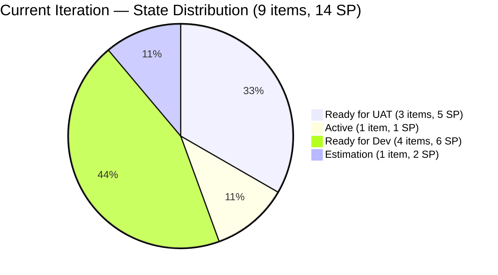
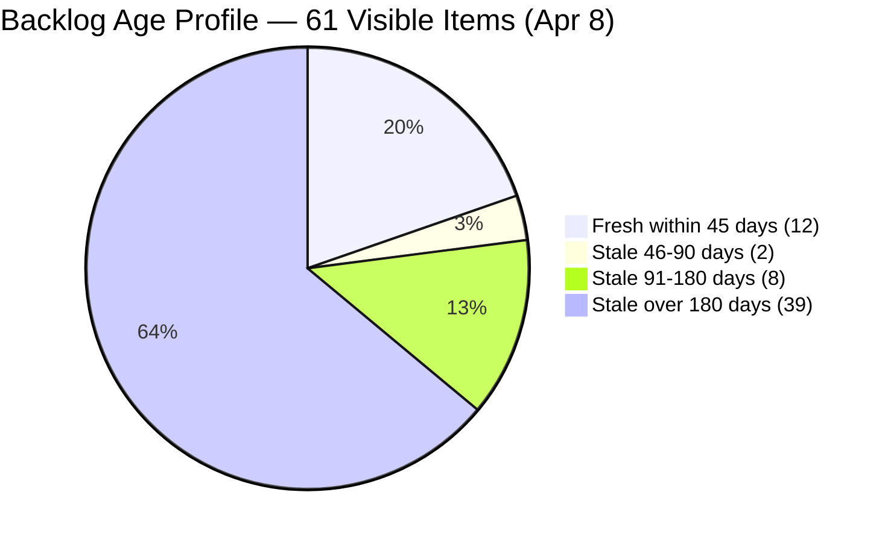
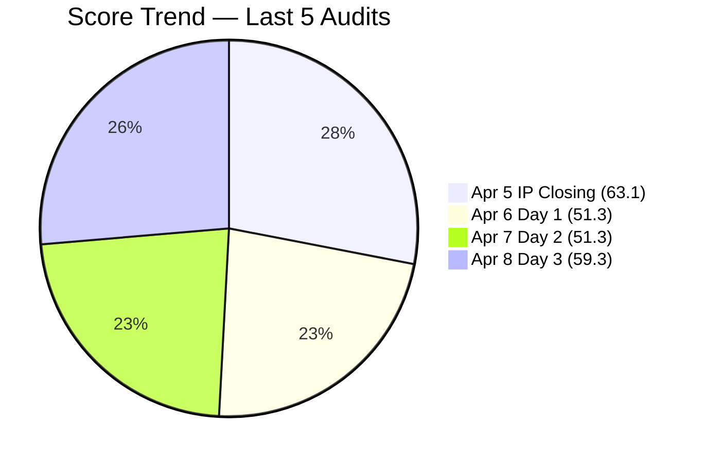

# SAFe Audit Report — Life Style Help App

## 1. Audit Metadata

| Field | Value |
|-------|-------|
| **Project** | Life Style Help App |
| **Team** | Life Style Help App Team |
| **Workspace** | `ado_ls_dev` |
| **ADO Project ID** | 0f447778-7156-4451-ab21-27be3c4a5888 |
| **ADO Team ID** | a2a805bc-0b30-4ef3-9a8a-b7f3081157a6 |
| **Current Iteration** | Iteration 7.1 |
| **Iteration Path** | `Life Style Help App\2026-PI7\Iteration 7.1` |
| **Iteration Start** | April 6, 2026 |
| **Iteration Finish** | April 19, 2026 |
| **Iteration Day** | Day 3 of 14 (21% elapsed) |
| **Audit Date** | 2026-04-08 |
| **Audit Sequence** | A19 (Day 3, Iteration 7.1) |
| **Previous Audit** | AUDIT_20260407_0900.md (Day 2, Score: 51.3/100, High Risk) |
| **Scoring Rubric** | ADO SAFe v1 (seven-dimension deterministic scoring) |
| **Overall Score** | **59.3 / 100** |
| **Risk Band** | **High Risk** (40–59.9) |

---

## 2. Executive Summary

The Life Style Help App Team scores **59.3/100 (High Risk)** on Day 3 of Iteration 7.1 — a **+8.0 point improvement** from Day 2 (51.3). The jump is driven entirely by a **breakthrough in DoR Compliance**: all 5 items that were missing Acceptance Criteria in the prior two audits now pass DoR, raising that dimension from 44.4 to **100.0**. This resolves a finding that was carried without action for 3 consecutive sprints. The overall score improvement moves the team from the middle of the High Risk band to its upper edge (59.3 vs a Moderate Risk threshold of 60.0).

Three significant state advances occurred: **#195735, #201158, and #201174 all progressed from their Day 2 states to Ready for UAT**, consolidating the QA pipeline. These 5 SP (combined) are very close to closure — if UAT is completed this sprint, Delivery Predictability will rise substantially.

The two structurally intractable dimensions remain unchanged: **Backlog Refinement (0.0)** — the backlog contains 39 items older than 180 days with no grooming since before PI7 opened — and **Delivery Predictability (0.0)** — no Story Points have been formally closed yet (early-sprint context, Day 3 of 14).

The **Iteration Planning score (14.8)** continues to be suppressed by the large denominator of ungroomed legacy items. Without backlog pruning, this dimension cannot meaningfully improve regardless of sprint activity.

---

## 3. Previous Audit Delta

| Dimension | A18 — Day 2 (Apr 7) | A19 — Day 3 (Apr 8) | Delta |
|-----------|----------------------|----------------------|-------|
| Iteration Planning | 14.8 | 14.8 | 0.0 |
| Team Capacity | 100.0 | 100.0 | 0.0 |
| Estimation | 100.0 | 100.0 | 0.0 |
| DoR Compliance | 44.4 | **100.0** | **+55.6** |
| Work Item Balance | 100.0 | 100.0 | 0.0 |
| Backlog Refinement | 0.0 | 0.0 | 0.0 |
| Delivery Predictability | 0.0 | 0.0 | 0.0 |
| **Overall** | **51.3** | **59.3** | **+8.0** |

**Key developments since Day 2:**

- **DoR Compliance: 44.4 → 100.0 (+55.6)** — The single largest single-day DoR improvement in the PI7 audit history. All 5 items previously missing Acceptance Criteria (#195715, #195727, #198775, #201158, #201162) now pass DoR checks (desc ≥ 30 chars, AC ≥ 20 chars). This resolves the P1 recommendation from 3 consecutive sprints. AC was added to all five items today.
- **State advances:** #195735 → Ready for UAT (was Ready for QA); #201158 → Ready for UAT (was Ready for QA); #201174 → Ready for UAT (was Passed QA Testing). Three items totaling 5 SP are now in the UAT pipeline awaiting final acceptance.
- **#196380 last changed Apr 6** — this is the one item not touched since iteration start. It is in Ready for Dev and assigned to Ike Yana. Not yet an untouched penalty (threshold is > 30% untouched), but worth monitoring.
- **Backlog count unchanged at 61** — No items added, removed, or groomed. stale_180 remains at 39.
- **No SP closed** — 0 of 14 committed SP formally closed. Early-sprint, expected.

---

## 4. Current Iteration Snapshot

| Metric | Value |
|--------|-------|
| Iteration | 7.1 — Apr 6 to Apr 19, 2026 |
| Visible root backlog items | 61 |
| Current iteration root items | 9 |
| Total Story Points committed | 14 SP |
| Closed Story Points | 0 SP |
| Items in UAT pipeline (Ready for UAT) | 3 (#195735, #201158, #201174) |
| Active items | 1 (#196379) |
| Ready for Dev | 4 (#195715, #196380, #198775, #201162) |
| Estimation | 1 (#195727) |
| Contributors with current work | 2 (Samantha Babael, Ike Yana) |
| Contributors with capacity configured | 2 (Samantha, Ike) |
| Iteration elapsed | Day 3 of 14 (21%) |
| Fresh items (changed within 45d of Apr 8) | 12 / 61 (19.7%) |
| Stale > 90 days | 47 / 61 (77.0%) |
| Stale > 180 days | 39 / 61 (63.9%) |
| Untouched current items (changed < Apr 6) | 0 / 9 (0.0%) — #196380 changed Apr 6 (boundary) |

---

## 5. Work Item Analysis

### Current Iteration Items (9)

| ID | Type | Title | State | SP | Assigned To | DoR | Changed |
|----|------|-------|-------|----|-------------|-----|---------|
| #195715 | Defect | [Low] Remove deadspace on Completed Sessions | Ready for Dev | 1 | Samantha Babael | **PASS** | Apr 8 |
| #195727 | User Story | [Low] Meal time filter unresponsive | Estimation | 2 | Ike Yana | **PASS** | Apr 8 |
| #195735 | User Story | [Low] Adjust text on membership package | Ready for UAT | 2 | Samantha Babael | Pass | Apr 8 |
| #196379 | Spike | [High] Keep Screen On Functions – POC | Active | 1 | Ike Yana | Pass | Apr 8 |
| #196380 | User Story | [Low] Default Pinned Post for New Users | Ready for Dev | 2 | Ike Yana | Pass | Apr 6 |
| #198775 | Defect | [Low][Admin] Workout Plans – Search Not Working | Ready for Dev | 1 | Samantha Babael | **PASS** | Apr 8 |
| #201158 | Defect | [Medium][Blogs] Excessive Line Spacing | Ready for UAT | 1 | Samantha Babael | **PASS** | Apr 8 |
| #201162 | Defect | [Low][Admin][Workout] Previous Search Suggestion | Ready for Dev | 2 | Samantha Babael | **PASS** | Apr 8 |
| #201174 | User Story | [Low] Update Subscription (Client Profile) | Ready for UAT | 2 | Samantha Babael | Pass | Apr 8 |

> **DoR milestone:** Items marked **PASS** were DoR failures on Days 1 and 2. All 9 items now pass DoR for the first time in PI7.

### DoR Evidence (Day 3)

| ID | desc chars (non-ws) | AC chars (non-ws) | Status |
|----|---------------------|-------------------|--------|
| #195715 | 123 | 68 | Pass |
| #195727 | 250 | 89 | Pass |
| #195735 | 199 | 295 | Pass |
| #196379 | 39 | 84 | Pass |
| #196380 | 466 | 325 | Pass |
| #198775 | 72 | 171 | Pass |
| #201158 | 75 | 170 | Pass |
| #201162 | 111 | 102 | Pass |
| #201174 | 104 | 208 | Pass |

### Ownership Distribution

| Contributor | Items | SP | Share |
|-------------|-------|----|-------|
| Samantha Babael | 6 | 9 SP | 66.7% |
| Ike Yana | 3 | 5 SP | 33.3% |

### Type Distribution (Current Iteration)

| Type | Count | Share |
|------|-------|-------|
| User Story | 4 | 44.4% |
| Defect | 4 | 44.4% |
| Spike | 1 | 11.1% |

### UAT Pipeline (5 SP approaching closure)

| ID | Type | Title | SP | Assigned | State |
|----|------|-------|----|----------|-------|
| #195735 | User Story | Adjust text on membership package | 2 | Samantha | Ready for UAT |
| #201158 | Defect | Blogs — Excessive Line Spacing | 1 | Samantha | Ready for UAT |
| #201174 | User Story | Update Subscription (Client Profile) | 2 | Samantha | Ready for UAT |

> If all 3 UAT items close this sprint, Delivery Predictability will reach 35.7 (5 SP / 14 SP committed).

### Backlog Age Profile (61 visible items)

| Age Bucket | Count | Share |
|------------|-------|-------|
| Fresh (within 45 days, changed >= Feb 22) | 12 | 19.7% |
| Stale 46–90 days | 2 | 3.3% |
| Stale 91–180 days | 8 | 13.1% |
| Stale > 180 days | 39 | 63.9% |

> The stale_180 count has been stable at 39 since Apr 7 (when 9 additional items crossed the threshold). Without grooming, this count will continue to increase as more items age through the boundary.

---

## 6. SAFe Compliance Scorecard

| Dimension | Score | Evidence | Notes |
|-----------|-------|----------|-------|
| Iteration Planning | 14.8 | 9 current / 61 visible | Unchanged; 39 stale items inflate denominator |
| Team Capacity | 100.0 | 2 contributors with capacity / 2 with work | Samantha + Ike configured; stable |
| Estimation | 100.0 | 9 estimated / 9 point-eligible | All items estimated; 14 SP total |
| DoR Compliance | **100.0** | 9 / 9 current items pass DoR | **+55.6 from Day 2** — P1 recommendation resolved |
| Work Item Balance | 100.0 | US 44.4%, Defect 44.4%, Spike 11.1% | No penalties; balanced mix |
| Backlog Refinement | 0.0 | base 19.7 − 20 (stale_90 77%) − 20 (stale_180: 39) = −20.3 → 0 | 13th consecutive audit at 0.0 |
| Delivery Predictability | 0.0 | 0 SP closed / 14 SP committed | Early-sprint Day 3; UAT pipeline active (5 SP) |
| **Overall** | **59.3** | Average of 7 dimensions | **High Risk** (40–59.9 band) |

### Score Computation Detail

| Dimension | Formula | Calculation | Result |
|-----------|---------|-------------|--------|
| Iteration Planning | current / visible × 100 | 9 / 61 × 100 | 14.8 |
| Team Capacity | cap / work_assignees × 100 | 2 / 2 × 100 | 100.0 |
| Estimation | estimated / point_eligible × 100 | 9 / 9 × 100 | 100.0 |
| DoR Compliance | dor_compliant / current × 100 | 9 / 9 × 100 | 100.0 |
| Work Item Balance | 100 − penalties | 100 − 0 | 100.0 |
| Backlog Refinement | base − penalties | 19.7 − 40 → 0 | 0.0 |
| Delivery Predictability | closed_sp / committed_sp × 100 | 0 / 14 × 100 | 0.0 |
| **Overall** | average(all 7) | (14.8+100+100+100+100+0+0)/7 | **59.3** |

---

## 7. Dimension Findings

### 7.1 Iteration Planning (14.8) — Unchanged (Structurally Suppressed)

9 of 61 visible backlog items are in Iteration 7.1. The ratio cannot improve without either moving more items into the iteration or pruning stale items from the backlog. The 39 items older than 180 days are the primary driver inflating the denominator. If the 39 stale_180 items were removed, this score would rise to 9/22 = 40.9 — a +26.1 point gain on a single dimension.

### 7.2 Team Capacity (100.0) — Healthy

Both Samantha Babael and Ike Yana have capacity configured and work assigned. Luzmibel Paculanang retains Testing capacity (1 hr/day) but has 0 current iteration items. With 3 items in Ready for UAT — all assigned to Samantha — Luzmibel's UAT skills are directly relevant and could accelerate closure.

### 7.3 Estimation (100.0) — Full Score

All 9 current iteration items have Story Points. Total committed: 14 SP. Unchanged from Days 1 and 2.

### 7.4 DoR Compliance (100.0) — Breakthrough (+55.6)

**All 9 items now pass DoR** — the first time this team has achieved 100% DoR compliance in PI7. Acceptance Criteria was added to all 5 previously failing items (#195715, #195727, #198775, #201158, #201162) on April 8. This resolves a P1 recommendation that was carried through 3 consecutive sprints (Iteration 6.6 IP closing audit, Day 1, and Day 2 of Iteration 7.1).

This is the most impactful single-day improvement visible in the audit data for PI7. The team's process discipline appears to have improved significantly.

### 7.5 Work Item Balance (100.0) — Full Score

Type distribution remains balanced: User Story (44.4%), Defect (44.4%), Spike (11.1%). No penalty triggers are active.

### 7.6 Backlog Refinement (0.0) — Critical (13th Consecutive Audit at 0.0)

Base score: 19.7% (12 fresh / 61 visible). Penalties:
- stale_90 / visible = 47/61 = 77.0% > 25% → −20
- stale_180 ≥ 1 (39 items) → −20
- untouched = 0% → no penalty

Combined: 19.7 − 40 = −20.3, floored to 0.0. This is the **13th consecutive audit at 0.0**. The stale_180 count has been stable at 39 since Apr 7 (9 items newly crossed the 180-day boundary at that time). Without a dedicated grooming session targeting stale items, this dimension cannot recover.

The minimum intervention required to restore any Backlog Refinement score: reduce stale_90 to below 25% of visible (currently 77%) OR eliminate all stale_180 items. The latter is more achievable — archiving/closing the 39 oldest items would reduce visible from 61 to 22, raise the fresh ratio from 19.7% to 54.5%, and eliminate the stale_180 penalty entirely, yielding a Backlog Refinement score of approximately 54.5.

### 7.7 Delivery Predictability (0.0) — Early Sprint (UAT Pipeline Active)

0 of 14 committed SP formally closed. The sprint is in Day 3 of 14 (21% elapsed). However, 3 items totaling 5 SP are in Ready for UAT — the last gate before closure. If Luzmibel Paculanang is assigned to UAT and closes these items this week, Delivery Predictability will rise to 35.7. If the remaining 4 Ready for Dev items also move through QA/UAT, the team could close up to 14/14 SP by sprint end.

---

## 8. Risks and Bottlenecks

| Priority | Risk | Impact |
|----------|------|--------|
| CRITICAL | **39 items > 180 days stale — 13th consecutive audit at BR 0.0** | Backlog Refinement permanently 0.0 without grooming action; score ceiling ~67.6 with current backlog |
| HIGH | **Samantha Babael carries 6/9 items (67%) including all 3 UAT items** | UAT bottleneck — all Ready for UAT items are Samantha-assigned; bus-factor risk if unavailable |
| HIGH | **Luzmibel has no iteration items despite 3 items in Ready for UAT** | QA/UAT capacity is idle while UAT pipeline has 5 SP ready to close |
| HIGH | **#195727 still in Estimation (Day 3)** | This User Story has been in Estimation since Iteration 6.6 IP. No progress visible since then. Consuming planning capacity with no delivery signal. |
| MODERATE | **No new PI7 feature scope** | All 9 current items are carry-forward from PI6.6. No new capability work has been committed for PI7. |
| LOW | **#196380 last changed Apr 6 (boundary)** | Ike Yana's item has shown no activity since iteration start. Not yet an untouched penalty but may stall. |

---

## 9. Prioritized Recommendations

1. **[Immediate — Today]** Assign Luzmibel Paculanang to UAT for the 3 Ready for UAT items (#195735, #201158, #201174 — 5 SP). She has Testing capacity and zero current work. This directly unblocks Delivery Predictability. If UAT is completed today, the team picks up 35.7 points on DP this sprint. Estimated effort for UAT: 1–2 hours.

2. **[This Week]** Close #195727 (User Story, Estimation, 2 SP). This item has been in Estimation since at least Iteration 6.6 IP — the longest-stalled item in the current sprint. Either complete estimation and move to Ready for Dev, or descope it entirely. Its presence in the sprint without forward motion is planning noise.

3. **[This Sprint — P1 → Groom]** Conduct a focused backlog grooming session targeting the 39 items older than 180 days. Closing/archiving these 39 items would: (a) eliminate the stale_180 penalty, (b) reduce stale_90 from 77% to potentially below 25%, and (c) raise Backlog Refinement from 0.0 to approximately 54.5 — adding ~7.8 points to overall score. This is the single highest-leverage action available to this team.

4. **[This Sprint]** Begin work on the 4 Ready for Dev items (#195715, #196380, #198775, #201162). These items are blocked waiting for development start. At Day 3 with 11 days remaining, all 4 should be in Active state by Day 5 to maintain sprint pacing.

5. **[PI7 Planning]** Introduce new PI7 feature capability work. All 9 current items are legacy carry-forward from PI6.6. The team needs to begin new feature development to demonstrate PI7 progress beyond backlog debt reduction.

---

## 10. Evidence Gaps and Limitations

| Gap | Impact | Mitigation |
|-----|--------|------------|
| **Day 3 early-sprint context** | Delivery Predictability = 0.0 is expected; annotated as early-sprint | UAT pipeline signals imminent closure potential |
| **Luzmibel Paculanang capacity details** | Prior audit showed 1 hr/day Testing, 2 days off Apr 9–10; capacity exists but days off reduce available UAT time | Schedule UAT for today or tomorrow before days off |
| **#195727 Estimation duration unknown** | Item has been in Estimation since before PI7; no evidence of blockers documented | Direct team inquiry recommended |
| **Backlog age boundary behavior** | stale_180 count may increase further as more items age through the threshold | Weekly grooming sessions required to prevent further score erosion |
| **No closed SP** | Delivery Predictability will remain 0.0 until first closure; UAT pipeline suggests this could resolve by Day 5 | Monitor UAT completion |

---

## Visualizations

```mermaid
bar
    title SAFe Dimension Scores — Day 3 vs Day 2 (Iteration 7.1)
    x-axis ["Iter Planning", "Team Capacity", "Estimation", "DoR", "WI Balance", "Backlog Ref", "Delivery Pred"]
    y-axis 0 --> 100
    bar "Day 2 (Apr 7)" [14.8, 100, 100, 44.4, 100, 0, 0]
    bar "Day 3 (Apr 8)" [14.8, 100, 100, 100, 100, 0, 0]
```







---

## Action Item Tracking — Carry-Forward from Day 2

| Recommendation | Prior Status | Day 3 Status |
|----------------|-------------|--------------|
| Add AC to #195715, #195727, #198775, #201158, #201162 | P1 — Unresolved (3 sprints) | **RESOLVED — All 5 pass DoR as of Apr 8** |
| Assign Luzmibel to QA pipeline | P2 — Unresolved | **New: 3 items now in Ready for UAT** — still unassigned |
| Conduct backlog grooming (39 stale_180 items) | P1 — Unresolved | **Unresolved — 13th audit at BR 0.0** |
| Move/descope #195727 (Estimation stall) | P4 — Unresolved | **Unresolved — Day 3, still in Estimation** |
| Add new PI7 feature scope | P6 — Unresolved | **Unresolved** |

---

*Report generated by ADO SAFe audit agent. Audit date: 2026-04-08 (Day 3 of Iteration 7.1).*
*Scoring rubric: ADO SAFe v1 (seven-dimension deterministic scoring).*
*Previous: AUDIT_20260407_0900.md (Day 2, 51.3/100, High Risk) | +8.0 change*
*Iteration: Life Style Help App\2026-PI7\Iteration 7.1 | Apr 6 – Apr 19, 2026*
