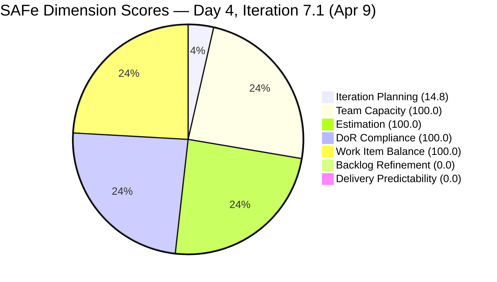
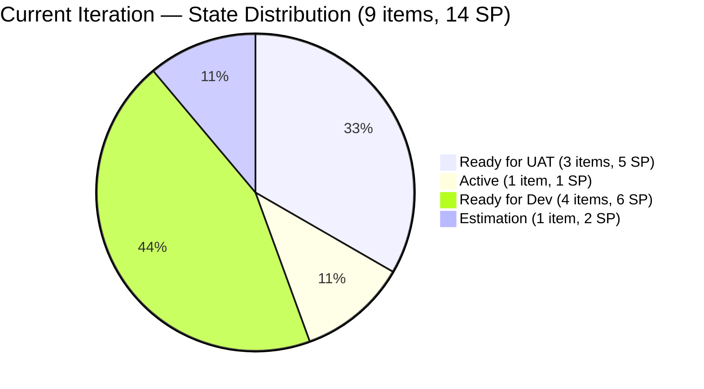
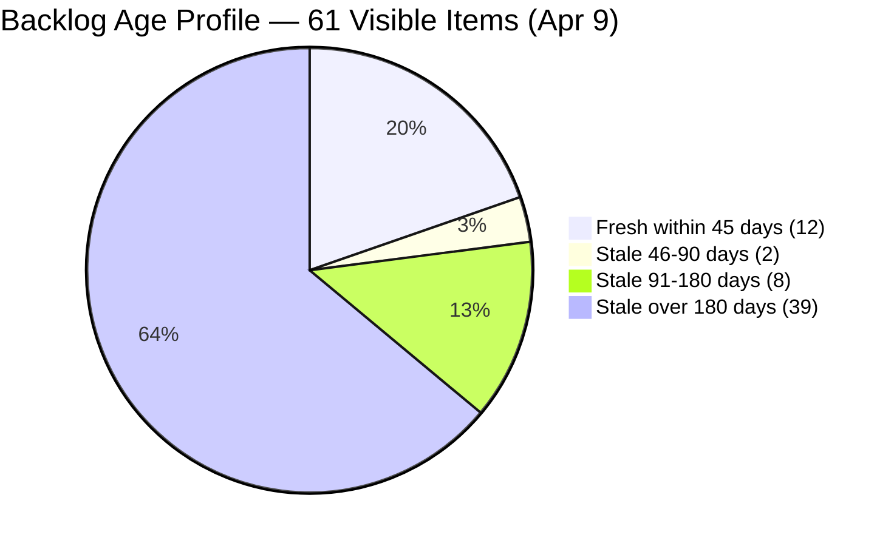
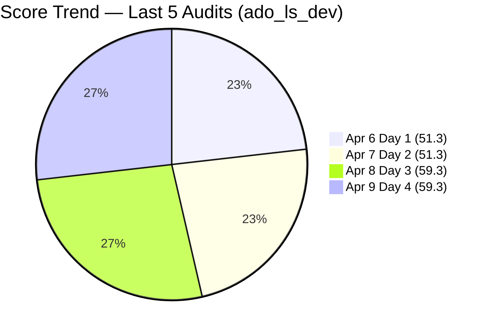

# SAFe Audit Report — Life Style Help App

## 1. Audit Metadata

| Field | Value |
|-------|-------|
| **Project** | Life Style Help App |
| **Team** | Life Style Help App Team |
| **Workspace** | `ado_ls_dev` |
| **ADO Project ID** | 0f447778-7156-4451-ab21-27be3c4a5888 |
| **ADO Team ID** | a2a805bc-0b30-4ef3-9a8a-b7f3081157a6 |
| **Current Iteration** | Iteration 7.1 |
| **Iteration Path** | `Life Style Help App\2026-PI7\Iteration 7.1` |
| **Iteration Start** | April 6, 2026 |
| **Iteration Finish** | April 19, 2026 |
| **Iteration Day** | Day 4 of 14 (29% elapsed) |
| **Audit Date** | 2026-04-09 |
| **Audit Sequence** | A20 (Day 4, Iteration 7.1) |
| **Previous Audit** | AUDIT_20260408_1532.md (Day 3, Score: 59.3/100, High Risk) |
| **Scoring Rubric** | ADO SAFe v1 (seven-dimension deterministic scoring) |
| **Overall Score** | **59.3 / 100** |
| **Risk Band** | **High Risk** (40–59.9) |

---

## 2. Executive Summary

The Life Style Help App Team holds at **59.3/100 (High Risk)** on Day 4 of Iteration 7.1 — **unchanged from Day 3**. No score movement occurred overnight. The DoR Compliance breakthrough achieved on Day 3 (all 9 items passing DoR for the first time in PI7) holds firm: all items remain fully DoR-compliant.

The sprint is now 29% elapsed with **0 Story Points closed and 3 items (5 SP) in the Ready for UAT pipeline** waiting for Luzmibel Paculanang's testing attention. Luzmibel has days off today (Apr 9) and tomorrow (Apr 10), creating an immediate window constraint — if UAT does not begin by end of Day 6 (Apr 13), delivery momentum will be at risk.

The two chronic structural deficiencies remain: **Backlog Refinement (0.0)** — 39 items older than 180 days continue to inflate the denominator — and **Delivery Predictability (0.0)** — no closures yet. These two dimensions hold the overall score to 59.3 regardless of all other improvements.

The team is at an inflection point: the DoR and Estimation dimensions are at full score, Team Capacity and Work Item Balance are healthy, but the sprint has entered the zone where UAT delays will directly translate to Delivery Predictability failure at sprint close.

---

## 3. Previous Audit Delta

| Dimension | A19 — Day 3 (Apr 8) | A20 — Day 4 (Apr 9) | Delta |
|-----------|----------------------|----------------------|-------|
| Iteration Planning | 14.8 | 14.8 | 0.0 |
| Team Capacity | 100.0 | 100.0 | 0.0 |
| Estimation | 100.0 | 100.0 | 0.0 |
| DoR Compliance | 100.0 | 100.0 | 0.0 |
| Work Item Balance | 100.0 | 100.0 | 0.0 |
| Backlog Refinement | 0.0 | 0.0 | 0.0 |
| Delivery Predictability | 0.0 | 0.0 | 0.0 |
| **Overall** | **59.3** | **59.3** | **0.0** |

**Key developments since Day 3:**

- **No state changes** — All 9 current iteration items hold their Day 3 states. No transitions have occurred since Apr 8.
- **DoR Compliance holds at 100.0** — All 9 items continue to pass DoR. The Day 3 breakthrough (AC added to 5 items) is sustained.
- **Ready for UAT pipeline unchanged** — #195735, #201158, and #201174 (5 SP combined) remain in Ready for UAT. Luzmibel Paculanang is on days off Apr 9–10. UAT is expected to resume Apr 13 at the earliest.
- **stale_180 stable at 39** — No new items crossed the 180-day boundary today. The stale_90 count remains at 47 of 61 (77%).
- **0 SP closed** — 4th consecutive day at 0 closed SP. Early-sprint context, but the window for recovery is narrowing.
- **#196379 Active (Spike, 1 SP)** — Ike Yana's Keep Screen On POC was last updated Apr 8 (19:29). Active with no new update today.
- **#195727 still in Estimation** — Now entering Day 4 with no progress on this 2 SP User Story. Estimation staleness risk is rising.

---

## 4. Current Iteration Snapshot

| Metric | Value |
|--------|-------|
| Iteration | 7.1 — Apr 6 to Apr 19, 2026 |
| Visible root backlog items | 61 |
| Current iteration root items | 9 |
| Total Story Points committed | 14 SP |
| Closed Story Points | 0 SP |
| Items in UAT pipeline (Ready for UAT) | 3 (#195735, #201158, #201174 — 5 SP) |
| Active items | 1 (#196379) |
| Ready for Dev | 4 (#195715, #196380, #198775, #201162) |
| Estimation | 1 (#195727) |
| Contributors with current work | 2 (Samantha Babael, Ike Yana) |
| Contributors with capacity configured | 3 (Samantha, Ike, Luzmibel) |
| Iteration elapsed | Day 4 of 14 (29%) |
| Fresh items (changed within 45d of Apr 9) | 12 / 61 (19.7%) |
| Stale > 90 days | 47 / 61 (77.0%) |
| Stale > 180 days | 39 / 61 (63.9%) |
| Untouched current items (changed before Apr 6) | 0 / 9 (0.0%) |

> **UAT timing risk:** Luzmibel Paculanang has days off Apr 9–10. The 5 SP UAT pipeline (#195735, #201158, #201174) cannot be tested until Apr 13 (Day 6) at the earliest. With 10 days remaining after her return, this is manageable but creates a hard constraint: UAT must begin on Apr 13 without delay.

---

## 5. Work Item Analysis

### Current Iteration Items (9)

| ID | Type | Title | State | SP | Assigned To | DoR | Changed |
|----|------|-------|-------|----|-------------|-----|---------|
| #195715 | Defect | [Low] Remove deadspace on Completed Sessions | Ready for Dev | 1 | Samantha Babael | Pass | Apr 8 |
| #195727 | User Story | [Low] Meal time filter unresponsive | Estimation | 2 | Ike Yana | Pass | Apr 8 |
| #195735 | User Story | [Low] Adjust text on membership package | Ready for UAT | 2 | Samantha Babael | Pass | Apr 8 |
| #196379 | Spike | [High] Keep Screen On Functions — POC | Active | 1 | Ike Yana | Pass | Apr 8 |
| #196380 | User Story | [Low] Default Pinned Post for New Users | Ready for Dev | 2 | Ike Yana | Pass | Apr 6 |
| #198775 | Defect | [Low][Admin] Workout Plans – Search Not Working | Ready for Dev | 1 | Samantha Babael | Pass | Apr 8 |
| #201158 | Defect | [Medium][Blogs] Excessive Line Spacing | Ready for UAT | 1 | Samantha Babael | Pass | Apr 8 |
| #201162 | Defect | [Low][Admin][Workout] Previous Search Suggestion | Ready for Dev | 2 | Samantha Babael | Pass | Apr 8 |
| #201174 | User Story | [Low] Update Subscription (Client Profile) | Ready for UAT | 2 | Samantha Babael | Pass | Apr 8 |

### DoR Evidence (Day 4 — All Pass)

| ID | desc chars (non-ws) | AC chars (non-ws) | Status |
|----|---------------------|-------------------|--------|
| #195715 | 123 | 68 | Pass |
| #195727 | 250 | 89 | Pass |
| #195735 | 199 | 295 | Pass |
| #196379 | 39 | 84 | Pass |
| #196380 | 466 | 325 | Pass |
| #198775 | 72 | 171 | Pass |
| #201158 | 75 | 170 | Pass |
| #201162 | 111 | 102 | Pass |
| #201174 | 104 | 208 | Pass |

> 100% DoR compliance sustained for the 2nd consecutive day — a PI7 milestone.

### Ownership Distribution

| Contributor | Items | SP | Share |
|-------------|-------|----|-------|
| Samantha Babael | 6 | 9 SP | 66.7% |
| Ike Yana | 3 | 5 SP | 33.3% |

> Luzmibel Paculanang retains Testing capacity (1 hr/day) with no current iteration items assigned. Her available hours overlap directly with the 3-item UAT pipeline.

### Type Distribution (Current Iteration)

| Type | Count | Share |
|------|-------|-------|
| User Story | 4 | 44.4% |
| Defect | 4 | 44.4% |
| Spike | 1 | 11.1% |

### UAT Pipeline (5 SP — Critical Path to DP Recovery)

| ID | Type | Title | SP | Assigned | State |
|----|------|-------|----|----------|-------|
| #195735 | User Story | Adjust text on membership package | 2 | Samantha | Ready for UAT |
| #201158 | Defect | Blogs — Excessive Line Spacing | 1 | Samantha | Ready for UAT |
| #201174 | User Story | Update Subscription (Client Profile) | 2 | Samantha | Ready for UAT |

> Closing all 3 UAT items would raise Delivery Predictability to 35.7 (5/14 SP). Luzmibel resumes Apr 13 (Day 6) — earliest opportunity for UAT processing.

### Backlog Age Profile (61 visible items)

| Age Bucket | Count | Share |
|------------|-------|-------|
| Fresh (within 45 days, changed >= Feb 23, 2026) | 12 | 19.7% |
| Stale 46–90 days | 2 | 3.3% |
| Stale 91–180 days | 8 | 13.1% |
| Stale > 180 days | 39 | 63.9% |

---

## 6. SAFe Compliance Scorecard

| Dimension | Score | Evidence | Notes |
|-----------|-------|----------|-------|
| Iteration Planning | 14.8 | 9 current / 61 visible | Structurally suppressed; 39 stale items inflate denominator |
| Team Capacity | 100.0 | 2 contributors with capacity / 2 with work | Samantha + Ike configured; Luzmibel available when she returns |
| Estimation | 100.0 | 9 estimated / 9 point-eligible | All 9 items estimated; 14 SP total |
| DoR Compliance | 100.0 | 9 / 9 current items pass DoR | Sustained from Day 3 breakthrough — 2nd consecutive day at 100.0 |
| Work Item Balance | 100.0 | US 44.4%, Defect 44.4%, Spike 11.1% | No penalties; balanced mix |
| Backlog Refinement | 0.0 | base 19.7 − 20 (stale_90 77%) − 20 (stale_180: 39) = 0 | 14th consecutive audit at 0.0 |
| Delivery Predictability | 0.0 | 0 SP closed / 14 SP committed | Day 4 of 14; annotated early-sprint; UAT pipeline active (5 SP) |
| **Overall** | **59.3** | Average of 7 dimensions | **High Risk** (40–59.9 band) |

### Score Computation Detail

| Dimension | Formula | Calculation | Result |
|-----------|---------|-------------|--------|
| Iteration Planning | current / visible × 100 | 9 / 61 × 100 | 14.8 |
| Team Capacity | cap / work_assignees × 100 | 2 / 2 × 100 | 100.0 |
| Estimation | estimated / point_eligible × 100 | 9 / 9 × 100 | 100.0 |
| DoR Compliance | dor_compliant / current × 100 | 9 / 9 × 100 | 100.0 |
| Work Item Balance | 100 − penalties | 100 − 0 | 100.0 |
| Backlog Refinement | base − penalties | 19.7 − 40 → 0 | 0.0 |
| Delivery Predictability | closed_sp / committed_sp × 100 | 0 / 14 × 100 | 0.0 |
| **Overall** | average(all 7) | (14.8 + 100 + 100 + 100 + 100 + 0 + 0) / 7 | **59.3** |

---

## 7. Dimension Findings

### 7.1 Iteration Planning (14.8) — Unchanged (Structurally Suppressed)

9 of 61 visible backlog items are in Iteration 7.1. The ratio is structurally suppressed by the 39 items older than 180 days that remain ungroomed in the backlog. This dimension cannot improve without either increasing iteration scope or removing stale items. Removing the 39 stale_180 items would reduce visible from 61 to 22, raising Iteration Planning from 14.8 to 40.9 (+26.1) in a single grooming session.

### 7.2 Team Capacity (100.0) — Healthy

Samantha Babael (Development, 1 hr/day) and Ike Yana (Development, 1 hr/day) both have capacity configured and work assigned. Luzmibel Paculanang (Testing, 1 hr/day, 2 days off Apr 9–10) has capacity for the UAT pipeline but is currently on leave. This is a gap today but resolves on Apr 13.

### 7.3 Estimation (100.0) — Full Score

All 9 current iteration items are estimated. Total committed: 14 SP. Unchanged from Days 1–3.

### 7.4 DoR Compliance (100.0) — Sustained

All 9 items continue to pass DoR (description >= 30 non-ws chars, AC >= 20 non-ws chars). This marks the 2nd consecutive day at 100.0 — a PI7 milestone. The fix achieved on Day 3 (AC added to 5 previously failing items) is holding. No new DoR failures introduced.

### 7.5 Work Item Balance (100.0) — Full Score

Type mix remains balanced: User Story (44.4%), Defect (44.4%), Spike (11.1%). No penalty triggers are active. User Stories are present (no -40 penalty), dominant type share is 44.4% (no -30 penalty), spike share is 11.1% (no -20 penalty).

### 7.6 Backlog Refinement (0.0) — Critical (14th Consecutive Audit at 0.0)

Base = 12/61 = 19.7%. Penalties: stale_90/visible = 77.0% > 25% → -20; stale_180 >= 1 (39 items) → -20. Result: 19.7 - 40 = -20.3 → floored to 0.0.

This is the **14th consecutive audit at 0.0** for this dimension. The 39 items older than 180 days represent backlog debt that has been accumulating since before PI6. Without a grooming session, this dimension will remain at 0.0 indefinitely and caps the achievable overall score at approximately 67.6 (if all other dimensions were perfect).

The highest-leverage intervention available to this team is a 1–2 hour grooming session to archive/close the 39 stale_180 items. This single action would add approximately 7.8 points to the overall score by eliminating both stale penalties and improving the fresh ratio from 19.7% to 54.5%.

### 7.7 Delivery Predictability (0.0) — Early Sprint (Day 4 — UAT Pipeline Active)

0 of 14 committed SP closed. Sprint is Day 4 of 14 (29% elapsed). This is annotated as early-sprint — low delivery expected for the first 5 days. Three items (5 SP) are in Ready for UAT awaiting Luzmibel's return on Apr 13. If UAT is completed Apr 13–14 and developers clear the 4 Ready for Dev items by end of Week 2, the team could close all 14 SP before Apr 19. However, #195727 (Estimation, 2 SP) remains stalled — it cannot progress to Dev while in Estimation state.

---

## 8. Risks and Bottlenecks

| Priority | Risk | Impact |
|----------|------|--------|
| CRITICAL | **39 items > 180 days stale — 14th consecutive audit at BR 0.0** | Score ceiling is ~67.6 with current backlog; structural impediment to Moderate Risk |
| HIGH | **Luzmibel has 2 days off (Apr 9–10) with 3 items in Ready for UAT (5 SP)** | UAT pipeline is blocked until Apr 13; delays closure of 35.7% of committed SP |
| HIGH | **#195727 stalled in Estimation — Day 4** | 2 SP User Story has been in Estimation since before Iteration 7.1; no forward motion visible. Blocks sprint contribution. |
| HIGH | **Samantha Babael concentration: 6/9 items (67%), 9 SP (64%)** | All 3 UAT items are Samantha-assigned; single-point-of-failure for sprint delivery |
| MODERATE | **4 Ready for Dev items have not started** | #195715, #196380, #198775, #201162 — with 10 days remaining, these must start by Day 6 to maintain delivery pace |
| LOW | **No new PI7 feature scope** | All 9 current items are carry-forward from PI6.6; no new capability work committed for PI7 |

---

## 9. Prioritized Recommendations

1. **[Apr 13 — First Action on Luzmibel's Return]** Begin UAT for #195735, #201158, and #201174 (5 SP, all Ready for UAT). These items have been in the UAT pipeline since Day 3. Luzmibel's Testing capacity is exactly suited to unblock this queue. Completing UAT on these 3 items raises Delivery Predictability from 0.0 to 35.7 — a 35.7-point gain on a single dimension.

2. **[Today or Apr 13 — Ike Yana]** Resolve #195727 (User Story, Estimation, 2 SP). This item has been stalled in Estimation for at minimum 4 consecutive sprint days without evidence of progress. Options: (a) complete estimation and move to Ready for Dev, (b) descope to next iteration. Without resolution, this item will not contribute to sprint delivery.

3. **[This Sprint — P1 Grooming]** Conduct a backlog grooming session targeting the 39 items older than 180 days. Archiving/closing these 39 items is the single highest-leverage action available: it eliminates both stale penalties from Backlog Refinement, improves Iteration Planning from 14.8 to 40.9, and raises achievable overall score from ~59.3 to ~77.1 (assuming Delivery Predictability recovers normally). Estimated effort: 1–2 hours.

4. **[By Day 6 — Samantha + Ike]** Begin active development on the 4 Ready for Dev items (#195715, #196380, #198775, #201162). With 10 days remaining and 4 items not yet started, development must begin no later than Day 6 (Apr 13) to allow time for QA/UAT cycles before sprint close.

5. **[PI7 Planning]** Introduce new PI7 feature capability work. All 9 current iteration items are carry-forward from PI6.6. No new feature development has been committed for PI7 across 4 sprint days.

---

## 10. Evidence Gaps and Limitations

| Gap | Impact | Mitigation |
|-----|--------|------------|
| **Day 4 early-sprint context** | Delivery Predictability = 0.0 is expected through approximately Day 5; annotated as early-sprint | UAT pipeline has 5 SP ready; first DP gains expected Apr 13 |
| **Luzmibel Paculanang days off** | UAT cannot proceed Apr 9–10; 5 SP delivery blocked for 2 days | Schedule UAT as first action on Apr 13 |
| **#195727 Estimation duration** | Unknown how long this item has been in Estimation; no blocker documented | Direct inquiry to Ike Yana recommended |
| **stale_180 boundary behavior** | Additional items may cross 180-day threshold during sprint as aging continues | Items with ChangedDate near Oct 9–13, 2025 are at the threshold |
| **No evidence of grooming scheduled** | Backlog Refinement cannot recover without deliberate pruning action | No grooming session has been observed since PI7 opened (14 audits) |

---

## Visualizations

> Note: 0.0-scored dimensions shown as 0.1 for chart visibility.

---

## Action Item Tracking — Carry-Forward from Day 3

| Recommendation | Day 3 Status | Day 4 Status |
|----------------|-------------|--------------|
| Assign Luzmibel to UAT (#195735, #201158, #201174 — 5 SP) | Unresolved — items in Ready for UAT | **Blocked — Luzmibel on leave Apr 9–10; retry Apr 13** |
| Resolve/descope #195727 (Estimation stall) | Unresolved — Day 3 | **Unresolved — Day 4, 4th sprint day without progress** |
| Backlog grooming (39 stale_180 items) | Unresolved — 14th audit | **Unresolved — 14th consecutive audit at BR 0.0** |
| Begin dev on 4 Ready for Dev items | New (Day 3) | **Unresolved — no state changes since Apr 8** |
| Introduce new PI7 feature scope | Unresolved | **Unresolved** |

---

*Report generated by ADO SAFe audit agent. Audit date: 2026-04-09 (Day 4 of Iteration 7.1).*
*Scoring rubric: ADO SAFe v1 (seven-dimension deterministic scoring).*
*Previous: AUDIT_20260408_1532.md (Day 3, 59.3/100, High Risk) | 0.0 change*
*Iteration: Life Style Help App\2026-PI7\Iteration 7.1 | Apr 6 – Apr 19, 2026*
