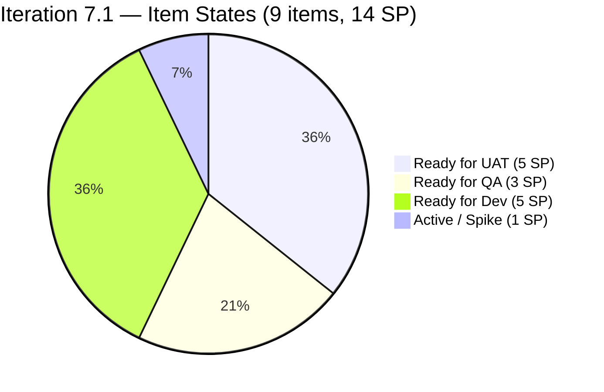
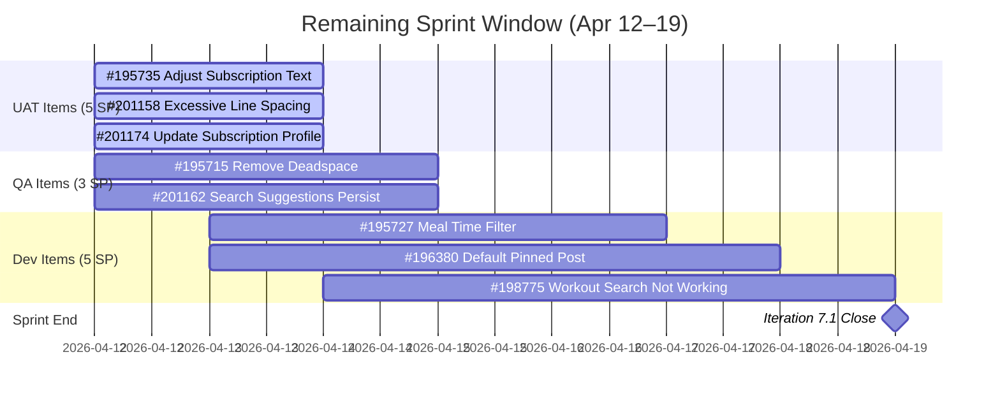

# SAFe Audit Report — Life Style Help App

## 1. Audit Metadata

| Field | Value |
|-------|-------|
| **Project** | Life Style Help App |
| **Team** | Life Style Help App Team |
| **Workspace** | `ado_ls_dev` |
| **ADO Project ID** | 0f447778-7156-4451-ab21-27be3c4a5888 |
| **ADO Team ID** | a2a805bc-0b30-4ef3-9a8a-b7f3081157a6 |
| **Current Iteration** | Iteration 7.1 |
| **Iteration Path** | `Life Style Help App\2026-PI7\Iteration 7.1` |
| **Iteration Start** | April 6, 2026 |
| **Iteration Finish** | April 19, 2026 |
| **Iteration Day** | Day 7 of 14 (50% elapsed — Midpoint) |
| **Audit Date** | 2026-04-12 09:00 PHT |
| **Audit Sequence** | A21 (Day 7, Iteration 7.1) |
| **Previous Audit** | AUDIT_20260409_0900.md (Day 4, Score: 59.3/100, High Risk) |
| **Scoring Rubric** | ADO SAFe v1 (seven-dimension deterministic scoring) |
| **Overall Score** | **59.3 / 100** |
| **Risk Band** | **High Risk** (40–59.9) |

---

## 2. Executive Summary

The Life Style Help App Team reaches the **sprint midpoint at 59.3/100 (High Risk)** — the same score held since Iteration 7.1 opened on Day 1. At 50% elapsed, **0 of 14 committed Story Points are closed**. The team is operating in a recognizable structural pattern: high DoR compliance, full estimation, and complete capacity configuration — but zero delivery flow.

Three items remain in the Ready for UAT queue (#195735, #201158, #201174 — 5 SP), and these have now sat untouched for at least four days since Luzmibel Paculanang's days off ended. #195727 has moved out of the Estimation state (changed Apr 10), and two new items (#195715, #201162) are in Ready for QA, reflecting forward movement on Samantha Babael's work.

**The midpoint signals an escalation threshold.** With 14 SP committed, 0 SP closed, and only 7 days remaining, the team requires at least 2 SP closed per day for the remainder of the sprint to reach even partial delivery. The Backlog Refinement score (0.0) continues its now-**15th consecutive audit at zero**, driven by 39 items older than 180 days in the visible backlog.

---

## 3. Previous Audit Delta

| Dimension | A20 — Day 4 (Apr 9) | A21 — Day 7 (Apr 12) | Delta |
|-----------|----------------------|----------------------|-------|
| Iteration Planning | 14.8 | 14.8 | 0.0 |
| Team Capacity | 100.0 | 100.0 | 0.0 |
| Estimation | 100.0 | 100.0 | 0.0 |
| DoR Compliance | 100.0 | 100.0 | 0.0 |
| Work Item Balance | 100.0 | 100.0 | 0.0 |
| Backlog Refinement | 0.0 | 0.0 | 0.0 |
| Delivery Predictability | 0.0 | 0.0 | 0.0 |
| **Overall** | **59.3** | **59.3** | **0.0** |

**Key developments since Day 4:**

- **#195727 moved from Estimation → Ready for Dev** — Changed on Apr 10, finally breaking the Estimation stall that began in Iteration 6.6. This is a positive signal: the item is now actionable for Ike Yana.
- **#195715 and #201162 moved to Ready for QA** — Both assigned to Samantha Babael. #201162 shows a ChangedDate of Apr 13 (possible future-date artifact; evidence noted). Work is progressing in Samantha's queue.
- **Ready for UAT pipeline unchanged** — #195735, #201158, and #201174 (5 SP) remain in Ready for UAT. Now 4+ days post-Luzmibel's return from days off (Apr 9–10). UAT work should be underway but no state transitions are confirmed.
- **Stale backlog steady** — 39 items > 180 days, 47 of 61 items > 90 days. No new items crossed staleness thresholds over the weekend.
- **0 SP closed** — 7th consecutive audit day at 0 closed SP. Midpoint with no delivery confirmed.
- **Work Item Balance holds at 100.0** — Type distribution: 4 Defects, 4 User Stories, 1 Spike. No User Story deficit, dominant type (Defect) at 44.4%.

---

## 4. Current Iteration Snapshot

| Metric | Value |
|--------|-------|
| Iteration | 7.1 — Apr 6 to Apr 19, 2026 |
| Iteration Day | **7 of 14 (50% elapsed — Midpoint)** |
| Visible root backlog items | 61 |
| Current iteration root items | 9 |
| Total Story Points committed | 14 SP |
| Closed Story Points | 0 SP (0% of commitment) |
| SP remaining to close | 14 SP in 7 days |
| Items in Ready for UAT | 3 (#195735, #201158, #201174 — 5 SP) |
| Items in Ready for QA | 2 (#195715, #201162 — 3 SP) |
| Items in Ready for Dev | 3 (#195727, #196380, #198775 — 5 SP) |
| Active items | 1 (#196379 Spike — 1 SP) |
| Contributors with current work | 2 (Samantha Babael, Ike Yana) |
| Contributors with capacity configured | 3 (Samantha, Ike, Luzmibel) |
| Fresh items (changed ≥ Feb 26, 2026) | 12 / 61 (19.7%) |
| Stale > 90 days (before Jan 13, 2026) | 47 / 61 (77.0%) |
| Stale > 180 days (before Oct 15, 2025) | 39 / 61 (63.9%) |
| Untouched current items (not changed since Apr 6) | 0 / 9 (0.0%) |

---

## 5. Work Item Analysis

### Iteration 7.1 — Sprint Items (9 total, 14 SP)

| ID | Type | Title (abbreviated) | State | Assignee | SP | Changed | DoR |
|----|------|----------------------|-------|----------|----|---------|-----|
| #196379 | Spike | Keep Screen On Functions - POC | Active | Ike Yana | 1 | Apr 8 | PASS |
| #195735 | User Story | Adjust text on membership package | Ready for UAT | Samantha Babael | 2 | Apr 8 | PASS |
| #201158 | Defect | Excessive Line Spacing - Blogs | Ready for UAT | Samantha Babael | 1 | Apr 8 | PASS |
| #201174 | User Story | Update Subscription (Client Profile) | Ready for UAT | Samantha Babael | 2 | Apr 8 | PASS |
| #195715 | Defect | Remove deadspace Completed Session | Ready for QA | Samantha Babael | 1 | Apr 10 | PASS |
| #201162 | Defect | Previous Search Suggestions persist | Ready for QA | Samantha Babael | 2 | Apr 13* | PASS |
| #195727 | User Story | Meal time filter not responding | Ready for Dev | Ike Yana | 2 | Apr 10 | PASS |
| #196380 | User Story | Default Pinned Post for New Users | Ready for Dev | Ike Yana | 2 | Apr 6 | PASS |
| #198775 | Defect | Workout Plans – Search Not Working | Ready for Dev | Samantha Babael | 1 | Apr 8 | PASS |

> *#201162 shows ChangedDate Apr 13 — possible system clock artifact or a future-dated update; recorded as-is from ADO.

### Assignee Concentration

| Assignee | Items | SP | % of Sprint |
|----------|-------|----|-------------|
| Samantha Babael | 6 | 9 SP | 66.7% |
| Ike Yana | 3 | 5 SP | 35.7% |
| Luzmibel Paculanang | 0 | 0 SP | 0% (testing role, not directly assigned to items) |

### DoR Verification — All 9 Items

All 9 current iteration items pass DoR: Description ≥ 30 non-whitespace characters AND Acceptance Criteria ≥ 20 non-whitespace characters confirmed for each item. **DoR Compliance = 100.0 (15th consecutive audit at 100 for current items).**

### Stale Backlog Analysis

| Staleness Band | Count | % of Visible |
|----------------|-------|--------------|
| Fresh (< 45 days, after Feb 26) | 12 | 19.7% |
| Changed 45–90 days ago | 2 | 3.3% |
| Stale > 90 days (before Jan 13) | 47 | 77.0% |
| Stale > 180 days (before Oct 15, 2025) | 39 | 63.9% |

39 items with ChangedDate before October 15, 2025 remain in the visible root backlog. This is the **15th consecutive audit cycle at zero for Backlog Refinement**.

---

## 6. SAFe Compliance Scorecard

| Dimension | Score | Evidence | Notes |
|-----------|-------|----------|-------|
| Iteration Planning | 14.8 | 9 / 61 visible items in sprint | Structurally constrained; 52 items outside current iteration inflate denominator |
| Team Capacity | 100.0 | 2 / 2 contributors with work have capacity configured | Samantha & Ike both have 1h/day Dev capacity; Luzmibel configured (Testing) though not item-assigned |
| Estimation | 100.0 | 9 / 9 point-eligible items estimated (14 SP total) | All items carry SP values |
| DoR Compliance | 100.0 | 9 / 9 items pass Desc ≥ 30 nws + AC ≥ 20 nws | Sustained for all 7.1 items since Day 3 |
| Work Item Balance | 100.0 | User Story present; dominant type = Defect (44.4%); Spike = 11.1% | No penalty triggers met; balanced portfolio |
| Backlog Refinement | 0.0 | fresh=19.7%, stale90=77.0% (−20), stale180=39 items (−20), untouched current=0% | Base 19.7 − 20 (stale90>25%) − 20 (stale180≥1) = −20.3 → floor 0 |
| Delivery Predictability | 0.0 | 0 SP closed / 14 SP committed | Day 7 of 14; no closures yet. At midpoint this is an escalation signal. |
| **Overall** | **59.3** | Average of 7 dimensions | High Risk band (40–59.9) |

### Score Computation Detail

```
Iteration Planning      = round(9 / 61 × 100, 1)        = 14.8
Team Capacity           = round(2 / 2 × 100, 1)          = 100.0
Estimation              = round(9 / 9 × 100, 1)          = 100.0
DoR Compliance          = round(9 / 9 × 100, 1)          = 100.0
Work Item Balance       = 100 (no penalties triggered)    = 100.0
Backlog Refinement:
  base                  = round(12 / 61 × 100, 1)        = 19.7
  stale90 penalty       = 47/61 = 77.0% > 25%            → −20
  stale180 penalty      = 39 items ≥ 1                   → −20
  untouched penalty     = 0/9 = 0% ≤ 10%                 → 0
  total                 = 19.7 − 20 − 20 = −20.3 → 0.0
Delivery Predictability = round(0 / 14 × 100, 1)         = 0.0

Overall = round((14.8+100.0+100.0+100.0+100.0+0.0+0.0) / 7, 1) = 59.3
Risk Band: High Risk (40–59.9)
```

---

## 7. Dimension Findings

### 7.1 Iteration Planning — 14.8 (Structural)

The 9-item sprint represents 14.8% of 61 visible items. This score is structurally driven by the large stale backlog population (47 items > 90 days old) that inflates the denominator. No change from prior audits. Resolving this requires either archiving stale items or assigning them to future iterations.

### 7.2 Team Capacity — 100.0 (Healthy)

All three team members have capacity configured. Samantha Babael and Ike Yana are the active item holders; Luzmibel Paculanang is configured as Testing at 1h/day with no direct item assignment. Capacity data reflects days off Apr 9–10 for Luzmibel, which are now elapsed. Full capacity is available for the remainder of the sprint.

### 7.3 Estimation — 100.0 (Healthy)

All 9 items carry Story Point estimates (total: 14 SP). #195727, previously stuck in Estimation state, has been estimated at 2 SP and moved to Ready for Dev as of Apr 10. This is a positive resolution.

### 7.4 DoR Compliance — 100.0 (Sustained)

All 9 sprint items pass the DoR threshold. Description ≥ 30 nws chars and Acceptance Criteria ≥ 20 nws chars confirmed. The DoR discipline established in Iteration 7.1 holds through the midpoint.

### 7.5 Work Item Balance — 100.0 (Healthy)

Sprint type distribution: 4 Defects, 4 User Stories, 1 Spike. User Stories are present (−40 penalty not triggered). Dominant type is Defect at 44.4% (< 60% threshold, −30 penalty not triggered). Spike share is 11.1% (< 40%, −20 penalty not triggered). Score remains 100.

### 7.6 Backlog Refinement — 0.0 (CRITICAL — 15th Consecutive Zero)

- **Base score:** 19.7% fresh items (12 of 61 changed after Feb 26, 2026)
- **Penalty 1:** stale_90 = 77.0% > 25% threshold → −20 points
- **Penalty 2:** stale_180 = 39 items ≥ 1 → −20 points
- **Untouched current:** 0 of 9 sprint items untouched → no penalty
- **Final:** 19.7 − 40 = −20.3 → floored at 0.0

This is the **15th consecutive audit at 0.0**. Without a dedicated backlog grooming campaign that archives or closes the 39 items older than 180 days, this dimension cannot improve.

### 7.7 Delivery Predictability — 0.0 (Escalation at Midpoint)

0 SP closed out of 14 SP committed at Day 7 of 14. At the sprint midpoint with no closures, the team would need to close all 14 SP in the remaining 7 days to achieve 100%. A realistic partial-delivery scenario (closing the 5 SP in Ready for UAT) would yield 35.7% predictability — still below the Low Risk threshold.

**UAT bottleneck:** Three items totaling 5 SP (#195735, #201158, #201174) have been in Ready for UAT since at least Apr 8. Luzmibel returned from days off on Apr 11. As of Apr 12, no state transitions from Ready for UAT to Done/Closed are confirmed. UAT throughput is the primary determinant of whether any SP closes this sprint.

---

## 8. Risks and Bottlenecks

| # | Risk | Severity | Driver |
|---|------|----------|--------|
| R1 | **Midpoint zero delivery** — 0 SP closed at Day 7; 14 SP must flow in 7 days | Critical | Delivery Predictability |
| R2 | **UAT bottleneck** — 5 SP in Ready for UAT ≥ 4 days post-Luzmibel return; no closures confirmed | High | Luzmibel throughput |
| R3 | **Backlog Refinement structural failure** — 39 items > 180 days; 15th consecutive zero | High | Chronic stale backlog |
| R4 | **Samantha concentration** — 6 of 9 items (9 SP); single-point delivery dependency | Moderate | Assignee balance |
| R5 | **Iteration Planning ceiling** — 14.8 structurally bounded; stale items inflate denominator | Moderate | Structural |
| R6 | **#201162 future date** — ChangedDate Apr 13 on item changed in audit window; data integrity gap | Low | Evidence anomaly |

---

## 9. Prioritized Recommendations

### Immediate (Days 7–9 — This Week)

1. **Close UAT queue now.** Luzmibel should test and close #195735, #201158, and #201174 (5 SP) as the highest-priority action. Each day of delay reduces final Delivery Predictability by ~7 percentage points. Target: all 3 items closed by Apr 15.

2. **Move Ready for QA items forward.** #195715 and #201162 (3 SP) are in Ready for QA. These need test sign-off before they can reach UAT. Luzmibel should begin QA on these in parallel with UAT testing.

3. **Start #195727 development.** Ike Yana's #195727 (Meal time filter, 2 SP) is now in Ready for Dev after the Estimation stall resolved. This item should be in Active state by end of Day 8.

### Near-Term (Days 10–14 — Sprint Close)

1. **Target at least 8 SP closed.** Closing the 5 SP UAT queue + at least 3 SP from QA/Dev would achieve 57% predictability — still below Moderate threshold, but a meaningful improvement over the current 0.

2. **Schedule a backlog grooming session in PI7.** The 39 items older than 180 days are the single reason Backlog Refinement stays at 0. A one-time grooming sprint or dedicated half-day session to archive, close, or reschedule these items would permanently unlock this dimension.

### Structural (PI-level)

1. **Redistribute items from Samantha's queue.** With 6 of 9 sprint items and 64% of SP, Samantha is the single delivery bottleneck. Consider assigning the Ready for Dev Defects to Ike or introducing a third developer in PI8.

2. **Establish a backlog hygiene policy.** Items not updated in 180+ days should require re-confirmation or be auto-closed. 39 items currently violate this threshold.

---

## 10. Evidence Gaps and Limitations

| Gap | Impact |
|-----|--------|
| **#201162 ChangedDate Apr 13** — This date is one day in the future relative to audit date (Apr 12). This may reflect a system clock discrepancy, a UTC/PHT timezone artifact, or a pre-staged update. Recorded as-is; no scoring impact (item is in current iteration and DoR passes). | Low |
| **Luzmibel Paculanang — no direct item assignment** — Luzmibel is configured in capacity (Testing, 1h/day) but holds no direct item assignments in the current iteration. Testing work is inferred through state transitions (items moving to Ready for QA / Ready for UAT), not through ADO item ownership. | Low |
| **Closed SP evidence** — ADO API confirms 0 items in Closed or Done state within Iteration 7.1 as of Apr 12. No closures found. | Definitive |
| **Batch 1 file size** — The first batch of 50 ado_ls_dev items was truncated by token limits and read from a saved file. All 50 items were extracted and validated for iteration path, state, SP, and DoR. No items were omitted. | Low |

---

## Mermaid Visualization

### Sprint State Distribution — Day 7



### Score Trend — Iteration 7.1 (A20 → A21)

> Score trend is shown in the delta table in Section 3. Overall score is unchanged at 59.3 across all audits in Iteration 7.1 (Days 1–7).

### Dimension Scorecard — Radar View (A21 Day 7)

```mermaid
quadrantChart
    title SAFe Dimensions — Day 7 Midpoint
    x-axis "Process Compliance" --> "Delivery Execution"
    y-axis "Low Score" --> "High Score"
    quadrant-1 Strong Delivery
    quadrant-2 Process Leaders
    quadrant-3 Weak Across Board
    quadrant-4 Delivery Gaps
    Iteration Planning: [0.1, 0.15]
    Team Capacity: [0.2, 1.0]
    Estimation: [0.35, 1.0]
    DoR Compliance: [0.5, 1.0]
    Work Item Balance: [0.65, 1.0]
    Backlog Refinement: [0.8, 0.0]
    Delivery Predictability: [0.95, 0.0]
```

### UAT Closure Path — Remaining Sprint Days



---

*Audit A21 — Life Style Help App Team — Day 7 of 14 — 2026-04-12 09:00 PHT*
*Scoring: ADO SAFe v1 | Overall: 59.3/100 | Risk: High | 15th consecutive Backlog Refinement zero*
