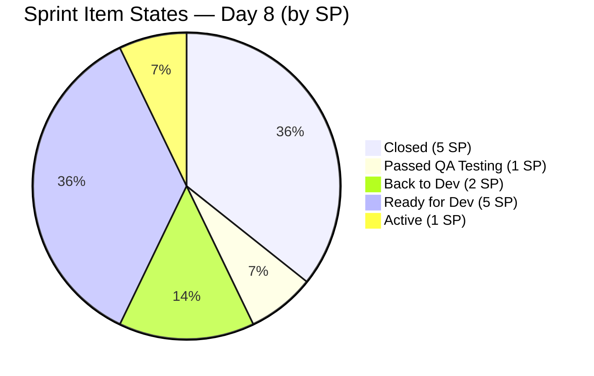
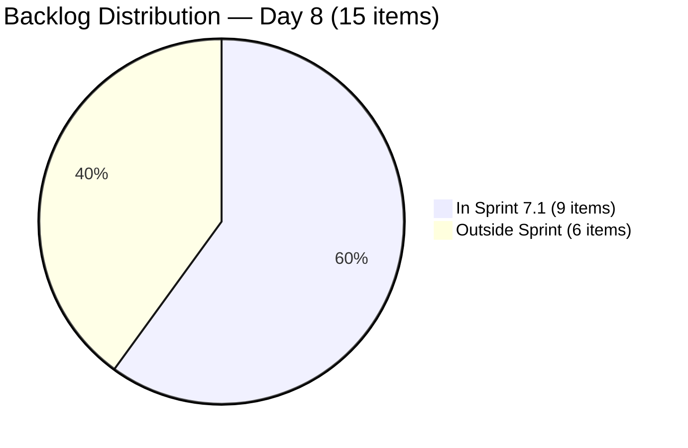
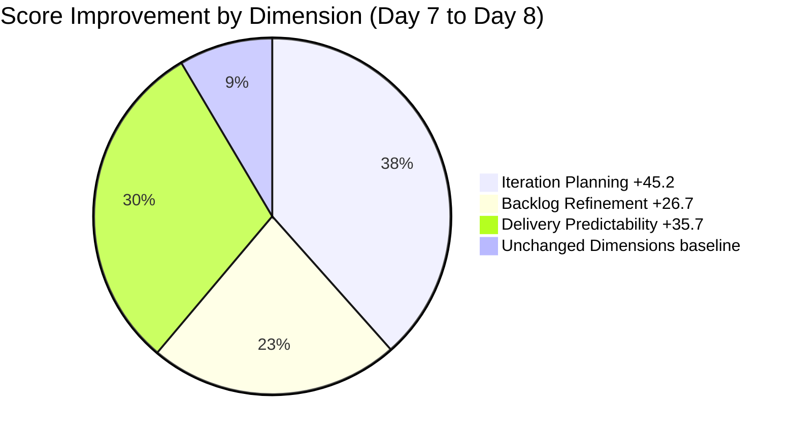
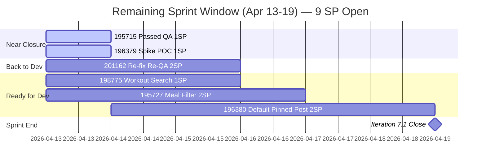
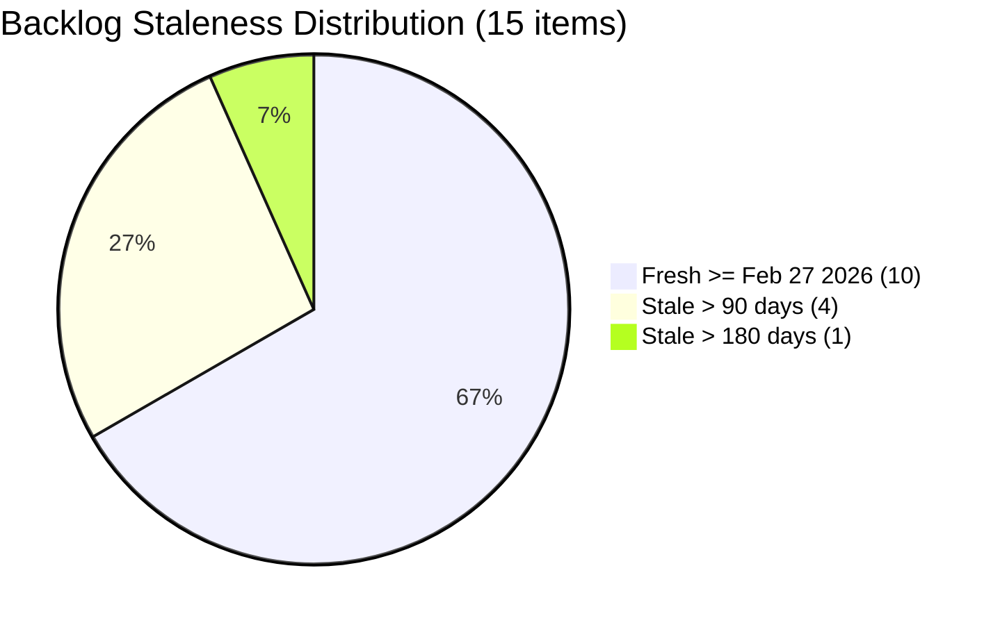

# SAFe Audit Report — Life Style Help App
**Audit A22 | Iteration 7.1 (Apr 6–19, 2026) | Day 8 of 14 (57% elapsed)**

---

## 1. Audit Metadata

| Field | Value |
|---|---|
| **Audit Date** | April 13, 2026, 09:00 PHT |
| **Auditor** | Claude Code (ADO SAFe Audit Agent) |
| **Workspace** | `ado_ls_dev` |
| **ADO Project** | Life Style Help App (`0f447778-7156-4451-ab21-27be3c4a5888`) |
| **Team** | Life Style Help App Team (`a2a805bc-0b30-4ef3-9a8a-b7f3081157a6`) |
| **Iteration** | Iteration 7.1 — Apr 6 to Apr 19, 2026 |
| **Iteration ID** | `28c6ab66-a3cb-4700-a497-36cbb54dcb92` |
| **Sprint Day** | Day 8 of 14 (57% elapsed) |
| **Prior Audit** | AUDIT_20260412_0900.md (A21, Score 59.3 — High Risk) |
| **Scoring Model** | ADO SAFe v1 (7-dimension rubric) |
| **Overall Score** | **74.6 / 100** |
| **Risk Band** | **Moderate Risk** (60–79.9) |

---

## 2. Executive Summary

The Life Style Help App Team scores **74.6 (Moderate Risk)** — a breakthrough improvement of **+15.3 points** from 59.3, exiting the High Risk band for the first time in Iteration 7.1. Two structural improvements drove this shift: (1) **3 items closed for 5 SP delivered**, ending a 7-day zero-delivery streak; and (2) a **major backlog grooming event** that reduced the visible backlog from 61 to 15 items — the most significant backlog reduction in this team's audit history.

Samantha Babael and Luzmibel Paculanang closed #195735 (User Story, 2SP), #201158 (Defect, 1SP), and #201174 (User Story, 2SP) on April 13, all from the Ready for UAT queue. This represents 35.7% of committed story points with 6 days remaining. The massive backlog reduction from 61 to 15 items transformed Iteration Planning from 14.8 to 60.0 — a structural unlock that directly resolves the team's chronic planning floor.

Despite these gains, Backlog Refinement remains penalized (26.7) due to 5 stale_90 items and 1 stale_180 item that survived the grooming pass. Delivery Predictability at 35.7% reflects that 9 SP remain open as of Day 8. The team is on a strong trajectory but must close the remaining open items before April 19.

---

## 3. Previous Audit Delta

| Dimension | A21 — Day 7 (Apr 12) | A22 — Day 8 (Apr 13) | Delta |
|---|---|---|---|
| Iteration Planning | 14.8 | 60.0 | **+45.2** |
| Team Capacity | 100.0 | 100.0 | 0.0 |
| Estimation | 100.0 | 100.0 | 0.0 |
| DoR Compliance | 100.0 | 100.0 | 0.0 |
| Work Item Balance | 100.0 | 100.0 | 0.0 |
| Backlog Refinement | 0.0 | 26.7 | **+26.7** |
| Delivery Predictability | 0.0 | 35.7 | **+35.7** |
| **Overall** | **59.3** | **74.6** | **+15.3** |

**Key developments since Day 7:**

- **3 items closed April 13** — #195735 (User Story, 2SP), #201158 (Defect, 1SP), #201174 (User Story, 2SP). All were in Ready for UAT. Delivery Predictability unlocked from 0.0 to 35.7.
- **#195715 advanced to Passed QA Testing** — Changed Apr 13. Luzmibel confirmed QA pass; item is ready to close.
- **#201162 moved to Back to Dev** — Changed Apr 13. QA found issues; regressed from Ready for QA to Back to Dev (Samantha's queue).
- **Backlog groomed from 61 to 15 items** — approximately 46 items removed from the visible backlog between Apr 12–13. Iteration Planning jumped from 14.8 to 60.0.
- **Backlog Refinement unlocked from 0.0 to 26.7** — With 15 items visible, fresh count is 10/15 (66.7%), enabling a positive base score. Two penalties remain (stale_90 and stale_180).
- **#187242 groomed Apr 13** — The second old Enabler item was touched today, bringing it to fresh status.

---

## 4. Current Iteration Snapshot

| Metric | Value |
|---|---|
| **Iteration** | 7.1 — Apr 6 to Apr 19, 2026 |
| **Iteration Day** | 8 of 14 (57% elapsed) |
| **Visible root backlog items** | 15 |
| **Current iteration root items** | 9 |
| **Items outside sprint** | 6 |
| **Total Story Points committed** | 14 SP |
| **Closed Story Points** | 5 SP (3 items) |
| **Open Story Points** | 9 SP (6 items) |
| **Items Closed** | 3 (#195735, #201158, #201174) |
| **Items Passed QA Testing** | 1 (#195715 — 1 SP) |
| **Items Back to Dev** | 1 (#201162 — 2 SP) |
| **Items Ready for Dev** | 3 (#195727, #196380, #198775 — 5 SP) |
| **Items Active** | 1 (#196379 Spike — 1 SP) |
| **Contributors with current work** | 2 (Samantha Babael, Ike Yana) |
| **Contributors with capacity configured** | 3 (Samantha, Ike, Luzmibel) |

---

## 5. Work Item Analysis

### Iteration 7.1 — Sprint Items (9 total, 14 SP)

| ID | Type | Title (abbreviated) | State | Assignee | SP | Changed | DoR |
|----|------|----------------------|-------|----------|----|---------|-----|
| #196379 | Spike | Keep Screen On Functions - POC | Active | Ike Yana | 1 | Apr 8 | PASS |
| #195735 | User Story | Adjust text on membership package | **Closed** | Samantha Babael | 2 | Apr 13 | PASS |
| #201158 | Defect | Excessive Line Spacing - Blogs | **Closed** | Samantha Babael | 1 | Apr 13 | PASS |
| #201174 | User Story | Update Subscription (Client Profile) | **Closed** | Samantha Babael | 2 | Apr 13 | PASS |
| #195715 | Defect | Remove deadspace Completed Session | Passed QA Testing | Samantha Babael | 1 | Apr 13 | PASS |
| #201162 | Defect | Previous Search Suggestions persist | Back to Dev | Samantha Babael | 2 | Apr 13 | PASS |
| #195727 | User Story | Meal time filter not responding | Ready for Dev | Ike Yana | 2 | Apr 10 | PASS |
| #196380 | User Story | Default Pinned Post for New Users | Ready for Dev | Ike Yana | 2 | Apr 6 | PASS |
| #198775 | Defect | Workout Plans Search Not Working | Ready for Dev | Samantha Babael | 1 | Apr 8 | PASS |

### DoR Verification — All 9 Items

All 9 current iteration items pass DoR. Description >= 30 non-whitespace characters and Acceptance Criteria >= 20 non-whitespace characters confirmed for each item. **DoR Compliance = 100.0 (16th consecutive audit at 100 for current sprint items).**

### Assignee Concentration

| Assignee | Items | SP | % of Sprint |
|----------|-------|----|-------------|
| Samantha Babael | 6 | 9 SP | 64.3% |
| Ike Yana | 3 | 5 SP | 35.7% |
| Luzmibel Paculanang | 0 | 0 SP | 0% (Testing role, confirms via state transitions) |

Samantha's concentration remains high at 64.3% of SP. The #201162 regression adds re-work to her queue at a critical sprint juncture.

### Staleness Analysis — 15 Visible Items

| Staleness Band | Count | % of Visible |
|----------------|-------|--------------|
| Fresh (>= Feb 27, 2026) | 10 | 66.7% |
| Stale 45–90 days | 0 | 0.0% |
| Stale > 90 days (< Jan 13, 2026) | 5 | 33.3% |
| Stale > 180 days (< Oct 16, 2025) | 1 (#187240, Aug 2025) | 6.7% |

The 5 stale_90 items are: #194386 (Nov 12, 2025), #194082 (Dec 4, 2025), #194084 (Dec 4, 2025), #195229 (Dec 4, 2025), and #187240 (Aug 18, 2025). These are the final legacy items that survived the major backlog cleanup.

### State Distribution



### Backlog Distribution



---

## 6. SAFe Compliance Scorecard

| Dimension | Score | Evidence | Notes |
|---|---|---|---|
| Iteration Planning | 60.0 | 9 / 15 visible items in sprint | Structural breakthrough: backlog reduced 61 to 15. Denominator collapsed. |
| Team Capacity | 100.0 | 2 / 2 contributors with current work have capacity configured | Samantha and Ike configured; Luzmibel (Testing) also configured. |
| Estimation | 100.0 | 9 / 9 point-eligible items estimated (14 SP) | All items carry SP values. |
| DoR Compliance | 100.0 | 9 / 9 items pass Desc >= 30 nws + AC >= 20 nws | 16th consecutive audit at 100. |
| Work Item Balance | 100.0 | User Story present; Defect dominant at 44.4%; Spike = 11.1% | No penalty triggers. |
| Backlog Refinement | 26.7 | fresh=10/15=66.7%; stale_90=5/15=33.3% (>25% -> -20); stale_180=1 (-> -20); untouched_current=0% | base 66.7 - 20 - 20 = 26.7 |
| Delivery Predictability | 35.7 | 5 SP closed / 14 SP committed | 3 items closed Day 8 after 7 days at zero. 9 SP remain open. |
| **Overall** | **74.6** | Average of 7 dimensions | **Moderate Risk** (60–79.9) |

### Score Computation Detail

```
Iteration Planning      = round(9 / 15 x 100, 1)          = 60.0
Team Capacity           = round(2 / 2 x 100, 1)            = 100.0
Estimation              = round(9 / 9 x 100, 1)            = 100.0
DoR Compliance          = round(9 / 9 x 100, 1)            = 100.0
Work Item Balance       = 100 (no penalties triggered)      = 100.0
Backlog Refinement:
  base                  = round(10 / 15 x 100, 1)          = 66.7
  stale90 penalty       = 5/15 = 33.3% > 25%              --> -20
  stale180 penalty      = 1 item >= 1                      --> -20
  untouched penalty     = 0/9 = 0% <= 10%                  --> 0
  total                 = 66.7 - 20 - 20                   = 26.7
Delivery Predictability = round(5 / 14 x 100, 1)           = 35.7

Overall = round((60.0+100.0+100.0+100.0+100.0+26.7+35.7) / 7, 1) = 74.6
Risk Band: Moderate Risk (60-79.9)
```

---

## 7. Dimension Findings

### 7.1 Iteration Planning — 60.0 (Moderate — Structural Breakthrough)

A +45.2 point jump in a single day driven entirely by the backlog reduction from 61 to 15 items. With 9 of 15 visible items now in the current sprint, Iteration Planning reflects genuine engagement for the first time in this audit cycle: 60% of the visible backlog is being actively worked. This breaks the structural ceiling that had locked the score at 14.8 for over 15 consecutive audits.

The 6 items outside the current sprint represent legacy work requiring disposition before PI7.2 planning: #194386 (Ready for UAT, PI4), #195716 (Ready for Dev, PI6.5), #187240 (New Enabler, backlog root), #187242 (Ready for Dev, backlog root), #195373 (New Enabler, PI6), #201334 (New Spike, PI6.5), #194082, #194084, #195229 (PI5 User Stories). These should each be triaged — assign to a future sprint, close, or move to a PI backlog holding area.

### 7.2 Team Capacity — 100.0 (Healthy)

Samantha Babael (1h/day Development), Ike Yana (1h/day Development), and Luzmibel Paculanang (1h/day Testing) all have positive capacity configured. Days off for Luzmibel (Apr 9–10) are elapsed. Full team available for Days 9–14. No capacity gaps detected.

### 7.3 Estimation — 100.0 (Healthy)

All 9 items carry SP estimates (14 SP total). This dimension has been at 100.0 throughout Iteration 7.1. No action needed.

### 7.4 DoR Compliance — 100.0 (Sustained — 16th Consecutive)

All 9 sprint items continue to pass Description >= 30 nws and Acceptance Criteria >= 20 nws. The DoR discipline is a structural strength of this team. #201162, despite regression to Back to Dev, still passes DoR thresholds — the issue is functional, not a documentation failure.

### 7.5 Work Item Balance — 100.0 (Healthy)

Sprint composition: 4 Defects (44.4%), 4 User Stories (44.4%), 1 Spike (11.1%). Balanced mix with no penalty triggers. User Stories are present (no -40 penalty). Dominant types are tied at 44.4% each, below the 60% threshold (no -30 penalty). Spike share at 11.1% is well below the 40% threshold (no -20 penalty).

### 7.6 Backlog Refinement — 26.7 (High Risk, Historic Unlock)

Backlog Refinement scores above 0.0 for the first time after **16 consecutive audits at 0.0**. The major grooming event reduced the visible backlog from 61 to 15 items. Current staleness breakdown:

- **10 items fresh** (changed >= Feb 27, 2026): all 9 sprint items plus #187242 (groomed Apr 13)
- **5 items stale_90** (changed < Jan 13, 2026): #194386 (Nov 12), #194082 (Dec 4), #194084 (Dec 4), #195229 (Dec 4), #187240 (Aug 18)
- **1 item stale_180** (changed < Oct 16, 2025): #187240 (Aug 18, 2025)

The path to Backlog Refinement improvement is clear and within reach: closing #187240 (the single Aug 2025 Enabler) removes the stale_180 penalty. Closing or updating the 4 Dec/Nov 2025 items removes the stale_90 penalty. Both actions together raise Backlog Refinement from 26.7 to 66.7 in the next audit.

### 7.7 Delivery Predictability — 35.7 (Moderate, Recovery from Zero)

5 SP closed on April 13 after 7 consecutive days at 0.0. Three UAT items completed. However 9 SP remain open with 6 days left. The delivery path requires all remaining items to complete their full workflow:

- **#195715** (1 SP, Passed QA Testing) — should close Day 9; no blockers visible
- **#196379** (1 SP, Active Spike) — should close Day 9–10; POC documentation presumably underway
- **#198775** (1 SP, Ready for Dev, Samantha) — needs Dev + QA cycle; estimate Day 11–13
- **#195727** (2 SP, Ready for Dev, Ike) — needs Dev + QA cycle; estimate Day 11–13
- **#201162** (2 SP, Back to Dev, Samantha) — regression risk; re-fix + re-QA needed by Apr 17 to close
- **#196380** (2 SP, Ready for Dev, Ike, unchanged since Apr 6) — highest risk; 8 days without state change

Realistic closure scenario: #195715 + #196379 + #198775 + #195727 = 10 SP (71.4% predictability). Optimistic with #201162 resolved: 12 SP (85.7%).

---

## 8. Risks and Bottlenecks

| # | Risk | Severity | Impact |
|---|---|---|---|
| R1 | **#201162 regression to Back to Dev** — QA rejection on Apr 13 adds full re-dev + re-QA cycle | High | 2 SP at risk of not closing before Apr 19; adds workload to Samantha at critical sprint end |
| R2 | **#196380 unchanged since Apr 6** — 8 days in Ready for Dev with no state transition | High | 2 SP likely stranded unless Ike begins immediately; longest-stalled item in the sprint |
| R3 | **9 SP open, 6 days remaining** — all 6 items need to complete full workflows | High | Full completion requires ~1.5 SP/day throughput; aggressive but achievable if regression is contained |
| R4 | **Samantha concentration** — 6 of 9 items, 9 SP; regression adds re-work to an already loaded queue | Moderate | Single-point delivery dependency; any unplanned absence compounds risk substantially |
| R5 | **#187240 stale_180 survivor** — single Aug 2025 Enabler POC item drives -20 Backlog Refinement penalty | Moderate | Closing 1 item removes entire stale_180 penalty; raises Backlog Refinement by up to 20 points |
| R6 | **4 additional stale_90 items** — Dec/Nov 2025 vintage items in visible backlog | Moderate | Drive -20 stale_90 penalty; each requires a disposition decision before PI7.2 planning |

---

## 9. Prioritized Recommendations

### Immediate (Days 8–10)

1. **Close #195715 (Passed QA Testing, 1 SP) today.** Luzmibel confirmed QA pass on Apr 13. No blockers. Move to Closed immediately. Simplest available SP gain to lift Delivery Predictability to 42.9%.

2. **Close #196379 Spike (Active, 1 SP) by Day 9.** This Spike has been Active since Apr 8 with no visible state progress. If the POC work and documentation are complete, bring to Done/Closed. Adds 1 SP and clears ceremony work from the sprint.

3. **Triage #196380 (Ready for Dev, 2 SP, unchanged since Apr 6) immediately.** Eight days without a state change signals this item is either blocked, deprioritized, or forgotten. Ike should either (a) start active development today, or (b) explicitly move it to the next sprint to keep remaining commitments honest. Leaving it in the sprint without action will result in a missed commitment.

4. **Fast-track #201162 regression resolution.** Samantha should re-fix and resubmit to QA by Apr 14. Luzmibel should re-test by Apr 15. A fast turnaround keeps this 2 SP item closeable before Apr 19. Every day of delay halves the probability of closure.

### Near-Term (Days 11–14)

5. **Start #198775 (Ready for Dev, 1 SP) and #195727 (Ready for Dev, 2 SP).** Both items should be in Active state by Day 9. With Samantha on #198775 and Ike on #195727, these can reach QA by Day 11 and close by Day 13. Target: both in QA by Apr 16.

6. **Close #187240 (Aug 2025 Enabler POC) from the backlog.** This single item causes the entire stale_180 penalty (-20 to Backlog Refinement). If the POC evaluation is obsolete — which is likely for a Bubble app deployment assessment from August 2025 — close as Won't Do. This one action raises Backlog Refinement from 26.7 to 46.7 in the next audit.

7. **Disposition the 4 Dec/Nov 2025 stale items** (#194082, #194084, #195229, #194386). Review each with the Product Owner: assign to a future sprint iteration path or close as Won't Do. Closing or updating all 4 removes the stale_90 penalty and raises Backlog Refinement from 26.7 to 66.7.

### Structural (PI-level)

8. **Target: 12 SP closed by Apr 19 (85.7% Delivery Predictability).** Achievable path: Close #195715 (1 SP) + #196379 (1 SP) + #198775 (1 SP) + #195727 (2 SP) + #201162 (2 SP) = 12 SP. This would be the team's strongest sprint completion result in PI7 and a meaningful step toward Low Risk in PI7.2.

9. **Maintain backlog at <= 20 items permanently.** The reduction from 61 to 15 was transformative and immediately drove the largest single-day score gain in this team's audit history. Establish a team norm: no item enters the backlog without a PI assignment and at least partial DoR. Review all remaining 6 non-sprint backlog items before PI7.2 Sprint Planning.

10. **Redistribute sprint assignments to reduce Samantha concentration.** With Samantha holding 64.3% of SP and carrying a regression item, consider assigning #198775 or a future sprint item to Ike or a third developer in PI8 to reduce single-point delivery dependency.

---

## 10. Evidence Gaps and Limitations

| Gap | Impact |
|-----|--------|
| **Backlog reduction mechanism** — approximately 46 items were removed from the visible backlog between Apr 12–13. The exact disposition (closed, archived, removed from team backlog scope, moved to another team's board) is not confirmed from the backlog API response alone. Scoring uses the current visible count of 15 items as the authoritative input per skill rules. | Low |
| **Luzmibel direct assignment** — Luzmibel holds no direct item ownership in the current iteration. Her UAT testing role is confirmed through state transitions: 3 items moved from Ready for UAT to Closed on Apr 13. Testing activity is real but not captured at the root-item ownership level. | Low |
| **#201162 regression date** — ChangedDate Apr 13 (same as audit date). The item moved from Ready for QA to Back to Dev within the audit window. Captured accurately as-is from ADO. | Definitive |
| **#196380 stall** — Item shows ChangedDate Apr 6 (Sprint Day 1) with no state change in 8 days. May have task-level child items with activity not captured at the root-item scope level. Scored as unchanged per visible evidence. | Moderate — risk flagged in Recommendations |
| **Closed SP evidence** — ADO API confirms #195735, #201158, #201174 in Closed state as of Apr 13. All three carry Story Point values confirmed in the batch fetch. 5 SP total closure is definitive. | Definitive |

---

## Mermaid Visualizations

### Score Improvement — A21 to A22



### Sprint Delivery Path — Remaining Window



### Backlog Staleness — Day 8



---

*Audit A22 — Life Style Help App Team — Day 8 of 14 — 2026-04-13 09:00 PHT*
*Scoring: ADO SAFe v1 | Overall: 74.6/100 | Risk: Moderate Risk | Historic unlock: Backlog Refinement > 0 for first time in 16 audits*
