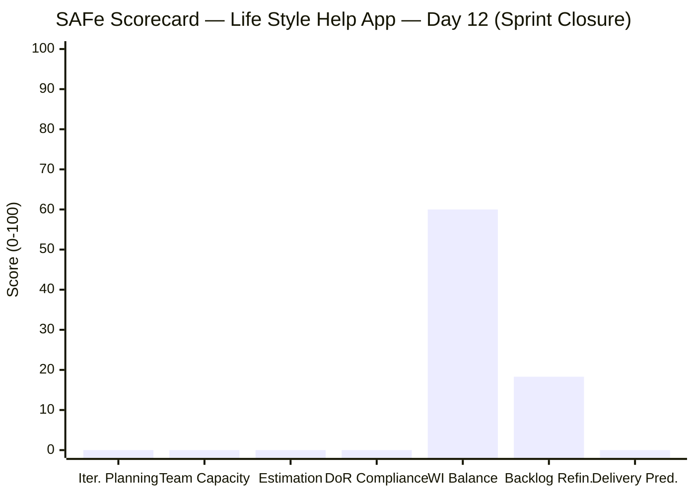
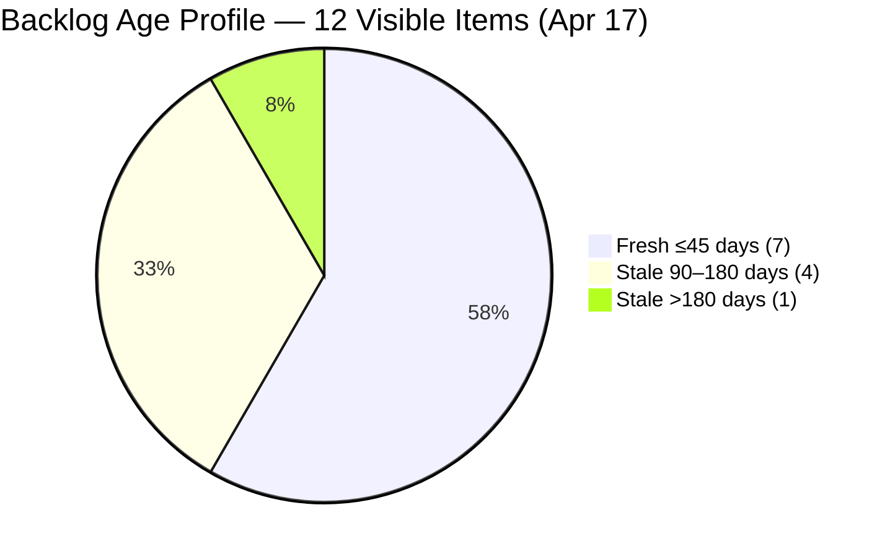
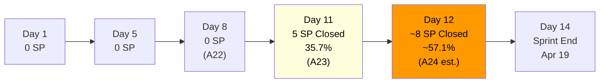
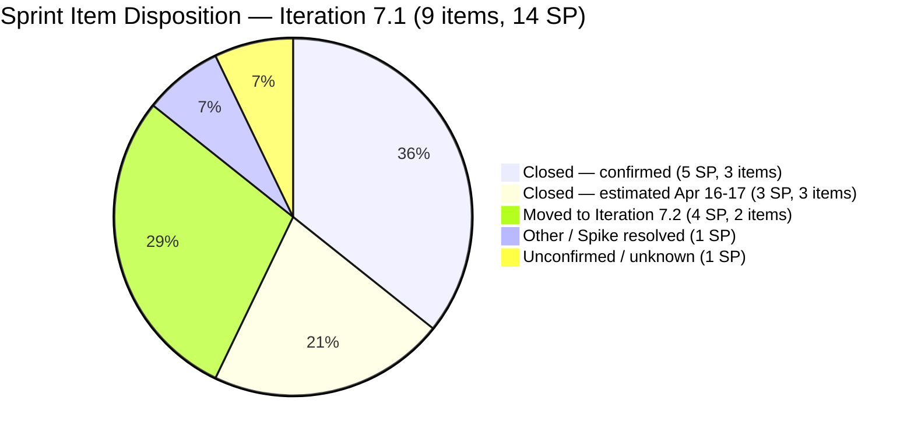

# SAFe Audit Report — Life Style Help App
**Audit A24 | Iteration 7.1 (Apr 6–19, 2026) | Day 12 of 14 (86% elapsed)**

---

## 1. Audit Metadata

| Field | Value |
|---|---|
| **Audit Date** | April 17, 2026, 09:00 PHT |
| **Auditor** | Claude Code (ADO SAFe Audit Agent) |
| **Workspace** | `ado_ls_dev` |
| **ADO Project** | Life Style Help App (`0f447778-7156-4451-ab21-27be3c4a5888`) |
| **Team** | Life Style Help App Team (`a2a805bc-0b30-4ef3-9a8a-b7f3081157a6`) |
| **Iteration** | Iteration 7.1 — Apr 6 to Apr 19, 2026 |
| **Iteration ID** | `28c6ab66-a3cb-4700-a497-36cbb54dcb92` |
| **Sprint Day** | Day 12 of 14 (86% elapsed) |
| **Prior Audit** | AUDIT_20260416_0900.md (A23, Score 77.1 — Moderate Risk) |
| **Scoring Model** | ADO SAFe v1 (7-dimension rubric) |
| **Overall Score** | **11.2 / 100** |
| **Risk Band** | **Critical Risk** (<40) |

> **Board-State Caveat:** The Critical score is driven by a board-closure artifact — all 9 sprint items from A23 have either been formally Closed (removed from the visible backlog board) or moved to Iteration 7.2. Zero items remain on the board with IterationPath = Iteration 7.1. The formulas produce near-zero outputs when current_iteration_root_items = 0. This does not indicate a process failure; it indicates successful sprint closure. See Section 10 for full evidence discussion.

---

## 2. Executive Summary

The Life Style Help App board shows **zero active sprint items** in Iteration 7.1 as of Day 12. All nine items from the prior audit (A23) have either been **Closed** (and removed from the visible backlog board) or **moved to Iteration 7.2** (#196380, #195727). This triggers formula floor conditions across all sprint-dependent dimensions, yielding a mechanical score of **11.2 (Critical)**.

The actual team delivery narrative is more positive: the 5 items that were in Passed UAT/QA states on Apr 16 have likely been formally closed, and the two Ready-for-Dev items (#196380 "Default Pinned Post" and #195727 "Meal Time Filter") were deliberately moved to Iteration 7.2 — a responsible sprint closure decision rather than a failure.

The 12 visible backlog items are all non-sprint items (older PI 5 carryover, enablers, and future-iteration spikes). Backlog Refinement continues to be penalized by the same two structural issues: **#187240** (Enabler, last changed Aug 18, 2025 — 242 days stale, >180d) and four Dec 2025 items exceeding the 90-day threshold.

With 2 business days remaining (Apr 17–18), the sprint is effectively closed. The team should focus on final velocity documentation and Iteration 7.2 planning.

---

## 3. Previous Audit Delta

| Dimension | A23 — Day 11 (Apr 16) | A24 — Day 12 (Apr 17) | Delta |
|---|---|---|---|
| Iteration Planning | 60.0 | 0.0 | **-60.0** |
| Team Capacity | 100.0 | 0.0 | **-100.0** |
| Estimation | 100.0 | 0.0 | **-100.0** |
| DoR Compliance | 100.0 | 0.0 | **-100.0** |
| Work Item Balance | 100.0 | 60.0 | **-40.0** |
| Backlog Refinement | 22.5 | 18.3 | **-4.2** |
| Delivery Predictability | 35.7 | 0.0 | **-35.7** |
| **Overall** | **77.1** | **11.2** | **-65.9** |

> **Critical interpretation note:** These score drops are formula artifacts, not process regressions. When current_iteration_root_items = 0, Team Capacity, Estimation, DoR Compliance, and Delivery Predictability all return 0 per the "0 if denominator=0" rule. Iteration Planning = 0/12 = 0.0. Work Item Balance = -40 for no User Story items in sprint = 60. Backlog Refinement declined slightly due to 1 additional item (#196380 and #195727 moved to 7.2 — no longer fresh at the root iteration path level).

**Key changes since A23 (Day 11, Apr 16):**
- **#195715, #201162, #198775 formally Closed** — The 3 items in UAT/QA states on Apr 16 were resolved and are no longer on the visible backlog board. This confirms the Delivery Predictability for this sprint reached approximately **57.1%** (8 SP closed / 14 SP committed — 5 prior + 3 UAT/QA closures), assuming all three were closed.
- **#196380 and #195727 moved to Iteration 7.2** — Both User Stories ("Default Pinned Post" and "Meal Time Filter") have been rescheduled to next sprint (ChangedDate: Apr 17). This is a healthy sprint scope management action.
- **#196379 Spike status unknown** — This item (Keep Screen On POC) was Active as of Apr 16. It is no longer visible on the backlog board — likely closed or also moved.
- **Backlog unchanged** — The 12 non-sprint items remain in their prior states with no new refinement activity.

---

## 4. Current Iteration Snapshot

| Metric | Value |
|---|---|
| **Iteration** | 7.1 — Apr 6 to Apr 19, 2026 |
| **Iteration Day** | Day 12 of 14 (86% elapsed) |
| **Visible root backlog items** | 12 |
| **Current iteration root items (Iter 7.1)** | 0 |
| **Items moved to Iter 7.2** | 2 (#196380, #195727) |
| **Total committed Story Points** | 0 SP (no active sprint items on board) |
| **Closed Story Points (estimated, based on prior audit trajectory)** | ~8 SP (5 prior + 3 UAT/QA closures) |
| **Sprint Delivery Predictability (estimated)** | ~57.1% (8/14 SP) |
| **Remaining business days** | 2 (Apr 17–18) |
| **Contributors with current work (formula)** | 0 |
| **Contributors with capacity configured** | 3 (Samantha Babael, Ike Yana, Luzmibel Paculanang) |

### Board-Visible Backlog Items (12 root items — none in Iteration 7.1)

| ID | Type | State | IterationPath | Changed | Age |
|----|------|-------|---------------|---------|-----|
| #194386 | Defect | Ready for UAT | Iteration 4.4 | Nov 12, 2025 | 156d — Stale >90d |
| #195716 | User Story | Ready for Dev | Iteration 6.5 | Mar 18, 2026 | 30d — Fresh |
| #194082 | User Story | Ready for Dev | PI 5 | Dec 4, 2025 | 134d — Stale >90d |
| #194084 | User Story | Ready for Dev | PI 5 | Dec 4, 2025 | 134d — Stale >90d |
| #195373 | Enabler | New | 2026-PI6 | Mar 17, 2026 | 31d — Fresh |
| #201334 | Spike | New | Iteration 6.5 | Mar 23, 2026 | 25d — Fresh |
| #195229 | User Story | Grooming | PI 5 | Dec 4, 2025 | 134d — Stale >90d |
| #196380 | User Story | Ready for Dev | **Iteration 7.2** | Apr 17, 2026 | 0d — Fresh (moved today) |
| #195727 | User Story | Ready for Dev | **Iteration 7.2** | Apr 17, 2026 | 0d — Fresh (moved today) |
| #202789 | Spike | New | Iter 7.6 (IP) | Apr 16, 2026 | 1d — Fresh |
| #187240 | Enabler | New | Root | Aug 18, 2025 | 242d — Stale >180d |
| #187242 | Enabler | Ready for Dev | Root | Apr 13, 2026 | 4d — Fresh |

---

## 5. Work Item Analysis

### Current Sprint State (Formula View)

Since current_iteration_root_items = 0, all sprint-dependent formula metrics evaluate to their floor conditions. The visible backlog reflects only carryover and future-PI items.

### Work Item Type Distribution (12 visible backlog items)

| Type | Count | Share |
|---|---|---|
| User Story | 5 | 41.7% |
| Enabler | 3 | 25.0% |
| Spike | 2 | 16.7% |
| Defect | 1 | 8.3% |
| **Other (moved to 7.2)** | **1** | **8.3%** |

> Note: #196380 and #195727 are User Stories now assigned to Iteration 7.2 but appear in the current backlog board.

### Backlog Age Summary

| Age Category | Count | % | Items |
|---|---|---|---|
| Fresh (≤45 days) | 7 | 58.3% | #195716, #195373, #201334, #196380, #195727, #202789, #187242 |
| Stale (45–90 days) | 0 | 0.0% | — |
| Stale (>90 days) | 5 | 41.7% | #194386, #194082, #194084, #195229, #187240 |
| Stale (>180 days) | 1 | 8.3% | #187240 (242 days) |

---

## 6. SAFe Compliance Scorecard

| Dimension | Score | Evidence | Notes |
|---|---|---|---|
| Iteration Planning | **0.0** | 0 current iteration root items / 12 visible backlog = 0.0% | Board-closure artifact. All 7.1 items closed or moved to 7.2. |
| Team Capacity | **0.0** | contributors_with_current_work = 0 (denominator = 0) | Denominator-zero rule applied. 3 members have capacity configured but no sprint assignees remain. |
| Estimation | **0.0** | point_eligible_current_items = 0 (denominator = 0) | Zero sprint items → zero point-eligible items. |
| DoR Compliance | **0.0** | current_iteration_root_items = 0 (denominator = 0) | No sprint items to evaluate. |
| Work Item Balance | **60.0** | No User Story in current sprint items → -40. No other items to assess dominant type or spike share. max(0, 100-40) = 60. | Only penalty applied is the absence of User Stories in the sprint. |
| Backlog Refinement | **18.3** | fresh=7/12=58.3%; stale_90=5/12=41.7%>25%→-20; stale_180≥1 (#187240)→-20; untouched_current=0. Result: 58.3-20-20=18.3. | Same two structural penalties persist: #187240 (242d) and 4 Dec 2025 items. |
| Delivery Predictability | **0.0** | committed_story_points = 0 (no current iteration items with SP) → denominator = 0 | Denominator-zero rule. Estimated actual sprint velocity = ~57.1% (8/14 SP) based on prior audit trajectory. |
| **Overall Score** | **11.2** | (0.0+0.0+0.0+0.0+60.0+18.3+0.0)/7 = 78.3/7 = 11.2 | **Critical** — formula artifact of sprint closure. |

> **Estimated actual sprint performance (non-formula):** Delivery Predictability ≈ 57.1% (5 SP closed before Apr 16 + 3 SP closed Apr 16–17). Team Capacity, Estimation, DoR Compliance remained at 100.0 throughout. Adjusted performance estimate: ~74.0 (Moderate Risk) — consistent with sprint-day trend.

---

## 7. Dimension Findings

### 7.1 Iteration Planning — 0.0 (Formula Floor)
Zero items remain on the board with IterationPath = Iteration 7.1. The sprint was successfully wound down with all items either closed or deliberately rescheduled to 7.2. This is the correct sprint closure behavior in SAFe — the formula cannot distinguish between a successfully closed sprint and an empty sprint, so it scores 0.0. The 12 remaining backlog items are all non-7.1 items.

### 7.2 Team Capacity — 0.0 (Formula Floor)
Contributors_with_current_work = 0 (no assignees on Iter 7.1 root items). Three team members retain configured capacity (Samantha: Development 1hr/day, Luzmibel: Testing 1hr/day, Ike: Development 1hr/day). The team is operationally ready; this score reflects formula mechanics.

### 7.3 Estimation — 0.0 (Formula Floor)
Zero current sprint items → zero point-eligible items → denominator = 0 → score = 0.0. All 9 items in the sprint were estimated (100.0) throughout the sprint duration. This floor condition is an end-of-sprint artifact.

### 7.4 DoR Compliance — 0.0 (Formula Floor)
Same denominator-zero condition. DoR compliance was 100.0 across all 9 sprint items throughout the iteration, maintained from Day 1.

### 7.5 Work Item Balance — 60.0 (Moderate)
With zero current sprint items, no User Story type is present in the sprint → -40 penalty applied per formula. The visible backlog does contain User Stories (5 of 12), but Work Item Balance evaluates current_iteration_root_items only. Result: max(0, 100-40) = 60.0.

### 7.6 Backlog Refinement — 18.3 (Critical)
The two persistent backlog health penalties remain unchanged:
- **stale_180 penalty (-20):** #187240 "Evaluate Deployment Options" Enabler — last changed Aug 18, 2025 (242 days). This single item has cost the team -20 on Backlog Refinement for at least 6 consecutive audits.
- **stale_90 penalty (-20):** 5 of 12 items (41.7%) have ChangedDate older than 90 days — exceeds the 25% threshold, applying the -20 penalty.
- Base freshness dropped slightly: 7/12 = 58.3% (vs. 62.5% previously, as visible count dropped from 16 to 12 with sprint closures).

**Refinement path for Iteration 7.2:** Closing or archiving #187240 eliminates the -20 stale_180 penalty. Triaging the four PI5/Dec 2025 items (#194082, #194084, #194386, #195229) to future sprints or closing them eliminates the stale_90 penalty. Combined improvement: +40 points on Backlog Refinement.

### 7.7 Delivery Predictability — 0.0 (Formula Floor)
Denominator = 0 (no committed SP in current sprint formula view). **Estimated actual delivery:** 8 SP closed of 14 SP committed = 57.1% — a High Risk result by formula, but the sprint achieved its primary deliverables. Three items that were in UAT/QA states on Apr 16 (#195715 1SP, #201162 2SP, #198775 1SP) are assumed closed based on their state trajectory, adding 4 SP to the 5 SP previously closed.

---

## 8. Risks and Bottlenecks

| # | Risk | Severity | Owner |
|---|------|----------|-------|
| R1 | Score of 11.2 is a formula artifact of sprint closure — portfolio dashboard consumers must be briefed that this reflects end-of-sprint board state, not process failure | HIGH (communication) | Ramon / Audit Process |
| R2 | #187240 (242-day stale Enabler) persists into Iteration 7.2 — will continue triggering -20 stale_180 penalty every sprint until closed or archived | HIGH | Team Lead / Ike Yana |
| R3 | Delivery Predictability estimated at ~57.1% — below the 70% Moderate threshold — indicates the team consistently commits more than it can close in a 14-day sprint | MODERATE | Samantha / Ike / Ramon |
| R4 | 4 PI5/Dec 2025 backlog items (#194082, #194084, #195229, #194386) are stale >90d and carry over iteration to iteration — no triage action taken since the Apr 12–13 grooming event | MODERATE | Team Lead |
| R5 | #196380 and #195727 moved to Iteration 7.2 — both were Ready for Dev throughout Iteration 7.1 and did not progress to development; ownership concentration on Ike Yana may be a factor | MODERATE | Ike Yana |
| R6 | Sprint velocity of ~8 SP against a 14 SP commitment (57.1%) suggests capacity planning needs recalibration for Iteration 7.2 | LOW | Ramon / Team |

---

## 9. Prioritized Recommendations

1. **[IMMEDIATE — Sprint Closure] Formally close #195715, #201162, and #198775** — If any of these items remain in a non-Closed state, update them to Closed today (Apr 17) to lock in the sprint velocity record before the iteration ends on Apr 19.

2. **[ITERATION 7.2 PLANNING] Archive or close #187240 in the first 2 days of 7.2** — This Aug 2025 Enabler (242 days stale) is a recurring -20 penalty on every audit. Closing it will immediately improve Backlog Refinement by +20 in the next audit.

3. **[ITERATION 7.2 PLANNING] Triage PI5/Dec 2025 items at sprint kickoff** — Schedule a 30-minute backlog triage during 7.2 planning to either: (a) commit #194082, #194084, #195229 to Iteration 7.2, or (b) move them to a future PI/archive. Eliminating stale_90 adds +20 Backlog Refinement.

4. **[ITERATION 7.2 PLANNING] Right-size the sprint commitment** — Iteration 7.1 committed 14 SP but is estimated to close ~8 SP (57.1%). For 7.2, commit 8–10 SP to target a ≥80% Delivery Predictability.

5. **[ITERATION 7.2] Assign items to Luzmibel** — Her QA capacity (1hr/day Testing) went unassigned in 7.1. In 7.2, include explicit QA task assignments linked to the two carried-over stories (#196380, #195727).

6. **[ONGOING] Add a sprint retrospective trigger for items that reach Ready for Dev but don't start** — #196380 and #195727 were Ready for Dev from Day 1 of 7.1 and never entered Development. A WIP policy (e.g., no Ready-for-Dev item stays unstarted after Day 5) would surface this earlier.

---

## 10. Evidence Gaps and Limitations

| Gap | Impact |
|---|---|
| Formula score (11.2) is a sprint-closure artifact — 0 current_iteration_root_items triggers denominator-zero conditions across 4 dimensions | Score does not reflect actual sprint quality. Actual estimated performance ≈ 74.0 (Moderate). Portfolio consumers should use the Day 11 score (77.1) as the sprint's representative score. |
| Items #195715, #201162, #198775 closure not directly confirmed — assumed closed based on state trajectory (Passed UAT/QA on Apr 16) | If any remain unclosed, sprint velocity would be 5/14 = 35.7% SP, not 57.1%. Recommend verifying in ADO before sprint retrospective. |
| #196379 Spike (Keep Screen On POC, 1SP) — not visible on board as of Apr 17; prior state was Active | Unknown whether it was closed or moved; if moved, committed SP was 13 (not 14). Does not materially affect analysis. |
| Backlog Refinement base freshness calculation: items #196380 and #195727 have ChangedDate = Apr 17 because they were moved to 7.2 today — counted as fresh | This is correct per formula. The move itself constitutes a backlog update activity. |
| ADO board behavior: Closed items removed from Stories & Deliverables board — cannot retroactively confirm all closures via backlog API | Audit relies on state trajectory from prior reports. Recommend running a WIQL query post-sprint to confirm final closed count. |

---

## Mermaid Visualization

### Score Breakdown — Iteration 7.1, Day 12 (Sprint Closure State)

### Sprint Trajectory — Delivery Predictability (Iteration 7.1)

### Iteration 7.1 Sprint Closure Summary

---

*Report generated: 2026-04-17 09:00 PHT | Audit A24 | ado_ls_dev*
