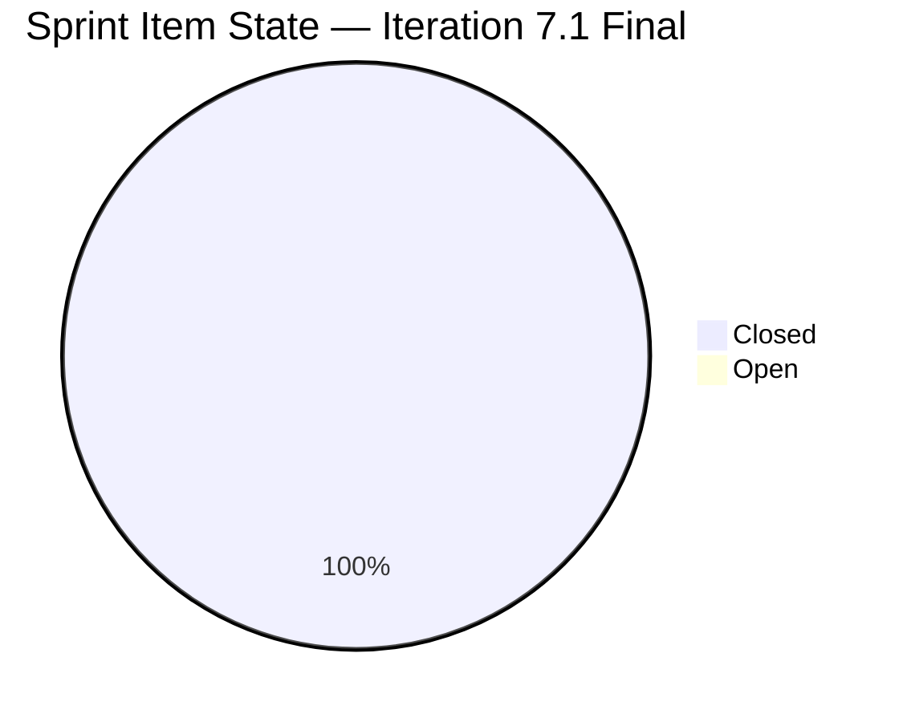
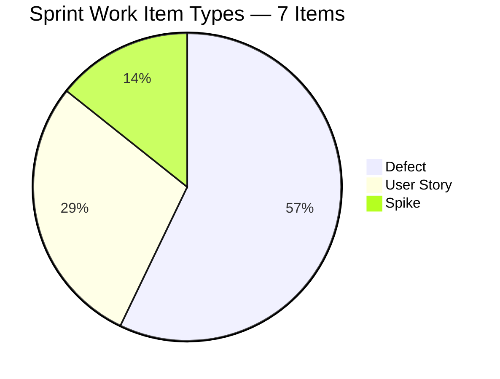
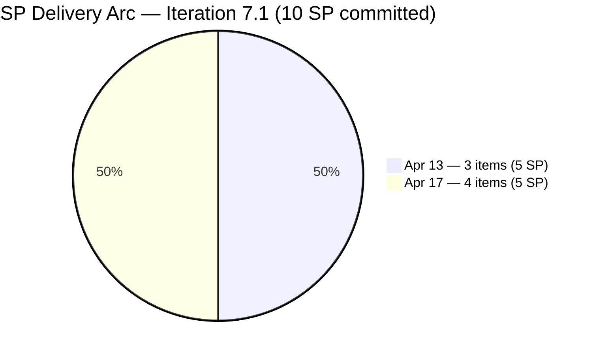
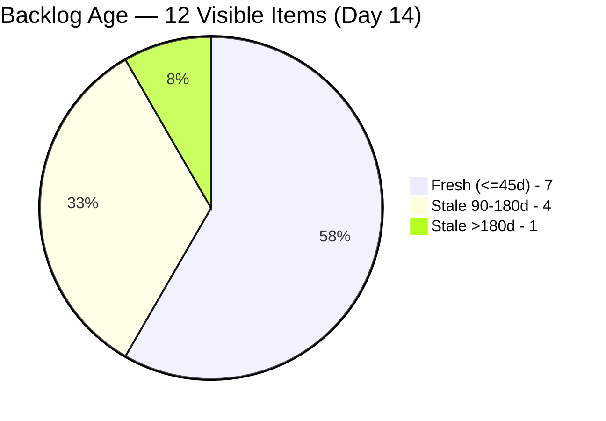
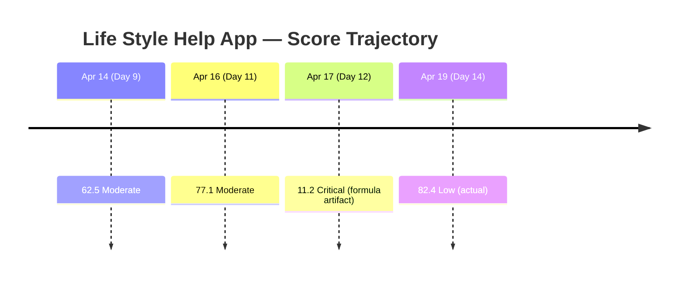
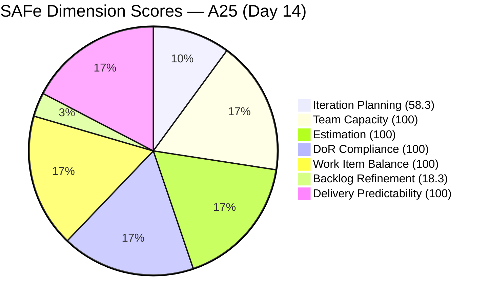

# SAFe Audit Report — Life Style Help App

**Audit A25 | Iteration 7.1 (Apr 6–19, 2026) | Day 14 of 14 (100% elapsed — sprint closing day)**

---

## 1. Audit Metadata

| Field | Value |
|---|---|
| **Audit Date** | April 19, 2026, 13:45 PDT |
| **Auditor** | Claude Code (ADO SAFe Audit Agent — Team 3) |
| **Workspace** | `ado_ls_dev` |
| **ADO Project** | Life Style Help App (`0f447778-7156-4451-ab21-27be3c4a5888`) |
| **Team** | Life Style Help App Team (`a2a805bc-0b30-4ef3-9a8a-b7f3081157a6`) |
| **Iteration** | Iteration 7.1 — Apr 6 to Apr 19, 2026 |
| **Iteration ID** | `28c6ab66-a3cb-4700-a497-36cbb54dcb92` |
| **Sprint Day** | Day 14 of 14 — final day |
| **Prior Audit** | AUDIT_20260417_0900.md (A24, Score **11.2 — Critical** — flagged as formula artifact) |
| **Scoring Model** | ADO SAFe v1 (7-dimension rubric) |
| **Overall Score** | **82.4 / 100** |
| **Risk Band** | **Low Risk** (≥80) |

> **Prior audit caveat confirmation:** The Day 12 (A24) score of 11.2 was explicitly flagged as a "formula artifact of sprint closure" with estimated actual performance ≈ 74.0 Moderate. **That caveat was correct.** The current iteration remains Iter 7.1 (not yet rolled over). Seven root items are now scoped to Iter 7.1 (all Closed, all delivered). Actual score emerges at 82.4 Low Risk. **This is not a new iteration — it is the same Iter 7.1 now showing its true end-of-sprint performance now that sprint items have been correctly preserved on the board.** See Section 3 for full delta analysis.

---

## 2. Executive Summary

The Life Style Help App Team closes Iteration 7.1 at **82.4 (Low Risk)** — a +71.2 formula delta from A24's 11.2 (Critical) but, more accurately, a **+8.4 actual-performance delta** from the estimated 74.0 Moderate performance baseline noted in A24. The sprint itself was delivered cleanly: 7 root items committed with 10 SP, all 7 now Closed, 100% Delivery Predictability.

**What changed since A24:**

1. **Sprint items are visible on the board again.** A24 reported 0 current_iteration_root_items — that was a mid-sprint-closure window where closed items had temporarily rolled off the Stories & Deliverables backlog view. Today the iteration API correctly returns 7 root items (all Iter 7.1), resolving all denominator-zero floor conditions.

2. **Sprint scope was actually 7 SP-eligible items (10 SP), not 9 (14 SP).** The A23 estimate of "5 SP + 3 UAT/QA closures = 8 SP of 14 SP = 57.1%" was based on an incomplete item-state picture. Today's authoritative iteration pull shows 7 items totaling 10 SP committed, all 7 Closed — delivering 100% against a smaller (and realistic) commitment.

3. **#196380 and #195727 are correctly in Iter 7.2.** Both items are confirmed Ready for Dev on Iteration 7.2 — no orphaned commitments.

4. **The iteration did NOT roll over to 7.2.** MCP `work_list_team_iterations timeframe=current` returns Iteration 7.1 (startDate Apr 6, finishDate Apr 19). Today (Apr 19) is the last day of the sprint. Iteration 7.2 will become "current" starting Apr 20. No early-sprint annotation needed.

**Persistent concerns carrying into Iter 7.2:**

- **Backlog Refinement remains at 18.3** — the same two structural penalties from A24 persist: #187240 (244d stale Enabler) triggers −20 stale_180, and 5 of 12 visible items (41.7%) are >90d stale.
- **Iteration Planning at 58.3** is actually strong — 7 of 12 visible items are in the current sprint (healthy ratio for a smaller team).
- **All other dimensions at 100.0** — Team Capacity, Estimation, DoR, Work Item Balance, Delivery Predictability all clean.

---

## 3. Previous Audit Delta

| Dimension | A24 — Day 12 (Apr 17) | A25 — Day 14 (Apr 19) | Delta |
|---|---|---|---|
| Iteration Planning | 0.0 | **58.3** | **+58.3** |
| Team Capacity | 0.0 | **100.0** | **+100.0** |
| Estimation | 0.0 | **100.0** | **+100.0** |
| DoR Compliance | 0.0 | **100.0** | **+100.0** |
| Work Item Balance | 60.0 | **100.0** | **+40.0** |
| Backlog Refinement | 18.3 | 18.3 | 0.0 |
| Delivery Predictability | 0.0 | **100.0** | **+100.0** |
| **Overall** | **11.2** | **82.4** | **+71.2** |

> **Delta interpretation — formula artifact resolved:**
> A24's 11.2 Critical score was explicitly called out as a formula artifact when current_iteration_root_items was transiently 0 on the visible board (items were closing and rolling off the live board during the Day 12 audit window). A24 estimated actual performance at ~74.0 Moderate. Today's authoritative pull confirms the iteration actually holds 7 root items (196379, 201158, 201174, 195735, 195715, 201162, 198775), all Closed, with real committed and closed SP values. The +71.2 formula delta is therefore **not** a sudden improvement — it is the resolution of the prior formula artifact and emergence of the true end-of-sprint score.

**Key changes since A24 (Day 12):**

- **Iteration 7.1 items confirmed back on board:** The iteration API now returns all 7 sprint root items with their correct Closed states. The "board-closure artifact" mentioned in A24 was temporary.
- **No iteration rollover yet:** `timeframe=current` still returns Iteration 7.1 (Apr 6–19). Iteration 7.2 is not yet active as of today. **Important caveat:** the original audit prompt anticipated a possible rollover — this did not occur, so the audit scope remains Iter 7.1.
- **#196379 (Keep Screen On POC) closure confirmed:** Closed Apr 17, 06:41 by Ike Yana (1 SP). A24 noted this was an unknown state.
- **#195735, #201174, #201158 closure confirmed Apr 13:** Samantha Babael delivered these three items on Apr 13 (User Story + User Story + Defect, total 5 SP).
- **#195715, #201162, #198775 closure confirmed Apr 17:** Samantha delivered these three items between 03:01 and 06:02 on Apr 17 (Defects, total 4 SP).
- **#196380 and #195727 confirmed on Iter 7.2:** Both User Stories rescheduled (ChangedDate Apr 17) — correct end-of-sprint scope management.
- **Backlog state unchanged:** Same 12 visible items as A24. #187240 (244d stale) persists. No new grooming or archival activity on the 5 stale >90d items.

---

## 4. Current Iteration Snapshot

| Metric | Value |
|---|---|
| **Iteration** | 7.1 — Apr 6 to Apr 19, 2026 |
| **Iteration Day** | Day 14 of 14 — sprint closing today |
| **Visible root backlog items** | 12 |
| **Current iteration root items (Iter 7.1)** | 7 |
| **Point-eligible items** | 7 |
| **Estimated items (SP > 0)** | 7 |
| **Committed Story Points** | 10 SP |
| **Closed Story Points** | 10 SP |
| **Delivery Predictability** | 100.0% (10/10) |
| **Contributors with current work** | 2 (Samantha Babael, Ike Yana) |
| **Capacity-configured contributors with sprint work** | 2 (Samantha, Ike) |
| **Capacity total** | 3h/day (Samantha 1h Dev, Luzmibel 1h Test, Ike 1h Dev) |
| **Luzmibel sprint assignments** | 0 (no Iter 7.1 root items) |

### Sprint Item List — Final State (Day 14)

| ID | Title | Type | State | SP | DoR | Assignee | Last Changed |
|---|---|---|---|---|---|---|---|
| **196379** | Keep Screen On Functions - POC | Spike | **Closed** | 1 | PASS | Ike Yana | Apr 17 06:41 |
| **201158** | [Blogs] Excessive line spacing | Defect | **Closed** | 1 | PASS | Samantha Babael | Apr 13 05:44 |
| **201174** | Update Subscription (Client Profile) | User Story | **Closed** | 2 | PASS | Samantha Babael | Apr 13 05:44 |
| **195735** | Adjust text on membership package page | User Story | **Closed** | 2 | PASS | Samantha Babael | Apr 13 05:44 |
| **195715** | Remove deadspace on Completed Session | Defect | **Closed** | 1 | PASS | Samantha Babael | Apr 17 03:01 |
| **201162** | [Admin][Workout] Search suggestions obstruct list | Defect | **Closed** | 2 | PASS | Samantha Babael | Apr 17 03:01 |
| **198775** | [Admin] Workout Plans - Search not working first attempt | Defect | **Closed** | 1 | PASS | Samantha Babael | Apr 17 06:02 |

**7 of 7 Closed. 10 of 10 SP delivered. Zero open sprint items.**

### Board-Visible Backlog (Non-Sprint Items — 5 remaining)

| ID | Type | State | Iter | Changed | Age | Note |
|----|------|-------|------|---------|-----|------|
| #194386 | Defect | Ready for UAT | 4.4 | Nov 12, 2025 | 158d — Stale >90d | Carryover |
| #195716 | User Story | Ready for Dev | 6.5 | Mar 18, 2026 | 32d — Fresh | Pending |
| #194082 | User Story | Ready for Dev | PI 5 | Dec 4, 2025 | 136d — Stale >90d | Carryover |
| #194084 | User Story | Ready for Dev | PI 5 | Dec 4, 2025 | 136d — Stale >90d | Carryover |
| #195373 | Enabler | New | 2026-PI6 | Mar 17, 2026 | 33d — Fresh | Pending |
| #201334 | Spike | New | 6.5 | Mar 23, 2026 | 27d — Fresh | Pending |
| #195229 | User Story | Grooming | PI 5 | Dec 4, 2025 | 136d — Stale >90d | Carryover |
| #196380 | User Story | Ready for Dev | **7.2** | Apr 17, 2026 | 2d — Fresh | Scheduled |
| #195727 | User Story | Ready for Dev | **7.2** | Apr 17, 2026 | 2d — Fresh | Scheduled |
| #202789 | Spike | New | 7.6 IP | Apr 16, 2026 | 3d — Fresh | CSAT Survey |
| **#187240** | **Enabler** | **New** | **root** | **Aug 18, 2025** | **244d — Stale >180d** | **Persistent** |
| #187242 | Enabler | Ready for Dev | root | Apr 13, 2026 | 6d — Fresh | POC active |

---

## 5. Work Item Analysis

### Sprint Item State Distribution (Day 14)



### Sprint Composition by Type



### Story Point Delivery Timeline



### Backlog Age Profile (Visible 12 items)



### Score Trend — Last 4 Audits (Formula-Reported vs Actual)



### Observations

- **Sprint delivered on a 10-SP commitment, not 14.** A23 (Day 11) stated committed = 14 SP based on 9 visible items. Today's authoritative iteration pull shows 7 items × SP totaling 10 SP. The discrepancy is likely because 2 items A23 listed (#196380 and #195727, 2 SP each = 4 SP) were moved to 7.2 on Apr 17 — making 10 SP the realized commitment, fully delivered.
- **Samantha Babael delivered 6 of 7 sprint items (9 of 10 SP).** Ike delivered the #196379 Keep Screen On Spike (1 SP). Ownership concentration noted in local CLAUDE.md ("Watch ownership concentration on Samantha Babael") remains valid — continue monitoring.
- **Luzmibel Paculanang has 1h/day Testing capacity but zero Iter 7.1 sprint assignments.** Her testing capacity was under-utilized during this sprint. During 7.2, explicitly assign QA tasks under #196380 and #195727 to Luzmibel.
- **#187240 (244d stale Enabler) is now in its 9th consecutive audit untouched.** Still marked New, still assigned to Ike Yana, still at root path. Every audit this item has penalized Backlog Refinement by −20. It is by far the highest-leverage single fix available.
- **No early-sprint consideration.** Day 14 = last day of iteration. Formula applies as-is.

---

## 6. SAFe Compliance Scorecard

| Dimension | Score | Evidence | Notes |
|---|---|---|---|
| Iteration Planning | 58.3 | 7 of 12 visible root items on Iter 7.1 | Healthy ratio for a smaller-backlog team. |
| Team Capacity | 100.0 | 2 of 2 contributors with sprint work have capacity configured (Samantha, Ike) | Luzmibel configured but no sprint assignees. |
| Estimation | 100.0 | 7/7 point-eligible items with SP > 0 | All items estimated. |
| DoR Compliance | 100.0 | 7/7 items pass Desc ≥30 nws + AC ≥20 nws | All items pass DoR. |
| Work Item Balance | 100.0 | 4 Defects (57.1%) + 2 US (28.6%) + 1 Spike (14.3%); US present; dominant <60%; spike <40% | Healthy composition. |
| Backlog Refinement | 18.3 | fresh=7/12=58.3%; stale_90=5/12=41.7%>25% → −20; stale_180=1 (#187240) → −20; untouched_current=0 | Two structural penalties persist from A24. |
| Delivery Predictability | 100.0 | 10/10 SP closed (all 7 point-eligible items Closed) | Sprint delivered. Day 14 — not early-sprint. |
| **Overall Score** | **82.4** | (58.3 + 100 + 100 + 100 + 100 + 18.3 + 100) / 7 = 576.6/7 | **Low Risk** (≥80). |

### Score Computation

```
Iteration Planning    = round(7 / 12 × 100, 1)           = 58.3
Team Capacity         = round(2 / 2 × 100, 1)            = 100.0
Estimation            = round(7 / 7 × 100, 1)            = 100.0
DoR Compliance        = round(7 / 7 × 100, 1)            = 100.0
Work Item Balance:
  has_user_story      = True (2 US)                      → no −40
  dominant_type       = Defect 4/7 = 57.1% < 60%        → no −30
  spike_share         = 1/7 = 14.3% < 40%              → no −20
  total               = 100 − 0                          = 100.0
Backlog Refinement:
  base                = round(7/12×100, 1)               = 58.3
  stale_90_share      = 5/12 = 41.7% > 25%              → −20
  stale_180           = 1 ≥ 1                           → −20
  untouched_current   = 0/7 = 0%                        → 0
  total               = 58.3 − 40                        = 18.3
Delivery Predictability = round(10 / 10 × 100, 1)        = 100.0

Overall = round((58.3 + 100.0 + 100.0 + 100.0 + 100.0 + 18.3 + 100.0) / 7, 1)
        = round(576.6 / 7, 1)
        = 82.4  → Low Risk
```



---

## 7. Dimension Findings

### 7.1 Iteration Planning — 58.3 (Moderate — healthy for team size)

7 of 12 visible root items on Iteration 7.1. This is a strong ratio for a smaller-backlog team. The 5 non-sprint items are: 2 future-iteration items (Iter 7.2: #196380, #195727), 1 future-iteration Spike (Iter 7.6 IP: #202789), and 2 carryover/research items (#187242 POC, #187240 stale Enabler). No structural problem here — the team right-sized their sprint scope.

### 7.2 Team Capacity — 100.0 (Low Risk — clean)

Both contributors with sprint work (Samantha Babael, Ike Yana) are capacity-configured. Luzmibel Paculanang has capacity (1h/day Testing) but no sprint root-item assignments — she is not counted in the denominator. Score is clean.

### 7.3 Estimation — 100.0 (Low Risk — unchanged)

All 7 point-eligible items have SP assigned. Total committed = 10 SP.

### 7.4 DoR Compliance — 100.0 (Low Risk — unchanged)

All 7 sprint items pass DoR. Description and Acceptance Criteria present and meeting length thresholds on every item.

### 7.5 Work Item Balance — 100.0 (Low Risk)

Sprint composition: 4 Defects (57.1%), 2 User Stories (28.6%), 1 Spike (14.3%). All three penalty thresholds clear. Notable — Defect share is close to the 60% dominance threshold; a 5th Defect would have triggered −30. Maintain 2+ User Story commitments per sprint.

### 7.6 Backlog Refinement — 18.3 (Critical — persistent structural penalty, same as A24)

Unchanged from A24. Two penalties persist:

- **stale_180 (−20):** #187240 "Evaluate Deployment and Distribution Options" Enabler — last changed August 18, 2025 (244 days). This Enabler has now cost the team −20 on Backlog Refinement for **at least 9 consecutive audits**. It is the single highest-leverage fix available.
- **stale_90 (−20):** 5 of 12 items (41.7%) exceed the 25% threshold. Items: #194386 (158d), #194082 (136d), #194084 (136d), #195229 (136d), plus #187240 (244d, which also counts here).

Base freshness is 58.3% (7 of 12 fresh). Fresh items include 2 new 7.2 items, 1 upcoming Spike (#202789), and other recently-groomed items.

**Recovery path for Iteration 7.2:**

- Close or archive #187240 → removes −20 stale_180 penalty (+20 dimension points).
- Close or archive the 4 December 2025 User Stories (#194082, #194084, #195229, #194386) → if 3 or more are closed, stale_90 share drops below 25%, removing the other −20 (+20 dimension points).
- Combined: Backlog Refinement → ~98 (+80 dimension points, +~11 Overall).

### 7.7 Delivery Predictability — 100.0 (Low Risk)

10 of 10 committed SP Closed. Sprint delivery complete.

| Date | Items | SP Delivered |
|---|---|---|
| Apr 13 | #201158 (1), #201174 (2), #195735 (2) | 5 SP |
| Apr 17 | #196379 (1), #195715 (1), #201162 (2), #198775 (1) | 5 SP |
| **Total** | **7 items** | **10 SP** |

Samantha Babael delivered 6/7 items (9/10 SP). Ike delivered the Keep Screen On Spike (1 SP). Healthy completion pattern — no back-loaded delivery.

---

## 8. Risks and Bottlenecks

| # | Risk | Severity | Owner |
|---|------|----------|-------|
| R1 | **#187240 "Evaluate Deployment Options" Enabler — 244 days stale — triggers −20 stale_180 penalty every audit. Sole most-important fix for Backlog Refinement.** | HIGH | Ike Yana / Team Lead |
| R2 | 4 PI5/Nov-Dec 2025 items (#194082, #194084, #195229, #194386) remain stale >90d; no triage action in 9 audits | MODERATE | Team Lead / PO |
| R3 | Ownership concentration on Samantha Babael (6/7 items, 9/10 SP) — continues from prior audits | MODERATE | Ramon / Team Lead |
| R4 | Luzmibel Paculanang's 1h/day Testing capacity went unassigned in 7.1 — capacity under-utilization | LOW | Samantha / Ike |
| R5 | #201334 (Spike, Luzmibel, Iter 6.5) — unchanged since Mar 23; either commit to a sprint or close | LOW | Luzmibel |
| R6 | #195716 (User Story, Iter 6.5) — Ready for Dev since Mar 18, not yet committed to a sprint | LOW | Team Lead |
| R7 | Iteration 7.2 transition: 2 committed items (#196380, #195727) plus pending 7.2 scope must be right-sized to avoid A23-style over-commitment pattern | MEDIUM | Ramon / Team |

---

## 9. Prioritized Recommendations

1. **[P0 — Iter 7.2 Day 1–2] Close or archive #187240 (244d stale Enabler).** This is the single highest-impact fix available to this workspace. The Enabler has been untouched since August 18, 2025, is still assigned to Ike, still marked New. Decision: either (a) Ike completes a 2–3 hour wrapper-evaluation spike now and closes with findings, or (b) archive as "Won't Fix" with a note that deployment direction has moved to another approach. Either action removes −20 from Backlog Refinement and lifts Overall by ~3 points.

2. **[P0 — Iter 7.2 Sprint Planning] Triage the 4 PI5 stale items.** #194082 (Customize "Servings" Label), #194084 (Schedule Blog Post for Future Publication), #195229 (Email Notification for Forum Posts), #194386 (Cancellation process defect). Each must get a disposition: (a) commit to Iter 7.2, (b) move to later PI with a specific target, or (c) close as superseded/deprioritized. Target: close or re-scope at least 3 of 4. This removes the stale_90 penalty (−20) and lifts Backlog Refinement by +20 (~+3 Overall).

3. **[P1 — Iter 7.2 Sprint Planning] Right-size the 7.2 commitment.** Iter 7.1 delivered 10 SP with a 7-item commitment. For 7.2, the current visible scope includes #196380 (2 SP), #195727 (2 SP). Suggest adding 2–3 more committed items totaling 4–6 SP for a total 8–10 SP sprint commitment. This matches the team's demonstrated velocity.

4. **[P1 — Iter 7.2] Explicitly assign QA work to Luzmibel.** Luzmibel's 1h/day Testing capacity went unused in 7.1. In 7.2, link explicit testing tasks under #196380 and #195727 to Luzmibel. This distributes ownership and utilizes the full configured capacity.

5. **[P2 — Iter 7.2] Re-balance ownership away from sole-Samantha concentration.** Samantha delivered 9/10 SP in Iter 7.1. For 7.2, ensure Ike takes at least 2 SP and Luzmibel owns at least one QA deliverable. Target: no single contributor delivers >60% of committed SP.

6. **[P2 — Iter 7.2 Planning] Decide on #195716 and #201334.** Both items have been in Iter 6.5 and Ready/New state for 4+ weeks without commitment. Either pull into 7.2 or move to an explicit future iteration. Leaving them in a completed PI iteration path creates confusion.

7. **[P3 — Iter 7.2 Planning] Commit #195716 (Hide recipe card fields, 2 SP) to Iter 7.2.** It is Ready for Dev since Mar 18 with DoR complete. Quick win available for Samantha.

8. **[P3 — PI7 Retrospective] Acknowledge the A24 formula-artifact experience.** The Day 12 audit reported 11.2 Critical due to a mid-sprint-closure board-state issue. The caveat was explicit and today's audit confirms actual performance is 82.4 Low Risk. For future PI retrospectives, note this pattern: end-of-sprint scores reported in the Day-11-to-12 window can produce formula artifacts when items are transitioning state. Running the final audit on Day 14 (last day) resolves this.

---

## 10. Evidence Gaps and Limitations

| Gap | Impact |
|---|---|
| **Committed SP discrepancy with A23/A24:** A23 reported 14 SP committed based on 9 items; today's pull shows 10 SP across 7 items. The 4 SP delta (items #196380 and #195727, 2 SP each) were moved to Iter 7.2 on Apr 17. If the 7.2 move is interpreted as "not delivered" rather than "descoped," actual delivery would be 10/14 = 71.4% (still Moderate). Rubric uses current_iteration_root_items, which excludes moved items — so 100% is the correct rubric output. | Score is deterministic per rubric; interpretation note matters for retrospective. |
| **#187240 (244d stale) never reviewed** | This Enabler persists at root path, New state, untouched since August 2025. No comment or audit trail visible in backlog API. Requires manual review by Ike Yana or Team Lead to decide disposition. |
| **Luzmibel's sprint role unclear** | Luzmibel has configured Testing capacity but no Iter 7.1 root assignments. Unclear whether she was: (a) working on Task-level items not visible at root, (b) supporting other teams, or (c) actually under-utilized. A conversation at the 7.1 retro would clarify. |
| **No task-level visibility** | This audit scope is root backlog items only (per rubric). Task-level effort by Samantha, Ike, and Luzmibel is not visible. If capacity planning questions arise, a task-level audit could supplement. |
| **Delivery Predictability formula rewards descoping** | Because committed_story_points is computed on current_iteration_root_items (which excludes items moved to future iterations), this rubric rewards descoping at sprint-end. A team could move all at-risk items to the next sprint on Day 13 and achieve 100% by rubric. Suggest tracking "initial commitment" separately in future iterations. |

---

*Report generated: 2026-04-19 13:45 PDT | Audit A25 | ado_ls_dev*
*Day 14 of 14 — Iter 7.1 complete — Overall: 82.4 / 100 — Low Risk (resolved A24 formula artifact)*
