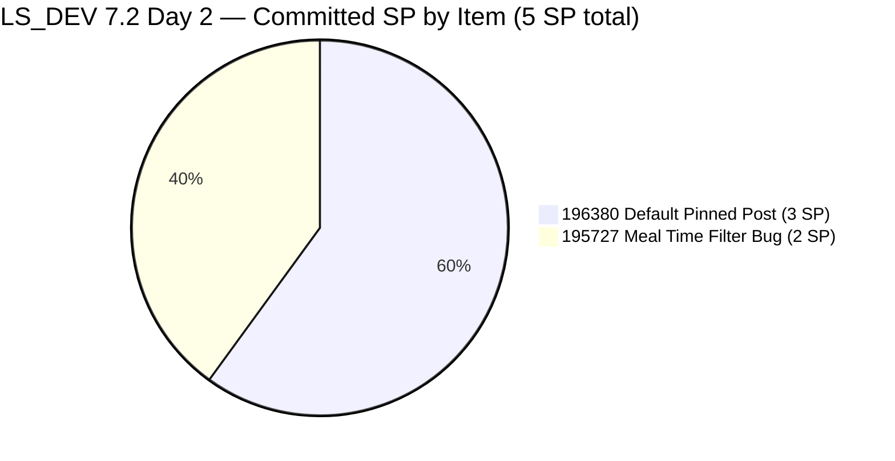
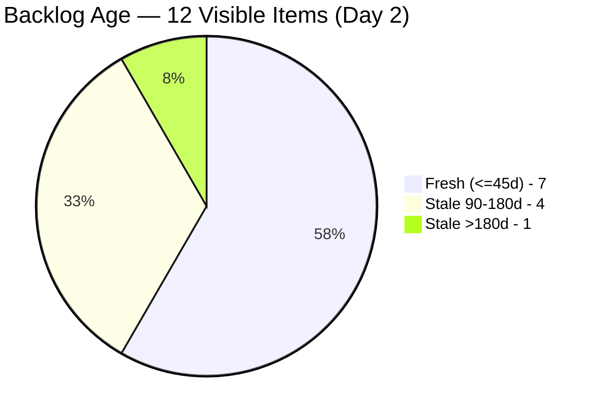
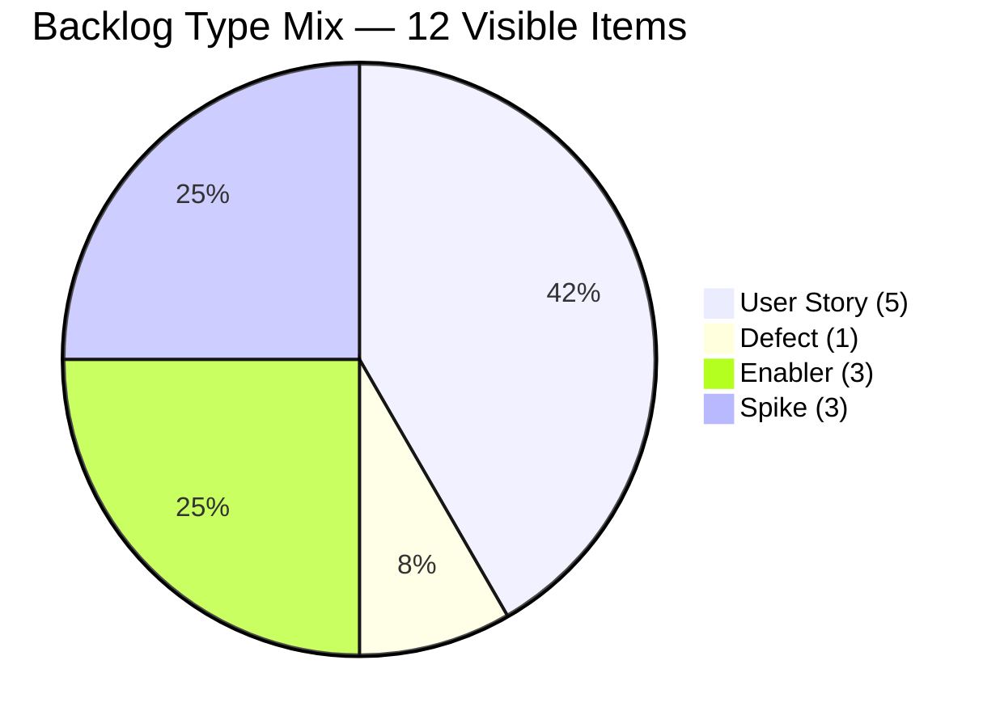
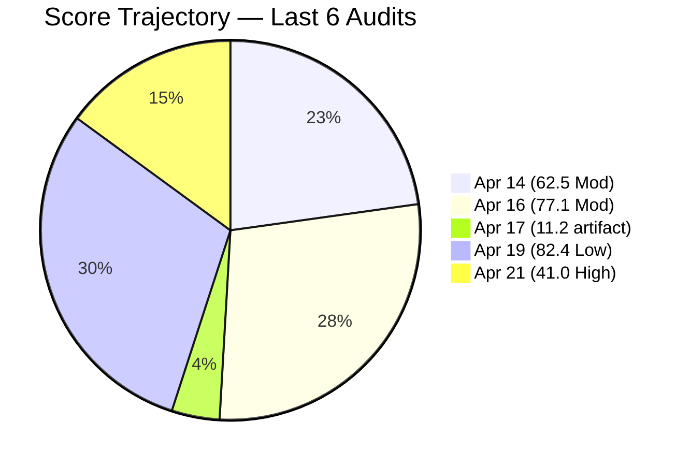
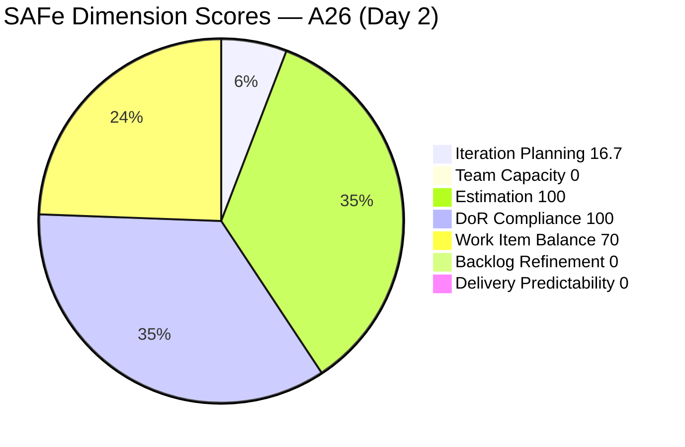

# SAFe Audit Report — Life Style Help App

**Audit A26 | Iteration 7.2 (Apr 20 – May 3, 2026) | Day 2 of 14 (~14% elapsed — early sprint)**

---

## 1. Audit Metadata

| Field | Value |
|---|---|
| **Audit Date** | April 21, 2026, 14:00 PDT |
| **Auditor** | Claude Code (ADO SAFe Audit Agent — Team A / non-critical tier) |
| **Workspace** | `ado_ls_dev` |
| **ADO Project** | Life Style Help App (`0f447778-7156-4451-ab21-27be3c4a5888`) |
| **Team** | Life Style Help App Team (`a2a805bc-0b30-4ef3-9a8a-b7f3081157a6`) |
| **Iteration** | Iteration 7.2 — Apr 20 to May 3, 2026 |
| **Iteration ID** | `71cd2555-1e1c-4767-8a57-393f87aabe1f` |
| **Sprint Day** | Day 2 of 14 (~14% elapsed — early-sprint annotation applies to DP) |
| **Prior Audit** | AUDIT_20260419_1345.md (A25, 7.1 sprint close, Overall 82.4 — Low Risk) |
| **Scoring Model** | ADO SAFe v1 (7-dimension rubric) |
| **Overall Score** | **41.0 / 100** |
| **Risk Band** | **High Risk** (40–59.9) |

---

## 2. Executive Summary

Life Style Help App opens Iteration 7.2 at **41.0 (High Risk)** on Day 2 — a **−41.4 point collapse from the 82.4 (Low Risk) 7.1 sprint close**. This is the lowest score recorded for this workspace in the PI7 series. The decline is driven by four compounding sprint-start problems, each of which is individually material:

1. **No team capacity configured for Iteration 7.2** — the `mcp__azure-devops__work_get_team_capacity` API returns `"No team capacity assigned to the team"` for this iteration. This collapses Team Capacity from 100.0 → **0.0** (−14.3 overall).
2. **Only 2 items committed to 7.2 (5 SP)** — Iteration Planning drops from 58.3 → **16.7** because 2/12 visible items are in-sprint. The sprint is dramatically under-scoped relative to the 12-item visible backlog.
3. **Backlog Refinement collapses from 18.3 → 0.0** — the same stale_90 (−20) and stale_180 (−20) penalties from the 7.1 audit persist **and** a new untouched-current penalty triggers (1/2 = 50% > 30% → −20). The prior audit's A25 P0 recommendations to close #187240 (now 246 days stale) and triage the 4 PI5 stale items were not implemented.
4. **Persistent #187240 Enabler now 246 days stale** — untouched since Aug 18, 2025. This continues to drag Backlog Refinement by −20 in its **10th consecutive audit**.

**Positive:** DoR (100.0), Estimation (100.0), and Work Item Balance (70.0 — structural) remain clean. The two sprint items (#196380 Default Pinned Post, #195727 Meal Time Filter) carry rich Descriptions and well-formed AC.

**This audit confirms the A25 evidence-gap warning:** The rubric rewards descoping at sprint-end (A25 closed 7.1 at 100% DP on a 10 SP commitment after 4 SP was moved to 7.2). The flip side is visible today: the receiving sprint (7.2) opens severely under-planned with only those 2 moved items and nothing net-new. The team has not yet held a 7.2 planning session to commit fresh scope.

---

## 3. Previous Audit Delta

| Dimension | A25 — Day 14 (Apr 19, 7.1 close) | A26 — Day 2 (Apr 21, 7.2 open) | Delta |
|---|---|---|---|
| Iteration Planning | 58.3 | **16.7** | **−41.6** |
| Team Capacity | 100.0 | **0.0** | **−100.0** (no capacity configured for 7.2) |
| Estimation | 100.0 | 100.0 | 0.0 |
| DoR Compliance | 100.0 | 100.0 | 0.0 |
| Work Item Balance | 100.0 | **70.0** | **−30.0** (2 US = 100% dominant type → −30 penalty) |
| Backlog Refinement | 18.3 | **0.0** | **−18.3** (new untouched-current penalty on top of persistent stale penalties) |
| Delivery Predictability | 100.0 | **0.0** | −100.0 (early-sprint) |
| **Overall** | **82.4** | **41.0** | **−41.4** |

### Key changes since A25 (Apr 19)

- **Iteration rolled over Apr 20 00:00 UTC.** Iteration 7.2 is now current (Apr 20 – May 3).
- **Team capacity API returns no data for 7.2.** In A25 (for 7.1) the query returned Samantha 1h Dev, Luzmibel 1h Test, Ike 1h Dev. For 7.2 no capacity records have been created. This is the single largest driver of the score collapse.
- **Sprint scope = 2 items / 5 SP.** Only #196380 (Default Pinned Post, 3 SP) and #195727 (Meal Time Filter, 2 SP), both carried over from A25's planning. No new items committed to 7.2.
- **#196380 was touched Apr 20 at 03:13 UTC** (Samantha, after iteration start) — technically not untouched. **#195727 last touched Apr 17 10:35 UTC** — untouched since sprint start.
- **Backlog hygiene unchanged.** 12 visible items identical to A25. #187240 (246d stale), #194082/#194084/#195229/#194386 (136–160d stale), #195716/#195373/#201334/#202789/#187242 fresh. No triage activity.
- **Work Item Balance dropped from 100.0 to 70.0.** In A25 the sprint had a diverse mix (4 Defects + 2 US + 1 Spike). In A26 the sprint has only 2 items, both User Stories (100% dominant → −30 penalty).

---

## 4. Current Iteration Snapshot

| Metric | Value |
|---|---|
| **Iteration** | 7.2 — Apr 20 to May 3, 2026 |
| **Iteration Day** | Day 2 of 14 (~14% elapsed) |
| **Visible root backlog items** | 12 |
| **Current iteration root items (7.2)** | **2** |
| **Point-eligible items** | 2 |
| **Estimated items (SP > 0)** | 2 |
| **Committed Story Points** | **5 SP** |
| **Closed Story Points** | 0 SP (Day 2) |
| **Delivery Predictability** | 0.0 (early-sprint) |
| **Contributors with current work** | 2 (Samantha Babael, Ike Yana) |
| **Team capacity configured for 7.2** | **NONE** (API returns "No team capacity assigned to the team") |
| **Untouched items since sprint start (Apr 20)** | 1/2 = 50% (#195727) |

### Sprint Item List — Iteration 7.2 (2 items / 5 SP)

| ID | Title | Type | State | SP | DoR | Assignee | Last Changed | Touched since Apr 20? |
|---|---|---|---|---|---|---|---|---|
| **196380** | [Low Priority] Default Pinned Post for New Users | User Story | Ready for Dev | 3 | PASS | Samantha Babael | Apr 20 03:13 | Yes |
| **195727** | [Low priority] The meal time filter don't respond when there is text in the searchbar | User Story | Ready for Dev | 2 | PASS | Ike Yana | **Apr 17 03:35** | **No (untouched)** |

### Board-Visible Backlog (Non-Sprint Items — 10 items)

| ID | Type | State | IterationPath | Changed | Age (days) | Note |
|----|------|-------|---------------|---------|------------|------|
| **#187240** | **Enabler** | **New** | **root** | **Aug 18, 2025** | **246d — stale_180** | **Persistent across 10 audits** |
| #187242 | Enabler | Ready for Dev | root | Apr 13, 2026 | 8d — Fresh | Mobile UX POC |
| #194082 | User Story | Ready for Dev | PI 5 | Dec 4, 2025 | 138d — stale_90 | "Servings" Label |
| #194084 | User Story | Ready for Dev | PI 5 | Dec 4, 2025 | 138d — stale_90 | Schedule Blog Post |
| #194386 | Defect | Ready for UAT | 4.4 | Nov 12, 2025 | 160d — stale_90 | Cancellation process |
| #195229 | User Story | Grooming | PI 5 | Dec 4, 2025 | 138d — stale_90 | Email Notif for Forum |
| #195373 | Enabler | New | 2026-PI6 | Mar 17, 2026 | 35d — Fresh | Perf Optimization |
| #195716 | User Story | Ready for Dev | 6.5 | Mar 18, 2026 | 34d — Fresh | Hide recipe card fields |
| #201334 | Spike | New | 6.5 | Mar 23, 2026 | 29d — Fresh | Collaboration Spike |
| #202789 | Spike | New | 7.6 IP | Apr 16, 2026 | 5d — Fresh | CSAT Survey |

---

## 5. Work Item Analysis

### Sprint Commitment Composition



### Visible Backlog Age Profile



### Visible Backlog by Work Item Type



### Score Delta Across Recent Audits



### Observations

- **Sprint is under-planned.** Only 2 items / 5 SP committed. Compared to 7.1's 10 SP / 7 items delivered, 7.2 opens with ~50% of 7.1's commitment. Samantha and Ike each have one 2-SP-equivalent workload.
- **No capacity configured for 7.2.** This is the most actionable finding. The 7.1 capacity data (Samantha 1h Dev, Luzmibel 1h Test, Ike 1h Dev) did not carry forward — either it was not cloned to 7.2 or it was deliberately reset.
- **#187240 continues its 10th consecutive audit stale.** The Aug 18, 2025 ChangedDate now sits 246 days in the past. This Enabler alone drives the persistent −20 stale_180 penalty.
- **#195727 (Meal Time Filter) untouched since Apr 17.** It was moved from 7.1 → 7.2 on Apr 17 with no subsequent update. As 1 of 2 sprint items, it drives the 50% untouched-current ratio → −20 penalty.
- **Luzmibel's 1h/day Testing capacity remains un-assigned.** She had no 7.1 root assignments (A25 flagged) and continues to have no 7.2 assignments.

---

## 6. SAFe Compliance Scorecard

| Dimension | Score | Evidence | Notes |
|---|---|---|---|
| Iteration Planning | **16.7** | 2 of 12 visible root items on Iter 7.2 | Severe under-scoping |
| Team Capacity | **0.0** | API returns "No team capacity assigned to the team" for Iteration 7.2 | Capacity was not configured for this iteration |
| Estimation | **100.0** | 2/2 point-eligible items with SP > 0 | Both items estimated |
| DoR Compliance | **100.0** | 2/2 items pass Desc ≥30 nws + AC ≥20 nws | Both items have well-formed Description and AC |
| Work Item Balance | **70.0** | 2 User Stories (100%) — dominant_type_share = 100% > 60% → −30; has US (no −40); no Spike (no −20) | Tiny sprint scope amplifies dominance |
| Backlog Refinement | **0.0** | base=7/12=58.3%; stale_90=5/12=41.7% (>25%) → −20; stale_180=1 → −20; untouched_current=1/2=50% (>30%) → −20; 58.3 − 60 = −1.7 → max(0, ...) = 0 | Three penalties fully erase base |
| Delivery Predictability | **0.0** | 0 SP closed / 5 committed — *early-sprint — low delivery expected* (Day 2 of 14) | Rubric early-sprint annotation, no formula adjustment |
| **Overall Score** | **41.0** | (16.7 + 0 + 100 + 100 + 70 + 0 + 0) / 7 = 286.7 / 7 = 40.957 → 41.0 | **High Risk** (40–59.9) |

### Score Computation

```
Iteration Planning      = round(2 / 12 × 100, 1)    = 16.7
Team Capacity           = no capacity configured    = 0.0
                          (contributors_with_capacity = 0,
                           contributors_with_current_work = 2)
Estimation              = round(2 / 2 × 100, 1)     = 100.0
DoR Compliance          = round(2 / 2 × 100, 1)     = 100.0

Work Item Balance:
  has_user_story        = True                      → no −40
  dominant_type_share   = 2/2 = 100% > 60%          → −30
  spike_share           = 0/2 = 0%                  → 0
  total                 = 100 − 30                  = 70.0

Backlog Refinement:
  base                  = round(7/12×100, 1)        = 58.3
  stale_90_share        = 5/12 = 41.7% > 25%        → −20
  stale_180             = 1 ≥ 1                     → −20
  untouched_current     = 1/2 = 50% > 30%           → −20
  total                 = 58.3 − 60 = −1.7 → max(0) = 0.0

Delivery Predictability = round(0 / 5 × 100, 1)     = 0.0
                          [Day 2 of 14 → early-sprint — low delivery expected]

Overall = round((16.7 + 0 + 100 + 100 + 70 + 0 + 0) / 7, 1)
        = round(286.7 / 7, 1)
        = round(40.957, 1)
        = 41.0  → High Risk
```



---

## 7. Dimension Findings

### 7.1 Iteration Planning — 16.7 (Critical — under-scoped)

Only 2 of 12 visible root items are in Iteration 7.2. This is the inverse pattern of a well-scoped sprint: instead of the sprint representing 40–70% of actively-curated backlog, it represents 17%. Recovery path:

- **Commit additional items.** #195716 (Hide recipe card fields, 2 SP, Ready for Dev) is the lowest-friction add — already Ready, already estimated, owner Samantha. Committing #195716 would lift IP from 16.7 to 3/12 = 25.0.
- **Close or archive the 5 stale items** (#187240, #194082, #194084, #195229, #194386). If all 5 are archived, the visible backlog drops to 7 and IP = 2/7 = 28.6. If 3 stale items close and 1 new item is added, IP = 3/9 = 33.3.

### 7.2 Team Capacity — 0.0 (Critical — capacity not configured)

The `work_get_team_capacity` API returns `"No team capacity assigned to the team"` for Iteration 7.2. Two contributors have sprint-assigned work (Samantha #196380, Ike #195727) but neither has capacity records for 7.2.

**Per rubric definition:** `contributors_with_capacity` = contributors with "positive capacity or at least one configured activity in the active iteration". With no iteration capacity data, this count is 0. Formula: 0/2 = 0.0.

**Recovery path:** Re-run the capacity configuration workflow. A25 showed that 7.1 had Samantha 1h Dev + Luzmibel 1h Test + Ike 1h Dev. Cloning that configuration to 7.2 would restore Team Capacity to 100.0 (+14.3 Overall).

### 7.3 Estimation — 100.0 (Low Risk)

Both sprint items have SP estimated: #196380 at 3 SP, #195727 at 2 SP. Total 5 SP.

### 7.4 DoR Compliance — 100.0 (Low Risk)

Both items pass DoR:
- **#196380 Default Pinned Post** — rich Description with As/I-want/So-that pattern, 6-condition AC checklist covering admin config, auto-pin behavior, visibility, unpin, updates, and legacy user handling.
- **#195727 Meal Time Filter Bug** — reproduction steps, actual-vs-expected format, recording link, clean AC.

### 7.5 Work Item Balance — 70.0 (Moderate — tiny-sprint amplification)

2 User Stories / 0 Defects / 0 Spikes / 0 Enablers. Penalty breakdown:
- Has User Story → no −40
- Dominant type share: 2/2 = 100% > 60% → **−30**
- Spike share: 0% → no −20

**Caveat:** At 2 items the dominance metric is amplified. One additional non-US item would shift it. Committing #201334 (Spike, Luzmibel, 6.5) or #202789 (Spike, Carol, 7.6 IP) to 7.2 would drop dominant share to 2/3 = 66.7% (still > 60%, no penalty removal) but would add a Spike. The only way to remove the −30 is either to keep US share ≤ 60% (e.g., 3 US + 2 non-US in a 5-item sprint) or to accept it as structural for a small-sprint team.

### 7.6 Backlog Refinement — 0.0 (Critical)

All three penalty categories trigger:
- **base (fresh_visible / visible):** 7/12 = 58.3 → base 58.3
- **stale_90 share (5/12 = 41.7%) > 25%** → **−20**
- **stale_180 = 1 (#187240 at 246 days)** → **−20**
- **untouched_current (1/2 = 50%) > 30%** → **−20** (NEW penalty vs A25)

58.3 − 60 = −1.7 → max(0, −1.7) = **0.0**

This is the worst Backlog Refinement score in the PI7 series for this workspace. Recovery requires:

| Action | Dimension Delta | Overall Delta |
|---|---|---|
| Status-comment #195727 (removes untouched penalty) | +20 | +2.9 |
| Close/archive #187240 (removes stale_180 penalty) | +20 | +2.9 |
| Close 3 of 4 PI5 stale items (drops stale_90 share below 25%) | +20 | +2.9 |
| **All three together** | **+60 → base 58.3 recovered** | **+8.3 → Overall ≈ 49.3** |

Even with all three recoveries, the team still needs Team Capacity restoration and additional sprint commitments to return to Low Risk territory.

### 7.7 Delivery Predictability — 0.0 (early-sprint — low delivery expected)

0 SP closed / 5 SP committed = 0.0. Day 2 of 14 → rubric early-sprint annotation. No formula adjustment.

**Scope-vs-velocity:** 5 SP commitment vs 7.1's 10 SP delivery. The sprint is under-committed by 50% — unusual in a High-Risk trajectory. Either (a) the team is deliberately conservative, (b) 7.2 planning has not yet occurred and more items will be added, or (c) there is a capacity constraint (vacations, context shift to other projects) that isn't visible in ADO.

---

## 8. Risks and Bottlenecks

| # | Risk | Severity | Owner |
|---|------|----------|-------|
| R1 | **No team capacity configured for Iteration 7.2** — drives Team Capacity 0.0 (−14.3 Overall). Single-click recovery by cloning 7.1 capacity settings. | **CRITICAL** | Ramon / Team Lead |
| R2 | **#187240 "Evaluate Deployment Options" Enabler — 246 days stale** — 10th consecutive audit unchanged. Single most-persistent issue in this workspace. | **HIGH** | Ike Yana |
| R3 | **Sprint under-scoped at 2 items / 5 SP** — Iteration Planning 16.7; no new items committed since A25. | HIGH | Team Lead |
| R4 | **#195727 untouched since Apr 17** — drives untouched_current penalty (−20 Backlog Refinement). Simple status update recovers. | MODERATE | Ike Yana |
| R5 | **4 PI5/Nov–Dec 2025 items remain stale >90d** (#194082, #194084, #195229, #194386) — no triage in 10 audits. | MODERATE | Team Lead / PO |
| R6 | **No 7.2 planning ceremony visible** — ADO shows no new items assigned to 7.2, capacity not set, no sprint goal. Suggests 7.2 planning has been deferred or skipped. | HIGH | Ramon / Team Lead |
| R7 | **Luzmibel Paculanang has 1h/day QA capacity but no 7.2 assignments** — repeat of 7.1 under-utilization (flagged in A25). | LOW | Samantha / Ike |
| R8 | **#201334 (Luzmibel Collaboration Spike)** — still New, never committed to a sprint. Description is placeholder; no AC. | LOW | Luzmibel |
| R9 | **Work Item Balance −30** — structural for 2-item User-Story sprints | LOW | Ramon / Team |

---

## 9. Prioritized Recommendations

1. **[P0 — Today / Apr 21–22] Configure team capacity for Iteration 7.2.** Clone 7.1 capacity settings: Samantha 1h/day Dev, Ike 1h/day Dev, Luzmibel 1h/day Testing. This single action restores Team Capacity from 0.0 → 100.0, lifting Overall from 41.0 to **55.3 (still High Risk, but boundary of Moderate)**.

2. **[P0 — Today / Apr 21–22] Hold 7.2 sprint planning ceremony.** Commit 2–4 additional items to reach a 7–10 SP commitment matching 7.1's empirical delivery. Candidates: #195716 (Hide recipe card fields, 2 SP, Ready), #201334 (Collaboration Spike, reclassify), #202789 (CSAT Survey Spike). Define a sprint goal.

3. **[P0 — Apr 22] Status-comment #195727 today.** Drops untouched_current from 50% → 0%, removes the −20 Backlog Refinement penalty. Simple status update. +2.9 Overall.

4. **[P0 — Apr 22–23] Resolve #187240 (246 days stale).** Options: (a) Ike performs the ~2 hour deployment wrapper comparison and closes with findings, (b) archive as "Won't Fix" with rationale noting the deployment direction has changed, (c) re-path to a specific PI with a target iteration. Any disposition removes the −20 stale_180 penalty. +2.9 Overall.

5. **[P1 — This week] Triage 4 PI5 stale User Stories.** #194082 (Servings Label), #194084 (Schedule Blog Post), #195229 (Forum Email Notif), #194386 (Cancellation defect). Each needs disposition: commit, re-scope, or close. Target: close or re-path ≥ 3 of 4 to drop stale_90 share below 25%. +2.9 Overall if triage removes −20.

6. **[P1 — This week] Assign #202789 CSAT Survey Spike to Luzmibel or commit to 7.2.** Uses her 1h/day capacity and adds a non-User-Story item to sprint composition (helps Work Item Balance in a future audit when sprint grows).

7. **[P2 — This week] Re-balance ownership.** If #195716 is added to 7.2, Samantha would have 2 items (6380 + 5716 = 5 SP) and Ike 1 item (#195727, 2 SP). Consider re-assigning #195716 to Ike for balance, or have Luzmibel own the QA tasks under both sprint items.

8. **[P3 — This iteration] Retrospective acknowledgment.** Document the 41.0 High Risk sprint-open snapshot and the recovery plan. Compare to A25's 82.4 sprint close: the 41.4-point drop is mechanical (capacity not configured + sprint under-planned) and recoverable within the first week of 7.2.

---

## 10. Evidence Gaps and Limitations

| Gap | Impact |
|---|---|
| **Team capacity API returns "No team capacity assigned to the team"** | Forces Team Capacity = 0.0 per rubric. The absence of capacity data is itself a finding: 7.1 had capacity configured; 7.2 does not. This is a configuration gap, not a query failure. |
| **No 7.2 planning artifacts visible** | Only 2 items scoped to 7.2 and no iteration goal. Cannot distinguish "planning deferred" from "deliberate small commitment" from ADO fields. |
| **#187240 (246d stale) never reviewed** | Enabler persists at root path, New state, untouched since August 2025. No comment or audit trail visible in backlog API. Requires manual review by Ike. |
| **#195727 move rationale** | Item was in 7.1 before being re-pathed to 7.2 on Apr 17 during the 7.1 sprint-close de-scoping. No "moved due to X" comment visible; unclear whether it was defer-by-blocker or defer-by-priority. |
| **Luzmibel role (recurring A25 gap)** | Luzmibel continues to have configured-but-unused capacity in the team roster. Cannot determine from ADO whether she is working on other teams' tasks, on child tasks below root visibility, or genuinely under-utilized. |
| **Delivery Predictability formula rewards descoping** (carried from A25) | 7.1 closed at 100% DP after 4 SP was moved to 7.2 on Apr 17. 7.2 now opens severely under-planned. Across-sprint commitment integrity would be a more useful metric. |

---

## 11. Score Trend — PI7 Life Style Help App

| Audit | Date | Day | Sprint | Overall | Band |
|---|---|---|---|---|---|
| A19 | Apr 6 | 1 | 7.1 | ~70 | Moderate |
| A22 | Apr 12 | 7 | 7.1 | 62.5 | Moderate |
| A23 | Apr 13 | 8 | 7.1 | 77.1 | Moderate |
| A24 | Apr 17 | 12 | 7.1 | 11.2 | Critical *(formula artifact)* |
| A25 | Apr 19 | 14 | 7.1 close | **82.4** | **Low Risk** |
| **A26** | **Apr 21** | **2** | **7.2 open** | **41.0** | **High Risk** |

---

*Report generated: 2026-04-21 14:00 PDT | Audit A26 | ado_ls_dev*
*Day 2 of 14 — Iter 7.2 — Overall: 41.0 / 100 — High Risk (sprint planning gap + persistent backlog debt)*
