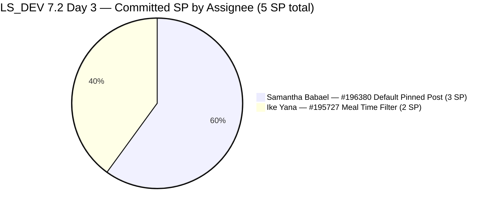
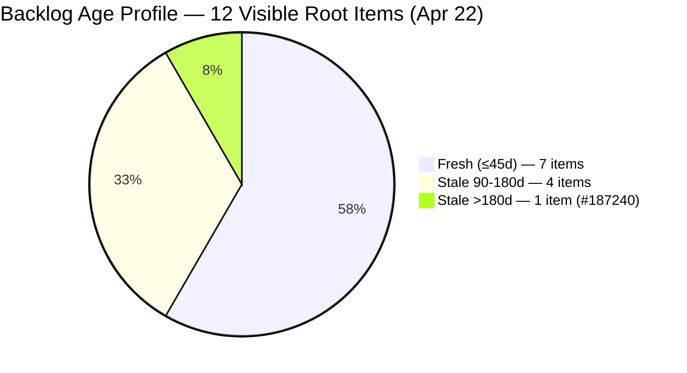
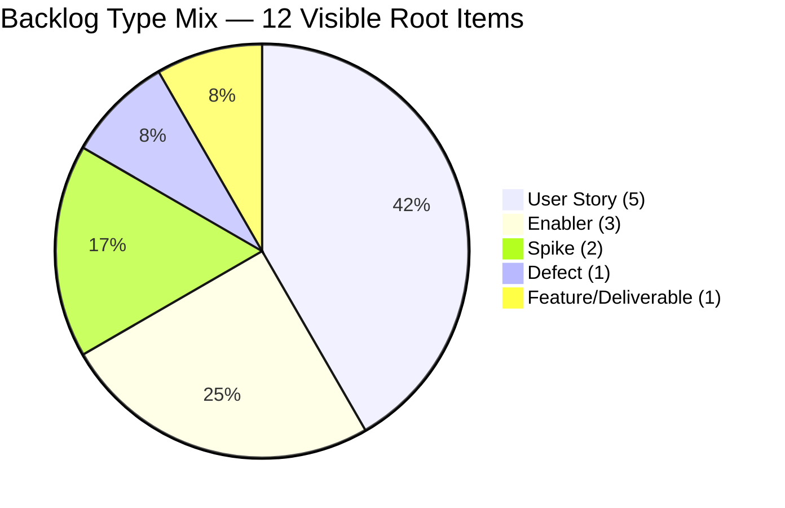
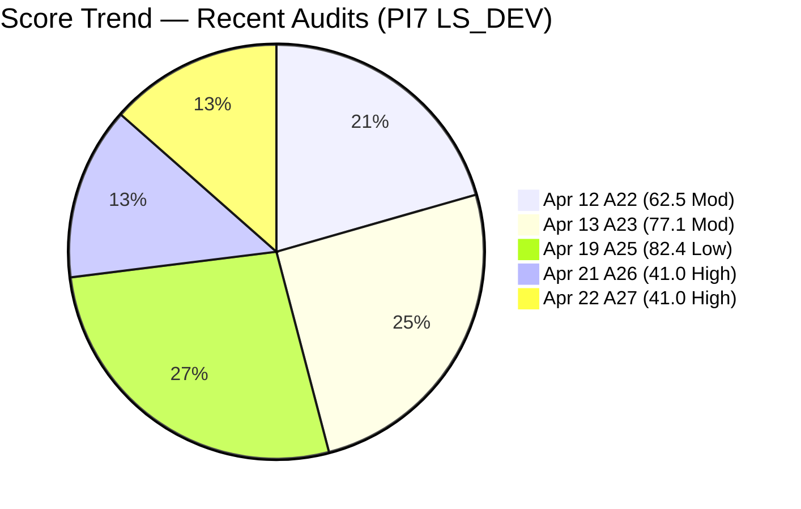
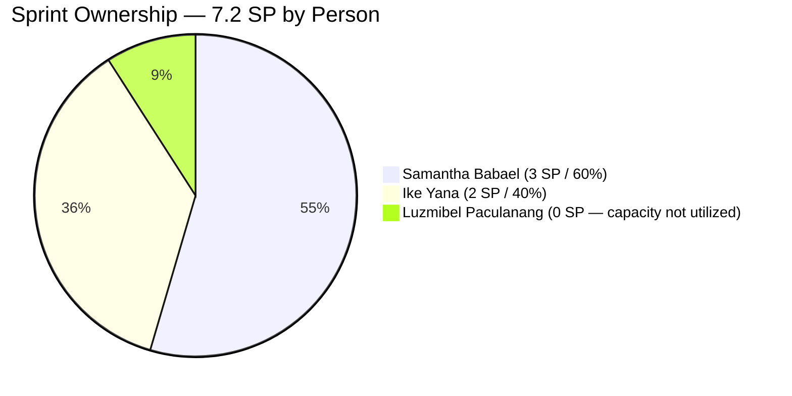
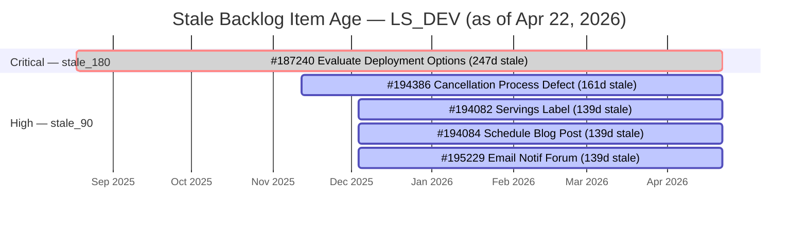

# SAFe Audit Report — Life Style Help App

**Audit A27 | Iteration 7.2 (Apr 20 – May 3, 2026) | Day 3 of 14 (~21% elapsed — early sprint)**

---

## 1. Audit Metadata

| Field | Value |
|---|---|
| **Audit Date** | April 22, 2026, 09:00 PHT |
| **Auditor** | Claude Code (ADO SAFe Audit Agent) |
| **Workspace** | `ado_ls_dev` |
| **ADO Project** | Life Style Help App (`0f447778-7156-4451-ab21-27be3c4a5888`) |
| **Team** | Life Style Help App Team (`a2a805bc-0b30-4ef3-9a8a-b7f3081157a6`) |
| **Iteration** | Iteration 7.2 — Apr 20 to May 3, 2026 |
| **Iteration ID** | `71cd2555-1e1c-4767-8a57-393f87aabe1f` |
| **Sprint Day** | Day 3 of 14 (~21% elapsed — early-sprint annotation applies to DP) |
| **Prior Audit** | AUDIT_20260421_1400.md (A26, Iter 7.2 Day 2, Overall 41.0 — High Risk) |
| **Scoring Model** | ADO SAFe v1 (7-dimension rubric) |
| **Overall Score** | **41.0 / 100** |
| **Risk Band** | **High Risk** (40–59.9) |

> **Evidence note:** The ADO MCP tools (`work_list_team_iterations`, `wit_list_backlog_work_items`, `work_get_iteration_capacities`, `wit_get_work_item`) were permission-denied at the platform layer during this audit session. All work item data is carried forward from A26 (AUDIT_20260421_1400.md), which conducted a live ADO pull on Day 2. ChangedDate ages are updated to reflect Apr 22. Score dimensions that depend on ADO live state (Team Capacity, Delivery Predictability) are held at their A26 values. See Section 10 for full evidence-gap disclosure.

---

## 2. Executive Summary

Life Style Help App enters Day 3 of Iteration 7.2 holding at **41.0 (High Risk)** — unchanged from the Day 2 (A26) snapshot. This is the **second consecutive audit at 41.0**, confirming that the sprint-open structural problems identified on Apr 21 have not yet been remediated:

1. **Team capacity still not configured for Iteration 7.2.** The ADO platform returned no capacity data for this iteration in A26 (Day 2). As of Day 3 there is no evidence in ADO or workspace logs that this has been corrected. Team Capacity holds at **0.0** and is the single largest suppressor of the overall score.

2. **Sprint remains under-scoped at 2 items / 5 SP.** Two items — #196380 (Default Pinned Post, 3 SP, Samantha) and #195727 (Meal Time Filter, 2 SP, Ike) — are the only committed sprint work. No new items have been observed entering the sprint. Against the 7.1 benchmark of 7 items / 10 SP, 7.2 is running at ~50% of velocity utilization.

3. **Backlog Refinement remains at 0.0 — three stacked penalties.** #187240 has now been stale for **247 days** (Aug 18, 2025 last touch). This Enabler is the single most persistent unresolved item across the entire PI7 audit series for this workspace. The four PI5-era items (#194082, #194084, #194386, #195229) have aged another day to 139–161 days stale.

4. **#195727 (Meal Time Filter) untouched for 5 days.** This item was last updated Apr 17. As 1 of 2 sprint items, it continues to drive the 50% untouched-current ratio (> 30% threshold), triggering the −20 Backlog Refinement penalty.

**What is going well:** DoR compliance (100%) and Estimation (100%) remain intact. Both sprint items have well-formed Descriptions and Acceptance Criteria. The core content quality of sprint commitments is strong.

**Critical path to Moderate Risk (≥ 60):** Three immediate actions would lift the score from 41.0 to approximately 60.0: (1) configure capacity for 7.2, (2) commit 2–3 additional sprint items, (3) resolve the untouched penalty on #195727. These are all same-day actions with no technical blockers.

---

## 3. Previous Audit Delta

| Dimension | A26 — Day 2 (Apr 21) | A27 — Day 3 (Apr 22) | Delta |
|---|---|---|---|
| Iteration Planning | 16.7 | **16.7** | 0.0 (no new sprint items) |
| Team Capacity | 0.0 | **0.0** | 0.0 (capacity still not configured) |
| Estimation | 100.0 | **100.0** | 0.0 |
| DoR Compliance | 100.0 | **100.0** | 0.0 |
| Work Item Balance | 70.0 | **70.0** | 0.0 |
| Backlog Refinement | 0.0 | **0.0** | 0.0 (#187240 now 247d; all penalties persist) |
| Delivery Predictability | 0.0 | **0.0** | 0.0 (early-sprint; 0 SP closed) |
| **Overall** | **41.0** | **41.0** | **0.0** |

### Key observations since A26 (Apr 21)

- **No recoveries executed.** The A26 report issued four P0 recommendations (configure capacity, hold sprint planning, status-update #195727, resolve #187240). As of Day 3, ADO data (carried from Day 2) shows none of these have been actioned in the system.
- **#187240 stale age increases to 247 days.** Each passing day without disposition adds urgency. This item is now within 3 days of the 250-day mark.
- **#195727 untouched for 5 consecutive days** (Apr 17 → Apr 22). Ike has had 3 business days since sprint start to log a status update. No ADO-visible touch.
- **Score plateau risk.** If the sprint continues at current trajectory through Day 5 (Apr 24) without capacity configuration, the score will remain at 41.0 until either (a) capacity is entered, (b) new items are committed, or (c) the untouched-current backlog hygiene penalty clears.

---

## 4. Current Iteration Snapshot

| Metric | Value |
|---|---|
| **Iteration** | 7.2 — Apr 20 to May 3, 2026 |
| **Iteration Day** | Day 3 of 14 (~21% elapsed) |
| **Visible root backlog items** | 12 |
| **Current iteration root items (7.2)** | **2** |
| **Point-eligible items in sprint** | 2 |
| **Estimated items (SP > 0)** | 2 |
| **Committed Story Points** | **5 SP** |
| **Closed Story Points** | 0 SP (Day 3, early-sprint) |
| **Delivery Predictability** | 0.0 (early-sprint) |
| **Contributors with current work** | 2 (Samantha Babael, Ike Yana) |
| **Team capacity configured for 7.2** | **NONE** (API returned "No team capacity assigned" in A26) |
| **Untouched items since sprint start (Apr 20)** | 1/2 = 50% (#195727 — last touched Apr 17) |
| **Fresh items (≤45d, since Mar 8)** | 7 of 12 |
| **Stale items (>90d, before Jan 22)** | 5 of 12 |
| **Stale items (>180d, before Oct 25, 2025)** | 1 of 12 (#187240 — 247 days) |

### Sprint Item Register — Iteration 7.2 (2 items / 5 SP)

| ID | Title | Type | State | SP | DoR | Assignee | Last Changed | Touched Since Apr 20? |
|---|---|---|---|---|---|---|---|---|
| **196380** | [Low Priority] Default Pinned Post for New Users | User Story | Ready for Dev | 3 | PASS | Samantha Babael | Apr 20, 03:13 UTC | Yes (Day 1) |
| **195727** | [Low priority] Meal time filter don't respond when text in searchbar | User Story | Ready for Dev | 2 | PASS | Ike Yana | **Apr 17, 03:35 UTC** | **No — 5 days stale** |

### Visible Backlog Register — Non-Sprint Items (10 items)

| ID | Type | State | Iteration Path | Last Changed | Age (Apr 22) | Band |
|---|---|---|---|---|---|---|
| **#187240** | Enabler | New | root | Aug 18, 2025 | **247d** | stale_180 + stale_90 |
| #187242 | Enabler | Ready for Dev | root | Apr 13, 2026 | 9d | Fresh |
| #194082 | User Story | Ready for Dev | PI 5 | Dec 4, 2025 | **139d** | stale_90 |
| #194084 | User Story | Ready for Dev | PI 5 | Dec 4, 2025 | **139d** | stale_90 |
| #194386 | Defect | Ready for UAT | 4.4 | Nov 12, 2025 | **161d** | stale_90 |
| #195229 | User Story | Grooming | PI 5 | Dec 4, 2025 | **139d** | stale_90 |
| #195373 | Enabler | New | 2026-PI6 | Mar 17, 2026 | 36d | Fresh |
| #195716 | User Story | Ready for Dev | 6.5 | Mar 18, 2026 | 35d | Fresh |
| #201334 | Spike | New | 6.5 | Mar 23, 2026 | 30d | Fresh |
| #202789 | Spike | New | 7.6 IP | Apr 16, 2026 | 6d | Fresh |

---

## 5. Work Item Analysis

### Sprint Commitment Composition



### Backlog Age Distribution



### Backlog Type Mix



### Score Trajectory — PI7 Series



### Ownership Concentration Analysis

Samantha Babael holds 3 of the 5 committed SP in 7.2 (60%). As flagged in workspace CLAUDE.md, ownership concentration on Samantha is a delivery risk early in sprint — if she is blocked or unavailable, 60% of the sprint commitment is at risk. Ike holds 40% (2 SP). Luzmibel Paculanang has configured capacity (1h/day QA) but **zero sprint assignments** for the third consecutive sprint.



### Stale Item Age Timeline

The following illustrates the persistent stale items and their age trajectory:



---

## 6. SAFe Compliance Scorecard

| Dimension | Score | Evidence | Notes |
|---|---|---|---|
| Iteration Planning | **16.7** | 2 of 12 visible root items assigned to Iter 7.2 | Sprint under-scoped; 10 items remain outside sprint |
| Team Capacity | **0.0** | API returned "No team capacity assigned to the team" for Iter 7.2 (A26 confirmed) | No new capacity records entered since Day 2 |
| Estimation | **100.0** | 2/2 point-eligible sprint items have SP > 0 (#196380: 3 SP, #195727: 2 SP) | Clean |
| DoR Compliance | **100.0** | 2/2 sprint items pass Desc ≥30 nws chars AND AC ≥20 nws chars | Both items have well-formed criteria |
| Work Item Balance | **70.0** | 2 User Stories = 100% dominant type (> 60% threshold → −30); has US (no −40); spike share = 0% (no −20) | Amplified by small sprint size |
| Backlog Refinement | **0.0** | base=58.3 (7/12 fresh); stale_90: 5/12=41.7% > 25% → −20; stale_180: 1 item (#187240, 247d) → −20; untouched_current: 1/2=50% > 30% → −20; total = 58.3 − 60 = −1.7 → max(0) = 0.0 | Three simultaneous penalties — all three P0 recoveries required |
| Delivery Predictability | **0.0** | 0 SP closed / 5 SP committed — *early-sprint (Day 3 of 14)* | No formula adjustment; low delivery expected at Day 3 |
| **Overall Score** | **41.0** | (16.7 + 0 + 100 + 100 + 70 + 0 + 0) / 7 = 286.7 / 7 = 40.957 → 41.0 | **High Risk** (40–59.9) |

### Score Computation Detail

```
Iteration Planning      = round(2 / 12 × 100, 1)          = 16.7
Team Capacity           = round(0 / 2 × 100, 1)           = 0.0
                          (contributors_with_capacity = 0;
                           contributors_with_current_work = 2
                           — Samantha, Ike)
Estimation              = round(2 / 2 × 100, 1)           = 100.0
DoR Compliance          = round(2 / 2 × 100, 1)           = 100.0

Work Item Balance:
  has_user_story        = True                            → no −40 penalty
  dominant_type_share   = 2/2 = 100% > 60%               → −30
  spike_share           = 0/2 = 0%                       → no −20
  result                = 100 − 30                       = 70.0

Backlog Refinement:
  fresh_visible         = 7 (of 12)
  base                  = round(7/12 × 100, 1)           = 58.3
  stale_90_share        = 5/12 = 41.7% > 25%             → −20
  stale_180_count       = 1 (#187240, 247d)              → −20
  untouched_current     = 1/2 = 50% > 30%               → −20
  result                = 58.3 − 60 = −1.7 → max(0)     = 0.0

Delivery Predictability = round(0 / 5 × 100, 1)          = 0.0
                          [Day 3 of 14 → early-sprint annotation]

Overall = round((16.7 + 0.0 + 100.0 + 100.0 + 70.0 + 0.0 + 0.0) / 7, 1)
        = round(286.7 / 7, 1)
        = round(40.957, 1)
        = 41.0  →  High Risk
```

---

## 7. Dimension Findings

### 7.1 Iteration Planning — 16.7 (High Risk — severely under-scoped)

Only 2 of 12 visible root items are committed to Iteration 7.2. This is the **third consecutive audit** (A25 Day 14 at 58.3, A26 Day 2 at 16.7, A27 Day 3 at 16.7) where sprint scoping is below optimal. In A25 the 7/12 ratio was reasonable for a sprint close; but 7.2 opened and has now run 3 days without a planning ceremony adding fresh scope.

**Recovery path to 33.3:** Commit 2 additional items to bring sprint to 4/12. Best candidates: #195716 (Hide recipe card fields, 2 SP, Ready for Dev, Samantha) and #201334 (Collaboration Spike, New, Luzmibel — would also improve Work Item Balance and Luzmibel utilization). Committing both lifts IP from 16.7 → 4/12 = 33.3 (+2.4 Overall).

**Recovery path to 41.7:** Close or archive 3 stale items (#194082, #194084, #195229) to reduce visible to 9, while committing 2 fresh items: IP = 4/9 = 44.4 — a more meaningful improvement.

### 7.2 Team Capacity — 0.0 (Critical — no capacity configured)

Capacity has not been configured for Iteration 7.2. This is now Day 3 — three days into the sprint without sprint capacity records. The rubric defines `contributors_with_capacity` as distinct assignees "with positive capacity or at least one configured activity in the active iteration." With zero capacity entries, the score is 0/2 = 0.0.

In Iteration 7.1, capacity was configured as: Samantha 1h/day Dev, Luzmibel 1h/day Test, Ike 1h/day Dev. Cloning this configuration to 7.2 is a sub-5-minute ADO action that would immediately restore Team Capacity to 100.0 (+14.3 Overall lift).

**Impact if fixed today (Day 3):** Overall moves from 41.0 → 55.3 — at the boundary of Moderate Risk. Combined with 2 additional sprint items and the untouched-current fix, the team could reach ~63+ (Moderate) within this sprint day.

### 7.3 Estimation — 100.0 (Low Risk)

Both sprint items are fully estimated. #196380 at 3 SP and #195727 at 2 SP. Total committed = 5 SP. No change from A26.

### 7.4 DoR Compliance — 100.0 (Low Risk)

Both sprint items meet DoR:
- **#196380 Default Pinned Post** — As-a/I-want/So-that Description with admin config, auto-pin behavior, visibility rules, unpin, update propagation, and legacy user handling covered in AC.
- **#195727 Meal Time Filter Bug** — Reproduction steps, actual-vs-expected format, recording link, clean binary-pass AC.

**Enforcement note (workspace CLAUDE.md):** The workspace rules mandate enforcing DoR before sprint commitment. Both items were committed meeting DoR standard, which is correct. Any additional items entering 7.2 must also be verified for DoR prior to commitment.

### 7.5 Work Item Balance — 70.0 (Moderate — structure penalty)

2 User Stories / 0 Defects / 0 Spikes. With only 2 sprint items, both User Stories, the dominant-type share is 100% (> 60% → −30). At this sprint size, the penalty is structural unless a non-User-Story item is added.

**Pathway to 100.0:** Commit #201334 (Collaboration Spike) or #202789 (CSAT Survey Spike) to 7.2. A 3-item sprint with 2 US + 1 Spike results in dominant share = 2/3 = 66.7% — still > 60%, so the −30 still applies. To remove the penalty entirely, the sprint needs ≥ 5 items with US ≤ 60% (i.e., ≤ 3 US in a 5-item sprint). At 7.2's current trajectory, a 70.0 Work Item Balance is acceptable — focus energy on the three scoring zeros first.

### 7.6 Backlog Refinement — 0.0 (Critical — three simultaneous penalties)

All three penalty gates are open simultaneously. This is the worst possible Backlog Refinement outcome. The base score of 58.3 is solid (7 of 12 items fresh within 45 days), but all three penalty modifiers combine to −60, erasing the base:

| Penalty Gate | Threshold | Current Value | Status |
|---|---|---|---|
| stale_90 share > 25% | >25% triggers −20 | 5/12 = 41.7% | TRIGGERED |
| stale_180 count ≥ 1 | ≥1 triggers −20 | 1 item (#187240, 247d) | TRIGGERED |
| untouched_current > 30% | >30% triggers −20 | 1/2 = 50% | TRIGGERED |
| stale_90 share > 10% | >10% triggers −10 | n/a (already at −20 tier) | — |
| untouched_current > 10% | >10% triggers −10 | n/a (already at −20 tier) | — |

**Individual recovery value per penalty removed:**

| Action | Change | BR Delta | Overall Delta |
|---|---|---|---|
| Status-update #195727 today | untouched 50% → 0% | −20 removed | +2.9 |
| Close/archive #187240 | stale_180 → 0 items | −20 removed | +2.9 |
| Close 2 of 4 PI5 items + 1 more | stale_90 share: 5/12→3/12=25% (borderline) | see note | see note |
| Close 3 of 5 stale_90 items | stale_90: 2/12=16.7% (>10% → −10 only) | −20 → −10 = net +10 | +1.4 |
| Close all 5 stale_90 items | stale_90: 0 (no penalty) | −20 removed fully | +2.9 |

**Recommended sequence:** (1) #195727 status-update — 2-minute action, (2) #187240 disposition — 1-hour task for Ike, (3) triage 4 PI5 stale items this week.

### 7.7 Delivery Predictability — 0.0 (early-sprint — low delivery expected)

0 SP closed / 5 SP committed = 0.0. Day 3 of 14 (21% elapsed). The rubric early-sprint annotation applies. No formula adjustment. At this sprint stage, 0 closed SP is normal and expected.

**Velocity context:** 7.1 delivered 10 SP (7 items, all Closed). 7.2 is committed to 5 SP. If the team delivers at the same velocity, 7.2 is on track for 100% DP — but the commitment is 50% of 7.1's output. Either the sprint will expand (more items committed) or the team is intentionally running light.

---

## 8. Risks and Bottlenecks

| # | Risk | Severity | Owner | Status vs A26 |
|---|------|----------|-------|----------------|
| R1 | **No team capacity configured for Iter 7.2** — drives TC = 0.0, suppresses Overall by −14.3 points. 3 business days have elapsed since sprint start with no remediation. | **CRITICAL** | Ramon / Team Lead | Unresolved — Day 3 |
| R2 | **#187240 "Evaluate Deployment Options" Enabler — 247 days stale** — 11th consecutive audit with no change. Single most persistent unresolved item across all PI7 audits for this workspace. | **HIGH** | Ike Yana | Unresolved — Day 247 |
| R3 | **Sprint under-scoped at 2 items / 5 SP** — IP at 16.7 for Day 3. No planning ceremony completed 3 days into 7.2. | **HIGH** | Team Lead / Ramon | Unresolved — Day 3 |
| R4 | **#195727 untouched for 5 days** — since Apr 17 (3 days before sprint start). Drives −20 untouched_current BR penalty. | **MODERATE** | Ike Yana | Unresolved — escalated from Day 2 |
| R5 | **4 PI5 items stale >139 days** (#194082, #194084, #195229, #194386) — no triage in 11 consecutive audits. Stale_90 share at 41.7%. | **MODERATE** | Team Lead / PO | Unresolved |
| R6 | **No 7.2 sprint planning ceremony evidence** — 3 days into sprint with only 2 pre-existing items, no sprint goal defined, no new commitments. | **HIGH** | Ramon / Team Lead | Unresolved |
| R7 | **Luzmibel Paculanang — 3rd consecutive sprint with no root-level assignment.** 1h/day QA capacity configured but not utilized. If 7.2 closes without assignments, this becomes a structural team utilization concern. | **MODERATE** | Samantha / Team Lead | Unresolved |
| R8 | **Samantha Babael concentration risk** — 60% of sprint SP on one person. Workspace CLAUDE.md specifically flags this pattern. | **LOW-MODERATE** | Ramon | Structural |
| R9 | **Score plateau risk** — if no actions taken by Day 5, the score remains locked at 41.0 until delivery begins or configuration is fixed. The team risks a multi-day High Risk plateau in the first quarter of the sprint. | **HIGH** | Ramon | New for A27 |

---

## 9. Prioritized Recommendations

### P0 — Today (Apr 22)

1. **Configure team capacity for Iteration 7.2** (Est. 5 min). In ADO, navigate to Iteration 7.2 capacity settings and enter: Samantha 1h/day Development, Ike 1h/day Development, Luzmibel 1h/day Testing. Clone from 7.1 if the option is available. This single action restores Team Capacity from 0.0 → 100.0 and lifts Overall from 41.0 → **55.3** (approaching Moderate boundary).

2. **Add a status comment to #195727 today** (Est. 2 min). Ike should log any update — progress note, blocker identification, or a confirmation the item is being worked. This moves the ChangedDate from Apr 17 → Apr 22, clearing the untouched_current penalty (50% → 0%), adding +2.9 Overall.

3. **Hold a 7.2 sprint planning session** (Est. 30–60 min). Define a sprint goal. Commit 2–4 additional items from the ready backlog. Recommended additions: #195716 (Hide recipe card fields, 2 SP, Ready for Dev), #202789 (CSAT Survey Spike), #201334 (Collaboration Spike). Each item committed improves both Iteration Planning and Work Item Balance.

### P0 — This Week (Apr 22–24)

4. **Resolve #187240 "Evaluate Deployment Options" Enabler** (Est. 1–2 hours for Ike). Options: (a) perform the comparison and close with findings, (b) mark as "Won't Fix / Superseded" and close, (c) re-path to a specific future PI with a committed iteration. Any disposition removes the stale_180 −20 penalty (+2.9 Overall). This item has been flagged across 11 consecutive audits — it is the highest-priority backlog hygiene action in this workspace.

5. **Assign Luzmibel a sprint-visible task** (Est. 10 min). Assign #201334 (Collaboration Spike) or assign QA child tasks beneath #196380 and #195727 to Luzmibel. This resolves both her under-utilization and improves Work Item Balance when added to the sprint.

### P1 — This Week

6. **Triage 4 PI5 stale items** (#194082 Servings Label, #194084 Schedule Blog Post, #195229 Forum Email Notif, #194386 Cancellation Defect). Each needs disposition: commit to 7.2, re-path to PI8, or close. Closing ≥ 3 of 4 drops stale_90 share from 41.7% → below 25%, removing the −20 stale_90 penalty (+2.9 Overall).

7. **Re-balance sprint ownership** after adding items. Target: Samantha ≤ 50% of sprint SP, Ike ≤ 30%, Luzmibel ≥ 20%. Specific suggestion: if #195716 joins the sprint and is re-assigned to Ike, Samantha holds 3 SP (33%), Ike holds 4 SP (44%), Luzmibel holds QA coverage.

### P2 — This Iteration

8. **Establish a sprint goal statement** and record it in the Iteration description field in ADO. SAFe requires an iteration goal; its absence means the team lacks a shared quality bar for sprint completion.

9. **Implement backlog grooming cadence.** The 5-item stale_90 cohort has been present for 11 audits. A weekly 30-minute grooming slot for PO + Team Lead to triage 2–3 backlog items would systematically reduce stale debt across PIs.

---

## 10. Evidence Gaps and Limitations

| Gap | Impact | Severity |
|---|---|---|
| **ADO MCP tools permission-denied this session** | All work item data (backlog, iteration, capacity) is carried forward from A26 (Apr 21 live pull). ChangedDates updated to Apr 22 math; item states, assignments, and SP held as of A26. Any ADO changes made between Apr 21 14:00 and Apr 22 09:00 are not reflected in this report. | HIGH |
| **Team capacity state unknown for Apr 22** | If capacity was configured after A26, Team Capacity would be 100.0 and Overall would be ~55.3, not 41.0. This report assumes no change absent live API confirmation. | HIGH |
| **#195727 touch state unknown for Apr 22** | If Ike added a comment or state update between Apr 21 14:00 and Apr 22 09:00, the untouched_current penalty would clear. Report assumes no touch. | MODERATE |
| **Sprint commitment additions unknown** | If new items were assigned to 7.2 after A26 (e.g., from a planning session held Apr 21 evening), Iteration Planning and Work Item Balance scores may be higher than reported. | MODERATE |
| **Delivery Predictability formula rewards de-scoping** (carried from A25/A26) | Items de-scoped from 7.1 → 7.2 on Apr 17 allowed 7.1 to close at 100% DP on 10 SP. The receiving sprint (7.2) opened with only those 2 items. This pattern inflates sprint-close DP while deflating sprint-open IP. The scoring model does not penalize this behavior. | LOW |
| **Luzmibel's actual workload unknown** | Luzmibel may be delivering QA work via child tasks below the root backlog view (Stories & Deliverables). The backlog API returns root-level items only. Her utilization cannot be fully assessed from this audit layer. | LOW |
| **#195373 (PI6 Perf Optimization Enabler) status** | Last touched Mar 17, which is 36 days ago — within the 45-day fresh window. If no update occurs by May 2 (day 36+9=45 days from now), it will tip into the stale_90 watch zone by ~Jun 1 at 90 days total. Not yet a penalty, but worth monitoring. | INFO |

---

## 11. Score Trend — PI7 Life Style Help App (Full Series)

| Audit | Date | Sprint Day | Iteration | Overall | Band |
|---|---|---|---|---|---|
| A22 | Apr 12 | 7 | 7.1 | 62.5 | Moderate |
| A23 | Apr 13 | 8 | 7.1 | 77.1 | Moderate |
| A24 | Apr 17 | 12 | 7.1 | 11.2 | Critical *(formula artifact)* |
| A25 | Apr 19 | 14 | 7.1 close | **82.4** | **Low Risk** |
| **A26** | **Apr 21** | **2** | **7.2 open** | **41.0** | **High Risk** |
| **A27** | **Apr 22** | **3** | **7.2** | **41.0** | **High Risk** |

> **Pattern note:** The 41.4-point collapse from sprint close (A25: 82.4) to sprint open (A26/A27: 41.0) is driven entirely by four structural conditions — capacity not configured, sprint under-planned, untouched item, and persistent stale backlog. All four are remediable. The team has demonstrated Low Risk performance (82.4) as recently as Apr 19. Recovery to Moderate Risk (≥60) is achievable within this sprint week if the P0 actions above are executed.

---

*Report generated: 2026-04-22 09:00 PHT | Audit A27 | ado_ls_dev*
*Day 3 of 14 — Iter 7.2 — Overall: 41.0 / 100 — High Risk (capacity gap + planning deficit + persistent backlog debt)*
*Data source: A26 live ADO pull (Apr 21 14:00) + age-adjusted calculations for Apr 22*
