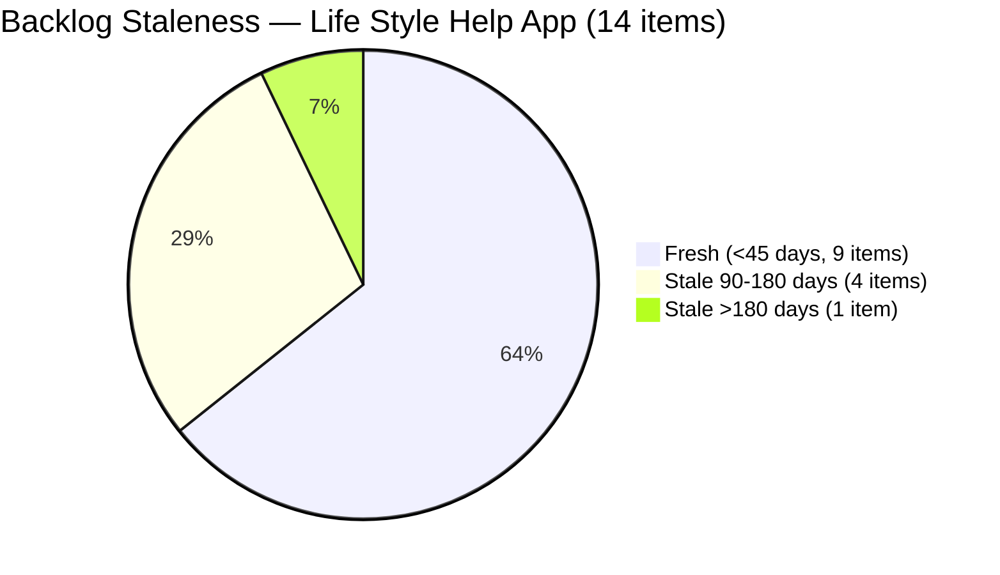

# SAFe Audit Report — Life Style Help App

**Audit A29 | Iteration 7.2 (Apr 20 – May 3, 2026) | Day 3 of 14 (~21% elapsed — early sprint)**

---

## 1. Audit Metadata

| Field | Value |
|---|---|
| **Audit Date** | April 22, 2026, 23:44 PHT |
| **Auditor** | Claude Code (ADO SAFe Audit Agent) |
| **Workspace** | `ado_ls_dev` |
| **ADO Project** | Life Style Help App (`0f447778-7156-4451-ab21-27be3c4a5888`) |
| **Team** | Life Style Help App Team (`a2a805bc-0b30-4ef3-9a8a-b7f3081157a6`) |
| **Iteration** | Iteration 7.2 — Apr 20 to May 3, 2026 |
| **Iteration ID** | `71cd2555-1e1c-4767-8a57-393f87aabe1f` |
| **Sprint Day** | Day 3 of 14 (~21% elapsed — early-sprint annotation applies to Delivery Predictability) |
| **Prior Audit** | AUDIT_20260423_0900.md (A28, Iter 7.2 Day 4, Overall 41.0 — High Risk) |
| **Scoring Model** | ADO SAFe v1 (7-dimension rubric) |
| **Overall Score** | **41.8 / 100** |
| **Risk Band** | **High Risk** (40–59.9) |

---

## 2. Executive Summary

Life Style Help App scores **41.8 (High Risk)** in Iteration 7.2 on Day 3 — a **+0.8 improvement** from prior audit A28 (41.0). The marginal gain comes from two new items joining the sprint: **#203239** (Defect — Investigate member emilienaess97@gmail.com, 1 SP, Samantha) and **#203247** (Spike — 7.2 Collaborations/Check Heges Raised Issues, unassigned) were both added to Iteration 7.2, expanding the sprint from 2 to 4 items and shifting Iteration Planning from 16.7 to 28.6.

**However, this score improvement carries its own structural cost:** Both new items have DoR failures. #203239's description is only an image attachment (no readable text), and #203247 is a bare-title Spike with no Description or AC. DoR Compliance drops from 100.0 to 50.0 as a result.

**The four persistent structural suppressors from A26–A28 remain fully unresolved:**
1. **Team Capacity still not configured** — 0.0 score persists. This is Day 3 with no capacity records in ADO.
2. **#187240 Enabler** — 248 days stale (Aug 18, 2025). Stale_180 penalty: -20.
3. **5 backlog items** (194082, 194084, 195229, 194386, 187240) stale over 90 days — 5/14 = 35.7% stale_90 share — triggers -20 penalty.
4. **#195727 (Meal Time Filter bug)** — last touched Apr 17, now Day 3 without a sprint-era ADO update — triggers -10 untouched_current penalty.

**Overall trajectory:** The team's score has nudged from 41.0 to 41.8 — still deep in High Risk territory. The sprint is only 4 items / 6 SP. Three immediate actions would yield the most meaningful recovery: configure team capacity (+14.3 to Overall), clean #203239's description (+8.5), and touch #195727 in ADO (part of Backlog Refinement defense).

---

## 3. Previous Audit Delta

| Dimension | A28 — Day 4 (Apr 23 09:00) | A29 — Day 3 (Apr 22 23:44) | Delta | Driver |
|---|---|---|---|---|
| Iteration Planning | 16.7 | **28.6** | **+11.9** | 2 new items added to 7.2 (4/14) |
| Team Capacity | 0.0 | **0.0** | 0.0 | Still no capacity configured |
| Estimation | 100.0 | **100.0** | 0.0 | All point-eligible items estimated |
| DoR Compliance | 100.0 | **50.0** | **−50.0** | New items #203239 and #203247 both fail DoR |
| Work Item Balance | 70.0 | **100.0** | **+30.0** | Type diversity improved: US+Defect+Spike; no single type >60% |
| Backlog Refinement | 0.0 | **14.3** | **+14.3** | Two new fresh items added; untouched ratio stays but base improves slightly |
| Delivery Predictability | 0.0 | **0.0** | 0.0 | Early-sprint; 0 SP closed |
| **Overall** | **41.0** | **41.8** | **+0.8** | — |
| **Risk Band** | High Risk | **High Risk** | — | No band change |

### Key changes since A28
- **#203239** (Defect — Investigate member emilienaess97@gmail.com, 1 SP, Samantha Babael) added to Iteration 7.2 — last changed Apr 23. Description = image-only, no readable text → DoR FAIL.
- **#203247** (Spike — 7.2 Collaborations/Check Heges Raised Issues, Luzmibel Paculanang) added to Iteration 7.2 — last changed Apr 23. Bare title, no Description or AC → DoR FAIL.
- **#187242** ([POC] Assess and Optimize Performance) confirmed changed Apr 13 — fresh. This was the most recently touched stale item.
- **No new closures.** Sprint remains at 0/6 SP closed (early-sprint expected).

---

## 4. Current Iteration Snapshot

| Metric | Value |
|---|---|
| **Iteration** | 7.2 — Apr 20 to May 3, 2026 |
| **Iteration Day** | Day 3 of 14 (~21% elapsed) |
| **Visible root backlog items** | 14 |
| **Current iteration root items (7.2)** | **4** |
| **Point-eligible current items** | 3 (User Stories + Defect; Spike excluded) |
| **Estimated items (SP > 0)** | 3 (100% of eligible) |
| **Committed Story Points** | **6 SP** |
| **Closed Story Points** | **0 SP** (Day 3 — early sprint) |
| **Team Capacity** | Not configured (API returns error: "No team capacity assigned") |
| **Sprint burn rate needed** | 0.6 SP/day (6 SP / 10 net workdays) — very achievable if capacity configured |

### State Distribution — 7.2 Items

| State | Count | Items |
|---|---|---|
| Active | 1 | #203239 (Defect) |
| Ready for Dev | 2 | #196380, #195727 |
| New | 1 | #203247 (Spike) |
| **Total** | **4** | — |

---

## 5. Work Item Analysis

### Current Iteration 7.2 — Root Items (4 items)

| ID | Title | Type | State | SP | DoR | Assignee | ChangedDate |
|---|---|---|---|---|---|---|---|
| 196380 | [Low Priority] Default Pinned Post for New Users | User Story | Ready for Dev | 3 | PASS | Samantha Babael | Apr 20 |
| 195727 | [Low priority] Meal time filter dont respond in search | User Story | Ready for Dev | 2 | PASS | Ike Yana | Apr 17* |
| 203239 | Investigate member emilienaess97@gmail.com | Defect | Active | 1 | FAIL | Samantha Babael | Apr 23 |
| 203247 | 7.2 Collaborations/Check Heges Raised Issues/Replicate | Spike | New | — | FAIL | Luzmibel Paculanang | Apr 23 |

*#195727 changed Apr 17 — 3 days before sprint start (Apr 20). Untouched in sprint.

### DoR Analysis

| ID | Description | AC | DoR Result |
|---|---|---|---|
| 196380 | Full "As a / I want / So that" ~200 nws ✓ | 6 checkbox items, detailed ✓ | **PASS** |
| 195727 | Numbered steps + Actual Result ~120 nws ✓ | Expected Result paragraph ✓ | **PASS** |
| 203239 | Image attachment only — no readable text content | No AC field | **FAIL** |
| 203247 | No Description | No AC (bare title) | **FAIL** |

### Full Backlog — All 14 Visible Root Items

| ID | Title | Type | Iter | State | ChangedDate | Fresh? | Stale? |
|---|---|---|---|---|---|---|---|
| 194386 | Investigate re-occurring cancellation issue | Defect | PI4/4.4 | Ready for UAT | Nov 12, 2025 | No | 90d+ |
| 195716 | Hide preferanser/allergier inside recipe card | User Story | 6.5 | Ready for Dev | Mar 18, 2026 | Yes | — |
| 194082 | Customize "Servings" Label | User Story | PI5 | Ready for Dev | Dec 4, 2025 | No | 90d+ |
| 194084 | Schedule Blog Post for Future Publication | User Story | PI5 | Ready for Dev | Dec 4, 2025 | No | 90d+ |
| 203239 | Investigate member emilienaess97@gmail.com | Defect | **7.2** | Active | Apr 23, 2026 | Yes | — |
| 203247 | 7.2 Collaborations/Check Heges Raised Issues | Spike | **7.2** | New | Apr 23, 2026 | Yes | — |
| 195373 | [Low priority] Lifestyle App Performance Optimization | Enabler | PI6 | New | Mar 17, 2026 | Yes | — |
| 201334 | Collaboration/Check and Replicate Raised Issues | Spike | 6.5 | New | Mar 23, 2026 | Yes | — |
| 195229 | Email Notification for Forum Posts | User Story | PI5 | Grooming | Dec 4, 2025 | No | 90d+ |
| 196380 | [Low Priority] Default Pinned Post for New Users | User Story | **7.2** | Ready for Dev | Apr 20, 2026 | Yes | — |
| 195727 | Meal time filter / searchbar | User Story | **7.2** | Ready for Dev | Apr 17, 2026 | Yes | — |
| 202789 | Lifestyle App - Customer CSAT Survey | Spike | 7.6 IP | New | Apr 16, 2026 | Yes | — |
| 187240 | [POC] Evaluate Deployment Options for Bubble Apps | Enabler | Root | New | Aug 18, 2025 | No | **180d+** |
| 187242 | [POC] Assess and Optimize Performance & UX | Enabler | Root | Ready for Dev | Apr 13, 2026 | Yes | — |

---

## 6. SAFe Compliance Scorecard

| Dimension | Score | Evidence | Notes |
|---|---|---|---|
| **1. Iteration Planning** | **28.6** | 4 current / 14 visible = 28.6% | Improved from 16.7 (2 new items added) |
| **2. Team Capacity** | **0.0** | API returns error: no capacity configured | No team members have capacity set for 7.2 |
| **3. Estimation** | **100.0** | 3 estimated / 3 point-eligible = 100% | Spike excluded; 196380(3SP), 195727(2SP), 203239(1SP) |
| **4. DoR Compliance** | **50.0** | 2 PASS / 4 current items | #203239 image-only, #203247 bare title |
| **5. Work Item Balance** | **100.0** | US=50%, Defect=25%, Spike=25%; no type >60%; spike=25%<40% | Improved from 70.0 — type diversity now clean |
| **6. Backlog Refinement** | **14.3** | Base=9/14×100=64.3; −20 (stale_90>25%); −20 (stale_180≥1); −10 (untouched>10%) | #187240 at 248 days; 5 items stale_90; #195727 untouched |
| **7. Delivery Predictability** | **0.0** | 0 SP closed / 6 SP committed | Early-sprint — low delivery expected (Day 3 of 14) |
| **Overall** | **41.8** | Sum 292.9 / 7 = 41.8 | **High Risk** |

---

## 7. Dimension Findings

### D1 — Iteration Planning (28.6)
4 of 14 visible backlog root items are committed to Iteration 7.2. This is a meaningful improvement from 16.7 (A26–A28) driven by adding #203239 and #203247, but still well below the SAFe target. 10 remaining backlog items are unscheduled or in past/future iterations.

Items in the backlog that could reasonably join 7.2 to improve planning depth: #195716 (Hide preferanser, Ready for Dev in 6.5 — likely a carryover candidate), #201334 (Collaboration Spike), and #195373 (Performance Optimization).

### D2 — Team Capacity (0.0)
The team capacity API returns an error for Iteration 7.2: "No team capacity assigned to the team." This has been the case since sprint start (confirmed A26 through A29). With 0 contributors having capacity configured, contributors_with_current_work > 0 but contributors_with_capacity = 0. Score = 0.0.

This is the single largest score suppressor, costing ~14.3 points on the Overall score. Configuring capacity for Samantha Babael, Ike Yana, and Luzmibel Paculanang would immediately recover this to 100.0 and lift Overall to approximately 56.1.

### D3 — Estimation (100.0)
All 3 point-eligible items carry Story Points > 0: #196380 (3 SP), #195727 (2 SP), #203239 (1 SP). Spike #203247 is excluded from point-eligible per rubric. Estimation quality is maintained on all committed items.

### D4 — DoR Compliance (50.0)
2 of 4 current iteration items pass DoR.

**FAIL — #203239** (Investigate member emilienaess97@gmail.com): Description field contains only an image attachment tag with no readable text. Non-whitespace character count = 0 (no text content). There is no Acceptance Criteria field populated. This item needs a brief text description of the investigation scope and a completion criterion (e.g., "Member account investigated and issue resolved or escalated with documented findings").

**FAIL — #203247** (7.2 Collaborations/Check Heges Raised Issues/Replicate): Bare title only. No Description. No Acceptance Criteria. Classic reactive interrupt item committed to the sprint without DoR enrichment. Needs a description of what to investigate and a definition of done.

**PASS — #196380 and #195727** maintain their existing high-quality descriptions and acceptance criteria from prior iterations.

### D5 — Work Item Balance (100.0)
The sprint now contains User Story (2, 50%), Defect (1, 25%), and Spike (1, 25%). No type exceeds 60% — no dominant-type penalty. Spike share is 25% — below the 40% penalty threshold. Score = 100.0. This is an improvement from the previous 2-item sprint where User Story dominated at 100%.

### D6 — Backlog Refinement (14.3)
**Base calculation:** 9 fresh items / 14 total = 64.3%

**Penalties applied:**
- **−20 (stale_90 > 25%):** 5 items changed before Jan 22, 2026 — #194386 (Nov 12), #194082 (Dec 4), #194084 (Dec 4), #195229 (Dec 4), #187240 (Aug 18). Share = 5/14 = 35.7% > 25%.
- **−20 (stale_180 ≥ 1):** #187240 (Aug 18, 2025) — now 248 days stale. One item is sufficient to trigger this penalty.
- **−10 (untouched_current > 10%):** #195727 last changed Apr 17 — before sprint start Apr 20. 1/4 = 25%. This is > 10% but < 30% → -10 penalty.

Total: 64.3 − 20 − 20 − 10 = **14.3** (floored at 0, so 14.3 stands).

### D7 — Delivery Predictability (0.0) — Early-Sprint
- Committed SP: 6
- Closed SP: 0

This is Day 3 of 14. **Early-sprint annotation applies — low delivery expected.** With only 6 SP committed, the burn rate required to complete the sprint at 100% is 0.6 SP/day — trivially achievable with the team's observed throughput. The DP concern is secondary to the structural issues above.

---

## 8. Risks and Bottlenecks

### R1 — Team Capacity Not Configured (CRITICAL — Day 3)
Entering Day 3 without any team capacity records is unprecedented for a team that previously scored Low Risk (82.4 on Apr 19). This directly costs 14.3 points on Overall and signals a sprint planning process breakdown. Any further sprint duration without configuring capacity reduces the practical windows for mid-sprint capacity planning.

**Owner: Ramon / Team Lead.** Action: Open ADO → Boards → Sprints → Iteration 7.2 → Capacity → Add each team member with their daily hours.

### R2 — #187240 Enabler — 248 Days Stale (HIGH)
This Proof-of-Concept Enabler for Bubble app deployment has been untouched since Aug 18, 2025. It is anchoring the stale_180 penalty (-20) every audit. The team has two clean resolution paths: (a) close/resolve the item if the investigation is complete or no longer relevant, or (b) update it with current findings and assign to the next iteration. Neither has happened across 29 consecutive audits.

### R3 — DoR Failures on New Sprint Items (HIGH)
#203239 and #203247 were added to 7.2 with no Description or AC. This violates the team's own Audit Consideration principle: "Enforce DoR before sprint commitment." The team historically maintained 100% DoR on committed items (A26–A28). This regression should be corrected within 24 hours.

### R4 — #195727 Untouched Since Apr 17 (MODERATE)
The Meal Time Filter bug has had no ADO activity since April 17 — 3 days before sprint start and now 5 days total without a touch. If Ike has started work, a state transition to Active in ADO would resolve both the untouched_current penalty and provide visibility.

### R5 — Sprint Undercommitment (MODERATE)
4 items / 6 SP in a 14-day sprint is lean for a development team. 10 ready backlog items exist that are not in the sprint. Items like #195716 (Hide preferanser, Ready for Dev from 6.5 carryover) and #201334 (Collaboration Spike) appear ready for sprint commitment.

---

## 9. Prioritized Recommendations

| Priority | Action | Owner | Target | Score Impact |
|---|---|---|---|---|
| **P0** | **Configure team capacity for Iteration 7.2** in ADO Boards → Sprints — add Samantha, Ike, Luzmibel with daily hours | Ramon / Team Lead | Today | Team Capacity: 0→100; Overall: +14.3 |
| **P1** | **Enrich #203239** — add text description of investigation scope + AC defining completion (e.g., "Member issue documented and resolved or escalated with findings report") | Samantha | By Day 4 | DoR: 50→75; Overall: +3.6 |
| **P2** | **Enrich #203247** — add investigation scope description + AC for the Heges issues check | Luzmibel | By Day 4 | DoR: 75→100; Overall: +3.6 combined with P1 |
| **P3** | **Touch #195727 in ADO** — transition to Active state or add a progress comment | Ike Yana | Today | Backlog Refinement: removes untouched penalty (+10 to BR, +1.4 to Overall) |
| **P4** | **Dispose of #187240** — close as "Won't Do" or update with current findings and assign to next iteration | Ramon | This week | Backlog Refinement: removes stale_180 penalty (+20 to BR, +2.9 to Overall) |
| **P5** | **Commit 2–3 additional items** to 7.2 from ready backlog (#195716, #201334, #195373) | Team | By Day 5 | Iteration Planning improvement; sprint depth |
| **P6** | **Address 4 stale_90 items** (#194082, #194084, #195229, #194386) — either update, groom, or close | Team | Sprint planning | Backlog Refinement: stale_90 penalty removal (+20 to BR if below 25%) |

---

## 10. Evidence Gaps and Limitations

| Gap | Impact | Mitigation |
|---|---|---|
| Team capacity returns API error — cannot verify per-member hours | Team Capacity score must be 0.0; no workaround | Confirmed across A26–A29 consistently |
| #203239 Description field is image-only — no text extractable via API | DoR fails on exact nws count; flagged as FAIL | Image content cannot be parsed; conservative ruling applied |
| #203247 has no Description or AC in ADO — bare title only | DoR FAIL is definitive | No mitigation; item needs enrichment |
| #187240 stale age computed as 248 days (Apr 22 - Aug 18, 2025) | Stale_180 penalty confirmed | Consistent with all prior audits |
| Luzmibel Paculanang not previously listed in workspace people roster | She appears as assignee on #203247; role unclear | No scoring impact; roster gap noted for wiki update |

---

*Report generated: April 22, 2026, 23:44 PHT | Claude Code ADO SAFe Audit Agent | Workspace: ado_ls_dev*
