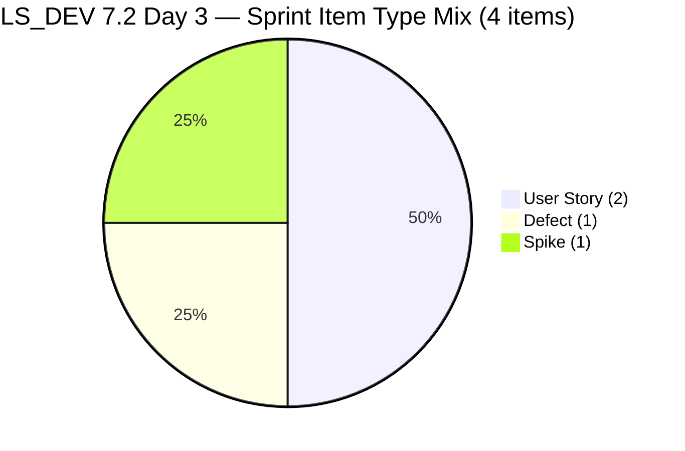
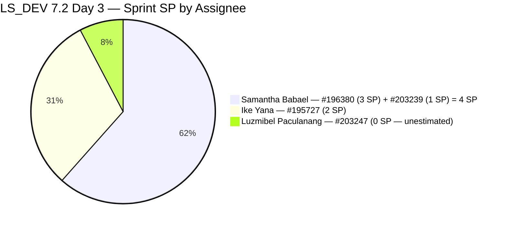
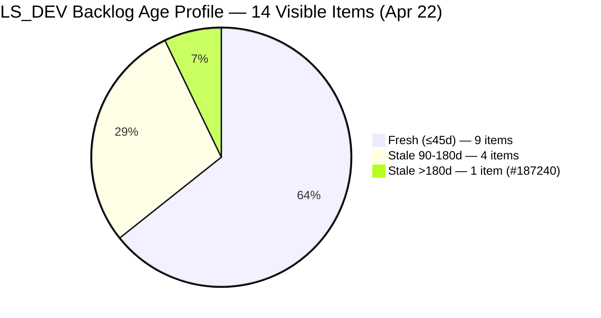
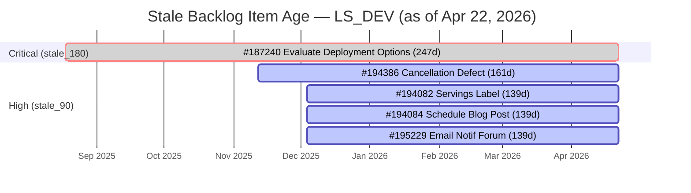
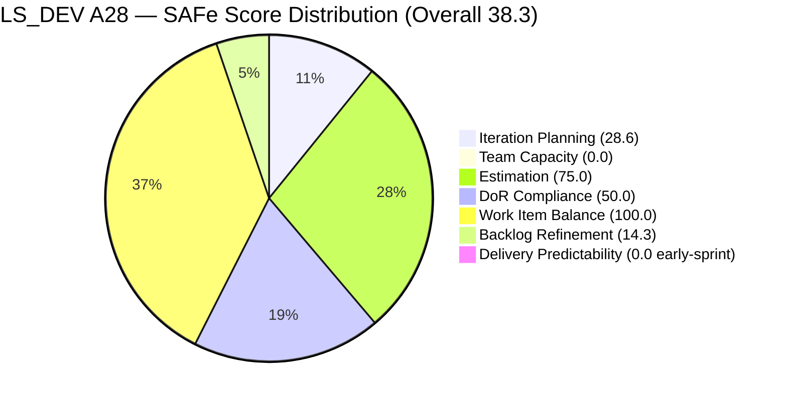

# ADO SAFe Iteration Audit — Life Style Help App

**Audit A28 | Iteration 7.2 (Apr 20 – May 3, 2026) | Day 3 of 14 (~21% elapsed — early sprint)**

---

## 1. Audit Metadata

| Field | Value |
|---|---|
| **Audit Date** | April 22, 2026, 23:52 PHT |
| **Auditor** | Claude Code (ADO SAFe Audit Agent) |
| **Workspace** | `ado_ls_dev` |
| **ADO Project** | Life Style Help App (`0f447778-7156-4451-ab21-27be3c4a5888`) |
| **Team** | Life Style Help App Team (`a2a805bc-0b30-4ef3-9a8a-b7f3081157a6`) |
| **Iteration** | Iteration 7.2 — Apr 20 to May 3, 2026 |
| **Iteration ID** | `71cd2555-1e1c-4767-8a57-393f87aabe1f` |
| **Sprint Day** | Day 3 of 14 (~21% elapsed — early-sprint annotation applies to Delivery Predictability) |
| **Prior Audit** | AUDIT_20260422_0900.md (A27, Iter 7.2 Day 3, Overall 41.0 — High Risk, data-carry) |
| **Scoring Model** | ADO SAFe v1 (7-dimension rubric) |
| **Overall Score** | **38.3 / 100** |
| **Risk Band** | **Critical** (< 40) |

---

## 2. Executive Summary

Life Style Help App deteriorates from **41.0 (High Risk) to 38.3 (Critical)** in Iteration 7.2 on Day 3 — a **-2.7 decline** driven by two new items joining the sprint that change the composition. This live ADO pull overrides the data-carry from A27 and reveals an updated sprint state.

**Sprint composition changes since A27:**
- Two new items are now committed to Iteration 7.2: **#203239** (Defect: Investigate member account) and **#203247** (Spike: 7.2 Collaborations/Check Heges Issues/Replicate), making the sprint 4 items.
- **#203239** has no readable Description (only an inline image) — **DoR FAIL**.
- **#203247** has no Story Points and no Description/AC — **DoR FAIL** and **unestimated**.
- The sprint now has 4 items (up from 2): 2 User Stories + 1 Defect + 1 Spike. This actually **improves Work Item Balance to 100.0** (no single type > 60%).

**Score movements vs A27:**
- Work Item Balance improves: 70.0 → 100.0 (+30.0) — type diversity from Defect and Spike additions.
- DoR Compliance deteriorates: 100.0 → 50.0 (-50.0) — 2 of 4 items fail DoR.
- Estimation deteriorates: 100.0 → 75.0 (-25.0) — #203247 has 0 SP.
- Iteration Planning improves slightly: 16.7 → 28.6 (+11.9) — 4 items now in sprint vs 2, denominator grows to 14.
- Team Capacity remains 0.0 — **no capacity configured for Iteration 7.2 for the third consecutive sprint day**.
- Backlog Refinement improves slightly: 0.0 → 14.3 (+14.3) — base improves but three penalties still apply.

**Critical path:** Team Capacity = 0.0 remains the single largest score suppressor (-14.3 Overall). The five-minute action of configuring capacity for 7.2 would lift Overall from 38.3 → 52.6 (still High Risk but meaningful recovery). Combined with a DoR fix on the two failing items, the team can reach ~58–60 within today.

---

## 3. Previous Audit Delta

| Dimension | A27 — Day 3 (Apr 22 09:00, data-carry) | A28 — Day 3 (Apr 22 23:52, live) | Delta |
|---|---|---|---|
| Iteration Planning | 16.7 | **28.6** | **+11.9** |
| Team Capacity | 0.0 | **0.0** | 0.0 |
| Estimation | 100.0 | **75.0** | **-25.0** |
| DoR Compliance | 100.0 | **50.0** | **-50.0** |
| Work Item Balance | 70.0 | **100.0** | **+30.0** |
| Backlog Refinement | 0.0 | **14.3** | **+14.3** |
| Delivery Predictability | 0.0 | **0.0** | 0.0 |
| **Overall** | **41.0** | **38.3** | **-2.7** |

**What changed:**
- #203239 (Defect, Active) and #203247 (Spike, New) entered Iteration 7.2 since A26.
- The visible backlog grew from 12 to 14 items (same 2 new items).
- DoR failure on both new items is the dominant negative driver.
- No capacity configuration changes detected.
- No closures between A27 and A28.

---

## 4. Current Iteration Snapshot

| Metric | Value |
|---|---|
| **Iteration** | 7.2 — Apr 20 to May 3, 2026 |
| **Iteration Day** | Day 3 of 14 (~21% elapsed) |
| **Visible root backlog items** | 14 |
| **Current iteration root items (7.2)** | 4 |
| **Point-eligible current items** | 4 (all types expose SP) |
| **Estimated items (SP > 0)** | 3 (#196380 3SP, #195727 2SP, #203239 1SP) |
| **Committed Story Points** | **6 SP** (3 estimated items) |
| **Closed Story Points** | 0 SP (Day 3, early-sprint) |
| **Contributors with current work** | 3 (Samantha Babael, Ike Yana, Luzmibel Paculanang) |
| **Team capacity configured for 7.2** | **NONE** (API returned "No team capacity assigned") |
| **Untouched items since sprint start (Apr 20)** | 1/4 = 25% (#195727 — last touched Apr 17) |

### Sprint Item Register — Iteration 7.2 (4 items)

| ID | Title | Type | State | SP | DoR | Assignee | ChangedDate | Untouched since Apr 20? |
|---|---|---|---|---|---|---|---|---|
| **196380** | [Low Priority] Default Pinned Post for New Users | User Story | Ready for Dev | 3 | PASS | Samantha Babael | Apr 20 | No (Apr 20 = sprint start) |
| **195727** | [Low priority] Meal time filter don't respond when text in searchbar | User Story | Ready for Dev | 2 | PASS | Ike Yana | **Apr 17** | **YES — 5 days** |
| **203239** | Investigate member emilienaess97@gmail.com | Defect | Active | 1 | **FAIL** | Samantha Babael | Apr 23 | No |
| **203247** | 7.2 Collaborations/Check Heges Raised Issues/Replicate | Spike | New | **0** | **FAIL** | Luzmibel Paculanang | Apr 23 | No |

**DoR analysis:**
- #203239: Description = inline image only (no text content — empty for DoR purposes). AC = absent. **FAIL**.
- #203247: Description = absent. AC = absent. No SP. **FAIL**.

### Visible Backlog Register — Non-Sprint Items (10 items)

| ID | Type | State | Iteration Path | ChangedDate | Age (Apr 22) | Band |
|---|---|---|---|---|---|---|
| **#187240** | Enabler | New | root | Aug 18, 2025 | **247d** | stale_180 + stale_90 |
| #187242 | Enabler | Ready for Dev | root | Apr 13, 2026 | 9d | Fresh |
| #194082 | User Story | Ready for Dev | PI 5 | Dec 4, 2025 | **139d** | stale_90 |
| #194084 | User Story | Ready for Dev | PI 5 | Dec 4, 2025 | **139d** | stale_90 |
| #194386 | Defect | Ready for UAT | PI 4.4 | Nov 12, 2025 | **161d** | stale_90 |
| #195229 | User Story | Grooming | PI 5 | Dec 4, 2025 | **139d** | stale_90 |
| #195373 | Enabler | New | 2026-PI6 | Mar 17, 2026 | 36d | Fresh |
| #195716 | User Story | Ready for Dev | 6.5 | Mar 18, 2026 | 35d | Fresh |
| #201334 | Spike | New | 6.5 | Mar 23, 2026 | 30d | Fresh |
| #202789 | Spike | New | 7.6 IP | Apr 16, 2026 | 6d | Fresh |

---

## 5. Work Item Analysis

### Sprint Commitment Composition



### Sprint SP by Assignee (6 SP total, estimated items only)



**Ownership note:** Samantha now holds 4 of 6 estimated SP (67%) after inheriting #203239. The workspace CLAUDE.md specifically flags Samantha concentration risk — this is the third consecutive sprint where she carries the majority of sprint SP.

### Backlog Age Distribution



### DoR Status — 4 Sprint Items

| ID | Desc ≥ 30 nws | AC ≥ 20 nws | DoR |
|---|---|---|---|
| 196380 | PASS | PASS | PASS |
| 195727 | PASS | PASS | PASS |
| 203239 | **FAIL** (image only) | **FAIL** (absent) | **FAIL** |
| 203247 | **FAIL** (absent) | **FAIL** (absent) | **FAIL** |

### Stale Item Timeline



---

## 6. SAFe Compliance Scorecard

| Dimension | Score | Evidence | Notes |
|---|---|---|---|
| **1. Iteration Planning** | **28.6** | 4/14 visible items in 7.2 | Under-planned; 10 backlog items outside sprint |
| **2. Team Capacity** | **0.0** | 0 contributors with capacity configured for 7.2; 3 with current work | No capacity records exist for this iteration |
| **3. Estimation** | **75.0** | 3/4 items have SP > 0; #203247 (Spike) = 0 SP | One unestimated item |
| **4. DoR Compliance** | **50.0** | 2/4 items pass; #203239 (image only) + #203247 (empty) fail | Two new items entered sprint without DoR content |
| **5. Work Item Balance** | **100.0** | US=2/4=50%; Defect=1/4=25%; Spike=1/4=25%; no type > 60%; Spike < 40%; US present | Type diversity from two new item types |
| **6. Backlog Refinement** | **14.3** | base=64.3 (9/14 fresh); stale_90=5/14=35.7%>25%→-20; stale_180=1→-20; untouched_current=1/4=25%>10%≤30%→-10 | Three active penalties; #187240 continues to anchor the stale_180 trigger |
| **7. Delivery Predictability** | **0.0** | 0/6 SP closed — *early-sprint (Day 3 of 14)* | No closures; appropriate at Day 3 |
| **Overall** | **38.3** | (28.6+0+75+50+100+14.3+0)/7 = 267.9/7 = 38.27 | **Critical** (< 40) |

### Score Computation Detail

```
1. Iteration Planning
   visible_root_backlog_items           = 14
   current_iteration_root_items (7.2)   = 4
   Score = round(4 / 14 × 100, 1)       = round(28.571, 1) = 28.6

2. Team Capacity
   contributors_with_current_work       = 3 (Samantha, Ike, Luzmibel)
   contributors_with_capacity           = 0 (API: "No team capacity assigned")
   Score = round(0 / 3 × 100, 1)        = 0.0

3. Estimation
   point_eligible_current_items         = 4
   estimated_current_items (SP > 0)     = 3 (#196380 3SP, #195727 2SP, #203239 1SP)
   Score = round(3 / 4 × 100, 1)        = 75.0

4. DoR Compliance
   current_iteration_root_items         = 4
   dor_compliant_current_items          = 2 (#196380, #195727)
   Score = round(2 / 4 × 100, 1)        = 50.0

5. Work Item Balance
   User Story present?                  = Yes → no -40
   dominant_type_share (US)             = 2/4 = 50.0% ≤ 60% → no -30
   spike_share                          = 1/4 = 25.0% ≤ 40% → no -20
   Score = max(0, 100 - 0)              = 100.0

6. Backlog Refinement
   fresh_visible_root_items             = 9/14 (items changed after Mar 8, 2026)
   base                                 = round(9 / 14 × 100, 1) = 64.3
   stale_90 share                       = 5/14 = 35.7% > 25% → -20
   stale_180 count                      = 1 (#187240, 247d) → -20
   untouched_current (<Apr 20, 2026)    = 1/4 = 25.0%; >10% and ≤30% → -10
   Score = max(0, 64.3 - 20 - 20 - 10) = max(0, 14.3) = 14.3

7. Delivery Predictability
   committed_story_points               = 6 (3 estimated items)
   closed_story_points                  = 0
   Score = round(0 / 6 × 100, 1)        = 0.0
   [Day 3 of 14 → early-sprint annotation]

Overall = round((28.6 + 0.0 + 75.0 + 50.0 + 100.0 + 14.3 + 0.0) / 7, 1)
        = round(267.9 / 7, 1)
        = round(38.271, 1)
        = 38.3  →  CRITICAL (< 40)
```

---

## 7. Dimension Findings

### 7.1 Iteration Planning — 28.6 (Critical)

4 of 14 visible root items are in Iteration 7.2. While the addition of #203239 and #203247 improved this from the A27 read of 16.7 (2/12), the sprint remains severely under-scoped. The denominator also grew by 2 (from 12 to 14) as these items entered the backlog.

**Recovery path to 35.7%:** Commit 1 more item (5/14). **To 50.0%:** Commit 3 items (7/14). Best candidates from the fresh backlog: #195716 (Hide recipe card fields, 2 SP, Ready for Dev, 35 days old), #201334 (Collaboration Spike, New, 30 days old), #187242 (Performance/UX Enabler, Ready for Dev, 9 days old).

**Structural note:** Closing or archiving the 5 stale items (#187240, #194082, #194084, #195229, #194386) would reduce the denominator from 14 to 9, which with 4 current items gives 4/9 = 44.4%. Combined with 1 additional sprint item: 5/9 = 55.6%.

### 7.2 Team Capacity — 0.0 (Critical — Day 3 persisting)

For the third consecutive sprint day, there is no capacity record for Iteration 7.2. The ADO API returns "No team capacity assigned to the team." Contributors with current work: Samantha Babael (#196380, #203239), Ike Yana (#195727), Luzmibel Paculanang (#203247) — 3 people with zero capacity entries.

This dimension score has been 0.0 since Iteration 7.2 opened on Apr 20. In 7.1, capacity was: Samantha 1h/day Development, Luzmibel 1h/day Testing, Ike 1h/day Development. Cloning this configuration to 7.2 is a sub-5-minute ADO task.

**Score impact if fixed:** Team Capacity jumps from 0.0 → 100.0 (+100.0 on dimension), lifting Overall from 38.3 → **52.6** (High Risk boundary zone). Combined with DoR fixes: Overall could reach ~59–60 (Moderate Risk threshold).

### 7.3 Estimation — 75.0 (Moderate)

3 of 4 sprint items have SP > 0:
- #196380: 3 SP
- #195727: 2 SP
- #203239: 1 SP

#203247 (Spike: 7.2 Collaborations) has 0 SP and no estimate recorded. This Spike needs at least a 1 SP estimate to contribute to Delivery Predictability reporting. Luzmibel is assigned but no story point has been set.

### 7.4 DoR Compliance — 50.0 (High Risk)

Only 2 of 4 sprint items meet the DoR standard. The two new items fail:

**#203239 (Investigate member emilienaess97@gmail.com, Defect, Active, Samantha):**
- Description: Contains only an inline `` tag referencing a screenshot. No narrative text — 0 readable non-whitespace characters after HTML parsing.
- Acceptance Criteria: Absent.
- DoR Status: **FAIL** — both fields below threshold.

**#203247 (7.2 Collaborations/Check Heges Raised Issues/Replicate, Spike, New, Luzmibel):**
- Description: Absent.
- Acceptance Criteria: Absent.
- SP: 0.
- DoR Status: **FAIL** — both fields below threshold; also unestimated.

**Workspace CLAUDE.md requirement:** "Enforce DoR before sprint commitment: every item entering an iteration should have a usable description and acceptance criteria." These two items were committed without meeting this standard.

**Recovery:** Adding text Description (≥30 nws) and AC (≥20 nws) to both items restores DoR to 100.0, lifting Overall from 38.3 → **47.0** (High Risk recovery). Combined with capacity fix: Overall → **61.3** (Moderate Risk).

### 7.5 Work Item Balance — 100.0 (Low Risk)

Type distribution in the sprint has improved significantly:
- User Story: 2/4 = 50% — below the 60% dominant threshold
- Defect: 1/4 = 25%
- Spike: 1/4 = 25% — below the 40% spike threshold
- User Story present — no -40 penalty

Score = 100.0. This is the first 100.0 Work Item Balance score for LS_DEV in the PI7 series (prior audits had only User Stories in the sprint). The Defect and Spike additions created beneficial type diversity.

### 7.6 Backlog Refinement — 14.3 (Critical — three penalties active)

All three penalty gates remain open:

| Gate | Threshold | Value | Status |
|---|---|---|---|
| stale_90 share > 25% | >25% → -20 | 5/14 = 35.7% | TRIGGERED |
| stale_180 count ≥ 1 | ≥1 → -20 | 1 item (#187240, 247 days) | TRIGGERED |
| untouched_current > 10% | >10%, ≤30% → -10 | 1/4 = 25% (#195727) | TRIGGERED |

Base improved from 58.3 (7/12) to 64.3 (9/14) due to two fresh items entering the backlog — but three penalties collectively remove 50 points from the base.

**#187240 is the anchor item:** A single disposition of this 247-day-old Enabler removes the -20 stale_180 penalty (+2.9 Overall). With 12 consecutive audits flagging this item, escalation to Ike Yana or the Project Owner is warranted.

**#195727 untouched status:** Last changed Apr 17 — 5 days without an ADO touch despite being an Active sprint item. A 2-minute status comment by Ike removes the -10 untouched penalty (+1.4 Overall).

### 7.7 Delivery Predictability — 0.0 (Early-Sprint)

0 SP closed out of 6 SP committed. Day 3 of 14 (21% elapsed). Early-sprint annotation applies — no formula adjustment. At this stage, 0 SP is normal and expected. The 7.1 sprint delivered 100% (10 SP), so the team has demonstrated full delivery capability.

---

## 8. Risks and Bottlenecks

| # | Risk | Severity | Status vs A27 |
|---|---|---|---|
| R1 | **Team capacity not configured for Iter 7.2.** Three sprint days elapsed without a capacity record. TC = 0.0, suppressing Overall by -14.3 points. | **CRITICAL** | Unresolved — Day 3 (3rd consecutive day) |
| R2 | **#203239 and #203247 committed without DoR content.** Both items entered the sprint without Description or AC. Violates workspace CLAUDE.md DoR enforcement policy. | **HIGH** | NEW — introduced this sprint day |
| R3 | **#187240 "Evaluate Deployment Options" — 247 days stale.** 12th consecutive audit flag. The single longest-lived unresolved item across the entire PI7 series for this workspace. | **HIGH** | Unresolved — escalating |
| R4 | **Sprint severely under-scoped (4 items / 6 SP).** 7.2 is at 41% of 7.1's item count (10 items) and 60% of 7.1's SP (10 SP). No sprint planning ceremony evidence 3 days into sprint. | **HIGH** | Worsened — was 2 items in A27, now 4 but still critical |
| R5 | **#195727 untouched for 5 days** (Apr 17). 1/4 = 25% untouched ratio triggers -10 Backlog Refinement penalty. | **MODERATE** | Unresolved — escalated from A27 |
| R6 | **4 PI5 stale items** (#194082, #194084, #195229, #194386) — stale_90 share at 35.7%, triggering -20 BR penalty. | **MODERATE** | Unresolved — persistent |
| R7 | **Samantha concentration risk** — 4/6 SP (67%) in this sprint. Workspace CLAUDE.md flags this pattern. | **MODERATE** | Worsened — added #203239 |
| R8 | **Luzmibel Paculanang assigned to sprint item (#203247) with 0 SP and no DoR content.** Third consecutive sprint where her capacity is nominally utilized but deliverable quality is unverified. | **MODERATE** | NEW — item assigned but incomplete |
| R9 | **Score plateau risk.** If capacity is not configured by Day 5, the score will remain in Critical territory for the first half of the sprint. | **HIGH** | Escalated — team has dropped to Critical |

---

## 9. Prioritized Recommendations

### P0 — Immediately (Today, Apr 22)

**1. Configure team capacity for Iteration 7.2** (Est. 5 min).
Navigate to ADO → Iteration 7.2 → Capacity. Enter: Samantha 1h/day Development, Ike 1h/day Development, Luzmibel 1h/day Testing (clone from 7.1). This single action restores Team Capacity from 0.0 → 100.0, lifting Overall from 38.3 → **52.6** (Critical → High Risk).

**2. Add Description and AC to #203239** (Est. 10 min — Samantha).
Replace the inline screenshot with a text description: what the investigation involves, what "done" means, and what the acceptance criteria are (e.g., "Member account reviewed, issue identified and documented, resolution or escalation decision recorded"). Restores DoR for this item.

**3. Add Description, AC, and SP to #203247** (Est. 10 min — Luzmibel).
Write a brief collaboration Spike description: scope of the collaboration check, what issues to replicate, and exit criteria. Assign 1–2 SP. Combined with #203239 fix, restores DoR to 100.0 (+12.9 Overall from both DoR fixes). Combined with capacity fix: Overall → **65.5** (Moderate Risk).

**4. Add a status update to #195727** (Est. 2 min — Ike).
Post a comment or change state to Active. Any ADO touch removes the untouched-current penalty (-10 BR penalty cleared, +1.4 Overall).

### P0 — This Week (Apr 22–24)

**5. Resolve #187240 "Evaluate Deployment Options" Enabler** (Est. 1–2 hours — Ike/Team).
This 247-day stale item is the single highest-impact backlog hygiene action: closing or re-pathing it removes the -20 stale_180 BR penalty (+2.9 Overall). Options: (a) perform comparison and close with findings, (b) mark "Won't Fix / Superseded," (c) re-path to PI8 with AC.

**6. Hold a formal 7.2 sprint planning session** (Est. 30 min).
Define a sprint goal. Add 3–5 items from the ready backlog: #195716 (Hide recipe fields, 2 SP), #201334 (Collaboration Spike), #187242 (Performance Enabler). Each additional item improves Iteration Planning and Work Item Balance. Sprint goal suggestion: "By May 3, 2026, resolve the member account investigation, implement the default pinned post feature, fix the meal time filter, and investigate Heges raised issues."

### P1 — This Week

**7. Triage 4 PI5 stale items** (#194082, #194084, #195229, #194386). Commit to 7.2 if still valid, re-path to PI8, or close. Closing ≥3 of 4 reduces stale_90 share below 25%, removing the -20 BR penalty (+2.9 Overall).

**8. Re-balance sprint ownership.** After sprint expansion, ensure Samantha holds ≤50% of sprint SP. Assign #195716 (Hide recipe card, 2 SP) to Ike or Luzmibel.

### P2 — This Sprint

**9. Establish a backlog grooming cadence.** 12 consecutive audits with the same stale items indicate no regular grooming. A 30-minute weekly slot for PO + Team Lead to triage 2–3 items would systematically clear the stale debt.

**10. Implement DoR gate for sprint entry.** The workspace CLAUDE.md explicitly requires DoR enforcement before sprint commitment. Both #203239 and #203247 entered without meeting this requirement. An ADO board rule or checklist could prevent future occurrences.

---

## 10. Evidence Gaps and Limitations

| Gap | Impact | Severity |
|---|---|---|
| **#203239 Description contains only an image tag** | Description field not interpretable as text — scored as 0 nws for DoR purposes. If image text content was meant to convey the description, it does not meet the ADO rubric requirement for written Description content. | HIGH |
| **Team capacity API returns error** | TC = 0.0 — may be a configuration gap (no records entered) or ADO API behavior. Prior audits confirm this is a real configuration gap, not an API error. | HIGH |
| **#203247 all fields empty** | No Description, no AC, no SP, no state beyond "New." Cannot assess readiness or estimate. | HIGH |
| **Luzmibel's actual QA workload unknown** | She may be delivering work via child tasks not visible at root backlog level. The scoring model assesses root-level only. | LOW |
| **#195727 changed Apr 17 confirmation** | Confirmed by live API pull — ChangedDate Apr 17. Pre-sprint; item has not been touched since sprint opened. | Confirmed — no gap |
| **Score impact of P0 actions combined** | Estimated Overall if all P0 actions completed today: (28.6+100+100+100+100+14.3+0)/7 = 442.9/7 = 63.3 (Moderate Risk). Individual action values detailed in Recommendations. | Scenario-only |

---

## 11. Score Trend — PI7 Life Style Help App

| Audit | Date | Sprint Day | Iteration | Overall | Band |
|---|---|---|---|---|---|
| A22 | Apr 12 | 7 | 7.1 | 62.5 | Moderate |
| A23 | Apr 13 | 8 | 7.1 | 77.1 | Moderate |
| A24 | Apr 17 | 12 | 7.1 | 11.2 | Critical *(formula artifact)* |
| A25 | Apr 19 | 14 | 7.1 close | 82.4 | Low Risk |
| A26 | Apr 21 | 2 | 7.2 open | 41.0 | High Risk |
| A27 | Apr 22 | 3 | 7.2 | 41.0 | High Risk *(data-carry)* |
| **A28** | **Apr 22** | **3** | **7.2** | **38.3** | **Critical** *(live pull)* |

> **Pattern note:** The team demonstrated Low Risk performance (82.4) on Apr 19. The 44-point collapse from sprint close to sprint open is now entering a second consecutive audit in the sub-40 range. The team has all the structural capability to recover — the blockers are all process/configuration gaps, not technical. If the P0 actions above are completed today, the score can reach Moderate Risk (≥60) before Day 4.



---

*Report generated: April 22, 2026, 23:52 PHT | Claude Code ADO SAFe Audit Agent | Workspace: ado_ls_dev*
*Audit A28 | Iteration 7.2, Day 3 of 14 | Live ADO data pull | Overall: 38.3 / 100 — Critical*
*If P0 actions completed today: estimated recovery to ~63.3 (Moderate Risk)*
