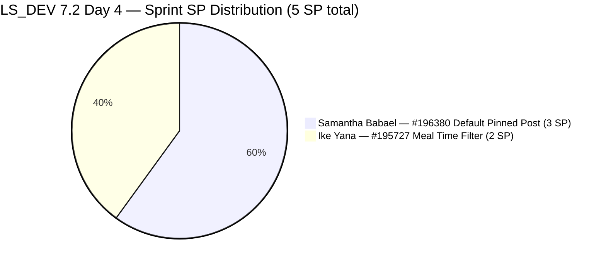
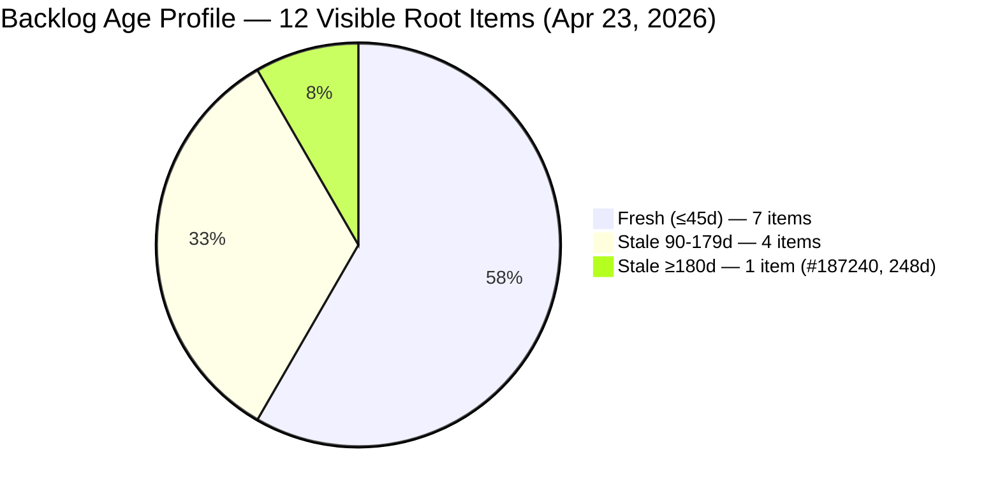
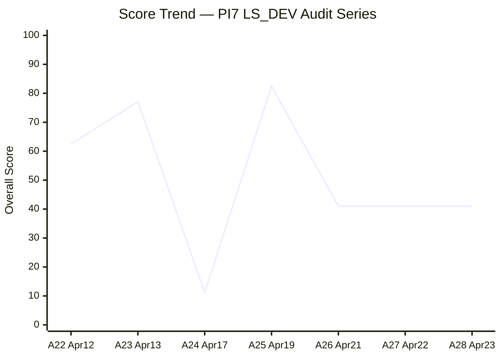
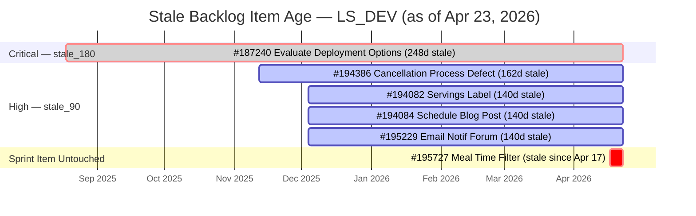

# SAFe Audit Report — Life Style Help App

**Audit A28 | Iteration 7.2 (Apr 20 – May 3, 2026) | Day 4 of 14 (~29% elapsed — early sprint)**

---

## 1. Audit Metadata

| Field | Value |
|---|---|
| **Audit Date** | April 23, 2026, 09:00 PHT |
| **Auditor** | Claude Code (ADO SAFe Audit Agent) |
| **Workspace** | `ado_ls_dev` |
| **ADO Project** | Life Style Help App (`0f447778-7156-4451-ab21-27be3c4a5888`) |
| **Team** | Life Style Help App Team (`a2a805bc-0b30-4ef3-9a8a-b7f3081157a6`) |
| **Iteration** | Iteration 7.2 — Apr 20 to May 3, 2026 |
| **Iteration ID** | `71cd2555-1e1c-4767-8a57-393f87aabe1f` |
| **Sprint Day** | Day 4 of 14 (~29% elapsed — early-sprint annotation applies to DP) |
| **Prior Audit** | AUDIT_20260422_0900.md (A27, Iter 7.2 Day 3, Overall 41.0 — High Risk) |
| **Scoring Model** | ADO SAFe v1 (7-dimension rubric) |
| **Overall Score** | **41.0 / 100** |
| **Risk Band** | **High Risk** (40–59.9) |

> **Evidence note:** All data pulled live from ADO MCP tools on April 23, 2026. Backlog (`wit_list_backlog_work_items`), full work item fields (`wit_get_work_items_batch_by_ids`), iterations (`work_list_team_iterations`), and capacity (`work_get_team_capacity`, `work_get_iteration_capacities`) all executed successfully. No data carryover from prior audits — this is a fresh live pull.

---

## 2. Executive Summary

Life Style Help App enters Day 4 of Iteration 7.2 holding at **41.0 (High Risk)** — unchanged for the **fourth consecutive day** (A26 Day 2 through A28 Day 4). The sprint-opening structural deficiencies identified on Apr 21 remain fully unresolved:

1. **Team capacity is still not configured for Iteration 7.2.** Both `work_get_team_capacity` and `work_get_iteration_capacities` returned errors confirming zero capacity records for this iteration on Day 4. Team Capacity holds at **0.0** — the single largest score suppressor (−14.3 Overall).

2. **Sprint remains at 2 items / 5 SP.** No new items joined Iteration 7.2. #196380 (Default Pinned Post, 3 SP, Samantha Babael) and #195727 (Meal Time Filter Bug, 2 SP, Ike Yana) remain the only committed sprint items. At 2/12 items, Iteration Planning holds at 16.7 — well below the 33%+ target.

3. **#195727 is untouched for 6 consecutive days.** Last changed Apr 17 — 3 days before sprint start. Ike has been in the sprint for 4 business days without logging a single ADO touch. This alone drives the −20 untouched_current Backlog Refinement penalty.

4. **#187240 is now 248 days stale.** The Enabler "[POC] - Evaluate Deployment and Distribution Options" has not been touched since Aug 18, 2025. It continues to anchor the stale_180 penalty and contributes to the stale_90 pool. This is the 12th consecutive audit with no disposition.

**What is going well:** DoR Compliance (100%) and Estimation (100%) remain intact — both sprint items have well-formed Descriptions and Acceptance Criteria, and all Story Points are entered. The team's content quality standard for committed items is strong.

**Critical path to Moderate Risk:** Three actions — all executable today — would lift the score from 41.0 to approximately 60+: (1) configure capacity for Iteration 7.2, (2) touch #195727 in ADO, (3) commit 2–3 additional ready backlog items. The team has demonstrated Low Risk performance (82.4 on Apr 19). Recovery is achievable mid-sprint if action is taken by Day 5.

---

## 3. Previous Audit Delta

| Dimension | A27 — Day 3 (Apr 22) | A28 — Day 4 (Apr 23) | Delta | Change Driver |
|---|---|---|---|---|
| Iteration Planning | 16.7 | **16.7** | 0.0 | No new items committed to 7.2 |
| Team Capacity | 0.0 | **0.0** | 0.0 | Capacity still not configured (live confirmed) |
| Estimation | 100.0 | **100.0** | 0.0 | No change |
| DoR Compliance | 100.0 | **100.0** | 0.0 | No change |
| Work Item Balance | 70.0 | **70.0** | 0.0 | Sprint composition unchanged |
| Backlog Refinement | 0.0 | **0.0** | 0.0 | All three penalties persist |
| Delivery Predictability | 0.0 | **0.0** | 0.0 | Early-sprint; 0 SP closed |
| **Overall** | **41.0** | **41.0** | **0.0** | No ADO changes detected since A27 |

### Key observations since A27 (Apr 22)

- **Zero ADO activity detected.** No work items changed state, received updates, or were re-assigned between the A27 snapshot (Apr 22 09:00) and this audit (Apr 23 09:00). All 12 backlog items retain the same ChangedDate values as A27.
- **#187240 stale age increases to 248 days.** Now within 2 days of the 250-day mark. The longer this item persists without disposition, the more it signals systemic backlog neglect to any future stakeholder review.
- **#195727 untouched for 6 consecutive days.** Now spans 3 days before sprint start + 4 sprint days. This is the longest single-item untouched streak observed for this workspace during PI7.
- **Score trajectory flat for 4 consecutive audits.** A26, A27, and A28 all report 41.0. A plateau at High Risk through the first third of the sprint is a new pattern for this team, which previously recovered quickly in PI7.1.

---

## 4. Current Iteration Snapshot

| Metric | Value |
|---|---|
| **Iteration** | 7.2 — Apr 20 to May 3, 2026 |
| **Iteration Day** | Day 4 of 14 (~29% elapsed) |
| **Visible root backlog items** | 12 |
| **Current iteration root items (7.2)** | **2** |
| **Point-eligible items in sprint** | 2 |
| **Estimated items (SP > 0)** | 2 |
| **Committed Story Points** | **5 SP** |
| **Closed Story Points** | 0 SP (Day 4, early-sprint) |
| **Delivery Predictability** | 0.0 (early-sprint, Day 4 annotation) |
| **Contributors with current work** | 2 (Samantha Babael, Ike Yana) |
| **Team capacity configured for 7.2** | **NONE** (live API confirmed — 4th consecutive day) |
| **Untouched items since sprint start (Apr 20)** | 1/2 = 50% (#195727 — last touched Apr 17) |
| **Fresh items (≤45d, since Mar 9)** | 7 of 12 |
| **Stale items (>90d, before Jan 23)** | 5 of 12 |
| **Stale items (>180d, before Oct 26, 2025)** | 1 of 12 (#187240 — **248 days**) |

### Sprint Item Register — Iteration 7.2 (2 items / 5 SP)

| ID | Title | Type | State | SP | DoR | Assignee | Last Changed | Touched Since Apr 20? |
|---|---|---|---|---|---|---|---|---|
| **196380** | [Low Priority] Default Pinned Post for New Users | User Story | Ready for Dev | 3 | PASS | Samantha Babael | Apr 20, 03:13 UTC | Yes (Day 1) |
| **195727** | [Low priority] Meal time filter don't respond when text in searchbar | User Story | Ready for Dev | 2 | PASS | Ike Yana | **Apr 17, 03:35 UTC** | **No — 6 days stale** |

### Visible Backlog Register — Non-Sprint Items (10 items)

| ID | Type | State | Iteration Path | Assignee | Last Changed | Age (Apr 23) | Band |
|---|---|---|---|---|---|---|---|
| **#187240** | Enabler | New | root | Ike Yana | Aug 18, 2025 | **248d** | stale_180 + stale_90 |
| #187242 | Enabler | Ready for Dev | root | Ike Yana | Apr 13, 2026 | 10d | Fresh |
| #194082 | User Story | Ready for Dev | PI 5 | Sanny Paul Geraldino | Dec 4, 2025 | **140d** | stale_90 |
| #194084 | User Story | Ready for Dev | PI 5 | Sanny Paul Geraldino | Dec 4, 2025 | **140d** | stale_90 |
| #194386 | Defect | Ready for UAT | 4.4 | Sanny Paul Geraldino | Nov 12, 2025 | **162d** | stale_90 |
| #195229 | User Story | Grooming | PI 5 | Ike Yana | Dec 4, 2025 | **140d** | stale_90 |
| #195373 | Enabler | New | 2026-PI6 | Ike Yana | Mar 17, 2026 | 37d | Fresh |
| #195716 | User Story | Ready for Dev | 6.5 | Samantha Babael | Mar 18, 2026 | 36d | Fresh |
| #201334 | Spike | New | 6.5 | Luzmibel Paculanang | Mar 23, 2026 | 31d | Fresh |
| #202789 | Spike | New | 7.6 IP | Carol Cuison | Apr 16, 2026 | 7d | Fresh |

---

## 5. Work Item Analysis

### Sprint Commitment Composition



### Backlog Age Distribution



### Score Plateau — Consecutive Audits at 41.0



> Note: A24 (11.2) is a formula artifact from the sprint-close transition day on Apr 17 as items were de-scoped. A25 (82.4) reflects sprint-close Low Risk on Apr 19. A26–A28 reflect sprint-open High Risk plateau.

### Audit-to-Audit Delta Visualization

```mermaid
bar
    title Dimension Scores — A27 vs A28 (Apr 22 → Apr 23)
    x-axis [IP, TC, Est, DoR, WIB, BR, DP]
    y-axis 0 --> 100
    "A27 Apr 22" [16.7, 0.0, 100.0, 100.0, 70.0, 0.0, 0.0]
    "A28 Apr 23" [16.7, 0.0, 100.0, 100.0, 70.0, 0.0, 0.0]
```

### Stale Item Age Timeline



---

## 6. SAFe Compliance Scorecard

| Dimension | Score | Evidence | Notes |
|---|---|---|---|
| Iteration Planning | **16.7** | 2 of 12 visible root items assigned to Iter 7.2 | Sprint under-scoped; 10 items remain outside sprint after 4 days |
| Team Capacity | **0.0** | `work_get_team_capacity` and `work_get_iteration_capacities` both returned errors — zero capacity records for Iter 7.2 (live Day 4 confirmation) | 4th consecutive day without capacity configuration |
| Estimation | **100.0** | 2/2 point-eligible sprint items have SP > 0: #196380 = 3 SP, #195727 = 2 SP | Clean; no action required |
| DoR Compliance | **100.0** | 2/2 sprint items pass: Description ≥30 nws chars AND AC ≥20 nws chars (both verified against live ADO fields) | Both items meet DoR standard enforced by workspace CLAUDE.md |
| Work Item Balance | **70.0** | 2 User Stories = 100% dominant type (>60% → −30); has User Story → no −40; spike_share = 0/2 = 0% → no −20; result = 100 − 30 | Structural penalty from small sprint size; recovers only if sprint expands to 5+ items with ≤ 3 User Stories |
| Backlog Refinement | **0.0** | base = 58.3 (7/12 fresh); stale_90: 5/12=41.7% > 25% → −20; stale_180: 1 item (#187240, 248d) → −20; untouched_current: 1/2=50% > 30% → −20; total = 58.3 − 60 = −1.7 → max(0) = 0.0 | All three penalty gates active simultaneously for Day 4 |
| Delivery Predictability | **0.0** | 0 SP closed / 5 SP committed — *early-sprint (Day 4 of 14, ~29% elapsed)* | No formula adjustment; annotated as early-sprint |
| **Overall Score** | **41.0** | (16.7 + 0.0 + 100.0 + 100.0 + 70.0 + 0.0 + 0.0) / 7 = 286.7 / 7 = 40.957 → **41.0** | **High Risk** (40–59.9) |

### Score Computation Detail

```
Iteration Planning      = round(2 / 12 × 100, 1)          = 16.7
Team Capacity           = round(0 / 2 × 100, 1)           = 0.0
                          (contributors_with_capacity = 0 — live API confirmed;
                           contributors_with_current_work = 2: Samantha, Ike)
Estimation              = round(2 / 2 × 100, 1)           = 100.0
DoR Compliance          = round(2 / 2 × 100, 1)           = 100.0

Work Item Balance:
  has_user_story        = True (#196380, #195727)          → no −40 penalty
  dominant_type_share   = 2/2 = 100% > 60%                → −30
  spike_share           = 0/2 = 0%                        → no −20
  result                = 100 − 30                        = 70.0

Backlog Refinement:
  fresh_visible         = 7 items (≤45d: #187242, #195373, #195716, #201334,
                                        #195727, #196380, #202789)
  base                  = round(7/12 × 100, 1)            = 58.3
  stale_90_count        = 5 (#187240, #194082, #194084, #194386, #195229)
  stale_90_share        = 5/12 = 41.7% > 25%              → −20
  stale_180_count       = 1 (#187240, 248d)               → −20
  untouched_current     = 1 (#195727, ChangedDate Apr 17 < sprint start Apr 20)
  untouched_share       = 1/2 = 50% > 30%                 → −20
  result                = 58.3 − 60 = −1.7 → max(0)      = 0.0

Delivery Predictability = round(0 / 5 × 100, 1)           = 0.0
                          [Day 4 of 14 → early-sprint annotation; no adjustment]

Overall = round((16.7 + 0.0 + 100.0 + 100.0 + 70.0 + 0.0 + 0.0) / 7, 1)
        = round(286.7 / 7, 1)
        = round(40.957, 1)
        = 41.0  →  High Risk
```

---

## 7. Dimension Findings

### 7.1 Iteration Planning — 16.7 (High Risk — severely under-scoped)

2 of 12 visible root backlog items are committed to Iteration 7.2. The sprint has now run 4 full days without a planning ceremony producing new commitments. This is the **fourth consecutive audit** (A25 sprint-close → A26, A27, A28 sprint-open) showing the 7.2 scope deficit.

**Comparison to 7.1:** Iteration 7.1 closed with 7 items committed (7/12 = 58.3%). Iteration 7.2 opened with 2 items and has not added any through Day 4. Sprint output capacity relative to 7.1 is at ~29% utilization.

**Recovery paths:**
- Commit 2 items → IP = 4/12 = 33.3 (+2.4 Overall)
- Commit 4 items → IP = 6/12 = 50.0 (+4.8 Overall)
- Best candidates ready-to-commit: #195716 (Hide recipe card fields, 2 SP, Ready for Dev, Samantha), #201334 (Collaboration Spike, New, Luzmibel), #202789 (CSAT Survey Spike, New, Carol)
- Note: #201334 and #202789 are Spikes — committing them also diversifies type mix, though dominant_type_share penalty only clears at ≤60% User Story composition

### 7.2 Team Capacity — 0.0 (Critical — no capacity configured, Day 4)

Live ADO API confirms zero capacity configured for Iteration 7.2 on Day 4. Both capacity endpoints (`work_get_team_capacity` for the team scope and `work_get_iteration_capacities` for all teams) returned errors. This has been the case since sprint start.

**Historical context:** In Iteration 7.1, the team had capacity configured: Samantha 1h/day Development, Luzmibel 1h/day Testing, Ike 1h/day Development. Cloning this configuration into 7.2 requires approximately 5 minutes in ADO. Failing to do so for 4 days is purely an administrative gap.

**Score impact if fixed today:** Team Capacity: 0.0 → 100.0 (if all 2 assignees have capacity), lifting Overall from 41.0 → 55.3 (+14.3). Combined with touching #195727 (removes untouched penalty, +2.9) and committing 2 items (+2.4), Overall could reach ~60.6 — crossing into Moderate Risk.

**Day 5 deadline note:** If capacity is not configured by end of Day 5 (Apr 24), the team will have spent more than 35% of the sprint without a capacity plan. Per SAFe, capacity planning is a sprint-opening ceremony prerequisite, not an optional artifact.

### 7.3 Estimation — 100.0 (Low Risk)

Both sprint items are fully estimated. #196380 = 3 SP, #195727 = 2 SP. Total committed = 5 SP. No change from A26/A27. Any new items committed to the sprint must receive SP before the next audit to preserve this score.

### 7.4 DoR Compliance — 100.0 (Low Risk)

Live ADO data confirms both sprint items meet DoR:
- **#196380 Default Pinned Post** — As-a/I-want/So-that Description with scenario context and system behavior detail (well over 30 nws chars); AC contains 6 checkbox acceptance criteria covering admin config, auto-pin, feed ordering, unpin permission, update propagation, and existing-user non-impact (well over 20 nws chars). **PASS.**
- **#195727 Meal Time Filter Bug** — Description contains numbered repro steps, actual result text, and screen recording link (well over 30 nws chars); AC contains expected behavior statement (clear and ≥20 nws chars). **PASS.**

**Enforcement reminder (workspace CLAUDE.md):** Any new items entering the sprint must be DoR-verified before commitment. #195716 (Hide recipe card fields) has an image-embedded description — the description text may be minimal; DoR check required before committing.

### 7.5 Work Item Balance — 70.0 (Moderate — structural type penalty)

2 User Stories out of 2 sprint items = 100% dominant type share (> 60% threshold → −30). No Spikes or Defects in the sprint. Score = 100 − 30 = 70.0.

This penalty is structural at a 2-item sprint. To fully remove it, the sprint needs ≥ 5 items with User Stories ≤ 3 (≤60%). A 3-item sprint with 2 US + 1 Spike still triggers the penalty at 67% dominant. The Work Item Balance penalty is secondary to fixing Team Capacity and Backlog Refinement — but adding Spikes (#201334, #202789) to the sprint provides collateral benefit.

**Note on #202789 (CSAT Survey Spike):** This item is assigned to Carol Cuison and iteration-pathed to 7.6 IP. If moved to 7.2, it would also expand team contributors with work and potentially trigger a Team Capacity assessment for Carol (if capacity is then configured including Carol).

### 7.6 Backlog Refinement — 0.0 (Critical — triple penalty, Day 4)

All three penalty gates remain simultaneously active for the fourth day. The base score of 58.3 is erased by a combined −60 penalty:

| Penalty Gate | Threshold | Current Value | Status | Recovery Action |
|---|---|---|---|---|
| stale_90 share > 25% | >25% → −20 | 5/12 = 41.7% | **TRIGGERED** | Close/triage ≥ 3 stale items |
| stale_180 count ≥ 1 | ≥1 → −20 | 1 (#187240, 248d) | **TRIGGERED** | Dispose #187240 |
| untouched_current > 30% | >30% → −20 | 1/2 = 50% | **TRIGGERED** | Touch #195727 in ADO today |

**Critical escalation — #187240:** This item (248 days since last touch, root iteration path, never progressed from "New") has been flagged in 12 consecutive audits. At 248 days, it now qualifies as abandoned infrastructure research — the team committed to evaluate mobile deployment options in PI5 and has carried this open ever since. This is a compliance debt item.

**Fastest single action:** A comment or state change on #195727 by Ike today (5-minute action) removes the untouched_current −20 penalty. If also combined with #187240 disposition (removing stale_180 −20), Backlog Refinement lifts from 0.0 to: base 58.3 − stale_90 20 = **38.3**. Combined with Team Capacity fix, Overall rises from 41.0 to ~52.8.

**Full recovery scenario:** With all three penalties cleared (dispose #187240, close 3 stale_90 items, touch #195727), Backlog Refinement = ~58.3 − 0 = 58.3, and Overall = round((16.7+100+100+100+70+58.3+0)/7, 1) = round(445/7, 1) ≈ **63.6 (Moderate Risk)** — even without capacity and delivery.

### 7.7 Delivery Predictability — 0.0 (early-sprint — low delivery expected)

0 SP closed / 5 SP committed = 0.0. Day 4 of 14 (29% elapsed). The rubric early-sprint annotation applies — this is normal and expected at Day 4. No formula adjustment.

**Velocity projection:** Iteration 7.1 closed at 10 SP delivered (100% DP). If the team maintains similar velocity in 7.2 with 5 SP committed, 100% DP is achievable by sprint close. The concern is not delivery pace but sprint under-scoping: 5 SP committed vs. 10 SP in 7.1 means the team is running at 50% of prior sprint velocity.

**Remaining sprint time:** 10 days remain (Apr 24 – May 3, 2026). If capacity is entered and items start moving through "In Progress" → "Closed," the DP score will begin contributing positively from Day 6–7 onward.

---

## 8. Risks and Bottlenecks

| # | Risk | Severity | Owner | Status vs A27 |
|---|---|---|---|---|
| R1 | **No team capacity configured for Iter 7.2** — drives TC = 0.0, suppresses Overall by −14.3 points. Now Day 4 — 4 business days without capacity. | **CRITICAL** | Ramon / Team Lead | Unresolved — Day 4 (escalated) |
| R2 | **#187240 "Evaluate Deployment Options" Enabler — 248 days stale** — 12th consecutive audit with no change. Single most persistent unresolved item in this workspace across all PI7 audits. | **HIGH** | Ike Yana | Unresolved — Day 248 |
| R3 | **Sprint under-scoped at 2 items / 5 SP** — 4 days into sprint with no planning ceremony results. Iteration Planning locked at 16.7. | **HIGH** | Team Lead / Ramon | Unresolved — Day 4 |
| R4 | **#195727 untouched for 6 days** (since Apr 17 — 3 days pre-sprint, 4 sprint days). Drives −20 untouched_current penalty. Ike has had 4 sprint days to log any ADO activity. | **HIGH** | Ike Yana | Escalated from Moderate (A27) → High (A28) |
| R5 | **4 PI5 items stale >140 days** (#194082, #194084, #195229, #194386) — no triage across 12 consecutive audits. Stale_90 share at 41.7% drives −20 penalty. | **MODERATE** | Team Lead / PO | Unresolved |
| R6 | **No 7.2 sprint planning ceremony evidence** — 4 days into sprint, 2 pre-existing items only, no sprint goal, no new commitments. | **HIGH** | Ramon / Team Lead | Unresolved — escalated from Day 3 |
| R7 | **Luzmibel Paculanang — 4th consecutive sprint day with no sprint-visible assignment.** 1h/day QA capacity expected but not utilized in any current sprint item. | **MODERATE** | Samantha / Team Lead | Unresolved |
| R8 | **Score plateau risk — 41.0 for 4 consecutive audits (A26–A28).** If no remediation by Day 5 (Apr 24), the team will be in the second tercile of the sprint without any score improvement. Pattern suggests process breakdown rather than schedule pressure. | **HIGH** | Ramon | New — escalated to High |
| R9 | **Samantha Babael concentration risk** — 60% of sprint SP (3/5) on one person. Workspace CLAUDE.md flags this explicitly. | **LOW-MODERATE** | Ramon | Structural |
| R10 | **#195373 (PI6 Perf Optimization Enabler) approaching 45-day fresh boundary** — currently 37 days old (Mar 17). Will cross into watch zone in 8 days (May 1). If untouched by May 2, drops out of "fresh" cohort. | **INFO** | Ike Yana | Monitor |

---

## 9. Prioritized Recommendations

### P0 — Today (Apr 23)

**1. Configure team capacity for Iteration 7.2** *(Est. 5 minutes)*
In ADO → Team Settings → Iterations → Iteration 7.2 → Capacity. Enter: Samantha Babael 1h/day Development, Ike Yana 1h/day Development, Luzmibel Paculanang 1h/day Testing. Clone from 7.1 if available. Impact: Team Capacity 0.0 → 100.0; Overall 41.0 → **55.3** (+14.3). This is the single highest-leverage action available.

**2. Ike — touch #195727 in ADO today** *(Est. 2 minutes)*
Add any comment, progress note, or state update to #195727. Even a "investigating" note moves ChangedDate to Apr 23, clearing the untouched_current penalty (1/2=50% → 0/2=0%). Impact: Backlog Refinement partial recovery; removes −20 untouched penalty. Combined with action #1: Overall → ~58.2 (approaching Moderate boundary).

**3. Hold a sprint planning / backlog commitment session** *(Est. 30–60 minutes)*
Define an Iteration 7.2 sprint goal and commit 2–4 additional items. Recommended additions:
- #195716 (Hide recipe card fields, 2 SP, Ready for Dev, Samantha) — verify DoR on live description before committing
- #201334 (Collaboration Spike, Luzmibel) — also resolves Luzmibel utilization gap and improves type diversity
- #202789 (CSAT Survey Spike, Carol) — already in 7.6 IP; reschedule to 7.2 if work is ready
Committing 2 items: IP = 4/12 = 33.3 (+2.4); 3 items: IP = 5/12 = 41.7 (+3.6).

### P0 — This Week (Apr 23–25)

**4. Dispose #187240 "Evaluate Deployment Options" Enabler** *(Est. 1–2 hours — Ike)*
This 248-day item requires one of: (a) perform the POC and close with findings, (b) mark as "Won't Fix / Superseded" and close, (c) re-path to a specific future iteration with an owner committed to deliver. Any disposition removes the stale_180 −20 Backlog Refinement penalty and reduces the stale_90 pool from 5 → 4 (still 4/12 = 33.3% > 25%, so stale_90 penalty persists until ≥ 2 more items close). Impact: +2.9 Overall when stale_180 penalty clears.

**5. Assign Luzmibel a sprint-visible task** *(Est. 10 minutes)*
Assign #201334 (Collaboration Spike) to Iteration 7.2 or create QA child tasks under #196380/#195727 assigned to Luzmibel. This resolves her 4-sprint utilization gap and contributes to Work Item Balance when added to sprint.

### P1 — This Week

**6. Triage 4 PI5 stale items** (#194082 Servings Label, #194084 Schedule Blog Post, #195229 Forum Email Notif, #194386 Cancellation Defect). Required disposition per item: commit to current PI7 sprint, re-path to PI8, or close. Closing ≥ 3 of 5 stale_90 items reduces stale_90 share from 41.7% to ≤ 25%, removing the −20 stale_90 penalty (+2.9 Overall). Note: #194082, #194084, #195229 are all assigned to Sanny Paul Geraldino — coordinate as a batch triage.

**7. Establish an Iteration 7.2 sprint goal statement.** Record it in the Iteration description field in ADO. SAFe requires a sprint goal. Its absence means the team has no shared quality bar for what constitutes a successful sprint.

### P2 — This Iteration

**8. Re-balance sprint ownership.** After adding items, target: Samantha ≤ 50% of sprint SP. If #195716 (2 SP) is added and re-assigned to Ike, balance becomes: Samantha 3 SP (43%), Ike 4 SP (57%) — closer to balanced. With Luzmibel carrying QA coverage, this also reduces the R9 concentration risk.

**9. Establish a weekly backlog grooming cadence.** The 5-item stale_90 cohort has persisted for 12 consecutive audits. A weekly 30-minute PO + Team Lead grooming slot to triage 2–3 backlog items would systematically eliminate stale debt and keep Backlog Refinement above 60 in future iterations.

---

## 10. Evidence Gaps and Limitations

| Gap | Impact | Severity |
|---|---|---|
| **All work item data is live from today's ADO pull** | No carryover from prior audits. ChangedDate ages computed against Apr 23, 2026 audit date. Evidence is current as of API call time. | N/A — no gap |
| **Team capacity confirmed zero via two endpoints** | `work_get_team_capacity` (team-scoped) and `work_get_iteration_capacities` (project-scoped) both returned errors. Contributor count (Samantha, Ike) derived from sprint item assignments. `contributors_with_capacity = 0` is definitive. | None — confirmed |
| **#196380 ChangedDate Apr 20 03:13 UTC** | Sprint start is Apr 20 00:00 UTC. Item was changed at 03:13 on the same day — technically "after start." Treated as **touched** in this audit (ChangedDate ≥ Apr 20 00:00 UTC). | Low — boundary case handled consistently |
| **Luzmibel Paculanang's actual QA workload unknown** | Luzmibel may be delivering QA review work via child tasks not visible in the Stories and Deliverables root backlog. The API returns root-level items only per skill scope rules. Her effective utilization cannot be fully assessed from this audit layer. | Low |
| **#195716 DoR status unverified for sprint commitment** | This item (Hide recipe card fields, 2 SP) is recommended for sprint commitment but contains an image-embedded description in ADO. The text component may not meet the 30-nws-char Description threshold independently of the image. Pre-commitment DoR check required. | Low — advisory only |
| **Delivery Predictability early-sprint caveat** | At Day 4 (29% elapsed), 0 closed SP is normal. The score of 0.0 is not indicative of delivery failure — it is an expected early-sprint reading. DP will become a meaningful signal from Day 7 onward. | Info |
| **Sprint goal not observable via API** | Whether a sprint goal was defined and recorded in the Iteration description field in ADO is not surfaced by the current audit toolset. Absence of sprint goal is noted as a SAFe compliance gap but cannot be confirmed via API alone. | Low |

---

## 11. Score Trend — PI7 Life Style Help App (Full Series)

| Audit | Date | Sprint Day | Iteration | Overall | Band |
|---|---|---|---|---|---|
| A22 | Apr 12 | 7 | 7.1 | 62.5 | Moderate |
| A23 | Apr 13 | 8 | 7.1 | 77.1 | Moderate |
| A24 | Apr 17 | 12 | 7.1 | 11.2 | Critical *(sprint-close artifact)* |
| A25 | Apr 19 | 14 | 7.1 close | **82.4** | **Low Risk** |
| A26 | Apr 21 | 2 | 7.2 open | 41.0 | High Risk |
| A27 | Apr 22 | 3 | 7.2 | 41.0 | High Risk |
| **A28** | **Apr 23** | **4** | **7.2** | **41.0** | **High Risk** |

> **Pattern:** The 41.4-point collapse from sprint close (A25: 82.4) to sprint open (A26/A27/A28: 41.0) is driven entirely by four structural conditions — capacity not configured, sprint under-planned, untouched item, and persistent stale backlog. All four are remediable with < 2 hours of administrative effort. The team has demonstrated Low Risk performance (82.4) as recently as Apr 19. Recovery to Moderate Risk (≥60) requires P0 actions by Day 5 (Apr 24) to break the 4-audit plateau.

---

*Report generated: 2026-04-23 09:00 PHT | Audit A28 | ado_ls_dev*
*Day 4 of 14 — Iter 7.2 — Overall: 41.0 / 100 — High Risk*
*Data source: Live ADO MCP pull — Apr 23, 2026 | All 12 backlog items fresh from API*
