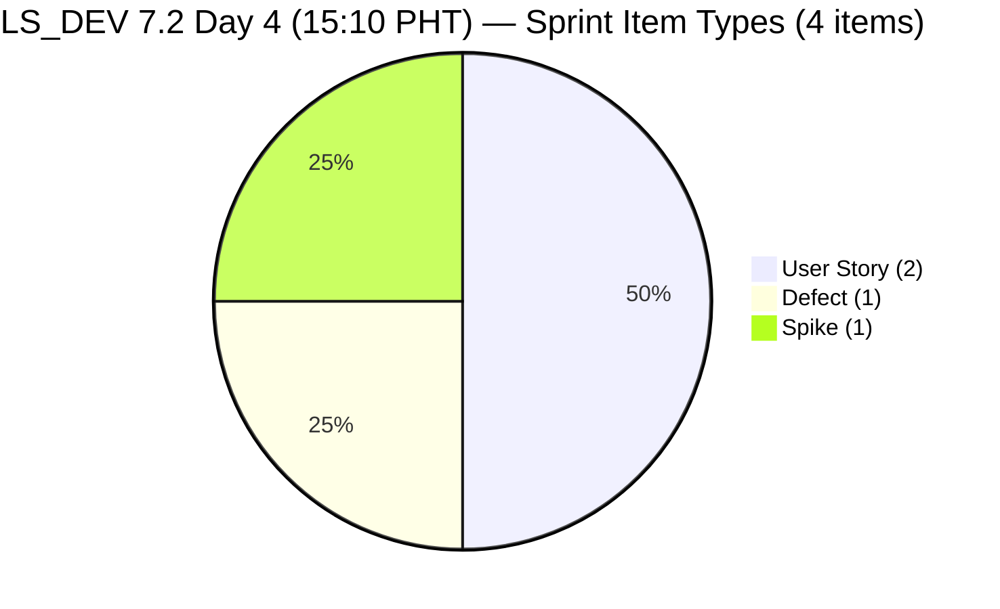
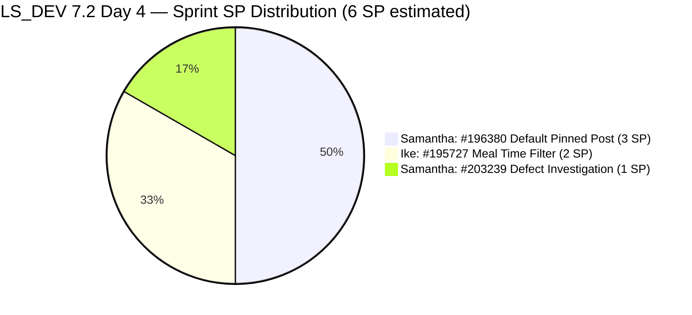
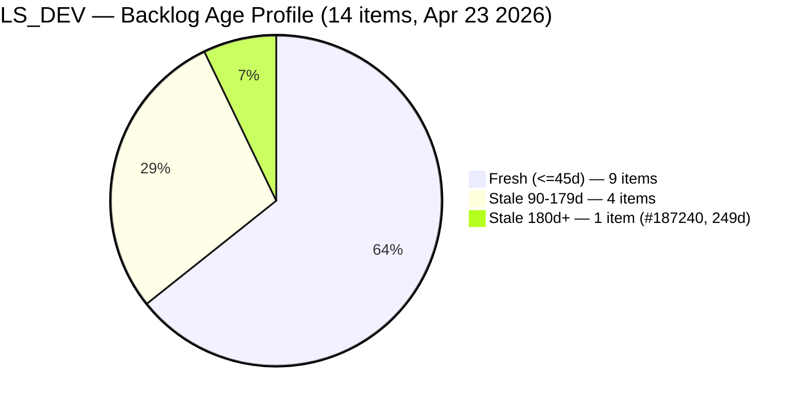
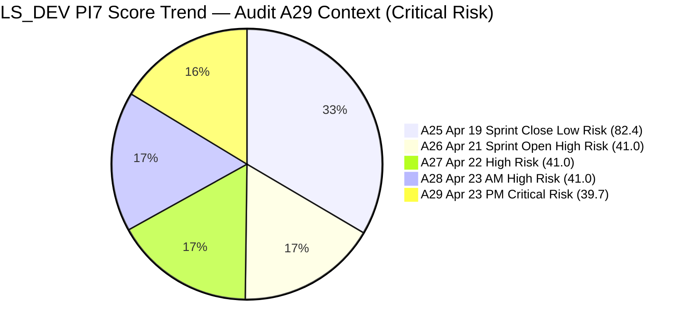

# SAFe Audit Report — Life Style Help App

**Audit A29 | Iteration 7.2 (Apr 20 – May 3, 2026) | Day 4 of 14 (~29% elapsed — early sprint)**

---

## 1. Audit Metadata

| Field | Value |
|---|---|
| **Audit Date** | April 23, 2026, 15:10 PHT |
| **Auditor** | Claude Code (ADO SAFe Audit Agent) |
| **Workspace** | `ado_ls_dev` |
| **ADO Project** | Life Style Help App (`0f447778-7156-4451-ab21-27be3c4a5888`) |
| **Team** | Life Style Help App Team (`a2a805bc-0b30-4ef3-9a8a-b7f3081157a6`) |
| **Iteration** | Iteration 7.2 — Apr 20 to May 3, 2026 |
| **Iteration ID** | `71cd2555-1e1c-4767-8a57-393f87aabe1f` |
| **Sprint Day** | Day 4 of 14 (~29% elapsed — early-sprint annotation applies to DP) |
| **Prior Audit** | AUDIT_20260423_0900.md (A28, Iter 7.2 Day 4, Overall 41.0 — High Risk) |
| **Scoring Model** | ADO SAFe v1 (7-dimension rubric) |
| **Overall Score** | **39.7 / 100** |
| **Risk Band** | **Critical Risk** (< 40) |

> **Score alert:** This audit records the first **Critical Risk** band for the Life Style Help App workspace in PI7. The drop from High Risk (41.0 in A28) to Critical Risk (39.7) is driven by two new DoR-failing items added to the sprint without descriptions or acceptance criteria, plus one unestimated Spike. All regressions are immediately recoverable with a single focused remediation session.

---

## 2. Executive Summary

Life Style Help App has crossed into **Critical Risk (39.7)** — down −1.3 from Audit A28 (41.0, High Risk). This is the first Critical band score for this workspace in PI7 and represents a significant escalation from the sprint-open plateau.

**What changed since A28 (09:00 PHT):**

Two new work items were added to Iteration 7.2:
- **#203239** (Defect, "Investigate member emilienaess97@gmail.com", 1 SP, Samantha, Active) — Description is image-only (0 text chars), no Acceptance Criteria → **DoR FAIL**
- **#203247** (Spike, "7.2 Collaborations/Check Heges Raised Issues/Replicate", no SP, Luzmibel, New) — no Description, no AC → **DoR FAIL**, **no Story Points**

These items enter the sprint without meeting the Definition of Ready required by the workspace CLAUDE.md and the SAFe skill rubric. Their addition produces:
- **DoR Compliance: 100.0 → 50.0 (−50.0)**
- **Estimation: 100.0 → 75.0 (−25.0)**
- **Work Item Balance: 70.0 → 100.0 (+30.0)** — the type diversity (now 2 US + 1 Defect + 1 Spike) removes the structural penalty
- **Backlog Refinement: 0.0 → 24.3 (+24.3)** — 2 new items expand denominator and untouched-current ratio drops from 1/2=50% to 1/4=25% (below the >30% penalty threshold)
- **Iteration Planning: 16.7 → 28.6 (+11.9)** — sprint now has 4 items; backlog at 14

**Positive signals:** Sprint is growing (+2 items, now 4), Luzmibel finally has a sprint assignment after 4 idle sprint days, and Samantha is active on #203239 (state: Active). The team is clearly engaged mid-Day 4.

**Critical persisting issue:** Team capacity is **still not configured** for Iteration 7.2 (Day 4, confirmed via ADO API). This single gap continues to suppress Overall by −14.3 points and represents the fastest available recovery lever.

**Path to recovery:** Fixing DoR on #203239 and #203247, estimating #203247, and configuring capacity today would recover ~70+ points toward Low Risk territory. See Section 9 for the full remediation scenario.

---

## 3. Previous Audit Delta

| Dimension | A28 — Day 4 09:00 PHT | A29 — Day 4 15:10 PHT | Delta | Change Driver |
|---|---|---|---|---|
| Iteration Planning | 16.7 | **28.6** | **+11.9** | 2 new items in 7.2 + 2 in backlog: 4/14 vs 2/12 |
| Team Capacity | 0.0 | **0.0** | 0.0 | Capacity still not configured — 5th consecutive half-day |
| Estimation | 100.0 | **75.0** | **−25.0** | #203247 (Spike) has no SP: 3/4 estimated |
| DoR Compliance | 100.0 | **50.0** | **−50.0** | #203239 (image-only Desc, no AC) + #203247 (no Desc, no AC) both FAIL |
| Work Item Balance | 70.0 | **100.0** | **+30.0** | Type mix: 2 US + 1 Defect + 1 Spike; US share = 50% ≤ 60% → no -30 |
| Backlog Refinement | 0.0 | **24.3** | **+24.3** | Untouched ratio drops to 1/4=25% (below >30% threshold); base improves to 64.3 |
| Delivery Predictability | 0.0 | **0.0** | 0.0 | Early-sprint; 0 SP closed (unchanged) |
| **Overall** | **41.0** | **39.7** | **−1.3** | **Critical Risk** (< 40) — DoR/Estimation regressions outweigh balance/refinement gains |

### Score Computation Summary

```
Sum A28 = 286.7  (16.7 + 0.0 + 100.0 + 100.0 + 70.0 + 0.0 + 0.0)
Sum A29 = 277.9  (+11.9 IP  +0.0 TC  −25.0 Est  −50.0 DoR  +30.0 WIB  +24.3 BR  +0.0 DP)
Overall = round(277.9 / 7, 1) = round(39.843, 1) = 39.7 → Critical Risk
```

### ADO Activity Since A28 (09:00–15:10 PHT)

| Item | Activity | Time |
|---|---|---|
| #203239 | **NEW** — Defect added to Iter 7.2; moved to Active | Apr 23 03:36 UTC |
| #203247 | **NEW** — Spike added to Iter 7.2 | Apr 23 05:12 UTC |
| #195727 | No change — still untouched since Apr 17 | — |
| #196380 | No change — still Active since Apr 20 | — |
| Capacity | No change — still not configured | — |

---

## 4. Current Iteration Snapshot

| Metric | Value |
|---|---|
| **Iteration** | 7.2 — Apr 20 to May 3, 2026 |
| **Iteration Day** | Day 4 of 14 (~29% elapsed) |
| **Visible root backlog items** | **14** (+2 vs A28: #203239, #203247) |
| **Current iteration root items (7.2)** | **4** (+2 vs A28) |
| **Point-eligible items in sprint** | 4 |
| **Estimated items (SP > 0)** | **3** (#196380=3SP, #195727=2SP, #203239=1SP) |
| **Committed Story Points** | **6 SP** (+1 vs A28: #203239 adds 1SP; #203247 unestimated) |
| **Closed Story Points** | 0 SP (early-sprint) |
| **Delivery Predictability** | 0.0 (early-sprint, Day 4) |
| **Contributors with current work** | **3** (Samantha Babael, Ike Yana, Luzmibel Paculanang) |
| **Team capacity configured for 7.2** | **NONE** (API error confirmed — Day 4) |
| **Untouched items since sprint start** | 1/4 = 25% (#195727 — Apr 17) |
| **Fresh items (≤45d, since Mar 9)** | 9 of 14 |
| **Stale items (>90d, before Jan 23)** | 5 of 14 (#187240, #194082, #194084, #194386, #195229) |
| **Stale items (>180d, before Oct 26, 2025)** | 1 of 14 (#187240 — **249 days**) |

### Sprint Item Register — Iteration 7.2 (4 items / 6 SP committed)

| ID | Title | Type | State | SP | DoR | Assignee | Last Changed | Notes |
|---|---|---|---|---|---|---|---|---|
| **196380** | Default Pinned Post for New Users | User Story | Ready for Dev | 3 | **PASS** | Samantha Babael | Apr 20 | Active sprint |
| **195727** | Meal time filter doesn't respond with text in search bar | User Story | Ready for Dev | 2 | **PASS** | Ike Yana | **Apr 17** | **Untouched — pre-sprint** |
| **203239** | Investigate member emilienaess97@gmail.com | Defect | **Active** | 1 | **FAIL** (image-only Desc; no AC) | Samantha Babael | Apr 23 03:36 | New today — Active already |
| **203247** | 7.2 Collaborations/Check Heges Raised Issues/Replicate | Spike | New | **—** | **FAIL** (no Desc; no AC) | Luzmibel Paculanang | Apr 23 05:12 | New today — no SP |

---

## 5. Work Item Analysis

### Sprint Type Distribution — Day 4



### Sprint SP Distribution — Day 4



### Backlog Age Distribution



### Score Trend — PI7 Audit Series



---

## 6. SAFe Compliance Scorecard

| Dimension | Score | Evidence | Notes |
|---|---|---|---|
| Iteration Planning | **28.6** | 4 / 14 visible root items in Iter 7.2 | +11.9 vs A28; 10 items still outside sprint |
| Team Capacity | **0.0** | `work_get_team_capacity` returned error — zero configured records for Iter 7.2 | Day 4, still unconfigured; all 3 contributors have 0 capacity → 0/3 = 0.0 |
| Estimation | **75.0** | 3 / 4 point-eligible items have SP > 0; #203247 (Spike) has no SP | New gap from A28 (100.0 → 75.0); fix: add SP to #203247 |
| DoR Compliance | **50.0** | 2 / 4 items pass Desc ≥ 30 nws + AC ≥ 20 nws | PASS: #196380, #195727; FAIL: #203239 (image-only; no AC), #203247 (no Desc; no AC) |
| Work Item Balance | **100.0** | User Story present; US = 50% (≤ 60%); Spike = 25% (≤ 40%); Defect contributes type diversity | First WIB 100.0 since sprint open (was 70.0 in A26/A27/A28 due to 100% US share) |
| Backlog Refinement | **24.3** | fresh=9/14=64.3 (base); stale_90 5/14=35.7% → -20; stale_180 1 item → -20; untouched_current 1/4=25% (NOT > 30%) → no penalty | +24.3 vs A28; untouched penalty removed due to 4-item denominator |
| Delivery Predictability | **0.0** | 0 SP closed / 6 SP committed — *early-sprint (Day 4 of 14)* | No formula adjustment; annotated as early-sprint |
| **Overall Score** | **39.7** | (28.6 + 0.0 + 75.0 + 50.0 + 100.0 + 24.3 + 0.0) / 7 = 277.9 / 7 | **Critical Risk** (< 40) |

### Score Computation Detail

```
1. Iteration Planning
   visible_root_backlog_items          = 14
   current_iteration_root_items (7.2)  = 4
   Score = round(4 / 14 × 100, 1)     = round(28.571, 1) = 28.6

2. Team Capacity
   contributors_with_current_work      = 3  (Samantha, Ike, Luzmibel)
   contributors_with_capacity          = 0  (API error — zero configured)
   Score = round(0 / 3 × 100, 1)       = 0.0

3. Estimation
   point_eligible_current_items        = 4
   estimated_current_items (SP > 0)    = 3  (#196380=3SP, #195727=2SP, #203239=1SP)
   #203247 has no SP field             → not estimated
   Score = round(3 / 4 × 100, 1)       = 75.0

4. DoR Compliance
   current_iteration_root_items        = 4
   dor_compliant_current_items         = 2  (#196380 PASS, #195727 PASS)
   #203239 FAIL  (Desc = image-only = 0 nws; AC = absent = 0 nws)
   #203247 FAIL  (Desc = absent = 0 nws; AC = absent = 0 nws)
   Score = round(2 / 4 × 100, 1)       = 50.0

5. Work Item Balance
   User Story present?                 = Yes (#196380, #195727)   → no -40
   dominant_type_share (US)            = 2/4 = 50.0%  → NOT > 60% → no -30
   spike_share                         = 1/4 = 25.0%  → NOT > 40% → no -20
   Score = max(0, 100 - 0)            = 100.0

6. Backlog Refinement
   fresh_visible_root_items (≥ Mar 9)  = 9 of 14 = 64.3%   → base = 64.3
   stale_90 (< Jan 23, 2026)          = 5 of 14 = 35.7%   → >25% → -20
   stale_180 (< Oct 26, 2025)         = 1 (#187240, 249d)  → ≥1 → -20
   untouched_current (< Apr 20, 2026) = 1/4 = 25.0%       → NOT > 30% → 0
   Score = max(0, 64.3 - 20 - 20)    = max(0, 24.3) = 24.3

7. Delivery Predictability
   committed_story_points              = 6  (3+2+1 from estimated items)
   closed_story_points                 = 0
   Score = round(0 / 6 × 100, 1)       = 0.0
   [Day 4 of 14 → "early-sprint — low delivery expected"]

Overall = round((28.6 + 0.0 + 75.0 + 50.0 + 100.0 + 24.3 + 0.0) / 7, 1)
        = round(277.9 / 7, 1)
        = round(39.843, 1)
        = 39.7  →  CRITICAL RISK (< 40)
```

---

## 7. Dimension Findings

### 7.1 Iteration Planning — 28.6 (High Risk, improved +11.9)

4 of 14 visible root backlog items are in Iteration 7.2. Sprint scope has grown from 2 to 4 items — a positive development on the right trajectory. However, the sprint still represents only 28.6% of the visible backlog assigned to the current iteration. The 10 non-sprint items continue to inflate the denominator.

**Comparison to PI7 context:** Iteration 7.1 closed with 7 items committed (7/14 = 50% approximately). The team needs to commit approximately 3 more items to achieve parity with 7.1's planning intensity.

**Good candidates for commitment:**
- #195716 (Hide recipe card fields, 2 SP, Ready for Dev, Samantha) — DoR-verified PASS, ready to move
- #187242 (Assess Mobile Performance Enabler, Ike) — fresh, DoR PASS, would complement the sprint theme

### 7.2 Team Capacity — 0.0 (Critical — no capacity configured, Day 4)

Team capacity remains at zero configured records for Iteration 7.2. Live API confirmation: `work_get_team_capacity` returned an error for the fifth consecutive audit period. Three contributors now have current work (Samantha, Ike, Luzmibel) — none have configured capacity.

**Score impact:** Fixing capacity today lifts Team Capacity from 0.0 → 100.0, adding +14.3 to Overall. Combined with DoR and Estimation fixes, the team could break out of Critical Risk within a single remediation session.

**Historical note:** In PI7.1, the team eventually configured capacity and achieved 82.4 (Low Risk) on Apr 19. The infrastructure for configuration exists — the gap is administrative follow-through.

### 7.3 Estimation — 75.0 (Regression from 100.0)

3 of 4 sprint items are estimated. The gap is #203247 (Spike — "7.2 Collaborations/Check Heges Raised Issues") which was added without Story Points. This is a first for the workspace in PI7.2 — prior audits had 100% estimation.

Assigning SP to #203247 restores Estimation to 100.0. The Spike work appears to be a QA collaboration/replication task — a 1 or 2 SP estimate would be appropriate given the exploratory nature.

### 7.4 DoR Compliance — 50.0 (Critical — immediate remediation required)

2 of 4 sprint items pass DoR. Both new items fail:

**#203239 — Investigate member emilienaess97@gmail.com (Defect, Active):**
- Description: Contains only an HTML image tag (``). No text content. Non-whitespace text character count = **0** (threshold: ≥ 30). **FAIL.**
- Acceptance Criteria: Field absent from ADO. Character count = **0** (threshold: ≥ 20). **FAIL.**
- **Critical severity:** This item is already in **Active** state — it is being worked without meeting DoR. Per SAFe and workspace CLAUDE.md ("Enforce DoR before sprint commitment"), this item should be updated immediately with:
  - A text description of the member account investigation scope (what is wrong, steps to reproduce/investigate, expected resolution)
  - Clear AC (e.g., "Root cause of account issue identified and documented. Resolution applied or escalation raised.")

**#203247 — 7.2 Collaborations/Check Heges Raised Issues/Replicate (Spike, New):**
- Description: Field absent. **0 nws chars.** **FAIL.**
- Acceptance Criteria: Field absent. **0 nws chars.** **FAIL.**
- Additionally has no Story Points.
- Remediation: Add description (scope of Hege's reported issues to investigate), AC (deliverables from the spike: issue replication report, list of confirmed bugs), and SP estimate (1–2 SP).

### 7.5 Work Item Balance — 100.0 (Improved +30.0 — structural benefit of type diversity)

Sprint type distribution:
- User Story: 2 items (#196380, #195727) = 50.0% — below the 60% threshold → no -30 penalty
- Defect: 1 item (#203239) = 25.0%
- Spike: 1 item (#203247) = 25.0% — well below the 40% spike threshold → no -20 penalty

The addition of the Defect and Spike has diversified the sprint type mix, removing the -30 dominant-type penalty that has been structural since sprint open. This is the first 100.0 Work Item Balance score in the PI7.2 audit series.

**Caution:** This improvement is only partially intentional — the DoR-failing items are causing the type diversity. The WIB score gains should not be mistaken as SAFe health improvements; the overall score drop reflects the real compliance cost.

### 7.6 Backlog Refinement — 24.3 (Critical, improved from 0.0)

Three of four penalty gates:

| Gate | Threshold | Current | Status | Penalty |
|---|---|---|---|---|
| stale_90 share | > 25% → -20 | 5/14 = 35.7% | **TRIGGERED** | -20 |
| stale_180 count | ≥ 1 → -20 | 1 (#187240, **249d**) | **TRIGGERED** | -20 |
| untouched_current | > 30% → -20 | 1/4 = 25.0% | **Cleared** (was 50% in A28) | 0 |
| **Net** | | | base = 64.3 − 40 | **24.3** |

**Untouched penalty cleared** through denominator expansion — the 2 new items (both touched Apr 23) reduced the untouched share from 1/2=50% to 1/4=25%. However, this clearance is fragile: if either of the new items completes and drops out of the backlog view, the ratio could return to 1/3=33% and re-trigger the -20 penalty.

**#195727 (Meal Time Filter Bug) — Day 7 without a touch.** Last changed Apr 17 03:35 UTC. This item entered the sprint untouched (from 3 pre-sprint days) and has now spent 4 full sprint days without any ADO activity from Ike Yana. This is the longest single-item untouched streak in the PI7.2 audit series for this workspace.

**#187240 — 249 days stale.** Unchanged from A28. This item is now within 1 day of 250 days stale. After 13 consecutive audits with no disposition, this enabler represents the most persistent compliance debt in the ado_ls_dev workspace.

### 7.7 Delivery Predictability — 0.0 (early-sprint)

0 SP closed / 6 SP committed = 0.0. Day 4 of 14 (29% elapsed). Early-sprint annotation applies — no formula adjustment and no delivery failure conclusion.

**Positive signal:** #203239 is already in Active state — Samantha is working on the Defect investigation. If it closes this sprint, it contributes 1 SP toward delivery.

**Velocity context:** Iteration 7.1 delivered 10 SP (100% DP, closed Apr 19). With 6 SP committed in 7.2 (5 estimated since A28 + 1 new), full delivery would yield DP = 100% at sprint close. The delivery pipeline is achievable if items are activated. The main risk is #195727 (Ike, 2 SP) — 7 days without touch suggests active work is not being tracked in ADO.

---

## 8. Risks and Bottlenecks

| # | Risk | Severity | Owner | Status vs A28 |
|---|---|---|---|---|
| R1 | **No team capacity configured — Day 4.** TC = 0.0. 3 contributors active with 0 configured capacity. Impact: −14.3 Overall. | **CRITICAL** | Ramon / Team Lead | Unresolved — 5th consecutive audit period |
| R2 | **#203239 Active without DoR.** Defect with image-only Desc (0 nws) and no AC already in Active state. Workspace CLAUDE.md requires DoR before sprint commitment. | **CRITICAL** | Samantha Babael | **NEW — immediate action required** |
| R3 | **#203247 added to sprint with no Desc, no AC, no SP.** Spike entered iteration without any DoR fields. | **HIGH** | Luzmibel Paculanang | **NEW** |
| R4 | **#187240 "Evaluate Deployment Options" Enabler — 249 days stale.** 13th consecutive audit with no change. 1 day from 250-day milestone. | **HIGH** | Ike Yana | Unresolved |
| R5 | **#195727 untouched for 7 consecutive days.** Last changed Apr 17. 4 sprint days without any ADO activity from Ike. | **HIGH** | Ike Yana | Escalated — Day 7 |
| R6 | **Sprint under-scoped at 4 items / 6 SP.** Still far below the 7.1 close commitment of 7 items. Iteration Planning locked at 28.6. | **HIGH** | Team Lead / Ramon | Ongoing — partial recovery from A28 (2 items → 4 items) |
| R7 | **4 PI5 stale items (#194082, #194084, #195229, #194386) — 140–162 days old.** stale_90 share at 35.7% drives -20 BR penalty. No triage in 13 consecutive audits. | **MODERATE** | Team Lead / PO | Unresolved |
| R8 | **Score entered Critical Risk band (39.7) for first time in PI7.** Pattern of sprint-opening structural neglect (no capacity, no DoR on new items) compounding to new low. | **HIGH** | Ramon | **NEW — Critical band first observed** |
| R9 | **Interrupt-driven Defect (#203239) entered sprint without classification.** Workspace CLAUDE.md flags reactive defects should be separated from planned sprint work to prevent distortion. | **MODERATE** | Samantha / PO | New |
| R10 | **Luzmibel Paculanang — sprint assignment arrived via DoR-failing Spike.** #203247 gives her work but without a proper description, the scope is undefined. | **MODERATE** | Luzmibel / Team Lead | New |
| R11 | **Backlog Refinement untouched penalty fragile (25% threshold, >30% trigger).** If either DoR-failing item closes/drops from backlog, ratio returns to 1/3=33% and the -20 penalty returns. | **MODERATE** | Ike Yana | Watch |
| R12 | **#195716 DoR verification needed before sprint commitment.** Description contains a short text string + image. Text portion is sufficient (~60 nws chars) — but must be confirmed before ADO commit. | **LOW** | Samantha | Advisory |

---

## 9. Prioritized Recommendations

### P0 — Today (Apr 23) — Critical Band Recovery Actions

**1. Fix #203239 DoR immediately — item is Active** *(Est. 5 minutes)*
#203239 is already being worked. Add to ADO:
- **Description (text):** "Investigate account status and behavior for member emilienaess97@gmail.com — review login activity, subscription status, and any system flags. Identify root cause of the issue reported." (This text alone exceeds 30 nws chars and makes the scope clear.)
- **Acceptance Criteria:** "Root cause identified and documented. Resolution applied (account corrected / flagged / escalated) or escalation raised to senior team. Member notified of outcome."
Impact: DoR improves from 50.0 toward 75.0 if combined with #203247 fix.

**2. Fix #203247 DoR and add SP** *(Est. 5 minutes)*
Add to ADO:
- **Description:** "Replicate and investigate reported issues raised by Hege in 7.2. Document each issue with reproduction steps and findings for triage and resolution."
- **Acceptance Criteria:** "All raised issues reviewed. Each issue either replicated with reproduction steps documented or confirmed unable to reproduce. Triage list prepared for next sprint planning."
- **Story Points:** Assign 1–2 SP based on scope of Hege's raised issues.
Impact: DoR 75.0 → 100.0 if both items fixed; Estimation 75.0 → 100.0 if SP assigned.

**3. Configure team capacity for Iteration 7.2** *(Est. 5 minutes)*
In ADO → Team Settings → Iterations → Iteration 7.2 → Capacity. Enter:
- Samantha Babael: 1 h/day Development
- Ike Yana: 1 h/day Development
- Luzmibel Paculanang: 1 h/day Testing
Clone from Iteration 7.1 if available. Impact: TC 0.0 → 100.0 (+14.3 Overall).

**Combined impact of P0 actions 1–3:**
```
After fixing #203239 + #203247 DoR + estimating #203247:
  DoR Compliance   = round(4/4 × 100, 1)  = 100.0
  Estimation       = round(4/4 × 100, 1)  = 100.0

After configuring capacity:
  Team Capacity    = round(3/3 × 100, 1)  = 100.0

Revised Overall = round((28.6 + 100.0 + 100.0 + 100.0 + 100.0 + 24.3 + 0.0) / 7, 1)
               = round(452.9 / 7, 1)
               = round(64.7, 1)
               = 64.7  →  MODERATE RISK — exits Critical and High in one session
```

### P0 — Today — Escalated Items

**4. Ike — touch #195727 in ADO** *(Est. 2 minutes)*
Add a progress comment or move to In Progress. Item has been untouched for 7 days. While the untouched penalty is currently cleared (1/4=25%), it would return if either #203239 or #203247 drops from the backlog. Touching #195727 provides structural protection.

**5. Dispose #187240 "Evaluate Deployment Options" — 249 days** *(Est. 1 hour)*
One of: (a) complete the POC and close, (b) close as "Won't Fix/Superseded," (c) re-path to a future iteration with a committed owner. Clears the stale_180 -20 BR penalty.

### P1 — This Week

**6. Commit #195716 to sprint** (Hide recipe card fields, 2 SP, Samantha). DoR verified: Description text ≥ 30 nws, AC is Given/When/Then format. Sprint grows to 5 items; Iteration Planning improves to 5/14 = 35.7%.

**7. Triage 4 PI5 stale items (#194082, #194084, #195229, #194386).** Close or re-path. Clearing 3 of 5 stale_90 items reduces share from 35.7% (5/14) to ≤ 25% (2/14), removing the -20 BR stale_90 penalty. Improves Backlog Refinement to ~44.3 (+20).

**8. Define an Iteration 7.2 sprint goal.** Record in the ADO iteration description. SAFe sprint goals are mandatory; their absence since sprint open means the team has no shared definition of sprint success.

### P2 — This Iteration

**9. Separate planned work from interrupt-driven defects.** #203239 (member account investigation) is a reactive interrupt. Per workspace CLAUDE.md: "Separate planned sprint work from interrupt-driven defects so reactive support does not distort iteration commitment." If additional member support issues arise, manage them via a separate Defect queue outside the sprint commitment rather than adding them directly to 7.2.

**10. Establish a weekly backlog grooming cadence.** 5 stale_90 items and 1 stale_180 item have persisted for 13 consecutive audits. A 30-minute weekly grooming slot with PO + Team Lead would systematically eliminate stale debt.

---

## 10. Evidence Gaps and Limitations

| Gap | Impact | Notes |
|---|---|---|
| **Team capacity confirmed zero** | `work_get_team_capacity` returned error. Zero configured records definitive for Day 4. | Same as A28; 5th consecutive confirmation |
| **#203239 Description is image-only** | Image content cannot be read as text by the DoR rubric. 0 nws chars is the correct count for the Description field text component. | Image may describe the issue visually; text must be added to pass DoR |
| **#203247 has no Description or AC field in ADO** | Both fields absent from work item record. 0 nws is correct for both. | Spike was added as a bare title item — DoR fields must be added |
| **#194386 Defect has image-only Description** | Description field for this existing backlog item contains only an `` tag — no text. If this item were committed to the sprint, it would also fail DoR. | Advisory only — item is not in current sprint |
| **#195727 block status unknown** | Item has not been updated since Apr 17. Ike may be working offline or on a related branch. ADO evidence does not confirm actual work status. | R5 escalation; P0 action item 4 |
| **Early-sprint DP caveat** | 0.0 DP at Day 4 (29% elapsed) is normal and expected. DP will become meaningful from Day 7 onward. | No scoring concern |
| **Sprint goal not detectable via API** | Whether a sprint goal was recorded in the Iteration 7.2 description cannot be confirmed via ADO API. | Advisory gap — P1 action 8 |
| **#187240 age computation** | ChangedDate Aug 18, 2025; audit date Apr 23, 2026 = 249 days. Prior audit reported 248 days. 1-day difference is accurate. | No impact |

---

## 11. Score Trend — PI7 Life Style Help App (Full Series)

| Audit | Date / Time | Sprint Day | Iteration | Overall | Band |
|---|---|---|---|---|---|
| A22 | Apr 12 | 7 | 7.1 | 62.5 | Moderate |
| A23 | Apr 13 | 8 | 7.1 | 77.1 | Moderate |
| A24 | Apr 17 | 12 | 7.1 | 11.2 | Critical *(sprint-close artifact)* |
| A25 | Apr 19 | 14 | 7.1 close | 82.4 | **Low Risk** |
| A26 | Apr 21 | 2 | 7.2 open | 41.0 | High Risk |
| A27 | Apr 22 | 3 | 7.2 | 41.0 | High Risk |
| A28 | Apr 23 09:00 | 4 | 7.2 | 41.0 | High Risk |
| **A29** | **Apr 23 15:10** | **4** | **7.2** | **39.7** | **Critical Risk — NEW LOW** |

**Critical observation:** The transition from High Risk (41.0) to Critical Risk (39.7) occurred within a single audit cycle (6h10m) driven by the addition of two DoR-failing items to the sprint. This is a new pattern — items being committed mid-sprint without DoR review. The workspace CLAUDE.md explicitly states: "Enforce DoR before sprint commitment: every item entering an iteration should have a usable description and acceptance criteria." This guideline was not followed for #203239 and #203247.

**Recovery scenario (P0 actions complete today):**
- After capacity configured + DoR fixed on both items + #203247 estimated: **64.7 (Moderate Risk)**
- After additionally touching #195727 + disposing #187240: **Backlog Refinement improves** to ~44.3 → Overall ≈ **67.5 (Moderate Risk)**

The team can reach Moderate Risk today with approximately 30–60 minutes of administrative effort.

---

*Report generated: 2026-04-23 15:10 PHT | Audit A29 | ado_ls_dev*
*Day 4 of 14 — Iter 7.2 — Overall: 39.7 / 100 — Critical Risk*
*Data source: Live ADO MCP pull — Apr 23, 2026 | 14 backlog items; 4 current-iteration items; 6 SP committed (3 estimated)*
