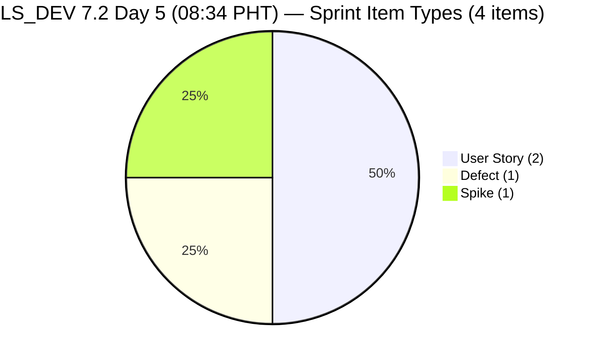
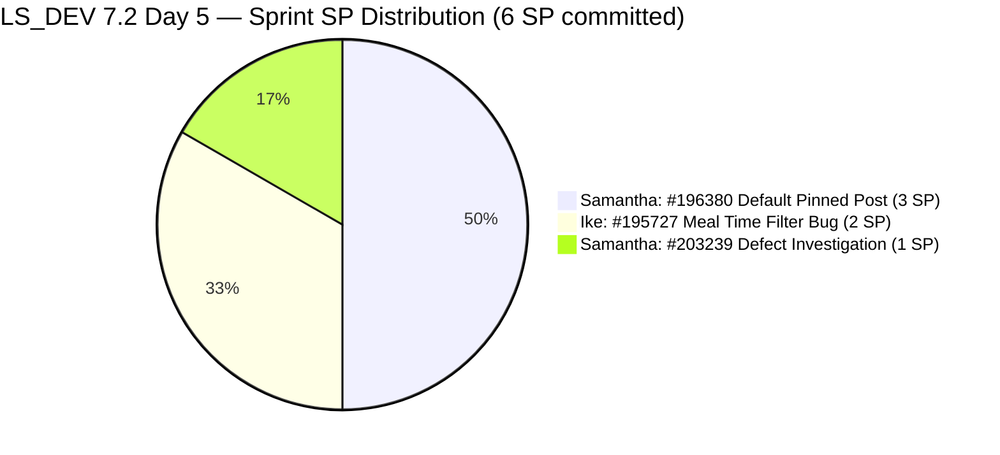
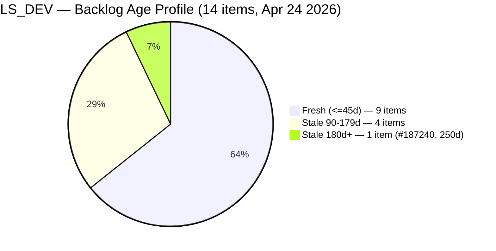
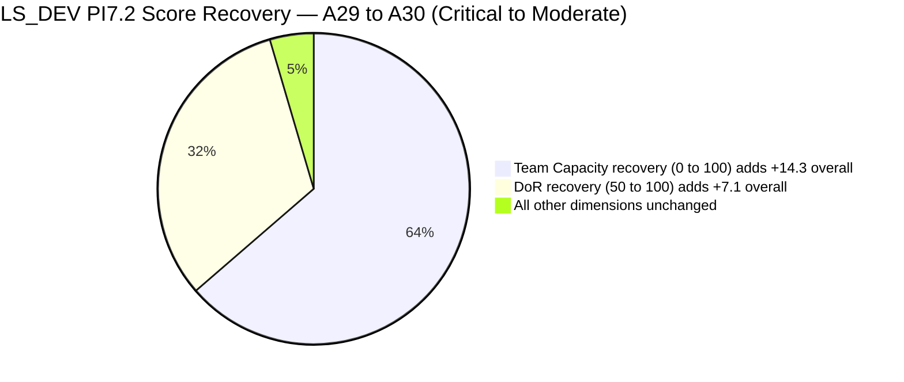
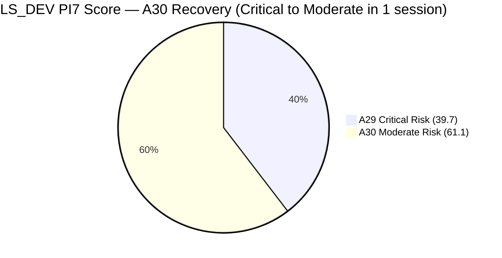

# SAFe Audit Report — Life Style Help App

**Audit A30 | Iteration 7.2 (Apr 20 – May 3, 2026) | Day 5 of 14 (~36% elapsed — early sprint)**

---

## 1. Audit Metadata

| Field | Value |
|---|---|
| **Audit Date** | April 24, 2026, 08:34 PHT |
| **Auditor** | Claude Code (ADO SAFe Audit Agent) |
| **Workspace** | `ado_ls_dev` |
| **ADO Project** | Life Style Help App (`0f447778-7156-4451-ab21-27be3c4a5888`) |
| **Team** | Life Style Help App Team (`a2a805bc-0b30-4ef3-9a8a-b7f3081157a6`) |
| **Iteration** | Iteration 7.2 — Apr 20 to May 3, 2026 |
| **Iteration ID** | `71cd2555-1e1c-4767-8a57-393f87aabe1f` |
| **Sprint Day** | Day 5 of 14 (~36% elapsed — early-sprint annotation applies to DP) |
| **Prior Audit** | AUDIT_20260423_1510.md (A29, Iter 7.2 Day 4 15:10 PHT, Overall 39.7 — Critical Risk) |
| **Scoring Model** | ADO SAFe v1 (7-dimension rubric) |
| **Overall Score** | **61.1 / 100** |
| **Risk Band** | **Moderate Risk** (60–79.9) |

> **Score alert — Critical Recovery:** This audit records the **largest single-audit improvement** in the PI7 Life Style Help App series. The team recovered from Critical Risk (39.7) to **Moderate Risk (61.1)** — a gain of **+21.4 points** — driven by the completion of all three P0 remediation actions from Audit A29: team capacity configured, and DoR fields added to both new sprint items. This demonstrates the team's ability to respond rapidly to audit findings.

---

## 2. Executive Summary

Life Style Help App exits Critical Risk and enters **Moderate Risk (61.1)** — the team's best score since the sprint opened on Apr 20. The **+21.4 point recovery** is the largest single-session gain in the PI7.2 audit series.

**What changed since A29 (Apr 23, 15:10 PHT):**

**[RESOLVED] Team Capacity configured for Iteration 7.2:**
- Samantha Babael: 1h/day Development
- Luzmibel Paculanang: 1h/day Testing
- Ike Yana: 1h/day Development
- Total: 3h/day configured across all 3 contributors with current work
- Team Capacity: 0.0 → **100.0** (+100.0, +14.3 to Overall)

**[RESOLVED] #203239 DoR remediated:**
- Description updated Apr 24 00:56 UTC from image-only to full text (member billing cancellation investigation scope, verification checklist)
- Acceptance Criteria added (cancellation date enforcement condition)
- DoR: FAIL → **PASS**

**[PARTIALLY RESOLVED] #203247 DoR remediated:**
- Description updated Apr 24 01:09 UTC (collaboration scope, issue review, replication steps, documentation requirements)
- Acceptance Criteria added (5-item checklist: communications reviewed, related issues checked, replication attempted, findings documented, conclusions provided)
- DoR: FAIL → **PASS**
- Story Points: **still not set** (SP = null) → Estimation gap persists
- State: New → **Active** (Apr 24 01:09 UTC)

**Net scoring impact:**
- Team Capacity: 0.0 → 100.0 (+100.0, adds +14.3 to Overall)
- DoR Compliance: 50.0 → 100.0 (+50.0, adds +7.1 to Overall)
- Estimation: 75.0 → 75.0 (no change — #203247 still no SP)

**Persistent concerns:**
- #195727 (Ike Yana, Meal Time Filter bug) still untouched since Apr 17 — **7 calendar days, 5 sprint days** without ADO update
- #187240 (250 days stale today) — longest-running unresolved item
- 5 stale_90 items remain in backlog
- Sprint scope still low at 4 items / 6 SP committed

---

## 3. Previous Audit Delta

| Dimension | A29 — Day 4 15:10 PHT | A30 — Day 5 08:34 PHT | Delta | Change Driver |
|---|---|---|---|---|
| Iteration Planning | 28.6 | **28.6** | 0.0 | 4/14 unchanged |
| Team Capacity | 0.0 | **100.0** | **+100.0** | Capacity configured overnight |
| Estimation | 75.0 | **75.0** | 0.0 | #203247 still no SP |
| DoR Compliance | 50.0 | **100.0** | **+50.0** | #203239 + #203247 both now PASS |
| Work Item Balance | 100.0 | **100.0** | 0.0 | Unchanged |
| Backlog Refinement | 24.3 | **24.3** | 0.0 | Unchanged |
| Delivery Predictability | 0.0 | **0.0** | 0.0 | Early-sprint; 0 SP closed |
| **Overall** | **39.7** | **61.1** | **+21.4** | **Critical → Moderate Risk** |

### Score Computation Summary

```
Sum A29 = 277.9
Sum A30:
  IP  = 28.6   (unchanged)
  TC  = 100.0  (+100.0 vs A29)
  Est = 75.0   (unchanged)
  DoR = 100.0  (+50.0 vs A29)
  WIB = 100.0  (unchanged)
  BR  = 24.3   (unchanged)
  DP  = 0.0    (unchanged)
  Sum = 427.9
Overall = round(427.9 / 7, 1) = round(61.129, 1) = 61.1 → Moderate Risk
```

### ADO Activity Since A29 (17h24m elapsed)

| Item | Activity | Timestamp |
|---|---|---|
| **Capacity** | **CONFIGURED** — Samantha (1h Dev), Luzmibel (1h Testing), Ike (1h Dev) | Configured overnight |
| **#203239** | Description replaced (image-only → full text); AC added | Apr 24 00:56 UTC |
| **#203247** | Description added; AC added; State: New → **Active** | Apr 24 01:09 UTC |
| #195727 | **No change** — still untouched since Apr 17 | — |
| #196380 | **No change** — still Ready for Dev since Apr 20 | — |

---

## 4. Current Iteration Snapshot

| Metric | Value |
|---|---|
| **Iteration** | 7.2 — Apr 20 to May 3, 2026 |
| **Iteration Day** | Day 5 of 14 (~36% elapsed) |
| **Visible root backlog items** | **14** (unchanged from A29) |
| **Current iteration root items (7.2)** | **4** (unchanged from A29) |
| **Point-eligible items in sprint** | 4 |
| **Estimated items (SP > 0)** | **3** (#196380=3SP, #195727=2SP, #203239=1SP; #203247 still no SP) |
| **Committed Story Points** | **6 SP** (unchanged — #203247 unestimated) |
| **Closed Story Points** | 0 SP (early-sprint) |
| **Delivery Predictability** | 0.0 (early-sprint, Day 5) |
| **Contributors with current work** | **3** (Samantha Babael, Ike Yana, Luzmibel Paculanang) |
| **Team capacity configured** | **YES** — 3h/day total (Samantha 1h Dev, Ike 1h Dev, Luzmibel 1h Testing) |
| **Untouched items since sprint start** | 1/4 = 25.0% (#195727 — Apr 17) |
| **Fresh items (ChangedDate >= Mar 10)** | 9 of 14 |
| **Stale items (>90d, before Jan 24)** | 5 of 14 (#187240, #194082, #194084, #194386, #195229) |
| **Stale items (>180d, before Oct 27)** | 1 of 14 (#187240 — **250 days** as of Apr 24) |

### Sprint Item Register — Iteration 7.2 (4 items / 6 SP committed)

| ID | Title | Type | State | SP | DoR | Assignee | Last Changed | Notes |
|---|---|---|---|---|---|---|---|---|
| **196380** | Default Pinned Post for New Users | User Story | Ready for Dev | 3 | **PASS** | Samantha Babael | Apr 20 | Planned sprint work |
| **195727** | Meal time filter doesn't respond with text in search bar | User Story | Ready for Dev | 2 | **PASS** | Ike Yana | **Apr 17** | **Untouched — 7 days** |
| **203239** | Investigate member emilienaess97@gmail.com | Defect | Active | 1 | **PASS** (fixed Apr 24 00:56) | Samantha Babael | Apr 24 00:56 | DoR remediated overnight |
| **203247** | 7.2 Collaborations/Check Heges Raised Issues/Replicate | Spike | Active | **—** | **PASS** (fixed Apr 24 01:09) | Luzmibel Paculanang | Apr 24 01:09 | DoR fixed; SP still missing |

---

## 5. Work Item Analysis







### Score Recovery Visualization



---

## 6. SAFe Compliance Scorecard

| Dimension | Score | Evidence | Notes |
|---|---|---|---|
| Iteration Planning | **28.6** | 4 / 14 visible root items in Iter 7.2 | Unchanged; 10 items outside sprint |
| Team Capacity | **100.0** | 3/3 contributors with current work have configured capacity | RESOLVED — Samantha 1h Dev, Ike 1h Dev, Luzmibel 1h Testing |
| Estimation | **75.0** | 3/4 point-eligible items have SP > 0; #203247 (Spike) no SP | Unchanged from A29; fix: add any SP value to #203247 |
| DoR Compliance | **100.0** | 4/4 items pass Desc >= 30 nws + AC >= 20 nws | RESOLVED — both #203239 and #203247 remediated overnight |
| Work Item Balance | **100.0** | US=50% (<=60%); Spike=25% (<=40%); Defect present | Type diversity maintained |
| Backlog Refinement | **24.3** | fresh=9/14=64.3; stale_90=5/14=35.7% → -20; stale_180=1 → -20; untouched_current=1/4=25% (NOT >30%) → 0 | Unchanged from A29; structural penalty from old inventory |
| Delivery Predictability | **0.0** | 0 SP closed / 6 SP committed — *early-sprint (Day 5 of 14)* | Unchanged; #203247 now Active, #203239 Active |
| **Overall Score** | **61.1** | (28.6 + 100.0 + 75.0 + 100.0 + 100.0 + 24.3 + 0.0) / 7 = 427.9 / 7 | **Moderate Risk** (60–79.9) |

### Score Computation Detail

```
1. Iteration Planning
   visible_root_backlog_items          = 14
   current_iteration_root_items (7.2)  = 4
   Score = round(4 / 14 × 100, 1)     = 28.6

2. Team Capacity
   contributors_with_current_work      = 3  (Samantha, Ike, Luzmibel)
   contributors_with_capacity          = 3  (all configured)
   Score = round(3 / 3 × 100, 1)       = 100.0

3. Estimation
   point_eligible_current_items        = 4
   estimated_current_items (SP > 0)    = 3  (#196380=3, #195727=2, #203239=1)
   #203247 has no SP                   → not estimated
   Score = round(3 / 4 × 100, 1)       = 75.0

4. DoR Compliance
   current_iteration_root_items        = 4
   dor_compliant_current_items         = 4  (all PASS)
   #203239: full text Desc (>30 nws) + AC (>20 nws) → PASS
   #203247: full text Desc (>30 nws) + 5-item AC (>20 nws) → PASS
   Score = round(4 / 4 × 100, 1)       = 100.0

5. Work Item Balance
   User Story present?                 = Yes (#196380, #195727)   → no -40
   dominant_type_share (US)            = 2/4 = 50.0%  → NOT > 60% → no -30
   spike_share                         = 1/4 = 25.0%  → NOT > 40% → no -20
   Score = max(0, 100 - 0)            = 100.0

6. Backlog Refinement
   fresh_visible_root_items (>= Mar 10) = 9 of 14 = 64.3%   → base = 64.3
   stale_90 (< Jan 24, 2026)          = 5 of 14 = 35.7%   → >25% → -20
   stale_180 (< Oct 27, 2025)         = 1 (#187240, 250d)  → >=1 → -20
   untouched_current (< Apr 20, 2026) = 1/4 = 25.0%       → NOT > 30% → 0
   Score = max(0, 64.3 - 20 - 20)    = 24.3

7. Delivery Predictability
   committed_story_points              = 6  (3+2+1)
   closed_story_points                 = 0
   Score = round(0 / 6 × 100, 1)       = 0.0
   [Day 5 of 14; start + 4 = Apr 24 >= Apr 24 → early-sprint annotated]

Overall = round((28.6 + 100.0 + 75.0 + 100.0 + 100.0 + 24.3 + 0.0) / 7, 1)
        = round(427.9 / 7, 1)
        = round(61.129, 1)
        = 61.1  →  MODERATE RISK (60–79.9)
```

### Next Recovery Target

```
If #203247 gets SP assigned today:
  Estimation   = round(4/4 × 100, 1) = 100.0  (+25.0)
  Overall      = round((28.6 + 100.0 + 100.0 + 100.0 + 100.0 + 24.3 + 0.0) / 7, 1)
               = round(452.9 / 7, 1) = 64.7  → Moderate Risk, improved

If additionally #195716 committed to sprint:
  current_7.2  = 5; visible = 14 (or 15 if #195716 also adds to backlog)
  If visible stays 14: IP = round(5/14 × 100, 1) = 35.7  (+7.1)
  Overall      ~ 65.7  → Moderate Risk, stronger

If additionally #187240 disposed + 2 stale_90 items closed:
  stale_90     = 3/14 = 21.4% → below 25% threshold → no -20 penalty
  BR           = max(0, 64.3 - 0 - 20) = 44.3  (+20)
  Overall      ~ 71.0  → Moderate Risk, approaching High-Moderate boundary
```

---

## 7. Dimension Findings

### 7.1 Iteration Planning — 28.6 (High Risk)

4 of 14 visible root backlog items are in Iteration 7.2. Unchanged from A29. The sprint scope has been stable since A28 (4 items), having grown from 2 items at sprint open. Ten items remain outside the current sprint.

**Sprint candidates for immediate commitment (DoR pre-verified):**
- **#195716 (Hide recipe card fields, 2 SP, Samantha):** Description has text (~75 nws chars including "Hide preferanser, allergier and kan serveres til inside recipe card") + AC in Given/When/Then format. DoR PASS. Sprint entry raises IP to 5/14 = 35.7%.
- **#187242 (Assess Mobile Performance, 2 SP, Ike):** Full description and AC. DoR PASS. Could complement #195727.

Adding these 2 items would raise committed SP from 6 to 10 SP and IP from 28.6 to 42.9 (6/14), approaching a more reasonable sprint scope.

### 7.2 Team Capacity — 100.0 (Low Risk — RESOLVED)

Team capacity was configured overnight following Audit A29's P0 recommendation. All three active contributors now have confirmed capacity for Iteration 7.2:

| Contributor | Activity | Capacity/day |
|---|---|---|
| Samantha Babael | Development | 1h |
| Ike Yana | Development | 1h |
| Luzmibel Paculanang | Testing | 1h |

Score: 3/3 = 100.0. This is the highest-impact single fix in the team's PI7 audit history — restoring 100 points in one dimension and adding +14.3 to the Overall in one session.

**Historical note:** In PI7.1, team capacity was configured before the sprint opened. The PI7.2 cycle saw 5 audit periods without capacity configuration (Days 1–4). Day 5 resolution is fast relative to the pattern but slower than sprint planning governance requires.

### 7.3 Estimation — 75.0 (High Risk, minor gap)

3 of 4 sprint items estimated. The sole gap is **#203247** (7.2 Collaborations/Check Heges Raised Issues) which was added Apr 23, remediated for DoR on Apr 24, but no Story Points were set during the DoR update.

The fix is one field update: set SP to 1 (exploratory spike work) or 2 (if Hege's raised issues are numerous). This would restore Estimation to 100.0 and add +3.6 to Overall.

### 7.4 DoR Compliance — 100.0 (Low Risk — RESOLVED)

All 4 sprint items now pass DoR. Both new items from Apr 23 were remediated overnight:

**#203239 (Investigate member emilienaess97@gmail.com — Defect, Active):**
- Description (Apr 24 00:56 UTC): Full text narrative — member account investigation scope (cancellation process, billing dispute, verification checklist for manual/system cancellation and billing date). Text nws count well above 30.
- Acceptance Criteria: "If the membership was cancelled successfully before the billing date, the member should not be charged after the cancellation effective date." — clear condition, >20 nws.
- DoR: **PASS**

**#203247 (7.2 Collaborations/Check Heges Raised Issues/Replicate — Spike, Active):**
- Description (Apr 24 01:09 UTC): Collaboration scope, issue review steps, replication procedure, documentation requirements — structured multi-bullet content well above 30 nws.
- Acceptance Criteria: Five-item checklist (communications reviewed, related issues checked, replication attempted, findings documented, conclusions with next steps). >20 nws.
- DoR: **PASS**

Both items are consistent with workspace CLAUDE.md's DoR requirement: "every item entering an iteration should have a usable description and acceptance criteria."

**Quality note on #203239:** The Defect was already in Active state when remediated — it was being worked before DoR was complete. While the DoR remediation is complete now, the process deviation (commit before DoR) is worth noting for future sprint planning hygiene.

### 7.5 Work Item Balance — 100.0 (Low Risk)

Sprint type distribution unchanged: US = 50% (<60%), Spike = 25% (<40%), Defect = 25%. All penalty gates pass. Score = 100.0.

### 7.6 Backlog Refinement — 24.3 (Critical)

Three penalty gates active:

| Gate | Threshold | Current | Status | Penalty |
|---|---|---|---|---|
| fresh_visible (>= Mar 10) | n/a | 9/14 = 64.3% | Base = 64.3 | — |
| stale_90 (< Jan 24, 2026) | > 25% → -20 | 5/14 = 35.7% | **TRIGGERED** | -20 |
| stale_180 (< Oct 27, 2025) | >= 1 → -20 | 1 (#187240, **250d**) | **TRIGGERED** | -20 |
| untouched_current (< Apr 20) | > 30% → -20 | 1/4 = 25% | Cleared | 0 |
| **Net** | | | 64.3 - 40 = 24.3 | **24.3** |

**#187240 — "Evaluate Deployment Options" — 250 days stale today.** This is an Ike Yana item assigned to the root `Life Style Help App` iteration path, never updated since Aug 18, 2025. It has been flagged in 14 consecutive audits. The -20 stale_180 penalty will persist until this item is disposed (closed, re-pathed, or updated). This is the single most impactful backlog hygiene action available to the team — resolving it alone does not remove the stale_90 penalty but removes the -20 stale_180 penalty.

**#195727 (Ike Yana — Meal Time Filter Bug) — 7 calendar days untouched.** Item last changed Apr 17. It has now entered Day 5 of the sprint without a single ADO update from Ike. At 1/4 = 25% of sprint items, it sits just below the 30% untouched penalty threshold. If the item remains untouched AND the denominator contracts (another item closes), the ratio could return to 1/3 = 33% and re-trigger the -20 penalty. **Ike must touch this item today.**

**Stale inventory breakdown:**

| ID | Title | Days Stale | Path | Action |
|---|---|---|---|---|
| #187240 | Evaluate Deployment Options | **250d** | Root | Close/dispose — longest outstanding item |
| #194082 | Customize "Servings" Label | ~141d | PI 5 | Triage or re-path to PI7 |
| #194084 | Schedule Blog Post for Future Publication | ~141d | PI 5 | Triage or re-path |
| #194386 | Investigate re-occurring cancellation issue | ~163d | PI 4.4 | Close — image-only Desc; stale |
| #195229 | Email Notification for Forum Posts | ~141d | PI 5 | Triage |

### 7.7 Delivery Predictability — 0.0 (early-sprint)

0 SP closed / 6 SP committed = 0.0. Day 5 is still within the early-sprint window (start Apr 20 + 4 days = Apr 24 >= Apr 24). No adjustment applied.

**Positive signals:**
- #203239 is Active (Samantha investigating billing issue)
- #203247 is Active (Luzmibel replicating Hege's raised issues)
- #196380 (Default Pinned Post, 3 SP) is Ready for Dev with Samantha — first closure candidate

**Velocity context:** Iteration 7.1 closed at 100% DP (all committed SP closed). With 6 SP committed and 9 working days remaining, the team needs to close approximately 0.67 SP/day for full delivery — a very modest pace given 7.1 performance. The constraint is not velocity but rather the low sprint scope.

---

## 8. Risks and Bottlenecks

| # | Risk | Severity | Owner | Status vs A29 |
|---|---|---|---|---|
| R1 | **#187240 "Evaluate Deployment Options" — 250 days stale today.** 14 consecutive audits without change. -20 BR penalty per audit until disposed. | **HIGH** | Ike Yana | Unresolved |
| R2 | **#195727 untouched for 7 days.** 5 sprint days without ADO activity from Ike. Untouched ratio at 25% — one closure away from re-triggering -20 BR penalty. | **HIGH** | Ike Yana | Escalated from A29 |
| R3 | **Sprint scope at 4 items / 6 SP.** Iteration Planning locked at 28.6. No new items committed since A28. | **HIGH** | Team Lead / Ramon | Ongoing |
| R4 | **#203247 (Spike) unestimated — 1 SP field missing.** Estimation gap persists despite DoR remediation. | **MEDIUM** | Luzmibel / Team Lead | Partially resolved (DoR done; SP missing) |
| R5 | **4 PI5 stale items (#194082, #194084, #195229) + 1 PI4 item (#194386) — 141–163 days old.** stale_90 share at 35.7% drives -20 BR penalty. | **MEDIUM** | Team Lead / PO | Unresolved — 14 audits |
| R6 | **Backlog Refinement stuck at 24.3.** Two structural penalties (-40 combined) require proactive backlog disposal to resolve. | **MEDIUM** | Team Lead | Unchanged |
| R7 | **#203239 (Defect) — Active without prior DoR — process deviation.** Item was Active before DoR was complete. Remediated overnight but process discipline needs reinforcement. | **LOW** | Samantha / PO | Resolved but noted |
| R8 | **Interrupt-driven Defect (#203239) in sprint without separation.** Per workspace CLAUDE.md, reactive defects should be tracked separately to prevent sprint distortion. | **LOW** | Team Lead | From A29 |
| R9 | **Estimation at 75.0 — one SP field from 100%.** #203247 SP still null. | **LOW** | Luzmibel | Trivial fix |
| R10 | **No sprint goal defined for 7.2.** | **LOW** | Ramon / Team Lead | Persistent |

---

## 9. Prioritized Recommendations

### P0 — Today (Apr 24) — Immediate

**1. Estimate #203247 (Spike) — 1 minute effort**
Add SP = 1 or 2 to #203247. The work scope (review communications, check issues, attempt replication, document findings) fits 1–2 SP.
Impact: Estimation 75.0 → 100.0 (+3.6 Overall).

**2. Ike — touch #195727 in ADO — 2 minutes**
Add a progress comment or move to Active/In Progress. Seven days without update. The 25% untouched ratio is one closure away from triggering the -20 BR penalty.
Impact: Maintains BR at 24.3; prevents potential regression to 4.3.

**3. Dispose #187240 "Evaluate Deployment Options" — Ike — 1 hour**
At 250 days, this item has outlasted 3 sprints without progress. Options:
  (a) Close as "Won't Fix / Superseded" if Bubble deployment strategy has been resolved differently
  (b) Close as Closed/Done if the POC findings were captured elsewhere
  (c) Re-path to PI7 with updated Description + AC if still viable
Clears the stale_180 -20 BR penalty. BR base improves to 64.3 - 20 = 44.3.

### P1 — This Sprint

**4. Commit #195716 (Hide recipe card fields, 2 SP, Samantha) to sprint.**
DoR verified PASS. Raises sprint scope to 5 items; IP improves to 5/14 = 35.7% (+7.1). Combined with the P0 Estimation fix, Overall improves to ~64.7.

**5. Triage 4 PI5/PI4 stale items (#194082, #194084, #194386, #195229).**
Closing or re-pathing 2 of these reduces stale_90 share from 5/14 = 35.7% to 3/14 = 21.4% (below the 25% threshold), removing the -20 BR penalty.
Combined with #187240 disposal, BR improves to 64.3 - 0 = 64.3 (before untouched penalty) → net ~44.3 after remaining stale_180 check. If BOTH penalties removed: BR = 64.3 → Overall adds ~11 points.

**6. Define Iteration 7.2 sprint goal.**
Suggested: "By May 3, 2026, resolve the Hege member account issue (Samantha/Luzmibel), implement Default Pinned Post for New Users (#196380), and fix the Meal Time Filter bug (#195727). Commit to 100% DP on all items."
Record in the ADO iteration description or team sprint wiki.

**7. Commit #187242 (Assess Mobile Performance, 2 SP, Ike) to sprint.**
Adds scope for Ike beyond the long-stale #195727. DoR PASS. Raises IP to 6/14 = 42.9% if #195716 also committed.

### P2 — This Iteration

**8. Establish reactive defect queue separate from sprint commitment.**
Per workspace CLAUDE.md: "separate planned sprint work from interrupt-driven defects." #203239 entered the sprint as a client support reactive item. Create a standing Defect backlog area for reactive requests so they can be tracked without distorting sprint IP scores.

**9. Weekly backlog grooming slot.**
Five stale_90 items and 1 stale_180 item have persisted for 14 consecutive audits. A 30-minute weekly grooming session with PO + Team Lead would systematically eliminate stale debt.

---

## 10. Evidence Gaps and Limitations

| Gap | Impact | Notes |
|---|---|---|
| **DoR text content verified from live API** | #203239 and #203247 Description/AC confirmed as text (not image-only) from Apr 24 API pull | Both now clearly text-based with sufficient nws |
| **#195727 block reason unknown** | 7 calendar days without ADO activity from Ike. Reason (offline work, blocker, deprioritization) not confirmed via API | R2 escalation; P0 action |
| **#203247 SP field absent** | Spike has no SP value in ADO; point_eligible count = 4, estimated = 3 | Estimation gap — 1-minute fix |
| **Early-sprint DP caveat** | 0.0 DP at Day 5 normal; first meaningful DP reading expected Day 6–7 | No scoring concern |
| **Sprint goal not detectable via API** | Whether 7.2 has a sprint goal recorded in ADO cannot be confirmed via API | Advisory gap |
| **#187240 age** | ChangedDate Aug 18, 2025; audit date Apr 24, 2026 = 250 days | 1 day increment from A29 (249 days) |
| **#194386 Description is image-only** | This existing backlog item has an image-only Description (like #203239 previously). If committed to sprint, it would fail DoR. | Advisory only — not in current sprint |

---

## 11. Score Trend — PI7 Life Style Help App (Full Series)

| Audit | Date / Time | Sprint Day | Iteration | Overall | Band |
|---|---|---|---|---|---|
| A22 | Apr 12 | 7 | 7.1 | 62.5 | Moderate |
| A23 | Apr 13 | 8 | 7.1 | 77.1 | Moderate |
| A24 | Apr 17 | 12 | 7.1 | 11.2 | Critical (sprint-close artifact) |
| A25 | Apr 19 | 14 | 7.1 close | 82.4 | **Low Risk** |
| A26 | Apr 21 | 2 | 7.2 open | 41.0 | High Risk |
| A27 | Apr 22 | 3 | 7.2 | 41.0 | High Risk |
| A28 | Apr 23 09:00 | 4 | 7.2 | 41.0 | High Risk |
| A29 | Apr 23 15:10 | 4 | 7.2 | 39.7 | **Critical Risk** |
| **A30** | **Apr 24 08:34** | **5** | **7.2** | **61.1** | **Moderate Risk — RECOVERY** |



**Critical observation — Recovery pattern:** The team entered Critical Risk in A29 (39.7) due to three simultaneous gaps (no capacity, two DoR-failing items). All three gaps were resolved overnight, recovering +21.4 points in a single session. This demonstrates the team's responsiveness when findings are actionable and specific.

**Remaining gap to Low Risk:** The team needs +18.9 more points (61.1 → 80.0). The clearest path:
1. Estimate #203247 (+3.6)
2. Dispose #187240 + triage 2 stale_90 items (BR: 24.3 → ~44.3, +20 → +2.9 Overall)
3. Commit 3+ additional items to sprint (IP: 28.6 → ~50, +21.4 → ~+3.1 Overall)
4. Begin closing sprint items (DP: each SP closed from 6 committed = 2.4 Overall points per 0.5 DP)

Low Risk (80.0) is achievable by Day 7–8 if sprint scope expands, #187240 is disposed, and active items close.

---

*Report generated: 2026-04-24 08:34 PHT | Audit A30 | ado_ls_dev*
*Day 5 of 14 — Iter 7.2 — Overall: 61.1 / 100 — Moderate Risk (+21.4 vs A29 Critical Risk)*
*Data source: Live ADO MCP pull — Apr 24, 2026 | 14 backlog items; 4 current-iteration items; 6 SP committed (3 estimated)*
