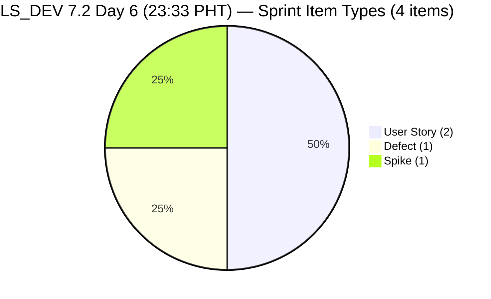
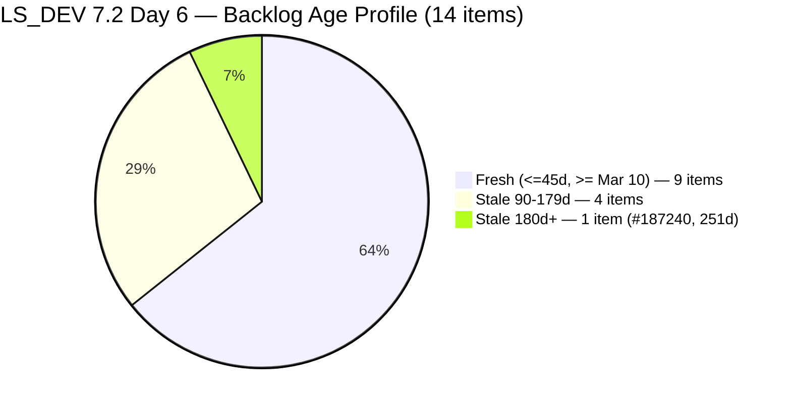
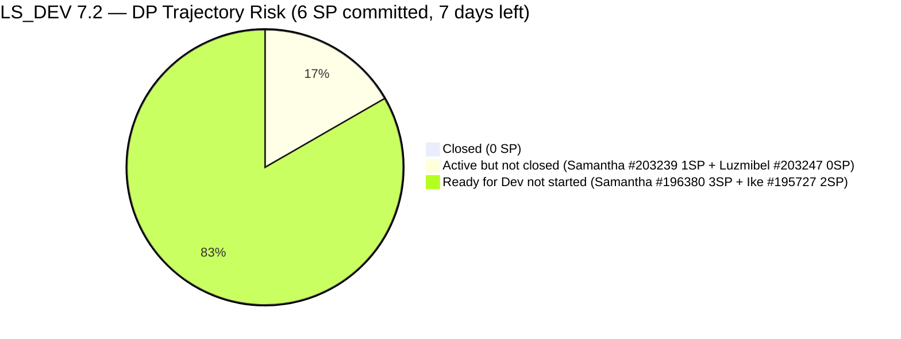
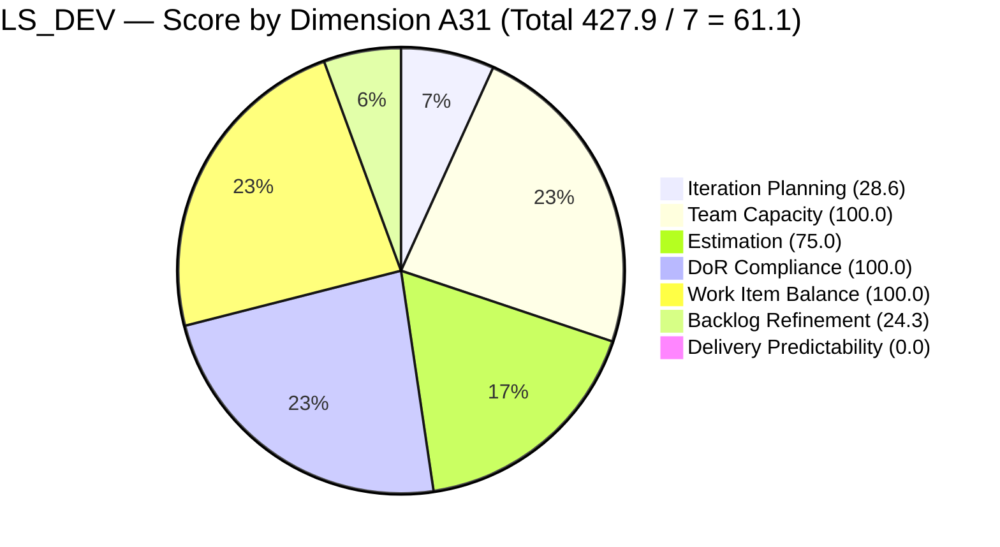

# SAFe Audit Report — Life Style Help App

**Audit A31 | Iteration 7.2 (Apr 20 – May 3, 2026) | Day 6 of 14 (~43% elapsed)**

---

## 1. Audit Metadata

| Field | Value |
|---|---|
| **Audit Date** | April 25, 2026, 23:33 PHT |
| **Auditor** | Claude Code (ADO SAFe Audit Agent) |
| **Workspace** | `ado_ls_dev` |
| **ADO Project** | Life Style Help App (`0f447778-7156-4451-ab21-27be3c4a5888`) |
| **Team** | Life Style Help App Team (`a2a805bc-0b30-4ef3-9a8a-b7f3081157a6`) |
| **Iteration** | Iteration 7.2 — Apr 20 to May 3, 2026 |
| **Iteration ID** | `71cd2555-1e1c-4767-8a57-393f87aabe1f` |
| **Sprint Day** | Day 6 of 14 (~43% elapsed) |
| **Prior Audit** | AUDIT_20260424_0834.md (A30, Iter 7.2 Day 5, 08:34 PHT, Overall 61.1 — Moderate Risk) |
| **Scoring Model** | ADO SAFe v1 (7-dimension rubric) |
| **Overall Score** | **61.1 / 100** |
| **Risk Band** | **Moderate Risk** (60–79.9) |

---

## 2. Executive Summary

Life Style Help App holds at **61.1 (Moderate Risk)** on Day 6 — **no change from Audit A30**. No ADO activity has been detected across any sprint item since the overnight remediation on Apr 24 (00:56–01:09 UTC). The score is identical in value but qualitatively different: **the early-sprint annotation on Delivery Predictability has been lifted.** The current 0.0 DP is now a real metric representing 6 full sprint days with zero item closures.

**Status by contributor:**
- **Samantha Babael:** #203239 (Defect, Active — billing investigation) and #196380 (User Story, Ready for Dev — Default Pinned Post) both unchanged since Apr 24 00:56.
- **Luzmibel Paculanang:** #203247 (Spike, Active — Hege issues) has DoR remediated but SP still null. Last changed Apr 24 01:09.
- **Ike Yana:** #195727 (Bug, Ready for Dev — Meal Time Filter) untouched since Apr 17. **Now 8 calendar days, 6 full sprint days without ADO activity.** The untouched ratio is 1/4 = 25.0% — one sprint-item closure away from triggering the -20 Backlog Refinement penalty.

**Structural unchanged facts:**
- #187240 ("Evaluate Deployment Options") = **251 days stale today** — 15th consecutive audit with no disposal
- 5 stale_90 items hold BR at 24.3 (Critical dimension)
- Sprint scope locked at 4 items / 6 SP — lowest sprint scope in the PI7 series
- No sprint goal defined

---

## 3. Previous Audit Delta

| Dimension | A30 — Day 5 08:34 PHT | A31 — Day 6 23:33 PHT | Delta | Change Driver |
|---|---|---|---|---|
| Iteration Planning | 28.6 | **28.6** | 0.0 | 4/14 unchanged |
| Team Capacity | 100.0 | **100.0** | 0.0 | Unchanged |
| Estimation | 75.0 | **75.0** | 0.0 | #203247 SP still null |
| DoR Compliance | 100.0 | **100.0** | 0.0 | All 4 items PASS |
| Work Item Balance | 100.0 | **100.0** | 0.0 | Unchanged |
| Backlog Refinement | 24.3 | **24.3** | 0.0 | Structural — unchanged |
| Delivery Predictability | 0.0 | **0.0** | 0.0 | No closures; **early-sprint flag removed** |
| **Overall** | **61.1** | **61.1** | **0.0** | — |

### ADO Activity Since A30 (38h59m elapsed)

**No ADO changes detected** for any of the 14 visible backlog items or 4 sprint items since Apr 24 01:09 UTC.

| Item | Status | Last Changed |
|---|---|---|
| #196380 | Ready for Dev — unchanged | Apr 20 03:13 UTC |
| #195727 | Ready for Dev — **unchanged since Apr 17** | Apr 17 03:35 UTC |
| #203239 | Active — unchanged | Apr 24 00:56 UTC |
| #203247 | Active — unchanged | Apr 24 01:09 UTC |

---

## 4. Current Iteration Snapshot

| Metric | Value |
|---|---|
| **Iteration** | 7.2 — Apr 20 to May 3, 2026 |
| **Iteration Day** | Day 6 of 14 (~43% elapsed) |
| **Visible root backlog items** | **14** (unchanged) |
| **Current iteration root items (7.2)** | **4** (unchanged) |
| **Point-eligible items in sprint** | 4 |
| **Estimated items (SP > 0)** | **3** (#196380=3SP, #195727=2SP, #203239=1SP; #203247 no SP) |
| **Committed Story Points** | **6 SP** (unchanged) |
| **Closed Story Points** | **0 SP** (Day 6 — no closures) |
| **Delivery Predictability** | **0.0** — Day 6, no early-sprint annotation |
| **Contributors with current work** | 3 (Samantha, Ike, Luzmibel) |
| **Team capacity** | 3h/day (Samantha 1h Dev, Ike 1h Dev, Luzmibel 1h Testing) |
| **Untouched items since sprint start** | 1/4 = **25.0%** (#195727 — Apr 17) |
| **Working days remaining** | 7 (Apr 25–30 + May 2–3, excl. May 1) |
| **Fresh items (ChangedDate >= Mar 10)** | 9 of 14 |
| **Stale items (>90d, < Jan 26)** | 5 of 14 |
| **Stale items (>180d, < Oct 28)** | 1 of 14 (#187240 — **251 days as of Apr 25**) |

### Sprint Item Register — Iteration 7.2 (4 items / 6 SP committed)

| ID | Title | Type | State | SP | DoR | Assignee | Last Changed | Notes |
|---|---|---|---|---|---|---|---|---|
| **196380** | Default Pinned Post for New Users | User Story | Ready for Dev | 3 | PASS | Samantha Babael | Apr 20 | Planned sprint work — sprint day 1 |
| **195727** | Meal time filter doesn't respond with text in search bar | User Story | Ready for Dev | 2 | PASS | Ike Yana | **Apr 17** | **UNTOUCHED — 8 days / 6 sprint days** |
| **203239** | Investigate member emilienaess97@gmail.com | Defect | Active | 1 | PASS | Samantha Babael | Apr 24 00:56 | Active; no update in 47h |
| **203247** | 7.2 Collaborations/Check Heges Raised Issues/Replicate | Spike | Active | **—** | PASS | Luzmibel Paculanang | Apr 24 01:09 | Active; SP null; no update in 47h |

---

## 5. Work Item Analysis







### Velocity Outlook (Day 6)

| Scenario | SP to close | Days left | SP/day needed | Feasibility |
|---|---|---|---|---|
| 100% DP (6 SP) | 6 | 7 | 0.86/day | **Achievable** — very modest pace |
| 80% DP threshold (4.8 SP, ~5 SP) | 5 | 7 | 0.71/day | **Achievable** |
| Zero additional closes | 0 | — | — | Overall stays at ~61.1; DP stays 0 |

**The sprint scope is so small (6 SP) that 100% DP requires less than 1 SP/day.** The team closed 100% in PI7.1. The risk is not velocity but item activation — both Active items (#203239, #203247) were started Apr 24 and have shown no ADO movement in 47+ hours. And #195727 has not been activated by Ike in 8 days.

---

## 6. SAFe Compliance Scorecard

| Dimension | Score | Evidence | Notes |
|---|---|---|---|
| Iteration Planning | **28.6** | 4/14 visible root items in 7.2 | Unchanged from A29–A31 |
| Team Capacity | **100.0** | 3/3 contributors have configured capacity | Samantha 1h Dev, Ike 1h Dev, Luzmibel 1h Testing |
| Estimation | **75.0** | 3/4 point-eligible items have SP > 0; #203247 (Spike) SP null | Unchanged from A30 |
| DoR Compliance | **100.0** | 4/4 items pass Desc >= 30 nws + AC >= 20 nws | All PASS — unchanged |
| Work Item Balance | **100.0** | US=50% (<60%); Spike=25% (<40%); Defect=25% | Type diversity maintained |
| Backlog Refinement | **24.3** | fresh=9/14=64.3%; stale_90=5/14=35.7% → -20; stale_180=1 → -20; untouched=1/4=25% (<30%) | Structural — unchanged |
| Delivery Predictability | **0.0** | 0 SP closed / 6 SP committed — **Day 6, no early-sprint annotation** | Zero delivery through Day 6 |
| **Overall Score** | **61.1** | (28.6+100.0+75.0+100.0+100.0+24.3+0.0) / 7 = 427.9 / 7 | **Moderate Risk** (60–79.9) |

### Score Computation Detail

```
1. Iteration Planning
   visible_root_backlog_items          = 14
   current_iteration_root_items        = 4
   Score = round(4/14 × 100, 1)        = 28.6

2. Team Capacity
   contributors_with_current_work      = 3
   contributors_with_capacity          = 3
   Score = round(3/3 × 100, 1)         = 100.0

3. Estimation
   point_eligible                      = 4
   estimated (SP > 0)                  = 3 (#196380=3, #195727=2, #203239=1)
   #203247 SP = null                   → not estimated
   Score = round(3/4 × 100, 1)         = 75.0

4. DoR Compliance
   current_iteration_root_items        = 4
   dor_compliant                       = 4
   Score = round(4/4 × 100, 1)         = 100.0

5. Work Item Balance
   User Story present = Yes            → no -40
   dominant_type_share (US) = 2/4 = 50% → NOT > 60% → no -30
   spike_share = 1/4 = 25%             → NOT > 40% → no -20
   Score = max(0, 100 - 0)            = 100.0

6. Backlog Refinement
   fresh (>= Mar 10, 2026)             = 9/14 = 64.3%  → base = 64.3
   stale_90 (< Jan 26, 2026)          = 5/14 = 35.7%  → > 25% → -20
   stale_180 (< Oct 28, 2025)         = 1 (#187240)    → >= 1 → -20
   untouched_current (< Apr 20)       = 1/4 = 25.0%    → NOT > 30% → 0
   Score = max(0, 64.3 - 20 - 20)    = 24.3

7. Delivery Predictability
   committed_SP                        = 6
   closed_SP                           = 0
   Score = round(0/6 × 100, 1)         = 0.0
   [Day 6 — NOT early sprint; start+4 = Apr 24 < Apr 25]

Overall = round((28.6+100.0+75.0+100.0+100.0+24.3+0.0)/7, 1)
        = round(427.9/7, 1) = 61.1  →  MODERATE RISK
```

### Next Recovery Targets

```
If #203247 SP assigned (1 minute):
  Est = round(4/4 × 100, 1) = 100.0  (+25.0)
  Overall = round(452.9/7, 1) = 64.7  → Moderate, stronger

If additionally any sprint item closes (e.g., #203239, 1 SP):
  DP = round(1/6 × 100, 1) = 16.7  (+16.7)
  Overall = round(469.6/7, 1) = 67.1

If #196380 closes (3 SP) + #203247 SP set:
  DP = round(3/6 × 100, 1) = 50.0  (+50.0)
  Overall = round(502.9/7, 1) = 71.8  → Moderate Risk, strengthening

If additionally #187240 disposed (clears stale_180 -20):
  BR = max(0, 64.3 - 20 - 0) = 44.3  (+20.0)
  Overall = round(522.9/7, 1) = 74.7  → Moderate, approaching 80

If all above + 3 stale_90 items triaged (stale_90 < 25%):
  BR = max(0, 64.3 - 0 - 0) = 64.3  (+20.0 more)
  Overall = round(542.9/7, 1) = 77.6  → Moderate Risk, near Low Risk
```

---

## 7. Dimension Findings

### 7.1 Iteration Planning — 28.6 (High Risk — Critical for sprint score)

4 of 14 visible root backlog items are in Iteration 7.2. This score has been stable at 28.6 since Audit A28 (Apr 23 09:00 AM, Day 4). Ten items remain outside the current sprint, including DoR-ready candidates (#195716, #187242) that could be committed without remediation.

**The sprint scope of 4 items / 6 SP is the smallest active sprint in the PI7 series.** In comparison, PI7.1 closed with a robust item set. The team currently has enough capacity for more items: 3h/day × 7 remaining days = 21 person-hours available. At 1 SP per hour (conservative), the team could theoretically close 6+ additional SP if items were committed now.

**Sprint expansion candidates (both DoR PASS):**

| ID | Title | SP | Assignee | DoR Status |
|----|-------|----|----|---|
| #195716 | Hide "preferanser", "allergier" inside recipe card | 2 | Samantha | PASS (Given/When/Then AC) |
| #187242 | [POC] Assess Mobile Performance & UX | 2 | Ike | PASS (full Desc + AC) |

Committing both: IP = 6/14 = 42.9% (+14.3), committed SP = 10, potential sprint close DP ceiling = 100%.

### 7.2 Team Capacity — 100.0 (Low Risk)

Team capacity confirmed:

| Contributor | Activity | Capacity/day |
|---|---|---|
| Samantha Babael | Development | 1h |
| Ike Yana | Development | 1h |
| Luzmibel Paculanang | Testing | 1h |

Score: 3/3 = 100.0. Capacity was configured overnight after A29's P0 finding. Now stable.

### 7.3 Estimation — 75.0 (High Risk — one field from 100%)

3 of 4 sprint items have SP > 0. The sole gap: **#203247** (Spike — Hege Issues). DoR is complete; SP remains unset after 2 audits since the item was added. Setting SP = 1 restores Estimation to 100.0 and adds +3.6 to Overall.

### 7.4 DoR Compliance — 100.0 (Low Risk)

All 4 sprint items pass DoR:
- #196380: Full As a/I want/So that + detailed AC checklist ✓
- #195727: Step-by-step repro + actual/expected result format ✓
- #203239: Full text narrative + clear condition AC ✓ (fixed Apr 24)
- #203247: Multi-bullet collaboration scope + 5-item AC checklist ✓ (fixed Apr 24)

Score: 4/4 = 100.0.

### 7.5 Work Item Balance — 100.0 (Low Risk)

Sprint type distribution: US=50%, Defect=25%, Spike=25%. All penalty gates pass. Score = 100.0.

### 7.6 Backlog Refinement — 24.3 (Critical — structural)

| Gate | Threshold | Current | Status | Penalty |
|---|---|---|---|---|
| fresh_visible (>= Mar 10) | n/a | 9/14 = 64.3% | Base = 64.3 | — |
| stale_90 (< Jan 26, 2026) | > 25% → -20 | 5/14 = 35.7% | TRIGGERED | -20 |
| stale_180 (< Oct 28, 2025) | >= 1 → -20 | 1 (#187240, 251d) | TRIGGERED | -20 |
| untouched_current (< Apr 20) | > 30% → -20 | 1/4 = 25.0% | Cleared | 0 |
| **Net** | | 64.3 - 40 = 24.3 | | **24.3** |

**#187240 — 251 days old today.** This item has been flagged in **15 consecutive audits**. It is the single most impactful backlog action available (removes -20 BR penalty). Options remain the same: Close as Won't Fix, Close as Done, or re-path to PI7 with updated content.

**#195727 staleness escalation.** Last changed Apr 17 (8 days ago, 6 sprint days). The item is assigned to Ike, is Ready for Dev, and has not been activated. The untouched ratio is 1/4 = 25%. If any other sprint item closes (e.g., #203239 Defect investigation completes), the denominator drops to 3 and the ratio rises to 1/3 = 33.3% — **triggering the -20 penalty**. BR would drop from 24.3 to **4.3**.

**This is the most immediate scoring risk.** Ike must either activate #195727 (move to Active) or the team must keep at least 4 items in the sprint denominator.

**Stale inventory (5 stale_90 items):**

| ID | Title | Days Stale | Path |
|---|---|---|---|
| #187240 | [POC] Evaluate Deployment Options | 251d | Root |
| #194082 | Customize "Servings" Label | ~142d | PI 5 |
| #194084 | Schedule Blog Post | ~142d | PI 5 |
| #194386 | Investigate re-occurring cancellation issue | ~164d | PI 4.4 |
| #195229 | Email Notification for Forum Posts | ~142d | PI 5 |

### 7.7 Delivery Predictability — 0.0 (Day 6 — real metric)

0 SP closed / 6 SP committed = 0.0. **The early-sprint annotation has been removed today.** Day 6 of a 14-day sprint with zero deliveries and 43% elapsed is a genuine delivery concern — not a normal early-sprint condition.

**Contributing factors to zero DP at Day 6:**
1. **#195727 (Ike, Bug, 2 SP)** — in Ready for Dev since sprint open. Not activated by Ike in 6 sprint days.
2. **#203239 (Samantha, Defect, 1 SP)** — Active since Apr 23, no update in 47+ hours. Investigation may be stalled.
3. **#203247 (Luzmibel, Spike, SP=null)** — Active since Apr 24 01:09; no update. Spike exploration may be ongoing.
4. **#196380 (Samantha, US, 3 SP)** — Ready for Dev since sprint open. Not activated.

The team committed 6 SP and has activated 2 of 4 items. The 2 Active items have been silent for 2 days. The other 2 items haven't moved. At PI7.1, the team closed 100% of their sprint commitment. The pattern so far in PI7.2 is concerning.

---

## 8. Risks and Bottlenecks

| # | Risk | Severity | Owner | Status vs A30 |
|---|---|---|---|---|
| R1 | **#195727 untouched — 8 calendar days, 6 sprint days.** Untouched ratio at 25%. If any item closes, ratio → 33% → -20 BR penalty. BR: 24.3 → 4.3. | **CRITICAL** | Ike Yana | Escalated (+1 day) |
| R2 | **#187240 — 251 days stale.** 15 consecutive audits without disposal. -20 BR penalty persists. | **HIGH** | Ike Yana | Unresolved — 15 audits |
| R3 | **Zero closures through Day 6.** Two Active items silent 47+ hours. 43% of sprint elapsed with 0% delivery. | **HIGH** | Team Lead | New — severity elevated |
| R4 | **Sprint scope at 4 items / 6 SP.** Iteration Planning locked at 28.6. IP drag suppresses Overall ceiling. | **HIGH** | Ramon / Team Lead | Unchanged |
| R5 | **5 stale_90 items (35.7%)** drive -20 BR penalty. Combined with stale_180, BR = 24.3. | **MEDIUM** | Team Lead / PO | Unchanged — 15 audits |
| R6 | **#203247 (Spike) SP null.** Estimation gap persists 2 audits after DoR fix. | **MEDIUM** | Luzmibel / Team Lead | Unchanged |
| R7 | **#203239 (Defect) Active but silent 47h.** Investigation scope may be broader than 1 SP. | **MEDIUM** | Samantha | From A30 |
| R8 | **Backlog Refinement at 24.3 (Critical dimension).** Structural dual-penalty. | **MEDIUM** | Team Lead | Unchanged |
| R9 | **No sprint goal defined for 7.2.** | **LOW** | Ramon / Team Lead | Persistent |
| R10 | **#195716 (Hide recipe card fields) not yet committed to sprint.** DoR PASS since A30. | **LOW** | Samantha / PO | Missed window A30 |

---

## 9. Prioritized Recommendations

### P0 — Today (Apr 25) — Immediate

**1. Ike — Activate #195727 in ADO RIGHT NOW**
Move from "Ready for Dev" to "Active" and add a progress comment. Eight days of silence on a bug fix while the sprint is 43% elapsed is not acceptable.
- Without this: if #203239 closes, BR drops from 24.3 to **4.3** (Critical).
- Impact: Prevents BR regression; keeps untouched ratio at 25% (below 30% threshold).

**2. Luzmibel — Set SP on #203247 (Spike) — 1 minute**
Set SP = 1 or 2. Restores Estimation from 75.0 to 100.0.
Impact: Overall 61.1 → 64.7 (+3.6).

**3. Samantha — Update #203239 with investigation findings or close if resolved**
The billing investigation (#203239) has been Active since Apr 23. By Day 6 the investigation scope (verify cancellation, confirm billing system behavior) should yield findings. If complete: close it. If blocked: add a blocking comment. Do not leave Active items silent for 2+ days.

### P1 — Apr 26 (Tomorrow)

**4. Commit #195716 (Hide recipe card fields, 2 SP, Samantha) to sprint.**
DoR PASS. IP improves from 28.6 to 35.7%. Adds 2 SP to sprint scope.

**5. Dispose #187240 "Evaluate Deployment Options" — Ike — 30 minutes**
251 days. Three options:
- (a) Close as "Won't Fix" if the Bubble deployment approach has been resolved differently
- (b) Close as "Done" if POC findings were captured elsewhere
- (c) Re-path to PI7 with updated Desc/AC if still viable
Clears stale_180 -20 BR penalty. BR: 24.3 → 44.3 if stale_90 persists.

**6. Begin work on #196380 (Default Pinned Post, 3 SP, Samantha).**
The highest-SP item in the sprint has been in "Ready for Dev" for 6 days. Activate and begin implementation. At PI7.1 velocity (100% delivery), this item should be completable within 3–4 working days.

### P2 — This Sprint

**7. Triage 4 PI5/PI4 stale items (#194082, #194084, #194386, #195229).**
Closing or re-pathing 2 removes stale_90 below the 25% threshold (from 5/14 to 3/14 = 21.4%), eliminating the -20 BR stale_90 penalty. Combined with #187240 disposal: BR improves from 24.3 to 64.3 (+40.0), adding ~5.7 to Overall.

**8. Commit #187242 (Assess Mobile Performance, 2 SP, Ike) to sprint.**
DoR PASS. Ike needs active scope beyond #195727. Adding this item provides productive Ike scope and increases sprint commitment.

**9. Define 7.2 sprint goal.**
Suggested: "By May 3, 2026, resolve the Hege/emiliene account issues (Samantha/Luzmibel), implement Default Pinned Post (#196380), and fix the Meal Time Filter bug (#195727). Commit to 100% DP on all 4+ sprint items."

---

## 10. Evidence Gaps and Limitations

| Gap | Impact | Notes |
|---|---|---|
| **#195727 block reason unknown** | 8 days without ADO activity. Reason (offline work, blocker, deprioritization) not confirmable via API. | R1 escalation; P0 action |
| **#203239 investigation outcome unknown** | Defect Active since Apr 23; no comment visible in batch API. Investigation may be complete but not logged. | P0 action |
| **#203247 SP null** | Spike estimation gap persists after DoR fix. | P0 action — 1 minute |
| **#187240 age** | ChangedDate Aug 18, 2025; audit date Apr 25, 2026 = 251 days | 1 day increment from A30 (250 days) |
| **#194386 Desc is image-only** | If committed to sprint, would fail DoR. | Advisory only — not in current sprint |
| **Sprint goal not detectable via API** | Whether a goal is in the ADO iteration description cannot be confirmed. | Advisory gap |
| **Early-sprint DP removed** | Day 6 DP = 0.0 is a real zero. First meaningful DP closure expected to be #203239 or #196380. | Scoring concern — not a gap |

---

## 11. Score Trend — PI7 Life Style Help App Series

| Audit | Date | Sprint Day | Overall | Band |
|---|---|---|---|---|
| A22 | Apr 12 | 7.1 D7 | 62.5 | Moderate |
| A25 | Apr 19 | 7.1 D14 | 82.4 | **Low Risk** |
| A26 | Apr 21 | 7.2 D2 | 41.0 | High Risk |
| A27 | Apr 22 | 7.2 D3 | 41.0 | High Risk |
| A28 | Apr 23 AM | 7.2 D4 | 41.0 | High Risk |
| A29 | Apr 23 PM | 7.2 D4 | 39.7 | **Critical Risk** |
| A30 | Apr 24 AM | 7.2 D5 | 61.1 | **Moderate Risk** (recovery) |
| **A31** | **Apr 25 PM** | **7.2 D6** | **61.1** | **Moderate Risk** |



**Score stabilized at 61.1 for the second consecutive audit.** The A30 recovery (+21.4) was a one-session spike from structural fix (capacity + DoR). Without new item closures or backlog disposal, the score will remain at 61.1 or decline.

**Decline scenario (if #203239 closes before #195727 is activated):**
- BR penalty triggers: untouched → 1/3 = 33% > 30% → -20
- BR = max(0, 64.3 - 20 - 20 - 20) = **4.3**
- DP = round(1/6 × 100, 1) = 16.7
- Overall = round((28.6+100+75+100+100+4.3+16.7)/7, 1) = round(424.6/7, 1) = **60.7 → Moderate, declining**

**Path to improvement:**
1. Ike activates #195727 (P0) → prevents BR decline
2. Set #203247 SP (P0) → +3.6
3. Close any 1 item → DP 16.7 → +2.4 Overall
4. Dispose #187240 → BR 44.3 → +2.9 Overall
**Combined P0 + first closure: 61.1 + 3.6 + 2.4 = 67.1**

---

*Report generated: 2026-04-25 23:33 PHT | Audit A31 | ado_ls_dev*
*Day 6 of 14 — Iter 7.2 — Overall: 61.1 / 100 — Moderate Risk (0.0 vs A30)*
*Data source: Live ADO MCP pull — Apr 25, 2026 | 14 backlog items; 4 current-iteration items; 6 SP committed (3 estimated); 0 SP closed (Day 6)*
