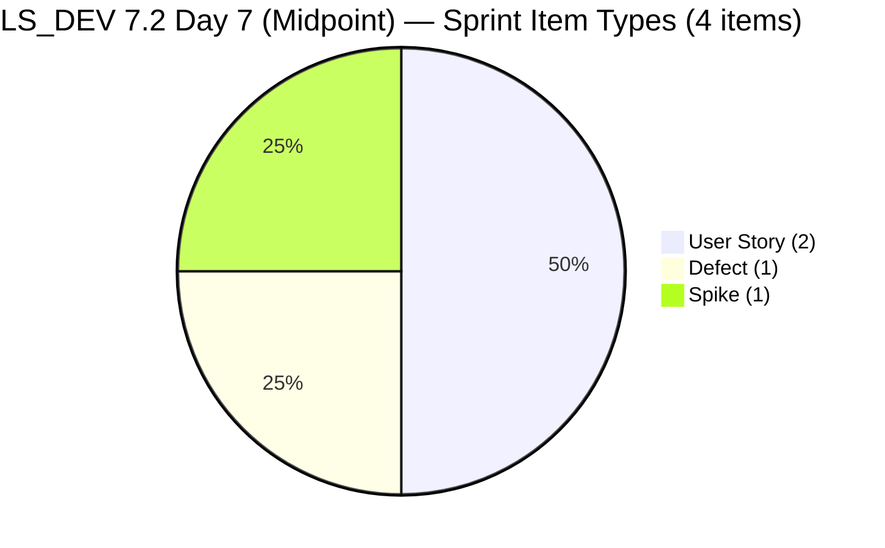
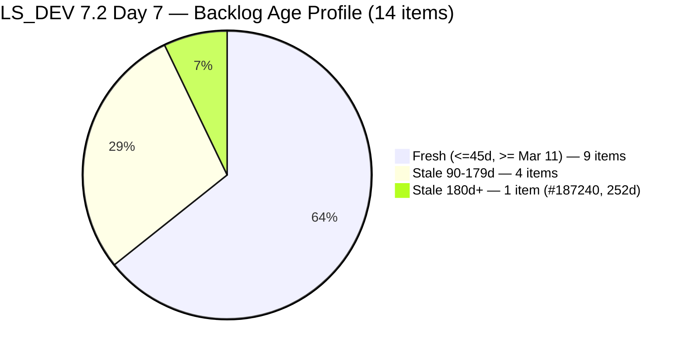
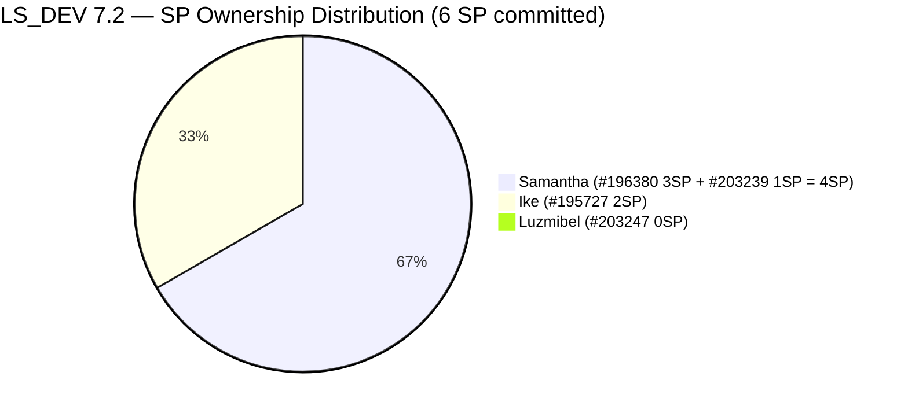
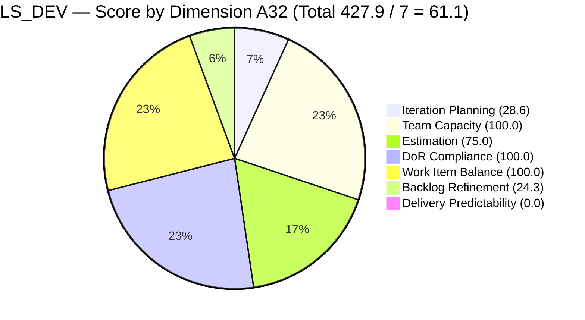
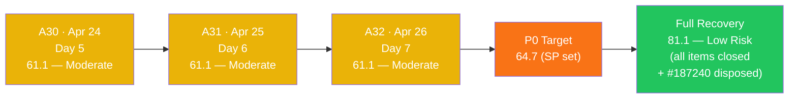

# SAFe Audit Report — Life Style Help App

**Audit A32 | Iteration 7.2 (Apr 20 – May 3, 2026) | Day 7 of 14 (50% elapsed — sprint midpoint)**

---

## 1. Audit Metadata

| Field | Value |
|---|---|
| **Audit Date** | April 26, 2026, 14:00 PHT |
| **Auditor** | Claude Code (ADO SAFe Audit Agent) |
| **Workspace** | `ado_ls_dev` |
| **ADO Project** | Life Style Help App (`0f447778-7156-4451-ab21-27be3c4a5888`) |
| **Team** | Life Style Help App Team (`a2a805bc-0b30-4ef3-9a8a-b7f3081157a6`) |
| **Iteration** | Iteration 7.2 — Apr 20 to May 3, 2026 |
| **Iteration ID** | `71cd2555-1e1c-4767-8a57-393f87aabe1f` |
| **Sprint Day** | Day 7 of 14 (50% elapsed — sprint midpoint) |
| **Prior Audit** | AUDIT_20260425_1533.md (A31, Iter 7.2 Day 6, 23:33 PHT, Overall 61.1 — Moderate Risk) |
| **Scoring Model** | ADO SAFe v1 (7-dimension rubric) |
| **Overall Score** | **61.1 / 100** |
| **Risk Band** | **Moderate Risk** (60–79.9) |

---

## 2. Executive Summary

Life Style Help App holds at **61.1 (Moderate Risk)** on Day 7 — **no change from A31**. The score has been flat at 61.1 for two consecutive audits (A30–A32), and the **sprint midpoint has been reached with zero SP closed**. No ADO activity has been detected across any sprint item since Apr 24 01:09 UTC — a silence window now spanning **61+ hours** (2.5 days).

**Sprint midpoint alarm:** At 50% elapsed with 0/6 SP delivered, the team must close all 6 committed SP in the remaining 7 days to achieve 100% Delivery Predictability. This is arithmetically achievable (sprint scope is intentionally small), but requires immediate activation of stalled items.

**Status by contributor:**
- **Samantha Babael:** #203239 (Defect, Active — billing investigation) and #196380 (User Story, Ready for Dev — Default Pinned Post) both unchanged since Apr 24 00:56 UTC. Samantha holds 4 of 6 estimated SP (67%) with zero closures.
- **Luzmibel Paculanang:** #203247 (Spike, Active — Hege issues) unchanged since Apr 24 01:09 UTC. SP still null after two consecutive audits since DoR was fixed.
- **Ike Yana:** #195727 (Bug, Ready for Dev — Meal Time Filter) untouched since Apr 17. **Now 9 calendar days, 7 full sprint days without ADO activity.** The untouched ratio remains 1/4 = 25.0% — one sprint-item closure away from triggering the -20 Backlog Refinement penalty (BR: 24.3 → 4.3).

**Structural unchanged facts:**
- #187240 ("Evaluate Deployment Options") = **252 days stale today** — **16th consecutive audit** with no disposal
- 5 stale_90 items hold BR at 24.3 (Critical dimension)
- Sprint scope locked at 4 items / 6 SP
- No sprint goal defined

---

## 3. Previous Audit Delta

| Dimension | A31 — Day 6 23:33 PHT Apr 25 | A32 — Day 7 14:00 PHT Apr 26 | Delta | Change Driver |
|---|---|---|---|---|
| Iteration Planning | 28.6 | **28.6** | 0.0 | 4/14 unchanged |
| Team Capacity | 100.0 | **100.0** | 0.0 | Unchanged |
| Estimation | 75.0 | **75.0** | 0.0 | #203247 SP still null |
| DoR Compliance | 100.0 | **100.0** | 0.0 | All 4 items PASS |
| Work Item Balance | 100.0 | **100.0** | 0.0 | Unchanged |
| Backlog Refinement | 24.3 | **24.3** | 0.0 | Structural — unchanged |
| Delivery Predictability | 0.0 | **0.0** | 0.0 | No closures — 7 sprint days |
| **Overall** | **61.1** | **61.1** | **0.0** | — |

### ADO Activity Since A31 (14h27m elapsed)

**No ADO changes detected** for any of the 14 visible backlog items or 4 sprint items since Apr 24 01:09 UTC (61+ hours total silence).

| Item | Status | Last Changed |
|---|---|---|
| #196380 | Ready for Dev — unchanged | Apr 20 03:13 UTC |
| #195727 | Ready for Dev — **unchanged since Apr 17** | Apr 17 03:35 UTC |
| #203239 | Active — unchanged | Apr 24 00:56 UTC |
| #203247 | Active — unchanged | Apr 24 01:09 UTC |

---

## 4. Current Iteration Snapshot

| Metric | Value |
|---|---|
| **Iteration** | 7.2 — Apr 20 to May 3, 2026 |
| **Iteration Day** | Day 7 of 14 (50% elapsed — sprint midpoint) |
| **Visible root backlog items** | **14** (unchanged) |
| **Current iteration root items (7.2)** | **4** (unchanged) |
| **Point-eligible items in sprint** | 4 |
| **Estimated items (SP > 0)** | **3** (#196380=3SP, #195727=2SP, #203239=1SP; #203247 no SP) |
| **Committed Story Points** | **6 SP** (unchanged) |
| **Closed Story Points** | **0 SP** (Day 7 — no closures at midpoint) |
| **Delivery Predictability** | **0.0** — sprint midpoint, no early-sprint annotation |
| **Contributors with current work** | 3 (Samantha, Ike, Luzmibel) |
| **Team capacity** | 3h/day (Samantha 1h Dev, Ike 1h Dev, Luzmibel 1h Testing) |
| **Untouched items since sprint start** | 1/4 = **25.0%** (#195727 — Apr 17) |
| **Working days remaining** | 6 (Apr 27–30 + May 2–3, excl. May 1) |
| **Fresh items (ChangedDate >= Mar 11)** | 9 of 14 |
| **Stale items (>90d, < Jan 26)** | 5 of 14 |
| **Stale items (>180d, < Oct 28)** | 1 of 14 (#187240 — **252 days as of Apr 26**) |

### Sprint Item Register — Iteration 7.2 (4 items / 6 SP committed)

| ID | Title | Type | State | SP | DoR | Assignee | Last Changed | Notes |
|---|---|---|---|---|---|---|---|---|
| **196380** | Default Pinned Post for New Users | User Story | Ready for Dev | 3 | PASS | Samantha Babael | Apr 20 | **7 sprint days unactivated** |
| **195727** | Meal time filter doesn't respond with text in search bar | User Story | Ready for Dev | 2 | PASS | Ike Yana | **Apr 17** | **UNTOUCHED — 9 days / 7 sprint days** |
| **203239** | Investigate member emilienaess97@gmail.com | Defect | Active | 1 | PASS | Samantha Babael | Apr 24 00:56 | Active; **61+ hours silence** |
| **203247** | 7.2 Collaborations/Check Heges Raised Issues/Replicate | Spike | Active | **—** | PASS | Luzmibel Paculanang | Apr 24 01:09 | Active; SP null; **61+ hours silence** |

---

## 5. Work Item Analysis







### Velocity Outlook (Day 7 Midpoint)

| Scenario | SP to close | Days left | SP/day needed | Feasibility |
|---|---|---|---|---|
| 100% DP (6 SP) | 6 | 6 | 1.0/day | **Achievable** — PI7.1 proved team can do this |
| 80% DP threshold (~5 SP) | 5 | 6 | 0.83/day | **Achievable** |
| Zero additional closes | 0 | — | — | Overall stays at 61.1; DP stays 0 |

**The sprint scope remains tiny (6 SP).** The critical constraint is not pace — it is item activation. Both Active items have been silent 61+ hours, and #195727 has been in Ready for Dev for 9 days without Ike starting it.

---

## 6. SAFe Compliance Scorecard

| Dimension | Score | Evidence | Notes |
|---|---|---|---|
| Iteration Planning | **28.6** | 4/14 visible root items in 7.2 | Unchanged from A29–A32 |
| Team Capacity | **100.0** | 3/3 contributors have configured capacity | Samantha 1h Dev, Ike 1h Dev, Luzmibel 1h Testing |
| Estimation | **75.0** | 3/4 point-eligible items have SP > 0; #203247 (Spike) SP null | Unchanged from A30 — 3 audits unaddressed |
| DoR Compliance | **100.0** | 4/4 items pass Desc >= 30 nws + AC >= 20 nws | All PASS — maintained |
| Work Item Balance | **100.0** | US=50% (<60%); Spike=25% (<40%); Defect=25% | Type diversity maintained |
| Backlog Refinement | **24.3** | fresh=9/14=64.3%; stale_90=5/14=35.7% → -20; stale_180=1 → -20; untouched=1/4=25% (<30%) | Structural — unchanged; one closure away from 4.3 |
| Delivery Predictability | **0.0** | 0 SP closed / 6 SP committed — **Day 7, sprint midpoint** | Zero delivery; 2 items Active, 2 Ready for Dev |
| **Overall Score** | **61.1** | (28.6+100.0+75.0+100.0+100.0+24.3+0.0) / 7 = 427.9 / 7 | **Moderate Risk** (60–79.9) |

### Score Computation Detail

```
1. Iteration Planning
   visible_root_backlog_items          = 14
   current_iteration_root_items        = 4
   Score = round(4/14 × 100, 1)        = 28.6

2. Team Capacity
   contributors_with_current_work      = 3
   contributors_with_capacity          = 3
   Score = round(3/3 × 100, 1)         = 100.0

3. Estimation
   point_eligible                      = 4
   estimated (SP > 0)                  = 3 (#196380=3, #195727=2, #203239=1)
   #203247 SP = null                   → not estimated
   Score = round(3/4 × 100, 1)         = 75.0

4. DoR Compliance
   current_iteration_root_items        = 4
   dor_compliant                       = 4
   Score = round(4/4 × 100, 1)         = 100.0

5. Work Item Balance
   User Story present = Yes            → no -40
   dominant_type_share (US) = 2/4 = 50% → NOT > 60% → no -30
   spike_share = 1/4 = 25%             → NOT > 40% → no -20
   Score = max(0, 100 - 0)            = 100.0

6. Backlog Refinement
   fresh (>= Mar 11, 2026)             = 9/14 = 64.3%  → base = 64.3
   stale_90 (< Jan 26, 2026)          = 5/14 = 35.7%  → > 25% → -20
   stale_180 (< Oct 28, 2025)         = 1 (#187240)    → >= 1 → -20
   untouched_current (< Apr 20)       = 1/4 = 25.0%    → NOT > 30% → 0
   Score = max(0, 64.3 - 20 - 20)    = 24.3

7. Delivery Predictability
   committed_SP                        = 6
   closed_SP                           = 0
   Score = round(0/6 × 100, 1)         = 0.0
   [Day 7 — sprint midpoint; no early-sprint annotation]

Overall = round((28.6+100.0+75.0+100.0+100.0+24.3+0.0)/7, 1)
        = round(427.9/7, 1) = 61.1  →  MODERATE RISK
```

### Recovery Path to Low Risk (81.1)

```
Base (A32): 61.1

Step 1 — Set #203247 SP (1 min, Luzmibel):
  Est = round(4/4 × 100, 1) = 100.0 (+25.0)
  Overall = 64.7

Step 2 — Close all 4 sprint items (6 SP):
  DP = round(6/6 × 100, 1) = 100.0 (+100.0 vs current; +14.3 overall)
  Overall = 79.0

Step 3 — Dispose #187240 (Ike):
  Removes stale_180 -20 penalty: BR base 64.3 - 20 (stale_90) = 44.3 (+20.0)
  Overall = 81.1 → LOW RISK ✓

Step 4 (optional) — Triage 3 stale_90 items (< 25% threshold):
  BR = 64.3 (no penalties) → further +2.9 Overall
```

---

## 7. Dimension Findings

### 7.1 Iteration Planning — 28.6 (High Risk — unchanged 5 audits)

4 of 14 visible root backlog items are in Iteration 7.2. Score locked at 28.6 since A28 (Day 4). Ten backlog items remain outside the current sprint. Two DoR-ready candidates (#195716 — Hide recipe card fields, 2 SP; #187242 — Assess Mobile Performance, 2 SP) could be added without additional preparation, lifting IP toward 42.9% and providing additional scope for remaining sprint days.

### 7.2 Team Capacity — 100.0 (Low Risk — maintained)

Three contributors configured (Samantha 1h Dev, Ike 1h Dev, Luzmibel 1h Testing). Structurally healthy. At total 3h/day capacity with 6 remaining working days = 18 person-hours available — sufficient for 6 SP at the team's historical pace.

### 7.3 Estimation — 75.0 (High Risk — 3 audits unaddressed)

#203247 (Spike, Luzmibel) SP remains null. This has been flagged in A30, A31, and A32. Setting SP = 1 or 2 takes under 1 minute and moves Estimation to 100.0, adding +3.6 to Overall.

### 7.4 DoR Compliance — 100.0 (Low Risk — maintained)

All 4 sprint items pass DoR:
- #196380: Full As-a/I-want/So-that + detailed AC checklist ✓
- #195727: Step-by-step repro + actual/expected result format ✓
- #203239: Full text narrative + clear condition AC ✓
- #203247: Multi-bullet collaboration scope + 5-item AC checklist ✓

### 7.5 Work Item Balance — 100.0 (Low Risk)

Sprint type distribution: US=50%, Defect=25%, Spike=25%. All penalty gates clear. Score = 100.0.

### 7.6 Backlog Refinement — 24.3 (Critical — structural, unchanged 16 audits)

| Gate | Threshold | Current | Status | Penalty |
|---|---|---|---|---|
| fresh_visible (>= Mar 11) | n/a | 9/14 = 64.3% | Base = 64.3 | — |
| stale_90 (< Jan 26, 2026) | > 25% → -20 | 5/14 = 35.7% | TRIGGERED | -20 |
| stale_180 (< Oct 28, 2025) | >= 1 → -20 | 1 (#187240, **252d**) | TRIGGERED | -20 |
| untouched_current (< Apr 20) | > 30% → -20 | 1/4 = 25.0% | Cleared | 0 |
| **Net** | | 64.3 - 40 = 24.3 | | **24.3** |

**#187240 at 252 days — 16th consecutive audit.** The item accrues 1 day per audit with no disposal action. Closing it eliminates the stale_180 -20 penalty: BR 24.3 → 44.3.

**#195727 staleness escalation — CRITICAL RISK.** Ike's bug (#195727) was last touched Apr 17. Untouched ratio = 1/4 = 25.0%, just below the 30% threshold. **If any item closes (e.g., #203239 Defect resolves), the denominator drops to 3 and the ratio rises to 1/3 = 33.3% — triggering the -20 untouched penalty. BR would collapse: 24.3 → 4.3.** Ike must activate #195727 immediately to protect BR.

### 7.7 Delivery Predictability — 0.0 (Sprint midpoint — CRITICAL)

**0 SP closed / 6 SP committed at Day 7 of 14 (50% elapsed).** The early-sprint annotation expired at Day 5. This is now the 3rd consecutive audit with zero delivery signal.

**Item activation status:**
1. **#195727 (Ike, Bug, 2 SP)** — Ready for Dev for 9 days, never activated. The Meal Time Filter bug should be a 1–2 day fix.
2. **#203239 (Samantha, Defect, 1 SP)** — Active since Apr 23 (4 days), silent 61+ hours. Investigation scope should be closeable by Day 7.
3. **#203247 (Luzmibel, Spike, SP=null)** — Active since Apr 24 (3 days), silent 61+ hours. No progress update.
4. **#196380 (Samantha, US, 3 SP)** — Ready for Dev since Day 1. Never activated in 7 sprint days.

**With only 6 working days remaining, closing all 6 SP is achievable but requires starting today.**

---

## 8. Risks and Bottlenecks

| # | Risk | Severity | Owner | Status vs A31 |
|---|---|---|---|---|
| R1 | **#195727 untouched — 9 calendar days, 7 sprint days.** Untouched ratio 25%. If any item closes, ratio → 33% → -20 BR penalty. BR: 24.3 → 4.3. | **CRITICAL** | Ike Yana | Escalated (+1 day) — **7 sprint days without activation** |
| R2 | **#187240 — 252 days stale.** 16 consecutive audits without disposal. -20 BR penalty persists. | **HIGH** | Ike Yana | Unresolved — record 16 audits |
| R3 | **Zero closures at sprint midpoint.** 61+ hours since last ADO touch. 0% DP at 50% elapsed. | **HIGH** | Team Lead / Samantha | Escalated — midpoint breach |
| R4 | **Samantha owns 67% of estimated SP (4/6 SP) with both items stalled.** #203239 Active 61h no update; #196380 never activated in 7 days. | **HIGH** | Samantha | New emphasis A32 |
| R5 | **5 stale_90 items (35.7%)** — -20 BR penalty. Combined with stale_180 → BR = 24.3. | **MEDIUM** | Team Lead / PO | Unchanged — 16 audits |
| R6 | **#203247 (Spike) SP null — 3 audits unaddressed.** Estimation gap persists after DoR fix. | **MEDIUM** | Luzmibel | Escalated — 3rd consecutive audit |
| R7 | **#203239 (Defect) Active but silent 61+ hours.** Investigation may be stalled or blocked. | **MEDIUM** | Samantha | Escalated |
| R8 | **Backlog Refinement at 24.3 (Critical dimension).** Structural dual-penalty. | **MEDIUM** | Team Lead | Unchanged |
| R9 | **No sprint goal defined for 7.2.** | **LOW** | Ramon / Team Lead | Persistent |

---

## 9. Prioritized Recommendations

### P0 — TODAY (Apr 26) — SPRINT MIDPOINT ESCALATION

**1. Ike — Activate #195727 immediately (< 5 min)**
Move from "Ready for Dev" to "Active" and add a brief progress comment. 9 days of silence on a bug fix while the sprint is 50% elapsed is unacceptable. This is also a critical BR protection action.
- **If #203239 closes before #195727 is activated: BR drops 24.3 → 4.3 and Overall drops ~61.1 → ~57 (High Risk).**
- Impact: Prevents BR regression; keeps untouched ratio safe.

**2. Luzmibel — Set SP on #203247 (< 1 min)**
Set SP = 1 or 2. Third consecutive audit with this unfixed. Restores Estimation 75.0 → 100.0.
Impact: Overall 61.1 → 64.7 (+3.6).

**3. Samantha — Provide ADO update on #203239 (< 5 min)**
The billing investigation has been Active since Apr 23 (4 days). Add a status comment documenting findings, or close the item if the investigation is complete. 61+ hours of silence on an Active item is unacceptable at sprint midpoint.

**4. Samantha — Activate #196380 (Default Pinned Post, 3 SP)**
This item has been Ready for Dev since Day 1 (7 sprint days ago). Moving to Active and beginning implementation is the fastest path to Delivery Predictability improvement.

### P1 — Apr 27 (Tomorrow)

**5. Close #203239 (1 SP) once investigation is documented.**
First SP credit of the sprint. Impact: DP 0.0 → 16.7 (+2.4 overall). Only safe to close after #195727 is activated (to prevent untouched penalty).

**6. Dispose #187240 "Evaluate Deployment Options" — Ike (30 min)**
252 days. 16 audits. Close as Won't Fix or update to PI7. Removes stale_180 -20 BR penalty: BR 24.3 → 44.3.

### P2 — Remaining Sprint

**7. Close all 4 sprint items** to achieve 100% DP and reach Low Risk (81.1 if #203247 SP set + #187240 disposed).

**8. Triage 4 PI5/PI4 stale items (#194082, #194084, #194386, #195229).**
Closing 2 reduces stale_90 below 25% threshold, removing the second -20 BR penalty: BR 44.3 → 64.3.

**9. Consider committing #195716 (2 SP, Samantha) and #187242 (2 SP, Ike).**
Both DoR PASS. Adds scope and lifts Iteration Planning from 28.6 to 42.9%.

**10. Define 7.2 sprint goal.**
Suggested: *"By May 3, resolve Hege/emiliene billing issues, implement Default Pinned Post, fix Meal Time Filter bug, and achieve 100% DP on all committed items — sustaining PI7.1's perfect delivery record."*

---

## 10. Evidence Gaps and Limitations

| Gap | Impact | Notes |
|---|---|---|
| **#195727 silence reason** | 9 days without ADO activity. Block reason (offline, deprioritization) not visible via API | R1 escalation; P0 action |
| **#203239 investigation outcome** | Active 4 days; no comment visible in API. Investigation may be complete but not logged. | P0 action |
| **#203247 SP null** | 3 audits since DoR fix; SP consistently unset | P0 action — 1 minute |
| **#187240 age** | ChangedDate Aug 18, 2025; audit date Apr 26, 2026 = 252 days | 1 day increment from A31 |
| **Sprint goal** | Not detectable via API | Advisory gap |
| **May 1 holiday** | If May 1 is a Philippine holiday, working days remaining = 5 (not 6) — adjusts DP recovery math | Verify with team |

---

## 11. Score Trend — PI7 Life Style Help App Series

| Audit | Date | Sprint Day | Overall | Band |
|---|---|---|---|---|
| A25 | Apr 19 | 7.1 D14 | 82.4 | **Low Risk** |
| A26 | Apr 21 | 7.2 D2 | 41.0 | High Risk |
| A27 | Apr 22 | 7.2 D3 | 41.0 | High Risk |
| A28 | Apr 23 AM | 7.2 D4 | 41.0 | High Risk |
| A29 | Apr 23 PM | 7.2 D4 | 39.7 | **Critical Risk** |
| A30 | Apr 24 AM | 7.2 D5 | 61.1 | **Moderate Risk** (recovery) |
| A31 | Apr 25 PM | 7.2 D6 | 61.1 | Moderate Risk |
| **A32** | **Apr 26 PM** | **7.2 D7 (Midpoint)** | **61.1** | **Moderate Risk** |





**Decline scenario warning (if #203239 closes before #195727 activated):**
- BR penalty triggers: untouched → 1/3 = 33% > 30% → -20
- BR = max(0, 64.3 - 20 - 20 - 20) = **4.3**
- DP = round(1/6 × 100, 1) = 16.7 (if #203239 closes)
- Overall = round((28.6+100+75+100+100+4.3+16.7)/7, 1) = round(424.6/7, 1) = **60.7 → declining**

---

*Report generated: 2026-04-26 14:00 PHT | Audit A32 | ado_ls_dev*
*Day 7 of 14 — Sprint Midpoint — Iter 7.2 — Overall: 61.1 / 100 — Moderate Risk (0.0 vs A31)*
*Data source: Live ADO MCP pull via batch agent — Apr 26, 2026 | 14 backlog items; 4 current-iteration items; 6 SP committed (3 estimated); 0 SP closed (Day 7)*
