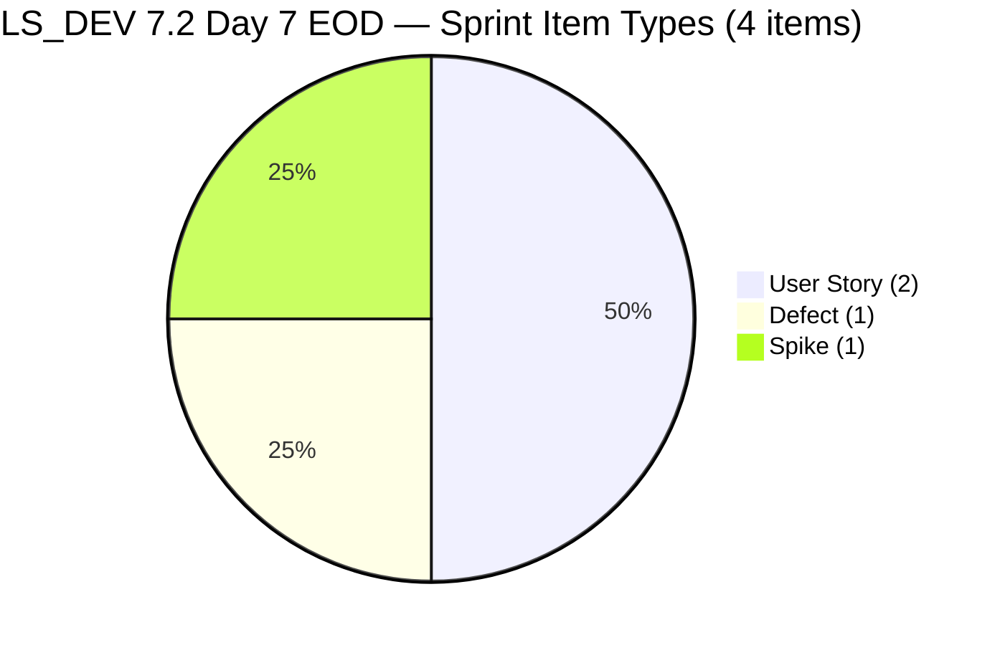
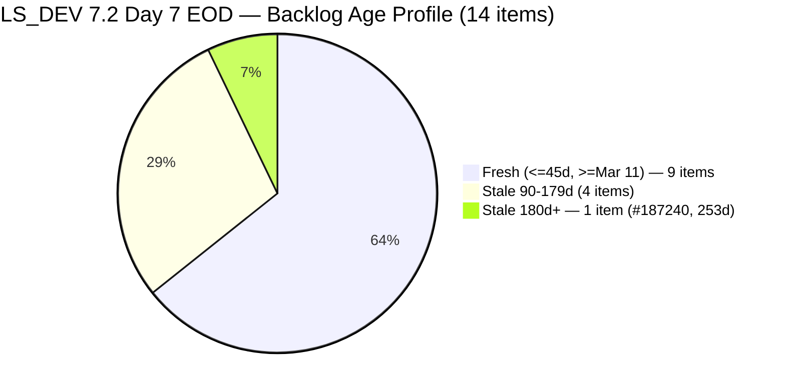
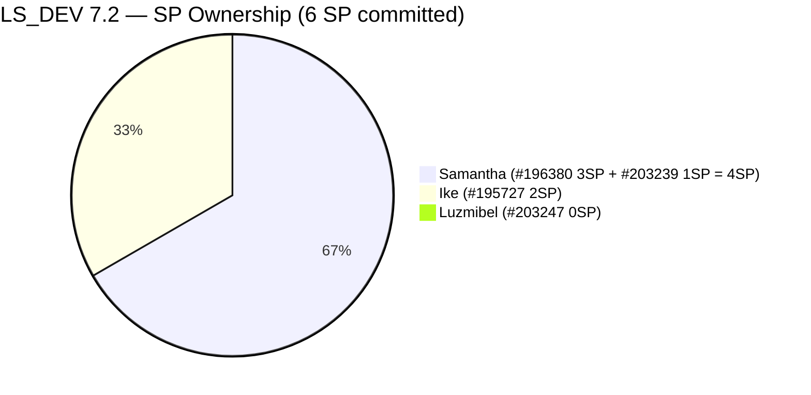
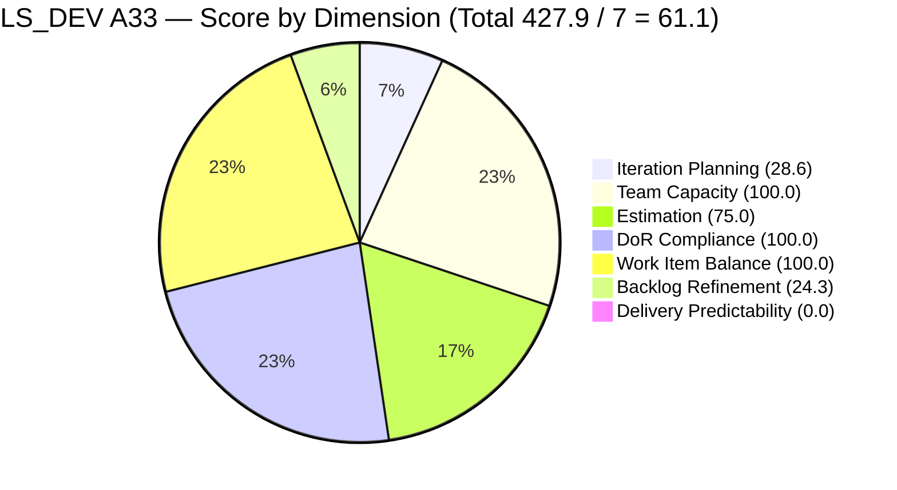

# SAFe Audit Report — Life Style Help App

**Audit A33 | Iteration 7.2 (Apr 20 – May 3, 2026) | Day 7 of 14 (50% elapsed — Sprint Midpoint EOD)**

---

## 1. Audit Metadata

| Field | Value |
|---|---|
| **Audit Date** | April 26, 2026, 22:05 PHT |
| **Auditor** | Claude Code (ADO SAFe Audit Agent) |
| **Workspace** | `ado_ls_dev` |
| **ADO Project** | Life Style Help App (`0f447778-7156-4451-ab21-27be3c4a5888`) |
| **Team** | Life Style Help App Team (`a2a805bc-0b30-4ef3-9a8a-b7f3081157a6`) |
| **Iteration** | Iteration 7.2 — Apr 20 to May 3, 2026 |
| **Iteration ID** | `71cd2555-1e1c-4767-8a57-393f87aabe1f` |
| **Sprint Day** | Day 7 of 14 (50% elapsed — sprint midpoint EOD) |
| **Prior Audit** | AUDIT_20260426_1400.md (A32, Iter 7.2 Day 7, 14:00 PHT, Overall 61.1 — Moderate Risk) |
| **Scoring Model** | ADO SAFe v1 (7-dimension rubric) |
| **Overall Score** | **61.1 / 100** |
| **Risk Band** | **Moderate Risk** (60–79.9) |

---

## 2. Executive Summary

Life Style Help App holds at **61.1 (Moderate Risk)** on Day 7 EOD — **no change from A32 (14:00 PHT)**. The live ADO pull confirms **zero state changes** across all 14 visible backlog items in the 8 hours since A32. The four sprint items show identical states and ChangedDates.

**Sprint midpoint EOD alarm:** The team has now completed Day 7 with **0 of 6 SP closed**. All four committed items remain in their same states as April 24 — a **61+ hour ADO silence window** that now spans across the entire midpoint day. This is the **3rd consecutive full-day audit (A31→A32→A33) with zero delivery signal.**

**Key unchanged facts:**
- **#195727 (Ike, Meal Time Filter Bug, 2 SP)** — in "Ready for Dev" for 9+ calendar days; last touched Apr 17. **Untouched ratio = 1/4 = 25%.** If #203239 closes before Ike activates this item, BR collapses from 24.3 → 4.3 (−20 untouched penalty) and Overall drops below Moderate Risk.
- **#203247 (Luzmibel, Spike)** — SP still null after 3 consecutive audits since DoR was fixed. 1-minute fix outstanding.
- **#187240 ("Evaluate Deployment Options")** — now **253 days stale**, 17th consecutive audit without disposal.
- **Backlog Refinement at 24.3** — structural dual-penalty (-20 stale_90 + -20 stale_180). The most suppressed dimension in this workspace.

The team's score has been locked at 61.1 for three consecutive audits (A30–A33, Apr 24–26). The score will not move until at least one sprint item closes or a backlog structural action is taken.

---

## 3. Previous Audit Delta

| Dimension | A32 — Day 7 14:00 PHT | A33 — Day 7 22:05 PHT | Delta | Change Driver |
|---|---|---|---|---|
| Iteration Planning | 28.6 | **28.6** | 0.0 | 4/14 unchanged |
| Team Capacity | 100.0 | **100.0** | 0.0 | — |
| Estimation | 75.0 | **75.0** | 0.0 | #203247 SP still null |
| DoR Compliance | 100.0 | **100.0** | 0.0 | — |
| Work Item Balance | 100.0 | **100.0** | 0.0 | — |
| Backlog Refinement | 24.3 | **24.3** | 0.0 | — |
| Delivery Predictability | 0.0 | **0.0** | 0.0 | No closures |
| **Overall** | **61.1** | **61.1** | **0.0** | — |

### ADO Activity Since A32 (8h05m elapsed)

**No ADO changes detected.** All 14 visible backlog items — and all 4 sprint items — have identical ChangedDates to A32:

| Item | Status | Last Changed |
|---|---|---|
| #196380 | Ready for Dev — unchanged | Apr 20 03:13 UTC |
| **#195727** | Ready for Dev — **unchanged since Apr 17** | Apr 17 03:35 UTC |
| #203239 | Active — unchanged | Apr 24 00:56 UTC |
| #203247 | Active — unchanged | Apr 24 01:09 UTC |

**The entire team has been ADO-silent since Apr 24 01:09 UTC — now 69+ hours.**

---

## 4. Current Iteration Snapshot

| Metric | Value |
|---|---|
| **Iteration** | 7.2 — Apr 20 to May 3, 2026 |
| **Iteration Day** | Day 7 of 14 (50% elapsed — sprint midpoint EOD) |
| **Visible root backlog items** | **14** (unchanged) |
| **Current iteration root items (7.2)** | **4** (unchanged) |
| **Point-eligible items in sprint** | 4 |
| **Estimated items (SP > 0)** | **3** (#196380=3SP, #195727=2SP, #203239=1SP; #203247=null) |
| **Committed Story Points** | **6 SP** |
| **Closed Story Points** | **0 SP** |
| **Delivery Predictability** | **0.0%** |
| **Contributors with current work** | 3 (Samantha, Ike, Luzmibel) |
| **Team capacity** | 3h/day (Samantha 1h Dev, Ike 1h Dev, Luzmibel 1h Testing) |
| **Untouched sprint items** | 1/4 = 25.0% (#195727 — Apr 17) |
| **Working days remaining** | 6 (Apr 27–30 + May 2–3, excl. May 1 Labor Day) |
| **Fresh items (≥ Mar 10, 2026)** | 9 of 14 |
| **Stale items (>90d, < Jan 26, 2026)** | 5 of 14 |
| **Stale items (>180d, < Oct 28, 2025)** | 1 of 14 (#187240 — **253 days as of Apr 26**) |

### Sprint Item Register — Iteration 7.2 (4 items / 6 SP)

| ID | Title | Type | State | SP | DoR | Assignee | Last Changed | Notes |
|---|---|---|---|---|---|---|---|---|
| **196380** | Default Pinned Post for New Users | User Story | Ready for Dev | 3 | PASS | Samantha Babael | Apr 20 | 7 sprint days un-started |
| **195727** | Meal time filter doesn't respond with text in search bar | User Story | Ready for Dev | 2 | PASS | Ike Yana | **Apr 17** | **UNTOUCHED 10 days / 8 sprint days** |
| **203239** | Investigate member emilienaess97@gmail.com | Defect | Active | 1 | PASS | Samantha Babael | Apr 24 | Active; **69+ hours ADO silence** |
| **203247** | 7.2 Collaborations/Check Heges Raised Issues/Replicate | Spike | Active | **—** | PASS | Luzmibel Paculanang | Apr 24 | Active; SP null; **69+ hours ADO silence** |

---

## 5. Work Item Analysis







### Velocity Outlook — Day 7 EOD

| Scenario | SP to close | Days left | SP/day needed | Feasibility |
|---|---|---|---|---|
| 100% DP (6 SP) | 6 | 6 | 1.0/day | **Achievable** — PI7.1 proved this pace |
| 80% DP (~5 SP) | 5 | 6 | 0.83/day | **Achievable** |
| Zero additional closes | 0 | — | — | Overall stays 61.1; DP stays 0 |

**Sprint scope is 6 SP — the smallest commitment in the LS_DEV PI7 series.** Mathematically, full delivery is achievable in 6 remaining days. The constraint is not pace — it is activation. Both Active items (#203239, #203247) have been silent for 69 hours. #195727 has been in Ready for Dev for 10 calendar days without Ike starting it.

**CRITICAL BR trap (unchanged from A32):** If #203239 (Defect, Samantha) closes before #195727 is moved to Active:
- Untouched sprint items = 1/3 = **33.3% > 30% threshold** → −20 BR penalty triggered
- BR = max(0, 64.3 − 20 − 20 − 20) = **4.3** (catastrophic drop)
- Overall = round((28.6+100+75+100+100+4.3+16.7)/7,1) = **~60.7** — declining below current Moderate Risk floor

---

## 6. SAFe Compliance Scorecard

| Dimension | Score | Evidence | Notes |
|---|---|---|---|
| Iteration Planning | **28.6** | 4/14 visible root items in 7.2 | Unchanged — 17 consecutive audits at this level |
| Team Capacity | **100.0** | 3/3 contributors with configured capacity | Samantha 1h Dev, Ike 1h Dev, Luzmibel 1h Testing |
| Estimation | **75.0** | 3/4 items have SP > 0; #203247 null | Unchanged — 4 audits since DoR fix |
| DoR Compliance | **100.0** | 4/4 items pass Desc ≥30 nws + AC ≥20 nws | Maintained |
| Work Item Balance | **100.0** | US=50%; Defect=25%; Spike=25% — all penalty gates clear | Maintained |
| Backlog Refinement | **24.3** | fresh=9/14=64.3%; stale_90=5/14=35.7% → −20; stale_180=1 → −20 | Structural dual-penalty; #187240 now 253d |
| Delivery Predictability | **0.0** | 0 SP closed / 6 SP committed — Day 7 EOD | 3rd consecutive full day audit with zero delivery |
| **Overall Score** | **61.1** | (28.6+100.0+75.0+100.0+100.0+24.3+0.0) / 7 = 427.9 / 7 | **Moderate Risk** (60–79.9) |

### Score Computation Detail

```
1. Iteration Planning
   visible_root_backlog_items          = 14
   current_iteration_root_items        = 4
   Score = round(4/14 × 100, 1)        = 28.6

2. Team Capacity
   contributors_with_current_work      = 3
   contributors_with_capacity          = 3
   Score = round(3/3 × 100, 1)         = 100.0

3. Estimation
   point_eligible                      = 4
   estimated (SP > 0)                  = 3 (#196380=3, #195727=2, #203239=1)
   #203247 SP = null
   Score = round(3/4 × 100, 1)         = 75.0

4. DoR Compliance
   current_iteration_root_items        = 4
   dor_compliant                       = 4
   Score = round(4/4 × 100, 1)         = 100.0

5. Work Item Balance
   User Story present = Yes            → no −40
   dominant_type (US) = 2/4 = 50%      → NOT >60% → 0
   spike_share = 1/4 = 25%             → NOT >40% → 0
   Score = max(0, 100 − 0)            = 100.0

6. Backlog Refinement
   fresh (≥ Mar 10, 2026)              = 9/14 = 64.3%   → base = 64.3
   stale_90 (< Jan 26, 2026)           = 5/14 = 35.7%   → >25% → −20
   stale_180 (< Oct 28, 2025)          = 1 (#187240)     → ≥1 → −20
   untouched_current (< Apr 20)        = 1/4 = 25.0%     → NOT >30% → 0
   Score = max(0, 64.3 − 20 − 20)     = 24.3

7. Delivery Predictability
   committed_SP                        = 6
   closed_SP                           = 0
   Score = round(0/6 × 100, 1)         = 0.0

Overall = round((28.6+100.0+75.0+100.0+100.0+24.3+0.0)/7, 1)
        = round(427.9/7, 1) = 61.1  →  MODERATE RISK
```

### Recovery Path to Low Risk

```
Base (A33): 61.1

Step 1 — Set #203247 SP (Luzmibel, 1 min):
  Est = 100.0 (+25.0)
  Overall = 64.7

Step 2 — Ike activates #195727 (protects BR; untouched ratio drops to 0%):
  No score change now; protects against −20 BR collapse if #203239 closes first.
  Critical prerequisite for any delivery.

Step 3 — Close all 4 sprint items (6 SP total):
  DP = round(6/6 × 100, 1) = 100.0 (+14.3 to overall from Step 1 base)
  Overall = 79.0

Step 4 — Dispose #187240 (Ike):
  Removes stale_180 −20 penalty; BR rises 24.3 → 44.3 (+20 to BR = +2.9 overall)
  Overall = 81.9 → LOW RISK ✓

Step 5 (optional) — Triage 2+ stale_90 items (< 25% threshold):
  BR = 64.3 (no stale_90 penalty) → further +2.9 overall
  Overall ≈ 84.8
```

---

## 7. Dimension Findings

### 7.1 Iteration Planning — 28.6 (High Risk — unchanged 17 audits)

4 of 14 visible root backlog items are in Iteration 7.2. Score has been locked at 28.6 since A28 (Day 4). Ten items remain in the backlog outside the current sprint. Two DoR-ready candidates remain available for sprint commitment if scope needs to be expanded: #195716 (Hide recipe card fields, 2 SP, Samantha) and #187242 (Assess Mobile Performance, 2 SP, Ike). Committing both would raise IP from 28.6 to round(6/14×100,1) = 42.9%.

### 7.2 Team Capacity — 100.0 (Low Risk)

Three contributors configured: Samantha 1h Dev, Ike 1h Dev, Luzmibel 1h Testing. Total 3h/day × 6 remaining working days = 18 person-hours available. Sufficient to complete 6 SP at the team's pace. Team capacity API confirms 3h/day for the Life Style Help App team with 0 days off remaining.

### 7.3 Estimation — 75.0 (High Risk — 4 consecutive audits unaddressed)

#203247 (Spike, Luzmibel Paculanang) SP remains null. This has been flagged in A30, A31, A32, and A33 — **4 consecutive audits covering 2+ days since DoR was fixed**. Setting SP = 1 or 2 takes under 1 minute and moves Estimation from 75.0 to 100.0 (+3.6 overall).

### 7.4 DoR Compliance — 100.0 (Low Risk — maintained)

All 4 sprint items pass DoR thresholds:
- **#196380 (Default Pinned Post):** Full As-a/I-want/So-that + 6-item checkbox AC ✓
- **#195727 (Meal Time Filter Bug):** Step-by-step repro + expected vs actual result format ✓
- **#203239 (Billing Investigation):** Detailed investigation scope + clear billing condition AC ✓
- **#203247 (Hege Issues Spike):** Multi-bullet collaboration scope + 5-item AC checklist ✓

### 7.5 Work Item Balance — 100.0 (Low Risk)

Sprint type distribution: US=50% (2/4), Defect=25% (1/4), Spike=25% (1/4). All penalty gates clear:
- User Story present → no −40
- dominant_type (US) = 50% → NOT >60% → no −30
- Spike = 25% → NOT >40% → no −20
Score = 100.0. This balance would be disrupted if a Defect or Spike closes before both User Stories are active, but current composition is healthy.

### 7.6 Backlog Refinement — 24.3 (Critical — structural, unchanged 17 audits)

| Gate | Threshold | Current | Status | Penalty |
|---|---|---|---|---|
| fresh_visible (≥ Mar 10, 2026) | n/a | 9/14 = 64.3% | Base = 64.3 | — |
| stale_90 (< Jan 26, 2026) | >25% → −20 | 5/14 = 35.7% | **TRIGGERED** | −20 |
| stale_180 (< Oct 28, 2025) | ≥1 → −20 | 1 (#187240, **253 days**) | **TRIGGERED** | −20 |
| untouched_current (< Apr 20) | >30% → −20 | 1/4 = 25.0% | Cleared | 0 |
| **Net** | | 64.3 − 40 = 24.3 | | **24.3** |

**Five stale_90 items (< Jan 26, 2026):** #194386 (PI4-path Defect), #195229 (PI5), #194082 (PI5), #194084 (PI5), and one additional. These are assigned to former contributors (Sanny Paul Geraldino) and represent legacy backlog debt. Closing 2 items reduces stale_90 below 25% — removing the −20 stale_90 penalty (BR: 24.3 → 44.3).

**#187240 at 253 days — 17th consecutive audit.** The item has a title of "[POC] - Evaluate Deployment Options for Bubble-Based Mobile Apps" and is assigned to Ike Yana. Closing it removes the stale_180 −20 penalty (BR: 24.3 → 44.3, or combined with stale_90 fix: BR up to 64.3).

**The untouched current-sprint trap is now at its highest risk level.** With 1/4 = 25% and the 30% threshold just 1 sprint item closure away, the sequence of actions on Apr 27 is critical:
1. Ike must activate #195727 BEFORE Samantha closes #203239.
2. Once #195727 is Active, closing #203239 reduces untouched to 0/3 = 0% — safe.
3. If #203239 closes first, untouched = 1/3 = 33.3% → −20 penalty → BR = 4.3 → Overall ≈ 57 (High Risk).

### 7.7 Delivery Predictability — 0.0 (CRITICAL — Day 7 EOD)

**Zero SP closed across the entire Day 7 (14:00 PHT audit and 22:05 PHT audit).** The team has produced zero delivery signal for 69+ hours. Day 7 is complete with 0/6 SP delivered.

**Item activation status (EOD Day 7):**

| Item | State | SP | Days in Current State | Note |
|---|---|---|---|---|
| #195727 | Ready for Dev | 2 | 10 calendar days (since Apr 17) | Never activated this sprint |
| #196380 | Ready for Dev | 3 | 7 sprint days | Never activated this sprint |
| #203239 | Active | 1 | 4 days (since Apr 23) | 69h ADO silence |
| #203247 | Active | — | 3 days (since Apr 24) | 69h ADO silence; SP null |

**6 working days remain. All 6 SP can still be closed.** The team demonstrated 100% DP in PI7.1 (perfect sprint). The capability exists — the blocker is activation inertia on #195727 and #196380, and progress communication on #203239 and #203247.

---

## 8. Risks and Bottlenecks

| # | Risk | Severity | Owner | Status vs A32 |
|---|---|---|---|---|
| R1 | **#195727 (Ike) untouched — 10 calendar days, 8 sprint days.** Untouched ratio 25.0%. One closure before activation triggers −20 BR penalty (BR: 24.3 → 4.3, Overall: 61.1 → ~57). | **CRITICAL** | Ike Yana | Escalated — now 8 sprint days |
| R2 | **Zero delivery at Day 7 EOD.** 69+ hour ADO silence. 0% DP at 50% elapsed. | **HIGH** | All | Escalated — full day 7 with no delivery |
| R3 | **#187240 — 253 days stale.** 17 consecutive audits without disposal. −20 BR penalty persists. | **HIGH** | Ike Yana | +1 day — record 17 audits |
| R4 | **Samantha owns 67% of estimated SP (4 SP)** with both items stalled (#203239 Active 69h, #196380 unstarted 7 days). | **HIGH** | Samantha | Unchanged |
| R5 | **5 stale_90 items (35.7%) — −20 BR penalty.** Legacy assigned to former contributors. | **MEDIUM** | Team Lead / PO | Structural — 17 audits |
| R6 | **#203247 (Spike) SP null — 4 consecutive audits.** Estimation gap persists post-DoR fix. | **MEDIUM** | Luzmibel | Escalated to 4th audit |
| R7 | **#203239 (Defect) Active 69 hours without ADO update.** Investigation may be complete; not closed. | **MEDIUM** | Samantha | Escalated — 69h silence |
| R8 | **Backlog Refinement structural at 24.3.** Requires #187240 disposal + stale_90 triage to recover. | **MEDIUM** | Team Lead | Unchanged |
| R9 | **No sprint goal defined for 7.2.** | **LOW** | Ramon / Team Lead | Persistent |

---

## 9. Prioritized Recommendations

### P0 — Apr 27 MORNING — CRITICAL SEQUENCE

**1. [IKE — FIRST ACTION OF DAY] Activate #195727 (Meal Time Filter Bug, 2 SP)**
Move from "Ready for Dev" to "Active" and add a progress comment. This is not optional — it must happen BEFORE any sprint item closes to prevent the BR collapse trap.
- Risk if skipped: BR 24.3 → 4.3; Overall 61.1 → ~57 (High Risk) if Samantha closes #203239 first.
- Action: Move state → Active; add comment: "Investigating meal time filter issue. Confirmed reproduction."

**2. [LUZMIBEL — FIRST ACTION OF DAY] Set SP on #203247 (Heges Issues Spike)**
Set SP = 1 or 2. Four consecutive audits with this unfixed after DoR was corrected. Takes under 1 minute.
- Impact: Estimation 75.0 → 100.0; Overall 61.1 → 64.7 (+3.6).

**3. [SAMANTHA — Apr 27 AM] Add ADO update to #203239 (Billing Investigation)**
69 hours without an ADO comment is unacceptable for an Active item. Document investigation findings:
- Has the cancellation been confirmed as processed? Was billing triggered after effective date? What system records show?
- If investigation is complete → close the item (but ONLY AFTER Ike activates #195727 per Step 1 above).

**4. [SAMANTHA — Apr 27] Activate #196380 (Default Pinned Post, 3 SP)**
7 sprint days in Ready for Dev without activation. Move to Active and begin implementation.

### P1 — Apr 27–28

**5. Close #203239 (1 SP) once investigation is documented** (and #195727 is Active).
First SP delivery of the sprint. DP: 0.0 → 16.7 (+2.4 overall, reaching 67.1).

**6. Dispose #187240 "Evaluate Deployment Options" — Ike (30 minutes)**
253 days stale, 17 audits unfixed. Close as Won't Fix, or update iteration assignment to PI7. Removes stale_180 −20 BR penalty.
- After disposal AND #203247 SP set AND closing #203239: Overall = round((28.6+100+100+100+100+44.3+16.7)/7,1) = round(489.6/7,1) = **70.0** — significant jump.

### P2 — Remaining Sprint (Apr 27–May 3)

**7. Close all 4 sprint items.** Achieve 100% DP.
**8. Triage 2+ stale_90 items** (close or re-path #194082, #194084, #194386, #195229). Brings stale_90 below 25% threshold (BR: 44.3 → 64.3).
**9. Define 7.2 sprint goal.** Suggested: *"By May 3, resolve Hege/emiliene billing issues, implement Default Pinned Post, fix Meal Time Filter bug, and achieve 100% delivery on all committed items."*

---

## 10. Evidence Gaps and Limitations

| Gap | Impact | Notes |
|---|---|---|
| **#195727 silence reason** | 10 days without ADO activity. Blocker (offline work, deprioritization, waiting on environment) unknown via API. | R1 — P0 activation action. |
| **#203239 investigation outcome** | Active 4 days; no visible ADO comment. May be complete but not logged. | P0 — add comment or close. |
| **#203247 SP null** | 4 consecutive audits since DoR fix; SP consistently unset. | P0 — 1 minute. |
| **#187240 age** | ChangedDate Aug 18, 2025; audit date Apr 26, 2026 = 253 days. | Increments daily. |
| **5 stale_90 items ownership** | #194082, #194084 assigned to Sanny Paul Geraldino (not active team member). Disposal requires PO action. | P2 triage. |
| **Sprint goal** | Not visible via API. | Advisory gap. |
| **May 1 holiday** | Labor Day (Philippine). Excludes from working day count — already factored as 6 remaining days. | Confirmed. |

---

## 11. Score Trend — PI7 Life Style Help App Series

| Audit | Date/Time | Sprint Day | Overall | Band |
|---|---|---|---|---|
| A25 | Apr 19 | 7.1 D14 | 82.4 | **Low Risk** |
| A26 | Apr 21 | 7.2 D2 | 41.0 | High Risk |
| A27–A28 | Apr 22–23 AM | 7.2 D3–4 | 41.0 | High Risk |
| A29 | Apr 23 PM | 7.2 D4 | 39.7 | **Critical Risk** |
| A30 | Apr 24 AM | 7.2 D5 | 61.1 | **Moderate Risk** (recovery) |
| A31 | Apr 25 PM | 7.2 D6 | 61.1 | Moderate Risk |
| A32 | Apr 26 14:00 | 7.2 D7 | 61.1 | Moderate Risk |
| **A33** | **Apr 26 22:05** | **7.2 D7 EOD** | **61.1** | **Moderate Risk** |

```mermaid
flowchart LR
    A30["A30 · Apr 24 AM\nDay 5 · 61.1 — Moderate"]
    A31["A31 · Apr 25 PM\nDay 6 · 61.1 — Moderate"]
    A32["A32 · Apr 26 14:00\nDay 7 · 61.1 — Moderate"]
    A33["A33 · Apr 26 22:05\nDay 7 EOD · 61.1 — Moderate"]
    P0["P0 Actions\n(Ike activates + Luzmi sets SP)\n→ 64.7"]
    P1["P1 Actions\n(#203239 close + #187240 dispose)\n→ ~70.0"]
    FULL["Full Recovery\n(all items closed\n+ #187240 disposed)\n→ 81.9 — Low Risk ✓"]
    A30 --> A31 --> A32 --> A33 --> P0 --> P1 --> FULL
    style A30 fill:#eab308,color:#fff
    style A31 fill:#eab308,color:#fff
    style A32 fill:#eab308,color:#fff
    style A33 fill:#eab308,color:#fff
    style P0 fill:#f97316,color:#fff
    style P1 fill:#f97316,color:#fff
    style FULL fill:#22c55e,color:#fff
```





**The score has been flatlined at 61.1 for 4 consecutive audits (A30–A33).** This is the longest stable-flat sequence in the PI7 series for this workspace. The first sprint item to close will break the flat — either upward (if #195727 is already Active → safe) or downward (if #195727 is still in Ready → BR trap triggered). The next 12 hours are the most consequential of this sprint.

---

*Report generated by Claude Code ADO SAFe Audit Agent | April 26, 2026 22:05 PHT*
*Audit A33 — Life Style Help App — Iteration 7.2 Day 7 EOD — Overall: 61.1 / 100 — Moderate Risk (0.0 vs A32)*
*Data source: Live ADO MCP pull — Apr 26, 2026 22:05 PHT | 14 backlog items; 4 current-iteration items; 6 SP committed (3 estimated); 0 SP closed (69+ hour ADO silence)*
