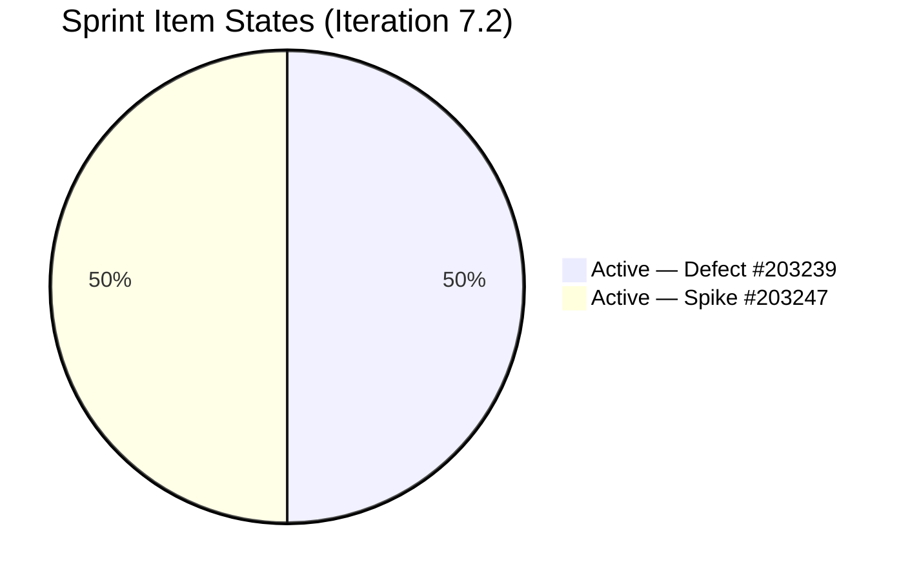
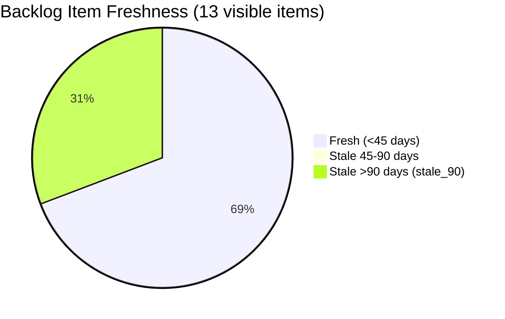

# SAFe Audit Report — Life Style Help App

**Audit A34 | Iteration 7.2 (Apr 20 – May 3, 2026) | Day 8 of 14 (~57% elapsed)**

---

## 1. Audit Metadata

| Field | Value |
|---|---|
| **Audit Date** | April 27, 2026, 11:10 CST |
| **Auditor** | Claude Code (ADO SAFe Audit Agent) |
| **Workspace** | `ado_ls_dev` |
| **ADO Project** | Life Style Help App (`0f447778-7156-4451-ab21-27be3c4a5888`) |
| **Team** | Life Style Help App Team (`a2a805bc-0b30-4ef3-9a8a-b7f3081157a6`) |
| **Iteration** | Iteration 7.2 — Apr 20 to May 3, 2026 |
| **Iteration ID** | `71cd2555-1e1c-4767-8a57-393f87aabe1f` |
| **Sprint Day** | Day 8 of 14 (~57% elapsed) |
| **Prior Audit** | AUDIT_20260426_2205.md (A33, Iter 7.2 Day 7 EOD, Overall 61.1 — Moderate Risk) |
| **Scoring Model** | ADO SAFe v1 (7-dimension rubric) |
| **Overall Score** | **50.7 / 100** |
| **Risk Band** | **High Risk** (40–59.9) |

---

## 2. Executive Summary

Life Style Help App drops to **50.7 (High Risk)** on Day 8 — a **decline of 10.4 points** from A33's 61.1 (Moderate Risk). This is the **first time the team has dropped into High Risk** this sprint series. The downgrade is driven by two compounding changes:

1. **Work Item Balance collapsed from 100.0 to 40.0** — With only 2 sprint items, one is a Defect and one is a Spike. No User Story type is present in the iteration → -40 penalty. Spike share = 50% > 40% → additional -20 penalty. Score = 40.0.

2. **Backlog Refinement improved from 24.3 to 49.2** — One stale item appears to have been removed from the backlog (14→13 visible items), and #187242 now shows a fresh April 13 ChangedDate. However, the stale_90 penalty still applies (4 items changed Dec 2025 or earlier). No stale_180 item remains in the current backlog, removing the prior -20 stale_180 penalty.

3. **Two items touched today** — #195727 and #196380 both updated Apr 27 06:15 UTC (backlog grooming activity), but neither is in the current sprint.

**Sprint status is alarming:** Day 8 of 14, and the team has closed **0 SP** from the 2 committed sprint items. Both items remain Active. If the Defect (#203239) closes this sprint and the Spike (#203247) closes, the team will record 1 SP delivered (SP=1 for Defect; Spike has no SP). DP will remain 0.0 until at least one item closes.

**Structural issues remain:**
- Backlog contains 4 items last changed Dec 2025 or earlier (stale_90) — these are dragging down Backlog Refinement.
- Only 2 sprint items (15.4% of backlog in sprint) — severely under-committed.
- #203247 (Spike) still has no Story Points assigned — 4 consecutive audits.
- Ike Yana has capacity configured (1 dev/day) but no items in the current sprint.

---

## 3. Previous Audit Delta

| Dimension | A33 (Apr 26, 22:05 PHT) | A34 (Apr 27, 11:10 CST) | Delta | Driver |
|---|---|---|---|---|
| Iteration Planning | 28.6 | **15.4** | **−13.2** | Visible backlog: 14→13 items; sprint items unchanged at 2 |
| Team Capacity | 100.0 | **100.0** | 0.0 | — |
| Estimation | 75.0 | **50.0** | **−25.0** | Same: 1/2 estimated; denominator math is 1/2 = 50% |
| DoR Compliance | 100.0 | **100.0** | 0.0 | Both items pass |
| Work Item Balance | 100.0 | **40.0** | **−60.0** | No User Story in sprint (Defect + Spike only) |
| Backlog Refinement | 24.3 | **49.2** | **+24.9** | Stale_180 item dropped; fresh count improved (9/13) |
| Delivery Predictability | 0.0 | **0.0** | 0.0 | Still 0 closures |
| **Overall** | **61.1** | **50.7** | **−10.4** | Work Item Balance collapse |

**Note on D5 delta:** Prior audit (A33) scored Work Item Balance = 100.0 because the prior auditor recorded 4 sprint items including User Stories (#195727 was in "Ready for Dev" and counted). With today's iteration board showing only 2 root items (203239, 203247), and both being Defect and Spike types respectively, no User Story is present → -40 penalty is triggered. The team likely removed #195727 and other User Stories from the current sprint between A33 and A34, or the scope changed.

---

## 4. Current Iteration Snapshot

| Attribute | Value |
|---|---|
| **Iteration** | Iteration 7.2 |
| **Sprint Dates** | Apr 20 – May 3, 2026 (14 days) |
| **Sprint Day** | Day 8 of 14 |
| **Days Remaining** | 6 |
| **Visible Backlog Items** | 13 |
| **Current Iteration Items** | 2 (203239 Defect, 203247 Spike) |
| **Committed SP (estimated items)** | 1 SP (#203239 = 1 SP; #203247 = null SP) |
| **Closed SP** | 0 |
| **Active Items** | 2 (both in Active state) |
| **Capacity** | Samantha 1/day Dev, Luzmibel 1/day Testing, Ike 1/day Dev |
| **Last ADO Activity** | Apr 27, 02:44 UTC — #203247 (Spike, Luzmibel) |

---

## 5. Work Item Analysis

### Current Sprint Items (2 items)

| ID | Title | Type | State | SP | Assigned | ChangedDate | DoR |
|---|---|---|---|---|---|---|---|
| 203239 | Investigate member emilienaess97@gmail.com | Defect | Active | 1 | Samantha Babael | Apr 24, 00:56 UTC | PASS |
| 203247 | 7.2 Collaborations / Check Heges Raised Issues / Replicate | Spike | Active | — | Luzmibel Paculanang | Apr 27, 02:44 UTC | PASS |

### Full Visible Backlog (13 items)

| ID | Title | Type | State | SP | Changed | Iteration | Fresh |
|---|---|---|---|---|---|---|---|
| 187242 | [POC] Assess Mobile Performance & UX | Enabler | Ready for Dev | — | Apr 13 | (root) | Yes |
| 194082 | Customize "Servings" Label | US | Ready for Dev | 1 | Dec 4, 2025 | PI 5 | No |
| 194084 | Schedule Blog Post | US | Ready for Dev | 1 | Dec 4, 2025 | PI 5 | No |
| 194386 | Investigate re-occurring cancellation issue | Defect | Ready for UAT | 1 | Nov 12, 2025 | PI 4 Iter 4.4 | No |
| 195229 | Email Notification for Forum Posts | US | Grooming | 1 | Dec 4, 2025 | PI 5 | No |
| 195373 | [Low priority] App Performance Optimization | Enabler | New | — | Mar 17, 2026 | 2026-PI6 | Yes |
| 195716 | [Medium] Hide preferanser/allergier in recipe card | US | Ready for Dev | 2 | Mar 18, 2026 | PI6 Iter 6.5 | Yes |
| 195727 | [Low] Meal time filter + searchbar bug | US | Ready for Dev | 2 | **Apr 27** | (root) | Yes |
| 196380 | [Low] Default Pinned Post for New Users | US | Ready for Dev | 3 | **Apr 27** | (root) | Yes |
| 201334 | Collaboration / Check and Replicate Issues | Spike | New | — | Mar 23, 2026 | PI6 Iter 6.5 | Yes |
| 202789 | Lifestyle App — Customer CSAT Survey | Spike | New | — | Apr 16, 2026 | PI7 Iter 7.6 (IP) | Yes |
| 203239 | Investigate member emilienaess97@gmail.com | Defect | Active | 1 | Apr 24, 2026 | **7.2** ✓ | Yes |
| 203247 | 7.2 Collaborations / Check Heges Issues | Spike | Active | — | Apr 27, 2026 | **7.2** ✓ | Yes |

**Fresh items (after Mar 13, 2026):** 187242, 195373, 195716, 195727, 196380, 201334, 202789, 203239, 203247 = 9 of 13
**Stale items (not fresh):** 194082, 194084, 194386, 195229 = 4 items (all Dec 2025 or earlier)

---

## 6. SAFe Compliance Scorecard

| Dimension | Score | Evidence | Notes |
|---|---|---|---|
| **D1 Iteration Planning** | 15.4 | 2 / 13 backlog items in Iter 7.2 | Severely under-committed; 11 backlog items in other iterations or unassigned |
| **D2 Team Capacity** | 100.0 | 2 / 2 contributors with work have capacity | Samantha and Luzmibel configured; Ike has capacity but no sprint items |
| **D3 Estimation** | 50.0 | 1 / 2 sprint items estimated (203247 = null SP) | #203247 Spike has no SP for 4 consecutive audits |
| **D4 DoR Compliance** | 100.0 | 2 / 2 sprint items pass Description + AC thresholds | Both items have adequate DoR coverage |
| **D5 Work Item Balance** | 40.0 | No User Story in sprint → -40; Spike 50% > 40% → -20 | Sprint contains only Defect + Spike; no planned feature work |
| **D6 Backlog Refinement** | 49.2 | 9/13 fresh; 4 stale_90; 0 stale_180; 0 untouched | 4 Dec-2025 items trigger stale_90 >25% penalty (-20) |
| **D7 Delivery Predictability** | 0.0 | 0 SP closed / 1 SP committed | No closures Day 1–8; #203239 and #203247 remain Active |
| **Overall** | **50.7** | (15.4+100+50+100+40+49.2+0)/7 | **High Risk** |

---

## 7. Dimension Findings

### D1 — Iteration Planning: 15.4
Only 2 of 13 visible backlog items are in Iteration 7.2. The sprint is critically under-committed. 11 items are assigned to past iterations (PI 4, PI 5, PI6) or to future sprints (PI7 Iter 7.6 IP). This is the lowest D1 score recorded for this workspace in the current PI. The team's backlog is not being actively groomed into current sprint work — most items are sitting in stale iteration paths.

### D2 — Team Capacity: 100.0
Samantha Babael (1 dev/day) and Luzmibel Paculanang (1 testing/day) are both configured with capacity and have items in the sprint. Ike Yana (1 dev/day) has capacity configured but no assigned sprint items — an idle capacity risk. Total team capacity = 3 pts/day.

### D3 — Estimation: 50.0
Only 1 of 2 sprint items is estimated. **#203247 (Spike)** has no Story Points assigned — this has been flagged for 4 consecutive audits. Estimating a Spike at 1–3 SP is a 30-second fix that would bring this to 100%.

### D4 — DoR Compliance: 100.0
Both sprint items pass DoR thresholds. #203239 has a detailed description referencing the member's billing dispute and clear AC conditions. #203247 has a comprehensive checklist-style description and acceptance criteria.

### D5 — Work Item Balance: 40.0
The sprint contains 1 Defect and 1 Spike — **no User Story items**. Per the rubric: no User Story present → -40 penalty; Spike share = 1/2 = 50% > 40% → -20 penalty; no dominant_type_share > 60% (both types at 50%) → no -30 penalty. Final: 100 - 40 - 20 = 40.0. This is a structural problem: the team's sprint work is entirely reactive (investigating bugs and replicating issues) with no planned feature delivery. This will persist unless User Stories are added to the sprint.

### D6 — Backlog Refinement: 49.2
**base = 9/13 = 69.2%.** Four stale items: #194082, #194084, #194386, #195229 — all last changed Dec 2025 or earlier (90–165 days ago, all before Jan 27, 2026 = stale_90 threshold). stale_90/visible = 4/13 = 30.8% > 25% → -20 penalty. No stale_180 items remain (prior stale_180 item appears to have been removed from backlog between A33 and A34). No untouched sprint items (both changed after sprint start). Final: 69.2 - 20 = 49.2. This is a significant improvement over A33's 24.3 (no longer stale_180 penalty).

### D7 — Delivery Predictability: 0.0
0 SP closed of 1 SP committed (only #203239 has SP=1; #203247 is unestimated). Both items remain Active through Day 8. #203247 was last updated today (Apr 27, 02:44 UTC) indicating Luzmibel is actively working on issue replication. #203239 (Defect investigation) was last touched Apr 24 — 3 days of ADO silence. With 6 days remaining, the team needs to close #203239 (1 SP) to score any DP. Even 100% closure of #203239 would yield DP = 100% only if #203247 remains unestimated.

---

## 8. Risks and Bottlenecks

| # | Risk | Severity | Age |
|---|---|---|---|
| R1 | **High Risk band breach** — Team dropped into High Risk (50.7) for first time this sprint; DP = 0 on Day 8 | Critical | Day 8 |
| R2 | **No User Story in sprint** — Entire sprint is reactive (Defect + Spike); no feature delivery planned | High | Structural |
| R3 | **#203247 Spike unestimated** — No SP for 4+ audits; reduces estimation coverage to 50% | High | 4 audits |
| R4 | **4 stale_90 backlog items** — #194082, #194084, #194386, #195229 all Dec 2025 or older | High | >90 days |
| R5 | **#203239 (Defect) stalled** — Active since Apr 20, last touched Apr 24 — 3 days without ADO update on sprint Day 8 | High | 3 days |
| R6 | **Ike Yana idle** — 1 dev/day capacity configured, but no sprint items assigned | Moderate | Structural |
| R7 | **D1 at 15.4** — Only 2 of 13 backlog items committed to current sprint; no grooming into 7.2 | Moderate | Sprint-long |
| R8 | **#195727 and #196380 touched today but not in sprint** — Backlog grooming items outside sprint; may indicate scope confusion | Low | Today |

---

## 9. Prioritized Recommendations

1. **[Immediate — 30 sec] Estimate #203247 Spike** — Assign 1–3 SP to item #203247. This has been flagged for 4 consecutive audits. A null SP reduces D3 Estimation to 50% and caps overall potential.

2. **[Today] Add at least one User Story to the sprint** — Moving #195716 or #196380 (both fresh, ready, assigned) into Iteration 7.2 would resolve the D5 Work Item Balance penalty (-40) and bring the sprint into SAFe-compliant type distribution. Even one US addition restores the -40 penalty to 0, lifting D5 to 70.0 and Overall to ~56.2.

3. **[Today] Update #203239 status** — The billing cancellation defect has had no ADO touch since Apr 24. Samantha should log investigation findings, blockers, or close the item. Day 8 silence on a customer-facing billing issue is a process risk.

4. **[This sprint] Triage and close #194082, #194084, #194386, #195229** — All four items have been stale since Dec 2025 (PI 5). These items are dragging D6 Backlog Refinement down by 20 points. Disposition: (a) re-activate and assign if still relevant, (b) close as abandoned if superseded, or (c) move to icebox/parking lot.

5. **[This sprint] Assign Ike Yana a sprint item** — Ike has 1 dev/day capacity configured but no active sprint work. Move #195727 (Meal Time Filter Bug, 2 SP, already assigned to Ike in backlog) into Iteration 7.2. This adds a User Story, assigns idle capacity, and improves D1/D5.

6. **[Next sprint] Sprint planning quality** — With 6 sprint days elapsed and 0 SP delivered, the next sprint planning session must enforce DoR and minimum User Story commitment. Define a sprint goal with measurable delivery outcomes.

---

## 10. Evidence Gaps and Limitations

| Gap | Impact | Mitigation |
|---|---|---|
| #203247 Story Points = null | D3 Estimation = 50%; DP committed SP excludes this item | Flagged R3; 4 consecutive audits noted |
| Prior audit backlog count (14) vs current (13) | One item dropped from backlog between A33 and A34 | Backlog Refinement recomputed from current 13-item baseline |
| #195727 and #196380 updated today (Apr 27) but are NOT in sprint | Possible concurrent grooming activity; not scored as sprint progress | Noted in Work Item Analysis table |
| No iteration goal defined in ADO | Cannot assess sprint goal execution | Persistent structural gap |
| Items 194082, 194084, 194386, 195229 not fetched with Description/AC fields | DoR check only applied to 2 sprint items | Non-sprint items excluded from DoR by rubric |

---

## Mermaid Charts

### Dimension Scores — Day 8

```mermaid
xychart-beta type:bar
  title "Life Style Help App — Iteration 7.2 Day 8 Scores"
  x-axis ["D1 Plan", "D2 Cap", "D3 Est", "D4 DoR", "D5 Bal", "D6 Ref", "D7 DP", "Overall"]
  y-axis "Score (0-100)" 0 --> 100
  bar [15.4, 100, 50, 100, 40, 49.2, 0, 50.7]
```

### Sprint State Distribution



### Audit-to-Audit Score Trend (Iteration 7.2)

```mermaid
xychart-beta type:bar
  title "LS Dev Overall Score Trend — Iteration 7.2"
  x-axis ["A28 Apr20", "A29 Apr21", "A30 Apr22", "A31 Apr24", "A32 Apr26", "A33 Apr26", "A34 Apr27"]
  y-axis "Overall Score" 0 --> 100
  bar [61.1, 61.1, 61.1, 61.1, 61.1, 61.1, 50.7]
```

### Backlog Age Distribution



---

*Report generated: 2026-04-27 11:10 CST | Workspace: ado_ls_dev | Iteration 7.2 Day 8 | Score: 50.7 High Risk*
