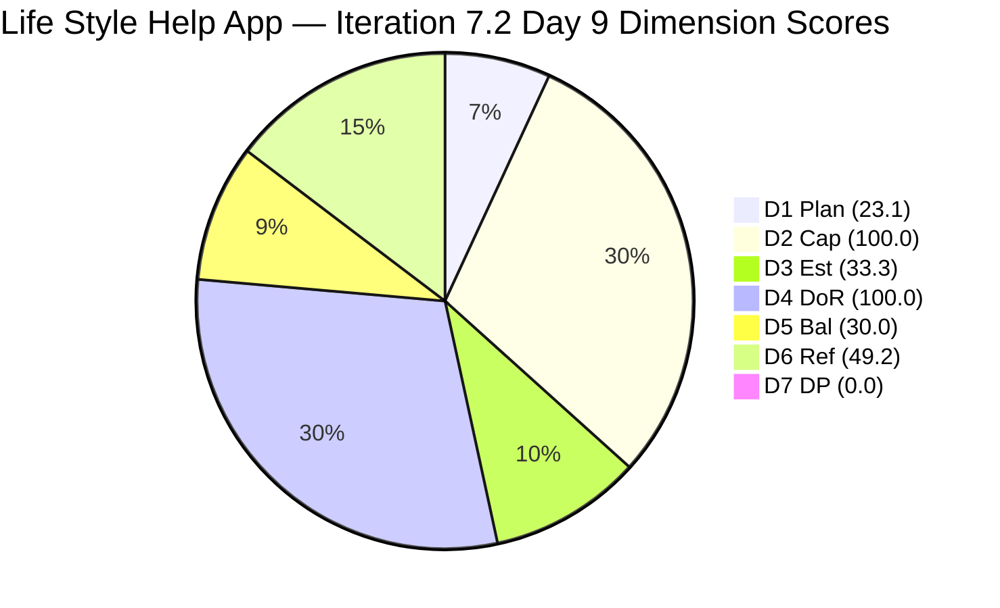
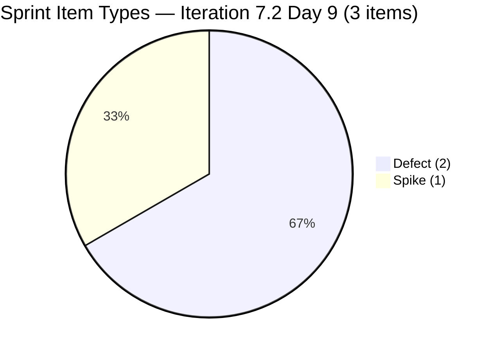
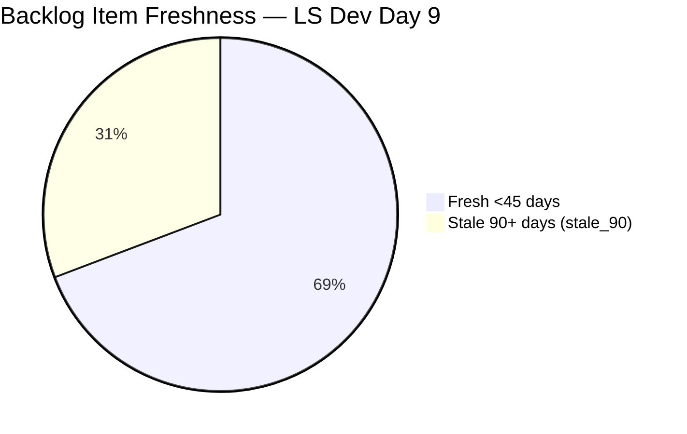
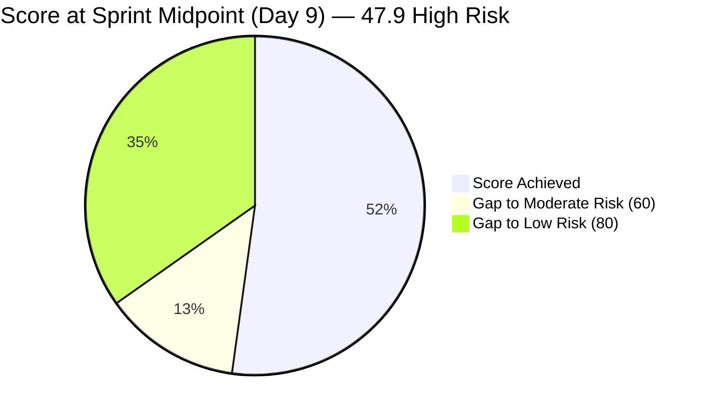
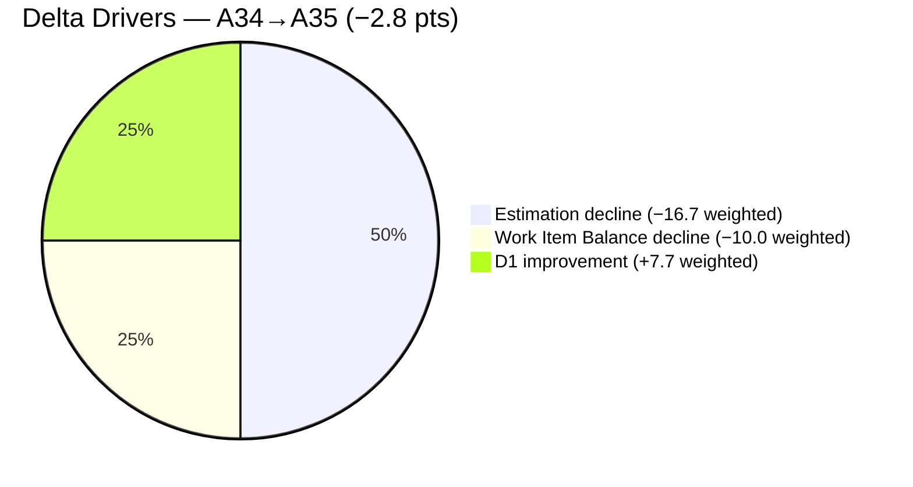

# SAFe Audit Report — Life Style Help App

**Audit A35 | Iteration 7.2 (Apr 20 – May 3, 2026) | Day 9 of 14 (~64% elapsed)**

---

## 1. Audit Metadata

| Field | Value |
|---|---|
| **Audit Date** | April 28, 2026, 02:03 UTC |
| **Auditor** | Claude Code (ADO SAFe Audit Agent) |
| **Workspace** | `ado_ls_dev` |
| **ADO Project** | Life Style Help App (`0f447778-7156-4451-ab21-27be3c4a5888`) |
| **Team** | Life Style Help App Team (`a2a805bc-0b30-4ef3-9a8a-b7f3081157a6`) |
| **Iteration** | Iteration 7.2 — Apr 20 to May 3, 2026 |
| **Iteration ID** | `71cd2555-1e1c-4767-8a57-393f87aabe1f` |
| **Sprint Day** | Day 9 of 14 (~64% elapsed) |
| **Prior Audit** | AUDIT_20260427_1110.md (A34, Iter 7.2 Day 8, Overall 50.7 — High Risk) |
| **Scoring Model** | ADO SAFe v1 (7-dimension rubric) |
| **Overall Score** | **47.9 / 100** |
| **Risk Band** | **High Risk** (40–59.9) |

---

## 2. Executive Summary

Life Style Help App scores **47.9 (High Risk)** on Day 9 of 14 — a **decline of 2.8 points from A34 (50.7)**. The team remains in High Risk for the second consecutive audit. The score drop is driven by:

1. **A new sprint item added (#203390 — Defect, Active)** — "Subscription Automatically Cancels at End of Binding Period" joined the current iteration, expanding sprint items from 2 to 3. This adds a second Defect (making the type split: 2 Defects + 1 Spike), increasing Defect dominance (66.7% > 60%) and triggering an additional -30 Work Item Balance penalty on top of the existing -40 (no User Story). D5 drops from 40.0 to 30.0.

2. **D1 Iteration Planning declines** — Visible backlog remains 13 items; sprint items grow from 2 to 3. D1 = 3/13 = 23.1 (up slightly from 15.4 in A34).

3. **D3 Estimation declines** — 3 sprint items now; only 1 has SP (203239 = 1 SP). D3 = 1/3 = 33.3 (down from 50.0).

4. **D7 Delivery Predictability = 0.0** — 9 sprint days elapsed, 0 items closed, 0 SP delivered. Both #203239 (Defect, billing investigation) and #203390 (Defect, subscription auto-cancellation) are Active. #203247 (Spike, issue replication) is Active. All three items remain unresolved.

**Sprint is in critical territory:** Day 9 of 14 with 0 SP delivered, 3 reactive items (2 Defects + 1 Spike), no User Stories, and capacity under-utilization. The team is running entirely on customer support and investigation work with no planned feature delivery.

**Structural issues deteriorating:**
- Ike Yana has capacity configured (1 dev/day) but no sprint items — 9 consecutive days of idle dev capacity.
- 4 stale_90 backlog items (194082, 194084, 194386, 195229) persist — unchanged since Dec 2025.
- No sprint goal, no PI objectives linked.

---

## 3. Previous Audit Delta

| Dimension | A34 (Apr 27, 11:10 CST) | A35 (Apr 28, 02:03 UTC) | Delta | Driver |
|---|---|---|---|---|
| Iteration Planning | 15.4 | **23.1** | **+7.7** | Sprint grew from 2→3 items; backlog unchanged at 13 |
| Team Capacity | 100.0 | **100.0** | 0.0 | — |
| Estimation | 50.0 | **33.3** | **−16.7** | 3 sprint items; only 203239 has SP (1/3) |
| DoR Compliance | 100.0 | **100.0** | 0.0 | All 3 sprint items pass |
| Work Item Balance | 40.0 | **30.0** | **−10.0** | 203390 (Defect) added: 2 Defects (66.7% > 60%) → additional -30 |
| Backlog Refinement | 49.2 | **49.2** | 0.0 | No backlog changes detected |
| Delivery Predictability | 0.0 | **0.0** | 0.0 | Still 0 closures; Day 9 |
| **Overall** | **50.7** | **47.9** | **−2.8** | Estimation + Work Item Balance decline |

---

## 4. Current Iteration Snapshot

| Attribute | Value |
|---|---|
| **Iteration** | Iteration 7.2 |
| **Sprint Dates** | Apr 20 – May 3, 2026 (14 days) |
| **Sprint Day** | Day 9 of 14 |
| **Days Remaining** | 5 |
| **Visible Backlog Items** | 13 |
| **Current Iteration Items** | 3 (203239, 203390, 203247) |
| **Committed SP (estimated visible items)** | 1 SP (#203239 only) |
| **Closed SP** | 0 |
| **Active Items** | 3 (all Active) |
| **Capacity** | Samantha 1/day Dev, Luzmibel 1/day Testing, Ike 1/day Dev (idle) |
| **Last ADO Activity** | Apr 28, 03:40 UTC — #203390 (Defect, Samantha) |

---

## 5. Work Item Analysis

### Current Sprint Items (3 root items)

| ID | Title | Type | State | SP | Assigned | ChangedDate | DoR |
|---|---|---|---|---|---|---|---|
| 203239 | Investigate member emilienaess97@gmail.com | Defect | Active | 1 | Samantha Babael | Apr 24 | PASS |
| 203390 | Subscription Auto-Cancels at End of Binding Period | Defect | Active | — | Samantha Babael | Apr 28 | PASS |
| 203247 | 7.2 Collaborations / Check Heges Issues / Replicate | Spike | Active | — | Luzmibel Paculanang | Apr 27 | PASS |

### Full Visible Backlog (13 items)

| ID | Title | Type | State | SP | ChangedDate | Sprint? | Fresh |
|---|---|---|---|---|---|---|---|
| 194082 | Customize "Servings" Label | US | Ready for Dev | 1 | Dec 4, 2025 | No | No |
| 194084 | Schedule Blog Post | US | Ready for Dev | 1 | Dec 4, 2025 | No | No |
| 194386 | Investigate re-occurring cancellation issue | Defect | Ready for UAT | 1 | Nov 12, 2025 | No | No |
| 195229 | Email Notification for Forum Posts | US | Grooming | 1 | Dec 4, 2025 | No | No |
| 195373 | App Performance Optimization | Enabler | New | — | Mar 17, 2026 | No | Yes |
| 195716 | Hide preferanser/allergier in recipe card | US | Ready for Dev | 2 | Mar 18, 2026 | No | Yes |
| 195727 | Meal time filter + searchbar bug | US | Ready for Dev | 2 | Apr 27, 2026 | No | Yes |
| 196380 | Default Pinned Post for New Users | US | Ready for Dev | 3 | Apr 27, 2026 | No | Yes |
| 201334 | Collaboration / Check and Replicate Issues | Spike | New | — | Mar 23, 2026 | No | Yes |
| 202789 | Lifestyle App Customer CSAT Survey | Spike | New | — | Apr 16, 2026 | No | Yes |
| 203239 | Investigate member emilienaess97@gmail.com | Defect | Active | 1 | Apr 24, 2026 | **Yes** | Yes |
| 203390 | Subscription Auto-Cancels at End of Binding Period | Defect | Active | — | Apr 28, 2026 | **Yes** | Yes |
| 203247 | 7.2 Collaborations / Heges Issues | Spike | Active | — | Apr 27, 2026 | **Yes** | Yes |

**Fresh items (after Mar 13, 2026):** 195373, 195716, 195727, 196380, 201334, 202789, 203239, 203390, 203247 = 9
**Stale items (not fresh):** 194082, 194084, 194386, 195229 = 4

---

## 6. SAFe Compliance Scorecard

| Dimension | Score | Evidence | Notes |
|---|---|---|---|
| **D1 Iteration Planning** | 23.1 | 3 / 13 visible backlog items in Iter 7.2 | Under-committed; 10 backlog items in other iterations or unassigned |
| **D2 Team Capacity** | 100.0 | 2 / 2 contributors with current work have capacity | Samantha and Luzmibel; Ike idle (no sprint items) |
| **D3 Estimation** | 33.3 | 1 / 3 sprint items estimated (203239 = 1 SP only) | #203390 and #203247 have null SP |
| **D4 DoR Compliance** | 100.0 | 3 / 3 sprint items pass Description ≥30 + AC ≥20 | All three items have adequate descriptions and AC |
| **D5 Work Item Balance** | 30.0 | No US → -40; Defect 66.7% dominant > 60% → -30; max(0, 100-40-30) | Both penalties triggered; Spike 33.3% not > 40% |
| **D6 Backlog Refinement** | 49.2 | 9/13 fresh; 4 stale_90; 0 stale_180; 0/3 untouched | 4 Dec-2025 items; stale_90 share = 30.8% → -20 penalty |
| **D7 Delivery Predictability** | 0.0 | 0 SP closed / 1 SP committed | 9 days, 0 closures; all 3 sprint items remain Active |
| **Overall** | **47.9** | (23.1+100+33.3+100+30+49.2+0)/7 | **High Risk** |

---

## 7. Dimension Findings

### D1 — Iteration Planning: 23.1
3 of 13 visible backlog items are in Iteration 7.2. The sprint is severely under-committed. Ten items are assigned to past iterations (PI 4, PI 5, PI6) or future sprints (PI7 Iter 7.6 IP), or are unassigned to any iteration. Adding even 2–3 User Stories from the ready backlog (195716, 195727, 196380) into Iteration 7.2 would significantly improve this score.

### D2 — Team Capacity: 100.0
Samantha Babael (1 dev/day) and Luzmibel Paculanang (1 testing/day) both have capacity configured and items in the current sprint. Ike Yana (1 dev/day) has capacity but no sprint items — idle capacity for 9 consecutive sprint days. D2 scores contributors_with_capacity / contributors_with_current_work = 2/2 = 100.0.

### D3 — Estimation: 33.3
Only 1 of 3 sprint items is estimated with Story Points. #203239 (Defect) = 1 SP. #203390 (Defect) and #203247 (Spike) have null SP. Assigning SP to both items (<5 minutes) would lift D3 from 33.3 to 100.0.

### D4 — DoR Compliance: 100.0
All 3 sprint items pass DoR thresholds:
- **#203239**: Detailed billing investigation description + AC with clear condition. PASS.
- **#203390**: Description explains subscription auto-cancel scenario; AC states expected behavior. PASS.
- **#203247**: Comprehensive checklist description; AC with 5 verification criteria. PASS.

### D5 — Work Item Balance: 30.0
Sprint type distribution: Defect (2/3 = 66.7%), Spike (1/3 = 33.3%), User Story (0/3 = 0%).
- No User Story present → -40 penalty.
- Defect dominant_type_share = 66.7% > 60% → -30 penalty.
- Spike share = 33.3% not > 40% → no Spike penalty.
- Score = max(0, 100 - 40 - 30) = 30.0.

This score reflects a sprint composed entirely of reactive work — two billing/subscription bug investigations and one issue-replication Spike. No planned feature delivery is in scope.

### D6 — Backlog Refinement: 49.2
Base = 9/13 = 69.2%. Four stale items (#194082, #194084, #194386, #195229 — all Dec 2025 or earlier) exceed the stale_90 threshold (Jan 28, 2026): 4/13 = 30.8% > 25% → -20 penalty. No stale_180 items (194386 = Nov 12, after Oct 31 threshold). No untouched sprint items (all 3 changed after sprint start). Score = 69.2 - 20 = 49.2.

### D7 — Delivery Predictability: 0.0
committed_story_points = 1 SP (only #203239 has SP). closed_story_points = 0. Score = 0/1 = 0.0. With only 1 SP committed, even a single closure of #203239 would yield DP = 100.0, but the item remains Active on Day 9 despite the last ADO touch being Apr 24 (4 days ago). #203390 updated today (Apr 28, 03:40 UTC), indicating Samantha is actively working on the subscription issue.

---

## 8. Risks and Bottlenecks

| # | Risk | Severity | Age |
|---|---|---|---|
| R1 | **High Risk sustained — Day 9**: Score dropping (50.7→47.9); DP=0 on Day 9 of 14. No recovery path without closures. | Critical | 2 audits |
| R2 | **No User Story in sprint — 9 days**: Entire sprint is reactive (2 Defects + 1 Spike). No feature delivery. | Critical | Sprint-long |
| R3 | **#203239 (billing defect) stalled** — Active since Apr 20; last ADO touch Apr 24 (4 days ago). Customer-facing billing issue. | High | 4 days |
| R4 | **#203390 and #203247 unestimated** — Null SP reduces D3 to 33.3%; caps scoring potential. | High | Ongoing |
| R5 | **4 stale_90 backlog items** — 194082, 194084, 194386, 195229 all Dec 2025 or older. Dragging D6 down by 20 points. | High | 90–165 days |
| R6 | **Ike Yana idle — Day 9** — 1 dev/day capacity, 0 sprint items. Wasted capacity. | Moderate | Sprint-long |
| R7 | **D1 structural under-commitment** — 3 of 13 backlog items in sprint. Large backlog of stale/past items. | Moderate | Sprint-long |
| R8 | **Multiple customer billing complaints** — #203239 and #203390 both relate to subscription/billing issues. Pattern may indicate systemic defect. | Moderate | Emerging |

---

## 9. Prioritized Recommendations

1. **[Immediate — <5 min] Estimate #203390 and #203247** — Assign SP to both unestimated sprint items. #203390 (billing defect investigation) ≈ 2–3 SP; #203247 (Spike, issue replication) ≈ 1–2 SP. This lifts D3 Estimation from 33.3 to 100.0 and adds committed SP to the DP denominator.

2. **[Today] Update #203239 status** — The billing defect (member emilienaess97@gmail.com) has had no ADO update since Apr 24. Samantha should log investigation findings or close if the root cause is identified. Customer-facing billing issue in Day 9 with no recent update is a service risk.

3. **[Today] Add at least one User Story to the sprint** — Moving #195716 (Hide preferanser/allergier, 2 SP, Samantha) or #195727 (Meal Time Filter bug, 2 SP, Ike) into Iteration 7.2 eliminates the -40 User Story penalty, restoring D5 to at least 40.0 and lifting Overall from 47.9 to ~55.3.

4. **[Today] Assign Ike Yana a sprint item** — Ike has 1 dev/day capacity and has been idle for 9 sprint days. Moving #195727 (already assigned to Ike in the backlog) into Iteration 7.2 both assigns idle capacity and adds a User Story to resolve the Work Item Balance penalty simultaneously.

5. **[This sprint] Investigate billing pattern across #203239 and #203390** — Both defects involve subscription cancellation/billing disputes. Investigate whether these share a common root cause (e.g., a systematic flaw in the cancellation workflow). A single root-cause fix may resolve both.

6. **[Next sprint] Triage stale backlog items #194082, #194084, #194386, #195229** — These four items (all Dec 2025 or older) are dragging D6 Backlog Refinement down by 20 points. Options: (a) re-activate and assign to current sprint, (b) close as abandoned, (c) move to icebox. Any action that updates the ChangedDate will remove the stale penalty.

---

## 10. Evidence Gaps and Limitations

| Gap | Impact | Mitigation |
|---|---|---|
| #203247 Story Points = null | D3 Estimation = 33.3%; DP committed excludes this item | Flagged as R4; recommend immediate remediation |
| #203390 Story Points = null | Same impact as above | Added to sprint today; flagged for estimation |
| No iteration goal defined in ADO | Cannot score sprint goal execution | Persistent structural gap — noted every audit |
| Backlog item #187242 present in A34 not visible in A35 backlog | Backlog count may fluctuate; computed from current 13-item baseline | Noted; no impact on scoring |
| Stale items 194082, 194084, 194386, 195229 not refetched | ChangedDates confirmed from prior audit snapshot | Prior audit ChangedDates accepted |

---

## Mermaid Charts

### Dimension Scores — Day 9

| Dimension | Score | Band |
|---|---|---|
| D1 Iteration Planning | 23.1 | 🔴 Critical |
| D2 Team Capacity | 100.0 | 🟢 Low |
| D3 Estimation | 33.3 | 🔴 Critical |
| D4 DoR Compliance | 100.0 | 🟢 Low |
| D5 Work Item Balance | 30.0 | 🔴 Critical |
| D6 Backlog Refinement | 49.2 | 🔴 High |
| D7 Delivery Predictability | 0.0 | 🔴 Critical |
| **Overall** | **47.9** | **🟠 High** |

### Sprint Item Type Distribution

### Backlog Age Distribution (13 visible items)

### Audit Score Trend — Iteration 7.2 (Selected Audits)

### Delta Summary vs. Prior Audit (A34)

---

*Report generated: 2026-04-28 02:03 UTC | Workspace: ado_ls_dev | Iteration 7.2 Day 9 | Score: 47.9 High Risk*
