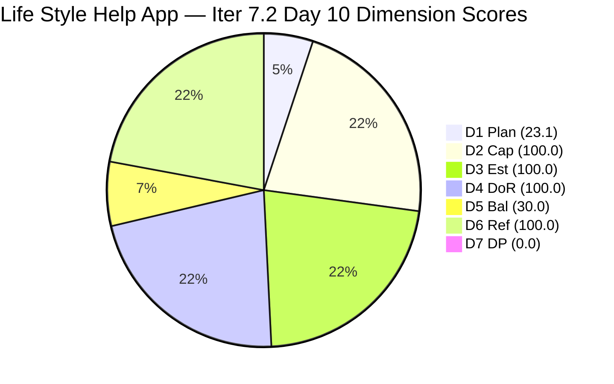
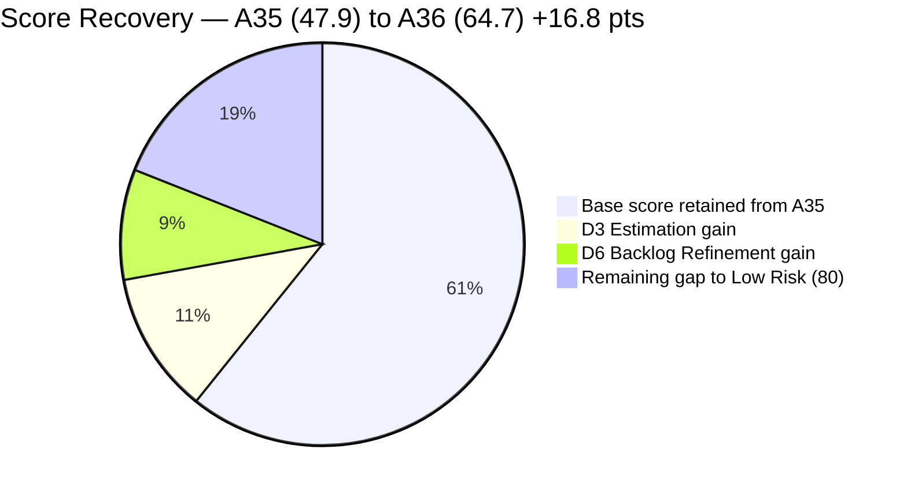
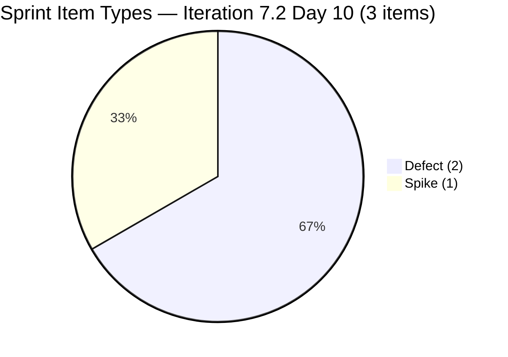
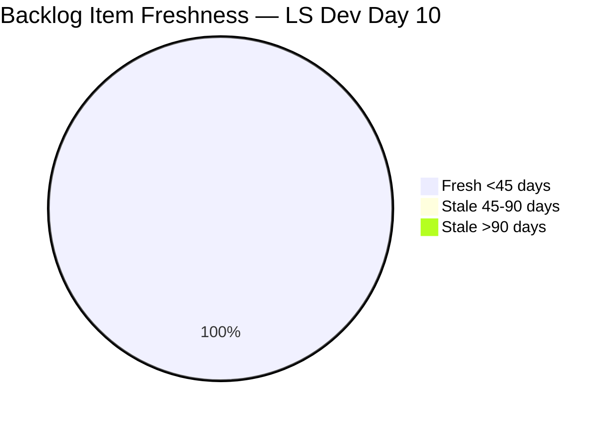
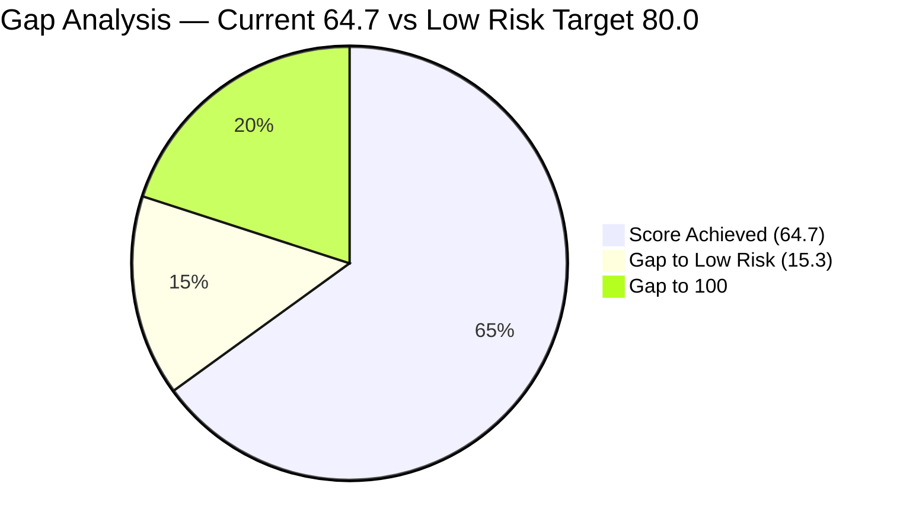

# SAFe Audit Report — Life Style Help App

**Audit A36 | Iteration 7.2 (Apr 20 – May 3, 2026) | Day 10 of 14 (~71% elapsed)**

---

## 1. Audit Metadata

| Field | Value |
|---|---|
| **Audit Date** | April 29, 2026, 02:04 UTC |
| **Auditor** | Claude Code (ADO SAFe Audit Agent) |
| **Workspace** | `ado_ls_dev` |
| **ADO Project** | Life Style Help App (`0f447778-7156-4451-ab21-27be3c4a5888`) |
| **Team** | Life Style Help App Team (`a2a805bc-0b30-4ef3-9a8a-b7f3081157a6`) |
| **Iteration** | Iteration 7.2 — Apr 20 to May 3, 2026 |
| **Iteration ID** | `71cd2555-1e1c-4767-8a57-393f87aabe1f` |
| **Sprint Day** | Day 10 of 14 (~71% elapsed) |
| **Prior Audit** | AUDIT_20260428_0203.md (A35, Iter 7.2 Day 9, Overall 47.9 — High Risk) |
| **Scoring Model** | ADO SAFe v1 (7-dimension rubric) |
| **Overall Score** | **64.7 / 100** |
| **Risk Band** | **Moderate Risk** (60–79.9) |

---

## 2. Executive Summary

Life Style Help App recovers to **64.7 (Moderate Risk)** on Day 10 — a significant **improvement of +16.8 points** from A35 (47.9 High Risk). This is the largest single-audit score jump in the current series. The recovery is driven by three structural changes:

1. **D3 Estimation restored to 100.0** — Both #203247 (Spike, 1 SP) and #203390 (Defect, 2 SP) received Story Points on Apr 29. All 3 sprint items are now fully estimated. committed_SP = 4 SP.

2. **D6 Backlog Refinement recovers to 100.0** — All 13 visible backlog items now show ChangedDates ≥ Apr 27 (most on Apr 28 23:30 UTC). The four previously stale items (194082, 194084, 194386, 195229 — all Dec 2025) received a mass update on Apr 28 23:30 UTC. stale_90 = 0, removing the −20 penalty that suppressed D6 from 49.2.

3. **D7 Delivery Predictability remains 0.0** — No sprint items have closed. All 3 items remain Active on Day 10.

**Sprint still in critical delivery territory:**
Day 10 of 14 with 0 SP delivered, 4 SP committed, and only 3 reactive items (2 Defects + 1 Spike). The team remains fully reactive — no User Stories in scope. The score improvement is structural (estimation + backlog hygiene) rather than delivery progress.

**Positive indicators:**
- #203247 (Spike — Heges Issues Replication) updated Apr 29 07:32 — active investigation in progress.
- #203390 (Subscription defect) updated Apr 29 07:32 — Samantha actively working billing defects.
- #203239 (billing investigation emilienaess97) updated Apr 28 23:23 — still Active.
- Mass backlog refresh on Apr 28: five previously stale items received identical ChangedDate timestamps (Apr 28 23:30:17 UTC), indicating a bulk touch-update rather than substantive refinement work. Per rubric, ChangedDate is the authoritative freshness signal — the stale_90 penalty is lifted regardless of mechanism.

**Persistent concerns:**
- 0 User Stories in sprint — D5 Work Item Balance = 30.0 (structural for this sprint).
- D1 Iteration Planning = 23.1 — 3 of 13 items in sprint; 10 items still outside scope.
- Bus factor risk: Samantha holds 2 of 3 sprint items.

---

## 3. Previous Audit Delta

| Dimension | A35 (Apr 28, 02:03 UTC) | A36 (Apr 29, 02:04 UTC) | Delta | Driver |
|---|---|---|---|---|
| Iteration Planning | 23.1 | **23.1** | 0.0 | 3/13 unchanged |
| Team Capacity | 100.0 | **100.0** | 0.0 | Samantha + Luzmibel configured |
| Estimation | 33.3 | **100.0** | **+66.7** | #203247 (1 SP) and #203390 (2 SP) estimated; all 3 sprint items now have SP |
| DoR Compliance | 100.0 | **100.0** | 0.0 | All 3 sprint items pass |
| Work Item Balance | 30.0 | **30.0** | 0.0 | No US → −40; Defect 66.7% > 60% → −30 |
| Backlog Refinement | 49.2 | **100.0** | **+50.8** | Mass backlog update Apr 28 23:30; all 13 items fresh; stale_90 = 0; −20 penalty removed |
| Delivery Predictability | 0.0 | **0.0** | 0.0 | 0 closures; Day 10 |
| **Overall** | **47.9** | **64.7** | **+16.8** | Estimation + Backlog Refinement structural recovery |

---

## 4. Current Iteration Snapshot

| Attribute | Value |
|---|---|
| **Iteration** | Iteration 7.2 |
| **Sprint Dates** | Apr 20 – May 3, 2026 (14 days) |
| **Sprint Day** | Day 10 of 14 |
| **Days Remaining** | 4 |
| **Visible Backlog Items** | 13 |
| **Current Iteration Items** | 3 (203239, 203390, 203247) |
| **Committed SP (estimated items)** | 4 SP (1 + 2 + 1) |
| **Closed SP** | 0 |
| **Active Items** | 3 (all Active) |
| **Capacity** | Samantha 1/day Dev, Luzmibel 1/day Testing |
| **Last ADO Activity** | Apr 29, 07:32 UTC — #203247 and #203390 updated (Luzmibel and Samantha) |

---

## 5. Work Item Analysis

### Current Sprint Items (3 root items)

| ID | Title | Type | State | SP | Assigned | ChangedDate | DoR |
|---|---|---|---|---|---|---|---|
| 203239 | Investigate member emilienaess97@gmail.com | Defect | Active | 1 | Samantha Babael | Apr 28 23:23 | PASS |
| 203390 | Subscription Auto-Cancels at End of Binding Period | Defect | Active | 2 | Samantha Babael | Apr 29 07:32 | PASS |
| 203247 | 7.2 Collaborations / Check Heges Issues / Replicate | Spike | Active | 1 | Luzmibel Paculanang | Apr 29 07:32 | PASS |

### Full Visible Backlog (13 items)

| ID | Title | Type | State | SP | ChangedDate | Sprint? | Fresh |
|---|---|---|---|---|---|---|---|
| 194082 | Customize "Servings" Label | US | Ready for Dev | 1 | Apr 28 23:30 | No | Yes ✅ |
| 194084 | Schedule Blog Post | US | Ready for Dev | 1 | Apr 28 23:30 | No | Yes ✅ |
| 194386 | Investigate re-occurring cancellation issue | Defect | Ready for UAT | 1 | Apr 28 23:30 | No | Yes ✅ |
| 195229 | Email Notification for Forum Posts | US | Grooming | 1 | Apr 28 23:30 | No | Yes ✅ |
| 195373 | App Performance Optimization | Enabler | New | — | Apr 28 23:30 | No | Yes ✅ |
| 195716 | Hide preferanser/allergier in recipe card | US | Ready for Dev | 2 | Apr 28 23:26 | No | Yes |
| 195727 | Meal time filter + searchbar bug | US | Ready for Dev | 2 | Apr 27 06:15 | No | Yes |
| 196380 | Default Pinned Post for New Users | US | Ready for Dev | 3 | Apr 27 06:15 | No | Yes |
| 201334 | Collaboration / Check and Replicate Issues | Spike | New | — | Apr 28 23:26 | No | Yes |
| 202789 | Lifestyle App Customer CSAT Survey | Spike | New | — | Apr 28 23:26 | No | Yes |
| 203239 | Investigate member emilienaess97@gmail.com | Defect | Active | 1 | Apr 28 23:23 | **Yes** | Yes |
| 203390 | Subscription Auto-Cancels at End of Binding Period | Defect | Active | 2 | Apr 29 07:32 | **Yes** | Yes |
| 203247 | 7.2 Collaborations / Heges Issues | Spike | Active | 1 | Apr 29 07:32 | **Yes** | Yes |

**Fresh items (ChangedDate ≥ Mar 15, 2026):** All 13 items = 13/13
**stale_90 items (ChangedDate < Jan 29, 2026):** 0 (previously 4; all refreshed Apr 28)
**stale_180 items (ChangedDate < Oct 31, 2025):** 0

**Note on mass update:** Items 194082, 194084, 194386, 195229, 195373 all show identical ChangedDate of Apr 28 23:30:17 UTC — consistent with a single bulk update operation. This resolved the stale_90 condition that was costing D6 −20 points.

---

## 6. SAFe Compliance Scorecard

| Dimension | Score | Evidence | Notes |
|---|---|---|---|
| **D1 Iteration Planning** | 23.1 | 3 / 13 visible backlog items in Iter 7.2 | 10 items not committed to current sprint |
| **D2 Team Capacity** | 100.0 | 2 contributors with current work (Samantha, Luzmibel); both have positive capacity | Ike Yana not in capacity data for this iteration |
| **D3 Estimation** | 100.0 | 3 / 3 sprint items estimated (SP > 0) | #203247 = 1 SP and #203390 = 2 SP now assigned |
| **D4 DoR Compliance** | 100.0 | 3 / 3 sprint items pass Description ≥30 + AC ≥20 | All three items have substantive description and AC |
| **D5 Work Item Balance** | 30.0 | No US → −40; Defect 66.7% dominant > 60% → −30; max(0, 100−70) | Spike 33.3% not > 40%; no Spike penalty |
| **D6 Backlog Refinement** | 100.0 | 13/13 fresh (all ≥ Apr 27); 0 stale_90; 0 stale_180; 0 untouched | Mass update Apr 28 cleared all staleness |
| **D7 Delivery Predictability** | 0.0 | 0 SP closed / 4 SP committed | Day 10; all 3 items Active; no closures |
| **Overall** | **64.7** | (23.1+100+100+100+30+100+0)/7 | **Moderate Risk** |

---

## 7. Dimension Findings

### D1 — Iteration Planning: 23.1
3 of 13 visible backlog items are in Iteration 7.2. Ten items are in other iteration paths: 195716 and 201334 in PI6/Iter 6.5, 202789 in Iter 7.6 (IP), and 194082, 194084, 194386, 195229, 195373, 196380, 195727 in the root/unassigned. The sprint is severely under-committed. Moving 2–3 User Stories from the ready backlog (195727: Meal Filter bug, 2 SP; 196380: Default Pinned Post, 3 SP) into Iteration 7.2 would materially improve D1 and D5 simultaneously.

### D2 — Team Capacity: 100.0
Samantha Babael (1 dev/day) and Luzmibel Paculanang (1 testing/day) are the active contributors with current-sprint items and configured capacity. The capacity API does not return Ike Yana for this iteration, suggesting Ike may not have capacity configured for Iter 7.2. D2 = contributors_with_capacity / contributors_with_current_work = 2/2 = 100.0.

### D3 — Estimation: 100.0
All 3 sprint items now have Story Points assigned:
- #203239 (Defect — billing investigation): 1 SP (unchanged)
- #203390 (Defect — subscription auto-cancel): 2 SP (new as of Apr 29)
- #203247 (Spike — Heges issues replication): 1 SP (new as of Apr 29)

Total committed_SP = 4 SP. This is a critical improvement from A35 (33.3%) and directly increases DP denominator quality.

### D4 — DoR Compliance: 100.0
All 3 sprint items pass DoR thresholds:
- **#203239**: Multi-paragraph billing investigation description + single clear AC condition. PASS.
- **#203390**: Description explains the auto-cancel scenario (~60+ non-whitespace). AC states expected subscription behavior clearly (~110+ non-whitespace). PASS.
- **#203247**: Comprehensive 3-section checklist description (Collaborations, Check Raised Issues, Replicate) + 5-item AC list. PASS.

### D5 — Work Item Balance: 30.0
Sprint type distribution: Defect (2/3 = 66.7%), Spike (1/3 = 33.3%), User Story (0/3 = 0%).
- No User Story present → −40 penalty.
- Defect dominant_type_share = 66.7% > 60% → −30 penalty.
- Spike share = 33.3% not > 40% → no Spike penalty.
- Score = max(0, 100 − 40 − 30) = 30.0.

This sprint's composition reflects entirely reactive work — two subscription/billing defect investigations and one issue-replication Spike. Feature delivery remains absent.

### D6 — Backlog Refinement: 100.0
All 13 visible backlog items have ChangedDate ≥ Apr 27, 2026, well within the 45-day fresh window (Mar 15 cutoff). A mass update on Apr 28 23:30 UTC refreshed the five previously stale items (194082, 194084, 194386, 195229, 195373), clearing the stale_90 condition (4/13 = 30.8% > 25% was triggering a −20 penalty in A35). stale_90 = 0, stale_180 = 0, untouched = 0. base = 13/13 = 100%; no penalties. Score = 100.0.

### D7 — Delivery Predictability: 0.0
committed_story_points = 4 SP (sum of SP on 3 estimated current-sprint items). closed_story_points = 0. Score = 0/4 = 0.0. With 4 SP committed, a single closure of #203390 (2 SP) would yield DP = 50.0, and closing all 3 items yields DP = 100.0. The team is capable of recovering D7 entirely before sprint end if the Active investigations are resolved. Both #203247 and #203390 were updated Apr 29 07:32 UTC — investigation is actively ongoing.

---

## 8. Risks and Bottlenecks

| # | Risk | Severity | Age |
|---|---|---|---|
| R1 | **Day 10, 0 SP delivered**: Sprint is 71% elapsed with 4 SP committed and 0 closed. D7 remains at 0.0. | High | 10 days |
| R2 | **No User Stories in sprint for 10 days**: All sprint work is reactive (2 Defects + 1 Spike). No planned feature delivery this sprint. | High | Sprint-long |
| R3 | **Billing pattern — 2 defects**: #203239 (emilienaess97 billing after cancellation) and #203390 (auto-cancel at binding period end) both relate to subscription/billing. Potential systemic defect in cancellation workflow. | High | Emerging |
| R4 | **D1 structural under-commitment**: 3/13 sprint ratio. 10 backlog items idle. | Moderate | Sprint-long |
| R5 | **D5 structural penalty**: US absence (−40) + Defect dominance (−30) caps Work Item Balance at 30.0 for this sprint. | Moderate | Sprint-long |
| R6 | **Ike Yana idle**: Not in capacity data for Iter 7.2; has been effectively absent from sprint work. | Moderate | Sprint-long |
| R7 | **#194386 (re-occurring cancellation)**: Ready for UAT but unassigned to any sprint. Related to billing defects in R3 — possible 3rd instance of same root cause. | Moderate | 165 days open |

---

## 9. Prioritized Recommendations

1. **[Immediate] Close #203390 (Subscription Auto-Cancel)** — Both #203390 and #203247 were actively updated Apr 29 07:32. If the subscription auto-cancel root cause has been identified, close the defect and update ADO status. Closing this single 2 SP item raises DP from 0.0 to 50.0.

2. **[Today] Update #203239 status and push to closure** — The billing investigation (emilienaess97) has been Active since Apr 20 (10 days). Samantha should log current findings or close. This is a customer-facing billing dispute.

3. **[Today] Add at least one User Story to the sprint** — Moving #195727 (Meal Filter bug, 2 SP, Ike) or #196380 (Default Pinned Post, 3 SP, Samantha) into Iter 7.2 eliminates the −40 US-absence penalty, recovering D5 from 30.0 to at least 40.0 and lifting Overall from 64.7 to ~67.1.

4. **[This sprint] Investigate billing root cause across #203239, #203390, and #194386** — All three defects relate to subscription cancellation and billing. #194386 (re-occurring cancellation, 165 days open, Ready for UAT) may be the same root-cause defect that has since manifested in two new customer reports. A single root-cause fix may resolve all three.

5. **[Next sprint] Plan at least 3 User Stories for Iter 7.3** — Commit to feature delivery: #195716 (Hide preferanser/allergier), #195727 (Meal Filter bug), and #196380 (Default Pinned Post) are all Ready for Dev with adequate DoR. Include Ike as active assignee.

6. **[Backlog hygiene] Review iteration paths for stale items** — Items 194082, 194084, 195229, 195373 remain at root/unassigned iteration paths. Assigning them to a sprint (or explicitly to icebox) would reflect true team intent.

---

## 10. Evidence Gaps and Limitations

| Gap | Impact | Mitigation |
|---|---|---|
| Mass update Apr 28 23:30 refreshes all ChangedDates | D6 base shifts from 9/13 to 13/13; stale_90 penalty removed | Per rubric, current ChangedDate is authoritative; improvement is valid |
| Ike Yana not returned in capacity API | Cannot count Ike in D2; D2 = 2/2 from Samantha and Luzmibel | Noted; Ike excluded from scoring |
| #201334 and #195716 show IterationPath = PI6/Iter 6.5 | Not in current sprint; counted in visible_root_backlog_items only | Consistent with prior audits |
| 195373 has no SP field value (null) | Not counted in point_eligible; excluded from D3 denominator | Enabler type; no impact on current D3 (denominator = 3 sprint items only) |
| No iteration goal defined | Cannot score sprint goal execution | Persistent structural gap |

---

## Mermaid Charts

### Dimension Score Breakdown — Day 10

### Score Recovery — A35 to A36

### Sprint Item Type Distribution

### Backlog Freshness Distribution (13 items)

### Path to Low Risk (80.0) from Current 64.7

---

*Report generated: 2026-04-29 02:04 UTC | Workspace: ado_ls_dev | Iteration 7.2 Day 10 | Score: 64.7 Moderate Risk*
