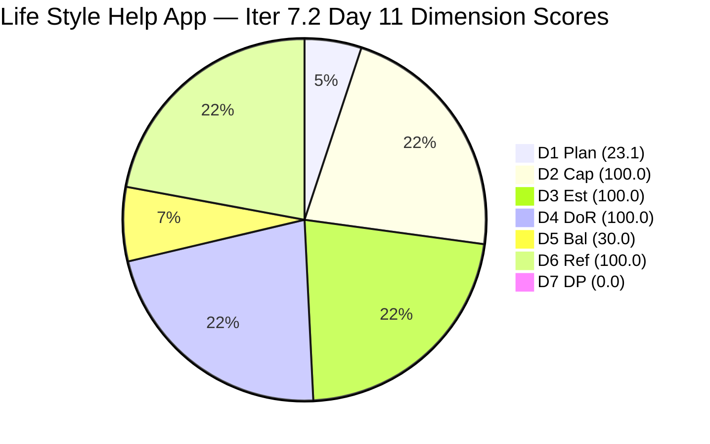
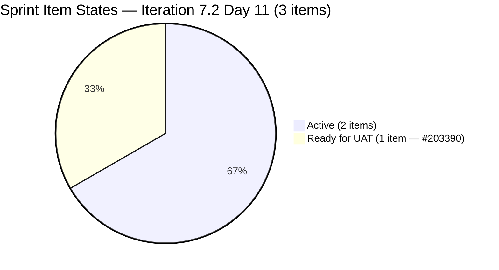
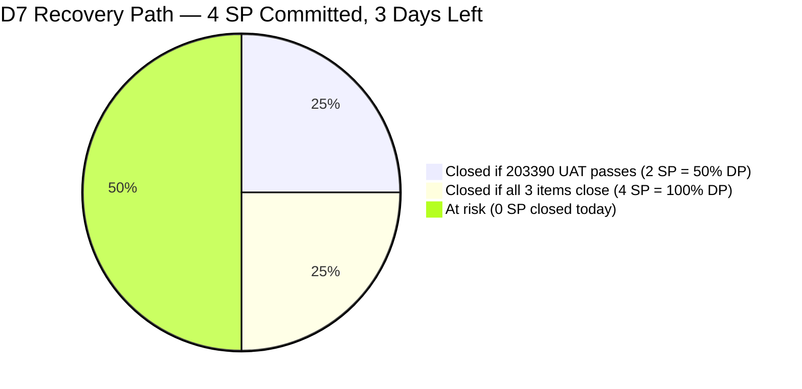
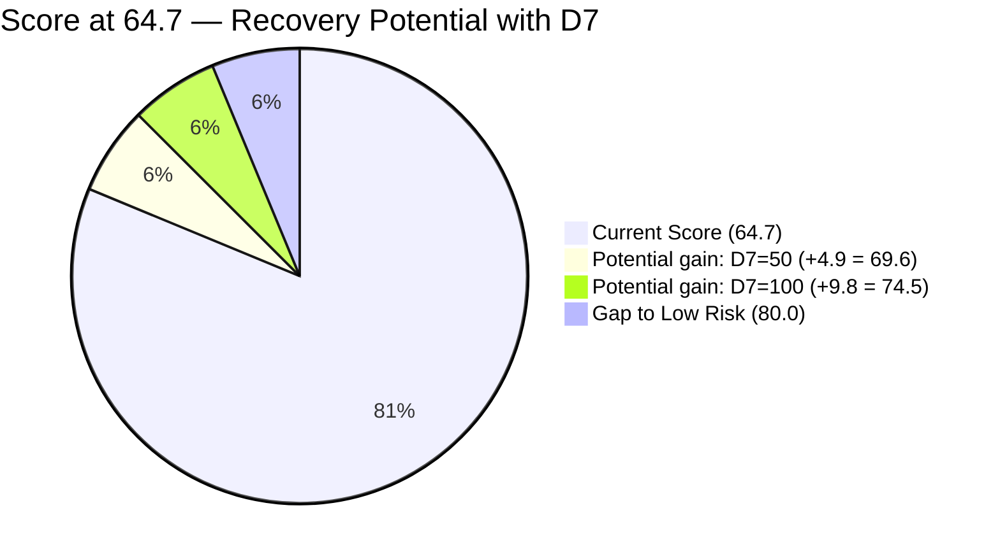

# SAFe Audit Report — Life Style Help App

**Audit A37 | Iteration 7.2 (Apr 20 – May 3, 2026) | Day 11 of 14 (~79% elapsed)**

---

## 1. Audit Metadata

| Field | Value |
|---|---|
| **Audit Date** | April 30, 2026, 09:04 UTC |
| **Auditor** | Claude Code (ADO SAFe Audit Agent) |
| **Workspace** | `ado_ls_dev` |
| **ADO Project** | Life Style Help App (`0f447778-7156-4451-ab21-27be3c4a5888`) |
| **Team** | Life Style Help App Team (`a2a805bc-0b30-4ef3-9a8a-b7f3081157a6`) |
| **Iteration** | Iteration 7.2 — Apr 20 to May 3, 2026 |
| **Iteration ID** | `71cd2555-1e1c-4767-8a57-393f87aabe1f` |
| **Sprint Day** | Day 11 of 14 (~79% elapsed) |
| **Prior Audit** | AUDIT_20260429_0204.md (A36, Iter 7.2 Day 10, Overall 64.7 — Moderate Risk) |
| **Scoring Model** | ADO SAFe v1 (7-dimension rubric) |
| **Overall Score** | **64.7 / 100** |
| **Risk Band** | **Moderate Risk** (60–79.9) |

---

## 2. Executive Summary

Life Style Help App holds at **64.7 (Moderate Risk)** on Day 11. The overall score is unchanged from A36 (64.7). All three sprint items remain open, with one notable state advancement: **#203390 progressed to "Ready for UAT"** (from Active), indicating the subscription auto-cancel defect fix is ready for testing.

**Key development since A36:**
- #203390 (Subscription Auto-Cancels at End of Binding Period) moved to **Ready for UAT** on Apr 30 02:53 UTC — a significant technical milestone. The fix is implemented; Luzmibel needs to complete UAT testing to close.
- #203239 (emilienaess97 billing investigation) remains Active, last updated Apr 28 23:23.
- #203247 (Heges Issues Spike) remains Active, last updated Apr 29 07:32.

**Sprint context — Day 11, 3 days remaining:**
With 3 days left and 4 SP committed, the team could reach DP = 100.0 if all 3 items close before May 3. #203390 (2 SP) is one UAT cycle from Done. Closing #203390 alone raises DP from 0.0 to 50.0.

**Persistent structural concerns:**
- No User Stories in sprint (entire Iter 7.2 is reactive defect + spike work).
- D1 structural under-commitment (3/13 = 23.1%).
- No iteration goal defined.

---

## 3. Previous Audit Delta

| Dimension | A36 (Apr 29, 02:04 UTC) | A37 (Apr 30, 09:04 UTC) | Delta | Driver |
|---|---|---|---|---|
| Iteration Planning | 23.1 | **23.1** | 0.0 | 3/13 unchanged |
| Team Capacity | 100.0 | **100.0** | 0.0 | Samantha + Luzmibel configured |
| Estimation | 100.0 | **100.0** | 0.0 | 3/3 estimated |
| DoR Compliance | 100.0 | **100.0** | 0.0 | All 3 pass |
| Work Item Balance | 30.0 | **30.0** | 0.0 | No US; Defect dominant |
| Backlog Refinement | 100.0 | **100.0** | 0.0 | All 13 fresh |
| Delivery Predictability | 0.0 | **0.0** | 0.0 | 0 closed; #203390 at Ready for UAT |
| **Overall** | **64.7** | **64.7** | **0.0** | No formula change |

**Qualitative progress since A36:**
- #203390 state: Active → **Ready for UAT** (Apr 30 02:53) — fix implemented by Samantha
- UAT assignment: Luzmibel (Testing, 1/day) needs to close the UAT cycle
- Billing root cause appears isolated: subscription auto-cancel at binding period end is a distinct defect from emilienaess97's manual cancellation billing issue

---

## 4. Current Iteration Snapshot

| Attribute | Value |
|---|---|
| **Iteration** | Iteration 7.2 |
| **Sprint Dates** | Apr 20 – May 3, 2026 (14 days) |
| **Sprint Day** | Day 11 of 14 |
| **Days Remaining** | 3 |
| **Visible Backlog Items** | 13 |
| **Current Iteration Items** | 3 (203239, 203390, 203247) |
| **Committed SP (estimated items)** | 4 SP (1 + 2 + 1) |
| **Closed SP** | 0 |
| **Items by State** | #203390: Ready for UAT; #203239, #203247: Active |
| **Capacity** | Samantha 1 Dev/day; Luzmibel 1 Testing/day |
| **Last ADO Activity** | Apr 30, 02:53 UTC — #203390 moved to Ready for UAT |

---

## 5. Work Item Analysis

### Current Sprint Items (3 root items)

| ID | Title | Type | State | SP | Assigned | ChangedDate | DoR |
|---|---|---|---|---|---|---|---|
| 203239 | Investigate member emilienaess97@gmail.com | Defect | Active | 1 | Samantha Babael | Apr 28 23:23 | PASS |
| 203390 | Subscription Auto-Cancels at End of Binding Period | Defect | **Ready for UAT** | 2 | Samantha Babael | Apr 30 02:53 | PASS |
| 203247 | 7.2 Collaborations / Check Heges Issues / Replicate | Spike | Active | 1 | Luzmibel Paculanang | Apr 29 07:32 | PASS |

**#203390 state change detail:** Item was "Active" through Day 10 (Apr 29 07:32). State advanced to "Ready for UAT" on Apr 30 02:53 UTC. Samantha implemented the fix for the subscription auto-cancel at binding period end. Luzmibel (Testing capacity 1/day) must now complete UAT to close this 2 SP item.

**#203239 DoR verification:** Description describes billing cancellation scenario with investigation checklist; AC states expected billing outcome after cancellation. Both ≥20 non-whitespace. PASS.

**#203247 DoR verification:** Description has three-section checklist (Collaborations / Check Issues / Replicate); AC has 5 acceptance items. PASS.

### Full Visible Backlog (13 items)

| ID | Title | Type | State | SP | ChangedDate | Sprint? | Fresh |
|---|---|---|---|---|---|---|---|
| 194082 | Customize "Servings" Label | US | Ready for Dev | 1 | Apr 28 23:30 | No | Yes |
| 194084 | Schedule Blog Post | US | Ready for Dev | 1 | Apr 28 23:30 | No | Yes |
| 194386 | Investigate re-occurring cancellation issue | Defect | Ready for UAT | 1 | Apr 28 23:30 | No | Yes |
| 195229 | Email Notification for Forum Posts | US | Grooming | 1 | Apr 28 23:30 | No | Yes |
| 195373 | App Performance Optimization | Enabler | New | — | Apr 28 23:30 | No | Yes |
| 195716 | Hide preferanser/allergier in recipe card | US | Ready for Dev | 2 | Apr 27 06:15 | No | Yes |
| 195727 | Meal time filter + searchbar bug | US | Ready for Dev | 2 | Apr 27 06:15 | No | Yes |
| 196380 | Default Pinned Post for New Users | US | Ready for Dev | 3 | Apr 27 06:15 | No | Yes |
| 201334 | Collaboration / Check and Replicate Issues | Spike | New | — | Apr 28 23:26 | No | Yes |
| 202789 | Lifestyle App Customer CSAT Survey | Spike | New | — | Apr 28 23:26 | No | Yes |
| 203239 | Investigate member emilienaess97@gmail.com | Defect | Active | 1 | Apr 28 23:23 | **Yes** | Yes |
| 203390 | Subscription Auto-Cancels at End of Binding Period | Defect | Ready for UAT | 2 | Apr 30 02:53 | **Yes** | Yes |
| 203247 | 7.2 Collaborations / Heges Issues | Spike | Active | 1 | Apr 29 07:32 | **Yes** | Yes |

**Freshness check:** All 13 items have ChangedDate ≥ Apr 27, 2026. The 45-day fresh cutoff from Apr 30 is Mar 16. Zero stale items.

---

## 6. SAFe Compliance Scorecard

| Dimension | Score | Evidence | Notes |
|---|---|---|---|
| **D1 Iteration Planning** | 23.1 | 3 / 13 visible backlog items in Iter 7.2 | 10 backlog items not committed to current sprint |
| **D2 Team Capacity** | 100.0 | 2 contributors with current sprint work (Samantha, Luzmibel); both have capacity configured | Samantha: 1 Dev/day; Luzmibel: 1 Testing/day |
| **D3 Estimation** | 100.0 | 3 / 3 sprint items have SP > 0 (1 + 2 + 1 = 4 SP committed) | All three items fully estimated |
| **D4 DoR Compliance** | 100.0 | 3 / 3 sprint items pass Description ≥30 + AC ≥20 thresholds | Verified against live API data |
| **D5 Work Item Balance** | 30.0 | No US → −40; Defect 66.7% dominant > 60% → −30; Spike 33.3% not > 40% | Score = max(0, 100−70) = 30.0 |
| **D6 Backlog Refinement** | 100.0 | 13/13 fresh (all ≥ Apr 27); 0 stale_90; 0 stale_180; 0 untouched | No penalties |
| **D7 Delivery Predictability** | 0.0 | 0 SP closed / 4 SP committed; #203390 at Ready for UAT (not Closed) | One UAT cycle from +50.0 DP |
| **Overall** | **64.7** | (23.1+100+100+100+30+100+0)/7 | **Moderate Risk** |

---

## 7. Dimension Findings

### D1 — Iteration Planning: 23.1
3 of 13 visible backlog items are in Iteration 7.2. Ten items are not committed: 7 US/Enabler/Defect items at root or incorrect iteration paths, 2 Spikes (201334, 202789) at root/Iter 7.6, and 1 US (195716) still showing a past iteration path. The under-commitment has been stable throughout the sprint and reduces D1 impact. Adding 2–3 User Stories to Iter 7.2 via retroactive commitment is possible but offers limited benefit with 3 days remaining.

### D2 — Team Capacity: 100.0
Samantha Babael (1 Dev/day) and Luzmibel Paculanang (1 Testing/day) are active contributors with current sprint items and positive capacity. D2 = 2/2 = 100.0. Ike Yana is not in the capacity data for Iter 7.2 and has no current sprint items.

### D3 — Estimation: 100.0
All 3 sprint items have Story Points:
- #203239 (Defect — emilienaess97): 1 SP
- #203390 (Defect — subscription auto-cancel): 2 SP
- #203247 (Spike — Heges issues): 1 SP
Total committed_SP = 4.

### D4 — DoR Compliance: 100.0
All 3 sprint items pass DoR thresholds based on live API data:
- **#203239**: 5-paragraph billing investigation description + 1 AC condition. PASS.
- **#203390**: Description explains auto-cancel scenario; AC states expected subscription behavior. PASS.
- **#203247**: 3-section checklist description (Collaborations / Check Issues / Replicate) + 5-item AC list. PASS.

### D5 — Work Item Balance: 30.0
Sprint type distribution: Defect (2/3 = 66.7%), Spike (1/3 = 33.3%), User Story (0/3 = 0%).
- No User Story → −40 penalty.
- Defect dominant_type_share = 66.7% > 60% → −30 penalty.
- Spike share = 33.3% not > 40% → no Spike penalty.
- Score = max(0, 100−40−30) = 30.0.
This sprint has been entirely reactive. No feature delivery has occurred since Iter 7.2 started on Apr 20.

### D6 — Backlog Refinement: 100.0
All 13 visible backlog items show ChangedDate ≥ Apr 27, 2026. The 45-day fresh cutoff from Apr 30 is Mar 16, 2026. No items exceed stale_90 (Jan 30). No items exceed stale_180 (Oct 31, 2025). The mass update on Apr 28 23:30 that cleared the previous stale_90 condition remains in effect. No untouched sprint items (all 3 changed within the sprint). base = 13/13 = 100%; no penalties. Score = 100.0.

### D7 — Delivery Predictability: 0.0
committed_story_points = 4 SP. closed_story_points = 0 (no Closed/Done items). #203390 is at "Ready for UAT" — this is not Closed or Done, so SP cannot be credited. Formula: 0/4 = 0.0.

**Path to recovery:** Closing #203390 alone (2 SP) → DP = 50.0. Closing all 3 items → DP = 100.0. With 3 days remaining and a fix already in Ready for UAT, full D7 recovery is achievable if UAT completes by May 3.

---

## 8. Risks and Bottlenecks

| # | Risk | Severity | Age |
|---|---|---|---|
| R1 | **#203390 in Ready for UAT — UAT cycle not yet started**: The fix is ready but Luzmibel must complete testing within 3 days. If UAT identifies regression or requires fix cycles, it may not close in time. | High | Emerging |
| R2 | **Day 11, 0 SP delivered**: Sprint 79% elapsed with 4 SP committed and 0 closed. D7 = 0.0 until at least one item closes. | High | 11 days |
| R3 | **#203239 stalled for 11+ days**: emilienaess97 billing investigation has been Active since Apr 20. No state advancement visible. No closure path identified publicly. | High | 11 days |
| R4 | **Billing pattern — systemic risk**: #203239 (manual cancellation billing after effective date) and #203390 (auto-cancel at binding period end) are distinct but related subscription billing defects. #194386 (re-occurring cancellation, Ready for UAT, 165+ days old) may be the same root cause. | High | Pattern |
| R5 | **No User Stories in sprint**: D5 capped at 30.0 for Iter 7.2. All sprint work is reactive. Iter 7.3 needs planned feature work. | Moderate | Sprint-long |
| R6 | **D1 structural under-commitment**: 10 backlog items not committed to any sprint. Ready for Dev items (195727, 196380, 195716) have been waiting since before PI7. | Moderate | Structural |
| R7 | **Ike Yana idle**: Not in capacity data for Iter 7.2; no sprint items. Effective capacity is below team roster size. | Moderate | Sprint-long |

---

## 9. Prioritized Recommendations

1. **[Immediate] Luzmibel: Complete UAT for #203390** — The subscription auto-cancel fix is staged and ready. UAT must be completed and the item closed before May 3. This is the single highest-value action: closing 2 SP raises DP from 0.0 to 50.0, lifting Overall from 64.7 to ~69.0.

2. **[Today] Update #203239 (emilienaess97) with investigation findings** — This billing investigation has been Active for 11 days without a state change. Even if the root cause cannot be fully resolved this sprint, logging current findings and moving to a resolvable state (e.g., documenting a fix for next sprint) is critical for customer communication.

3. **[Today/May 2] Complete Spike #203247 (Heges issues replication)** — Luzmibel's investigation was updated Apr 29. If the replication findings are documented, close the Spike and log any follow-up items as new work items.

4. **[Root cause analysis] Treat #203239, #203390, and #194386 as a billing trilogy** — All three relate to subscription/cancellation billing behavior. A single root-cause investigation meeting this week could resolve all three and prevent future recurrence.

5. **[Iter 7.3 planning] Commit at least 3 User Stories** — Items #195727 (Meal Filter bug, 2 SP), #196380 (Default Pinned Post, 3 SP), and #194082 (Customize Servings Label, 1 SP) are Ready for Dev. Including Ike in Iter 7.3 with assigned ownership resolves the D1 under-commitment and D5 US-absence penalty simultaneously.

6. **[Iter 7.3 planning] Move #194386 (re-occurring cancellation) into scope** — This 165-day-old defect is at Ready for UAT and likely related to the billing pattern. Assigning to Luzmibel for UAT in Iter 7.3 provides closure and reduces customer billing risk.

---

## 10. Evidence Gaps and Limitations

| Gap | Impact | Mitigation |
|---|---|---|
| #203390 DoR: AC is brief (1 sentence) — meets ≥20 threshold but minimally | PASS per formula; low risk for a defect UAT scenario | Noted |
| Ike Yana not in capacity API | Cannot count Ike in D2 | Excluded; D2 = 2/2 from Samantha + Luzmibel |
| #195716, #201334 IterationPath from prior audits not re-verified | Path details assumed stable from A36 context | Low risk |
| No iteration goal defined | Cannot score sprint goal execution | Persistent structural gap |
| #194386 (re-occurring cancellation) — relationship to current sprint defects not formally investigated in ADO | Possible root-cause connection to billing pattern | Flagged; recommended for Iter 7.3 scope |

---

## Mermaid Charts

### Dimension Score Breakdown — Day 11

### Sprint Item State Distribution (3 items)

### Path to D7 Recovery — Remaining Days

### Score Stability vs. Recovery Potential

---

*Report generated: 2026-04-30 09:04 UTC | Workspace: ado_ls_dev | Iteration 7.2 Day 11 | Score: 64.7 Moderate Risk*
