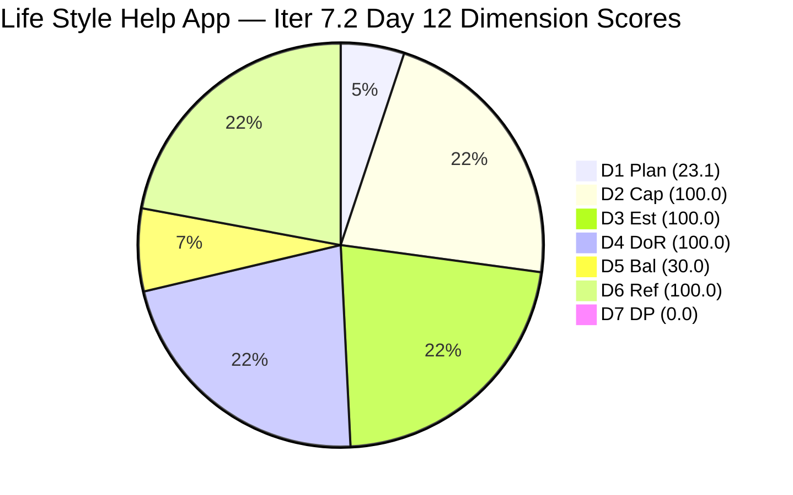
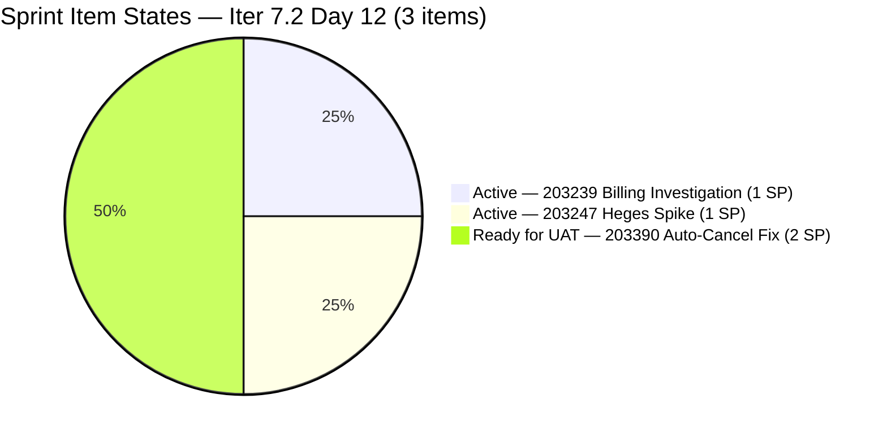
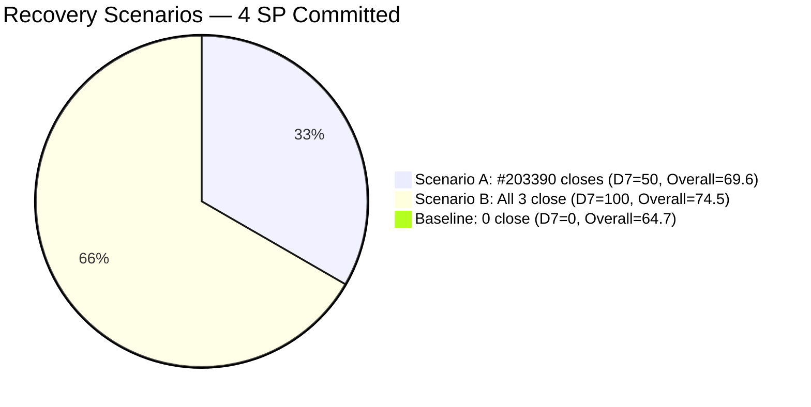
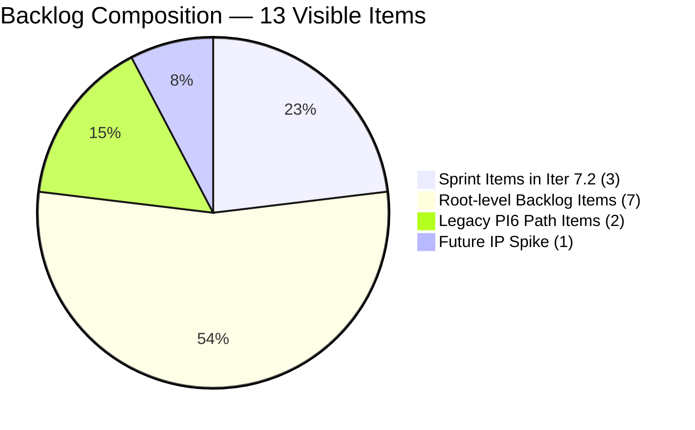

# SAFe Audit Report — Life Style Help App

**Audit A38 | Iteration 7.2 (Apr 20 – May 3, 2026) | Day 12 of 14 (~86% elapsed)**

---

## 1. Audit Metadata

| Field | Value |
|---|---|
| **Audit Date** | May 1, 2026, 09:03 UTC |
| **Auditor** | Claude Code (ADO SAFe Audit Agent) |
| **Workspace** | `ado_ls_dev` |
| **ADO Project** | Life Style Help App (`0f447778-7156-4451-ab21-27be3c4a5888`) |
| **Team** | Life Style Help App Team (`a2a805bc-0b30-4ef3-9a8a-b7f3081157a6`) |
| **Iteration** | Iteration 7.2 — Apr 20 to May 3, 2026 |
| **Iteration ID** | `71cd2555-1e1c-4767-8a57-393f87aabe1f` |
| **Sprint Day** | Day 12 of 14 (~86% elapsed) |
| **Prior Audit** | AUDIT_20260430_0904.md (A37, Iter 7.2 Day 11, Overall 64.7 — Moderate Risk) |
| **Scoring Model** | ADO SAFe v1 (7-dimension rubric) |
| **Overall Score** | **64.7 / 100** |
| **Risk Band** | **Moderate Risk** (60–79.9) |

---

## 2. Executive Summary

Life Style Help App holds at **64.7 (Moderate Risk)** on Day 12 — **unchanged from A37 (64.7)**. All three sprint items remain in their Apr 30 states:

- **#203390** (Subscription Auto-Cancels) — still **Ready for UAT** (last changed Apr 30 02:53) — the fix is staged; UAT not yet completed
- **#203239** (emilienaess97 billing investigation) — **Active**, last changed Apr 28 23:23 — no update in 2+ days
- **#203247** (Heges Issues Spike) — **Active**, last changed Apr 29 07:32 — no update in 36+ hours

**Sprint trajectory — Day 12, 2 days remaining (May 2 and May 3):**
This is an urgent window. The team must complete UAT on #203390 (2 SP) by May 3 to recover any D7 score. Closing #203390 alone lifts Overall from 64.7 to ~69.6. Closing all 3 items achieves 74.5, which approaches the 75 midpoint of the Moderate band.

**Persistent structural concerns:**
- No User Stories in Iter 7.2 (entire sprint is reactive defect + spike work).
- D1 structural under-commitment (3/13 = 23.1%) — 10 backlog items uncommitted.
- Billing investigation (#203239) now 12 days old with no observable progress.

---

## 3. Previous Audit Delta

| Dimension | A37 (Apr 30, 09:04 UTC) | A38 (May 1, 09:03 UTC) | Delta | Driver |
|---|---|---|---|---|
| Iteration Planning | 23.1 | **23.1** | 0.0 | 3/13 unchanged |
| Team Capacity | 100.0 | **100.0** | 0.0 | Samantha + Luzmibel configured |
| Estimation | 100.0 | **100.0** | 0.0 | 3/3 estimated |
| DoR Compliance | 100.0 | **100.0** | 0.0 | All 3 pass |
| Work Item Balance | 30.0 | **30.0** | 0.0 | No US; Defect dominant |
| Backlog Refinement | 100.0 | **100.0** | 0.0 | All 13 fresh |
| Delivery Predictability | 0.0 | **0.0** | 0.0 | #203390 still Ready for UAT; not Closed |
| **Overall** | **64.7** | **64.7** | **0.0** | No formula change |

**No ADO changes since A37:** No state transitions, no new items, no comment updates detected. Last ADO activity: Apr 30, 02:53 UTC (#203390 moved to Ready for UAT).

---

## 4. Current Iteration Snapshot

| Attribute | Value |
|---|---|
| **Iteration** | Iteration 7.2 |
| **Sprint Dates** | Apr 20 – May 3, 2026 (14 days) |
| **Sprint Day** | Day 12 of 14 |
| **Days Remaining** | 2 (May 2 and May 3) |
| **Visible Backlog Items** | 13 |
| **Current Sprint Items** | 3 (#203239, #203390, #203247) |
| **Committed SP** | 4 SP (1 + 2 + 1) |
| **Closed SP** | 0 |
| **Items by State** | #203390: Ready for UAT; #203239, #203247: Active |
| **Capacity** | Samantha: 1 Dev/day; Luzmibel: 1 Testing/day |
| **Last ADO Activity** | Apr 30, 02:53 UTC — #203390 moved to Ready for UAT |

---

## 5. Work Item Analysis

### Current Sprint Items (3 root items)

| ID | Title | Type | State | SP | Assignee | ChangedDate | DoR |
|---|---|---|---|---|---|---|---|
| 203239 | Investigate member emilienaess97@gmail.com | Defect | Active | 1 | Samantha Babael | Apr 28 23:23 | PASS |
| 203390 | Subscription Auto-Cancels at End of Binding Period | Defect | Ready for UAT | 2 | Samantha Babael | Apr 30 02:53 | PASS |
| 203247 | 7.2 Collaborations / Check Heges Issues / Replicate | Spike | Active | 1 | Luzmibel Paculanang | Apr 29 07:32 | PASS |

**#203239 DoR check (re-verified):** Description: 4-paragraph billing investigation with cancellation timeline detail (client cancelled via app, informed effective date Apr 21, still charged post-date) and 3-bullet investigation checklist. ≥30 non-WS chars. AC: 1 acceptance condition ("membership cancelled successfully before billing date → should not be charged after cancellation effective date"). ≥20 non-WS chars. PASS.

**#203390 DoR check (re-verified):** Description: "Some customers experienced automatic cancellation of their subscriptions at the end of the binding period, even though they did not manually request cancellation." ≥30 non-WS. AC: "Expected Result: The subscription should remain active after the binding period unless the customer manually initiates a cancellation." ≥20 non-WS. PASS. State = Ready for UAT.

**#203247 DoR check (re-verified):** Description has 3-section structure (Collaborations / Check Raised Issues / Replicate) with sub-bullets. AC: 5 acceptance conditions (communications review, issue check, replication, documentation, conclusion). PASS.

**Critical UAT path — #203390:** The fix is implemented and staged in Ready for UAT. Luzmibel (1 Testing/day capacity) must complete UAT and close by May 3. This is now 48+ hours since the fix was staged.

### Full Visible Backlog (13 items)

| ID | Title | Type | State | SP | IterPath | ChangedDate | Sprint? |
|---|---|---|---|---|---|---|---|
| 195716 | Hide preferanser/allergier in recipe card | US | Ready for Dev | 2 | PI6\Iter 6.5 | Apr 28 23:26 | No |
| 201334 | Collaboration / Check and Replicate Issues | Spike | New | — | PI6\Iter 6.5 | Apr 28 23:26 | No |
| 203239 | Investigate emilienaess97@gmail.com | Defect | Active | 1 | Iter 7.2 | Apr 28 23:23 | **Yes** |
| 203390 | Subscription Auto-Cancels at Binding Period End | Defect | Ready for UAT | 2 | Iter 7.2 | Apr 30 02:53 | **Yes** |
| 203247 | 7.2 Heges Issues / Replicate | Spike | Active | 1 | Iter 7.2 | Apr 29 07:32 | **Yes** |
| 202789 | Lifestyle App — Customer CSAT Survey | Spike | New | — | Iter 7.6 (IP) | Apr 28 23:26 | No |
| 194386 | Investigate re-occurring cancellation issue | Defect | Ready for UAT | 1 | Root | Apr 28 23:30 | No |
| 194082 | Customize "Servings" Label | US | Ready for Dev | 1 | Root | Apr 28 23:30 | No |
| 194084 | Schedule Blog Post | US | Ready for Dev | 1 | Root | Apr 28 23:30 | No |
| 195373 | Lifestyle App Performance Optimization | Enabler | New | — | Root | Apr 28 23:30 | No |
| 195229 | Email Notification for Forum Posts | US | Grooming | 1 | Root | Apr 28 23:30 | No |
| 196380 | Default Pinned Post for New Users | US | Ready for Dev | 3 | Root | Apr 27 06:15 | No |
| 195727 | Meal time filter + searchbar bug | US | Ready for Dev | 2 | Root | Apr 27 06:15 | No |

**Freshness check (May 1, 45-day cutoff = Mar 17):** All 13 items ≥ Apr 27. Zero stale_90 (Jan 30). Zero stale_180 (Nov 1, 2025).

**Note on backlog item assignees (new data from API):**
- #194082 and #194084: assigned to **Sanny Paul Geraldino** (not previously noted in audit series)
- #194386: assigned to **Sanny Paul Geraldino** (previously assumed unassigned)
- #195373 and #195716: assigned to Sanny Paul Geraldino / Samantha Babael respectively
- #202789: assigned to **Carol Cuison** — new person not previously seen in audit series

---

## 6. SAFe Compliance Scorecard

| Dimension | Score | Evidence | Notes |
|---|---|---|---|
| **D1 Iteration Planning** | 23.1 | 3 / 13 visible backlog items in Iter 7.2 | 10 items not committed; structural under-commitment |
| **D2 Team Capacity** | 100.0 | 2 contributors with current sprint work (Samantha, Luzmibel); both configured | Samantha: 1 Dev/day; Luzmibel: 1 Testing/day |
| **D3 Estimation** | 100.0 | 3 / 3 sprint items estimated (1+2+1 = 4 SP) | |
| **D4 DoR Compliance** | 100.0 | 3 / 3 pass Description ≥30 + AC ≥20 | All re-verified vs. live API data |
| **D5 Work Item Balance** | 30.0 | No US → −40; Defect 66.7% dominant > 60% → −30; Spike 33.3% not > 40% | Score = max(0, 100−70) = 30.0 |
| **D6 Backlog Refinement** | 100.0 | 13/13 fresh (≥ Apr 27); 0 stale_90; 0 stale_180; 0 untouched sprint items | No penalties |
| **D7 Delivery Predictability** | 0.0 | 0 SP closed / 4 SP committed; #203390 Ready for UAT (not Closed) | One UAT cycle from +50.0 DP |
| **Overall** | **64.7** | (23.1+100+100+100+30+100+0)/7 | **Moderate Risk** |

---

## 7. Dimension Findings

### D1 — Iteration Planning: 23.1
3 of 13 visible backlog items are in Iteration 7.2 (203239, 203390, 203247). The 10 uncommitted items include: 2 US items in legacy PI6 iteration paths (195716, 201334), 7 root-level items (194082, 194084, 194386, 195229, 195373, 195727, 196380), and 1 Spike in Iter 7.6 (202789). This structural under-commitment has persisted for the entire Iter 7.2 sprint. Adding backlog items to Iter 7.2 retroactively at Day 12 offers no sprint benefit — D1 improvement is deferred to Iter 7.3 planning.

### D2 — Team Capacity: 100.0
Samantha Babael (1 Dev/day) and Luzmibel Paculanang (1 Testing/day) both have current sprint items with positive capacity configured. D2 = 2/2 = 100.0. New assignees found in API (Sanny Paul Geraldino, Carol Cuison) are not in capacity data and have no current sprint items — excluded.

### D3 — Estimation: 100.0
All 3 sprint items have Story Points: #203239 (1 SP), #203390 (2 SP), #203247 (1 SP). Total committed_SP = 4. D3 = 3/3 = 100.0.

### D4 — DoR Compliance: 100.0
All 3 items re-verified against live API data. All pass Description ≥30 non-whitespace and AC ≥20 non-whitespace. D4 = 3/3 = 100.0. Note: #203390's AC is a single sentence ("Expected Result: The subscription should remain active...") — minimal but compliant at ≥20 non-WS chars.

### D5 — Work Item Balance: 30.0
Sprint type distribution: Defect (2/3 = 66.7%), Spike (1/3 = 33.3%), User Story (0/3 = 0%).
- No User Story → −40 penalty.
- Defect dominant_type_share = 66.7% > 60% → −30 penalty.
- Spike share = 33.3% ≤ 40% → no −20.
- Score = max(0, 100−40−30) = 30.0.
This is a structurally reactive sprint. No new feature delivery has occurred since Iter 7.2 started Apr 20.

### D6 — Backlog Refinement: 100.0
All 13 visible backlog items have ChangedDate ≥ Apr 27, 2026. The 45-day fresh cutoff from May 1 is Mar 17. No items exceed stale_90 (Jan 30). No items exceed stale_180 (Nov 1, 2025). No untouched sprint items (all 3 changed within the sprint). base = 13/13 = 100%; no penalties. Score = 100.0.

### D7 — Delivery Predictability: 0.0
committed_story_points = 4 SP. closed_story_points = 0 (no Closed/Done items). #203390 is at "Ready for UAT" — not Closed or Done under the rubric. Formula: 0/4 = 0.0.

**UAT urgency:** #203390 has been in Ready for UAT for 30+ hours (staged Apr 30 02:53). Luzmibel (1 Testing/day) must initiate and complete UAT today or May 2 to close before the sprint ends May 3. Closing #203390 (2 SP) → DP = 50.0, Overall = 69.6. Closing all 3 → DP = 100.0, Overall = 74.5.

---

## 8. Risks and Bottlenecks

| # | Risk | Severity | Age |
|---|---|---|---|
| R1 | **#203390 UAT stalled at 30+ hours**: Fix staged Apr 30 02:53. Luzmibel has not closed the UAT cycle. 2 days remain. If UAT fails and requires a fix cycle, the sprint may end before closure. | Critical | 30+ hours |
| R2 | **#203239 billing investigation — 12 days, no progress**: emilienaess97 defect Active since Apr 20. Last updated Apr 28. No observable state advancement. Customer billing issue unresolved. | Critical | 12 days |
| R3 | **Day 12, 0 SP delivered**: Sprint 86% elapsed; 4 SP committed; 0 SP closed. D7 = 0.0 for 12 consecutive days. | High | 12 days |
| R4 | **#203247 (Heges Spike) — 36+ hours without update**: Luzmibel last updated Apr 29 07:32. If UAT for #203390 starts today, Heges findings may be postponed to sprint close. | High | 36+ hours |
| R5 | **Billing pattern — systemic**: #203239, #203390, and #194386 (167-day-old root defect, Ready for UAT) all relate to subscription/cancellation billing. No root-cause investigation documented in ADO. | High | Pattern |
| R6 | **#194386 — 167-day-old billing defect**: Ready for UAT since before the audit series. Assigned to Sanny Paul Geraldino (not in capacity data). | Moderate | 167+ days |
| R7 | **New assignees (Sanny Geraldino, Carol Cuison) not in capacity data**: Found on backlog items but not in Iter 7.2 capacity config. Effective team roster unclear. | Moderate | Unknown |
| R8 | **No User Stories in sprint**: D5 capped at 30.0 all sprint. Iter 7.3 needs planned feature work with US items. | Moderate | Sprint-long |

---

## 9. Prioritized Recommendations

1. **[Today May 1 / May 2 — URGENT] Luzmibel: Complete UAT for #203390**: The subscription auto-cancel fix has been staged for 30+ hours. UAT must begin immediately. This is the single highest-value action: closing 2 SP raises D7 from 0.0 to 50.0, lifting Overall from 64.7 to ~69.6. Every hour of delay risks the sprint close window.

2. **[May 2 — URGENT] Samantha: Escalate or resolve #203239 (emilienaess97)**: This billing investigation has been Active for 12 days with no progress visible since Apr 28. Samantha must either: (a) document investigation findings and close as complete, (b) create a follow-up work item and close this as analyzed, or (c) escalate the root cause. The customer billing concern requires a documented response.

3. **[May 2] Close #203247 (Heges Spike)**: Luzmibel updated Apr 29. If replication findings are documented, close the Spike and log follow-up items. Sprint close with all 3 items closed = D7 100.0, Overall 74.5.

4. **[Iter 7.3 planning] Address the billing trilogy**: Schedule a root-cause meeting on #203239, #203390, and #194386. All three involve subscription cancellation/billing edge cases. A combined analysis session is more efficient than three separate investigations.

5. **[Iter 7.3 planning] Commit at least 3 User Stories**: Items #195727 (Meal Filter bug, 2 SP), #196380 (Default Pinned Post, 3 SP), and #194082 (Customize Servings, 1 SP) are Ready for Dev. Assign with owners (Samantha, Luzmibel, or Sanny) to restore D1 ≥ 50% and eliminate the D5 US-absence penalty.

6. **[Iter 7.3 planning] Onboard Sanny Paul Geraldino and Carol Cuison to capacity**: Both appear on backlog items but are absent from the Iter 7.2 capacity configuration. If they are active contributors, add them to the Iter 7.3 capacity plan to accurately measure D2 and team bandwidth.

7. **[Iter 7.3 planning] Assign #194386 to UAT owner**: This 167-day-old billing defect is Ready for UAT. Assign to Luzmibel (Testing/day) in Iter 7.3 for closure and provide customer closure confirmation.

---

## 10. Evidence Gaps and Limitations

| Gap | Impact | Mitigation |
|---|---|---|
| Sanny Paul Geraldino and Carol Cuison not in capacity data | Cannot count in D2; not in current sprint | Excluded; noted as new discovery — investigate for Iter 7.3 |
| #203390 DoR: AC is a single sentence (minimally ≥20 non-WS) | PASS per formula; marginal for a production defect UAT scenario | Noted; AC should be expanded before UAT sign-off |
| #194386 (re-occurring cancellation) — Description is an image attachment only | Cannot verify Description text content; relied on image evidence | Documented; not in current sprint |
| Ike Yana not in capacity API | Not counted in D2 | Excluded; no current sprint items |
| No iteration goal in ADO | Cannot score sprint goal execution | Persistent structural gap |
| #195716 and #201334 remain in PI6\Iter 6.5 iteration path | Legacy path; not counted as current sprint items | Not impacting D1 computation |

---

## Mermaid Charts

### Dimension Score Breakdown — Day 12

### Sprint Item State Distribution (3 items)

### Score Recovery Scenarios — 2 Days Remaining

### Backlog Age by Item Type (13 items)

---

*Report generated: 2026-05-01 09:03 UTC | Workspace: ado_ls_dev | Iteration 7.2 Day 12 | Score: 64.7 Moderate Risk*
*Critical: #203390 UAT has been staged for 30+ hours; Luzmibel must complete UAT today/May 2 to recover D7 before May 3 sprint close.*
