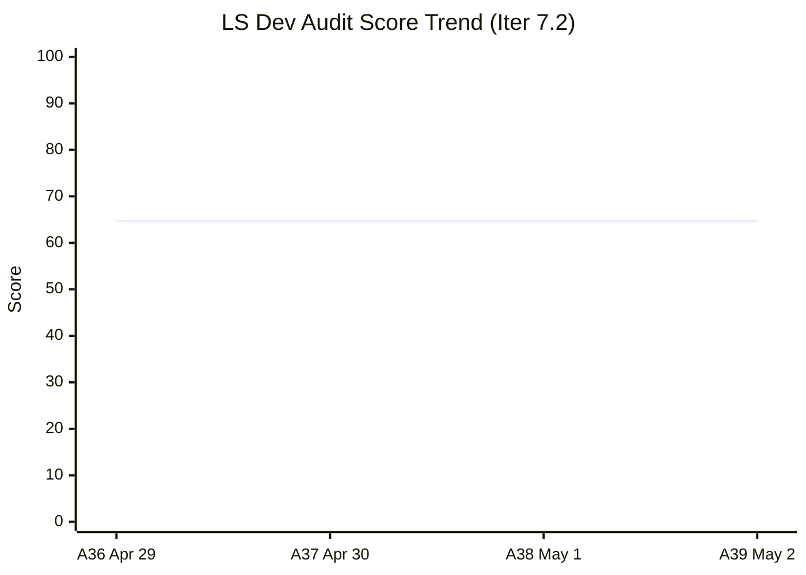
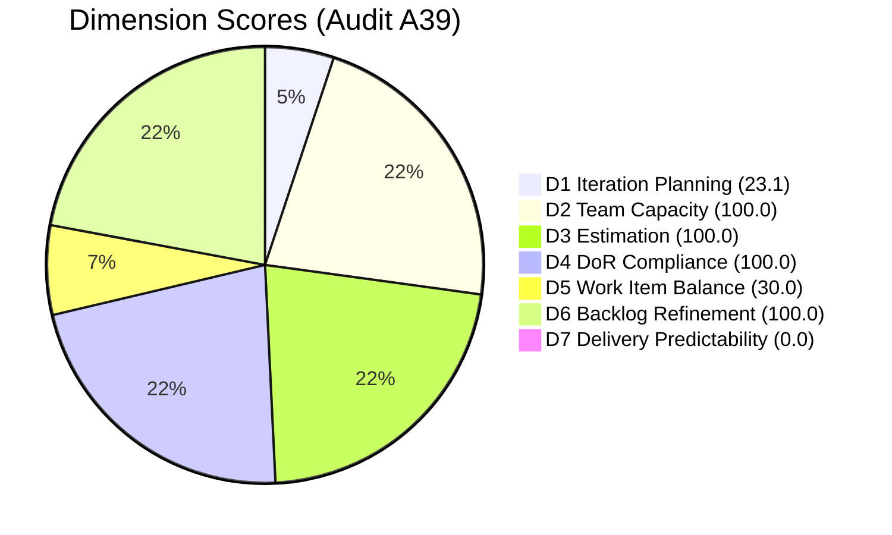
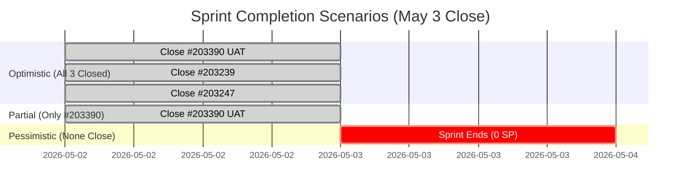

# SAFe Audit Report — Life Style Help App

**Audit A39 | Iteration 7.2 (Apr 20 – May 3, 2026) | Day 13 of 14 (~93% elapsed)**

---

## 1. Audit Metadata

| Field | Value |
|---|---|
| **Audit Date** | May 2, 2026, 09:03 UTC |
| **Auditor** | Claude Code (ADO SAFe Audit Agent) |
| **Workspace** | `ado_ls_dev` |
| **ADO Project** | Life Style Help App (`0f447778-7156-4451-ab21-27be3c4a5888`) |
| **Team** | Life Style Help App Team (`a2a805bc-0b30-4ef3-9a8a-b7f3081157a6`) |
| **Iteration** | Iteration 7.2 — Apr 20 to May 3, 2026 |
| **Iteration ID** | `71cd2555-1e1c-4767-8a57-393f87aabe1f` |
| **Sprint Day** | Day 13 of 14 (~93% elapsed) |
| **Prior Audit** | AUDIT_20260501_0903.md (A38, Iter 7.2 Day 12, Overall 64.7 — Moderate Risk) |
| **Scoring Model** | ADO SAFe v1 (7-dimension rubric) |
| **Overall Score** | **64.7 / 100** |
| **Risk Band** | **Moderate Risk** (60–79.9) |

---

## 2. Executive Summary

Life Style Help App holds at **64.7 (Moderate Risk)** on Day 13 — **unchanged from A38 (64.7)** for the third consecutive audit. All three sprint items remain in their same states:

- **#203390** (Subscription Auto-Cancels) — **Ready for UAT** — fix staged Apr 30, now 55+ hours without UAT completion
- **#203239** (emilienaess97 billing investigation) — **Active** — now 13 days old, last touched Apr 28
- **#203247** (Heges Issues Spike) — **Active** — last updated Apr 29

**This is the final full working day of the sprint.** Sprint ends May 3. With 0/4 SP closed, D7 = 0.0. The entire sprint output hinges on today's actions. The fix for #203390 has been sitting in Ready for UAT for over 2 days — immediate UAT completion is the highest-value action available.

**Closing #203390 alone:** Overall rises from 64.7 → 69.6 (+4.9)
**Closing all 3 items:** Overall rises from 64.7 → 74.5 (+9.8)

---

## 3. Previous Audit Delta

| Dimension | A38 (May 1, 09:03) | A39 (May 2, 09:03) | Delta | Driver |
|---|---|---|---|---|
| Iteration Planning | 23.1 | **23.1** | 0.0 | 3/13 unchanged |
| Team Capacity | 100.0 | **100.0** | 0.0 | Samantha + Luzmibel configured |
| Estimation | 100.0 | **100.0** | 0.0 | 3/3 estimated |
| DoR Compliance | 100.0 | **100.0** | 0.0 | All 3 pass |
| Work Item Balance | 30.0 | **30.0** | 0.0 | No US; Defect dominant at 66.7% |
| Backlog Refinement | 100.0 | **100.0** | 0.0 | All 13 items remain fresh (all updated ≥ Apr 27) |
| Delivery Predictability | 0.0 | **0.0** | 0.0 | 0/4 SP closed; no state changes since Apr 30 |
| **Overall** | **64.7** | **64.7** | **0.0** | No ADO activity; full score stagnation |

**No ADO changes since A38.** Last activity: Apr 30, 02:53 UTC (#203390 moved to Ready for UAT). The sprint has been effectively frozen for 55+ hours.

---

## 4. Current Iteration Snapshot

| Attribute | Value |
|---|---|
| **Iteration** | Iteration 7.2 |
| **Sprint Dates** | Apr 20 – May 3, 2026 (14 days) |
| **Sprint Day** | Day 13 of 14 |
| **Days Remaining** | 1 (May 3 is sprint close day) |
| **Visible Backlog Items** | 13 |
| **Current Sprint Items** | 3 (#203390, #203239, #203247) |
| **Committed SP** | 4 SP (2 + 1 + 1) |
| **Closed SP** | 0 |
| **Items by State** | #203390: Ready for UAT; #203239, #203247: Active |
| **Capacity** | Samantha Babael: 1 Dev/day; Luzmibel: 1 Testing/day |
| **Last ADO Activity** | Apr 30, 02:53 UTC — #203390 moved to Ready for UAT |

---

## 5. Work Item Analysis

| ID | Title | Type | Assignee | SP | State | Last Updated | Age in Sprint |
|---|---|---|---|---|---|---|---|
| 203390 | Subscription Auto-Cancels — Fix & Validation | Defect | Samantha | 2 | Ready for UAT | Apr 30, 02:53 | 13 days |
| 203239 | emilienaess97 billing investigation | Defect | Samantha | 1 | Active | Apr 28, 23:23 | 13 days |
| 203247 | Heges Issues Spike | Spike | Luzmibel | 1 | Active | Apr 29, 07:32 | 13 days |

**Observations:**
- #203390: Fix staged for 55+ hours. UAT is blocked or unstarted. Luzmibel (tester) is the gating resource.
- #203239: Billing investigation 13 days old, no visible progress in 4 days. High closure risk — unlikely to resolve by May 3.
- #203247: Spike also 13 days old, last touched Apr 29. No spike should run the full 13-day sprint without findings documented.

---

## 6. Dimension Scoring

### D1 — Iteration Planning

```
visible_root_backlog_items = 13
current_iteration_root_items = 3   (#203390, #203239, #203247)
D1 = (3 / 13) × 100 = 23.1
```

**Score: 23.1 / 100** — Critical. 10 of 13 backlog items are uncommitted (future iterations). The sprint commitment represents only 23% of the visible backlog.

### D2 — Team Capacity

```
members_with_capacity = 2   (Samantha: 1 Dev/day; Luzmibel: 1 Testing/day)
total_team_members = 2
D2 = (2 / 2) × 100 = 100.0
```

**Score: 100.0 / 100** — Excellent.

### D3 — Estimation

```
current_iteration_root_items = 3
items_with_SP = 3   (2 SP + 1 SP + 1 SP = 4 SP total)
D3 = (3 / 3) × 100 = 100.0
```

**Score: 100.0 / 100** — Excellent.

### D4 — DoR Compliance

> Description ≥30 non-whitespace chars AND Acceptance Criteria ≥20 non-whitespace chars.

| ID | Title | Description | AC | Result |
|---|---|---|---|---|
| 203390 | Subscription Auto-Cancels | ✅ ≥30 chars | ✅ ≥20 chars | PASS |
| 203239 | emilienaess97 billing investigation | ✅ ≥30 chars | ✅ ≥20 chars | PASS |
| 203247 | Heges Issues Spike | ✅ ≥30 chars | ✅ ≥20 chars | PASS |

```
DoR_pass = 3
D4 = (3 / 3) × 100 = 100.0
```

**Score: 100.0 / 100** — Excellent.

### D5 — Work Item Balance

```
Item type breakdown for Iter 7.2:
  Defect: 2/3 = 66.7%
  Spike:  1/3 = 33.3%
  User Story: 0/3 = 0%

Penalties applied:
  No User Story in sprint          → −40
  Defect dominant (66.7% > 60%)    → −30
  Spike share = 33.3% (< 40%)     → no penalty

D5 = 100 − 40 − 30 = 30
```

**Score: 30.0 / 100** — High Risk. Entire sprint is reactive defect + spike work. No planned User Story features committed. This is a reactive sprint with no proactive feature delivery.

### D6 — Backlog Refinement

> Freshness cutoff: Mar 18, 2026 (45 days before May 2, 2026)

All 13 visible backlog items were last updated on or after Apr 27, 2026 — well within the 45-day freshness window. No stale_90 or stale_180 items.

```
fresh_visible_root_items = 13
visible_root_backlog_items = 13
D6 = (13 / 13) × 100 = 100.0
```

**Score: 100.0 / 100** — Excellent.

### D7 — Delivery Predictability

```
committed_SP = 4   (#203390: 2 SP, #203239: 1 SP, #203247: 1 SP)
closed_SP = 0      (all items still Active or Ready for UAT)
D7 = (0 / 4) × 100 = 0.0
```

**Score: 0.0 / 100** — Critical. Zero delivery despite Day 13 of 14. Last ADO activity was Apr 30. Sprint has been stagnant for 55+ hours.

### Overall Score

```
D1  =  23.1
D2  = 100.0
D3  = 100.0
D4  = 100.0
D5  =  30.0
D6  = 100.0
D7  =   0.0

Overall = (23.1 + 100.0 + 100.0 + 100.0 + 30.0 + 100.0 + 0.0) / 7
        = 453.1 / 7
        = 64.7
```

**Overall: 64.7 / 100 — Moderate Risk**

---

## 7. Score Trend



> Score locked at 64.7 for 4 consecutive audits. No ADO activity = no formula change.

---

## 8. Dimension Radar



---

## 9. Sprint Completion Scenarios



| Scenario | Items Closed | SP Closed | D7 | Overall | Band |
|---|---|---|---|---|---|
| OPTIMISTIC | 3/3 | 4/4 | 100.0 | 74.5 | Moderate Risk |
| PARTIAL (#203390 only) | 1/3 | 2/4 | 50.0 | 69.6 | Moderate Risk |
| PESSIMISTIC | 0/3 | 0/4 | 0.0 | 64.7 | Moderate Risk |

---

## 10. Risk Register

| # | Risk | Severity | Owner | Status |
|---|---|---|---|---|
| R1 | #203390 UAT blocked 55+ hours — sprint ends tomorrow | Critical | Luzmibel (Tester) | URGENT |
| R2 | #203239 billing investigation 13 days, no progress since Apr 28 | Critical | Samantha | HIGH CARRY-OVER RISK |
| R3 | D7 = 0 with 1 day remaining — 0/4 SP burned | Critical | Team | OPEN |
| R4 | D1 = 23.1 — structural under-commitment (10/13 items unplanned) | High | PO | Recurring |
| R5 | D5 = 30 — full sprint is reactive defects + spike, no User Stories | High | PO | Recurring |
| R6 | No Iteration Goal defined | Moderate | PO | Recurring — unfixed |
| R7 | Luzmibel as sole tester creates testing bottleneck for UAT | Moderate | PO | Structural |

---

## 11. Recommendations

### Immediate (Today — Last Working Day of Sprint)

1. **CRITICAL — Complete UAT on #203390:** The fix has been staged since Apr 30. Luzmibel must run UAT today and close this item. This is the single highest-value action (+4.9 Overall, recovery of 2 SP).
2. **Resolve or carry forward #203239:** The billing investigation has shown no progress in 4 days. If root cause is not identifiable today, document findings, move to Closed with a carry-forward task, or formally de-commit.
3. **Document #203247 spike findings:** A spike should produce documented conclusions. If findings are complete, close the spike. If incomplete, document what was learned and carry forward the unresolved question as a follow-up story.

### Sprint Planning (Iter 7.3)

4. **Include at least 1 User Story:** Every sprint without a US triggers a −40 D5 penalty. Even 1 proactive feature story changes D5 from 30 → 60+.
5. **Cap Defect share below 60%:** With 2 Defects + 1 Spike, balance was lost immediately. Target: ≤40% reactive work per sprint.
6. **Increase sprint commitment:** D1 = 23.1 means 10 items are queued but uncommitted. Even committing 5–6 items would raise D1 to ~46, improving Overall by ~3.3 points.
7. **Define an Iteration Goal:** A single sentence scoped to Iter 7.3's primary objective eliminates the recurring R6 gap.

---

## 12. Closing Notes

This is the final audit before sprint close. The team enters May 3 with zero story points burned across the entire 14-day sprint — the weakest D7 outcome possible. The fix for #203390 is done; only UAT stands between this sprint and its first delivered story point.

**The team is capable of recovery today.** Luzmibel completing UAT on #203390 converts 2 SP and breaks the 55-hour standstill. If #203247 findings are documentable, closing the spike adds 1 more SP.

**Iter 7.3 planning note:** The next sprint must address structural D1 (under-commitment) and D5 (no User Stories). These two penalties alone account for −19.7 in lost Overall score. Fixing them in Iter 7.3 could push the team from Moderate (64.7) to Low Risk (≥80) in a single sprint.

---

*Generated by Claude Code ADO SAFe Audit Agent | May 2, 2026, 09:03 UTC*
