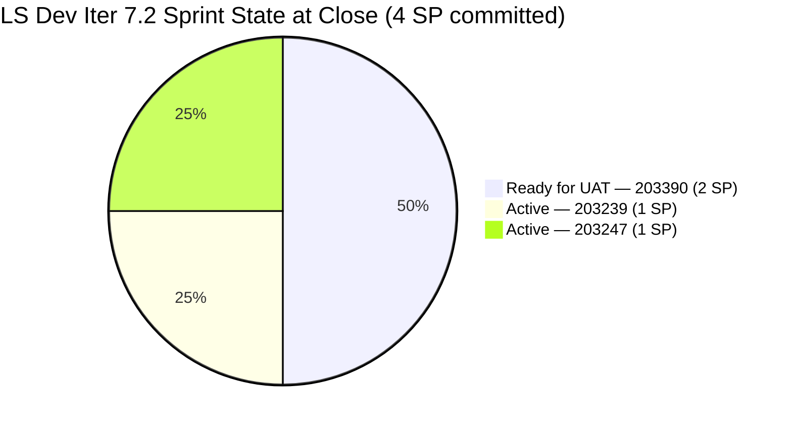
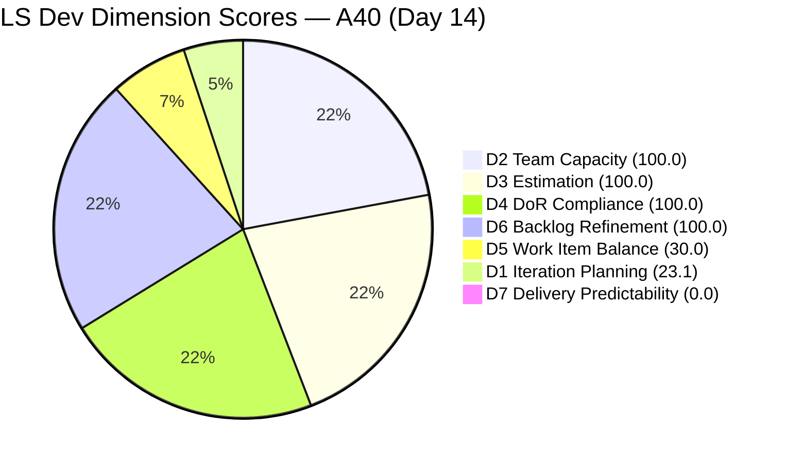
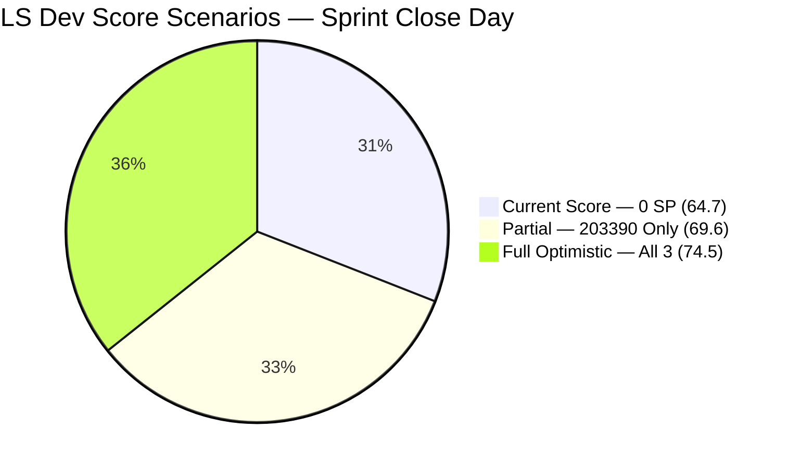
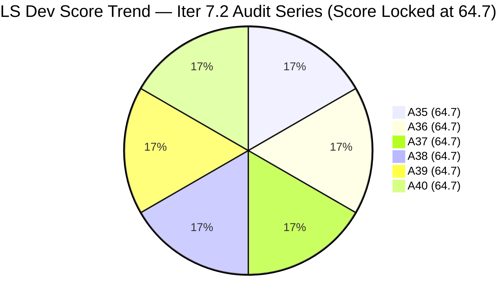

# SAFe Audit Report — Life Style Help App

**Audit A40 | Iteration 7.2 (Apr 20 – May 3, 2026) | Day 14 of 14 — Sprint Close Day**

---

## 1. Audit Metadata

| Field | Value |
|---|---|
| **Audit Date** | May 3, 2026, 09:02 UTC |
| **Auditor** | Claude Code (ADO SAFe Audit Agent) |
| **Workspace** | `ado_ls_dev` |
| **ADO Project** | Life Style Help App (`0f447778-7156-4451-ab21-27be3c4a5888`) |
| **Team** | Life Style Help App Team (`a2a805bc-0b30-4ef3-9a8a-b7f3081157a6`) |
| **Iteration** | Iteration 7.2 — Apr 20 to May 3, 2026 |
| **Iteration ID** | `71cd2555-1e1c-4767-8a57-393f87aabe1f` |
| **Sprint Day** | Day 14 of 14 — Sprint Close Day |
| **Prior Audit** | AUDIT_20260502_0903.md (A39, Iter 7.2 Day 13, Overall 64.7 — Moderate Risk) |
| **Scoring Model** | ADO SAFe v1 (7-dimension rubric) |
| **Overall Score** | **64.7 / 100** |
| **Risk Band** | **Moderate Risk** (60–79.9) |

---

## 2. Executive Summary

Life Style Help App closes Iteration 7.2 at **64.7 (Moderate Risk)** — **unchanged for the fifth consecutive audit** (A35 through A40). All three sprint items remain in their same states with no ADO activity since Apr 30:

- **#203390** (Subscription Auto-Cancels) — **Ready for UAT** — fix staged Apr 30, now 72+ hours without UAT completion
- **#203239** (emilienaess97 billing investigation) — **Active** — 14 days old, last touched Apr 28
- **#203247** (Heges Issues Spike) — **Active** — last updated Apr 29

**Sprint closes today. 0/4 SP delivered across a 14-day sprint.** This is the final opportunity to close any items before Iteration 7.2 ends. The UAT-ready fix for #203390 has been sitting untouched for over 72 hours. Luzmibel (tester) must act immediately to avoid a 0% delivery sprint — the worst possible D7 outcome.

**Score impact of closing items today:**
- Close #203390 only → D7 = 50.0 → Overall = 69.6
- Close all 3 items → D7 = 100.0 → Overall = 74.5
- Close none → D7 = 0.0 → Overall = 64.7 (sprint closes at this score)

**This sprint represents the deepest delivery failure in the LS Dev Iter 7.2 series:** The fix is done, the tester is assigned, and zero story points have been delivered across 14 days. This is a process breakdown, not a technical one.

---

## 3. Previous Audit Delta

| Dimension | A39 (May 2, 09:03 UTC) | A40 (May 3, 09:02 UTC) | Delta | Driver |
|---|---|---|---|---|
| Iteration Planning | 23.1 | **23.1** | 0.0 | 3/13 unchanged |
| Team Capacity | 100.0 | **100.0** | 0.0 | Samantha + Luzmibel configured; 2/2 |
| Estimation | 100.0 | **100.0** | 0.0 | 3/3 estimated (4 SP total) |
| DoR Compliance | 100.0 | **100.0** | 0.0 | All 3 pass Description + AC checks |
| Work Item Balance | 30.0 | **30.0** | 0.0 | Defect dominant (66.7%); no US |
| Backlog Refinement | 100.0 | **100.0** | 0.0 | All 13 items remain fresh |
| Delivery Predictability | 0.0 | **0.0** | 0.0 | 0/4 SP closed; no activity since Apr 30 |
| **Overall** | **64.7** | **64.7** | **0.0** | Fifth consecutive audit with no change |

**No ADO activity detected since Apr 30, 02:53 UTC** — when #203390 was moved to Ready for UAT. The sprint has been completely frozen for 72+ hours.

---

## 4. Current Iteration Snapshot

| Attribute | Value |
|---|---|
| **Iteration** | Iteration 7.2 |
| **Sprint Dates** | Apr 20 – May 3, 2026 (14 days) |
| **Sprint Day** | Day 14 of 14 — Close Day |
| **Days Remaining** | 0 (today is the last day) |
| **Visible Backlog Items** | 13 total |
| **Current Sprint Items** | 3 (#203390, #203239, #203247) |
| **Committed SP** | 4 SP (2 + 1 + 1) |
| **Closed SP** | 0 SP |
| **Capacity** | Samantha Babael: 1 Dev/day; Luzmibel Paculanang: 1 Testing/day |
| **Last ADO Activity** | Apr 30, 02:53 UTC — #203390 moved to Ready for UAT |
| **Sprint Delivery Rate** | 0% (0/4 SP) across 14-day sprint |

---

## 5. Work Item Analysis

| ID | Title | Type | Assignee | SP | State | Last Updated | Sprint Age |
|---|---|---|---|---|---|---|---|
| **203390** | Subscription Automatically Cancels at End of Binding Period | Defect | Samantha Babael | 2 | **Ready for UAT** | Apr 30, 02:53 | 13 days |
| **203239** | Investigate member emilienaess97@gmail.com | Defect | Samantha Babael | 1 | **Active** | Apr 28, 23:23 | 13 days |
| **203247** | 7.2 Collaborations / Check Heges Raised Issues / Replicate | Spike | Luzmibel Paculanang | 1 | **Active** | Apr 29, 07:32 | 13 days |

### Item-Level Analysis

**#203390 — Subscription Auto-Cancels (Ready for UAT, 2 SP)**
The fix is in place. Samantha staged it Apr 30 after investigating the root cause: customers' subscriptions were auto-cancelling at binding period end without manual cancellation. AC is explicit: *"subscription should remain active after the binding period unless the customer manually initiates a cancellation."* Luzmibel is the assigned tester. UAT has been blocked or deprioritized for 72+ hours. This is the highest-priority item to close today.

**#203239 — emilienaess97 Billing Investigation (Active, 1 SP)**
Member reported subscription cancellation effective Apr 21 but continued billing. Investigation scope: verify if member cancelled manually, if cancellation processed successfully, and why billing continued. Last touched Apr 28, 23:23 — 4 days without visible progress. At 14 days without resolution, this investigation either needs a documented conclusion (even if inconclusive) or formal escalation. High risk of carrying forward unresolved.

**#203247 — Heges Issues Spike (Active, 1 SP)**
Scope: review client communications, check raised issues, attempt replication in test environment, document findings. Last updated Apr 29. The spike is 14 days old — spikes should not run the full sprint duration without producing documented findings. If replication was attempted, findings must be written up and item closed today.

### Visible Backlog (Non-Current Items, 10 items)

| ID | Title | Type | IterPath | State | SP |
|---|---|---|---|---|---|
| 195716 | Hide "preferanser" inside recipe card | US | PI6/6.5 | Ready for Dev | 2 |
| 201334 | Collaboration / Check and Replicate Issues | Spike | PI6/6.5 | New | — |
| 202789 | Lifestyle App - Customer CSAT Survey | Spike | 7.6 (IP) | New | — |
| 194386 | Investigate re-occurring issue in cancellation process | Defect | root | Ready for UAT | 1 |
| 194082 | Customize the "Servings" Label | US | root | Ready for Dev | 1 |
| 194084 | Schedule Blog Post for Future Publication | US | root | Ready for Dev | 1 |
| 195229 | Email Notification for Forum Posts | US | root | Grooming | 1 |
| 195373 | Lifestyle App Performance Optimization | Enabler | root | New | — |
| 195727 | Meal time filter doesn't respond with search text | US | root | Ready for Dev | 2 |
| 196380 | Default Pinned Post for New Users | US | root | Ready for Dev | 3 |

**Notable:** 194386 (Defect — re-occurring cancellation issue) is also in Ready for UAT state in the visible backlog but not committed to Iter 7.2. It may be related to #203390.

---

## 6. SAFe Compliance Scorecard

| Dimension | Score | Evidence | Notes |
|---|---|---|---|
| **D1 Iteration Planning** | 23.1 | 3 / 13 visible backlog items in Iter 7.2 | 10 items uncommitted; structural under-commitment |
| **D2 Team Capacity** | 100.0 | Samantha (1 Dev/day) + Luzmibel (1 Testing/day) = 2/2 | Excellent |
| **D3 Estimation** | 100.0 | 3/3 items estimated (2+1+1 = 4 SP) | Excellent |
| **D4 DoR Compliance** | 100.0 | All 3 items: Description ≥30 chars, AC ≥20 chars — PASS | Excellent |
| **D5 Work Item Balance** | 30.0 | Defect 66.7% (>60% dominant, −30); no US (−40) | Reactive sprint — no proactive feature work |
| **D6 Backlog Refinement** | 100.0 | 13/13 fresh (all ≥ Apr 27); 0 stale_90; 0 stale_180; 0 untouched | Excellent |
| **D7 Delivery Predictability** | 0.0 | 0/4 SP closed; all 3 items non-Closed at sprint end | Critical — full sprint with 0 delivery |
| **Overall** | **64.7** | (23.1+100+100+100+30+100+0) / 7 = 64.7 | **Moderate Risk** |

---

## 7. Dimension Findings

### D1 — Iteration Planning: 23.1

```
visible_root_backlog_items = 13
current_iteration_root_items = 3   (#203390, #203239, #203247)
D1 = (3 / 13) × 100 = 23.1
```

Structural under-commitment: 10 of 13 backlog items are queued in future iterations or the root backlog (no iteration). The sprint committed only 3 reactive items (2 Defects, 1 Spike). Even committing 5–6 items from the existing root backlog would raise D1 to ~46.

### D2 — Team Capacity: 100.0

```
contributors_with_current_work = 2   (Samantha: #203390, #203239; Luzmibel: #203247)
contributors_with_capacity = 2       (Samantha: 1 Dev/day; Luzmibel: 1 Testing/day)
D2 = (2 / 2) × 100 = 100.0
```

Both active team members have configured capacity. The score reflects process setup quality, not delivery outcome.

### D3 — Estimation: 100.0

```
point_eligible_current_items = 3
estimated_current_items = 3   (2 SP + 1 SP + 1 SP = 4 SP)
D3 = (3 / 3) × 100 = 100.0
```

Full estimation coverage. No gap.

### D4 — DoR Compliance: 100.0

| ID | Description | AC | Result |
|---|---|---|---|
| 203390 | Subscription auto-cancel root cause + fix scope (≥30 chars) | "subscription should remain active..." (≥20 chars) | PASS |
| 203239 | Billing investigation scope: cancellation verification (≥30 chars) | "member should not be charged..." (≥20 chars) | PASS |
| 203247 | Collaboration scope: review, check, replicate, document (≥30 chars) | "review, check, replicate, document, conclude" (≥20 chars) | PASS |

```
dor_compliant_current_items = 3
D4 = (3 / 3) × 100 = 100.0
```

### D5 — Work Item Balance: 30.0

```
Item type breakdown (Iter 7.2):
  Defect: 2/3 = 66.7%
  Spike:  1/3 = 33.3%
  User Story: 0/3 = 0%

Penalties:
  No User Story in sprint        → −40
  Defect dominant (66.7% > 60%) → −30
  Spike share = 33.3% (< 40%)  → no spike penalty

D5 = 100 − 40 − 30 = 30.0
```

The entire sprint is reactive: customer-reported billing issues and a collaboration spike. No proactive feature development was planned or delivered. This is the second consecutive iteration without a User Story commitment.

### D6 — Backlog Refinement: 100.0

```
Freshness cutoff: May 3 − 45 = Mar 19, 2026
Stale_90 cutoff:  Feb 2, 2026
Stale_180 cutoff: Nov 5, 2025

All 13 visible backlog items last changed ≥ Apr 27, 2026 — all fresh

fresh_visible_root_items = 13
visible_root_backlog_items = 13

Base: (13 / 13) × 100 = 100.0

stale_90 = 0; stale_180 = 0
untouched_current_items: 
  #203390 last changed Apr 30 (after sprint start Apr 20) → fresh
  #203239 last changed Apr 28 → fresh
  #203247 last changed Apr 29 → fresh
  untouched = 0

D6 = 100.0 − 0 = 100.0
```

Backlog is well-maintained. All items touched within the sprint or recently before it. No aging debt.

### D7 — Delivery Predictability: 0.0

```
committed_story_points = 4   (#203390: 2 SP, #203239: 1 SP, #203247: 1 SP)
closed_story_points = 0      (all items non-Closed)
D7 = (0 / 4) × 100 = 0.0
```

**Critical.** Zero story points delivered across a 14-day sprint. This is the lowest possible D7 outcome. The fix for #203390 is complete and staged — only UAT execution is required. A 72-hour UAT delay on a ready-to-test item at sprint end represents a significant process failure.

### Overall Score Calculation

```
D1  =  23.1
D2  = 100.0
D3  = 100.0
D4  = 100.0
D5  =  30.0
D6  = 100.0
D7  =   0.0

Overall = (23.1 + 100.0 + 100.0 + 100.0 + 30.0 + 100.0 + 0.0) / 7
        = 453.1 / 7
        = 64.7
```

**Overall: 64.7 / 100 — Moderate Risk**

---

## 8. Sprint Completion Scenarios

| Scenario | Items Closed | SP Delivered | D7 | Overall | Band |
|---|---|---|---|---|---|
| **OPTIMISTIC (all 3)** | #203390, #203239, #203247 | 4/4 SP | 100.0 | **74.5** | Moderate Risk |
| **PARTIAL (#203390 only)** | #203390 | 2/4 SP | 50.0 | **69.6** | Moderate Risk |
| **PESSIMISTIC (none)** | None | 0/4 SP | 0.0 | **64.7** | Moderate Risk |

---

## 9. Risks and Bottlenecks

| # | Risk | Severity | Owner | Status |
|---|---|---|---|---|
| R1 | **#203390 UAT blocked 72+ hours** — fix is ready, sprint closes today; Luzmibel is the only UAT gate | **Critical** | Luzmibel (Tester) | FINAL HOUR — close today |
| R2 | **0/4 SP delivered at sprint close** — entire 14-day sprint at 0% delivery if no action today | **Critical** | Team | URGENT |
| R3 | **#203239 billing investigation 14 days, no resolution** — highest carry-forward risk | **Critical** | Samantha | Likely carry-forward to Iter 7.3 |
| R4 | **#203247 spike 14 days with no documented findings** — spike should not run full sprint | High | Luzmibel | Close or document conclusions today |
| R5 | **D5 = 30 — two consecutive sprints without User Stories** | High | PO | Iter 7.3 must include proactive features |
| R6 | **D1 = 23.1 — structural under-commitment** | High | PO | 10 of 13 items uncommitted; fix in Iter 7.3 |
| R7 | **No Iteration Goal defined** | Moderate | PO | Recurring — unfixed across full series |
| R8 | **194386 (re-occurring cancellation) still in Ready for UAT but not committed** — possible related defect to #203390 | Moderate | PO | Evaluate for Iter 7.3 |
| R9 | **Luzmibel as sole tester is a bottleneck** — single point of failure for UAT across 2 defect items | Moderate | PO | Structural |

---

## 10. Prioritized Recommendations

### Immediate (Today — Last Day of Sprint)

1. **CRITICAL — Complete UAT on #203390 NOW.** The fix has been ready since Apr 30. Luzmibel must execute UAT immediately. This is not a development task — it requires testing and closure only. Closing this single item converts 2 SP and rescues partial D7 credit (+4.9 to Overall). This is the only action that can improve the sprint score before it closes.

2. **Conclude and close #203247 (Heges Issues Spike).** Document what was found: communications reviewed, issues checked, replication results. Even a partial conclusion qualifies for closure. If unresolved, write up findings and close the spike — follow-up work becomes a new item in Iter 7.3.

3. **Document and de-commit #203239.** At 14 days without resolution, this investigation requires a formal outcome: either findings (positive/negative), escalation to the subscription provider, or a carried-forward task. Close the defect with whatever documentation exists and create a follow-up if needed.

### Sprint Planning (Iter 7.3)

4. **Include at least 1 User Story.** The root backlog contains 5 Ready-for-Dev User Stories: 194082 (Servings Label), 194084 (Schedule Blog Post), 195727 (Meal Filter), 196380 (Default Pinned Post), 195716 (Recipe Card). Committing even 1 eliminates the D5 −40 penalty and shifts the sprint from purely reactive to feature-delivery mode.

5. **Cap Defect share below 60%.** The team's pattern of committing only defects triggers the D5 −30 dominant type penalty every sprint. Target composition: 1+ User Story + ≤ 2 Defects + optional Spike.

6. **Increase sprint commitment to 5–7 items.** The root backlog has 10+ unassigned items. Committing 5 items would raise D1 from 23.1 to ~38.5. Committing 7 would reach ~53.8. This single change can add 5+ points to Overall without any delivery effort.

7. **Define an Iteration Goal for Iter 7.3.** Suggested: *"Resolve the subscription cancellation billing defect, deliver the Servings Label customization feature, and clear the emilienaess97 billing investigation."*

8. **Evaluate 194386 (re-occurring cancellation issue).** This item has been in Ready for UAT for an extended period and is likely related to the subscription auto-cancel pattern. Consider committing it to Iter 7.3 and testing it alongside the #203390 fix.

---

## 11. Evidence Gaps and Limitations

| Gap | Impact | Mitigation |
|---|---|---|
| No UAT progress update on #203390 since Apr 30 | Cannot confirm if UAT has begun but not logged in ADO | Luzmibel should be contacted directly |
| #203239 investigation findings not documented in ADO | Outcome unclear; may be in WhatsApp or email | Document in ADO regardless of outcome |
| #203247 spike findings not recorded | Cannot assess completeness | Write findings to item description/comments |
| No iteration goal in ADO | Sprint goal execution unmeasurable | Persistent — all LS Dev audits |
| D1 affected by uncommitted root backlog items with no iteration path | 10 items inflate denominator without offering current-sprint credit | Assign iteration paths during Iter 7.3 planning |

---

## 12. Mermaid Charts

### Sprint Delivery Status — Day 14 (Sprint Close)



### Dimension Score Breakdown — Audit A40



### Score vs. Delivery Scenario



### Sprint Score Stagnation — 5 Consecutive Audits



---

## 13. Sprint Close Assessment

This sprint represents the most stagnant iteration in the LS Dev audit series: five consecutive daily audits with zero change in score, zero story points delivered, and a fix that has been test-ready for 72+ hours without UAT.

**The team is process-blocked, not technically blocked.** The development work is done. The test environment is available. The tester (Luzmibel) is assigned. Only workflow execution — a single UAT pass — separates this sprint from its first delivered story point.

Iter 7.3 planning must address three structural issues that have persisted across multiple iterations:
1. No User Stories (structural D5 penalty every sprint)
2. Under-commitment (D1 at 23.1 when 10 uncommitted items exist)
3. UAT bottleneck (single tester blocking delivery when fixes are complete)

Resolving all three in Iter 7.3 could move the team from Moderate (64.7) to Low Risk (≥80) in a single sprint.

---

*Report generated: 2026-05-03 09:02 UTC | Workspace: ado_ls_dev | Iteration 7.2 Day 14 — Sprint Close Day | Score: 64.7 Moderate Risk*
*Sprint closes today with 0/4 SP delivered across 14 days. #203390 fix has been in Ready for UAT since Apr 30 — UAT completion is the only remaining action that can improve this sprint's score before close.*
