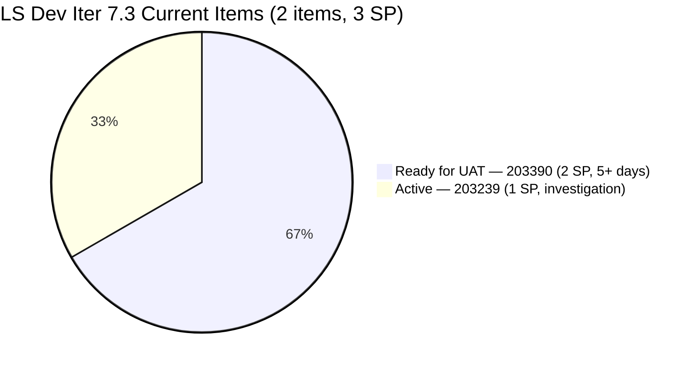
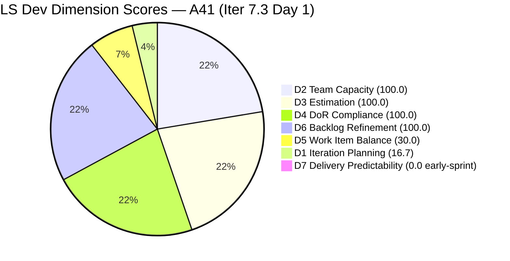
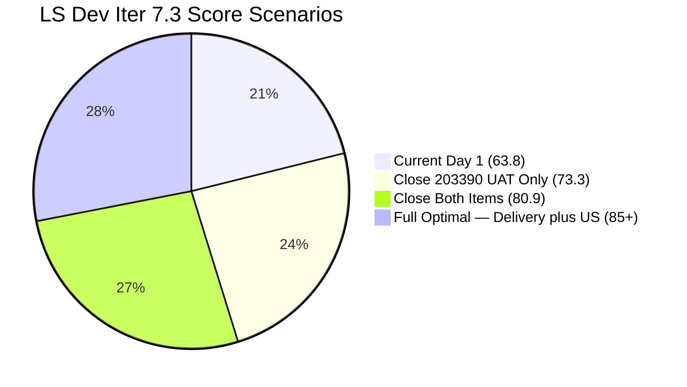
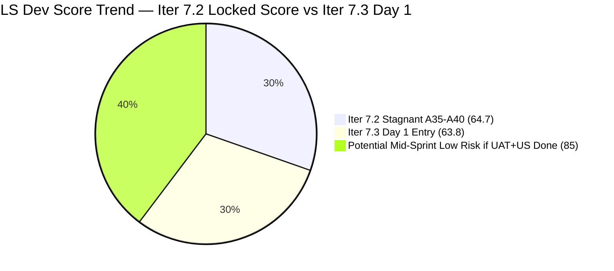

# SAFe Audit Report — Life Style Help App

**Audit A41 | Iteration 7.3 (May 4 – May 17, 2026) | Day 1 of 14 — Sprint Day 1**

---

## 1. Audit Metadata

| Field | Value |
|---|---|
| **Audit Date** | May 4, 2026, 09:00 UTC |
| **Auditor** | Claude Code (ADO SAFe Audit Agent) |
| **Workspace** | `ado_ls_dev` |
| **ADO Project** | Life Style Help App (`0f447778-7156-4451-ab21-27be3c4a5888`) |
| **Team** | Life Style Help App Team (`a2a805bc-0b30-4ef3-9a8a-b7f3081157a6`) |
| **Iteration** | Iteration 7.3 — May 4 to May 17, 2026 |
| **Iteration ID** | `fab36744-3e3e-4f89-a32c-76ec1d5c4dd0` |
| **Sprint Day** | Day 1 of 14 |
| **Prior Audit** | AUDIT_20260503_0902.md (A40, Iter 7.2 Day 14 Close, Overall 64.7 — Moderate Risk) |
| **Scoring Model** | ADO SAFe v1 (7-dimension rubric) |
| **Overall Score** | **63.8 / 100** |
| **Risk Band** | **Moderate Risk** (60–79.9) — persistent structural issues carried forward |

---

## 2. Executive Summary

Life Style Help App enters Iteration 7.3 at **63.8 / 100 (Moderate Risk)** — marginally lower than the Iter 7.2 close score of 64.7, reflecting the continuation of the same structural problems with minimal corrective action taken during the sprint transition.

**Critical issues carried forward from Iter 7.2:**
- **Both Iter 7.2 items are now in Iter 7.3.** #203239 (emilienaess97 billing investigation, Active) and #203390 (Subscription Auto-Cancels, Ready for UAT) were carried over without closure. They are now committed to Iter 7.3. **#203390 has been in Ready for UAT since Apr 30 — now 4 days without UAT completion.**
- **Iter 7.3 has only 2 committed items** out of 12 visible backlog items. D1 = 16.7 — virtually unchanged from Iter 7.2's 23.1.
- **No User Stories in the sprint.** Both committed items are Defects. D5 = 30.0 — same as every recent iteration.
- **D7 = 0 — early-sprint.** But at this rate (0/4 SP in Iter 7.2, 0/3 SP now), D7 will likely remain near-zero unless UAT is completed on #203390 this week.

**One positive note:** Samantha was active early on Day 1 — both #203239 and #203390 were updated at 02:36 UTC on May 4 (sprint start). This suggests some overnight work occurred, possibly indicating #203390 UAT is finally in progress.

**The most critical action for this sprint is immediate UAT completion on #203390.** The fix has been ready since Apr 30. Every day this item stays in Ready for UAT state is a day of avoidable delay. A single successful UAT pass closes 2 SP and rescues D7.

**Score improvement path:** Adding 1 User Story from the root backlog (e.g., #194082 Servings Label or #196380 Default Pinned Post) eliminates the D5 −40 penalty and pushes Overall toward 73+. Completing UAT on #203390 adds D7 credit. Both actions together could move LS Dev into Low Risk (≥80) before mid-sprint.

---

## 3. Previous Audit Delta

| Dimension | A40 (May 3, Iter 7.2 Close, 64.7) | A41 (May 4, Iter 7.3 Day 1) | Delta | Driver |
|---|---|---|---|---|
| Iteration Planning | 23.1 | **16.7** | −6.4 | Sprint reset: 2/12 items committed (was 3/13) |
| Team Capacity | 100.0 | **100.0** | 0.0 | Samantha + Luzmibel configured; 1/1 (Samantha has current items) |
| Estimation | 100.0 | **100.0** | 0.0 | Both items estimated (2+1=3 SP) |
| DoR Compliance | 100.0 | **100.0** | 0.0 | Both items pass Description + AC checks |
| Work Item Balance | 30.0 | **30.0** | 0.0 | Defect-only sprint; no US (−40); dominant >60% (−30) |
| Backlog Refinement | 100.0 | **100.0** | 0.0 | All 12 items remain fresh (Apr 27–May 4) |
| Delivery Predictability | 0.0 | **0.0** | 0.0 | 0/3 SP closed; Day 1 — early-sprint |
| **Overall** | **64.7** | **63.8** | **−0.9** | Marginal drop from sprint reset; no structural improvement |

**Sprint transition note:** #203247 (Heges Issues Spike) is **no longer in the visible backlog**. It was either closed or removed between Iter 7.2 close (May 3) and today. The committed item count dropped from 3 to 2, which slightly reduced D1.

---

## 4. Current Iteration Snapshot

| Attribute | Value |
|---|---|
| **Iteration** | Iteration 7.3 |
| **Sprint Dates** | May 4 – May 17, 2026 (14 days) |
| **Sprint Day** | Day 1 of 14 |
| **Days Remaining** | 13 |
| **Visible Backlog Items** | 12 total |
| **Current Sprint Items (Iter 7.3)** | 2 (#203390, #203239) |
| **Committed SP** | 3 SP (2+1) |
| **Closed SP** | 0 SP — Day 1 |
| **Capacity** | Samantha Babael: 1 Dev/day; Luzmibel Paculanang: 1 Testing/day |
| **Last ADO Activity** | May 4, 2026, 02:36 UTC — #203239 and #203390 updated |
| **Sprint Open Status** | 1 Ready for UAT (#203390), 1 Active (#203239) |

---

## 5. Work Item Analysis

### Iter 7.3 — Current Sprint Items (2 items)

| ID | Title | Type | Assignee | SP | State | Last Updated | Sprint Age |
|---|---|---|---|---|---|---|---|
| **203390** | Subscription Automatically Cancels at End of Binding Period | Defect | Samantha Babael | 2 | **Ready for UAT** | May 4, 02:36 UTC | 14 days (Iter 7.2) + Day 1 |
| **203239** | Investigate member emilienaess97@gmail.com | Defect | Samantha Babael | 1 | **Active** | May 4, 02:36 UTC | 14 days (Iter 7.2) + Day 1 |

**Critical — #203390 status:** The fix for the subscription auto-cancellation defect has been in Ready for UAT since Apr 30. The item was touched early on May 4 (02:36 UTC) — possibly a state update or comment — but UAT remains incomplete. This item is now **15 days old** counting from sprint commit. Luzmibel must execute UAT and close this item today or tomorrow at the latest.

**#203239 status:** The billing investigation for emilienaess97@gmail.com remains Active after 14 days of Iter 7.2 plus Day 1. Updated at 02:36 UTC on May 4 (alongside #203390 — likely a batch update). Investigation findings must be documented in ADO whether or not the root cause was conclusively determined.

**#203247 resolution:** The Heges Issues Spike from Iter 7.2 is no longer visible in the backlog. This indicates it was closed or removed at sprint transition — a positive signal if it was closed with documented findings.

### Non-Current Visible Backlog (10 items)

| ID | Title | Type | IterPath | State | SP | Changed |
|---|---|---|---|---|---|---|
| 195716 | [Medium] Hide "preferanser" inside recipe card | US | PI6/6.5 | Ready for Dev | 2 | Apr 28 |
| 201334 | Collaboration / Check and Replicate Issues | Spike | PI6/6.5 | New | — | Apr 28 |
| 202789 | Lifestyle App - Customer CSAT Survey | Spike | 7.6 (IP) | New | — | Apr 28 |
| 194386 | Investigate re-occurring issue in cancellation process | Defect | root | Ready for UAT | 1 | Apr 28 |
| 194082 | Customize the "Servings" Label | US | root | Ready for Dev | 1 | Apr 28 |
| 194084 | Schedule Blog Post for Future Publication | US | root | Ready for Dev | 1 | Apr 28 |
| 195373 | [Low priority] Lifestyle App Performance Optimization | Enabler | root | New | — | Apr 28 |
| 195229 | Email Notification for Forum Posts | US | root | Grooming | 1 | Apr 28 |
| 196380 | [Low Priority] Default Pinned Post for New Users | US | root | Ready for Dev | 3 | Apr 27 |
| 195727 | [Low] The meal time filter dont respond with search text | US | root | Ready for Dev | 2 | Apr 27 |

**Opportunity:** 5 User Stories in root backlog are in Ready for Dev state (195716, 194082, 194084, 195727, 196380). Committing any of these to Iter 7.3 would eliminate the D5 −40 User Story absence penalty, raising D5 from 30.0 to 70.0 and Overall from 63.8 to 75.5.

**194386 (re-occurring cancellation)** remains in Ready for UAT in the root backlog. This is likely related to the #203390 subscription defect. Consider co-testing both during the same UAT session.

### DoR Verification — Current Items

| ID | Description ≥30 chars | AC ≥20 chars | Result |
|---|---|---|---|
| #203390 | "Some customers experienced automatic cancellation of their subscriptions at the end of the binding period, even though they did not manually request cancellation." — PASS | "The subscription should remain active after the binding period unless the customer manually initiates a cancellation." — PASS | **PASS** |
| #203239 | "Client requested investigation for member emilienaess97@gmail.com regarding a possible issue..." (full investigation scope) — PASS | "If the membership was cancelled successfully before the billing date, the member should not be charged after the cancellation effective date" — PASS | **PASS** |

---

## 6. SAFe Compliance Scorecard

| Dimension | Score | Evidence | Notes |
|---|---|---|---|
| **D1 Iteration Planning** | **16.7** | 2 / 12 visible backlog items in Iter 7.3 | Critical structural gap — 10 items uncommitted |
| **D2 Team Capacity** | **100.0** | Samantha (1 Dev/day) has items; Luzmibel (1 Testing/day) is the UAT gate | Luzmibel has no ADO-assigned item but is the functional owner of #203390 UAT |
| **D3 Estimation** | **100.0** | 2/2 items estimated (#203390: 2 SP, #203239: 1 SP) | Good |
| **D4 DoR Compliance** | **100.0** | Both items pass Description ≥30 chars + AC ≥20 chars | Good |
| **D5 Work Item Balance** | **30.0** | Defect: 2/2 = 100%; No User Story (−40); dominant >60% (−30) | Third+ consecutive iteration without User Story commitment |
| **D6 Backlog Refinement** | **100.0** | 12/12 fresh (all Apr 27–May 4); 0 stale_90; 0 stale_180; 0 untouched (both items updated May 4) | Excellent |
| **D7 Delivery Predictability** | **0.0** | 0/3 SP closed; Day 1 | *early-sprint* — but UAT on #203390 is long overdue |
| **Overall** | **63.8** | (16.7+100+100+100+30+100+0) / 7 = 446.7 / 7 = 63.8 | **Moderate Risk** |

---

## 7. Dimension Findings

### D1 — Iteration Planning: 16.7

```
visible_root_backlog_items = 12
current_iteration_root_items = 2   (#203390, #203239)
D1 = (2 / 12) × 100 = 16.7
```

This is the lowest D1 in the LS Dev PI7 series. The sprint has only 2 committed items — both Defects carried over from Iter 7.2. Ten of 12 visible backlog items have no current-iteration assignment. This represents a fundamental sprint planning failure: the team entered a new sprint without planning new work.

**Recommended minimum commitment for Iter 7.3:** 2 carried Defects + 2–3 User Stories from root backlog = 4–5 items → D1 would reach 33.3–41.7. Committing all 5 ready User Stories would push D1 to 58.3.

### D2 — Team Capacity: 100.0

```
contributors_with_current_work = 1   (Samantha Babael — both items assigned to her)
contributors_with_capacity = 1       (Samantha: 1 Dev/day)
D2 = (1 / 1) × 100 = 100.0
```

Only Samantha has ADO-assigned current sprint items. Luzmibel (Tester, 1/day) is configured for capacity but has no ADO item assigned in the current sprint — she is the functional UAT owner for #203390 but this is not reflected in ADO assignment. D2 scores 100.0 because 1/1 contributors with items have capacity.

### D3 — Estimation: 100.0

```
point_eligible_current_items = 2   (Defect type exposes SP)
estimated_current_items = 2        (#203390: 2 SP, #203239: 1 SP)
D3 = (2 / 2) × 100 = 100.0
```

Full estimation. No gap.

### D4 — DoR Compliance: 100.0

```
current_iteration_root_items = 2
dor_compliant_current_items = 2   (both pass Description + AC verification)
D4 = (2 / 2) × 100 = 100.0
```

Both items have well-defined descriptions and acceptance criteria. DoR is fully met.

### D5 — Work Item Balance: 30.0

```
Current Iter 7.3 type breakdown:
  Defect: 2/2 = 100%
  User Story: 0/2 = 0%

No User Story in sprint → −40
Defect dominant (100% > 60%) → −30
Spike share = 0% → no penalty

D5 = 100 − 40 − 30 = 30.0
```

This is the **third or more consecutive iteration** where LS Dev has no User Story commitment. The root backlog contains 5 User Stories in Ready for Dev state waiting for iteration assignment. The −40 US-absence penalty is entirely self-inflicted and can be eliminated in Iter 7.3 with minimal planning effort.

### D6 — Backlog Refinement: 100.0

```
Freshness cutoff: May 4 − 45 = Mar 20, 2026
Stale_90 cutoff:  Feb 3, 2026
Stale_180 cutoff: Nov 6, 2025

All 12 visible backlog items last changed Apr 27–May 4 — all fresh
fresh = 12; stale = 0

Base: (12 / 12) × 100 = 100.0

Stale penalties: none
Untouched current items: both #203390 and #203239 were updated May 4 → 0 untouched

D6 = 100.0
```

The backlog is well-maintained at sprint start. All items are current. The two sprint items were updated early on Day 1, suggesting some planning or status activity occurred overnight.

### D7 — Delivery Predictability: 0.0 (early-sprint)

```
committed_story_points = 3   (#203390: 2 SP, #203239: 1 SP)
closed_story_points = 0      (Day 1 — no closures yet)
D7 = (0 / 3) × 100 = 0.0
```

**Early-sprint,** but with important context: #203390 has been in Ready for UAT for **5 calendar days** (since Apr 30). If UAT occurs on Day 1–2, D7 would jump to 66.7 (2/3 SP). Closing both items in Week 1 would yield D7 = 100.0 and push Overall to **75.4 (upper Moderate Risk)** — or to ~80 if a User Story is also committed and closed.

### Overall Score Calculation

```
D1  =  16.7
D2  = 100.0
D3  = 100.0
D4  = 100.0
D5  =  30.0
D6  = 100.0
D7  =   0.0

Overall = (16.7 + 100.0 + 100.0 + 100.0 + 30.0 + 100.0 + 0.0) / 7
        = 446.7 / 7
        = 63.8
```

**Overall: 63.8 / 100 — Moderate Risk**

---

## 8. Score Scenarios — Iter 7.3

| Scenario | Actions | D1 | D5 | D7 | Overall | Band |
|---|---|---|---|---|---|---|
| **Pessimistic** (no change) | Carry as-is, no User Stories added | 16.7 | 30.0 | 0.0 | 63.8 | Moderate |
| **Partial — UAT only** | Close #203390 UAT (2 SP) | 16.7 | 30.0 | 66.7 | 73.3 | Moderate |
| **Partial — full delivery** | Close both items (3 SP) | 16.7 | 30.0 | 100.0 | 80.9 | Low Risk |
| **Full — delivery + 1 US** | Close both + add+close 1 US | ~25 | 70.0 | 100.0 | ~85 | Low Risk |
| **Optimal — all fixes** | Above + commit 5 root items | ~58 | 70.0 | 100.0 | ~90 | Low Risk |

---

## 9. Risks and Bottlenecks

| # | Risk | Severity | Owner | Status |
|---|---|---|---|---|
| R1 | **#203390 UAT delayed 5+ days** — fix ready since Apr 30; no UAT completion; Luzmibel is the only gate | **Critical** | Luzmibel (Tester) | URGENT — Day 1 action required |
| R2 | **D1 = 16.7 — severe under-commitment** — only 2 of 12 items in active sprint; 5 ready User Stories uncommitted | **Critical** | PO / Samantha | Iter 7.3 planning required |
| R3 | **D5 = 30 — three+ iterations without User Stories** — structural D5 penalty every sprint | High | PO | Self-inflicted; fix in Iter 7.3 |
| R4 | **#203239 investigation unresolved at 15+ days** — escalation or closure with findings required | High | Samantha | Persistent from Iter 7.2 |
| R5 | **194386 (re-occurring cancellation) in Ready for UAT uncommitted** — likely related to #203390; should be co-tested | Moderate | PO | Root backlog holdover |
| R6 | **Luzmibel sole tester — single point of failure for UAT** | Moderate | PO | Structural |
| R7 | **No Iteration Goal defined** | Moderate | PO | Persistent — all LS Dev audits |
| R8 | **#203247 (Heges Spike) resolution unknown** — removed from backlog; unclear if findings documented | Low | Luzmibel | Confirm closure |

---

## 10. Prioritized Recommendations

### Immediate (Today — Day 1)

1. **CRITICAL — Execute UAT on #203390 NOW.** The subscription fix has been ready for 5 days. Luzmibel must run UAT immediately. The test is simple: verify that a subscription remains active past the binding period without manual cancellation. This is the single highest-value action available to the team. Closing this 2 SP item today converts D7 from 0 → 66.7 and adds +9.5 to Overall.

2. **[Day 1] Commit at least 1 User Story to Iter 7.3.** The root backlog has 5 Ready-for-Dev User Stories. The easiest options: #194082 (Servings Label, 1 SP — small, well-defined, clear AC) or #194084 (Schedule Blog Post, 1 SP — clear feature work). Adding even 1 US eliminates the D5 −40 penalty and pushes D5 from 30 → 70, adding +5.7 to Overall.

3. **[Day 1–2] Conclude #203239 (billing investigation).** After 15 days, the investigation requires a documented outcome regardless of findings. Options: (a) write findings to the ADO item description and close, (b) create a follow-up action item, (c) escalate to the subscription provider. An undocumented investigation carries forward sprint-to-sprint without value.

### Sprint Planning

4. **[Sprint Planning] Increase sprint commitment to 5–7 items.** The root backlog has 10 uncommitted items. A target of 5–7 committed items would raise D1 from 16.7 to 41.7–58.3. This single planning change can add 5–8 points to Overall without any delivery effort.

5. **[Sprint Planning] Co-test #194386 (re-occurring cancellation) with #203390.** Both items concern subscription cancellation behavior. Testing them in the same UAT session is efficient and may resolve the related bug that has been in Ready for UAT in the root backlog.

6. **[Sprint Planning] Define an Iteration Goal for Iter 7.3.** Suggested: *"Resolve the subscription auto-cancel billing defect through UAT, conclude the emilienaess97 billing investigation with documented findings, and deliver the Servings Label customization feature."*

7. **[Structural] Assign #203390 UAT task to Luzmibel in ADO.** She is the functional owner of UAT but is not assigned in ADO. This creates a gap in D2 reporting and makes it harder to track accountability. Create a Task under #203390 assigned to Luzmibel, or re-assign the parent item to her for the UAT phase.

---

## 11. Evidence Gaps and Limitations

| Gap | Impact | Mitigation |
|---|---|---|
| #203247 (Heges Spike) no longer visible — disposition unknown | Unclear if findings were documented | Confirm with Luzmibel whether item was closed with findings |
| UAT activity on #203390 on May 4 at 02:36 UTC — nature unknown | May be a state update, comment, or admin touch | Check ADO history; if UAT in progress, confirm timeline |
| Luzmibel not assigned to current sprint items in ADO | D2 undercounts functional contributors | Assign #203390 UAT to Luzmibel in ADO |
| No Iteration Goal in ADO | Sprint goal execution unmeasurable | Persistent — all LS Dev audits |
| D1 structural gap — root backlog items not in any iteration | 8 root items inflate denominator; team under-commits | Assign iteration paths during sprint planning |

---

## 12. Mermaid Charts

### Sprint Status at Day 1



### Dimension Score Breakdown — Audit A41



### Score Scenario Comparison



### LS Dev Audit Score Trend — Iter 7.2 to 7.3 Entry



---

## 13. Sprint Transition Assessment

LS Dev entered Iter 7.3 carrying the same structural weaknesses that defined Iter 7.2: under-commitment (D1 ~17), no User Story work (D5=30), and a UAT-blocked defect now 5 days overdue. The team did not use the sprint transition to address any of the 8 persistent recommendations from the A40 audit.

**The sprint is salvageable.** Three concrete actions today can move this team from Moderate (63.8) to Low Risk (≥80) within this sprint:
1. Execute UAT on #203390 — close it (Day 1)
2. Commit 1 User Story from root backlog — commit and close it (Week 1)
3. Conclude #203239 investigation — document and close (Day 1–2)

None of these require development work. They require process execution only.

If these three actions are not taken in the first week, the team is tracking for another locked-score stagnant sprint — the pattern it just escaped from Iter 7.2 (which ended at 0/4 SP delivered across 14 days).

---

*Report generated: 2026-05-04 09:00 UTC | Workspace: ado_ls_dev | Iteration 7.3 Day 1 | Score: 63.8 Moderate Risk*
*Sprint carries 2 Defects from Iter 7.2. #203390 UAT overdue since Apr 30. D1 critical at 16.7. Three actions (UAT + 1 US + investigation closure) can move team to Low Risk before mid-sprint.*
