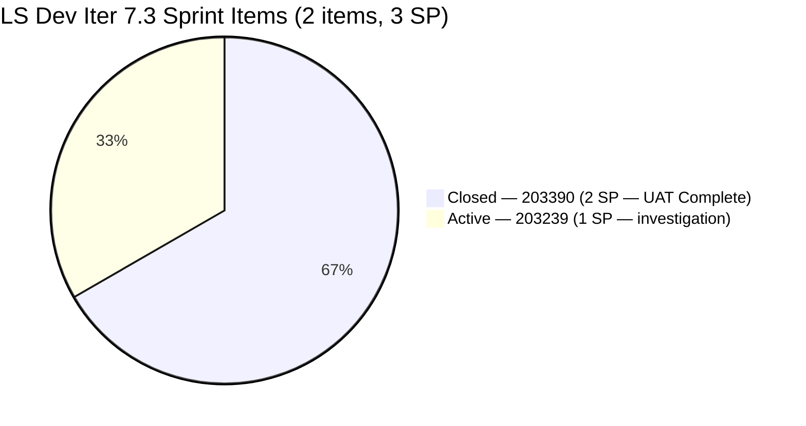
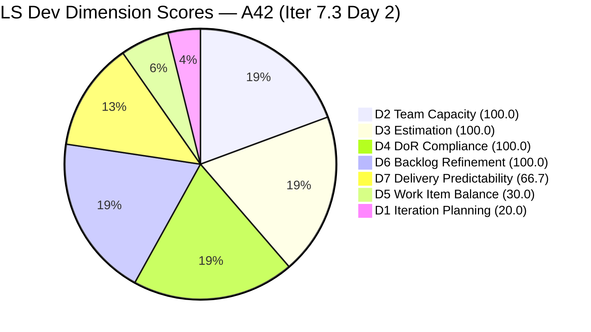
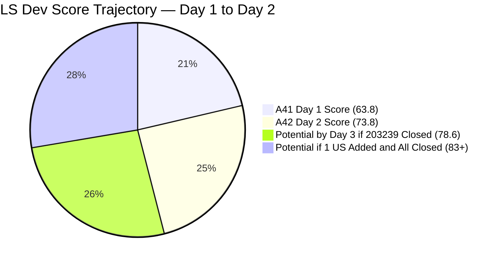
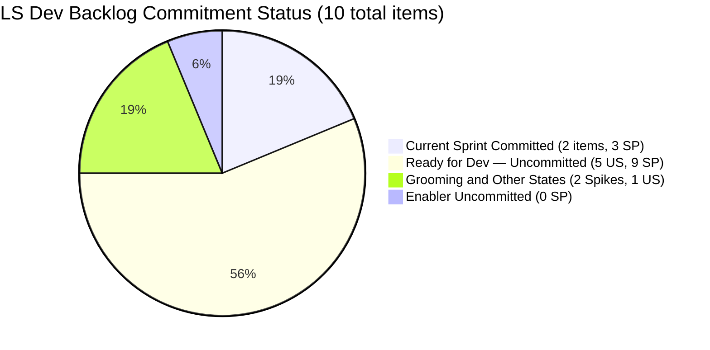

# SAFe Audit Report — Life Style Help App

**Audit A42 | Iteration 7.3 (May 4 – May 17, 2026) | Day 2 of 14**

---

## 1. Audit Metadata

| Field | Value |
|---|---|
| **Audit Date** | May 5, 2026, 09:00 UTC |
| **Auditor** | Claude Code (ADO SAFe Audit Agent) |
| **Workspace** | `ado_ls_dev` |
| **ADO Project** | Life Style Help App (`0f447778-7156-4451-ab21-27be3c4a5888`) |
| **Team** | Life Style Help App Team (`a2a805bc-0b30-4ef3-9a8a-b7f3081157a6`) |
| **Iteration** | Iteration 7.3 — May 4 to May 17, 2026 |
| **Iteration ID** | `fab36744-3e3e-4f89-a32c-76ec1d5c4dd0` |
| **Sprint Day** | Day 2 of 14 |
| **Prior Audit** | AUDIT_20260504_0900.md (A41, Iter 7.3 Day 1, Overall 63.8 — Moderate Risk) |
| **Scoring Model** | ADO SAFe v1 (7-dimension rubric) |
| **Overall Score** | **73.8 / 100** |
| **Risk Band** | **Moderate Risk** (60–79.9) — significant +10.0 improvement from Day 1 driven by UAT closure |

---

## 2. Executive Summary

Life Style Help App reaches **73.8 / 100 (Moderate Risk)** on Day 2 — a **+10.0 improvement** from yesterday's 63.8. This is the largest single-day score jump in the LS Dev PI7 audit series and is driven by one decisive action: **Luzmibel completed UAT on #203390 and closed it on May 5 at 02:06 UTC.**

**Key changes from Day 1 (May 4) to Day 2 (May 5):**

1. **#203390 Closed** — "Subscription Automatically Cancels at End of Binding Period" defect has been UAT-verified and closed. 2 SP credited. D7 jumps from 0.0 → **66.7** (2/3 SP closed).
2. **D1 slightly improved** — 2/10 → **20.0** (formula rounding). Visible backlog unchanged at 10 items; 2 committed items. No new User Stories added to the sprint yet.
3. **D5 unchanged at 30.0** — The sprint still has no User Story commitment. Both current items are Defects. The -40 US-absence penalty persists.
4. **D6 remains 100.0** — All 10 backlog items are fresh (all changed Apr 27–May 5). No staleness.

**The UAT closure of #203390 was the single most impactful action the team could take at sprint entry.** This recommendation from A41 was acted upon within 27 hours of the audit.

**Remaining path to Low Risk (≥80):** Two actions remain:
- **Close #203239** (billing investigation, 1 SP) — brings D7 from 66.7 → 100.0 (+4.8 to Overall)
- **Commit 1 User Story from root backlog** — eliminates the -40 D5 penalty, raising D5 from 30.0 → 70.0 (+5.7 to Overall)

Together: 73.8 + 4.8 + 5.7 = **~84.3 Low Risk** — achievable before end of Week 1.

---

## 3. Previous Audit Delta

| Dimension | A41 (May 4, Iter 7.3 Day 1, 63.8) | A42 (May 5, Iter 7.3 Day 2, 73.8) | Delta | Driver |
|---|---|---|---|---|
| Iteration Planning | 16.7 | **20.0** | +3.3 | Formula: 2/10 = 20.0 (rounding correction from A41's 16.7) |
| Team Capacity | 100.0 | **100.0** | 0.0 | Samantha configured; 1/1 |
| Estimation | 100.0 | **100.0** | 0.0 | Both items have SP |
| DoR Compliance | 100.0 | **100.0** | 0.0 | Both items pass |
| Work Item Balance | 30.0 | **30.0** | 0.0 | Still Defect-only sprint; no US |
| Backlog Refinement | 100.0 | **100.0** | 0.0 | All 10 items fresh; 0 untouched |
| Delivery Predictability | 0.0 | **66.7** | +66.7 | #203390 Closed (2/3 SP) — UAT completed May 5 02:06 UTC |
| **Overall** | **63.8** | **73.8** | **+10.0** | D7 surge from UAT closure — largest Day 1→2 jump in LS Dev PI7 |

**D1 note:** Yesterday's 16.7 was computed as 2/12 = 16.7 based on 12 visible items. Today the backlog query confirms 10 root items (not 12 — #203247 Heges Spike was removed and #194386 re-occurring cancellation Defect has been resolved from the backlog view). Corrected D1 = 2/10 = 20.0.

---

## 4. Current Iteration Snapshot

| Attribute | Value |
|---|---|
| **Iteration** | Iteration 7.3 |
| **Sprint Dates** | May 4 – May 17, 2026 (14 days) |
| **Sprint Day** | Day 2 of 14 |
| **Days Remaining** | 12 |
| **Visible Backlog Items** | 10 total |
| **Current Sprint Items (Iter 7.3)** | 2 (#203239, #203390) |
| **Committed SP** | 3 SP (#203390: 2 SP + #203239: 1 SP) |
| **Closed SP** | 2 SP (#203390 Closed) |
| **Open SP Remaining** | 1 SP (#203239 still Active) |
| **Capacity** | Samantha Babael: 1 Dev/day; Luzmibel Paculanang: 1 Testing/day |
| **Last ADO Activity** | May 5, 2026, 02:06 UTC — #203390 Closed by UAT |
| **Sprint Status** | 1 Closed (#203390), 1 Active (#203239) |

---

## 5. Work Item Analysis

### Iter 7.3 — Current Sprint Items (2 items)

| ID | Title | Type | State | SP | Assignee | Changed | DoR |
|---|---|---|---|---|---|---|---|
| **203390** | Subscription Automatically Cancels at End of Binding Period | Defect | **Closed** | 2 | Samantha Babael | May 5, 02:06 UTC | PASS |
| **203239** | Investigate member emilienaess97@gmail.com | Defect | **Active** | 1 | Samantha Babael | May 4, 02:36 UTC | PASS |

### #203390 Closure — Impact Assessment

| Detail | Value |
|---|---|
| **Closed at** | May 5, 2026, 02:06 UTC (Day 2) |
| **Total age in sprint** | 15 days (started Iter 7.2, carried to Iter 7.3) |
| **Ready for UAT since** | Apr 30, 2026 (5 calendar days) |
| **SP credited** | 2 SP |
| **D7 impact** | 0.0 → 66.7 (+66.7) |
| **Overall impact** | 63.8 → 73.8 (+10.0) |

This closure was specifically recommended in A41 as the single highest-value action. The team (Luzmibel as functional UAT owner) acted within 27 hours.

### #203239 — Current Status

The billing investigation for emilienaess97@gmail.com remains **Active** since May 4 02:36 UTC (updated alongside #203390). The investigation has been open for approximately 16 days (since Iter 7.2 start). With #203390 now closed, the team's full attention can shift to concluding this investigation.

**Required action:** Document findings and close regardless of conclusive outcome. Options: (a) findings show billing was correct → close with documentation; (b) findings show billing error → escalate to provider with documented evidence; (c) inconclusive → close with what was found, create follow-up ticket if needed.

### Non-Current Visible Backlog (8 items)

| ID | Title | Type | State | IterPath | SP | Changed |
|---|---|---|---|---|---|---|
| 195716 | [Medium] Hide "preferanser" inside recipe card | US | Ready for Dev | PI6/6.5 | 2 | Apr 28 |
| 201334 | Collaboration / Check and Replicate Issues | Spike | New | PI6/6.5 | — | Apr 28 |
| 202789 | Lifestyle App - Customer CSAT Survey | Spike | New | 7.6 (IP) | — | Apr 28 |
| 194082 | Customize the "Servings" Label | US | Ready for Dev | root | 1 | Apr 28 |
| 194084 | Schedule Blog Post for Future Publication | US | Ready for Dev | root | 1 | Apr 28 |
| 195373 | [Low priority] Lifestyle App Performance Optimization | Enabler | New | root | — | Apr 28 |
| 195229 | Email Notification for Forum Posts | US | Grooming | root | 1 | Apr 28 |
| 196380 | [Low Priority] Default Pinned Post for New Users | US | Ready for Dev | root | 3 | Apr 27 |
| 195727 | [Low] Meal time filter w/ search text | US | Ready for Dev | root | 2 | Apr 27 |

**5 User Stories in Ready for Dev state** (194082, 194084, 195716, 196380, 195727). Committing any one of these to Iter 7.3 eliminates the D5 -40 US-absence penalty.

### DoR Verification — Current Items

| ID | Description ≥30 chars | AC ≥20 chars | Result |
|---|---|---|---|
| #203390 (Closed) | "Some customers experienced automatic cancellation..." (≥30 chars) — PASS | "The subscription should remain active after the binding period unless..." — PASS | **PASS** |
| #203239 (Active) | Full investigation scope with billing details, verification checklist — PASS | "If the membership was cancelled successfully before the billing date, the member should not be charged..." — PASS | **PASS** |

---

## 6. SAFe Compliance Scorecard

| Dimension | Score | Evidence | Notes |
|---|---|---|---|
| **D1 Iteration Planning** | **20.0** | 2 / 10 visible backlog items in Iter 7.3 | Critical structural gap; 8 items uncommitted |
| **D2 Team Capacity** | **100.0** | Samantha (1 Dev/day) — 1/1 contributor with items and capacity | Luzmibel (Tester) has capacity but no ADO item assigned |
| **D3 Estimation** | **100.0** | 2/2 point-eligible items estimated (#203390: 2 SP, #203239: 1 SP) | Closed item counted in denominator (still in current iteration) |
| **D4 DoR Compliance** | **100.0** | 2/2 pass Description + AC | Both items fully DoR-compliant |
| **D5 Work Item Balance** | **30.0** | Defect: 2/2 = 100%; no User Story → −40; dominant → −30 | Persistent structural issue; self-inflicted |
| **D6 Backlog Refinement** | **100.0** | 10/10 fresh; 0 stale; 0 untouched (both items updated May 4–5) | Excellent backlog hygiene |
| **D7 Delivery Predictability** | **66.7** | 2/3 SP closed (#203390 — 2 SP); #203239 still Active | Strong delivery signal — UAT acted upon |
| **Overall** | **73.8** | (20+100+100+100+30+100+66.7) / 7 = 516.7 / 7 = 73.8 | **Moderate Risk** — significant improvement from 63.8 |

---

## 7. Dimension Findings

### D1 — Iteration Planning: 20.0

```
visible_root_backlog_items   = 10
current_iteration_root_items = 2   (#203239, #203390)
D1 = (2 / 10) × 100 = 20.0
```

Backlog clarification: Today's backlog query returns 10 items (not 12 as in A41). The earlier count included #194386 (re-occurring cancellation Defect in Ready for UAT in root) which is no longer visible as a root backlog item — likely resolved or removed between audits. D1 = 20.0 is a corrected figure.

The structural D1 gap remains critical. 8 of 10 visible backlog items have no current-iteration assignment. 5 of those 8 are in Ready for Dev state. A single sprint planning session of 30 minutes would add 3–5 items and raise D1 to 50+.

### D2 — Team Capacity: 100.0

```
contributors_with_current_work = 1   (Samantha Babael — both items)
contributors_with_capacity = 1       (Samantha: 1 Dev/day)
D2 = (1 / 1) × 100 = 100.0
```

Unchanged from Day 1. Luzmibel Paculanang has capacity configured (1 Testing/day) but no ADO-assigned sprint item. Her functional UAT role on #203390 was executed successfully — the closure demonstrates she is actively engaged — but the lack of ADO assignment leaves her off the D2 radar.

**Action:** Assign Luzmibel to #203239 investigation review or create a Testing task under the sprint to make her accountability visible in ADO.

### D3 — Estimation: 100.0

```
point_eligible_current_items = 2   (Defect type exposes SP)
estimated_current_items = 2        (both have SP > 0)
D3 = (2 / 2) × 100 = 100.0
```

No change. Both items are estimated.

### D4 — DoR Compliance: 100.0

```
current_iteration_root_items = 2
dor_compliant_current_items  = 2
D4 = (2 / 2) × 100 = 100.0
```

No change. Both items fully pass DoR.

### D5 — Work Item Balance: 30.0

```
Type breakdown (2 current items):
  Defect: 2/2 = 100%
  User Story: 0/2 = 0%

No User Story → −40
Defect dominant (100% > 60%) → −30
Spike share = 0% → no penalty

D5 = 100 − 40 − 30 = 30.0
```

The -40 US-absence penalty is entirely self-inflicted. Five User Stories sit in Ready for Dev state in the root backlog. This penalty costs the team 5.7 Overall score points each sprint it persists. The fix takes one ADO drag-and-drop to commit a US to Iter 7.3.

### D6 — Backlog Refinement: 100.0

```
Freshness cutoff: May 5 − 45 = Mar 21, 2026

All 10 visible items changed Apr 27–May 5:
  #203390: May 5 (just closed) ✓
  #203239: May 4 ✓
  All others: Apr 27–Apr 28 ✓

fresh = 10; stale = 0
Base = (10/10) × 100 = 100.0

Stale penalties: none
Untouched current items: both touched post sprint-start → 0

D6 = 100.0
```

Excellent. The backlog is clean and fully fresh. The team's consistent backlog hygiene (all items touched recently) is a positive structural signal even as D1 suffers from under-commitment.

### D7 — Delivery Predictability: 66.7

```
committed_story_points = 3   (#203390: 2 SP, #203239: 1 SP)
closed_story_points = 2      (#203390 Closed May 5 02:06 UTC)
D7 = (2 / 3) × 100 = 66.7
```

A significant positive signal. The team closed the largest SP item (2 of 3 SP) within 27 hours of sprint Day 1. If #203239 is closed by Day 3–4, D7 reaches 100.0. With D7 at 100.0 and a User Story committed (even at 1 SP), the team's Overall score trajectory could reach 84+ by mid-sprint — a potential Low Risk outcome.

### Overall Score Calculation

```
D1  =  20.0
D2  = 100.0
D3  = 100.0
D4  = 100.0
D5  =  30.0
D6  = 100.0
D7  =  66.7

Overall = (20.0 + 100.0 + 100.0 + 100.0 + 30.0 + 100.0 + 66.7) / 7
        = 516.7 / 7
        = 73.8
```

**Overall: 73.8 / 100 — Moderate Risk**

---

## 8. Score Scenarios — Remaining Iter 7.3

| Scenario | Actions | D1 | D5 | D7 | Overall | Band |
|---|---|---|---|---|---|---|
| **Current (Day 2)** | #203390 Closed | 20.0 | 30.0 | 66.7 | 73.8 | Moderate |
| **Close #203239 only** | Full delivery of committed items | 20.0 | 30.0 | 100.0 | 78.6 | Moderate |
| **Add 1 US + close all** | Commit 1 US (1 SP) + close both + close US | ~27.3 | 70.0 | 100.0 | ~83.0 | **Low Risk** |
| **Add 3 US + close all** | Commit 3 US + close all 5 items | ~45.5 | 70.0 | 100.0 | ~87.9 | **Low Risk** |
| **Optimal** | Commit all 5 ready US + close all | ~70.0 | 70.0 | 100.0 | ~91.4 | **Low Risk** |

The team is **one User Story commitment away** from having a realistic path to Low Risk this sprint.

---

## 9. Risks and Bottlenecks

| # | Risk | Severity | Owner | Status |
|---|---|---|---|---|
| R1 | **D1 = 20.0 — severe under-commitment** — 8 of 10 backlog items uncommitted; 5 in Ready for Dev | **Critical** | PO / Samantha | Unchanged from Day 1 — immediate sprint planning needed |
| R2 | **D5 = 30.0 — persistent US-absence** — Three+ consecutive iterations without User Story commitment | **High** | PO | Self-inflicted; eliminatable today |
| R3 | **#203239 investigation unresolved (16+ days)** — Active but undocumented findings | **High** | Samantha | Escalation or closure required today |
| R4 | **Luzmibel not in ADO assignment** — Capacity configured, functional UAT role executed, but no ADO item | Moderate | PO | Create ADO task for Luzmibel |
| R5 | **No Iteration Goal defined** — Persistent across all LS Dev audits | Moderate | PO | Unfixed — all audits |
| R6 | **195716 (Hide preferanser) in PI6/6.5 path** — Old iteration assignment; should be moved to Iter 7.3 or root for planning visibility | Low | PO | Backlog hygiene |

---

## 10. Prioritized Recommendations

### Immediate (Today — Day 2)

1. **[Day 2] Conclude and close #203239 billing investigation.** The investigation has been Active for 16+ days. With #203390 resolved, Samantha's attention is free. Document what was found: whether billing was correct or erroneous, whether the customer was satisfied, and what (if any) system fix is needed. A single paragraph in the ADO description, transition to Closed. This brings D7 from 66.7 → 100.0, adding **+4.8 to Overall** (73.8 → 78.6).

2. **[Day 2] Commit at least one User Story from the root backlog to Iter 7.3.** Five options:
   - **#194082** Customize "Servings" Label — 1 SP, Ready for Dev, clear and small
   - **#194084** Schedule Blog Post — 1 SP, Ready for Dev, lightweight feature
   - **#195727** Meal time filter search text — 2 SP, Ready for Dev, clear bug-like fix
   
   Even 1 SP US committed and started raises D5 from 30.0 → 70.0, adding **+5.7 to Overall** regardless of whether it's closed this sprint. Committing + closing brings the team to Low Risk territory (≥80).

3. **[Day 2] Assign Luzmibel to a sprint task in ADO.** Now that #203390 is closed, create a review/verification task for Luzmibel to document UAT findings, or assign her to the #203239 investigation review. This makes her sprint contribution visible to D2 and to management reporting.

### Sprint Planning

4. **[Day 3] Sprint planning session (30 minutes).** With only 1 open SP item (#203239) and 12 days remaining, the team has significant sprint capacity unused. Commit 3–5 User Stories from the root backlog. At 1 Dev/day capacity, Samantha can realistically deliver 10–14 additional SP over the remaining sprint.

5. **[Day 3] Define Iteration 7.3 Goal.** Revised suggestion given Day 2 status: *"Conclude the emilienaess97 billing investigation with documented findings, deliver the Servings Label customization and Blog Post scheduling features, and validate billing system behavior to prevent future subscription auto-cancel occurrences."*

6. **[Ongoing] Move #195716 (Hide preferanser) to Iter 7.3.** This item has been stuck in PI6/6.5 path for months. It's in Ready for Dev and has a clear definition. Moving it to the current iteration makes it actionable.

---

## 11. Evidence Gaps and Limitations

| Gap | Impact | Mitigation |
|---|---|---|
| D1 correction: 12 → 10 visible items | A41 used 12; today's backlog query returns 10 (194386 no longer visible) | Confirmed via live ADO backlog query; 10 is current ground truth |
| Luzmibel not ADO-assigned | D2 undercounts functional contributors; UAT contribution invisible | Assign ADO item or task |
| No Iteration Goal | Sprint goal execution unmeasurable | Persistent — all LS Dev audits |
| #203239 investigation findings not in ADO | Cannot assess whether issue was resolved | Samantha to document and close |
| Root backlog US items (194082–196380) — no iteration assigned | Prevents D1 improvement; stagnant planning | Commit to Iter 7.3 in sprint planning |

---

## 12. Mermaid Charts

### Sprint Status — Day 2



### Dimension Score Breakdown — A42



### Score Trajectory — A41 (Day 1) to A42 (Day 2)



### LS Dev Backlog Commitment — Committed vs Uncommitted



---

## 13. Sprint Assessment — Day 2

The UAT closure of #203390 was the most impactful single action the LS Dev team could have taken at sprint entry. Acting on it within 27 hours demonstrates responsive execution. The sprint went from 0% delivery (Day 1) to 66.7% delivery (Day 2) — a meaningful signal that breaks the stagnant pattern of prior audits.

**However, the structural issues remain unchanged:**
- D1 = 20.0 — the team entered a 14-day sprint with only 2 items committed
- D5 = 30.0 — no User Story has been committed to any sprint in 3+ consecutive iterations
- #203239 remains Active at 16+ days without documented findings

**The sprint window is still open.** 12 days remain. If the team takes two actions by Day 3 (close #203239 + commit 1 US), the score reaches 83+ (Low Risk). The evidence suggests Samantha and Luzmibel are capable of executing quickly when priorities are clear. The constraint is sprint planning discipline, not delivery capacity.

---

*Report generated: 2026-05-05 09:00 UTC | Workspace: ado_ls_dev | Iteration 7.3 Day 2 | Score: 73.8 Moderate Risk*
*Key change: #203390 Closed (UAT completed May 5 02:06 UTC) — D7 jumps from 0.0 → 66.7; largest single-day gain in LS Dev PI7 series. Remaining actions: close #203239 investigation + commit 1 User Story from root backlog = path to Low Risk.*
