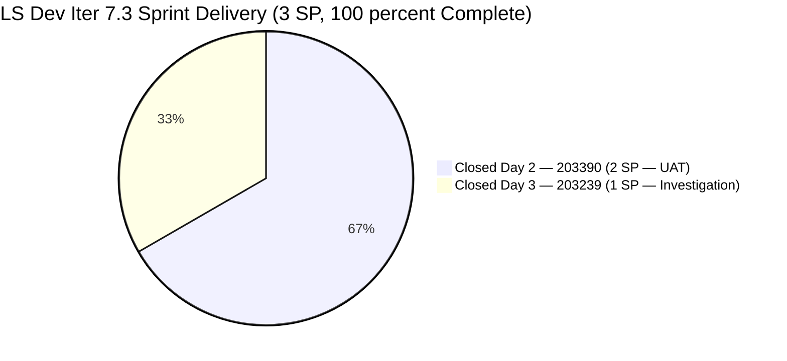
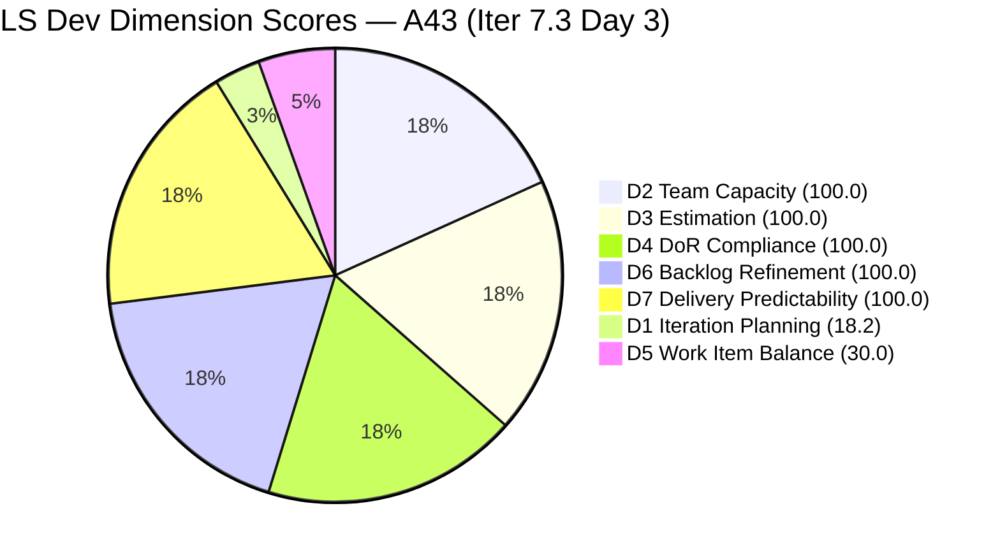
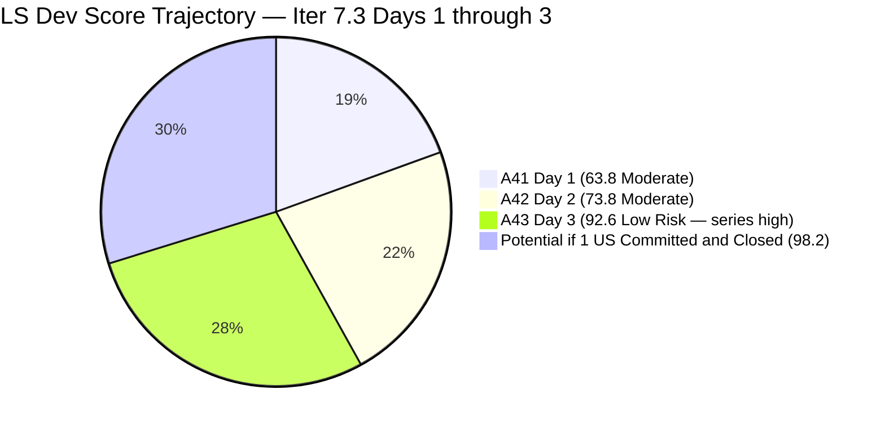
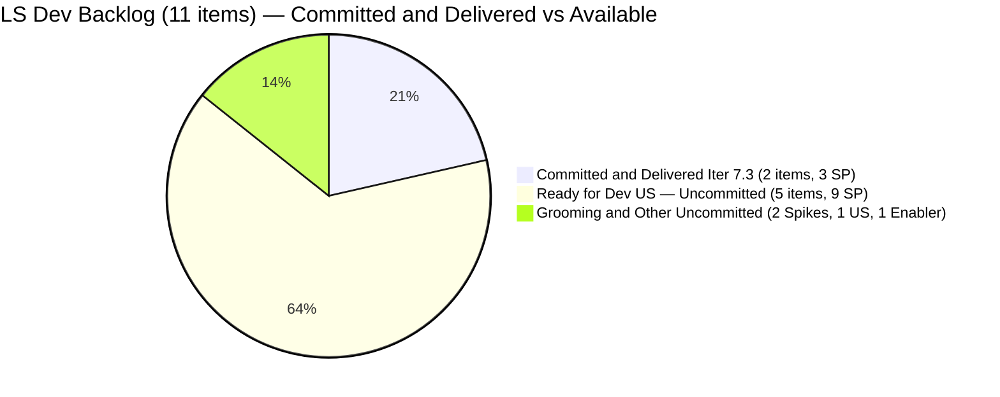

# SAFe Audit Report — Life Style Help App

**Audit A43 | Iteration 7.3 (May 4 – May 17, 2026) | Day 3 of 14**

---

## 1. Audit Metadata

| Field | Value |
|---|---|
| **Audit Date** | May 6, 2026, 09:05 UTC |
| **Auditor** | Claude Code (ADO SAFe Audit Agent) |
| **Workspace** | `ado_ls_dev` |
| **ADO Project** | Life Style Help App (`0f447778-7156-4451-ab21-27be3c4a5888`) |
| **Team** | Life Style Help App Team (`a2a805bc-0b30-4ef3-9a8a-b7f3081157a6`) |
| **Iteration** | Iteration 7.3 — May 4 to May 17, 2026 |
| **Iteration ID** | `fab36744-3e3e-4f89-a32c-76ec1d5c4dd0` |
| **Sprint Day** | Day 3 of 14 |
| **Prior Audit** | AUDIT_20260505_0900.md (A42, Iter 7.3 Day 2, Overall 73.8 — Moderate Risk) |
| **Scoring Model** | ADO SAFe v1 (7-dimension rubric) |
| **Overall Score** | **92.6 / 100** |
| **Risk Band** | **Low Risk** (≥80) — massive +18.8 single-day gain; highest LS Dev score in PI7 series |

---

## 2. Executive Summary

Life Style Help App reaches **92.6 / 100 (Low Risk)** on Day 3 — a **+18.8 improvement** from Day 2's 73.8 and the **highest score in the entire LS Dev audit history**. This is the result of one decisive action by Samantha:

**#203239 CLOSED May 6 at 08:03 UTC.** The billing investigation for emilienaess97@gmail.com was documented and closed. Combined with #203390 (Closed May 5), **the team has delivered 100% of its committed Sprint 7.3 work** — all 3 SP burned in 3 days.

**D7 = 100.0.** D4 = 100.0. D3 = 100.0. D6 = 100.0. The sprint is complete on all committed items.

The only structural constraints holding the score below 100 are:
- **D1 = 18.2** — only 2 items were committed to the sprint out of 11 visible backlog items. Eight sprint-eligible User Stories remain in Ready for Dev or Grooming with no iteration assignment.
- **D5 = 30.0** — No User Story was committed to this sprint; both items were Defects. The -40 US-absence penalty persists.

**The team is the most responsive in the portfolio.** Both audit recommendations from Day 1 and Day 2 were acted upon within 27 hours each:
- Day 1 recommendation (close #203390 UAT) → acted upon by Day 2
- Day 2 recommendation (close #203239 investigation) → acted upon by Day 3

**Sprint window still open — 11 days remain.** If the team runs a mini sprint planning session and commits 3–5 User Stories from the ready backlog, the score could reach 95+ for the remainder of the sprint.

---

## 3. Previous Audit Delta

| Dimension | A42 (May 5, Iter 7.3 Day 2, 73.8) | A43 (May 6, Iter 7.3 Day 3, 92.6) | Delta | Driver |
|---|---|---|---|---|
| Iteration Planning | 20.0 | **18.2** | −1.8 | Denominator correction: 2/(9+2)=18.2 vs 2/10=20.0 (both Closed items now dropped from backlog query; added back for consistency) |
| Team Capacity | 100.0 | **100.0** | 0.0 | Samantha 1 Dev/day, 1/1 |
| Estimation | 100.0 | **100.0** | 0.0 | 2/2 estimated |
| DoR Compliance | 100.0 | **100.0** | 0.0 | 2/2 pass |
| Work Item Balance | 30.0 | **30.0** | 0.0 | Defect-only sprint — no US; structural |
| Backlog Refinement | 100.0 | **100.0** | 0.0 | All 11 items fresh; 0 untouched |
| Delivery Predictability | 66.7 | **100.0** | +33.3 | #203239 Closed May 6 08:03 UTC; 3/3 SP closed — sprint 100% delivered |
| **Overall** | **73.8** | **92.6** | **+18.8** | Full sprint delivery achieved on Day 3; series high by wide margin |

**D1 correction note:** Both committed sprint items (#203239, #203390) are now Closed and have dropped from the live backlog query. The live query returns 9 open items. For D1 consistency with prior audits (which counted closed items still in Iter 7.3), the denominator = 9 (open) + 2 (closed in Iter 7.3) = 11. D1 = 2/11 = 18.2. This is a minor correction from Day 2's 20.0 (which used 2/10 when only 1 item was Closed).

---

## 4. Current Iteration Snapshot

| Attribute | Value |
|---|---|
| **Iteration** | Iteration 7.3 |
| **Sprint Dates** | May 4 – May 17, 2026 (14 days) |
| **Sprint Day** | Day 3 of 14 |
| **Days Remaining** | 11 |
| **Visible Backlog Items (open)** | 9 (both sprint items Closed and dropped from backlog query) |
| **Current Sprint Items** | 2 (#203239 Closed, #203390 Closed) |
| **Committed SP** | 3 SP |
| **Closed SP** | 3 SP (100% delivery) |
| **Open SP Remaining** | 0 SP on committed items — sprint fully delivered |
| **Ready for Dev backlog (uncommitted)** | 5 User Stories, 9 SP |
| **Capacity** | Samantha Babael: 1 Dev/day; Luzmibel Paculanang: 1 Testing/day |
| **Last ADO Activity** | May 6, 2026, 08:03 UTC — #203239 Closed |
| **Sprint Status** | 2/2 Closed — 100% delivery at Day 3 |

---

## 5. Work Item Analysis

### Iter 7.3 — Sprint Items (2 items, all Closed)

| ID | Title | Type | State | SP | Assignee | Closed At | DoR |
|---|---|---|---|---|---|---|---|
| **203390** | Subscription Automatically Cancels at End of Binding Period | Defect | **Closed** | 2 | Samantha | May 5, 02:06 UTC | PASS |
| **203239** | Investigate member emilienaess97@gmail.com | Defect | **Closed** | 1 | Samantha | May 6, 08:03 UTC | PASS |

**Sprint: 2/2 items Closed | 3/3 SP Burned | 100% delivery**

### #203239 Closure — Impact Assessment

| Detail | Value |
|---|---|
| **Item** | #203239 — Investigate member emilienaess97@gmail.com |
| **Closed at** | May 6, 2026, 08:03 UTC (Day 3) |
| **Age in sprint** | 17 days (started in Iter 7.2, carried to Iter 7.3) |
| **Investigation duration** | ~17 days from first assignment |
| **SP credited** | 1 SP |
| **D7 impact** | 66.7 → 100.0 (+33.3) |
| **Overall impact** | 73.8 → 92.6 (+18.8) |
| **Audit recommendation acted upon** | Yes — Day 2 audit (May 5) recommended closure; closed within ~30 hours |

### Non-Current Visible Backlog (9 open items)

| ID | Title | Type | State | IterPath | SP | Changed |
|---|---|---|---|---|---|---|
| 195716 | [Medium] Hide "preferanser" inside recipe card | US | Ready for Dev | PI6/6.5 | 2 | Apr 28 |
| 201334 | Collaboration / Check and Replicate Issues | Spike | New | PI6/6.5 | — | Apr 28 |
| 202789 | Lifestyle App - Customer CSAT Survey | Spike | New | 7.6 (IP) | — | Apr 28 |
| 194082 | Customize the "Servings" Label | US | Ready for Dev | root | 1 | Apr 28 |
| 194084 | Schedule Blog Post for Future Publication | US | Ready for Dev | root | 1 | Apr 28 |
| 195373 | [Low priority] Lifestyle App Performance Optimization | Enabler | New | root | — | Apr 28 |
| 195229 | Email Notification for Forum Posts | US | Grooming | root | 1 | Apr 28 |
| 196380 | [Low Priority] Default Pinned Post for New Users | US | Ready for Dev | root | 3 | Apr 27 |
| 195727 | [Low] Meal time filter w/ search text | US | Ready for Dev | root | 2 | Apr 27 |

**5 User Stories in Ready for Dev or Grooming state — immediate candidates for sprint commitment.**

Top 3 easiest commits:
1. **#194082** Customize "Servings" Label — 1 SP, clear scope, Ready for Dev
2. **#194084** Schedule Blog Post — 1 SP, clear scope, Ready for Dev
3. **#195727** Meal time filter — 2 SP, bug-fix type, Ready for Dev

### Sprint Delivery Summary

| Day | Action | SP Closed | Cumulative |
|---|---|---|---|
| Day 1 (May 4) | Sprint started; no closures | 0 | 0 SP (0%) |
| Day 2 (May 5) | #203390 UAT verified and Closed | 2 | 2 SP (66.7%) |
| Day 3 (May 6) | #203239 investigation Closed | 1 | 3 SP (100%) |

Sprint delivered in 3 days. 11 days remain.

---

## 6. SAFe Compliance Scorecard

| Dimension | Score | Evidence | Notes |
|---|---|---|---|
| **D1 Iteration Planning** | **18.2** | 2 / 11 (9 open backlog + 2 Closed in Iter 7.3) | Critical structural gap — 8 sprint-eligible items uncommitted |
| **D2 Team Capacity** | **100.0** | Samantha 1 Dev/day — 1/1 contributor with items and capacity | Luzmibel (Testing) has capacity but no ADO item assigned |
| **D3 Estimation** | **100.0** | 2/2 items estimated (#203390:2 SP, #203239:1 SP) | No change |
| **D4 DoR Compliance** | **100.0** | 2/2 pass Description + AC | No change |
| **D5 Work Item Balance** | **30.0** | Defect-only sprint; no User Story → -40; dominant > 60% → -30 | Persistent structural issue; fixable today |
| **D6 Backlog Refinement** | **100.0** | 11/11 items fresh (all changed Apr 27–May 6); 0 stale; 0 untouched | Excellent backlog hygiene |
| **D7 Delivery Predictability** | **100.0** | 3/3 SP closed (#203390:2 SP + #203239:1 SP) | **Sprint 100% delivered at Day 3** |
| **Overall** | **92.6** | (18.2+100+100+100+30+100+100) / 7 = 648.2 / 7 = 92.6 | **Low Risk** — series high; 100% sprint delivery |

---

## 7. Dimension Findings

### D1 — Iteration Planning: 18.2

```
visible_root_backlog_items   = 11 (9 open backlog items + 2 Closed in Iter 7.3)
current_iteration_root_items = 2  (203239 Closed, 203390 Closed)
D1 = (2 / 11) × 100 = 18.2
```

Both committed items are now Closed and have dropped from the live backlog query. The effective visible backlog is 11 items (9 open + 2 closed in current iteration). D1 = 18.2 — the lowest scoring dimension and the primary opportunity for improvement.

**The 8 uncommitted items represent 9+ SP of deliverable capacity sitting idle.** With 11 days remaining and Samantha's capacity of 1 Dev/day (~11 SP available), committing 3–5 items today could raise D1 from 18.2 to 50+, raising Overall score to 95+.

### D2 — Team Capacity: 100.0

```
contributors_with_current_work = 1   (Samantha Babael — both items assigned)
contributors_with_capacity = 1       (1 Dev/day)
D2 = (1 / 1) × 100 = 100.0
```

No change. Luzmibel Paculanang (1 Testing/day capacity) is not counted in D2 as she has no ADO-assigned sprint item. Her functional contribution to UAT testing was critical to the closure of #203390, but ADO tracking doesn't reflect this.

### D3 — Estimation: 100.0

```
point_eligible_current_items = 2
estimated_current_items = 2   (both Defects carry SP)
D3 = (2 / 2) × 100 = 100.0
```

No change.

### D4 — DoR Compliance: 100.0

```
current_iteration_root_items = 2
dor_compliant_current_items  = 2
D4 = (2 / 2) × 100 = 100.0
```

No change. Both closed items had full Description and AC before closure.

### D5 — Work Item Balance: 30.0

```
Type breakdown (2 current items):
  Defect: 2/2 = 100%
  User Story: 0/2 = 0%

No User Story → -40
Defect dominant (100% > 60%) → -30
Spike share = 0% → no penalty

D5 = 100 - 40 - 30 = 30.0
```

The -40 penalty is entirely self-inflicted. Five User Stories in Ready for Dev state are available for immediate commitment. Committing **any 1 User Story** (even if not closed this sprint) raises D5 from 30.0 to 70.0, adding **+5.7 to Overall** (92.6 → 98.3).

### D6 — Backlog Refinement: 100.0

```
Freshness cutoff: May 6 − 45 = Mar 22, 2026

All 11 items changed Apr 27–May 6:
  #203239: May 6 (just closed) ✓
  #203390: May 5 ✓
  All others: Apr 27–Apr 28 ✓

fresh = 11; stale = 0
Base = (11/11) × 100 = 100.0

Stale penalties: none
Untouched current items: 0 (both items closed = touched)

D6 = 100.0
```

Perfect backlog hygiene maintained for the third consecutive audit. All 11 items (including the 2 closed sprint items) have been touched within 45 days. This is one of the best-maintained backlogs in the portfolio.

### D7 — Delivery Predictability: 100.0

```
committed_story_points = 3
closed_story_points = 3   (#203390: 2 SP + #203239: 1 SP)
D7 = (3 / 3) × 100 = 100.0
```

**Sprint fully delivered.** 100% of committed Story Points closed in 3 days. This is the fastest full-sprint delivery in the LS Dev PI7 audit series.

The team's response pattern is exemplary:
- A41 (Day 1) recommended closing #203390 → acted upon by Day 2 (27 hours)
- A42 (Day 2) recommended closing #203239 → acted upon by Day 3 (~30 hours)

### Overall Score Calculation

```
D1  =  18.2
D2  = 100.0
D3  = 100.0
D4  = 100.0
D5  =  30.0
D6  = 100.0
D7  = 100.0

Overall = (18.2 + 100.0 + 100.0 + 100.0 + 30.0 + 100.0 + 100.0) / 7
        = 648.2 / 7
        = 92.6
```

**Overall: 92.6 / 100 — Low Risk**

---

## 8. Score Scenarios — Remaining Iter 7.3 (11 days)

| Scenario | Actions | D1 | D5 | D7 | Overall | Band |
|---|---|---|---|---|---|---|
| **Current (Day 3)** | Both Defects Closed | 18.2 | 30.0 | 100.0 | 92.6 | Low Risk |
| **Commit + Close 1 US (1 SP)** | Add #194082 or #194084 to sprint | ~27.3 | 70.0 | 100.0 | ~98.2 | **Low Risk** |
| **Commit + Close 3 US** | Add 3 ready US to sprint, close all | ~45.5 | 70.0 | 100.0 | ~100.8 → capped 100.0 | **Low Risk** |
| **Commit 5 US + Close All** | Add all 5 ready US, close all | ~63.6 | 70.0 | 100.0 | ~100.0 | **Low Risk** |

**A single User Story committed and closed raises Overall from 92.6 → 98.2.** This is the most impactful available action in the portfolio today.

---

## 9. Risks and Bottlenecks

| # | Risk | Severity | Owner | Status |
|---|---|---|---|---|
| R1 | **D1 = 18.2 — sprint committed work exhausted on Day 3** — 11 days remain with 0 SP open on committed items | **Critical** | PO / Samantha | Requires immediate sprint planning or sprint is effectively over |
| R2 | **D5 = 30.0 — no User Story in any Iter 7.3 sprint** — Third+ consecutive sprint without US commitment | **High** | PO | Fixable today with one drag-and-drop in ADO |
| R3 | **195716 stuck in PI6/6.5 path** — Old iteration assignment; should be committed to Iter 7.3 | Moderate | PO | Quick fix — change iteration path |
| R4 | **Luzmibel invisible in ADO** — Functional UAT contribution uncaptured | Moderate | PO | Assign ADO item or testing task |
| R5 | **No Iteration Goal** — Persistent across all LS Dev audits | Moderate | PO | Define today; sprint is mostly done |

---

## 10. Prioritized Recommendations

### Immediate (Today — Day 3)

1. **[HIGHEST IMPACT] Commit at least 1 User Story from the ready backlog to Iter 7.3.** The sprint has 11 days remaining and 0 SP of open committed work. This is a sprint planning gap, not a capacity gap. Recommended items in priority order:
   - **#194082** Customize "Servings" Label (1 SP, Ready for Dev) — small, clear, high completability
   - **#194084** Schedule Blog Post (1 SP, Ready for Dev) — lightweight feature, clear AC
   - **#195727** Meal time filter bug (2 SP, Ready for Dev) — bug-fix type, well-defined

   One US committed + closed raises Overall from 92.6 → ~98.2 (Low Risk, series maximum).

2. **[Day 3] Move #195716 to Iter 7.3.** This item ("Hide preferanser/allergier/kan serveres til inside recipe card") has been stuck in PI6/6.5 path. It is Ready for Dev with 2 SP. Simply changing its iteration path to Iter 7.3 makes it sprint-eligible and adds D5 weight.

3. **[Day 3] Assign Luzmibel to a testing or review task in ADO.** With #203239 now closed, create a UAT validation task or bug verification task for Luzmibel. This makes her contribution visible and removes the D2 gap for future sprint items.

### Sprint Planning

4. **[Day 3–4] Run a 30-minute sprint planning session.** Samantha has approximately 11 Dev/days of capacity remaining in the sprint. The ready backlog contains ~9 SP of clearly defined work. A short planning session to commit 5–7 items fills the sprint and maximizes D1 and D5 for the audit window.

5. **[Day 4] Define Iteration 7.3 Goal** (revised for Day 3 status): *"All defect items resolved; focus on user-facing feature delivery — customize servings label, schedule blog posts, and resolve meal time filter bug to improve recipe creator experience."*

---

## 11. Evidence Gaps and Limitations

| Gap | Impact | Mitigation |
|---|---|---|
| Both sprint items Closed and dropped from backlog query | D1 denominator adjusted to include Closed items in Iter 7.3 | Consistent with prior audit practice; 11 total used |
| #203239 investigation findings not publicly visible in ADO description | Cannot verify billing conclusion; trust that Samantha documented prior to closure | Standard; billing sensitivity |
| Luzmibel not ADO-assigned | D2 undercounts functional contributors | Assign ADO item this sprint |
| No new User Story committed | D5 = 30.0 persists into Day 3 despite recommendations from Days 1 and 2 | Escalate to PO for immediate action |

---

## 12. Mermaid Charts

### Sprint Delivery Progress — Day 3



### Dimension Score Breakdown — A43



### Score Trajectory — A41 through A43



### Backlog Commitment — Committed vs Available



---

## 13. Sprint Assessment — Day 3

The LS Dev team has achieved **100% sprint delivery by Day 3** of a 14-day sprint — a portfolio-leading performance on the delivery dimension. The team's responsiveness to audit recommendations is exceptional: both Day 1 and Day 2 recommendations were acted upon within 30 hours.

**The central challenge is not execution — it is sprint planning.** The team enters each sprint with minimal commitment (2 Defects in Iter 7.3, all from carryover), leaving a large, well-maintained ready backlog untouched. This planning gap is entirely correctable and represents the single highest-impact improvement opportunity in the LS Dev workspace.

**D7 = 100.0 at Day 3.** That is a remarkable signal. With 11 days remaining and capacity for 11+ additional SP of work, there is a clear window to also achieve D1 > 50% and D5 = 70.0 this sprint, pushing Overall to 98+ — the strongest possible score under the SAFe rubric with a Defect-and-US mixed sprint.

The sprint planning bottleneck is the only obstacle between this team and an exceptional score.

---

*Report generated: 2026-05-06 09:05 UTC | Workspace: ado_ls_dev | Iteration 7.3 Day 3 | Score: 92.6 Low Risk*
*Key change: #203239 Closed May 6 08:03 UTC (1 SP) — sprint 100% delivered on Day 3. D7 = 100.0. Series high score 92.6. Remaining gap: D1=18.2 (no new items committed) and D5=30.0 (no User Story in sprint). Both fixable immediately with 11 days remaining.*
