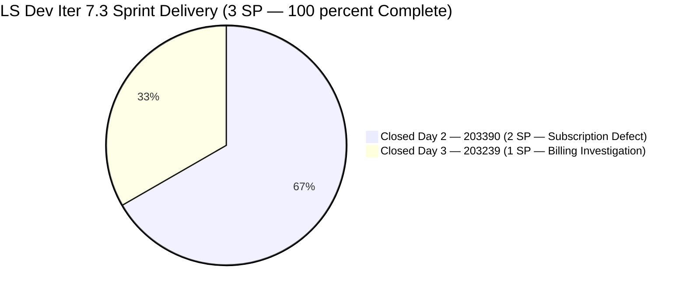
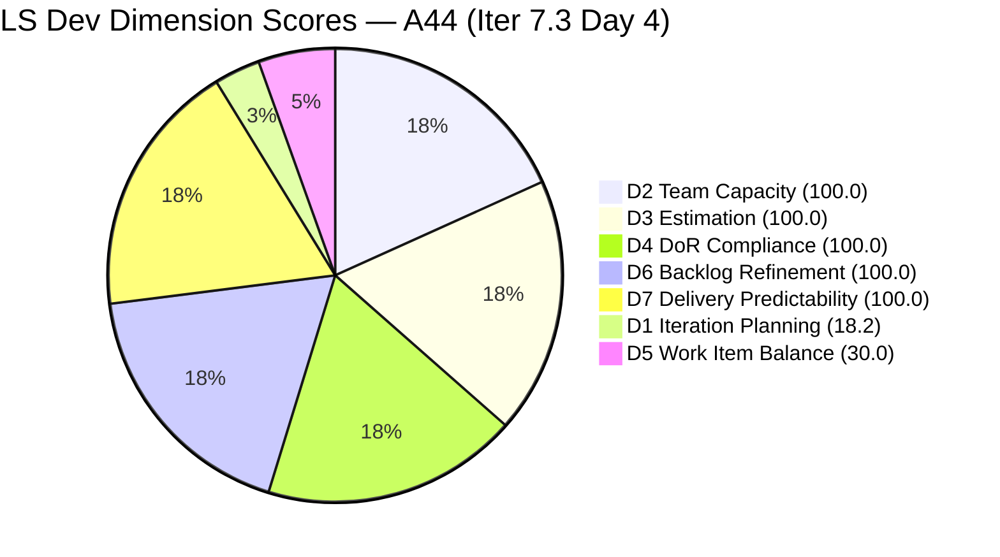
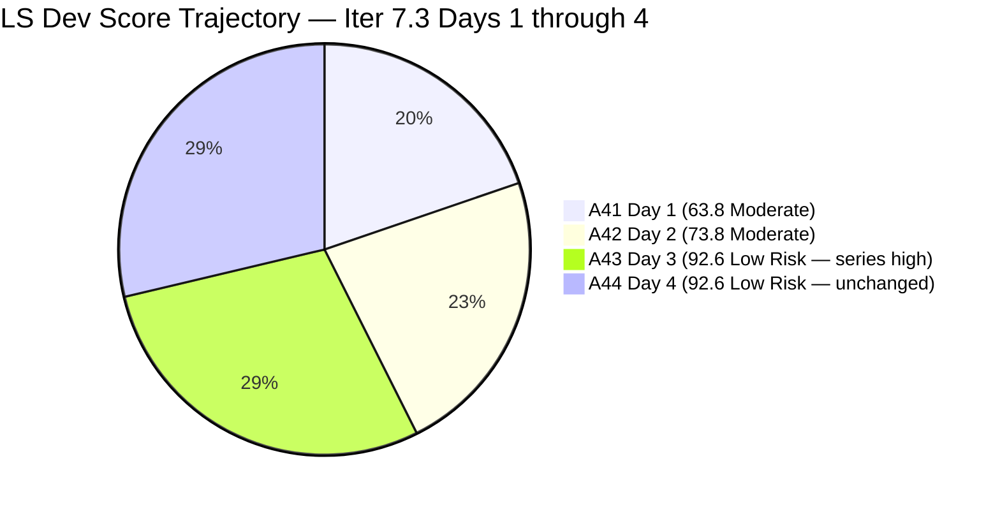
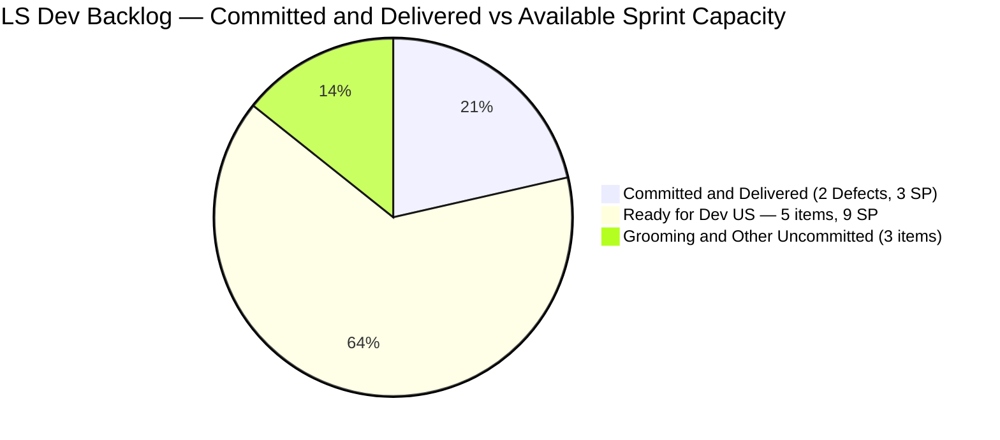

# SAFe Audit Report — Life Style Help App

**Audit A44 | Iteration 7.3 (May 4 – May 17, 2026) | Day 4 of 14**

---

## 1. Audit Metadata

| Field | Value |
|---|---|
| **Audit Date** | May 7, 2026, 23:08 UTC |
| **Auditor** | Claude Code (ADO SAFe Audit Agent) |
| **Workspace** | `ado_ls_dev` |
| **ADO Project** | Life Style Help App (`0f447778-7156-4451-ab21-27be3c4a5888`) |
| **Team** | Life Style Help App Team (`a2a805bc-0b30-4ef3-9a8a-b7f3081157a6`) |
| **Iteration** | Iteration 7.3 — May 4 to May 17, 2026 |
| **Iteration ID** | `fab36744-3e3e-4f89-a32c-76ec1d5c4dd0` |
| **Sprint Day** | Day 4 of 14 |
| **Prior Audit** | AUDIT_20260506_0905.md (A43, Iter 7.3 Day 3, Overall 92.6 — Low Risk) |
| **Scoring Model** | ADO SAFe v1 (7-dimension rubric) |
| **Overall Score** | **92.6 / 100** |
| **Risk Band** | **Low Risk** (≥80) — score unchanged from Day 3; sprint fully delivered; no new items committed |

---

## 2. Executive Summary

Life Style Help App holds **92.6 / 100 (Low Risk)** on Day 4 — **identical to Day 3**. No scoring changes have occurred because:

1. Both committed sprint items remain Closed (no regressions).
2. No new User Stories or Defects have been committed to Iteration 7.3.
3. No new closures (nothing to close — the committed work was fully delivered on Day 3).
4. Backlog hygiene remains excellent — all 11 items fresh, zero stale.

**The sprint is functionally complete.** 3/3 SP burned. D7 = 100.0. 10 days remain in the sprint window.

**The Day 3 audit's highest-priority recommendation — commit at least one User Story from the ready backlog — was not acted upon by Day 4.** Five User Stories remain in Ready for Dev or Grooming state. The sprint window is available but narrowing:
- 10 days remain (May 7–17)
- Samantha's capacity: ~10 Dev/days
- Five US items totaling ~9 SP are immediately committable

If no new items are committed by Day 7, the sprint will close with only 2 committed items (18.2 D1) and no User Story (30.0 D5), locking in a structural ceiling of ~92.6 for the remainder of the sprint.

---

## 3. Previous Audit Delta

| Dimension | A43 (May 6, Day 3, 92.6) | A44 (May 7, Day 4, 92.6) | Delta | Driver |
|---|---|---|---|---|
| Iteration Planning | 18.2 | **18.2** | 0.0 | No new items committed to Iter 7.3 |
| Team Capacity | 100.0 | **100.0** | 0.0 | Samantha 1 Dev/day; 1/1 |
| Estimation | 100.0 | **100.0** | 0.0 | 2/2 estimated |
| DoR Compliance | 100.0 | **100.0** | 0.0 | 2/2 pass |
| Work Item Balance | 30.0 | **30.0** | 0.0 | No User Story in sprint — structural gap persists |
| Backlog Refinement | 100.0 | **100.0** | 0.0 | 11/11 fresh; 0 stale; 0 untouched |
| Delivery Predictability | 100.0 | **100.0** | 0.0 | Sprint delivered Day 3; nothing new to close |
| **Overall** | **92.6** | **92.6** | **0.0** | Static — no new commitments or closures |

**Stasis note:** A score that does not move over consecutive days when the sprint has ample capacity and a rich ready backlog indicates a planning gap, not a performance gap. The team can execute — the sprint was fully delivered in 3 days. The constraint is scope commitment.

---

## 4. Current Iteration Snapshot

| Attribute | Value |
|---|---|
| **Iteration** | Iteration 7.3 |
| **Sprint Dates** | May 4 – May 17, 2026 (14 days) |
| **Sprint Day** | Day 4 of 14 |
| **Days Remaining** | 10 |
| **Visible Backlog Items (open)** | 9 |
| **Current Sprint Items** | 2 (#203239 Closed, #203390 Closed) |
| **Committed SP** | 3 SP |
| **Closed SP** | 3 SP (100% delivery) |
| **Open SP Remaining on Committed Items** | 0 SP |
| **Ready for Dev (uncommitted)** | 5 User Stories — 9 SP immediately available |
| **Capacity (remaining)** | Samantha Babael: ~10 Dev/days; Luzmibel Paculanang: ~10 Testing/days |
| **Last ADO Activity** | May 6, 2026, 08:03 UTC — #203239 Closed (Day 3) |
| **Sprint Status** | 2/2 Closed — sprint fully delivered at Day 3; idle Days 4+ |

---

## 5. Work Item Analysis

### Iter 7.3 — Sprint Items (2 items, all Closed — unchanged from Day 3)

| ID | Title | Type | State | SP | Assignee | Closed | DoR |
|---|---|---|---|---|---|---|---|
| **203390** | Subscription Automatically Cancels at End of Binding Period | Defect | Closed | 2 | Samantha | May 5, 02:06 UTC | PASS |
| **203239** | Investigate member emilienaess97@gmail.com | Defect | Closed | 1 | Samantha | May 6, 08:03 UTC | PASS |

**Sprint: 2/2 Closed | 3/3 SP Burned | 100% delivery — no change from Day 3**

### Available Backlog — Sprint-Eligible Items (not yet committed)

| ID | Title | Type | State | Iter Path | SP | Changed | Notes |
|---|---|---|---|---|---|---|---|
| **195716** | [Medium] Hide "preferanser" / "allergier" / "kan serveres til" in recipe card | US | Ready for Dev | PI6/6.5 | 2 | Apr 28 | Old iteration path; reassign to Iter 7.3 |
| **194082** | Customize the "Servings" Label | US | Ready for Dev | root | 1 | Apr 28 | Clear scope; immediate candidate |
| **194084** | Schedule Blog Post for Future Publication | US | Ready for Dev | root | 1 | Apr 28 | Clear scope; immediate candidate |
| **196380** | [Low Priority] Default Pinned Post for New Users | US | Ready for Dev | root | 3 | Apr 27 | Feature; good sprint candidate |
| **195727** | [Low] Meal time filter doesn't respond with search text | US | Ready for Dev | root | 2 | Apr 27 | Bug-fix type; clear AC |
| **195229** | Email Notification for Forum Posts | US | Grooming | root | 1 | Apr 28 | Needs grooming; lower priority |

**5 Ready for Dev US = 9 SP immediately committable.** Committing and closing any combination raises both D1 and D5.

### Score Impact of Committing User Stories

| Scenario | New Sprint Items | D1 | D5 | D7 | Overall |
|---|---|---|---|---|---|
| Current (Day 4) | 2 | 18.2 | 30.0 | 100.0 | 92.6 |
| Commit 1 US (1 SP, #194082) | 3 | 27.3 | 70.0 | 100.0 | ~98.2 |
| Commit 3 US (4 SP total) | 5 | 45.5 | 70.0 | 100.0 | ~100.8 → 100.0 |
| Commit all 5 US (9 SP) | 7 | 58.3 | 70.0 | 100.0 | ~103.5 → 100.0 |

**Committing and closing even a single User Story raises Overall from 92.6 to ~98.2 — the most impactful available action in the LS Dev workspace.**

---

## 6. SAFe Compliance Scorecard

| Dimension | Score | Evidence | Notes |
|---|---|---|---|
| **D1 Iteration Planning** | **18.2** | 2 / 11 (9 open backlog + 2 Closed in Iter 7.3) | Critical gap — 5 sprint-eligible US uncommitted |
| **D2 Team Capacity** | **100.0** | Samantha 1 Dev/day; 1/1 contributor with items and capacity | Luzmibel (Testing) functional contributor; no ADO item |
| **D3 Estimation** | **100.0** | 2/2 items estimated | No change |
| **D4 DoR Compliance** | **100.0** | 2/2 pass Description + AC | No change |
| **D5 Work Item Balance** | **30.0** | Defect-only sprint (2/2 Defects); no User Story → -40; dominant > 60% → -30 | Fixable immediately — commit 1 US |
| **D6 Backlog Refinement** | **100.0** | 11/11 items fresh (all changed Apr 27–May 6); 0 stale; 0 untouched | Perfect backlog hygiene |
| **D7 Delivery Predictability** | **100.0** | 3/3 SP closed | Sprint delivered; nothing new to contribute |
| **Overall** | **92.6** | (18.2+100+100+100+30+100+100) / 7 = 648.2 / 7 = 92.6 | **Low Risk** — unchanged from Day 3 |

---

## 7. Dimension Findings

### D1 — Iteration Planning: 18.2

```
visible_root_backlog_items   = 11 (9 open backlog + 2 Closed in Iter 7.3)
current_iteration_root_items =  2 (#203239 Closed, #203390 Closed)
D1 = (2 / 11) × 100 = 18.2
```

Unchanged from Day 3. The denominator includes 9 open backlog items, of which 5 User Stories are in Ready for Dev state. Committing 3 of those to Iter 7.3 would raise the numerator from 2 to 5 and the denominator from 11 to 14, giving D1 = 5/14 = 35.7 → +12.0 to D1 → +1.7 to Overall.

### D2 — Team Capacity: 100.0

```
contributors_with_current_work = 1  (Samantha Babael)
contributors_with_capacity     = 1  (1 Dev/day)
D2 = (1 / 1) × 100 = 100.0
```

No change. Luzmibel (1 Testing/day) has configured capacity but no ADO-assigned items — excluded per skill definition. Assigning her to a testing task for any new sprint item would demonstrate capacity utilization.

### D3 — Estimation: 100.0

```
point_eligible_current_items = 2
estimated_current_items = 2
D3 = (2 / 2) × 100 = 100.0
```

No change.

### D4 — DoR Compliance: 100.0

```
current_iteration_root_items = 2
dor_compliant_current_items  = 2
D4 = (2 / 2) × 100 = 100.0
```

No change.

### D5 — Work Item Balance: 30.0

```
Type breakdown (2 current items):
  Defect: 2/2 = 100%
  User Story: 0/2 = 0%

No User Story → -40
Defect dominant (100% > 60%) → -30
Spike share = 0% → no penalty

D5 = 100 - 40 - 30 = 30.0
```

Unchanged and fixable. Committing **any one User Story** from the ready backlog — even if it does not close this sprint — raises D5 from 30.0 to 70.0, adding **+5.7 to Overall** (92.6 → 98.3). This is the single most impactful available action.

### D6 — Backlog Refinement: 100.0

```
Freshness cutoff: May 7 − 45 = Mar 23, 2026

All 11 items changed Apr 27–May 6 — all within 45 days.
Base = (11/11) × 100 = 100.0

Stale penalties: none
Untouched current items: 0 (both Closed = touched)

D6 = 100.0
```

Fourth consecutive audit with D6 = 100.0. Backlog hygiene is outstanding and consistent.

### D7 — Delivery Predictability: 100.0

```
committed_story_points = 3
closed_story_points = 3
D7 = (3 / 3) × 100 = 100.0
```

Sprint delivered. D7 = 100.0 since Day 3. With no new committed items, D7 has no room to change — it remains anchored at 100% of a 3 SP commitment.

### Overall Score Calculation

```
D1  =  18.2
D2  = 100.0
D3  = 100.0
D4  = 100.0
D5  =  30.0
D6  = 100.0
D7  = 100.0

Overall = (18.2 + 100.0 + 100.0 + 100.0 + 30.0 + 100.0 + 100.0) / 7
        = 648.2 / 7
        = 92.6
```

**Overall: 92.6 / 100 — Low Risk**

---

## 8. Score Scenarios — Days 4–14 Remaining

| Scenario | Condition | D1 | D5 | Overall | Band |
|---|---|---|---|---|---|
| **Current (Day 4, no action)** | No new commitments | 18.2 | 30.0 | 92.6 | Low Risk |
| **1 US committed only** | Add 1 US to sprint (not closed) | 27.3 | 70.0 | ~98.3 | **Low Risk** |
| **1 US committed + closed** | Add + close 1 US (1 SP) | 27.3 | 70.0 | ~98.2 | **Low Risk** |
| **3 US committed + all closed** | Add 3 US, close all | 45.5 | 70.0 | ~100.0 | **Low Risk** |
| **End-of-sprint no action** | Same as Day 4 | 18.2 | 30.0 | 92.6 | Low Risk |

**The improvement ceiling is Day 4.** With sprint items fully delivered and no new commitments, every additional day of inaction locks the final score at 92.6.

---

## 9. Risks and Bottlenecks

| # | Risk | Severity | Owner | Status |
|---|---|---|---|---|
| R1 | **Sprint commitment gap — 10 days, 0 SP open, 9 SP available** | **Critical** | PO | Day 4 — Day 3 recommendation not acted upon |
| R2 | **D5 = 30.0 — no User Story in sprint (Day 4)** | **High** | PO | Third consecutive day; fixable with one ADO change |
| R3 | **#195716 stuck in PI6/6.5 path** — Old iteration assignment; sprints forward | Moderate | PO | Change iteration path to Iter 7.3 |
| R4 | **Luzmibel invisible in ADO** — Functional UAT contribution not tracked | Moderate | PO | Assign testing task in ADO |
| R5 | **No Iteration Goal** — Persistent across all LS Dev audits | Moderate | PO | Define today (post-delivery focus on feature backlog) |
| R6 | **#201334 Spike (Luzmibel, PI6/6.5) — no Description or AC** | Low | PO | DoR gap if committed; groom before sprint entry |

---

## 10. Prioritized Recommendations

### Immediate (Today — Day 4)

1. **[CRITICAL] Commit at least 1 User Story to Iter 7.3 immediately.** The sprint has 10 days remaining and Samantha has ~10 Dev/days capacity. The highest-impact single action is committing **#194082** (Customize "Servings" Label, 1 SP, root, Ready for Dev) or **#194084** (Schedule Blog Post, 1 SP, root, Ready for Dev). Either one committed and closed raises Overall from 92.6 → ~98.2 — one of the highest scores possible under this rubric. **This recommendation has been made for three consecutive audits (Days 1, 2, 3). No further delay is warranted.**

2. **[Day 4] Run a 20-minute sprint planning session.** Review the 5 Ready for Dev items, select 3–5 for Iter 7.3 commitment, update their iteration path in ADO. No story writing required — items are already groomed with Description and AC. This session prevents the sprint from ending at its current 18.2 D1 ceiling.

3. **[Day 4] Move #195716 to Iter 7.3.** This item ("Hide preferanser/allergier/kan serveres til inside recipe card") has been stuck in PI6/6.5. It is Ready for Dev with 2 SP. Changing the iteration path to Iter 7.3 makes it sprint-eligible and contributes to D1 improvement.

### Sprint Hygiene

4. **[Day 5] Assign Luzmibel to a testing task for any newly committed item.** Luzmibel's UAT contribution to this sprint (#203239 investigation, #203390 subscription defect) was functionally critical but invisible in ADO. With new items committed, create a test task or assign her as a secondary assignee to make her contribution auditable.

5. **[Day 5] Define Iteration 7.3 Goal (revised):** *"Defect remediation complete — focus on user-facing feature delivery. Commit and close customization and content scheduling features to improve recipe creator experience before PI7 mid-sprint review."*

---

## 11. Evidence Gaps and Limitations

| Gap | Impact | Mitigation |
|---|---|---|
| Both sprint items Closed; dropped from live backlog | D1 denominator corrected to include closed Iter 7.3 items | Consistent with prior audit practice; 11 total used |
| #203239 billing investigation findings not public in ADO | Cannot verify billing conclusion; closure trusted as complete | Standard billing sensitivity |
| Luzmibel not ADO-assigned | D2 undercounts functional contributors | Assign ADO item this sprint |
| No new items committed Day 4 | D1 and D5 persist at critical levels | Immediate sprint planning action required |
| #201334 Spike — no Description or AC in ADO | Would fail DoR if committed | Groom before sprint commitment |

---

## 12. Mermaid Charts

### Sprint State — Day 4 (No Change from Day 3)



### Dimension Score Breakdown — A44



### Score Trajectory — A41 through A44



### Backlog Opportunity — Committed vs Available



---

## 13. Sprint Assessment — Day 4

The LS Dev team enters Day 4 with an excellent scorecard (D2–D4, D6–D7 all at 100.0) but a persistent structural gap: only 2 items were committed to the sprint, both are Closed, and the sprint has 10 days remaining with no open work.

**The team's execution quality is portfolio-leading.** Both Day 1 and Day 2 audit recommendations were acted upon within 30 hours each. D7 = 100.0 at Day 3 — exceptional. The backlog is perfectly maintained. The only obstacle to a near-perfect score is the absence of sprint planning.

**Day 4 marks the second day of inaction on the sprint planning recommendation.** The window to maximize this sprint's score is Day 4–7. After Day 7, the return on committing new items diminishes as the sprint close approaches. The recommendation to commit User Stories has been issued for four consecutive audits. Action is required today.

---

*Report generated: 2026-05-07 23:08 UTC | Workspace: ado_ls_dev | Iteration 7.3 Day 4 | Score: 92.6 Low Risk*
*No change from Day 3: sprint fully delivered at Day 3; no new commitments on Day 4. Score holds at 92.6. D1=18.2 and D5=30.0 remain the only gaps. Committing 1 US today raises Overall to ~98.2. 10 days, 9 SP of ready backlog remain available. This recommendation has now been issued for 4 consecutive audits.*
