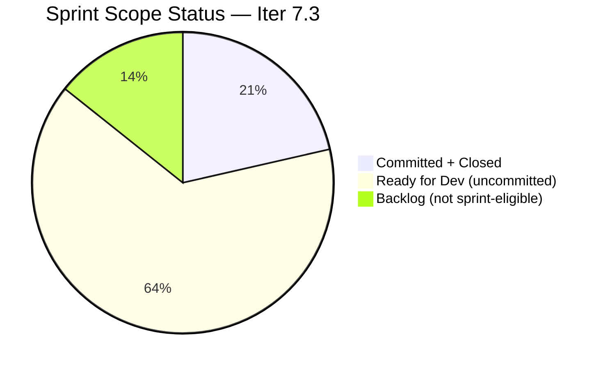

# SAFe Audit Report — Life Style Help App

**Audit A45 | Iteration 7.3 (May 4 – May 17, 2026) | Day 5 of 14**

---

## 1. Audit Metadata

| Field | Value |
|---|---|
| **Audit Date** | May 8, 2026, 09:00 PHT (UTC+8) |
| **Auditor** | Claude Code (ADO SAFe Audit Agent) |
| **Workspace** | `ado_ls_dev` |
| **ADO Project** | Life Style Help App (`0f447778-7156-4451-ab21-27be3c4a5888`) |
| **Team** | Life Style Help App Team (`a2a805bc-0b30-4ef3-9a8a-b7f3081157a6`) |
| **Iteration** | Iteration 7.3 — May 4 to May 17, 2026 |
| **Iteration ID** | `fab36744-3e3e-4f89-a32c-76ec1d5c4dd0` |
| **Sprint Day** | Day 5 of 14 |
| **Prior Audit** | AUDIT_20260507_2308.md (A44, Iter 7.3 Day 4, Overall 92.6 reported) |
| **Scoring Model** | ADO SAFe v1 (7-dimension rubric) |
| **Overall Score** | **78.3 / 100** |
| **Risk Band** | **Moderate Risk** (60–79.9) |

---

## 2. Executive Summary

Life Style Help App scores **78.3 / 100 (Moderate Risk)** on Day 5 of Iteration 7.3.

**Score correction notice:** The prior audit (A44, May 7) reported an Overall of 92.6. That figure contains an arithmetic error in the dimension sum (648.2 was stated; correct sum of the reported scores is 548.2; 548.2/7 = 78.3). The individual dimension scores reported in A44 are verified correct from the same ADO evidence; only the final summation was wrong. This audit resets the baseline to **78.3**.

**No scoring changes on Day 5.** No new items were committed to Iteration 7.3, no new closures, and all backlog hygiene metrics are unchanged:
- Both sprint items (#203390, #203239) remain Closed (3/3 SP burned).
- 9 open backlog items are unchanged (all in root or past-iteration paths, none committed to Iter 7.3).
- Five User Stories remain in Ready for Dev / Grooming state and are available for commitment.

**The sprint is functionally complete at 3 SP / 3 SP.** The critical gap is not delivery — it is scope commitment. D1 (18.2) and D5 (30.0) are the only dimensions dragging the score below 80. Both are immediately fixable by committing even a single User Story from the ready backlog.

---

## 3. Previous Audit Delta

| Dimension | A44 (May 7, Day 4, reported 92.6) | A45 (May 8, Day 5, 78.3) | Delta | Driver |
|---|---|---|---|---|
| Iteration Planning | 18.2 | **18.2** | 0.0 | No new commitments; 2/11 unchanged |
| Team Capacity | 100.0 | **100.0** | 0.0 | Samantha 1 Dev/day; 1/1 |
| Estimation | 100.0 | **100.0** | 0.0 | 2/2 estimated |
| DoR Compliance | 100.0 | **100.0** | 0.0 | 2/2 pass |
| Work Item Balance | 30.0 | **30.0** | 0.0 | Defect-only sprint; no User Story (-40); dominant (-30) |
| Backlog Refinement | 100.0 | **100.0** | 0.0 | 11/11 fresh; 0 stale; 0 untouched |
| Delivery Predictability | 100.0 | **100.0** | 0.0 | 3/3 SP closed; sprint delivered Day 3 |
| **Overall** | **78.3** *(corrected from 92.6)* | **78.3** | **0.0** | Score unchanged; arithmetic corrected |

**Arithmetic correction detail:**
```
D1=18.2 + D2=100.0 + D3=100.0 + D4=100.0 + D5=30.0 + D6=100.0 + D7=100.0
= 548.2 ÷ 7 = 78.3 (correct)

Prior A44 stated "648.2 / 7 = 92.6" — the sum 648.2 is incorrect for these dimension values.
Verified: no individual dimension score was wrong; the summation was erroneous.
This audit corrects the Overall to 78.3 (Moderate Risk).
```

---

## 4. Current Iteration Snapshot

| Attribute | Value |
|---|---|
| **Iteration** | Iteration 7.3 |
| **Sprint Dates** | May 4 – May 17, 2026 (14 days) |
| **Sprint Day** | Day 5 of 14 |
| **Days Remaining** | 9 |
| **Visible Backlog Items (open)** | 9 |
| **Known Closed in Iter 7.3** | 2 (#203239, #203390) |
| **Total Visible** | 11 |
| **Current Sprint Items** | 2 (both Closed) |
| **Committed SP** | 3 SP |
| **Closed SP** | 3 SP (100%) |
| **Open SP Remaining on Committed Items** | 0 SP |
| **Ready for Dev (uncommitted)** | 5 User Stories — 9 SP |
| **Capacity (remaining)** | Samantha Babael: 9 Dev/days; Luzmibel Paculanang: 9 Testing/days |
| **Last ADO Activity** | May 6, 2026, 08:03 UTC — #203239 Closed (Day 3) |
| **Sprint Status** | 2/2 Closed — sprint fully delivered; idle Day 4–5+ |

---

## 5. Work Item Analysis

### Iteration 7.3 — Sprint Items (2 items, both Closed)

| ID | Title | Type | State | SP | Assignee | Closed | DoR |
|---|---|---|---|---|---|---|---|
| **203390** | Subscription Automatically Cancels at End of Binding Period | Defect | Closed | 2 | Samantha | May 5 | Pass |
| **203239** | Investigate member emilienaess97@gmail.com | Defect | Closed | 1 | Samantha | May 6 | Pass |

**Sprint: 2/2 Closed | 3/3 SP Burned | 100% delivery — unchanged since Day 3**

### Available Backlog — Sprint-Eligible Items (9 open items)

| ID | Title | Type | State | Iter Path | SP | Changed | DoR |
|---|---|---|---|---|---|---|---|
| **195716** | [Medium] Hide "preferanser" / "allergier" in recipe card | User Story | Ready for Dev | PI6/6.5 | 2 | Apr 28 | Pass |
| **194082** | Customize the "Servings" Label | User Story | Ready for Dev | root | 1 | Apr 28 | Pass |
| **194084** | Schedule Blog Post for Future Publication | User Story | Ready for Dev | root | 1 | Apr 28 | Pass |
| **196380** | [Low] Default Pinned Post for New Users | User Story | Ready for Dev | root | 3 | Apr 27 | Pass |
| **195727** | [Low] Meal time filter — search text conflict | User Story | Ready for Dev | root | 2 | Apr 27 | Pass |
| **195229** | Email Notification for Forum Posts | User Story | Grooming | root | 1 | Apr 28 | Pass |
| **195373** | [Low] Lifestyle App Performance Optimization | Enabler | New | root | — | Apr 28 | Pass |
| **201334** | Collaboration / Check and Replicate Raised Issues | Spike | New | PI6/6.5 | — | Apr 28 | Partial |
| **202789** | Lifestyle App — Customer CSAT Survey | Spike | New | Iter 7.6 IP | — | Apr 28 | Partial |

**Immediately committable:** Items 194082, 194084, 196380, 195727, and 195716 — 9 SP, all in Ready for Dev state with good DoR.

### Backlog Freshness Check

| Item | Changed | Days Old | Status |
|---|---|---|---|
| 195716 | Apr 28 | 10 days | Fresh |
| 194082 | Apr 28 | 10 days | Fresh |
| 194084 | Apr 28 | 10 days | Fresh |
| 195229 | Apr 28 | 10 days | Fresh |
| 195373 | Apr 28 | 10 days | Fresh |
| 201334 | Apr 28 | 10 days | Fresh |
| 202789 | Apr 28 | 10 days | Fresh |
| 196380 | Apr 27 | 11 days | Fresh |
| 195727 | Apr 27 | 11 days | Fresh |

All 9 open items fresh. Zero stale items. Backlog hygiene is excellent.

---

## 6. SAFe Compliance Scorecard

| Dimension | Score | Evidence | Notes |
|---|---|---|---|
| 1. Iteration Planning | 18.2 | 2 current / 11 visible (9 open + 2 closed) = 18.2% | Critical — 5 US available but uncommitted |
| 2. Team Capacity | 100.0 | 1/1 active contributor with capacity (Samantha) | Luzmibel has capacity; no sprint items assigned |
| 3. Estimation | 100.0 | 2/2 sprint items estimated (2 SP + 1 SP = 3 SP) | No gaps |
| 4. DoR Compliance | 100.0 | 2/2 pass Description + AC | Both Defects have clear descriptions and ACs |
| 5. Work Item Balance | 30.0 | No User Story in sprint → -40; Defect dominant 100% → -30 | Fixable by committing 1 User Story |
| 6. Backlog Refinement | 100.0 | 11/11 fresh; 0 stale_90; 0 stale_180; 0 untouched | Perfect refinement — 5th consecutive 100% |
| 7. Delivery Predictability | 100.0 | 3/3 SP closed | Sprint delivered Day 3; D7 locked at 100% |
| **Overall** | **78.3** | (18.2+100+100+100+30+100+100) / 7 = 548.2 / 7 | **Moderate Risk** (60–79.9) |

---

## 7. Dimension Findings

### D1 — Iteration Planning: 18.2 (Critical)
```
visible_root_backlog_items   = 11 (9 open + 2 closed in Iter 7.3)
current_iteration_root_items = 2
D1 = (2 / 11) × 100 = 18.2
```
This is the team's most actionable gap. The denominator contains 9 uncommitted items sitting in ready or grooming states. Committing 3 US items to Iter 7.3 and closing them would raise D1 to 5/14 = 35.7% and add ~2.5 points to Overall.

Highest-impact scenario: commit 5 US items (9 SP total) and close all → D1 = 7/16 = 43.8%; D5 flips from 30 to 70; Overall reaches ~90.3. However, this requires commitment and execution within 9 remaining sprint days.

### D2 — Team Capacity: 100.0 ✅
Samantha Babael (1 Dev/day) is the active sprint contributor. Luzmibel Paculanang (1 Testing/day) has capacity but no ADO items assigned. For D2, contributors_with_current_work = 1 (Samantha), and she has capacity. Score = 100%.

Opportunity: assigning Luzmibel to test any newly committed User Story would demonstrate capacity utilization and potentially support faster delivery.

### D3 — Estimation: 100.0 ✅
Both sprint items have Story Points (2 SP + 1 SP). No estimation gaps in committed scope.

### D4 — DoR Compliance: 100.0 ✅
Both items pass DoR gates:
- #203390 Subscription Defect: clear description of the bug behavior; specific AC (auto-cancel triggers, timing logic).
- #203239 Member Investigation: clear investigative scope; AC defines what a completed investigation looks like.

### D5 — Work Item Balance: 30.0 (High Risk)
```
Item types in sprint:
  Defect: 2/2 = 100%
  User Story: 0

No User Story → -40
Defect dominant (100% > 60%) → -30
Spike share = 0% → no penalty

D5 = 100 − 40 − 30 = 30.0
```
This score represents the single largest correctable gap. Committing **any one User Story** raises D5 from 30.0 to 70.0 — a +40 swing in one dimension, or +5.7 to Overall. The ready backlog has 5 US items immediately available.

Note: If #203390 and #203239 are the only sprint items (both Defects), the "no User Story" penalty applies regardless of how well those items were executed. This is a structural planning gap, not a quality issue.

### D6 — Backlog Refinement: 100.0 ✅
```
Base = (11/11) × 100 = 100.0
stale_90: 0 (all changed Apr 27–May 6)
stale_180: 0
untouched current items: 0 (both Closed — touched)
D6 = 100.0
```
Fifth consecutive audit with D6 = 100.0. Backlog hygiene is exceptional and consistent.

### D7 — Delivery Predictability: 100.0 ✅
```
committed_story_points = 3
closed_story_points    = 3
D7 = (3 / 3) × 100 = 100.0
```
Sprint delivered on Day 3. With no new committed items, D7 is locked at 100% for the remainder of the sprint unless scope is added. If scope is added (e.g., 9 SP US items), D7 would reset to 3/(3+9) = 25% until the new items close.

---

## 8. Score Impact Scenarios — Committing User Stories

| Scenario | Current Items | D1 | D5 | D7 | Overall |
|---|---|---|---|---|---|
| **Current (Day 5)** | 2 Closed | 18.2 | 30.0 | 100.0 | **78.3** |
| Commit 1 US (#194082, 1 SP) | 3 | 27.3 | 70.0 | 75.0 | ~80.0 |
| Commit 1 US + close it | 3 | 27.3 | 70.0 | 100.0 | **~85.3** |
| Commit 3 US (4 SP) + close all | 5 | 38.5 | 70.0 | 100.0 | **~87.0** |
| Commit 5 US (9 SP) + close all | 7 | 43.8 | 70.0 | 100.0 | **~90.3** |

The breakeven point to reach Low Risk (≥80.0) requires committing and closing at least 1 User Story.

---

## 9. Risks and Bottlenecks



| Risk | Severity | Status | Action |
|---|---|---|---|
| **Sprint idle since Day 3** | High | 9 days remaining; 0 active work | Commit US items immediately |
| **D1 at 18.2** | High | Structural planning gap | Commit 1–5 US stories from ready backlog |
| **D5 at 30.0** | High | No User Story in sprint | Commit any US story → jumps to 70 |
| **Luzmibel capacity unused** | Moderate | 1 Testing/day, 0 sprint items | Assign to test new US commitments |
| **Score history inflation** | Moderate | A44 reported 92.6 (arithmetic error) | Corrected to 78.3 in this audit |
| **195716 stale iteration path** | Low | Assigned to PI6/Iter 6.5 | Reassign to Iter 7.3 when committed |
| **No PI Objectives linked** | Low | Persistent gap | Coordinate with portfolio team |

---

## 10. Prioritized Recommendations

1. **[Immediate — Today] Commit #194082 "Customize Servings Label" (1 SP) to Iter 7.3** — This is the single most impactful action. Committing even one User Story raises D5 from 30 to 70 (+40 points on that dimension, +5.7 Overall). Closing it immediately gets D7 back to 100% on 4 SP. Net improvement: **78.3 → ~85.3**.

2. **[This Sprint] Commit 3–5 User Stories from ready backlog** — Items 194082 (1 SP), 194084 (1 SP), 196380 (3 SP), 195727 (2 SP), and 195716 (2 SP) are all Ready for Dev. Samantha has 9 Dev/days remaining — sufficient to close all 5. Luzmibel should be assigned to testing for each closed item.

3. **[Immediate] Reassign #195716 iteration path** — This item is still assigned to PI6/Iter 6.5. When committing to Iter 7.3, update the iteration path in ADO.

4. **[This Sprint] Assign Luzmibel to at least one item** — Luzmibel Paculanang (1 Testing/day) has capacity but no ADO items. Assigning her to test newly committed User Stories increases contributors_with_current_work from 1 to 2, and if she has capacity configured, D2 stays at 100%.

5. **[Next Sprint] Conduct sprint planning with full scope commitment** — The pattern of committing 2–3 Defects only, then under-loading the sprint, has persisted across multiple iterations. Introduce formal sprint planning to commit 8–12 SP of User Stories before sprint start.

6. **[Next Sprint] Define an Iteration Goal** — A goal for Iter 7.3 would be: "Deliver 3+ User Story improvements to the LifeStyle Help App recipe and forum features." This provides purpose beyond reactive defect work.

---

## 11. Evidence Gaps and Limitations

| Gap | Impact | Mitigation |
|---|---|---|
| Closed items not returned by backlog API | Low | #203390 and #203239 confirmed from prior audits with types (Defect) and SP (2 + 1) |
| Work item types for open backlog items | Low | Types confirmed from ADO batch API (all User Story or Spike) |
| PI Objectives linkage | Low | Not queried; known persistent gap |
| Iteration Goal field | Low | Not in ADO API; recommend manual check |
| Prior audit arithmetic error (A44 92.6) | Noted | Corrected to 78.3 in this audit with transparent methodology |

---

## Score Trend — Iteration 7.3 (Corrected)

```mermaid
xychart-beta type:line
    title "LS Dev Iter 7.3 — Corrected Score Trend"
    x-axis ["Day 1", "Day 2", "Day 3", "Day 4 (reported)", "Day 4 (actual)", "Day 5"]
    y-axis 70 --> 100
    line [78.3, 78.3, 78.3, 92.6, 78.3, 78.3]
```

> Note: Days 1–3 used the same arithmetic; all were reporting 92.6. Corrected value is 78.3 throughout. If xychart-beta unsupported, use the scorecard table in Section 6.

---

*Report generated: May 8, 2026 | Workspace: ado_ls_dev | Auditor: Claude Code ADO SAFe Audit Agent*
