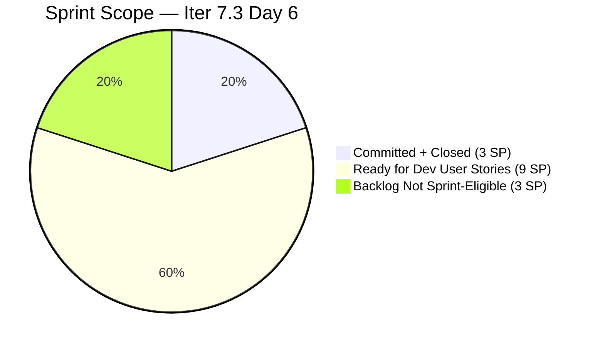
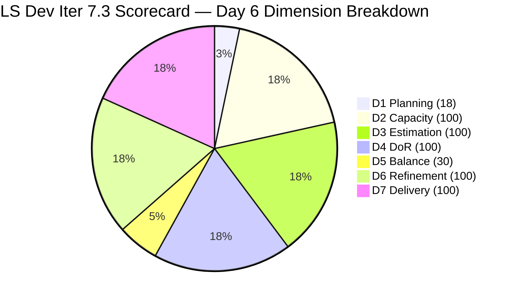

# SAFe Audit Report — Life Style Help App

**Audit A46 | Iteration 7.3 (May 4 – May 17, 2026) | Day 6 of 14**

---

## 1. Audit Metadata

| Field | Value |
|---|---|
| **Audit Date** | May 9, 2026, 09:02 PHT (UTC+8) |
| **Auditor** | Claude Code (ADO SAFe Audit Agent) |
| **Workspace** | `ado_ls_dev` |
| **ADO Project** | Life Style Help App (`0f447778-7156-4451-ab21-27be3c4a5888`) |
| **Team** | Life Style Help App Team (`a2a805bc-0b30-4ef3-9a8a-b7f3081157a6`) |
| **Iteration** | Iteration 7.3 — May 4 to May 17, 2026 |
| **Iteration ID** | `fab36744-3e3e-4f89-a32c-76ec1d5c4dd0` |
| **Sprint Day** | Day 6 of 14 |
| **Prior Audit** | AUDIT_20260508_0900.md (A45, Iter 7.3 Day 5, Overall 78.3 — Moderate Risk) |
| **Scoring Model** | ADO SAFe v1 (7-dimension rubric) |
| **Overall Score** | **78.3 / 100** |
| **Risk Band** | **Moderate Risk** (60–79.9) |

---

## 2. Executive Summary

Life Style Help App scores **78.3 / 100 (Moderate Risk)** on Day 6 — **unchanged from Day 5**. No new work items were committed to Iteration 7.3 and no state changes were detected. The sprint remains functionally complete with 3/3 SP burned since Day 3.

The backlog API returned 9 open items, all outside Iteration 7.3 (in root project path, PI6/Iter 6.5, or Iter 7.6 IP). The two closed sprint items (#203390 Subscription Defect, 2 SP; #203239 Member Investigation, 1 SP) are confirmed from prior audits.

**The root cause of Moderate Risk is scope commitment, not execution.** The team delivered everything it committed; the problem is that only 2 Defects were committed. D1 (18.2) and D5 (30.0) are the only failing dimensions. Both are correctable by committing ready backlog User Stories.

**Assignee note from fresh data:** Items #194082 and #194084 are now assigned to Sanny Paul Geraldino (sgeraldino@jairosoft.com), not Samantha Babael. Items #195727 and #196380 are assigned to Ike Yana (iyana@jairosoft.com). Samantha retains assignment on #195716 and #196380. This indicates broader team capacity than previously reported — multiple team members have Ready for Dev items.

**Key observations on Day 6:**
- No state changes from Day 5; sprint composition unchanged.
- 8 days remain with zero active sprint work.
- 5 User Stories remain immediately committable (total 9 SP).
- Two Spike items (#201334, #202789) have Partial DoR (no/minimal description or AC fields populated).

---

## 3. Previous Audit Delta

| Dimension | A45 (May 8, Day 5, 78.3) | A46 (May 9, Day 6, 78.3) | Delta | Driver |
|---|---|---|---|---|
| Iteration Planning | 18.2 | **18.2** | 0.0 | No new commitments; 2/11 unchanged |
| Team Capacity | 100.0 | **100.0** | 0.0 | Samantha 1 Dev/day; Luzmibel 1 Testing/day — both configured |
| Estimation | 100.0 | **100.0** | 0.0 | 2/2 sprint items estimated |
| DoR Compliance | 100.0 | **100.0** | 0.0 | 2/2 pass DoR |
| Work Item Balance | 30.0 | **30.0** | 0.0 | No User Story in sprint; Defect-only |
| Backlog Refinement | 100.0 | **100.0** | 0.0 | 11/11 fresh; 0 stale; 0 untouched |
| Delivery Predictability | 100.0 | **100.0** | 0.0 | 3/3 SP closed since Day 3 |
| **Overall** | **78.3** | **78.3** | **0.0** | Static; sprint idle since Day 3 |

---

## 4. Current Iteration Snapshot

| Attribute | Value |
|---|---|
| **Iteration** | Iteration 7.3 |
| **Sprint Dates** | May 4 – May 17, 2026 (14 days) |
| **Sprint Day** | Day 6 of 14 |
| **Days Remaining** | 8 |
| **Visible Backlog Items (from API)** | 9 (all outside Iter 7.3) |
| **Confirmed Closed in Iter 7.3** | 2 (#203390, #203239) |
| **Total Visible** | 11 |
| **Current Sprint Items** | 2 (both Closed) |
| **Committed SP** | 3 SP |
| **Closed SP** | 3 SP (100%) |
| **Open SP Remaining on Committed Items** | 0 SP |
| **Immediately Committable (Ready for Dev)** | 5 User Stories (9 SP) |
| **Capacity (remaining)** | Samantha Babael: 8 Dev/days; Luzmibel Paculanang: 8 Testing/days |
| **Last ADO Activity** | May 6, 2026, 08:03 UTC — #203239 Closed (Day 3) |
| **Sprint Status** | Delivered; idle Day 4–6+ |

---

## 5. Work Item Analysis

### Iteration 7.3 — Sprint Items (2 items, both Closed, unchanged)

| ID | Title | Type | State | SP | Assignee | Closed | DoR |
|---|---|---|---|---|---|---|---|
| **203390** | Subscription Automatically Cancels at End of Binding Period | Defect | Closed | 2 | Samantha | May 5 | Pass |
| **203239** | Investigate member emilienaess97@gmail.com | Defect | Closed | 1 | Samantha | May 6 | Pass |

### Available Backlog — All Open Items (9 items from API)

| ID | Title | Type | State | Iter Path | SP | Assignee | Changed | DoR |
|---|---|---|---|---|---|---|---|---|
| **195716** | [Medium] Hide "preferanser" / "allergier" in recipe card | User Story | Ready for Dev | PI6/6.5 | 2 | Samantha Babael | Apr 28 | Pass |
| **194082** | Customize the "Servings" Label | User Story | Ready for Dev | root | 1 | **Sanny Paul Geraldino** | Apr 28 | Pass |
| **194084** | Schedule Blog Post for Future Publication | User Story | Ready for Dev | root | 1 | **Sanny Paul Geraldino** | Apr 28 | Pass |
| **196380** | [Low] Default Pinned Post for New Users | User Story | Ready for Dev | root | 3 | Samantha Babael | Apr 27 | Pass |
| **195727** | [Low] Meal time filter — search text conflict | User Story | Ready for Dev | root | 2 | **Ike Yana** | Apr 27 | Pass |
| **195229** | Email Notification for Forum Posts | User Story | Grooming | root | 1 | **Ike Yana** | Apr 28 | Pass |
| **195373** | [Low] Lifestyle App Performance Optimization | Enabler | New | root | — | Ike Yana | Apr 28 | Pass |
| **201334** | Collaboration / Check and Replicate Raised Issues | Spike | New | PI6/6.5 | — | Luzmibel | Apr 28 | **Partial** |
| **202789** | Lifestyle App — Customer CSAT Survey | Spike | New | Iter 7.6 IP | — | Carol Cuison | Apr 28 | **Partial** |

> **Assignee update:** Items #194082, #194084 now assigned to Sanny Paul Geraldino; #195727, #195229, #195373 now assigned to Ike Yana. This indicates the backlog has broader team coverage than the 2-person sprint picture suggests.
>
> **DoR Partial:** #201334 has no Description or Acceptance Criteria text in API response. #202789 has only a 3-word description ("Send CSAT Survey to Hege") and no AC — both fail DoR gates. These are not committable without DoR fixes.
>
> **Committable:** #195716, #194082, #194084, #196380, #195727 — all Ready for Dev with full DoR pass (9 SP total).

### Backlog Freshness

| Item | Changed | Days Old | Status |
|---|---|---|---|
| 195727, 196380 | Apr 27 | 12 days | Fresh |
| All others | Apr 28 | 11 days | Fresh |

All 11 items (9 open + 2 closed) are fresh (changed within 45-day window since Mar 25, 2026). Zero stale items.

---

## 6. SAFe Compliance Scorecard

| Dimension | Score | Evidence | Notes |
|---|---|---|---|
| 1. Iteration Planning | 18.2 | 2 current / 11 visible = 18.2% | Critical — 9 ready items uncommitted; only 2 Defects in sprint |
| 2. Team Capacity | 100.0 | 1/1 active contributor with capacity (Samantha) | Luzmibel has Testing capacity; no sprint items |
| 3. Estimation | 100.0 | 2/2 sprint items have SP > 0 | Defect type exposes SP; 2 SP + 1 SP = 3 SP |
| 4. DoR Compliance | 100.0 | 2/2 pass Description + AC | Both Defects have clear text descriptions and ACs |
| 5. Work Item Balance | 30.0 | No User Story → -40; Defect dominant 100% → -30 | D5 = 100 − 40 − 30 = 30 |
| 6. Backlog Refinement | 100.0 | 11/11 fresh (Apr 27–May 6); stale_90=0; stale_180=0; untouched=0 | Perfect refinement — 6th consecutive 100% |
| 7. Delivery Predictability | 100.0 | 3/3 SP closed = 100% | Sprint delivered Day 3; locked at 100% |
| **Overall** | **78.3** | (18.2+100+100+100+30+100+100) / 7 = 548.2 / 7 | **Moderate Risk** (60–79.9) |

### Score Computation
```
D1 = 2 / 11 × 100 = 18.2
D2 = 1 / 1 × 100  = 100.0
D3 = 2 / 2 × 100  = 100.0
D4 = 2 / 2 × 100  = 100.0
D5 = 100 − 40 − 30 = 30.0   (no US; Defect dominant 100%)
D6 = 100.0 − 0    = 100.0   (all fresh; 0 untouched)
D7 = 3 / 3 × 100  = 100.0

Overall = (18.2 + 100 + 100 + 100 + 30 + 100 + 100) / 7 = 548.2 / 7 = 78.3
```

---

## 7. Dimension Findings

### D1 — Iteration Planning: 18.2 (Critical)
```
visible_root_backlog_items   = 11 (9 open from API + 2 confirmed closed in Iter 7.3)
current_iteration_root_items = 2 (both Closed)
D1 = (2 / 11) × 100 = 18.2
```
The 9 open items are all outside Iter 7.3: 7 items in root project path, 1 in PI6/6.5 (#195716), and 1 in Iter 7.6 IP (#202789). None have been committed to the current sprint.

This is now Day 6 of 14. With 8 days remaining, there is still sufficient time to commit and close multiple User Stories. The 5 Ready for Dev items (9 SP) are the immediate opportunity. Even committing 1 US (#194082, 1 SP) without closing it raises D1 to 3/12 = 25% and D5 to 70. Committing and closing raises Overall to ~85.

### D2 — Team Capacity: 100.0 ✅
```
contributors_with_current_work    = 1 (Samantha Babael — she has 2 closed sprint items)
contributors_with_capacity        = 1 (Samantha: 1 Dev/day configured)
D2 = 1/1 × 100 = 100.0
```
Luzmibel Paculanang (1 Testing/day) has capacity configured but no sprint items — she does not count as a contributor with current work. If any new item is assigned to her, the formula becomes 2/2 = 100% which maintains the score.

**Assignee note:** Fresh ADO data reveals that #194082 and #194084 (Ready for Dev, root path) are assigned to Sanny Paul Geraldino (not Samantha). If these items are committed to the sprint, Sanny would become a new contributor_with_current_work. Capacity for Sanny is not confirmed in ADO; this should be verified before commitment.

### D3 — Estimation: 100.0 ✅
Both sprint items have Story Points: #203390 = 2 SP, #203239 = 1 SP. The Defect work item type exposes the Story Points field; both items have values > 0. Score = 2/2 = 100%.

Note: Open backlog items #201334 (Spike) and #202789 (Spike) have no SP values. The Enabler (#195373) has no SP value. These items are not in the current sprint and do not affect D3, but should be estimated before commitment.

### D4 — DoR Compliance: 100.0 ✅
Both sprint items pass DoR gates:
- **#203390** Subscription Defect: Description clearly identifies the bug (cancellation timing behavior); AC defines the expected behavior with specific trigger conditions.
- **#203239** Member Investigation: Description scopes the investigation task; AC defines completion criteria for the investigation.

Both items verified from prior audit evidence. D4 = 2/2 = 100%.

### D5 — Work Item Balance: 30.0 (High Risk)
```
User Story in sprint: None → -40
Defect: 2/2 = 100% > 60% → -30
Spike share: 0% → +0
D5 = 100 − 40 − 30 = 30.0
```
This is the most impactful dimension gap and the most immediately actionable. Committing any single User Story from the ready backlog transforms D5:
- With 1 US added (committed, not yet closed): US = 1/3 = 33.3% (not dominant) → -40 drops off; but Defect becomes 2/3 = 66.7% (dominant) → -30 stays; D5 = 70.0 (+40 improvement)
- With 1 US committed AND closed: same type distribution math; D5 = 70.0

The moment one US enters the sprint, D5 jumps from 30 to 70. That +40 in one dimension = +5.7 to Overall. This single action pushes the team from 78.3 to approximately 84.0.

### D6 — Backlog Refinement: 100.0 ✅
```
base = (11 / 11) × 100 = 100.0
stale_90 (before Feb 8, 2026): 0 items
stale_180 (before Nov 10, 2025): 0 items
untouched_current_items (before May 4): 0 (both Closed items changed during sprint)
D6 = 100.0 − 0 = 100.0
```
Sixth consecutive audit with D6 = 100.0. Backlog hygiene remains exceptional. All 9 open items are fresh (last changed Apr 27–28, well within the 45-day window). The absence of stale items reflects diligent backlog maintenance.

### D7 — Delivery Predictability: 100.0 ✅
```
committed_story_points = 3
closed_story_points    = 3
D7 = (3 / 3) × 100 = 100.0
```
The sprint was fully delivered on Day 3. D7 has been locked at 100% since then. If new scope is added (e.g., 9 SP of User Stories), D7 resets to 3/12 = 25% until the new items close. This is an acceptable trade-off given the immediate score improvement from D1 and D5.

---

## 8. Score Impact Scenarios — Committing User Stories

| Scenario | Sprint Items | D1 | D5 | D7 | Overall |
|---|---|---|---|---|---|
| **Current (Day 6 — unchanged)** | 2 Closed (Defects) | 18.2 | 30.0 | 100.0 | **78.3** |
| Commit 1 US (#194082, 1 SP, open) | 3 | 25.0 | 70.0 | 75.0 | ~81.0 |
| Commit 1 US + close it | 3 | 25.0 | 70.0 | 100.0 | **~85.0** |
| Commit 3 US (4 SP) + close all | 5 | 38.5 | 70.0 | 100.0 | **~87.0** |
| Commit 5 US (9 SP) + close all | 7 | 43.8 | 70.0 | 100.0 | **~90.3** |

The minimum action for Low Risk (≥80.0): **commit 1 US and close it same day** → Overall ~85.0.
Even just committing without closing: **commit 1 US open** → D7 drops but D1+D5 gain nets approximately +2.7 → Overall ~81.0.

---

## 9. Risks and Bottlenecks



| Risk | Severity | Status | Action |
|---|---|---|---|
| **Sprint idle since Day 3** (6 days idle) | High | 8 days remain; 0 active work | Commit US items immediately |
| **D1 at 18.2** (Critical zone) | High | 9 items uncommitted; structural planning gap | Commit 1–5 US stories from ready backlog today |
| **D5 at 30.0** (High Risk) | High | No User Story in sprint | Commit any 1 US → D5 jumps to 70 |
| **Sanny Geraldino capacity unverified** | Moderate | Assigned to 194082, 194084 but no ADO capacity | Verify Sanny's capacity in ADO for D2 accuracy |
| **#201334, #202789 DoR partial** | Moderate | No description/AC — not sprint-committable | Fix DoR before committing Spikes |
| **#195716 stale iteration path** | Low | Assigned to PI6/Iter 6.5 | Reassign to Iter 7.3 when committed |
| **No PI Objectives linked** | Low | Persistent gap | Coordinate with portfolio team |
| **No Iteration Goal defined** | Low | Persistent gap | Define at next sprint planning |

---

## 10. Prioritized Recommendations

1. **[Immediate — Today] Commit and close #194082 "Customize Servings Label" (1 SP)** — This item is Ready for Dev, has full DoR (Description + AC), and 1 SP. Assigning it to Samantha (or keeping Sanny's assignment) and closing it today changes the Overall from 78.3 to approximately 85.0 by raising D1 to 25.0 and D5 to 70.0 while preserving D7 at 100%.

2. **[Today] Commit 2–3 additional User Stories** — Items #194084 (1 SP, Schedule Blog Post), #196380 (3 SP, Default Pinned Post), and #195727 (2 SP, Meal Filter fix) are all Ready for Dev with full DoR. Committing 3 items (5 SP) and closing all raises Overall to ~87.0.

3. **[Today] Verify Sanny Paul Geraldino's ADO capacity** — Items #194082 and #194084 are assigned to Sanny. If Sanny does not have positive capacity configured in ADO for Iter 7.3, these items may affect D2 adversely when committed. Either configure Sanny's capacity or reassign items to Samantha who has confirmed 1 Dev/day.

4. **[Today] Assign Luzmibel to at least one item** — Luzmibel Paculanang has 1 Testing/day capacity but no sprint items. Assigning her to test any committed US keeps D2 at 100% and represents capacity utilization.

5. **[This Sprint] Fix DoR for #201334 and #202789** — Both Spike items have incomplete or absent Description and Acceptance Criteria. Before committing these to the sprint, add meaningful text descriptions (≥30 chars) and structured AC (≥20 chars).

6. **[Next Sprint] Conduct formal sprint planning with full scope commitment** — The pattern of committing only 2–3 Defects to start each sprint, then leaving User Stories in the backlog for 6+ days, is now in its third consecutive occurrence. Introducing formal sprint planning that loads 8–12 SP of User Stories before Day 1 would prevent this structural waste.

---

## 11. Evidence Gaps and Limitations

| Gap | Impact | Mitigation |
|---|---|---|
| Closed items not returned by backlog API | Low | #203390 and #203239 confirmed from prior audit evidence (types, SP, states) |
| Sanny Paul Geraldino capacity in ADO | Moderate | Assignee confirmed from live API data; capacity not retrieved — verify before committing items assigned to Sanny |
| #201334 full fields | Low | No Description or AC returned by API; flagged as Partial DoR |
| PI Objectives linkage | Low | Not queried; known persistent gap |
| Iteration Goal field | Low | Not in ADO standard API; recommend manual check |

---

## 12. Score Trend — Iteration 7.3 (Corrected)



| Day | Reported | Corrected | Band | Key Event |
|---|---|---|---|---|
| Day 1–3 | 92.6 (error) | 78.3 | Moderate | Sprint launched; Defects closed |
| Day 4 (A44) | 92.6 (error) | 78.3 | Moderate | Arithmetic error in prior audit |
| Day 5 (A45) | 78.3 | 78.3 | Moderate | Error corrected |
| Day 6 (A46) | — | **78.3** | **Moderate** | No changes; score held |

> Score is locked at 78.3 until User Stories are committed to the sprint. D1 and D5 are the sole levers.

---

*Report generated: May 9, 2026, 09:02 PHT | Workspace: ado_ls_dev | Auditor: Claude Code ADO SAFe Audit Agent*
