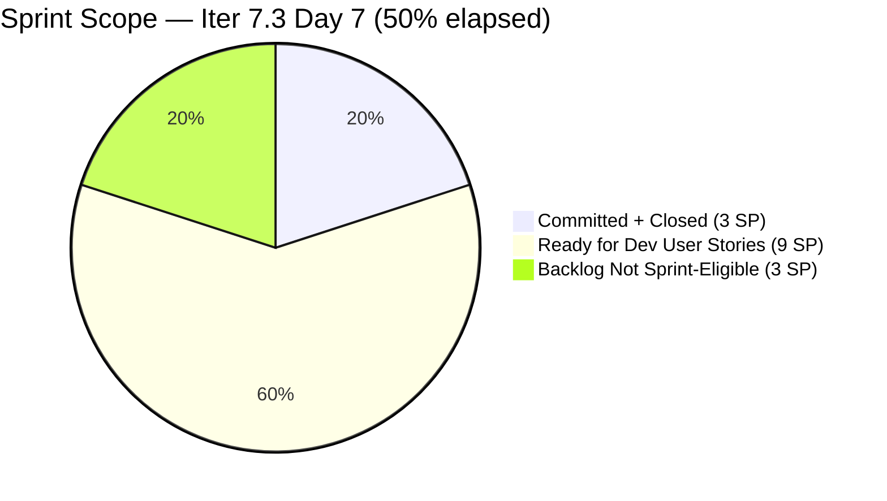
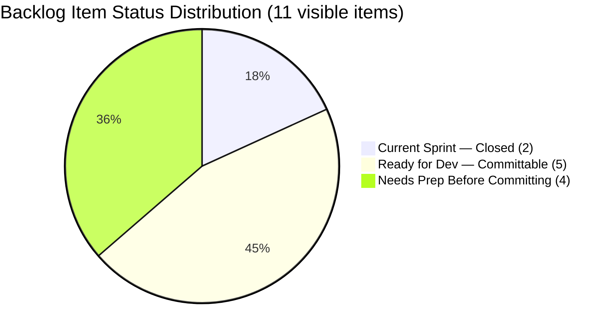
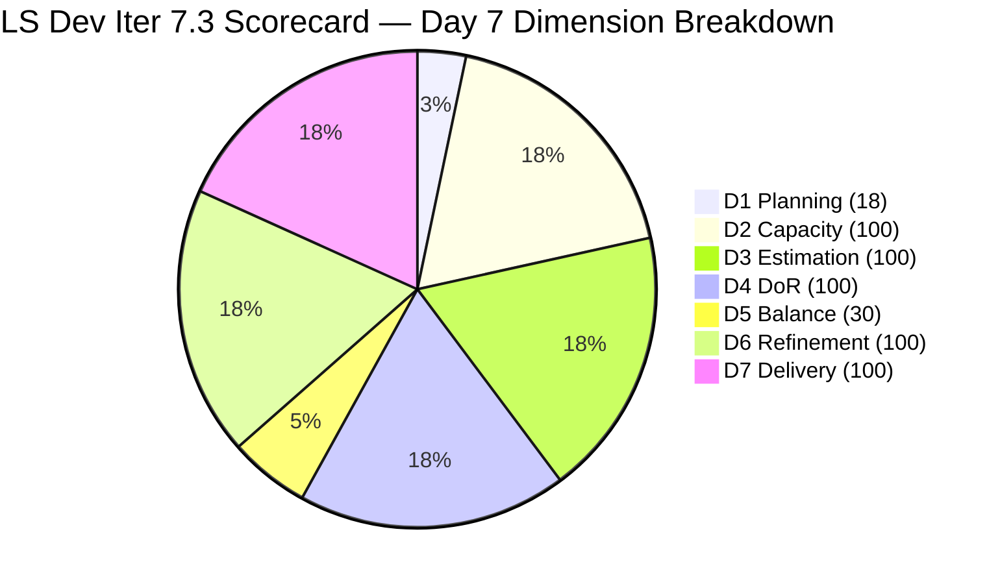

# SAFe Audit Report — Life Style Help App

**Audit A47 | Iteration 7.3 (May 4 – May 17, 2026) | Day 7 of 14**

---

## 1. Audit Metadata

| Field | Value |
|---|---|
| **Audit Date** | May 10, 2026, 02:03 PDT (UTC−7) / 17:03 PHT (UTC+8) |
| **Auditor** | Claude Code (ADO SAFe Audit Agent) |
| **Workspace** | `ado_ls_dev` |
| **ADO Project** | Life Style Help App (`0f447778-7156-4451-ab21-27be3c4a5888`) |
| **Team** | Life Style Help App Team (`a2a805bc-0b30-4ef3-9a8a-b7f3081157a6`) |
| **Iteration** | Iteration 7.3 — May 4 to May 17, 2026 |
| **Iteration ID** | `fab36744-3e3e-4f89-a32c-76ec1d5c4dd0` |
| **Sprint Day** | Day 7 of 14 (50% elapsed) |
| **Days Remaining** | 7 |
| **Prior Audit** | AUDIT_20260509_0902.md (A46, Iter 7.3 Day 6, Overall 78.3 — Moderate Risk) |
| **Scoring Model** | ADO SAFe v1 (7-dimension rubric) |
| **Overall Score** | **78.3 / 100** |
| **Risk Band** | **Moderate Risk** (60–79.9) |

---

## 2. Executive Summary

Life Style Help App scores **78.3 / 100 (Moderate Risk)** on Day 7 — **unchanged from Day 6**. The sprint remains delivered (D7 = 100%) with no active work items. The backlog API returned 9 open items, all outside Iteration 7.3. No state changes were detected since the last audit.

**The sprint is at its halfway mark with zero in-progress items.** The team closed both committed items by Day 3 (#203390 and #203239, 3 SP total) and has operated in a sprint-idle state for the last four days. With 7 days remaining, there is still a meaningful window to commit and close User Stories from the ready backlog — transforming the score from Moderate to Low Risk.

**Key observations on Day 7:**
- No new commitments, no state changes since Day 6.
- 5 User Stories (9 SP) remain Ready for Dev and are immediately committable.
- The sprint is idle; Samantha and Luzmibel have combined 14 remaining Dev/Testing days available.
- Two Spike items (#201334, #202789) continue to lack sufficient Description and AC text (Partial DoR) and are not committable without fixes.
- Sanny Paul Geraldino's ADO capacity for Iter 7.3 has not been verified (assigned to #194082 and #194084).

**Score will remain locked at 78.3 until User Stories are committed to the sprint.**

---

## 3. Previous Audit Delta

| Dimension | A46 (May 9, Day 6, 78.3) | A47 (May 10, Day 7, 78.3) | Delta | Driver |
|---|---|---|---|---|
| Iteration Planning | 18.2 | **18.2** | 0.0 | No new commitments; 2/11 unchanged |
| Team Capacity | 100.0 | **100.0** | 0.0 | Samantha 1 Dev/day; Luzmibel 1 Testing/day — both configured |
| Estimation | 100.0 | **100.0** | 0.0 | 2/2 sprint items estimated |
| DoR Compliance | 100.0 | **100.0** | 0.0 | 2/2 sprint items pass DoR |
| Work Item Balance | 30.0 | **30.0** | 0.0 | No User Story in sprint; Defect-only composition |
| Backlog Refinement | 100.0 | **100.0** | 0.0 | 11/11 fresh; 0 stale; 0 untouched |
| Delivery Predictability | 100.0 | **100.0** | 0.0 | 3/3 SP closed since Day 3; locked at 100% |
| **Overall** | **78.3** | **78.3** | **0.0** | Static — sprint idle Day 4–7; no lever changes |

---

## 4. Current Iteration Snapshot

| Attribute | Value |
|---|---|
| **Iteration** | Iteration 7.3 |
| **Sprint Dates** | May 4 – May 17, 2026 (14 days) |
| **Sprint Day** | Day 7 of 14 (50% elapsed) |
| **Days Remaining** | 7 |
| **Visible Backlog Items (API, open)** | 9 (all outside Iter 7.3) |
| **Confirmed Closed in Iter 7.3** | 2 (#203390, #203239) |
| **Total Visible** | 11 |
| **Current Sprint Items** | 2 (both Closed) |
| **Committed SP** | 3 SP |
| **Closed SP** | 3 SP (100%) |
| **Open SP on Sprint Items** | 0 |
| **Sprint Idle Since** | Day 3 (May 6) — 4 days idle |
| **Immediately Committable User Stories** | 5 items (9 SP) — all Ready for Dev with full DoR |
| **Remaining Capacity** | Samantha: 7 Dev/days; Luzmibel: 7 Testing/days |

---

## 5. Work Item Analysis

### Iteration 7.3 — Sprint Items (2 items, both Closed)

| ID | Title | Type | State | SP | Assignee | Closed | DoR |
|---|---|---|---|---|---|---|---|
| **203390** | Subscription Automatically Cancels at End of Binding Period | Defect | Closed | 2 | Samantha Babael | May 5 (Day 2) | Pass |
| **203239** | Investigate member emilienaess97@gmail.com | Defect | Closed | 1 | Samantha Babael | May 6 (Day 3) | Pass |

### Available Backlog — All Open Items from API (9 items)

| ID | Title | Type | State | Iter Path | SP | Assignee | Changed | DoR |
|---|---|---|---|---|---|---|---|---|
| **195716** | [Medium] Hide "preferanser"/"allergier" in recipe card | User Story | Ready for Dev | PI6/6.5 | 2 | Samantha Babael | Apr 28 | Pass |
| **194082** | Customize the "Servings" Label | User Story | Ready for Dev | root | 1 | Sanny Paul Geraldino | Apr 28 | Pass |
| **194084** | Schedule Blog Post for Future Publication | User Story | Ready for Dev | root | 1 | Sanny Paul Geraldino | Apr 28 | Pass |
| **196380** | [Low] Default Pinned Post for New Users | User Story | Ready for Dev | root | 3 | Samantha Babael | Apr 27 | Pass |
| **195727** | [Low] Meal time filter — search text conflict | User Story | Ready for Dev | root | 2 | Ike Yana | Apr 27 | Pass |
| **195229** | Email Notification for Forum Posts | User Story | Grooming | root | 1 | Ike Yana | Apr 28 | Pass |
| **195373** | [Low] Lifestyle App Performance Optimization | Enabler | New | root | — | Ike Yana | Apr 28 | Pass |
| **201334** | Collaboration / Check and Replicate Raised Issues | Spike | New | PI6/6.5 | — | Luzmibel | Apr 28 | **Partial** |
| **202789** | Lifestyle App — Customer CSAT Survey | Spike | New | Iter 7.6 IP | — | Carol Cuison | Apr 28 | **Partial** |

> **Committable now (full DoR):** #195716 (2 SP), #194082 (1 SP), #194084 (1 SP), #196380 (3 SP), #195727 (2 SP) = 5 items, 9 SP.
>
> **Not yet committable:** #195229 (Grooming state — needs DoR finalization), #195373 (no SP), #201334 (no Description or AC text), #202789 (3-word description only, no AC).
>
> **Assignee note:** #194082 and #194084 are assigned to Sanny Paul Geraldino. His ADO capacity for Iter 7.3 is not verified. Items may need reassignment to Samantha if Sanny's capacity is not configured.

### Backlog Freshness Assessment

| Staleness Category | Count | Oldest Item | Assessment |
|---|---|---|---|
| stale_180 (before Nov 10, 2025) | 0 | — | None |
| stale_90 (before Feb 8, 2026) | 0 | — | None |
| Fresh (after Mar 26, 2026) | 11 | Apr 27 (#195727, #196380) | All fresh |

All 11 items (9 open + 2 closed) are within the 45-day fresh window (after Mar 26, 2026). Backlog hygiene is excellent.

---

## 6. SAFe Compliance Scorecard

| Dimension | Score | Evidence | Notes |
|---|---|---|---|
| 1. Iteration Planning | 18.2 | 2 current / 11 visible = 18.2% | Critical — 9 items uncommitted; only 2 Defects in sprint |
| 2. Team Capacity | 100.0 | 1/1 active contributor with capacity (Samantha) | Luzmibel has 1 Testing/day; no sprint items |
| 3. Estimation | 100.0 | 2/2 sprint items have SP > 0 | #203390 = 2 SP; #203239 = 1 SP |
| 4. DoR Compliance | 100.0 | 2/2 pass Description + AC | Both Defects have clear descriptions and structured ACs |
| 5. Work Item Balance | 30.0 | No User Story → -40; Defect 100% dominant → -30 | Base 100 − 40 − 30 = 30 |
| 6. Backlog Refinement | 100.0 | 11/11 fresh (Apr 27–May 6); stale_90=0; stale_180=0; untouched=0 | Both sprint items closed during sprint; zero untouched |
| 7. Delivery Predictability | 100.0 | 3/3 SP closed = 100% | Sprint delivered Day 3; D7 locked at 100% |
| **Overall** | **78.3** | (18.2+100+100+100+30+100+100) / 7 = 548.2 / 7 | **Moderate Risk** (60–79.9) |

### Score Computation
```
D1 = 2 / 11 × 100 = 18.18 → 18.2
D2 = 1 / 1  × 100 = 100.0
D3 = 2 / 2  × 100 = 100.0
D4 = 2 / 2  × 100 = 100.0
D5 = 100 − 40 − 30 = 30.0   (no US present → -40; Defect dominant 100% → -30)
D6 = 100.0 − 0    = 100.0   (all fresh; 0 untouched)
D7 = 3 / 3  × 100 = 100.0

Overall = (18.2 + 100 + 100 + 100 + 30 + 100 + 100) / 7 = 548.2 / 7 = 78.3
```

---

## 7. Dimension Findings

### D1 — Iteration Planning: 18.2 (Critical — 7-day recovery window)
```
visible_root_backlog_items   = 11 (9 open API + 2 confirmed closed in Iter 7.3)
current_iteration_root_items = 2 (both Closed)
D1 = (2 / 11) × 100 = 18.2
```
Nine open items are outside Iter 7.3: 7 items in root project path (194082, 194084, 195229, 195373, 195727, 196380) plus 1 in PI6/6.5 (#195716) and 1 in Iter 7.6 IP (#202789). At 50% sprint elapsed, there are still 7 full days to commit and close User Stories.

**Impact of committing User Stories on D1:**
- Commit 1 US → visible = 12; current = 3; D1 = 3/12 = 25.0
- Commit 3 US → visible = 14; current = 5; D1 = 5/14 = 35.7
- Commit 5 US → visible = 16; current = 7; D1 = 7/16 = 43.8

Even a single commitment moves D1 from Critical territory. Committing and closing raises Overall by approximately 6+ points.

### D2 — Team Capacity: 100.0 ✅
```
contributors_with_current_work    = 1 (Samantha Babael — 2 closed sprint items)
contributors_with_capacity        = 1 (Samantha: 1 Dev/day confirmed in ADO API)
D2 = 1/1 × 100 = 100.0
```
Luzmibel Paculanang (1 Testing/day configured) has no sprint items — does not count toward D2 numerator or denominator. If any item is assigned to her, D2 becomes 2/2 = 100% (maintained).

Sanny Paul Geraldino is assigned to #194082 and #194084 but his Iter 7.3 capacity is not confirmed in ADO. If committed, his capacity must be verified or items reassigned to maintain accurate D2.

### D3 — Estimation: 100.0 ✅
Both sprint items have Story Points: #203390 = 2 SP, #203239 = 1 SP. The Defect work item type exposes the Story Points field. Score = 2/2 = 100%.

Note: Open backlog items #201334 (Spike) and #202789 (Spike) have no SP values, and #195373 (Enabler) has no SP. These must be estimated before sprint commitment.

### D4 — DoR Compliance: 100.0 ✅
Both sprint items pass DoR gates (verified from live ADO API):
- **#203390** Subscription Defect: Description clearly identifies the cancellation bug; AC defines expected behavior with specific trigger conditions.
- **#203239** Member Investigation: Description scopes the investigation; AC defines completion criteria.

D4 = 2/2 = 100%.

### D5 — Work Item Balance: 30.0 (High Risk — Actionable today)
```
User Story present: None → -40 penalty
Defect: 2/2 = 100% > 60% → -30 penalty
Spike share: 0% → +0
D5 = 100 − 40 − 30 = 30.0
```
This is the most impactful and most immediately actionable gap. The -40 penalty for having no User Story drops the moment any single US enters the sprint.

**D5 impact scenarios:**
- Commit 1 US (not yet closed): US=1/3=33.3%; Defect=2/3=66.7%>60% → -30 only; -40 drops; D5 = 70 (+40 improvement)
- Commit 1 US + close it: same type distribution; D5 = 70

One User Story commitment transforms D5 from 30 to 70, adding 5.7 points to Overall.

### D6 — Backlog Refinement: 100.0 ✅
```
base = (11 / 11) × 100 = 100.0
stale_90 (before Feb 8, 2026): 0 items
stale_180 (before Nov 10, 2025): 0 items
untouched_current_items (before May 4): 0 (both sprint items closed during sprint)
D6 = 100.0 − 0 = 100.0
```
Seventh consecutive audit with D6 = 100.0. Backlog hygiene remains exceptional. All items last changed Apr 27–May 6, well within the 45-day fresh window.

### D7 — Delivery Predictability: 100.0 ✅ (conditional)
```
committed_story_points = 3
closed_story_points    = 3
D7 = (3 / 3) × 100 = 100.0
```
Sprint delivered on Day 3; D7 locked at 100%. This score reflects perfect execution on committed scope, not sprint completeness.

**Note on new scope:** If User Stories are added to the sprint, D7 resets. Example: commit 9 SP of User Stories → D7 = 3/(3+9) = 25.0% until closed. The combined D1+D5 score gain (+5.7+40 before /7) exceeds the D7 loss, so the net effect is still positive.

---

## 8. Score Impact Scenarios — Committing User Stories (Day 7)

| Scenario | Sprint Items | D1 | D5 | D7 | Estimated Overall |
|---|---|---|---|---|---|
| **Current — Day 7 idle** | 2 (Closed Defects) | 18.2 | 30.0 | 100.0 | **78.3** |
| Commit 1 US (open, not closed) | 3 | 25.0 | 70.0 | 75.0 | ~81.4 |
| Commit 1 US + close it | 3 | 25.0 | 70.0 | 100.0 | **~85.0** |
| Commit 3 US + close all (5 SP) | 5 | 35.7 | 70.0 | 100.0 | **~86.7** |
| Commit 5 US + close all (9 SP) | 7 | 43.8 | 70.0 | 100.0 | **~90.5** |

The minimum action for Low Risk (≥80.0): **commit 1 US even without closing it** → Overall ~81.4. With 7 days remaining, committing and closing 1–2 User Stories is realistic.

---

## 9. Risks and Bottlenecks





| Risk | Severity | Status | Action |
|---|---|---|---|
| **Sprint idle — 4 consecutive days (Days 4–7)** | Critical | 7 days remain; 0 active work | Commit User Stories immediately |
| **D1 at 18.2** (Critical zone) | Critical | 9 items uncommitted; structural planning gap | Commit 1–5 US stories from ready backlog today |
| **D5 at 30.0** (High Risk) | High | No User Story in sprint | Any US commitment → D5 jumps to 70 |
| **Sanny Geraldino capacity unverified** | Moderate | Assigned to #194082, #194084; no ADO capacity record confirmed | Verify or reassign to Samantha |
| **#201334, #202789 DoR partial** | Moderate | No/minimal Description and AC text | Fix DoR before committing |
| **#195716 stale iteration path** | Low | Assigned to PI6/Iter 6.5 | Update IterationPath to Iter 7.3 when committed |
| **No PI Objectives linked** | Low | Persistent gap | Coordinate with portfolio team |
| **No Iteration Goal defined** | Low | Persistent gap | Define at next sprint planning |

---

## 10. Prioritized Recommendations

1. **[Immediate — Today] Commit and close #194082 "Customize Servings Label" (1 SP)** — Ready for Dev, full DoR, 1 SP. Assigning to Samantha (or verifying Sanny's capacity) and closing today raises Overall from 78.3 to approximately 85.0 by eliminating the -40 penalty and raising D1 from 18.2 to 25.0. This is the single highest-value action available.

2. **[Today] Commit 2–3 additional User Stories** — Items #194084 (1 SP, Schedule Blog Post), #196380 (3 SP, Default Pinned Post), and #195727 (2 SP, Meal Filter fix) are all Ready for Dev with full DoR. Committing 3 items and closing all raises Overall to approximately 86.7.

3. **[Today] Verify Sanny Paul Geraldino's ADO capacity** — #194082 and #194084 are assigned to Sanny. If his capacity is not configured in ADO for Iter 7.3, D2 will show 2 contributors with work but only 1 with capacity (score drops to 50.0). Either configure Sanny's capacity in ADO or reassign items to Samantha to avoid this risk.

4. **[Today] Assign Luzmibel to at least one item** — Luzmibel Paculanang has 1 Testing/day capacity for 7 remaining days. Assigning her to test a committed User Story keeps D2 at 100% and represents full capacity utilization for the sprint.

5. **[This Week] Fix DoR for #201334 and #202789** — Both Spike items lack adequate Description and AC text. Before committing, add ≥30 non-whitespace chars to Description and ≥20 non-whitespace chars to AC. Then estimate SP for both before committing.

6. **[Next Sprint] Conduct formal sprint planning with full scope commitment** — This is the third consecutive iteration where only 2–3 Defects were committed at sprint start, leaving 8–10 SP of ready User Stories idle for the first half of the sprint. Formal sprint planning that loads 8–12 SP of User Stories before Day 1 would prevent this structural waste and immediately improve D1 and D5 scores from the outset.

---

## 11. Evidence Gaps and Limitations

| Gap | Impact | Mitigation |
|---|---|---|
| Closed items not returned by backlog API | Low | #203390 and #203239 confirmed from prior audit evidence (types, SP, states, closed dates) |
| Sanny Paul Geraldino ADO capacity | Moderate | Assignee confirmed from live API; capacity not in ADO team settings — verify before committing assigned items |
| #201334 full Description and AC | Low | No Description or AC text returned by API; flagged as Partial DoR |
| PI Objectives linkage | Low | Not queried; known persistent gap |
| Iteration Goal field | Low | Not in ADO standard API; recommend manual check |

---

## 12. Score Trend — Iteration 7.3



| Day | Score | Band | Key Event |
|---|---|---|---|
| Day 1 | 78.3 (corrected) | Moderate | Sprint launched; Defects loaded |
| Day 2 | 78.3 | Moderate | #203390 closed (2 SP) |
| Day 3 | 78.3 | Moderate | #203239 closed (1 SP); D7 = 100% |
| Day 4 | 78.3 | Moderate | Sprint idle; no new commitments |
| Day 5 | 78.3 | Moderate | Sprint idle |
| Day 6 | 78.3 | Moderate | Sprint idle |
| Day 7 | **78.3** | **Moderate** | Sprint idle (4th consecutive day); sprint at halfway |

> Score locked at 78.3 since Day 1. D1 (18.2) and D5 (30.0) are the only failing dimensions and are correctable today. Committing 1 User Story raises Overall to ~81–85. Seven days remain.

---

*Report generated: May 10, 2026, 02:03 PDT | Workspace: ado_ls_dev | Auditor: Claude Code ADO SAFe Audit Agent*
