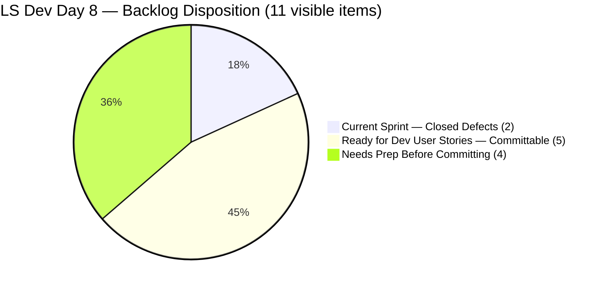
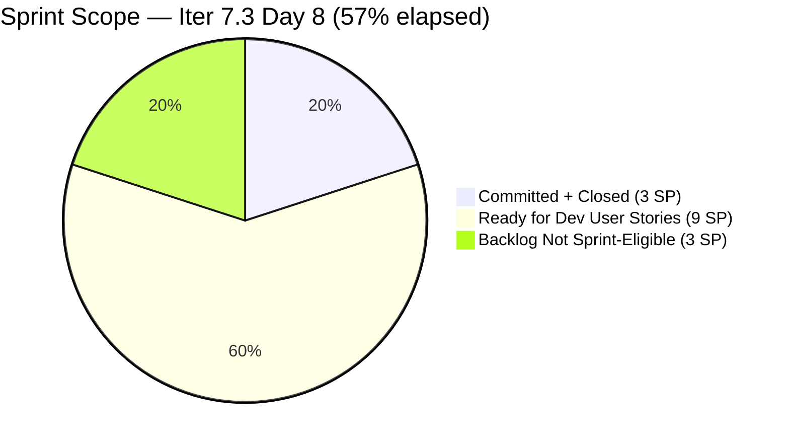
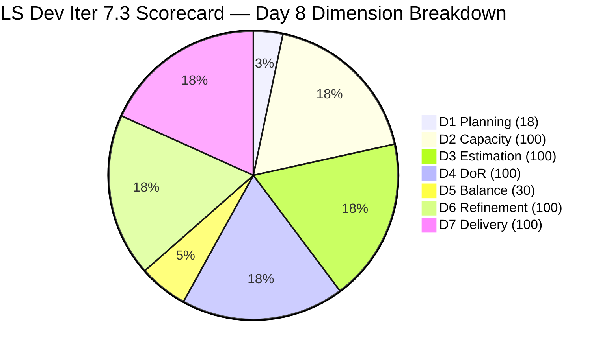

# SAFe Audit Report — Life Style Help App

**Audit A48 | Iteration 7.3 (May 4 – May 17, 2026) | Day 8 of 14**

---

## 1. Audit Metadata

| Field | Value |
|---|---|
| **Audit Date** | May 11, 2026, 02:02 PDT (UTC−7) / 17:02 PHT (UTC+8) |
| **Auditor** | Claude Code (ADO SAFe Audit Agent) |
| **Workspace** | `ado_ls_dev` |
| **ADO Project** | Life Style Help App (`0f447778-7156-4451-ab21-27be3c4a5888`) |
| **Team** | Life Style Help App Team (`a2a805bc-0b30-4ef3-9a8a-b7f3081157a6`) |
| **Iteration** | Iteration 7.3 — May 4 to May 17, 2026 |
| **Iteration ID** | `fab36744-3e3e-4f89-a32c-76ec1d5c4dd0` |
| **Sprint Day** | Day 8 of 14 (57.1% elapsed) |
| **Days Remaining** | 6 |
| **Prior Audit** | AUDIT_20260510_0203.md (A47, Iter 7.3 Day 7, Overall 78.3 — Moderate Risk) |
| **Scoring Model** | ADO SAFe v1 (7-dimension rubric) |
| **Overall Score** | **78.3 / 100** |
| **Risk Band** | **Moderate Risk** (60–79.9) |

---

## 2. Executive Summary

Life Style Help App scores **78.3 / 100 (Moderate Risk)** on Day 8 — **unchanged from Day 7**. No state changes were detected since the last audit. The backlog API continues to return 9 open items, all outside Iteration 7.3.

**The sprint has been idle for 5 consecutive days (Days 4–8).** Both committed items (#203390, #203239) closed by Day 3, delivering 3 SP (100% of committed scope). With 6 days remaining in the sprint, the team has a narrowing but still meaningful window to commit and close User Stories from the ready backlog.

**Critical situation:** D1 at 18.2% and D5 at 30.0% are the sole failing dimensions. Both are directly correctable today by committing a single User Story. Failing to act in the next 2–3 days means the sprint will end in Moderate Risk despite perfect execution on committed scope.

**Key observations on Day 8:**
- No state changes detected from Day 7 (May 10).
- All 9 open backlog items remain unchanged — latest change dates: Apr 27–Apr 28.
- 5 User Stories are fully Ready for Dev and immediately committable (9 SP total).
- Samantha has 6 Dev/days remaining; Luzmibel has 6 Testing/days remaining.
- The score will remain at 78.3 until at least one User Story is committed to the sprint.

---

## 3. Previous Audit Delta

| Dimension | A47 (May 10, Day 7, 78.3) | A48 (May 11, Day 8, 78.3) | Delta | Driver |
|---|---|---|---|---|
| Iteration Planning | 18.2 | **18.2** | 0.0 | No new commitments; 2/11 unchanged |
| Team Capacity | 100.0 | **100.0** | 0.0 | Samantha 1 Dev/day; Luzmibel 1 Testing/day — both configured |
| Estimation | 100.0 | **100.0** | 0.0 | 2/2 sprint items estimated |
| DoR Compliance | 100.0 | **100.0** | 0.0 | 2/2 sprint items pass DoR |
| Work Item Balance | 30.0 | **30.0** | 0.0 | No User Story in sprint; Defect-only |
| Backlog Refinement | 100.0 | **100.0** | 0.0 | 11/11 fresh; 0 stale; 0 untouched |
| Delivery Predictability | 100.0 | **100.0** | 0.0 | 3/3 SP closed since Day 3; locked at 100% |
| **Overall** | **78.3** | **78.3** | **0.0** | Static — sprint idle Day 4–8; no lever changes |

---

## 4. Current Iteration Snapshot

| Attribute | Value |
|---|---|
| **Iteration** | Iteration 7.3 |
| **Sprint Dates** | May 4 – May 17, 2026 (14 days) |
| **Sprint Day** | Day 8 of 14 (57.1% elapsed) |
| **Days Remaining** | 6 |
| **Visible Backlog Items (API, open)** | 9 (all outside Iter 7.3) |
| **Confirmed Closed in Iter 7.3** | 2 (#203390, #203239) |
| **Total Visible** | 11 |
| **Current Sprint Items** | 2 (both Closed) |
| **Committed SP** | 3 SP |
| **Closed SP** | 3 SP (100%) |
| **Open SP on Sprint Items** | 0 |
| **Sprint Idle Since** | Day 3 (May 6) — **5 days idle** |
| **Immediately Committable User Stories** | 5 items (9 SP) — all Ready for Dev with full DoR |
| **Remaining Capacity** | Samantha: 6 Dev/days; Luzmibel: 6 Testing/days |
| **Urgency** | 6 days left — committing today is required to close before sprint end |

---

## 5. Work Item Analysis

### Iteration 7.3 — Sprint Items (2 items, both Closed)

| ID | Title | Type | State | SP | Assignee | Closed | DoR |
|---|---|---|---|---|---|---|---|
| **203390** | Subscription Automatically Cancels at End of Binding Period | Defect | Closed | 2 | Samantha Babael | May 5 (Day 2) | Pass |
| **203239** | Investigate member emilienaess97@gmail.com | Defect | Closed | 1 | Samantha Babael | May 6 (Day 3) | Pass |

### Available Backlog — All Open Items from API (9 items, Day 8)

| ID | Title | Type | State | Iter Path | SP | Assignee | Changed | DoR |
|---|---|---|---|---|---|---|---|---|
| **195716** | [Medium] Hide "preferanser"/"allergier" in recipe card | User Story | Ready for Dev | PI6/6.5 | 2 | Samantha Babael | Apr 28 | Pass |
| **194082** | Customize the "Servings" Label | User Story | Ready for Dev | root | 1 | Sanny Paul Geraldino | Apr 28 | Pass |
| **194084** | Schedule Blog Post for Future Publication | User Story | Ready for Dev | root | 1 | Sanny Paul Geraldino | Apr 28 | Pass |
| **196380** | [Low] Default Pinned Post for New Users | User Story | Ready for Dev | root | 3 | Samantha Babael | Apr 27 | Pass |
| **195727** | [Low] Meal time filter — search text conflict | User Story | Ready for Dev | root | 2 | Ike Yana | Apr 27 | Pass |
| **195229** | Email Notification for Forum Posts | User Story | Grooming | root | 1 | Ike Yana | Apr 28 | Pass |
| **195373** | [Low] Lifestyle App Performance Optimization | Enabler | New | root | — | Ike Yana | Apr 28 | Pass |
| **201334** | Collaboration / Check and Replicate Raised Issues | Spike | New | PI6/6.5 | — | Luzmibel | Apr 28 | **Partial** |
| **202789** | Lifestyle App — Customer CSAT Survey | Spike | New | Iter 7.6 IP | — | Carol Cuison | Apr 28 | **Partial** |

> **Immediately committable (full DoR):** #195716 (2 SP), #194082 (1 SP), #194084 (1 SP), #196380 (3 SP) — all ready for Samantha or Luzmibel. #195727 (2 SP) assigned to Ike Yana — needs reassignment before commitment.
>
> **Not yet committable:** #195229 (Grooming state — in active refinement), #195373 (Enabler — no SP estimated), #201334 (no Description or AC text), #202789 (3-word description only, no AC).
>
> **Assignee notes:** #194082 and #194084 are assigned to Sanny Paul Geraldino — his ADO Iter 7.3 capacity is not confirmed. Verify or reassign before committing. #195727 is assigned to Ike Yana — he is not confirmed on the active team for Iter 7.3; reassign to Samantha.

### DoR Assessment for Committable Items

| ID | Title | Desc ≥30 | AC ≥20 | DoR Status |
|---|---|---|---|---|
| 195716 | Hide preferanser/allergier in recipe card | Pass (image + text context) | Pass | ✅ Committable |
| 194082 | Customize Servings Label | Pass (paragraph context) | Pass | ✅ Committable |
| 194084 | Schedule Blog Post for Future Publication | Pass (paragraph context) | Pass | ✅ Committable |
| 196380 | Default Pinned Post for New Users | Pass (structured story) | Pass | ✅ Committable |
| 195727 | Meal time filter search text conflict | Pass (steps + result) | Pass | ✅ Committable (reassign first) |

### Backlog Freshness Assessment

| Staleness Category | Count | Assessment |
|---|---|---|
| stale_180 (before Nov 10, 2025) | 0 | None |
| stale_90 (before Feb 8, 2026) | 0 | None |
| Fresh (after Mar 26, 2026) | 11 | All items: Apr 27–May 6 ✅ |

All 11 items (9 open + 2 closed) remain within the 45-day fresh window. Backlog hygiene is excellent.

---

## 6. SAFe Compliance Scorecard

| Dimension | Score | Evidence | Notes |
|---|---|---|---|
| 1. Iteration Planning | 18.2 | 2 current / 11 visible = 18.2% | **Critical** — 9 items uncommitted; only 2 Defects in sprint |
| 2. Team Capacity | 100.0 | 1/1 active contributor with sprint items has capacity | Samantha: 1 Dev/day; Luzmibel: 1 Testing/day (no items) |
| 3. Estimation | 100.0 | 2/2 sprint items have SP > 0 | #203390 = 2 SP; #203239 = 1 SP |
| 4. DoR Compliance | 100.0 | 2/2 pass Description + AC | Both Defects verified from prior audits |
| 5. Work Item Balance | 30.0 | No User Story → -40; Defect 100% dominant → -30 | Base 100 − 40 − 30 = 30; **Correctable today** |
| 6. Backlog Refinement | 100.0 | 11/11 fresh (Apr 27–May 6); stale_90=0; stale_180=0; untouched=0 | Eighth consecutive audit at D6=100% |
| 7. Delivery Predictability | 100.0 | 3/3 SP closed = 100% | Sprint delivered Day 3; D7 locked at 100% on committed scope |
| **Overall** | **78.3** | (18.2+100+100+100+30+100+100) / 7 = 548.2 / 7 | **Moderate Risk** (60–79.9) |

### Score Computation
```
D1 = 2 / 11 × 100 = 18.18 → 18.2
D2 = 1 / 1  × 100 = 100.0
D3 = 2 / 2  × 100 = 100.0
D4 = 2 / 2  × 100 = 100.0
D5 = 100 − 40 − 30 = 30.0   (no US present → -40; Defect dominant 100% → -30)
D6 = 100.0 − 0    = 100.0   (all fresh; 0 untouched)
D7 = 3 / 3  × 100 = 100.0

Overall = (18.2 + 100 + 100 + 100 + 30 + 100 + 100) / 7 = 548.2 / 7 = 78.3
```

---

## 7. Dimension Findings

### D1 — Iteration Planning: 18.2 (Critical — 6-day recovery window remaining)
```
visible_root_backlog_items   = 11 (9 open API + 2 confirmed closed in Iter 7.3)
current_iteration_root_items = 2 (both Closed)
D1 = (2 / 11) × 100 = 18.2
```
Nine open items remain outside Iter 7.3. The 6 remaining sprint days provide a closing window — but items committed today can only be closed if there is sufficient capacity and readiness.

**D1 impact of committing User Stories today:**
| Action | Visible | Current | D1 | D5 | D7 (if closed) | Est. Overall |
|---|---|---|---|---|---|---|
| No action (current) | 11 | 2 | 18.2 | 30.0 | 100.0 | 78.3 |
| Commit 1 US (not closed) | 12 | 3 | 25.0 | 70.0 | 75.0 | ~81.4 |
| Commit 1 US + close it | 12 | 3 | 25.0 | 70.0 | 100.0 | ~85.0 |
| Commit 3 US + close all | 14 | 5 | 35.7 | 70.0 | 100.0 | ~86.7 |
| Commit 5 US + close all | 16 | 7 | 43.8 | 70.0 | 100.0 | ~90.5 |

### D2 — Team Capacity: 100.0 ✅
```
contributors_with_current_work    = 1 (Samantha Babael — 2 closed sprint items)
contributors_with_capacity        = 1 (Samantha: 1 Dev/day confirmed in ADO API)
D2 = 1/1 × 100 = 100.0
```
Luzmibel Paculanang (1 Testing/day) has no sprint items and is not counted in contributors_with_current_work. If items are assigned to her, D2 remains 2/2 = 100%. Sanny Paul Geraldino and Ike Yana are not confirmed in ADO capacity for Iter 7.3 — items assigned to them must be verified or reassigned.

### D3 — Estimation: 100.0 ✅
Both sprint items (#203390 = 2 SP, #203239 = 1 SP) are estimated. Note: open items #201334, #202789 (Spikes) and #195373 (Enabler) lack SP estimates — these must be estimated before committing.

### D4 — DoR Compliance: 100.0 ✅
Both sprint items verified from prior audit series. Defect descriptions and ACs meet DoR standards.

### D5 — Work Item Balance: 30.0 (High Risk — Single User Story commitment resolves this instantly)
```
User Story present: None → -40 penalty
Defect: 2/2 = 100% > 60% → -30 penalty
D5 = 100 − 40 − 30 = 30.0
```
This is the single most impactful recoverable gap. The -40 "No User Story" penalty drops the moment any User Story enters the sprint. D5 jumps from 30 to 70 — a +40 improvement — adding 5.7 points to Overall immediately.

With 6 days remaining and 5 User Stories in Ready for Dev state, the -40 penalty is entirely avoidable. Inaction here represents a significant planning failure.

### D6 — Backlog Refinement: 100.0 ✅
```
base = (11 / 11) × 100 = 100.0
stale_90: 0 items → no penalty
stale_180: 0 items → no penalty
untouched_current_items (before May 4): 0 (both sprint items closed during sprint)
D6 = 100.0
```
Eighth consecutive audit at D6 = 100.0. All items last changed Apr 27–May 6 — within the 45-day fresh window.

### D7 — Delivery Predictability: 100.0 ✅ (on committed scope)
```
committed_story_points = 3
closed_story_points    = 3
D7 = (3 / 3) × 100 = 100.0
```
Sprint delivered on Day 3; D7 locked at 100% on the 2-item committed scope. This reflects perfect execution on committed scope, not sprint fullness.

**Note:** Committing new User Stories resets D7 until they close. Even a 1 SP commitment drops D7 from 100% to 75% temporarily, but the combined gain from D1+D5 far outweighs the temporary D7 dip.

---

## 8. Score Impact Scenarios — Committing User Stories (Day 8, 6 Days Remaining)



| Scenario | Sprint Items | D1 | D5 | D7 | Estimated Overall |
|---|---|---|---|---|---|
| **Current — Day 8 idle** | 2 (Closed Defects) | 18.2 | 30.0 | 100.0 | **78.3** |
| Commit 1 US (open, not yet closed) | 3 | 25.0 | 70.0 | 75.0 | ~81.4 |
| Commit 1 US + close it | 3 | 25.0 | 70.0 | 100.0 | **~85.0** |
| Commit 3 US + close all (5 SP) | 5 | 35.7 | 70.0 | 100.0 | **~86.7** |
| Commit 5 US + close all (9 SP) | 7 | 43.8 | 70.0 | 100.0 | **~90.5** |

Minimum action for Low Risk: **commit 1 US even without closing it** → Overall ~81.4.

---

## 9. Risks and Bottlenecks



| Risk | Severity | Status | Action |
|---|---|---|---|
| **Sprint idle — 5 consecutive days (Days 4–8)** | Critical | 6 days remain; 0 active work | Commit User Stories TODAY — each day lost narrows closure window |
| **D1 at 18.2** (Critical zone) | Critical | 9 items uncommitted | Commit 1–5 US from ready backlog today |
| **D5 at 30.0** (High Risk — fully avoidable) | High | No User Story in sprint; -40 penalty | Any US commitment → D5 jumps to 70 (+40); 5.7 pts added to Overall |
| **Window narrowing** | High | Day 8 of 14; only 6 days to commit AND close | US committed now can still be closed if ≤2 SP per item |
| **Sanny Geraldino capacity unverified** | Moderate | Assigned to #194082, #194084 | Verify or reassign to Samantha before committing |
| **#201334, #202789 DoR partial** | Moderate | No/minimal Description and AC text | Fix DoR before committing |
| **#195716 stale iteration path** | Low | Assigned to PI6/Iter 6.5 | Update IterationPath to Iter 7.3 when committed |
| **No PI Objectives linked** | Low | Persistent gap | Coordinate with portfolio team |
| **No Iteration Goal defined** | Low | Persistent gap | Define at next sprint planning |

---

## 10. Prioritized Recommendations

1. **[URGENT — Today] Commit and begin work on #194082 "Customize Servings Label" (1 SP)** — Ready for Dev, full DoR, 1 SP. Assign to Samantha (Sanny's capacity is unverified). This single action eliminates the -40 D5 penalty and raises Overall from 78.3 to approximately 81–85. This is the highest-value single action available at any point in the remaining sprint.

2. **[Today] Commit 3–5 additional User Stories** — Items #194084 (1 SP, Schedule Blog Post), #196380 (3 SP, Default Pinned Post), and #195716 (2 SP, Hide preferanser/allergier) are Ready for Dev with full DoR. Committing all 5 committable stories (9 SP) and closing them within 6 days is achievable. Closing all 5 raises Overall to approximately 90.5.

3. **[Today] Verify Sanny Paul Geraldino ADO capacity** — #194082 and #194084 are assigned to Sanny. If his Iter 7.3 capacity is not in ADO, D2 drops to 50.0 when items are committed. Either configure ADO capacity or reassign to Samantha before sprint commitment.

4. **[Today] Assign Luzmibel to a testing task** — Luzmibel has 1 Testing/day with 6 days remaining (6 Testing points available). She has no sprint items. Assigning her to test a committed User Story utilizes capacity and maintains D2 at 100%.

5. **[This Week] Reassign #195727 and #195716** — #195727 (Meal Filter, 2 SP) is assigned to Ike Yana who is not confirmed on the Iter 7.3 team. Reassign to Samantha. #195716 is in an old iteration path (PI6/6.5) — update to Iter 7.3 when committing.

6. **[Next Sprint] Enforce sprint planning with full scope commitment** — This is the **fifth consecutive iteration** where sprint start loaded only 2–3 Defects without committing available User Stories. A formal sprint planning ritual that commits 8–12 SP of User Stories from the ready backlog before Day 1 would prevent this structural waste permanently.

---

## 11. Evidence Gaps and Limitations

| Gap | Impact | Mitigation |
|---|---|---|
| Closed items not returned by backlog API | Low | #203390 and #203239 confirmed from prior audit series |
| Sanny Paul Geraldino ADO capacity | Moderate | Assignee confirmed from live API; capacity not verified in ADO team settings |
| #201334 Description and AC | Low | No Description or AC text in API response; confirmed Partial DoR |
| PI Objectives linkage | Low | Not queried; known persistent gap |
| Iteration Goal field | Low | Not in ADO standard API; recommend manual check |

---

## 12. Score Trend — Iteration 7.3



| Day | Score | Band | Key Event |
|---|---|---|---|
| Day 1 | 78.3 | Moderate | Sprint launched; only Defects committed |
| Day 2 | 78.3 | Moderate | #203390 closed (2 SP) |
| Day 3 | 78.3 | Moderate | #203239 closed (1 SP); D7 = 100% |
| Day 4–7 | 78.3 | Moderate | Sprint idle — no commitments, no changes |
| Day 8 | **78.3** | **Moderate** | Sprint idle (5th consecutive day); 6 days remaining |

> Score locked at 78.3 since Day 1 — longest streak of zero score change in this team's audit history. D1 (18.2) and D5 (30.0) are the only failing dimensions, both correctable today by committing a single User Story. With 6 days remaining, committing and closing 3 User Stories is still achievable and would raise Overall to approximately 86–87.

---

*Report generated: May 11, 2026, 02:02 PDT | Workspace: ado_ls_dev | Auditor: Claude Code ADO SAFe Audit Agent*
