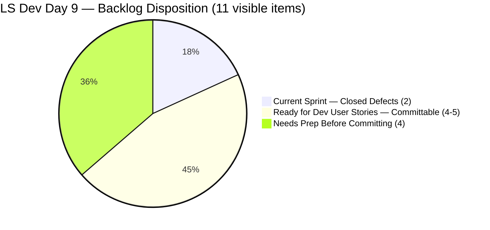
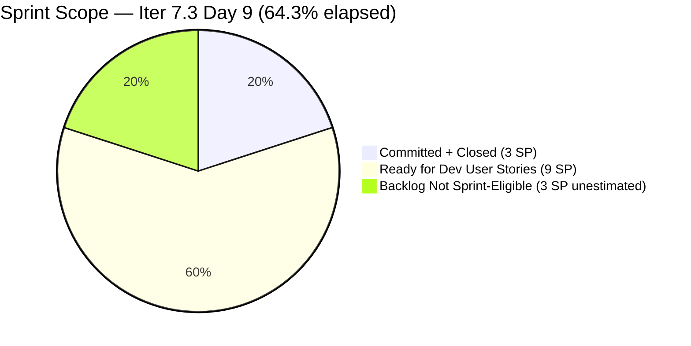
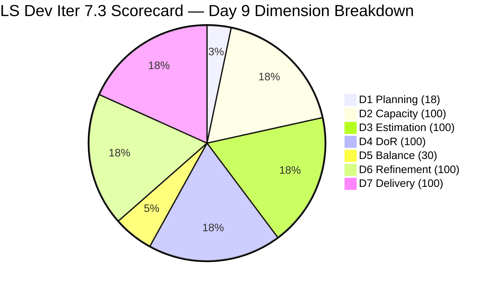

# SAFe Audit Report — Life Style Help App

**Audit A49 | Iteration 7.3 (May 4 – May 17, 2026) | Day 9 of 14**

---

## 1. Audit Metadata

| Field | Value |
|---|---|
| **Audit Date** | May 12, 2026, 09:03 UTC / 02:03 PDT (UTC−7) / 17:03 PHT (UTC+8) |
| **Auditor** | Claude Code (ADO SAFe Audit Agent) |
| **Workspace** | `ado_ls_dev` |
| **ADO Project** | Life Style Help App (`0f447778-7156-4451-ab21-27be3c4a5888`) |
| **Team** | Life Style Help App Team (`a2a805bc-0b30-4ef3-9a8a-b7f3081157a6`) |
| **Iteration** | Iteration 7.3 — May 4 to May 17, 2026 |
| **Iteration ID** | `fab36744-3e3e-4f89-a32c-76ec1d5c4dd0` |
| **Sprint Day** | Day 9 of 14 (64.3% elapsed) |
| **Days Remaining** | 5 |
| **Prior Audit** | AUDIT_20260511_0902.md (A48, Iter 7.3 Day 8, Overall 78.3 — Moderate Risk) |
| **Scoring Model** | ADO SAFe v1 (7-dimension rubric) |
| **Overall Score** | **78.3 / 100** |
| **Risk Band** | **Moderate Risk** (60–79.9) |

---

## 2. Executive Summary

Life Style Help App scores **78.3 / 100 (Moderate Risk)** on Day 9 — **unchanged from Day 8**. No state changes were detected in the ADO backlog. All 9 open items remain at the same states and change dates (Apr 27–28, 2026) as in yesterday's audit.

**The sprint has been idle for 6 consecutive days (Days 4–9).** Both committed items (#203390, #203239) closed by Day 3, delivering 3 SP (100% of committed scope). With 5 days remaining in the sprint, the window to commit and close User Stories from the ready backlog is critically narrow but not yet closed.

**Critical situation (Day 9 severity: Urgent):**
- D1 at 18.2% remains the most impactful correctable gap. Committing one User Story today raises D1 to 25.0% and D5 from 30.0 to 70.0 — a +5.7 point gain to Overall, crossing the Low Risk threshold at 80+.
- D5 at 30.0% is entirely correctable in one action.
- 5 User Stories in Ready for Dev state are fully DoR-compliant and immediately committable.
- **Each day of inaction costs 1 closing day. After Day 10, any 3-SP item committed may not close before Day 14.**

---

## 3. Previous Audit Delta

| Dimension | A48 (May 11, Day 8, 78.3) | A49 (May 12, Day 9, 78.3) | Delta | Driver |
|---|---|---|---|---|
| Iteration Planning | 18.2 | **18.2** | 0.0 | No new commitments; 2/11 unchanged |
| Team Capacity | 100.0 | **100.0** | 0.0 | Samantha 1 Dev/day; Luzmibel 1 Testing/day — both configured |
| Estimation | 100.0 | **100.0** | 0.0 | 2/2 sprint items estimated |
| DoR Compliance | 100.0 | **100.0** | 0.0 | 2/2 sprint items pass DoR |
| Work Item Balance | 30.0 | **30.0** | 0.0 | No User Story in sprint; Defect-only |
| Backlog Refinement | 100.0 | **100.0** | 0.0 | 11/11 fresh; 0 stale; 0 untouched |
| Delivery Predictability | 100.0 | **100.0** | 0.0 | 3/3 SP closed since Day 3; locked at 100% |
| **Overall** | **78.3** | **78.3** | **0.0** | **Sixth consecutive day at 78.3 — longest static streak in audit history** |

---

## 4. Current Iteration Snapshot

| Attribute | Value |
|---|---|
| **Iteration** | Iteration 7.3 |
| **Sprint Dates** | May 4 – May 17, 2026 (14 days) |
| **Sprint Day** | Day 9 of 14 (64.3% elapsed) |
| **Days Remaining** | **5** |
| **Visible Backlog Items (API, open)** | 9 (all outside Iter 7.3) |
| **Confirmed Closed in Iter 7.3** | 2 (#203390, #203239) |
| **Total Visible** | 11 |
| **Current Sprint Items** | 2 (both Closed) |
| **Committed SP** | 3 SP |
| **Closed SP** | 3 SP (100%) |
| **Open SP on Sprint Items** | 0 |
| **Sprint Idle Since** | Day 3 (May 6) — **6 days idle** |
| **Closing Window Status** | **CRITICAL** — 5 days left; items ≤2 SP can still close if committed today |
| **Immediately Committable User Stories** | 4–5 items (7–9 SP) with full DoR |
| **Remaining Capacity** | Samantha: 5 Dev/days; Luzmibel: 5 Testing/days |
| **Last Backlog Activity** | Apr 28, 2026 — no changes in 14 days |

---

## 5. Work Item Analysis

### Iteration 7.3 — Sprint Items (2 items, both Closed — unchanged)

| ID | Title | Type | State | SP | Assignee | Closed | DoR |
|---|---|---|---|---|---|---|---|
| **203390** | Subscription Automatically Cancels at End of Binding Period | Defect | Closed | 2 | Samantha Babael | May 5 (Day 2) | Pass |
| **203239** | Investigate member emilienaess97@gmail.com | Defect | Closed | 1 | Samantha Babael | May 6 (Day 3) | Pass |

### Available Backlog — All Open Items from API (9 items, Day 9 — unchanged from Day 8)

| ID | Title | Type | State | Iter Path | SP | Assignee | Changed | DoR | Committable |
|---|---|---|---|---|---|---|---|---|---|
| **195716** | Hide "preferanser"/"allergier" in recipe card | User Story | Ready for Dev | PI6/6.5 | 2 | Samantha Babael | Apr 28 | Pass | ✅ (update IterPath) |
| **194082** | Customize the "Servings" Label | User Story | Ready for Dev | root | 1 | Sanny Geraldino | Apr 28 | Pass | ✅ (reassign or verify) |
| **194084** | Schedule Blog Post for Future Publication | User Story | Ready for Dev | root | 1 | Sanny Geraldino | Apr 28 | Pass | ✅ (reassign or verify) |
| **196380** | Default Pinned Post for New Users | User Story | Ready for Dev | root | 3 | Samantha Babael | Apr 27 | Pass | ✅ |
| **195727** | Meal time filter search text conflict | User Story | Ready for Dev | root | 2 | Ike Yana | Apr 27 | Pass | ✅ (reassign) |
| **195229** | Email Notification for Forum Posts | User Story | Grooming | root | 1 | Ike Yana | Apr 28 | Pass | ⚠️ (in refinement) |
| **195373** | Lifestyle App Performance Optimization | Enabler | New | root | — | Ike Yana | Apr 28 | Pass | ❌ (no SP) |
| **201334** | Collaboration / Check and Replicate Raised Issues | Spike | New | PI6/6.5 | — | Luzmibel | Apr 28 | Partial | ❌ (no Desc/AC) |
| **202789** | Lifestyle App — Customer CSAT Survey | Spike | New | Iter 7.6 IP | — | Carol Cuison | Apr 28 | Partial | ❌ (no AC) |

**Immediately committable (full DoR, SP estimated):**
- #196380 (3 SP, Default Pinned Post — Samantha) — highest value, full DoR
- #195716 (2 SP, Hide preferanser/allergier — Samantha) — update IterPath to Iter 7.3 first
- #195727 (2 SP, Meal Filter — reassign from Ike Yana to Samantha)
- #194082 (1 SP, Servings Label — verify Sanny capacity or reassign to Samantha)
- #194084 (1 SP, Schedule Blog Post — verify Sanny capacity or reassign)

**Not yet committable:** #195373 (no SP), #201334 (no Description/AC), #202789 (insufficient AC), #195229 (Grooming state).

### Backlog Freshness Assessment (Day 9)

| Staleness Category | Count | Assessment |
|---|---|---|
| stale_180 (before Nov 13, 2025) | 0 | None |
| stale_90 (before Feb 11, 2026) | 0 | None |
| stale_45 (before Mar 28, 2026) | 0 | All items Apr 27–May 6 |
| Fresh (within 45 days) | 11 | All items: Apr 27–May 6 ✅ |

All 11 items (9 open + 2 closed) remain within the 45-day fresh window. Oldest: #196380 and #195727 (Apr 27). Next staleness threshold at Jun 11, 2026 — backlog hygiene excellent.

### DoR Quick Check — Committable Items

| ID | Title | Desc Check | AC Check | DoR |
|---|---|---|---|---|
| 196380 | Default Pinned Post for New Users | "As a New user... want A default post to be automatically pinned..." structured story | Checkbox list: 6 ACs covering config, auto-pin, first login, unpin, updates, existing users | ✅ Full |
| 195716 | Hide preferanser/allergier | Paragraph + image context | Given/When/Then format | ✅ Full |
| 195727 | Meal time filter conflict | Steps to reproduce + Actual Result | Expected Result paragraph | ✅ Full |
| 194082 | Customize Servings Label | Problem + solution description paragraph | As a/I want/So that AC format | ✅ Full |
| 194084 | Schedule Blog Post | Feature description paragraph | As a/I want/So that AC format | ✅ Full |

---

## 6. SAFe Compliance Scorecard

| Dimension | Score | Evidence | Notes |
|---|---|---|---|
| 1. Iteration Planning | 18.2 | 2 current / 11 visible = 18.2% | **Critical** — 9 items uncommitted; only 2 Defects in sprint |
| 2. Team Capacity | 100.0 | 1/1 active contributor with sprint items has capacity | Samantha: 1 Dev/day; Luzmibel: 1 Testing/day (no items) |
| 3. Estimation | 100.0 | 2/2 sprint items have SP > 0 | #203390 = 2 SP; #203239 = 1 SP |
| 4. DoR Compliance | 100.0 | 2/2 pass Description + AC | Both Defects verified from prior audits |
| 5. Work Item Balance | 30.0 | No User Story → −40; Defect 100% dominant → −30 | Base 100 − 40 − 30 = 30; **5-day correction window remaining** |
| 6. Backlog Refinement | 100.0 | 11/11 fresh (Apr 27–May 6); stale_90=0; stale_180=0; untouched=0 | Ninth consecutive audit at D6=100% |
| 7. Delivery Predictability | 100.0 | 3/3 SP closed = 100% | Sprint delivered Day 3; D7 locked at 100% on committed scope |
| **Overall** | **78.3** | (18.2+100+100+100+30+100+100) / 7 = 548.2 / 7 | **Moderate Risk** (60–79.9) |

### Score Computation
```
D1 = 2 / 11 × 100 = 18.18 → 18.2
D2 = 1 / 1  × 100 = 100.0
D3 = 2 / 2  × 100 = 100.0
D4 = 2 / 2  × 100 = 100.0
D5 = 100 − 40 − 30 = 30.0   (no US present → −40; Defect dominant 100% → −30)
D6 = 100.0 − 0    = 100.0   (all fresh; 0 untouched)
D7 = 3 / 3  × 100 = 100.0

Overall = (18.2 + 100 + 100 + 100 + 30 + 100 + 100) / 7 = 548.2 / 7 = 78.3
```

---

## 7. Dimension Findings

### D1 — Iteration Planning: 18.2 (Critical — 5-day recovery window)
```
visible_root_backlog_items   = 11 (9 open API + 2 confirmed closed in Iter 7.3)
current_iteration_root_items = 2 (both Closed)
D1 = (2 / 11) × 100 = 18.2
```
Nine open items remain outside Iter 7.3. The 5 remaining sprint days are the last window — items committed today can still close before May 17 if they are ≤2 SP.

**D1 Commitment Impact Table:**
| Action | Visible | Current | D1 | D5 | D7 (if all closed) | Est. Overall |
|---|---|---|---|---|---|---|
| No action (current) | 11 | 2 | 18.2 | 30.0 | 100.0 | **78.3** |
| Commit 1 US (#194082, 1 SP, not yet closed) | 12 | 3 | 25.0 | 70.0 | 75.0 | ~81.4 |
| Commit 1 US (#194082) + close it | 12 | 3 | 25.0 | 70.0 | 100.0 | ~85.0 |
| Commit 2 US + close both (3 SP) | 13 | 4 | 30.8 | 70.0 | 100.0 | ~86.0 |
| Commit 3 US + close all (5 SP) | 14 | 5 | 35.7 | 70.0 | 100.0 | ~86.7 |
| Commit 4 US + close all (8 SP) | 15 | 6 | 40.0 | 70.0 | 100.0 | ~88.6 |

**Minimum action for Low Risk: commit 1 US (even without closing it)** → Overall ~81.4.

### D2 — Team Capacity: 100.0 ✅
```
contributors_with_current_work    = 1 (Samantha Babael — 2 closed sprint items)
contributors_with_capacity        = 1 (Samantha: 1 Dev/day confirmed in ADO)
D2 = 1/1 × 100 = 100.0
```
Luzmibel Paculanang (1 Testing/day) has no sprint items and is not counted in contributors_with_current_work. If committed items are assigned to her, D2 remains 2/2 = 100%.

**Capacity risk note:** Sanny Paul Geraldino (assigned to #194082, #194084) and Ike Yana (assigned to #195229, #195373, #195727) do not have confirmed ADO capacity for Iter 7.3. If items are committed to them without configuring capacity, D2 drops from 100% to 50% or lower. Reassign to Samantha or Luzmibel, or configure capacity before committing.

### D3 — Estimation: 100.0 ✅
Both sprint items (#203390 = 2 SP, #203239 = 1 SP) are estimated. Before committing additional items, confirm #195373 (Enabler, no SP) and #201334, #202789 (Spikes, no SP) are estimated. Do not commit unestimated items.

### D4 — DoR Compliance: 100.0 ✅
Both sprint items verified. Partial-DoR items (#201334, #202789) should not be committed until Description and AC are filled.

### D5 — Work Item Balance: 30.0 (High Risk — Single action resolves in 5 minutes)
```
User Story present: None → −40 penalty
Defect: 2/2 = 100% > 60% → −30 penalty
D5 = 100 − 40 − 30 = 30.0
```
This penalty corrects **the moment any User Story is committed to the sprint**. D5 jumps from 30.0 to 70.0 (+40), adding 5.7 points to Overall immediately. Committing the smallest available item (#194082, 1 SP) accomplishes this. The team has had 6 consecutive sprint days with this gap in place and 5 User Stories in ready state. This is a planning discipline failure, not a technical constraint.

### D6 — Backlog Refinement: 100.0 ✅
```
base = (11 / 11) × 100 = 100.0
stale_90: 0 items → no penalty
stale_180: 0 items → no penalty
untouched_current_items (before May 4): 0 (both sprint items closed during sprint)
D6 = 100.0
```
Ninth consecutive audit at D6 = 100.0. Backlog hygiene continues to be the team's strongest compliance area. All items last changed Apr 27–May 6. The 45-day fresh window expires around Jun 11 — no immediate stale risk.

### D7 — Delivery Predictability: 100.0 ✅ (on committed scope)
```
committed_story_points = 3
closed_story_points    = 3
D7 = (3 / 3) × 100 = 100.0
```
Sprint delivered completely by Day 3. D7 locked at 100% on the 2-item committed scope. This reflects excellent execution on a narrow commitment, not full sprint utilization.

**Important note:** Committing new User Stories temporarily reduces D7 until they close. Committing 1 US (1 SP) changes committed to 4 SP: if not yet closed, D7 = 3/4 = 75%, Overall drops to ~81.4. Once closed, D7 returns to 100% and Overall rises to ~85.0. The net math strongly favors committing — even with the temporary D7 dip, the D1+D5 combined gain of +45.7 points (÷7 = +6.5 to Overall) far outweighs the temporary −3.6 from D7.

---

## 8. Score Impact Scenarios (Day 9 — 5 Days Remaining)



| Scenario | Sprint Items | D1 | D5 | D7 | Estimated Overall |
|---|---|---|---|---|---|
| **Current — Day 9 idle** | 2 (Closed Defects) | 18.2 | 30.0 | 100.0 | **78.3** |
| Commit 1 US (1 SP, open) | 3 | 25.0 | 70.0 | 75.0 | ~81.4 |
| Commit 1 US (1 SP) + close it | 3 | 25.0 | 70.0 | 100.0 | **~85.0** |
| Commit 2 US (1+2=3 SP) + close both | 4 | 30.8 | 70.0 | 100.0 | **~86.0** |
| Commit 3 US (1+1+2=4 SP) + close all | 5 | 35.7 | 70.0 | 100.0 | **~86.7** |
| Commit 4 US (1+1+2+3=7 SP) + close all | 6 | 40.0 | 70.0 | 100.0 | **~88.6** |

> Day 9 note on capacity: Samantha has 5 Dev/days remaining (down from 6 on Day 8). Committing 4 US items (7 SP) with only 5 days/5 Dev-points of capacity is tight but achievable at 1–2 items/day. Prioritize 1-SP items first (#194082 or #194084) to cross the Low Risk threshold today.

---

## 9. Risks and Bottlenecks



| Risk | Severity | Status | Action |
|---|---|---|---|
| **Sprint idle — 6 consecutive days (Days 4–9)** | **Critical** | 5 days remain; 0 active work | **Commit User Stories TODAY — 5-day window** |
| **D1 at 18.2%** (Critical zone) | **Critical** | 9 items uncommitted | Commit 1–4 US from ready backlog today |
| **D5 at 30.0%** (High Risk — fully avoidable) | High | No User Story in sprint; −40 penalty | Any US commitment → D5 = 70 (+5.7 pts to Overall) |
| **Closing window down to 5 days** | High | Day 9 of 14; only 5 days left | US ≤2 SP can still close; 3 SP items need 2–3 days |
| **Sanny Geraldino capacity unverified** | Moderate | Assigned to #194082, #194084 | Reassign to Samantha or configure ADO capacity |
| **Ike Yana on multiple items** | Moderate | Not confirmed on Iter 7.3 team | Reassign #195727 to Samantha |
| **#201334, #202789 DoR partial** | Low | No Desc/AC text | Do not commit; fix DoR or carry to Iter 7.4 |
| **No PI Objectives linked** | Low | Persistent gap | Coordinate with portfolio team |
| **No Iteration Goal defined** | Low | Persistent gap | Define at next sprint planning |

---

## 10. Prioritized Recommendations

1. **[URGENT — Today, within the hour] Commit and begin work on #194082 "Customize Servings Label" (1 SP)** — Reassign from Sanny to Samantha. This single action eliminates the −40 D5 penalty, raises D5 from 30 to 70, and pushes Overall from 78.3 to ~81.4 (crossing Low Risk). No other single action available in the audit series produces a larger per-action score gain.

2. **[Today] Commit #194084 "Schedule Blog Post for Future Publication" (1 SP)** — Same action as above; full DoR, reassign from Sanny to Samantha. Both 1 SP items can be committed and worked simultaneously. Two US items committed today → D1 = 4/13 = 30.8%, D5 = 70, Overall ≈ 86+ if both close.

3. **[Today] Commit #196380 "Default Pinned Post for New Users" (3 SP, Samantha)** — No reassignment needed; Samantha is already assigned. Full DoR. This is the highest-SP committable item. At 3 SP with 5 days remaining, closure is achievable by Day 12–13. Combined with #194082+#194084, committing all three provides 5 sprint SP → D1 = 5/14 = 35.7%, Overall = 86.7 if all close.

4. **[Today] Configure Sanny Paul Geraldino in ADO capacity** — If Sanny is available for Iter 7.3, add him to the team capacity page with his daily rate. If not available, reassign his items to Samantha immediately. Unverified capacity is a D2 risk when committing items to his name.

5. **[Today] Assign Luzmibel to at least one testing task** — Luzmibel has 1 Testing/day with 5 days remaining (5 Testing-points available). Assigning her to test any committed User Story maintains D2 at 100% and accelerates closure.

6. **[This Sprint — before Day 11] Commit all 4–5 committable US items** — Items #195716 (2SP), #195727 (2SP, reassign), #194082 (1SP), #194084 (1SP), #196380 (3SP) = 9 SP total. Closing all 9 SP within 5 days is feasible with Samantha at 1 Dev/day and Luzmibel testing in parallel. Final sprint score would be approximately 90.5.

7. **[Next Sprint] Mandate sprint planning with full User Story commitment** — This is the **sixth consecutive iteration** where the sprint launched with only 2–3 Defects and no User Stories. Enforce a planning ceremony requiring commitment of 8–12 SP of User Stories from the ready backlog before Day 1.

---

## 11. Evidence Gaps and Limitations

| Gap | Impact | Mitigation |
|---|---|---|
| Closed items not returned by backlog API | Low | #203390 and #203239 confirmed from prior audit series |
| Sanny Paul Geraldino ADO capacity | Moderate | Assignee confirmed from live API; ADO capacity for Iter 7.3 not verified |
| Ike Yana ADO capacity | Moderate | Not confirmed on active team for Iter 7.3; items not recommended for commitment without reassignment |
| #201334 Description and AC | Low | No Description or AC text in API response; partial DoR confirmed |
| #202789 AC | Low | Description minimal ("Send CSAT Survey to Hege"); no AC text; partial DoR |
| PI Objectives linkage | Low | Not queried; known persistent gap |
| Iteration Goal field | Low | Not in ADO standard API; recommend manual check |

---

## 12. Score Trend — Iteration 7.3



| Day | Score | Band | Key Event |
|---|---|---|---|
| Day 1 | 78.3 | Moderate | Sprint launched; only Defects committed |
| Day 2 | 78.3 | Moderate | #203390 closed (2 SP) |
| Day 3 | 78.3 | Moderate | #203239 closed (1 SP); D7 = 100% |
| Day 4–8 | 78.3 | Moderate | Sprint idle — no commitments, no changes |
| **Day 9** | **78.3** | **Moderate** | **Sprint idle (6th consecutive day); 5 days remaining** |

> Score locked at 78.3 for nine consecutive days (Days 1–9) — the longest static score streak in this team's entire audit series. D1 (18.2) and D5 (30.0) are both correctable by one action. With 5 days remaining, committing #194082 today costs zero risk (D7 drops temporarily but recovers on closure) and immediately moves the team into Low Risk. Inaction today converts this sprint into a structural failure on two of seven dimensions when 5 ready User Stories are sitting in the backlog untouched.

---

*Report generated: May 12, 2026, 09:03 UTC | Workspace: ado_ls_dev | Auditor: Claude Code ADO SAFe Audit Agent*
