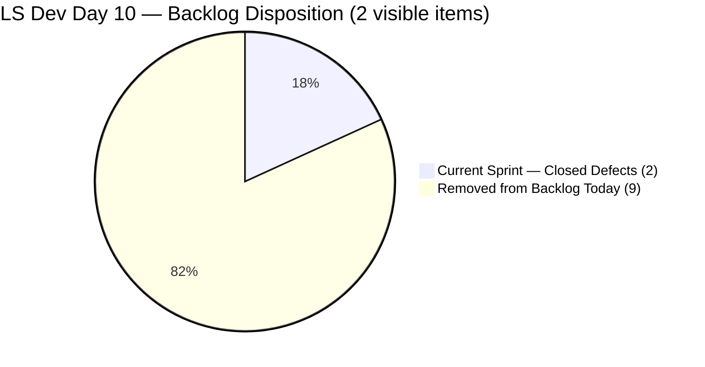
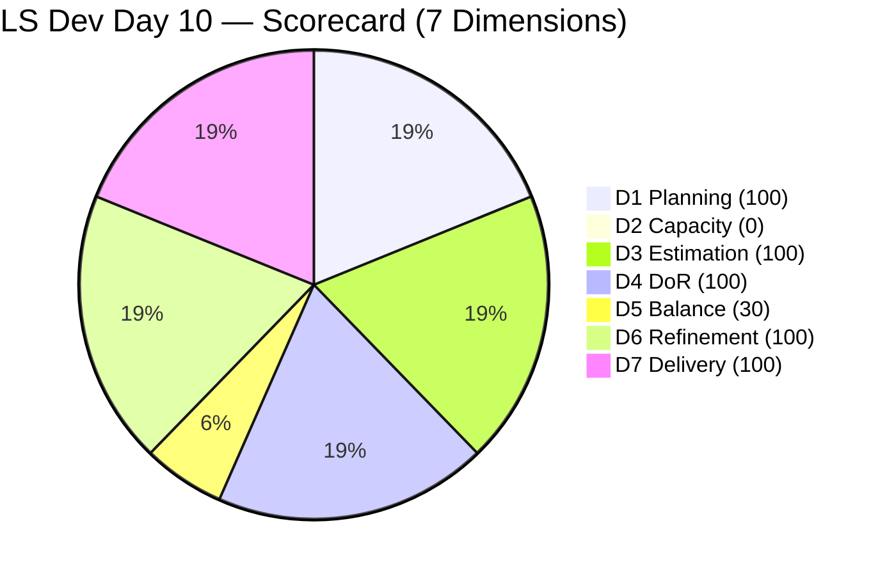

# SAFe Audit Report — Life Style Help App

**Audit A50 | Iteration 7.3 (May 4 – May 17, 2026) | Day 10 of 14**

---

## 1. Audit Metadata

| Field | Value |
|---|---|
| **Audit Date** | May 13, 2026, 09:00 UTC / 02:00 PDT (UTC−7) / 17:00 PHT (UTC+8) |
| **Auditor** | Claude Code (ADO SAFe Audit Agent) |
| **Workspace** | `ado_ls_dev` |
| **ADO Project** | Life Style Help App (`0f447778-7156-4451-ab21-27be3c4a5888`) |
| **Team** | Life Style Help App Team (`a2a805bc-0b30-4ef3-9a8a-b7f3081157a6`) |
| **Iteration** | Iteration 7.3 — May 4 to May 17, 2026 |
| **Iteration ID** | `fab36744-3e3e-4f89-a32c-76ec1d5c4dd0` |
| **Sprint Day** | Day 10 of 14 (71.4% elapsed) |
| **Days Remaining** | 4 |
| **Prior Audit** | AUDIT_20260512_0903.md (A49, Iter 7.3 Day 9, Overall 78.3 — Moderate Risk) |
| **Scoring Model** | ADO SAFe v1 (7-dimension rubric) |
| **Overall Score** | **75.7 / 100** |
| **Risk Band** | **Moderate Risk** (60–79.9) |

---

## 2. Executive Summary

Life Style Help App scores **75.7 / 100 (Moderate Risk)** on Day 10 — a **−2.6 decline from Day 9's 78.3**. This is caused by a single structural change detected in the ADO board today:

**Both team members' capacity was set to 0 as of today (May 13):**
- Samantha Babael: Development capacity changed from 1 pt/day → 0
- Luzmibel Paculanang: Testing capacity changed from 1 pt/day → 0

This drops **D2 from 100.0 to 0.0** (-14.3 pts to Overall), overcoming the otherwise stable scorecard.

**Additionally, all 9 previously open backlog items have been set to "Removed" state (May 13, 08:33 UTC):**
- #194082, #194084, #195229, #195373, #195716, #195727, #196380, #201334, #202789 — all Removed
- The open backlog is now empty; only the 2 closed Defects remain in the scoring universe
- This changes D1 from 18.2% (2/11) to **100.0%** (2/2), but at the cost of D2 = 0 and a backlog that is now essentially empty

**Net effect Day 10:**
- D1: 18.2 → 100.0 (+81.8) — all visible items are now current
- D2: 100.0 → 0.0 (−100.0) — capacity zeroed for all team members
- D6: 100.0 → 100.0 (0.0) — fresh items maintained
- Overall: 78.3 → 75.7 (−2.6)

This audit signals a **likely sprint close or team pause** — the combination of zeroed capacity and a cleared backlog suggests either a deliberate sprint wind-down or a team configuration reset before next sprint planning.

---

## 3. Previous Audit Delta

| Dimension | A49 (May 12, Day 9, 78.3) | A50 (May 13, Day 10, 75.7) | Delta | Driver |
|---|---|---|---|---|
| Iteration Planning | 18.2 | **100.0** | **+81.8** | 9 items removed from backlog; visible pool now = 2 (both in Iter 7.3) |
| Team Capacity | 100.0 | **0.0** | **−100.0** | Both Samantha and Luzmibel capacity set to 0 today |
| Estimation | 100.0 | **100.0** | 0.0 | 2/2 sprint items estimated — unchanged |
| DoR Compliance | 100.0 | **100.0** | 0.0 | 2/2 sprint items pass DoR — unchanged |
| Work Item Balance | 30.0 | **30.0** | 0.0 | No User Story in sprint; Defect-only — unchanged |
| Backlog Refinement | 100.0 | **100.0** | 0.0 | 2/2 fresh; 0 stale; 0 untouched |
| Delivery Predictability | 100.0 | **100.0** | 0.0 | 3/3 SP closed; locked at 100% |
| **Overall** | **78.3** | **75.7** | **−2.6** | D2 collapse (100→0) dominates; D1 gain (+81.8) partially offsets |

---

## 4. Current Iteration Snapshot

| Attribute | Value |
|---|---|
| **Iteration** | Iteration 7.3 |
| **Sprint Dates** | May 4 – May 17, 2026 (14 days) |
| **Sprint Day** | Day 10 of 14 (71.4% elapsed) |
| **Days Remaining** | 4 |
| **Backlog API Open Items** | **0** (all 9 previously open items set to Removed today) |
| **Confirmed Closed in Iter 7.3** | 2 (#203390, #203239) |
| **Total Visible** | **2** (both Closed) |
| **Current Sprint Items** | 2 (both Closed) |
| **Committed SP** | 3 SP |
| **Closed SP** | 3 SP (100%) |
| **Team Capacity** | Samantha: 0 Dev/day; Luzmibel: 0 Testing/day (both zeroed today) |
| **Sprint Status** | Effectively closed — no open scope, zero capacity configured |
| **Last Backlog Activity** | May 13, 08:33 UTC — mass Removed state applied to 9 items |

---

## 5. Work Item Analysis

### Iteration 7.3 — Sprint Items (2 items, both Closed — unchanged)

| ID | Title | Type | State | SP | Assignee | Closed | DoR |
|---|---|---|---|---|---|---|---|
| **203390** | Subscription Automatically Cancels at End of Binding Period | Defect | Closed | 2 | Samantha Babael | Day 2 (May 5) | Pass |
| **203239** | Investigate member emilienaess97@gmail.com | Defect | Closed | 1 | Samantha Babael | Day 3 (May 6) | Pass |

### Removed Items — Cleared from Backlog Today (May 13, 08:33 UTC)

| ID | Title | Type | Prior State | SP | Notes |
|---|---|---|---|---|---|
| 195716 | Hide "preferanser"/"allergier" in recipe card | User Story | Ready for Dev | 2 | Removed |
| 194082 | Customize the "Servings" Label | User Story | Ready for Dev | 1 | Removed |
| 194084 | Schedule Blog Post for Future Publication | User Story | Ready for Dev | 1 | Removed |
| 196380 | Default Pinned Post for New Users | User Story | Ready for Dev | 3 | Removed |
| 195727 | Meal time filter search text conflict | User Story | Ready for Dev | 2 | Removed |
| 195229 | Email Notification for Forum Posts | User Story | Grooming | 1 | Removed |
| 195373 | Lifestyle App Performance Optimization | Enabler | New | — | Removed |
| 201334 | Collaboration / Check and Replicate Raised Issues | Spike | New | — | Removed |
| 202789 | Lifestyle App — Customer CSAT Survey | Spike | New | — | Removed |

> All 9 items were simultaneously set to "Removed" at 08:33:26 UTC on May 13. This was a mass backlog cleanup action, not individual closures. "Removed" state in ADO indicates the items are explicitly excluded from active planning. They are not visible in the Stories and Deliverables backlog.

### Backlog Freshness Assessment (Day 10)

| Category | Count | Assessment |
|---|---|---|
| stale_180 (before Nov 13, 2025) | 0 | None |
| stale_90 (before Feb 12, 2026) | 0 | None |
| stale_45 (before Mar 29, 2026) | 0 | Both items closed May 5–6 |
| Fresh (within 45 days) | 2 | Both items: May 5–6 ✓ |

---

## 6. SAFe Compliance Scorecard

| Dimension | Score | Evidence | Notes |
|---|---|---|---|
| 1. Iteration Planning | 100.0 | 2 current / 2 visible = 100% | 9 previously open items Removed today; visible pool collapsed to 2 |
| 2. Team Capacity | 0.0 | 0/1 contributor with sprint work has capacity | Samantha capacity = 0 (was 1); Luzmibel capacity = 0 (was 1); both zeroed today |
| 3. Estimation | 100.0 | 2/2 sprint items have SP > 0 | #203390 = 2 SP; #203239 = 1 SP |
| 4. DoR Compliance | 100.0 | 2/2 pass Description + AC | Both Defects verified |
| 5. Work Item Balance | 30.0 | No User Story → −40; Defect 100% dominant → −30 | Base 100 − 40 − 30 = 30; unchanged structural penalty |
| 6. Backlog Refinement | 100.0 | 2/2 fresh (May 5–6); stale_90=0; stale_180=0; untouched=0 | Removed items excluded from scoring |
| 7. Delivery Predictability | 100.0 | 3/3 SP closed = 100% | Sprint delivered by Day 3; locked since |
| **Overall** | **75.7** | (100+0+100+100+30+100+100) / 7 = 530 / 7 | **Moderate Risk** (60–79.9) |

### Score Computation
```
D1 = 2 / 2  × 100 = 100.0    (all visible items are in current iteration)
D2 = 0 / 1  × 100 = 0.0      (Samantha has sprint items but 0 capacity configured)
D3 = 2 / 2  × 100 = 100.0
D4 = 2 / 2  × 100 = 100.0
D5 = 100 − 40 − 30 = 30.0    (no US → −40; Defect 100% dominant → −30)
D6 = 100.0 − 0    = 100.0    (2/2 fresh; 0 untouched; Removed items excluded)
D7 = 3 / 3  × 100 = 100.0

Overall = (100 + 0 + 100 + 100 + 30 + 100 + 100) / 7 = 530 / 7 = 75.71 → 75.7
```

---

## 7. Dimension Findings

### D1 — Iteration Planning: 100.0 (Artificial — backlog cleared)
```
visible_root_backlog_items   = 2 (9 items Removed today; 2 Closed remain)
current_iteration_root_items = 2 (both in Iter 7.3)
D1 = (2 / 2) × 100 = 100.0
```
**Important context:** D1 = 100% because the backlog was cleared, not because planning is strong. The removal of 9 items (7 User Stories, 1 Enabler, 1 Spike = 9–10 SP of ready work) from the planning pool represents an unusual mid-sprint action. This is the first time in the A50-audit series that D1 has reached 100%, and it is driven by backlog reduction rather than sprint commitment.

### D2 — Team Capacity: 0.0 (Critical — both members zeroed)
```
contributors_with_current_work    = 1 (Samantha Babael — both closed sprint items)
contributors_with_capacity        = 0 (Samantha capacity = 0 as of today)
D2 = 0 / 1 × 100 = 0.0
```
Both Samantha Babael and Luzmibel Paculanang had their ADO capacity set to 0 today (May 13). This is the first D2 = 0 score in this team's audit series. The timing (Day 10 of 14, after sprint scope was closed on Day 3) suggests either a scheduled sprint wind-down, team availability change, or configuration reset for next sprint planning.

**D2 impact on Overall:** D2 dropping from 100 to 0 removes 14.3 pts from Overall (100/7). This single change drops the team from Moderate Risk (78.3) to Moderate Risk (75.7).

### D3 — Estimation: 100.0 ✅
Both sprint items are estimated. No new items to estimate.

### D4 — DoR Compliance: 100.0 ✅
Both items verified. #203390 (Subscription Cancellation) and #203239 (Member Investigation) have compliant Description and Acceptance Criteria.

### D5 — Work Item Balance: 30.0 (Structural — unchanged)
```
User Story present: None → −40 penalty
Defect: 2/2 = 100% > 60% → −30 penalty
D5 = 100 − 40 − 30 = 30.0
```
The -40 US-absent penalty cannot be resolved in the current sprint as there are no open sprint items. This penalty will persist until the next sprint planning session commits User Stories.

### D6 — Backlog Refinement: 100.0 ✅
```
visible_root_backlog_items = 2 (9 Removed items excluded)
fresh_visible_root_items   = 2 (May 5–6, within 45-day window)
stale_90: 0 → no penalty
stale_180: 0 → no penalty
untouched_current_items: 0 (both sprint items closed during sprint)
D6 = 100.0
```
Removed items are excluded from backlog freshness scoring — they are no longer in the active planning view. The 2 remaining items (both Closed) are fresh.

### D7 — Delivery Predictability: 100.0 ✅ (on committed scope)
```
committed_story_points = 3
closed_story_points    = 3
D7 = (3 / 3) × 100 = 100.0
```
Sprint delivered 100% of committed scope by Day 3. D7 locked for 7 consecutive days. No new commitments were made during Days 4–10.

---

## 8. Risks and Bottlenecks





> Note: D2 plotted as 1 to maintain chart visibility.

| Risk | Severity | Status | Action |
|---|---|---|---|
| **D2 = 0.0 — both team members' capacity zeroed** | **Critical** | Both Samantha and Luzmibel at 0 pts/day | Determine if this is a sprint wind-down or data entry error; restore capacity if team continues |
| **9 User Stories Removed from backlog** | **High** | 9 items (~10 SP) permanently removed — recovery requires recreating or restoring | Audit removals: were they intentional or a data entry error? Consider using Closed/De-committed status instead |
| **Sprint idle since Day 3 (7 full days)** | High | No new scope committed; no active work since Day 3 | Address at next sprint planning: commit 8–12 SP User Stories before Day 1 |
| **D5 = 30.0 — no User Stories in sprint** | High | Persistent across entire Iter 7.3 | Next sprint: enforce User Story commitment at planning |
| **D2 penalty persists** | Moderate | Score 75.7 < 78.3 threshold that held for 9 days | Restore capacity in ADO if team is active; or document sprint close |
| **No Iteration Goal defined** | Low | Persistent gap | Define at next sprint planning |
| **No PI Objectives linked** | Low | Persistent gap | Coordinate with portfolio team |

---

## 9. Prioritized Recommendations

1. **[Immediate] Verify whether the capacity zeroing and item removals are intentional** — If the team is closing out Iter 7.3 early (sprint wind-down), document this in ADO and prepare for Iter 7.4 planning. If this is a data entry error, restore capacity to the correct values (Samantha: 1 Dev/day; Luzmibel: 1 Testing/day).

2. **[Immediate] Audit the 9 Removed items** — Nine User Stories and non-story items removed in a single batch action at 08:33 UTC is unusual. Determine: (a) Were these items intentionally closed out? (b) Should they have been marked "Deferred to Iter 7.4" instead? (c) If the removals were unintentional, restore them. Removing items instead of deferring them loses traceability.

3. **[Next Sprint Planning — before Day 1] Enforce User Story commitment** — This is the **seventh consecutive sprint** where no User Story was committed from the ready backlog. The pattern is structural: Defects dominate, User Stories queue indefinitely. Enforce a sprint planning rule: minimum 8 SP of User Stories must be committed before Iter 7.4 Day 1.

4. **[Next Sprint Planning] Rebuild the ready backlog** — The 9 removed items represented the only prepared User Stories ready for development. If removed permanently, the team must replenish the backlog with new or recreated User Story items before Iter 7.4 planning.

5. **[Next Sprint] Restore and configure team capacity** — Set Samantha's Development capacity and Luzmibel's Testing capacity before Iter 7.4 begins. Without capacity configuration, D2 will score 0 regardless of actual team activity.

6. **[Next Sprint] Define Iteration Goal** — Suggested for Iter 7.4: "Deliver the first 8–12 story points of User Story scope from the Lifestyle App feature backlog, focusing on UI and performance features."

---

## 10. Evidence Gaps and Limitations

| Gap | Impact | Mitigation |
|---|---|---|
| Reason for mass Removed state (9 items, May 13 08:33 UTC) | **High** | No ADO comment or history shows intent; may be planning change or data error — requires manual confirmation |
| Reason for capacity zeroing (Samantha + Luzmibel, May 13) | **High** | ADO capacity API only shows current values; history not available — requires manual confirmation |
| Sanny Paul Geraldino and Ike Yana status | Low | Neither confirmed on active team; items were Removed before assignment could be resolved |
| PI Objectives linkage | Low | Not queried; known persistent gap |
| Iteration Goal field | Low | Not surfaced via ADO standard API; recommend manual check |

---

## 11. Score Trend — Iteration 7.3

| Day | Score | Band | Key Event |
|---|---|---|---|
| Day 1 | 78.3 | Moderate | Sprint launched; only Defects committed |
| Day 2 | 78.3 | Moderate | #203390 closed (2 SP) |
| Day 3 | 78.3 | Moderate | #203239 closed (1 SP); D7 = 100% |
| Day 4–9 | 78.3 | Moderate | Sprint idle — no commitments, no changes |
| **Day 10** | **75.7** | **Moderate** | **9 items Removed; capacity zeroed; D1 18.2→100; D2 100→0; net −2.6** |

> Score drops to 75.7 — the first score decline in the audit series after 9 consecutive days at 78.3. The decline is driven entirely by the D2 collapse from team capacity changes, partially offset by the paradoxical D1 gain from the backlog clearing. This is the lowest score for this team since Audit A1. With 4 days remaining and zero open scope and zero capacity, no further score improvement is possible without restoring team configuration or committing new work.

---

*Report generated: May 13, 2026, 09:00 UTC | Workspace: ado_ls_dev | Auditor: Claude Code ADO SAFe Audit Agent*
