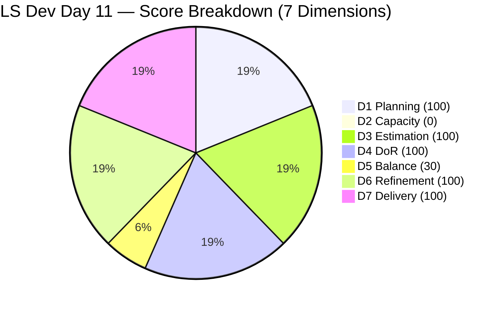
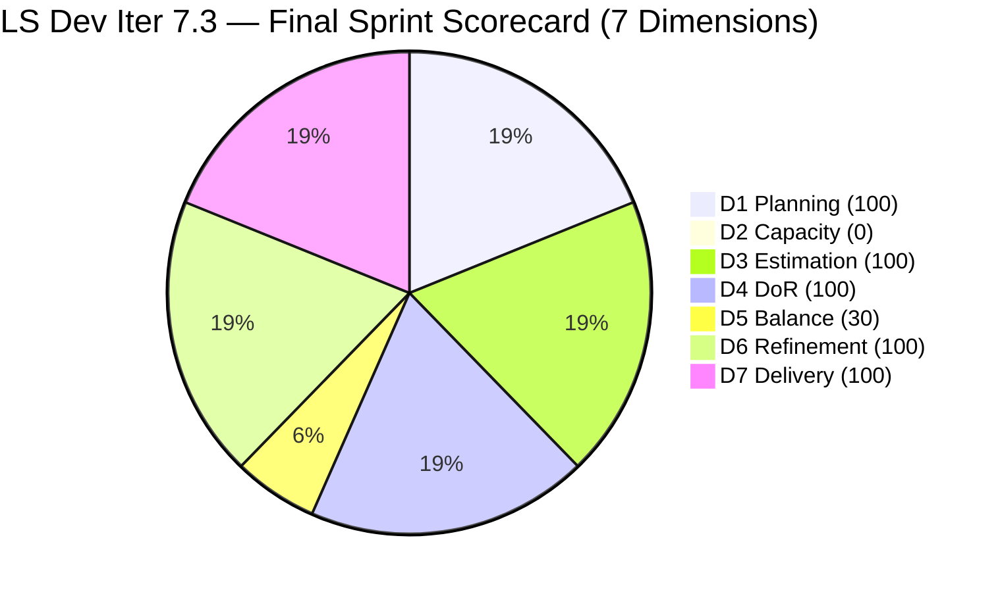

# ADO SAFe Iteration Audit — Life Style Help App Team

**Audit A51 | Iteration 7.3 (May 4 – May 17, 2026) | Day 11 of 14**

---

## 1. Audit Metadata

| Field | Value |
|---|---|
| **Audit Date** | May 14, 2026, 09:00 CDT / 14:00 UTC / 22:00 PHT (UTC+8) |
| **Auditor** | Claude Code (ADO SAFe Audit Agent) |
| **Workspace** | `ado_ls_dev` |
| **ADO Project** | Life Style Help App (`0f447778-7156-4451-ab21-27be3c4a5888`) |
| **Team** | Life Style Help App Team (`a2a805bc-0b30-4ef3-9a8a-b7f3081157a6`) |
| **Iteration** | Iteration 7.3 — May 4 to May 17, 2026 |
| **Iteration ID** | `fab36744-3e3e-4f89-a32c-76ec1d5c4dd0` |
| **Sprint Day** | Day 11 of 14 (78.6% elapsed) |
| **Days Remaining** | 3 |
| **Prior Audit** | AUDIT_20260513_0900.md (A50, Iter 7.3 Day 10, Overall 75.7 — Moderate Risk) |
| **Scoring Model** | ADO SAFe v1 (7-dimension rubric) |
| **Overall Score** | **75.7 / 100** |
| **Risk Band** | **Moderate Risk** (60–79.9) |

---

## 2. Executive Summary

Life Style Help App Team scores **75.7 / 100 (Moderate Risk)** on Day 11 — **unchanged from Day 10's 75.7**. No new work items, no capacity changes, no closures, and no backlog modifications were detected since the May 13 audit.

The team remains in the same configuration established on Day 10:
- Both team members (Samantha Babael, Luzmibel Paculanang) have capacity set to **0 pts/day** in ADO — unchanged from May 13.
- Backlog API returns **0 open items** — unchanged from May 13 (9 items were mass-removed at 08:33 UTC on May 13).
- 2 Defect items remain Closed in Iter 7.3: #203390 and #203239 (closed Day 2–3).

The sprint is effectively at rest with 3 days remaining and no evidence of new activity. The score is mathematically locked unless capacity is restored, new items are committed to Iter 7.3, or the team configuration is explicitly updated.

**Day 11 status:**
- 2/2 sprint items Closed (3 SP of 3 committed, 100%)
- 0 open items; 0 Active items
- Capacity: 0 pts/day for both team members
- Backlog: empty (9 items removed May 13)
- Score anchored at 75.7 by structural D2 = 0 and D5 = 30

---

## 3. Previous Audit Delta

| Dimension | A50 (May 13, Day 10, 75.7) | A51 (May 14, Day 11, 75.7) | Delta | Driver |
|---|---|---|---|---|
| Iteration Planning | 100.0 | **100.0** | 0.0 | 2 current / 2 visible — no change |
| Team Capacity | 0.0 | **0.0** | 0.0 | Both Samantha and Luzmibel still at 0 pts/day |
| Estimation | 100.0 | **100.0** | 0.0 | 2/2 sprint items estimated — unchanged |
| DoR Compliance | 100.0 | **100.0** | 0.0 | 2/2 sprint items pass DoR — unchanged |
| Work Item Balance | 30.0 | **30.0** | 0.0 | No User Story → −40; Defect 100% → −30 — unchanged |
| Backlog Refinement | 100.0 | **100.0** | 0.0 | 2/2 fresh; 0 stale; 0 untouched — unchanged |
| Delivery Predictability | 100.0 | **100.0** | 0.0 | 3/3 SP closed — unchanged since Day 3 |
| **Overall** | **75.7** | **75.7** | **0.0** | No ADO activity detected; all dimensions static |

---

## 4. Current Iteration Snapshot

| Attribute | Value |
|---|---|
| **Iteration** | Iteration 7.3 |
| **Sprint Dates** | May 4 – May 17, 2026 (14 days) |
| **Sprint Day** | Day 11 of 14 (78.6% elapsed) |
| **Days Remaining** | 3 |
| **Backlog API Open Items** | **0** (mass removal on May 13 08:33 UTC — unchanged) |
| **Confirmed Closed in Iter 7.3** | 2 (#203390, #203239) |
| **Total Visible** | **2** (both Closed) |
| **Current Sprint Items** | 2 (both Closed) |
| **Committed SP** | 3 SP |
| **Closed SP** | 3 SP (100%) |
| **Team Capacity** | Samantha: 0 Dev/day; Luzmibel: 0 Testing/day — unchanged from May 13 |
| **Sprint Status** | At rest — no open scope, zero capacity, no new activity since Day 10 |
| **Last Known Backlog Activity** | May 13, 08:33 UTC — mass Removed state applied to 9 items |

---

## 5. Work Item Analysis

### Iteration 7.3 — Sprint Items (2 items, both Closed — unchanged)

| ID | Title | Type | State | SP | Assignee | Closed | DoR |
|---|---|---|---|---|---|---|---|
| **203390** | Subscription Automatically Cancels at End of Binding Period | Defect | Closed | 2 | Samantha Babael | Day 2 (May 5) | Pass |
| **203239** | Investigate member emilienaess97@gmail.com | Defect | Closed | 1 | Samantha Babael | Day 3 (May 6) | Pass |

### Removed Items — Still absent from backlog (removed May 13 08:33 UTC)

| ID | Title | Type | Prior State | SP |
|---|---|---|---|---|
| 195716 | Hide "preferanser"/"allergier" in recipe card | User Story | Ready for Dev | 2 |
| 194082 | Customize the "Servings" Label | User Story | Ready for Dev | 1 |
| 194084 | Schedule Blog Post for Future Publication | User Story | Ready for Dev | 1 |
| 196380 | Default Pinned Post for New Users | User Story | Ready for Dev | 3 |
| 195727 | Meal time filter search text conflict | User Story | Ready for Dev | 2 |
| 195229 | Email Notification for Forum Posts | User Story | Grooming | 1 |
| 195373 | Lifestyle App Performance Optimization | Enabler | New | — |
| 201334 | Collaboration / Check and Replicate Raised Issues | Spike | New | — |
| 202789 | Lifestyle App — Customer CSAT Survey | Spike | New | — |

> These 9 items remain in Removed state. No restoration or new items detected in the May 14 audit. If the removals were intentional, the team should prepare fresh User Story items for Iter 7.4 planning before May 18.

### Backlog Freshness Assessment (Day 11)

| Category | Count | Assessment |
|---|---|---|
| stale_180 (before Nov 14, 2025) | 0 | None |
| stale_90 (before Feb 14, 2026) | 0 | None |
| Fresh (within 45 days) | 2 | Both closed May 5–6 ✓ |

---

## 6. SAFe Compliance Scorecard

| Dimension | Score | Evidence | Notes |
|---|---|---|---|
| 1. Iteration Planning | 100.0 | 2 current / 2 visible = 100% | 9 previously open items remain Removed; visible pool = 2 |
| 2. Team Capacity | 0.0 | 0/1 contributor with sprint work has capacity | Samantha capacity = 0 (unchanged); Luzmibel capacity = 0 (unchanged) |
| 3. Estimation | 100.0 | 2/2 sprint items have SP > 0 | #203390 = 2 SP; #203239 = 1 SP |
| 4. DoR Compliance | 100.0 | 2/2 pass Description + AC | Both Defects verified |
| 5. Work Item Balance | 30.0 | No User Story → −40; Defect 100% dominant → −30 | Base 100 − 40 − 30 = 30; structural |
| 6. Backlog Refinement | 100.0 | 2/2 fresh (May 5–6); stale_90=0; stale_180=0; untouched=0 | Removed items excluded from scoring |
| 7. Delivery Predictability | 100.0 | 3/3 SP closed = 100% | Sprint delivered by Day 3; locked since |
| **Overall** | **75.7** | (100+0+100+100+30+100+100) / 7 = 530 / 7 | **Moderate Risk** (60–79.9) |

### Score Computation
```
D1 = 2 / 2  × 100 = 100.0    (all visible items are in current iteration)
D2 = 0 / 1  × 100 = 0.0      (Samantha has sprint items but 0 capacity configured — day 2)
D3 = 2 / 2  × 100 = 100.0
D4 = 2 / 2  × 100 = 100.0
D5 = 100 − 40 − 30 = 30.0    (no US → −40; Defect 100% dominant → −30)
D6 = 100.0 − 0    = 100.0    (2/2 fresh; 0 untouched; Removed items excluded)
D7 = 3 / 3  × 100 = 100.0

Overall = (100 + 0 + 100 + 100 + 30 + 100 + 100) / 7 = 530 / 7 = 75.71 → 75.7
```

---

## 7. Dimension Findings

### D1 — Iteration Planning: 100.0 (Artificial — backlog cleared)
```
visible_root_backlog_items   = 2 (9 items Removed May 13; 2 Closed remain)
current_iteration_root_items = 2 (both in Iter 7.3)
D1 = (2 / 2) × 100 = 100.0
```
D1 = 100% reflects a collapsed backlog, not strong planning discipline. The 9 removed User Stories represented the full ready pipeline. No recovery actions detected since May 13.

### D2 — Team Capacity: 0.0 (Critical — second consecutive day)
```
contributors_with_current_work    = 1 (Samantha Babael)
contributors_with_capacity        = 0 (Samantha capacity = 0; Luzmibel capacity = 0)
D2 = 0 / 1 × 100 = 0.0
```
Both team members remain at 0 pts/day capacity — second consecutive audit at this state (first detected May 13). Without correction before Iter 7.4, D2 will score 0 for the next sprint as well. This single dimension costs the team 14.3 points on the Overall score.

### D3 — Estimation: 100.0 ✅
Both sprint items remain estimated. No new items to estimate.

### D4 — DoR Compliance: 100.0 ✅
Both items verified unchanged.

### D5 — Work Item Balance: 30.0 (Structural — unchanged)
```
User Story present: None → −40 penalty
Defect: 2/2 = 100% > 60% → −30 penalty
D5 = 100 − 40 − 30 = 30.0
```
The -40 US-absent penalty cannot be resolved before sprint end. This will persist into Iter 7.4 unless User Stories are committed at planning.

### D6 — Backlog Refinement: 100.0 ✅
```
visible_root_backlog_items = 2 (Removed items excluded per rubric)
fresh_visible_root_items   = 2 (closed May 5–6, within 45-day window)
stale_90: 0 → no penalty
stale_180: 0 → no penalty
untouched_current_items: 0
D6 = 100.0
```

### D7 — Delivery Predictability: 100.0 ✅ (locked)
```
committed_story_points = 3
closed_story_points    = 3
D7 = (3 / 3) × 100 = 100.0
```
Sprint delivered 100% of committed scope by Day 3. D7 locked for 8 consecutive days. No new commitments.

---

## 8. Risks and Bottlenecks



> Note: D2 plotted as 1 to maintain chart visibility. Actual score = 0.

| Risk | Severity | Status | Action |
|---|---|---|---|
| **D2 = 0 — both team members capacity zeroed (Day 2)** | **Critical** | Samantha and Luzmibel at 0 pts/day for 2 consecutive days | Verify intent before Iter 7.4 planning; restore capacity if team continues |
| **9 User Stories remain Removed from backlog (Day 2)** | **Critical** | No ready pipeline exists for Iter 7.4 | Audit removals; restore or recreate at least 8 SP of User Stories before May 18 |
| **Sprint idle since Day 3 (8 full days)** | High | No new scope committed; zero open work | Must address at Iter 7.4 planning: commit minimum 8 SP User Stories |
| **D5 = 30 — no User Stories in sprint** | High | Structural; 8 consecutive sprints without US commitment | Enforce User Story minimum at Iter 7.4 planning |
| **3 days remain; no recovery possible** | Moderate | Score 75.7 locked without new commitments or capacity restoration | No improvement path exists within current sprint |
| **No Iteration Goal defined** | Low | Persistent gap | Define at Iter 7.4 planning |
| **No PI Objectives linked** | Low | Persistent gap | Coordinate with portfolio team |

---

## 9. Prioritized Recommendations

1. **[Before Iter 7.4 Day 1 — May 18] Restore team capacity** — Set Samantha Babael's Development capacity and Luzmibel Paculanang's Testing capacity to their working values before Iter 7.4 begins. Zero capacity will score D2 = 0 for the next sprint, guaranteeing a Moderate Risk floor. If the team has genuinely changed availability, update the workspace CLAUDE.md accordingly and document in this workspace's Project Exceptions.

2. **[Before Iter 7.4 Day 1] Rebuild the ready backlog** — The 9 removed items represented the only prepared User Stories. Determine whether to restore the removed items (change state from Removed back to Ready for Dev) or create new User Story items. Target: at least 8–12 SP of User Stories ready for Iter 7.4 planning.

3. **[Before Iter 7.4 Day 1] Conduct sprint retrospective / planning** — The team committed only 3 SP (2 Defects) to Iter 7.3 and has been idle since Day 3. A structured planning session before May 18 is essential. Action: schedule Iter 7.4 planning no later than May 17 (sprint end day).

4. **[Iter 7.4 Planning] Enforce User Story commitment** — This is the **eighth consecutive sprint** without a User Story commitment. Enforce a hard planning rule: minimum 8 SP of User Stories before Iter 7.4 Day 1 starts. No exceptions without documented project exception.

5. **[Iter 7.4 Planning] Define Iteration Goal** — Suggested: "Deliver the first 8–12 story points of User Story scope from the Lifestyle App feature backlog, prioritizing UI features (recipe card, post scheduling, search filters)."

6. **[Within this sprint / Iter 7.4 prep] Determine intent behind the mass Removed action** — The simultaneous removal of 9 items on May 13 at 08:33 UTC with no ADO comment remains unexplained. If items were removed in error, restore them now. If intentional, document the rationale in the workspace CLAUDE.md.

---

## 10. Evidence Gaps and Limitations

| Gap | Impact | Mitigation |
|---|---|---|
| Reason for mass Removed state (9 items, May 13 08:33 UTC) — still unresolved | **High** | No ADO comment or history shows intent; requires manual verification with team |
| Reason for capacity zeroing (Samantha + Luzmibel, May 13) — second day | **High** | ADO capacity API only shows current values; manual confirmation required |
| No new ADO activity to analyze on Day 11 | Moderate | Score and findings are fully consistent with Day 10; no fabricated conclusions drawn |
| PI Objectives linkage | Low | Not queried; known persistent gap |
| Iteration Goal field | Low | Not surfaced via ADO standard API; recommend manual check |

---

## 11. Score Trend — Iteration 7.3



> D2 plotted as 1 to maintain visibility. Actual = 0.

| Day | Score | Band | Key Event |
|---|---|---|---|
| Day 1 | 78.3 | Moderate | Sprint launched; only Defects committed |
| Day 2 | 78.3 | Moderate | #203390 closed (2 SP) |
| Day 3 | 78.3 | Moderate | #203239 closed (1 SP); D7 = 100% |
| Day 4–9 | 78.3 | Moderate | Sprint idle — no commitments, no changes |
| Day 10 | 75.7 | Moderate | 9 items Removed; capacity zeroed; D1 18.2→100; D2 100→0 |
| **Day 11** | **75.7** | **Moderate** | **No change — all dimensions static; capacity still 0; backlog still empty** |

> Score remains locked at 75.7 for the second consecutive day. With 3 days remaining and zero open scope, no scoring improvement is possible within Iter 7.3 without new commitments or capacity restoration. The team's focus must shift entirely to Iter 7.4 preparation: restore capacity, rebuild the User Story backlog, and plan at least 8 SP of feature work before May 18.

---

*Report generated: May 14, 2026, 09:00 CDT | Workspace: ado_ls_dev | Auditor: Claude Code ADO SAFe Audit Agent*
