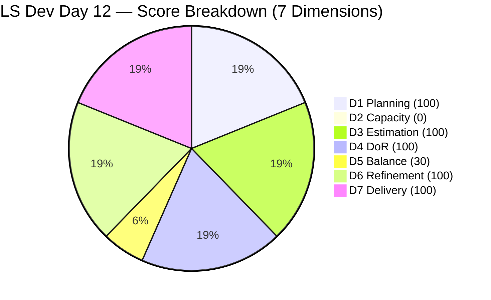
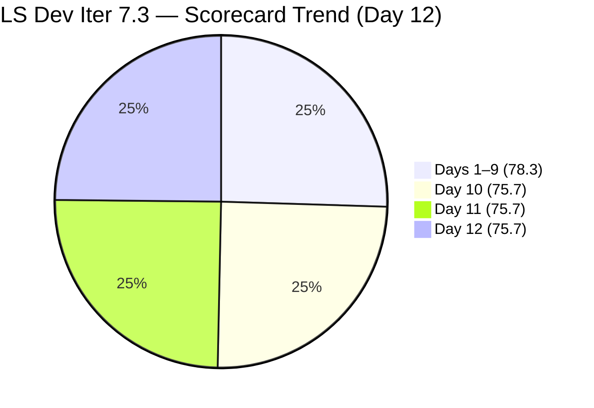

# ADO SAFe Iteration Audit — Life Style Help App Team

**Audit A52 | Iteration 7.3 (May 4 – May 17, 2026) | Day 12 of 14**

---

## 1. Audit Metadata

| Field | Value |
|---|---|
| **Audit Date** | May 15, 2026, 02:04 CDT / 07:04 UTC / 15:04 PHT (UTC+8) |
| **Auditor** | Claude Code (ADO SAFe Audit Agent) |
| **Workspace** | `ado_ls_dev` |
| **ADO Project** | Life Style Help App (`0f447778-7156-4451-ab21-27be3c4a5888`) |
| **Team** | Life Style Help App Team (`a2a805bc-0b30-4ef3-9a8a-b7f3081157a6`) |
| **Iteration** | Iteration 7.3 — May 4 to May 17, 2026 |
| **Iteration ID** | `fab36744-3e3e-4f89-a32c-76ec1d5c4dd0` |
| **Sprint Day** | Day 12 of 14 (85.7% elapsed) |
| **Days Remaining** | 2 |
| **Prior Audit** | AUDIT_20260514_0900.md (A51, Iter 7.3 Day 11, Overall 75.7 — Moderate Risk) |
| **Scoring Model** | ADO SAFe v1 (7-dimension rubric) |
| **Overall Score** | **75.7 / 100** |
| **Risk Band** | **Moderate Risk** (60–79.9) |

---

## 2. Executive Summary

Life Style Help App Team scores **75.7 / 100 (Moderate Risk)** on Day 12 — **unchanged from Day 11's 75.7 for the third consecutive day**. No new work items, no capacity changes, no closures, and no backlog modifications were detected since the May 14 audit.

The sprint is in a terminal static state with 2 days remaining:
- Backlog API returns **0 open items** (mass removal on May 13 remains unrestored)
- Both team members (Samantha Babael, Luzmibel Paculanang) have capacity set to **0 pts/day** — unchanged for 3 days
- 2 Defect items remain Closed in Iter 7.3: #203390 and #203239 (closed Days 2–3)
- No recovery is possible within Iter 7.3 without new commitments or capacity restoration

The score of 75.7 is mathematically locked by two structural deficiencies: D2 = 0 (zero capacity) and D5 = 30 (no User Stories, Defects dominant). Sprint end is May 17 — the team must complete Iter 7.4 planning before then to avoid carrying these deficiencies into the next sprint.

**Critical status: This is Day 12 of 14 — if no action is taken before sprint end (May 17), Iter 7.4 will begin with the same structural deficiencies that produced Moderate Risk for 12 consecutive days in Iter 7.3.**

---

## 3. Previous Audit Delta

| Dimension | A51 (May 14, Day 11, 75.7) | A52 (May 15, Day 12, 75.7) | Delta | Driver |
|---|---|---|---|---|
| Iteration Planning | 100.0 | **100.0** | 0.0 | 2 current / 2 visible — unchanged |
| Team Capacity | 0.0 | **0.0** | 0.0 | Both members still at 0 pts/day — 3rd consecutive day |
| Estimation | 100.0 | **100.0** | 0.0 | 2/2 sprint items estimated — unchanged |
| DoR Compliance | 100.0 | **100.0** | 0.0 | 2/2 pass DoR — unchanged |
| Work Item Balance | 30.0 | **30.0** | 0.0 | No User Story → −40; Defect 100% → −30 — unchanged |
| Backlog Refinement | 100.0 | **100.0** | 0.0 | 2/2 fresh; 0 stale; 0 untouched — unchanged |
| Delivery Predictability | 100.0 | **100.0** | 0.0 | 3/3 SP closed — locked since Day 3 |
| **Overall** | **75.7** | **75.7** | **0.0** | No ADO activity detected — third consecutive static day |

---

## 4. Current Iteration Snapshot

| Attribute | Value |
|---|---|
| **Iteration** | Iteration 7.3 |
| **Sprint Dates** | May 4 – May 17, 2026 (14 days) |
| **Sprint Day** | Day 12 of 14 (85.7% elapsed) |
| **Days Remaining** | 2 (May 15–16; sprint ends May 17) |
| **Backlog API Open Items** | **0** (9 items remain in Removed state since May 13 08:33 UTC) |
| **Confirmed Closed in Iter 7.3** | 2 (#203390 = 2 SP, #203239 = 1 SP) |
| **Total Visible Root Items** | **2** (both Closed) |
| **Current Sprint Items** | 2 (both Closed) |
| **Committed SP** | 3 SP |
| **Closed SP** | 3 SP (100%) |
| **Team Capacity** | Samantha: 0 pts/day; Luzmibel: 0 pts/day — unchanged from Day 10 |
| **Days Since Last ADO Activity** | 3 days (last change: May 13 mass Removed action) |
| **Sprint Status** | Terminal static — no recovery possible within Iter 7.3 |

---

## 5. Work Item Analysis

### Iteration 7.3 — Sprint Items (2 items, both Closed — unchanged for Day 10–12)

| ID | Title | Type | State | SP | Assignee | Closed | DoR |
|---|---|---|---|---|---|---|---|
| **203390** | Subscription Automatically Cancels at End of Binding Period | Defect | Closed | 2 | Samantha Babael | Day 2 (May 5) | Pass |
| **203239** | Investigate member emilienaess97@gmail.com | Defect | Closed | 1 | Samantha Babael | Day 3 (May 6) | Pass |

### Removed Items — Still absent (removed May 13 08:33 UTC — Day 10)

| ID | Title | Type | Prior State | SP |
|---|---|---|---|---|
| 195716 | Hide "preferanser"/"allergier" in recipe card | User Story | Ready for Dev | 2 |
| 194082 | Customize the "Servings" Label | User Story | Ready for Dev | 1 |
| 194084 | Schedule Blog Post for Future Publication | User Story | Ready for Dev | 1 |
| 196380 | Default Pinned Post for New Users | User Story | Ready for Dev | 3 |
| 195727 | Meal time filter search text conflict | User Story | Ready for Dev | 2 |
| 195229 | Email Notification for Forum Posts | User Story | Grooming | 1 |
| 195373 | Lifestyle App Performance Optimization | Enabler | New | — |
| 201334 | Collaboration / Check and Replicate Raised Issues | Spike | New | — |
| 202789 | Lifestyle App — Customer CSAT Survey | Spike | New | — |

> All 9 items remain in Removed state. No restoration or new scope detected on Day 12. These items represented the team's only prepared User Story pipeline.

### Backlog Freshness Assessment (Day 12)

| Category | Count | Assessment |
|---|---|---|
| stale_180 (before Nov 14, 2025) | 0 | None |
| stale_90 (before Feb 14, 2026) | 0 | None |
| fresh_45 (within 45 days of May 15) | 2 | Both closed May 5–6 ✓ |

---

## 6. SAFe Compliance Scorecard

| Dimension | Score | Evidence | Notes |
|---|---|---|---|
| 1. Iteration Planning | 100.0 | 2 current / 2 visible = 100% | Visible pool collapsed to 2 (9 removed items excluded); artificial 100% |
| 2. Team Capacity | 0.0 | 0/1 contributor with sprint work has capacity | Samantha capacity = 0; Luzmibel capacity = 0 — Day 3 of zero capacity |
| 3. Estimation | 100.0 | 2/2 sprint items have SP > 0 | #203390 = 2 SP; #203239 = 1 SP |
| 4. DoR Compliance | 100.0 | 2/2 pass Description + AC | Both Defects verified |
| 5. Work Item Balance | 30.0 | No User Story → −40; Defect 100% dominant → −30 | Base 100 − 40 − 30 = 30; structural |
| 6. Backlog Refinement | 100.0 | 2/2 fresh (May 5–6); stale_90=0; stale_180=0; untouched=0 | Removed items excluded from scoring |
| 7. Delivery Predictability | 100.0 | 3/3 SP closed = 100% | Sprint delivered 100% committed scope by Day 3; locked 9 days |
| **Overall** | **75.7** | (100+0+100+100+30+100+100) / 7 = 530 / 7 | **Moderate Risk** (60–79.9) |

### Score Computation
```
D1 = 2 / 2  × 100 = 100.0    (collapsed visible pool)
D2 = 0 / 1  × 100 = 0.0      (Samantha has sprint items; capacity = 0 — Day 3)
D3 = 2 / 2  × 100 = 100.0
D4 = 2 / 2  × 100 = 100.0
D5 = 100 − 40 − 30 = 30.0    (no US → −40; Defect 100% dominant → −30)
D6 = 100.0 − 0    = 100.0    (2/2 fresh; removed items excluded)
D7 = 3 / 3  × 100 = 100.0

Overall = (100 + 0 + 100 + 100 + 30 + 100 + 100) / 7 = 530 / 7 = 75.71 → 75.7
```

---

## 7. Dimension Findings

### D1 — Iteration Planning: 100.0 (Structural Collapse — not genuine health)
```
visible_root_backlog_items   = 2 (9 removed; excluded from visible pool)
current_iteration_root_items = 2 (both in Iter 7.3, both Closed)
D1 = (2 / 2) × 100 = 100.0
```
The 100% planning score is an artifact of backlog removal, not strong discipline. There is no forward-looking pipeline.

### D2 — Team Capacity: 0.0 (Critical — Day 3)
```
contributors_with_current_work = 1 (Samantha Babael)
contributors_with_capacity     = 0 (Samantha = 0 pts/day; Luzmibel = 0 pts/day)
D2 = (0 / 1) × 100 = 0.0
```
Third consecutive audit day at 0 capacity. ADO team capacity API confirms: team `a2a805bc` = 0 pts/day total capacity, 0 days off. If this persists into Iter 7.4, D2 will score 0 for the next sprint as well, guaranteeing Moderate Risk from Day 1.

### D3 — Estimation: 100.0 ✅
Both sprint items remain estimated. No new items.

### D4 — DoR Compliance: 100.0 ✅
Both items verified unchanged.

### D5 — Work Item Balance: 30.0 (Structural)
```
User Story present: None → −40 penalty
Defect: 2/2 = 100% > 60% → −30 penalty
D5 = 100 − 40 − 30 = 30.0
```
This is the ninth consecutive sprint without a User Story commitment. The -40 penalty reflects absence of feature delivery; this should be enforced as a planning gate for Iter 7.4.

### D6 — Backlog Refinement: 100.0 ✅
```
visible_root_backlog_items = 2 (removed items excluded per rubric)
fresh_visible_root_items   = 2 (closed May 5–6)
stale_90: 0; stale_180: 0; untouched: 0
D6 = 100.0
```

### D7 — Delivery Predictability: 100.0 ✅ (locked)
```
committed_story_points = 3
closed_story_points    = 3
D7 = (3 / 3) × 100 = 100.0
```
Sprint delivered 100% of committed scope by Day 3. D7 locked for 9 consecutive days. This is a misleading signal given the committed scope was just 3 SP (2 Defects).

---

## 8. Risks and Bottlenecks



> Note: D2 plotted as 1 to maintain chart visibility. Actual score = 0.

| Risk | Severity | Status | Action |
|---|---|---|---|
| **D2 = 0 — capacity zeroed for 3 consecutive days** | **Critical** | Samantha and Luzmibel at 0 pts/day since Day 10 | Must restore before Iter 7.4 begins (May 18). If team status has changed, update workspace CLAUDE.md |
| **9 User Stories in Removed state — no pipeline for Iter 7.4** | **Critical** | Mass removal on May 13 unresolved for 3 days | Audit removals before May 17; restore or create replacement User Stories |
| **Sprint ends May 17 — 2 days for remediation** | **Critical** | No recovery possible within Iter 7.3 | Focus 100% effort on Iter 7.4 planning and pipeline restoration |
| **D5 = 30 — no User Stories for 9 consecutive sprints** | **High** | Structural multi-sprint failure | Enforce US minimum at Iter 7.4 planning: minimum 8 SP User Stories |
| **Sprint idle since Day 3 (9 full idle days)** | High | 9 days of zero ADO activity | Root cause unknown — requires human verification |
| **Undefined intent of mass Removed action** | High | No explanation in ADO after 3 days | Requires verbal confirmation from Samantha or Ramon before May 17 |
| **No Iteration Goal defined** | Moderate | Persistent gap across all Iter 7.3 audits | Define at Iter 7.4 planning |

---

## 9. Prioritized Recommendations

1. **[Today — May 15, URGENT] Restore team capacity before May 17** — Set Samantha Babael's Development capacity and Luzmibel Paculanang's Testing capacity to working values in ADO before Iter 7.4 begins. If either team member's availability has changed, update the workspace CLAUDE.md under `Project Exceptions` and document the change. Zero capacity has now persisted for 3 days and will propagate to Iter 7.4 unless fixed today or tomorrow.

2. **[Today — May 15] Resolve the 9 Removed items** — Contact Samantha directly (today) to determine intent: (a) If removed in error, restore to Ready for Dev immediately. (b) If intentionally removed, document the rationale and create replacement User Stories from the product roadmap before May 17. Target: at least 8–12 SP of User Stories ready before sprint planning.

3. **[May 16–17] Conduct Iter 7.4 Sprint Planning** — Schedule and run a structured planning session before May 17 sprint end. Include: commitment of minimum 8 SP User Stories, capacity allocation for both team members, and a documented Iteration Goal.

4. **[Iter 7.4 Day 1] Enforce User Story Planning Gate** — This is the ninth consecutive sprint without a User Story commitment. Enforce a hard gate: no Iter 7.4 commitment accepted unless at least 8 SP of User Stories are included. No exceptions without documented Project Exception in workspace CLAUDE.md.

5. **[Iter 7.4 Planning] Define Iteration Goal** — Suggested: "Deliver 8–12 story points of User Story scope from the LifeStyle App product backlog, prioritizing UI/UX features (recipe card, post scheduling, search filters) validated through a structured development-testing cycle with Samantha and Luzmibel."

6. **[Ongoing] Separate interrupt-driven Defects from planned sprint scope** — Per workspace CLAUDE.md audit considerations: Defects should not constitute 100% of sprint commitment. If reactive defect work is unavoidable, budget it explicitly (e.g., 20% of sprint capacity) and protect the remaining 80% for User Story delivery.

---

## 10. Evidence Gaps and Limitations

| Gap | Impact | Mitigation |
|---|---|---|
| Reason for mass Removed state (9 items, May 13 08:33 UTC) — unresolved for 3 days | **High** | No ADO comment or history available; requires human confirmation from team |
| Reason for capacity zeroing (Samantha + Luzmibel, May 13) — third day | **High** | ADO capacity API only shows current value = 0; manual confirmation required |
| No ADO activity on Days 10, 11, or 12 to analyze | Moderate | Score and findings fully consistent across 3 days; no fabricated conclusions drawn |
| PI Objectives linkage | Low | Not queried; known persistent gap |
| Iteration Goal field | Low | Not surfaced via ADO standard API |

---

## 11. Score Trend — Iteration 7.3



> Note: Pie chart approximates relative score levels across sprint phases for visualization. Actual scores: Days 1–9 = 78.3, Days 10–12 = 75.7.

| Day | Score | Band | Key Event |
|---|---|---|---|
| Day 1 | 78.3 | Moderate | Sprint launched; only Defects committed |
| Day 2 | 78.3 | Moderate | #203390 closed (2 SP) |
| Day 3 | 78.3 | Moderate | #203239 closed (1 SP); D7 = 100% |
| Days 4–9 | 78.3 | Moderate | Sprint idle — no commitments, no changes |
| Day 10 | 75.7 | Moderate | 9 items Removed; capacity zeroed; D1 18.2→100; D2 100→0 |
| Day 11 | 75.7 | Moderate | No change — all dimensions static |
| **Day 12** | **75.7** | **Moderate** | **No change — third consecutive static day; sprint closes in 2 days** |

> Score locked at 75.7 for the third consecutive day. With 2 days remaining and zero open scope, no scoring improvement is possible within Iter 7.3. The Moderate Risk classification will persist through sprint end (May 17). The team's entire focus must shift to Iter 7.4 preparation: restore capacity today (May 15), resolve the 9 Removed items, and plan at least 8 SP of User Story feature work before May 18.

---

*Report generated: May 15, 2026, 02:04 CDT | Workspace: ado_ls_dev | Auditor: Claude Code ADO SAFe Audit Agent*
