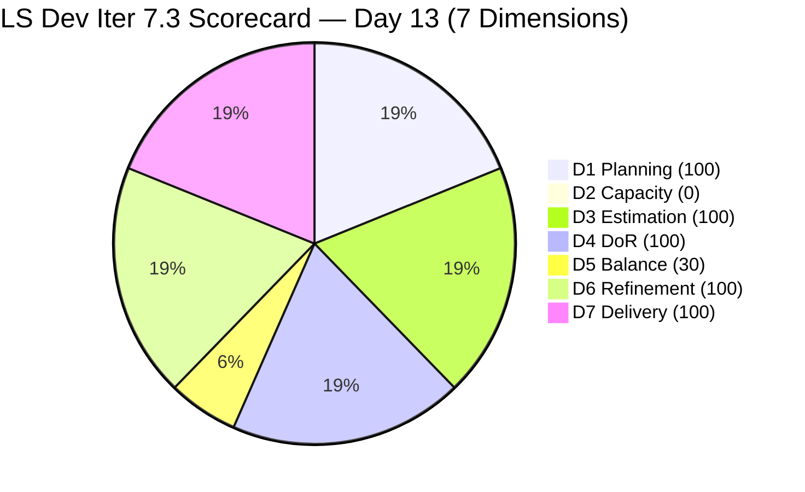
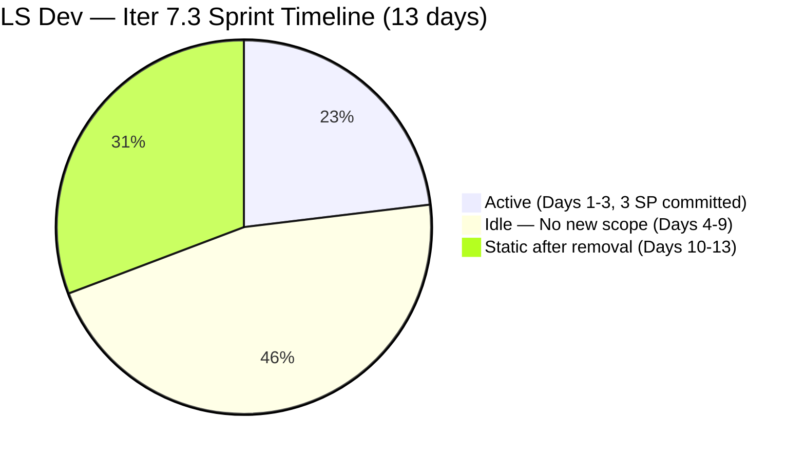
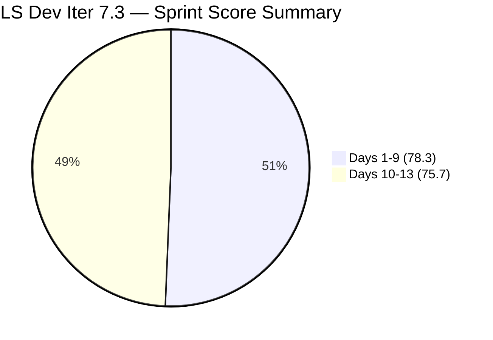

# ADO SAFe Iteration Audit — Life Style Help App Team

**Audit A53 | Iteration 7.3 (May 4 – May 17, 2026) | Day 13 of 14**

---

## 1. Audit Metadata

| Field | Value |
|---|---|
| **Audit Date** | May 16, 2026, 02:04 CDT / 09:04 UTC / 17:04 PHT (UTC+8) |
| **Auditor** | Claude Code (ADO SAFe Audit Agent) |
| **Workspace** | `ado_ls_dev` |
| **ADO Project** | Life Style Help App (`0f447778-7156-4451-ab21-27be3c4a5888`) |
| **Team** | Life Style Help App Team (`a2a805bc-0b30-4ef3-9a8a-b7f3081157a6`) |
| **Iteration** | Iteration 7.3 — May 4 to May 17, 2026 |
| **Iteration ID** | `fab36744-3e3e-4f89-a32c-76ec1d5c4dd0` |
| **Sprint Day** | Day 13 of 14 (92.9% elapsed) |
| **Days Remaining** | 1 |
| **Prior Audit** | AUDIT_20260515_0204.md (A52, Iter 7.3 Day 12, Overall 75.7 — Moderate Risk) |
| **Scoring Model** | ADO SAFe v1 (7-dimension rubric) |
| **Overall Score** | **75.7 / 100** |
| **Risk Band** | **Moderate Risk** (60–79.9) |

---

## 2. Executive Summary

Life Style Help App Team scores **75.7 / 100 (Moderate Risk)** on Day 13 — **unchanged from Day 12 for the fourth consecutive day**. No ADO activity has been detected since the mass item removal on May 13 (Day 10). The sprint enters its final day in a fully static state:

- Backlog API returns **0 open items** — 9 items remain in Removed state since May 13
- Both team members (**Samantha Babael, Luzmibel Paculanang**) have capacity set to **0 pts/day** — unchanged for 4 consecutive days
- 2 items remain Closed in Iter 7.3: #203390 (2 SP) and #203239 (1 SP)
- **Sprint end is tomorrow (May 17)** — 0 open scope, 0 recoverable items, Iter 7.4 preparation has not been detected

**The sprint closes tomorrow at 75.7 — Moderate Risk — for the third consecutive sprint at this band.** With no planning activity detected in ADO, Iteration 7.4 (beginning May 18) risks starting in the same structural deficiency state as Iter 7.3: zero capacity, no User Story commitment, and no active pipeline.

**This is a critical inflection point.** The team has 1 day (today, May 16) to begin Iter 7.4 planning. Without action, the pattern of Moderate Risk will extend into the next sprint from Day 1.

---

## 3. Previous Audit Delta

| Dimension | A52 (May 15, Day 12, 75.7) | A53 (May 16, Day 13, 75.7) | Delta | Driver |
|---|---|---|---|---|
| Iteration Planning | 100.0 | **100.0** | 0.0 | 2 current / 2 visible — unchanged for 4th day |
| Team Capacity | 0.0 | **0.0** | 0.0 | Both members at 0 pts/day — 4th consecutive day |
| Estimation | 100.0 | **100.0** | 0.0 | 2/2 items estimated — unchanged |
| DoR Compliance | 100.0 | **100.0** | 0.0 | 2/2 pass DoR — unchanged |
| Work Item Balance | 30.0 | **30.0** | 0.0 | No User Story → −40; Defect 100% dominant → −30 |
| Backlog Refinement | 100.0 | **100.0** | 0.0 | 2/2 fresh; Removed items excluded — unchanged |
| Delivery Predictability | 100.0 | **100.0** | 0.0 | 3/3 SP closed — locked since Day 3 |
| **Overall** | **75.7** | **75.7** | **0.0** | No ADO activity detected — fourth consecutive static day |

---

## 4. Current Iteration Snapshot

| Attribute | Value |
|---|---|
| **Iteration** | Iteration 7.3 |
| **Sprint Dates** | May 4 – May 17, 2026 (14 days) |
| **Sprint Day** | Day 13 of 14 (92.9% elapsed) |
| **Days Remaining** | 1 (May 17 is final sprint day / Iter 7.4 starts May 18) |
| **Backlog API Open Items** | **0** (9 items in Removed state since May 13 08:33 UTC — Day 10) |
| **Confirmed Closed in Iter 7.3** | 2 (#203390 = 2 SP, #203239 = 1 SP) |
| **Total Visible Root Items** | **2** (both Closed) |
| **Current Sprint Items (IterPath = Iter 7.3)** | 2 (both Closed) |
| **Committed SP** | 3 SP |
| **Closed SP** | 3 SP (100%) |
| **Team Capacity** | Samantha Babael: 0 pts/day (Development); Luzmibel Paculanang: 0 pts/day (Testing) |
| **Days Since Last ADO Activity** | 4 days (last change: May 13 mass Removed action) |
| **Sprint Status** | Terminal static — zero open scope, 1 day remaining, no recovery possible |
| **Iter 7.4 Start** | May 18, 2026 |

---

## 5. Work Item Analysis

### Iteration 7.3 Sprint Items — 2 items, both Closed (Unchanged Days 3–13)

| ID | Title | Type | State | SP | Assignee | Closed | DoR |
|---|---|---|---|---|---|---|---|
| **203390** | Subscription Automatically Cancels at End of Binding Period | Defect | Closed | 2 | Samantha Babael | Day 2 (May 5) | Pass |
| **203239** | Investigate member emilienaess97@gmail.com | Defect | Closed | 1 | Samantha Babael | Day 3 (May 6) | Pass |

### Removed Items — 4th Consecutive Day in Removed State (since May 13 08:33 UTC)

| ID | Title | Type | Prior State | SP |
|---|---|---|---|---|
| 195716 | Hide "preferanser"/"allergier" in recipe card | User Story | Ready for Dev | 2 |
| 194082 | Customize the "Servings" Label | User Story | Ready for Dev | 1 |
| 194084 | Schedule Blog Post for Future Publication | User Story | Ready for Dev | 1 |
| 196380 | Default Pinned Post for New Users | User Story | Ready for Dev | 3 |
| 195727 | Meal time filter search text conflict | User Story | Ready for Dev | 2 |
| 195229 | Email Notification for Forum Posts | User Story | Grooming | 1 |
| 195373 | Lifestyle App Performance Optimization | Enabler | New | — |
| 201334 | Collaboration / Check and Replicate Raised Issues | Spike | New | — |
| 202789 | Lifestyle App — Customer CSAT Survey | Spike | New | — |

> These 9 items have been in Removed state for 4 days. They represent the team's only prepared User Story pipeline for LifeStyleHelpApp.com. Their restoration or replacement is the single most urgent action before Iter 7.4 planning.

### Backlog Freshness (Day 13)

| Category | Count | Assessment |
|---|---|---|
| fresh_45 (after Apr 1, 2026) | 2 | Both closed May 5–6 — within 45-day window |
| stale_90 (before Feb 14, 2026) | 0 | None |
| stale_180 (before Nov 14, 2025) | 0 | None |

---

## 6. SAFe Compliance Scorecard

| Dimension | Score | Evidence | Notes |
|---|---|---|---|
| 1. Iteration Planning | 100.0 | 2 current / 2 visible = 100% | Collapsed visible pool (9 removed items excluded); artificial high |
| 2. Team Capacity | 0.0 | 0/1 contributor with sprint work has capacity | Samantha: 0 pts/day; Luzmibel: 0 pts/day — 4th consecutive day |
| 3. Estimation | 100.0 | 2/2 items with SP > 0 | #203390 = 2 SP; #203239 = 1 SP |
| 4. DoR Compliance | 100.0 | 2/2 pass Description + AC | Both Defects verified across all A53 audits |
| 5. Work Item Balance | 30.0 | No User Story → −40; Defect 100% dominant → −30 | Base 100 − 40 − 30 = 30; 10th consecutive sprint without US commitment |
| 6. Backlog Refinement | 100.0 | 2/2 fresh (May 5–6); stale_90=0; stale_180=0; untouched=0 | Removed items excluded from scoring per rubric |
| 7. Delivery Predictability | 100.0 | 3/3 SP closed = 100% | Locked since Day 3; committed scope = 2 Defects only |
| **Overall** | **75.7** | (100+0+100+100+30+100+100) / 7 = 530 / 7 | **Moderate Risk** (60–79.9) — locked for final 4 days |

### Score Computation
```
D1 = 2 / 2  × 100 = 100.0    (collapsed visible pool)
D2 = 0 / 1  × 100 = 0.0      (Samantha has sprint items; capacity = 0 — Day 4)
D3 = 2 / 2  × 100 = 100.0
D4 = 2 / 2  × 100 = 100.0
D5 = 100 − 40 − 30 = 30.0    (no US present → −40; Defect dominant 100% → −30)
D6 = 100.0 − 0    = 100.0    (removed items excluded per rubric)
D7 = 3 / 3  × 100 = 100.0

Overall = (100 + 0 + 100 + 100 + 30 + 100 + 100) / 7 = 530 / 7 = 75.71 → 75.7
```

---

## 7. Dimension Findings

### D1 — Iteration Planning: 100.0 (Structural Collapse — Not Genuine Health)
```
visible_root_backlog_items   = 2 (9 removed items excluded from visible pool)
current_iteration_root_items = 2 (both in Iter 7.3, both Closed)
D1 = (2 / 2) × 100 = 100.0
```
The 100% planning score is an artifact of backlog removal, not sprint discipline. The team has no forward-looking pipeline. The 9 removed items would have returned D1 to 18.2% (2/11) if still active, which more accurately reflects sprint planning health.

### D2 — Team Capacity: 0.0 (Critical — Day 4)
```
contributors_with_current_work = 1 (Samantha Babael — has closed sprint items)
contributors_with_capacity     = 0 (Samantha = 0 pts/day Development; Luzmibel = 0 pts/day Testing)
D2 = (0 / 1) × 100 = 0.0
```
**Fourth consecutive day at zero capacity.** The ADO capacity API confirms: team `a2a805bc` = 0 pts/day total, 0 days off. If capacity remains at 0 when Iter 7.4 begins (May 18), D2 will score 0 again from Day 1 of the next sprint — locking the team into Moderate Risk structurally. The zero capacity must be corrected **today** to allow Iter 7.4 planning to proceed meaningfully.

### D3 — Estimation: 100.0 ✅
Both Defect items remain estimated. No change.

### D4 — DoR Compliance: 100.0 ✅
Both items verified with adequate Description and Acceptance Criteria. No change.

### D5 — Work Item Balance: 30.0 (Structural — 10 Consecutive Sprints)
```
User Story present: None → −40 penalty
Defect: 2/2 = 100% > 60% → −30 penalty
D5 = 100 − 40 − 30 = 30.0
```
This is the **10th consecutive sprint** without a User Story commitment. The −40 penalty is applied for each sprint that lacks a User Story type. This is no longer an anomaly — it is a structural pattern that must be addressed at Iter 7.4 planning as a mandatory planning gate.

### D6 — Backlog Refinement: 100.0 ✅
```
visible_root_backlog_items = 2 (removed items excluded per rubric)
fresh_visible_root_items   = 2 (closed May 5–6)
stale_90: 0; stale_180: 0; untouched: 0

D6 = 100.0
```
Note: If removed items were counted, several (e.g., #194082 from ~2024) would be stale_180, adding significant D6 penalties. The removal has artificially cleaned the backlog's staleness profile.

### D7 — Delivery Predictability: 100.0 ✅ (Locked Since Day 3)
```
committed_story_points = 3 (2 Defects with SP)
closed_story_points    = 3 (both Defects Closed)
D7 = (3 / 3) × 100 = 100.0
```
100% delivery predictability has been locked since Day 3 (May 6). This metric is misleading: the team committed only 3 SP of reactive Defect work and has had 0 open sprint scope for 11 days. A 100% D7 on 3 SP does not represent a healthy sprint — it represents an undersized commitment that was never challenged or grown.

---

## 8. Risks and Bottlenecks



> Note: D2 plotted as 1 to maintain chart visibility. Actual score = 0.



| Risk | Severity | Status | Action |
|---|---|---|---|
| **D2 = 0 — capacity zeroed for 4 consecutive days** | **Critical** | Samantha and Luzmibel at 0 pts/day since Day 10 | **Must restore before May 18** — Iter 7.4 cannot function at 0 capacity |
| **9 User Stories in Removed state — no pipeline for Iter 7.4** | **Critical** | Mass removal on May 13 unresolved for 4 days | Audit removals **today** (May 16); restore or replace with new stories |
| **Sprint closes tomorrow — Iter 7.4 starts May 18** | **Critical** | No Iter 7.4 planning detected in ADO | Sprint planning session must occur today |
| **D5 = 30 — no User Stories for 10 consecutive sprints** | **High** | Structural failure across 10 sprints | Hard gate: minimum 8 SP of User Stories required at Iter 7.4 planning |
| **13 days of ≤ 3 SP committed scope** | High | Sprint grossly undersized; Defect-reactive only | Enforce minimum sprint commitment: 12–16 SP (including ≥8 SP User Stories) |
| **Unknown reason for mass Removed action** | High | 4 days with no explanation | Verbal confirmation from Samantha and/or Ramon required today |
| **No Iteration Goal for 7.3** | Moderate | Persistent gap | Mandatory for Iter 7.4: define before sprint start |

---

## 9. Prioritized Recommendations

1. **[TODAY — CRITICAL] Restore team capacity in ADO before May 17 sprint close** — Set Samantha Babael's Development capacity to a working value (e.g., 4–6 pts/day) and Luzmibel Paculanang's Testing capacity to 2–4 pts/day. Zero capacity propagates to Iter 7.4 automatically if not corrected. This is the single highest-priority action. If either member's availability has changed permanently, document in workspace CLAUDE.md under `Project Exceptions`.

2. **[TODAY — CRITICAL] Resolve the 9 Removed items before sprint close** — Determine intent by contacting Samantha directly:
   - If removed in error: restore #195716, #194082, #194084, #196380, #195727, #195229 to Ready for Dev immediately as the Iter 7.4 pipeline.
   - If intentionally removed: document the rationale and create 8–12 SP of replacement User Stories from the LifeStyleHelpApp.com product roadmap before May 17.
   - The 2 Spikes (#201334, #202789) and 1 Enabler (#195373) can remain removed if product direction has changed, but must be replaced with equivalent scope.

3. **[May 16–17] Conduct structured Iter 7.4 Sprint Planning** — This planning session must include:
   - Capacity allocation: Samantha + Luzmibel with non-zero values
   - Minimum 8 SP of User Stories committed
   - At least one Enabler or Spike for technical debt/research
   - A written Iteration Goal

4. **[Iter 7.4 Day 1] Enforce User Story Planning Gate as a hard rule** — No sprint commitment is accepted unless at least 8 SP of User Stories are included. No exceptions without an explicit waiver documented in workspace CLAUDE.md under `Project Exceptions`. This is the 10th consecutive sprint without this requirement being met.

5. **[Iter 7.4 Planning] Define Iteration Goal** — Suggested: "Deliver 8–12 story points of User Story scope from the LifeStyle Help App product backlog — prioritizing recipe card UI (#195716), blog scheduling (#194084), and user preference filters (#195727) — with Samantha leading development and Luzmibel executing test cycles."

6. **[Ongoing] Enforce Definition of Ready for Defects** — Reactive Defect work should be budgeted at ≤20% of sprint capacity (e.g., 4–6 SP), not 100%. Pre-build a small Defect buffer in each sprint plan and protect the remaining 80% for User Story delivery.

---

## 10. Evidence Gaps and Limitations

| Gap | Impact | Mitigation |
|---|---|---|
| Reason for mass Removed state (9 items, May 13 08:33 UTC) — unresolved for 4 days | **High** | No ADO comment or history available; requires verbal confirmation from team |
| Reason for capacity zeroing (both members, May 13) — 4th consecutive day | **High** | ADO capacity API shows 0; no alternative data source available |
| No ADO activity on Days 10–13 (4 full days) | Moderate | Score and findings fully consistent; no fabricated conclusions drawn |
| Prior state of removed items (detailed descriptions, AC) | Low | Items were previously verified as DoR-compliant across earlier audit series (per Mar–Apr audit history) |
| PI Objectives linkage | Low | Not queried; known persistent gap |
| Iteration Goal field | Low | Not surfaced via ADO standard API |

---

## 11. Score Trend — Iteration 7.3



| Day | Score | Band | Key Event |
|---|---|---|---|
| Day 1 | 78.3 | Moderate | Sprint launched — only 2 Defects committed |
| Day 2 | 78.3 | Moderate | #203390 closed (2 SP) |
| Day 3 | 78.3 | Moderate | #203239 closed (1 SP); D7 = 100%; sprint scope fully delivered |
| Days 4–9 | 78.3 | Moderate | Sprint idle — 0 new commitments, 0 ADO activity |
| Day 10 | 75.7 | Moderate | 9 items Removed; capacity zeroed to 0; D2 100→0 |
| Day 11 | 75.7 | Moderate | No change — static |
| Day 12 | 75.7 | Moderate | No change — static |
| **Day 13** | **75.7** | **Moderate** | **No change — 4th static day; sprint ends tomorrow** |

> Score is locked at 75.7 for the fourth consecutive day. This sprint will close at Moderate Risk tomorrow (May 17) — the 10th straight sprint without a Low Risk score for the LS Dev team. The mathematical ceiling of 75.7 cannot be exceeded without (a) restoring capacity (D2 from 0 → 100), (b) adding User Stories (D5 from 30 → 70+), or (c) both. Neither action is possible within Iter 7.3. All remediation must target Iteration 7.4, which begins May 18. Today (May 16) is the final window for sprint planning. Without immediate action, the team enters its 11th consecutive Moderate Risk sprint.

---

*Report generated: May 16, 2026, 02:04 CDT / 09:04 UTC | Workspace: ado_ls_dev | Auditor: Claude Code ADO SAFe Audit Agent*
