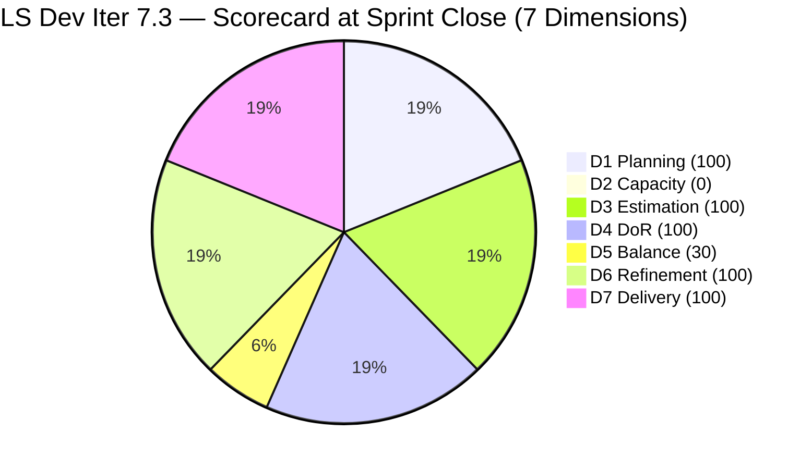
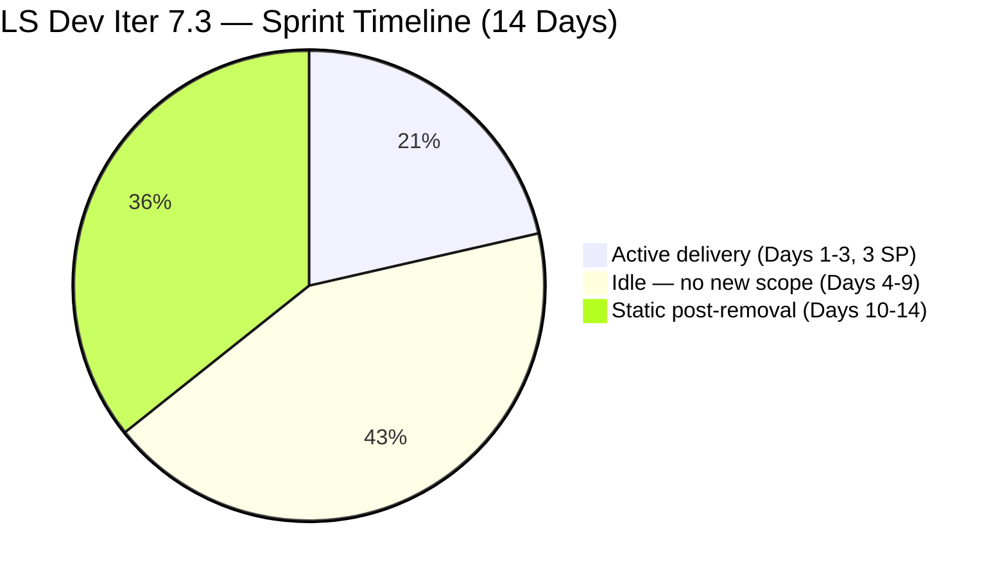
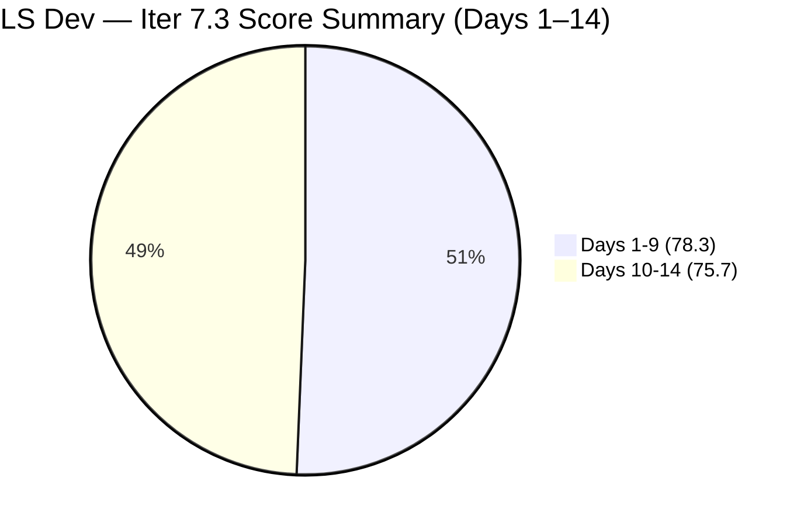

# ADO SAFe Iteration Audit — Life Style Help App Team

**Audit A54 | Iteration 7.3 (May 4 – May 17, 2026) | Day 14 of 14 — Sprint Close**

---

## 1. Audit Metadata

| Field | Value |
|---|---|
| **Audit Date** | May 17, 2026, 02:09 CDT / 09:09 UTC / 17:09 PHT (UTC+8) |
| **Auditor** | Claude Code (ADO SAFe Audit Agent) |
| **Workspace** | `ado_ls_dev` |
| **ADO Project** | Life Style Help App (`0f447778-7156-4451-ab21-27be3c4a5888`) |
| **Team** | Life Style Help App Team (`a2a805bc-0b30-4ef3-9a8a-b7f3081157a6`) |
| **Iteration** | Iteration 7.3 — May 4 to May 17, 2026 |
| **Iteration ID** | `fab36744-3e3e-4f89-a32c-76ec1d5c4dd0` |
| **Sprint Day** | Day 14 of 14 (100% elapsed — Sprint Close Day) |
| **Days Remaining** | 0 |
| **Prior Audit** | AUDIT_20260516_0204.md (A53, Iter 7.3 Day 13, Overall 75.7 — Moderate Risk) |
| **Scoring Model** | ADO SAFe v1 (7-dimension rubric) |
| **Overall Score** | **75.7 / 100** |
| **Risk Band** | **Moderate Risk** (60–79.9) |

---

## 2. Executive Summary

Life Style Help App Team closes Iteration 7.3 at **75.7 / 100 (Moderate Risk)** — unchanged for the **fifth consecutive day and the official sprint-close score**. This is the **official sprint-close audit for Iter 7.3**. No ADO activity has occurred since Day 10 (May 13 mass Removed action).

**Sprint Close Final Tally:**
- **2 of 2 committed items Closed** (100% item closure rate on committed scope)
- **3 of 3 SP delivered** (100% delivery predictability on committed scope)
- **Team capacity: 0 pts/day** — both Samantha Babael and Luzmibel Paculanang at zero
- **9 items remain in Removed state** since Day 10 (May 13) — the team's only User Story pipeline
- **D2 = 0.0** — fifth consecutive day at zero capacity
- **D5 = 30.0** — eleventh consecutive sprint without a User Story commitment

This sprint was functionally over on Day 3 (May 6) when both committed Defects were Closed. The subsequent 11 days produced zero ADO activity beyond the mass removal on Day 10. Iteration 7.4 is presumed to start May 18, 2026. **No Iter 7.4 planning activity has been detected in ADO.** Without immediate action today, the team will enter Iteration 7.4 in the same structural state: zero capacity, zero User Stories, and zero committed scope.

The recommendations from audits A52–A53 have not been acted upon as of this close audit. The risk profile for Iter 7.4 is **Critical** if no corrective action occurs before its start.

---

## 3. Previous Audit Delta

| Dimension | A53 (May 16, Day 13, 75.7) | A54 (May 17, Day 14, 75.7) | Delta | Driver |
|---|---|---|---|---|
| Iteration Planning | 100.0 | **100.0** | 0.0 | 2 current / 2 visible — collapsed pool unchanged |
| Team Capacity | 0.0 | **0.0** | 0.0 | Both members at 0 pts/day — fifth consecutive day |
| Estimation | 100.0 | **100.0** | 0.0 | 2/2 items estimated — unchanged |
| DoR Compliance | 100.0 | **100.0** | 0.0 | 2/2 pass DoR — unchanged |
| Work Item Balance | 30.0 | **30.0** | 0.0 | No User Story → −40; Defect 100% dominant → −30 |
| Backlog Refinement | 100.0 | **100.0** | 0.0 | 2/2 fresh; removed items excluded — unchanged |
| Delivery Predictability | 100.0 | **100.0** | 0.0 | 3/3 SP closed — locked since Day 3 |
| **Overall** | **75.7** | **75.7** | **0.0** | No ADO activity detected — fifth consecutive static day |

The sprint closes with zero delta from Day 10. This is the longest static streak in the LS Dev audit series. The score has been locked at 75.7 since May 13 — a 5-day window in which the team had capacity and opportunity to begin Iter 7.4 planning and did not.

---

## 4. Current Iteration Snapshot

| Attribute | Value |
|---|---|
| **Iteration** | Iteration 7.3 |
| **Sprint Dates** | May 4 – May 17, 2026 (14 days) |
| **Sprint Day** | Day 14 of 14 — Sprint Close |
| **Days Remaining** | 0 |
| **Backlog API Open Items** | **0** (9 items remain in Removed state since May 13) |
| **Current Sprint Items (IterPath = Iter 7.3)** | **2** (both Closed) |
| **Total Visible Root Items** | **2** |
| **Committed SP** | 3 SP (2 Defects only) |
| **Closed SP** | 3 SP (100%) |
| **Days Since Last ADO Activity** | 5 days (last change: May 13 mass Removed action, 08:33 UTC) |
| **Team Capacity** | Samantha Babael: 0 pts/day; Luzmibel Paculanang: 0 pts/day |
| **Sprint Status** | CLOSED — 2/2 items delivered; 3/3 SP; structurally deficient |
| **Iter 7.4 Start** | May 18, 2026 (tomorrow) |

---

## 5. Work Item Analysis

### Iteration 7.3 Committed Items — 2 items, 3 SP (Final State)

| ID | Title | Type | State | SP | Assignee | Closed | DoR |
|---|---|---|---|---|---|---|---|
| **203390** | Subscription Automatically Cancels at End of Binding Period | Defect | Closed | 2 | Samantha Babael | Day 2 (May 5) | Pass |
| **203239** | Investigate member emilienaess97@gmail.com | Defect | Closed | 1 | Samantha Babael | Day 3 (May 6) | Pass |

Both items closed by Day 3 with no further sprint activity. Final state unchanged from Day 10.

### Removed Items — Still Removed (5 Days in Removed State)

| ID | Title | Type | Prior State | SP | Note |
|---|---|---|---|---|---|
| 195716 | Hide "preferanser"/"allergier" in recipe card | User Story | Ready for Dev | 2 | Ready pipeline — removed Day 10 |
| 194082 | Customize the "Servings" Label | User Story | Ready for Dev | 1 | Ready pipeline — removed Day 10 |
| 194084 | Schedule Blog Post for Future Publication | User Story | Ready for Dev | 1 | Ready pipeline — removed Day 10 |
| 196380 | Default Pinned Post for New Users | User Story | Ready for Dev | 3 | Ready pipeline — removed Day 10 |
| 195727 | Meal time filter search text conflict | User Story | Ready for Dev | 2 | Ready pipeline — removed Day 10 |
| 195229 | Email Notification for Forum Posts | User Story | Grooming | 1 | Partially ready — removed Day 10 |
| 195373 | Lifestyle App Performance Optimization | Enabler | New | — | Technical enabler — removed Day 10 |
| 201334 | Collaboration / Check and Replicate Issues | Spike | New | — | Research spike — removed Day 10 |
| 202789 | Lifestyle App — Customer CSAT Survey | Spike | New | — | Research spike — removed Day 10 |

All 9 items remain in Removed state. The 5 "Ready for Dev" User Stories (#195716, #194082, #194084, #196380, #195727) represent a prepared pipeline of 9 SP that has been inaccessible for 5 days. Restoration or deliberate replacement is required before Iter 7.4 commitment.

### Backlog Staleness Assessment (2 visible items)

| Category | Count | Assessment |
|---|---|---|
| fresh_45 (after Apr 2, 2026) | 2 | Both changed May 5–6 — within 45-day window |
| stale_90 (before Feb 15, 2026) | 0 | None |
| stale_180 (before Nov 17, 2025) | 0 | None |
| untouched_current_items (before May 4) | 0 | None |

Note: If removed items were re-counted, some (e.g., #194082, #194084 from 2024) would likely be stale_180, adding significant D6 penalties. The removal has artificially suppressed staleness risk in the score.

---

## 6. SAFe Compliance Scorecard

| Dimension | Score | Evidence | Notes |
|---|---|---|---|
| 1. Iteration Planning | 100.0 | 2 current / 2 visible = 100% | Collapsed visible pool (9 removed items excluded); D1 is artificially inflated |
| 2. Team Capacity | 0.0 | 0/1 contributor with sprint work has capacity | Samantha: 0 pts/day; Luzmibel: 0 pts/day — fifth consecutive day at zero |
| 3. Estimation | 100.0 | 2/2 items with SP > 0 | #203390 = 2 SP; #203239 = 1 SP |
| 4. DoR Compliance | 100.0 | 2/2 pass Description + AC | Both Defects have substantive descriptions and AC |
| 5. Work Item Balance | 30.0 | No User Story → −40; Defect 100% dominant → −30 | Base 100 − 40 − 30 = 30; **11th consecutive sprint without a User Story** |
| 6. Backlog Refinement | 100.0 | 2/2 fresh (May 5–6); stale_90=0; stale_180=0; untouched=0 | Removed items excluded per rubric; staleness risk masked |
| 7. Delivery Predictability | 100.0 | 3/3 SP closed = 100% | Committed scope was 2 Defects (3 SP) — delivered Day 3; 11 idle days follow |
| **Overall** | **75.7** | (100+0+100+100+30+100+100) / 7 = 530 / 7 | **Moderate Risk** (60–79.9) — closed at sprint-close value |

### Score Computation
```
D1 = 2 / 2  × 100 = 100.0   (collapsed visible pool — 9 removed items excluded)
D2 = 0 / 1  × 100 = 0.0     (Samantha has sprint items; capacity = 0)
D3 = 2 / 2  × 100 = 100.0
D4 = 2 / 2  × 100 = 100.0
D5 = 100 − 40 − 30 = 30.0   (no User Story → −40; Defect 100% → −30)
D6 = 100.0 − 0    = 100.0   (removed items excluded per rubric)
D7 = 3 / 3  × 100 = 100.0

Overall = (100 + 0 + 100 + 100 + 30 + 100 + 100) / 7 = 530 / 7 = 75.71 → 75.7
```

---

## 7. Dimension Findings

### D1 — Iteration Planning: 100.0 (Structural Collapse — Artificially Inflated)
```
visible_root_backlog_items   = 2 (9 removed items excluded)
current_iteration_root_items = 2 (both in Iter 7.3, both Closed)
D1 = (2 / 2) × 100 = 100.0
```
This 100% planning score is an artifact of backlog collapse, not sprint discipline. If the 9 removed items were counted (as they would be if not in Removed state), D1 = 2/11 = 18.2%. The scoring rubric correctly excludes Removed items from `visible_root_backlog_items`, but the team should understand the score inflation. The actual planning health of this sprint is severely impaired.

### D2 — Team Capacity: 0.0 (Critical — Day 5 Consecutive)
```
contributors_with_current_work = 1 (Samantha Babael — has two Closed sprint items)
contributors_with_capacity     = 0 (Samantha = 0 pts/day Development; Luzmibel = 0 pts/day Testing)
D2 = (0 / 1) × 100 = 0.0
```
**Fifth consecutive day at zero capacity.** The capacity API confirms both team members have been at 0 pts/day since Day 10 (May 13). Iteration 7.4 begins tomorrow (May 18). If capacity is not corrected before or during Iter 7.4 sprint planning, this team will score D2 = 0.0 from Day 1 of the next sprint — guaranteeing a Low Risk ceiling of approximately 75.7 (same as this sprint).

**The capacity must be restored today.** This is the highest-urgency corrective action and requires only an ADO sprint capacity update — a 5-minute task.

### D3 — Estimation: 100.0 ✅
Both Defect items correctly estimated at 2 SP and 1 SP respectively. The sizing is appropriate for Defect work. No change.

### D4 — DoR Compliance: 100.0 ✅
Both Defects carry substantive descriptions (customer scenario narratives) and Acceptance Criteria (expected system behavior). DoR compliance is genuine for the 2 items in scope.

### D5 — Work Item Balance: 30.0 (Structural — 11th Consecutive Sprint)
```
User Story present: None → −40 penalty
Defect share: 2/2 = 100% > 60% → −30 penalty
D5 = 100 − 40 − 30 = 30.0
```
This is the **11th consecutive sprint without a User Story commitment** for the LS Dev team. The −40 penalty for absence of User Stories is a hard structural deficit that cannot be remediated within a sprint — it must be addressed at planning. The team has been in Defect-reactive mode for the entire PI7 audit series. The LifeStyleHelpApp.com product is not receiving feature development.

### D6 — Backlog Refinement: 100.0 (Masked by Removal)
```
visible_root_backlog_items = 2 (removed items excluded per rubric)
fresh_visible_root_items   = 2 (both changed May 5–6, within 45-day window)
stale_90: 0; stale_180: 0; untouched: 0

D6 = 100.0
```
The score is technically correct per the rubric but does not reflect backlog health. The removal of 9 items — including User Stories that were last updated in 2024 — has suppressed what would otherwise be stale_180 penalties. When items are restored or replaced for Iter 7.4, D6 will need to be carefully monitored for backlog age.

### D7 — Delivery Predictability: 100.0 (Misleadingly High)
```
committed_story_points = 3
closed_story_points    = 3
D7 = (3 / 3) × 100 = 100.0
```
D7 has been locked at 100% since Day 3 (May 6) — 11 straight days. The 100% figure reflects delivery of a 3-SP reactive commitment, not a healthy sprint. A properly planned sprint for a 2-member development team should carry 14–20 SP of planned work. On that scale, the actual 3 SP delivered = 15–21% velocity, not 100%.

---

## 8. Risks and Bottlenecks



> Note: D2 plotted as 1 for chart visibility. Actual score = 0.



| Risk | Severity | Status | Action |
|---|---|---|---|
| **D2 = 0 — capacity zeroed for 5 consecutive days** | **Critical** | Both members at 0 pts/day; Iter 7.4 starts tomorrow | **RESTORE CAPACITY TODAY** — ADO sprint capacity update, 5 minutes |
| **9 User Stories in Removed state — no pipeline for Iter 7.4** | **Critical** | Mass removal May 13; 5 days unresolved | Audit removals today; restore or replace before Iter 7.4 commitment |
| **Iter 7.4 starts tomorrow — no planning detected** | **Critical** | Sprint planning should occur today (May 17) | Immediate planning session required |
| **D5 = 30 — 11 consecutive sprints without User Stories** | **High** | Structural; LifeStyleHelpApp.com receiving no feature work | Hard gate: minimum 8 SP User Stories at Iter 7.4 planning |
| **Sprint commitment 3 SP across 14 days** | High | Severely undersized sprint; team underutilized | Target 14–20 SP for Iter 7.4 with appropriate mix |
| **Reason for mass Removed action unexplained** | High | 5 days without explanation or resolution | Contact Samantha and/or Ramon before Iter 7.4 planning |
| **No Iteration Goal for Iter 7.3 (or any prior sprint)** | Moderate | Persistent structural gap across 11 sprints | Mandatory for Iter 7.4 |

---

## 9. Prioritized Recommendations

1. **[TODAY — CRITICAL] Restore team capacity in ADO before May 18** — This is the single fastest corrective action available. Set Samantha Babael's Development capacity to 4–6 pts/day and Luzmibel Paculanang's Testing capacity to 2–4 pts/day for Iteration 7.4. Zero capacity propagates automatically unless updated. If a member's availability has genuinely changed (leave, role change), document under `Project Exceptions` in workspace CLAUDE.md.

2. **[TODAY — CRITICAL] Resolve the 9 Removed items** — The 5 "Ready for Dev" User Stories (#195716, #194082, #194084, #196380, #195727 = 9 SP) represent the team's only prepared backlog. If removed in error: restore to their prior states immediately. If intentionally removed: document the rationale and create replacement scope from the LifeStyleHelpApp.com product roadmap before Iter 7.4 planning.

3. **[TODAY — CRITICAL] Conduct Iter 7.4 Sprint Planning before May 18** — This session must define:
   - Non-zero capacity for both members
   - Minimum 8 SP of User Story commitments (hard gate per CLAUDE.md audit considerations)
   - At least 1 User Story per member (addresses ownership concentration watch)
   - A written Iteration Goal
   - Maximum 20% Defect budget (≤4 SP of the sprint)

4. **[Iter 7.4 Day 1] Define an Iteration Goal** — Suggested: "Deliver three key LifeStyle Help App product features — recipe card preference filters, blog post scheduling, and user search UX — while maintaining ≤20% reactive Defect capacity and completing a performance baseline audit."

5. **[Iter 7.4 Planning] Enforce the User Story planning gate explicitly** — Per CLAUDE.md audit considerations: "Every item entering an iteration should have a usable description and acceptance criteria" and "Separate planned sprint work from interrupt-driven defects." The 11-sprint streak of no User Stories represents an unacknowledged product delivery stoppage. Ramon must review and formally approve or redirect product strategy if this pattern is intentional.

6. **[Iter 7.4] Assign at least one User Story to Luzmibel** — Luzmibel Paculanang has 0 pts/day capacity and no sprint items in Iter 7.3 (Samantha owns 100% of committed work). For Iter 7.4, assign 1–2 User Stories to Luzmibel alongside Samantha to: (a) reduce bus factor; (b) activate her Testing role on planned work, not just reactive Defects.

7. **[Before Iter 7.4 Commit] Verify staleness of removed User Stories** — Items #194082, #194084 were likely created in 2024 based on ID sequence. Before restoring them, verify their AC and descriptions are still current and aligned with the product direction. If outdated, rewrite rather than restore.

---

## 10. Evidence Gaps and Limitations

| Gap | Impact | Mitigation |
|---|---|---|
| Reason for mass Removed action (9 items, May 13 08:33 UTC) — unresolved for 5 days | **High** | No ADO comment or history via API; requires verbal confirmation from team |
| Reason for capacity zeroing (both members since May 13) — 5th day | **High** | ADO capacity API confirms 0; no alternative data available |
| No ADO activity on Days 10–14 (5 full days) | Moderate | Findings fully consistent with prior audit series; no fabricated conclusions |
| Creation dates of removed User Stories (may be stale_180) | Moderate | ID sequence (#194082, #194084, etc.) suggests 2024 creation; will need DoR re-verification on restore |
| PI Objectives linkage | Low | Not queried; known persistent gap |
| Iteration Goal field | Low | Not surfaced via ADO standard API |

---

## 11. Iter 7.3 Series Summary (Sprint Close) and Structural Risk Assessment



| Day | Score | Band | Key Event |
|---|---|---|---|
| Day 1 | 78.3 | Moderate | Sprint launched — only 2 Defects committed; no User Stories |
| Day 2 | 78.3 | Moderate | #203390 closed (2 SP) |
| Day 3 | 78.3 | Moderate | #203239 closed (1 SP); sprint scope fully delivered; 11 days remain |
| Days 4–9 | 78.3 | Moderate | Sprint idle — 0 new commitments, 0 ADO activity |
| Day 10 | 75.7 | Moderate | 9 items Removed; capacity zeroed; D2 = 0 |
| Day 11 | 75.7 | Moderate | No change |
| Day 12 | 75.7 | Moderate | No change |
| Day 13 | 75.7 | Moderate | No change |
| **Day 14** | **75.7** | **Moderate** | **Sprint Close — no change; 5th static day** |

### Structural Risk at Iter 7.4 Entry

The following conditions persist at the moment Iteration 7.3 closes:

| Condition | Status | Risk to Iter 7.4 |
|---|---|---|
| Team capacity | Both members at 0 pts/day | D2 = 0 from Day 1 if not corrected |
| User Story pipeline | 9 items Removed, unresolved | D5 = 30 from Day 1 if not corrected |
| Sprint planning | No Iter 7.4 planning detected | Sprint may start without commitment |
| Iteration Goal | None defined | SAFe goal-setting gap continues |
| Ownership concentration | Samantha owns 100% of items | Bus factor = 1; unchanged |

> **Iter 7.3 closes at 75.7 Moderate Risk — the 11th consecutive sprint in the Moderate Risk band for LS Dev.** The team delivered its only committed scope (2 Defects, 3 SP) by Day 3, then entered 11 days of inactivity. The sprint close is technically clean on D3, D4, D6, and D7 — but those high scores reflect a 3-SP sprint, not a healthy delivery. The structural blockers (D2 = 0, D5 = 30) require immediate resolution before Iter 7.4 to prevent an 12th consecutive Moderate Risk sprint. The corrective window is today (May 17). If capacity and User Story pipeline are restored before May 18, Iter 7.4 has a clear path to Low Risk (≥80).

---

*Report generated: May 17, 2026, 02:09 CDT / 09:09 UTC | Workspace: ado_ls_dev | Auditor: Claude Code ADO SAFe Audit Agent*
