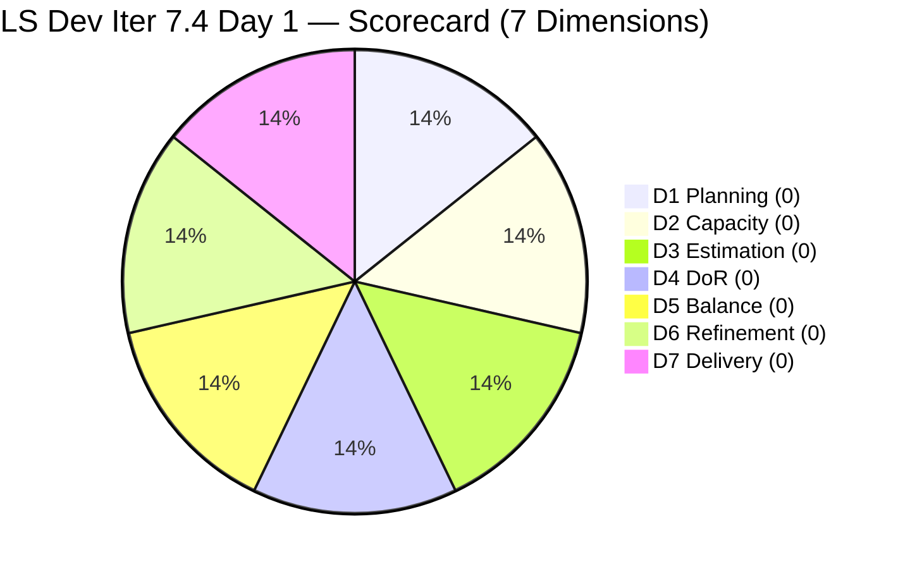
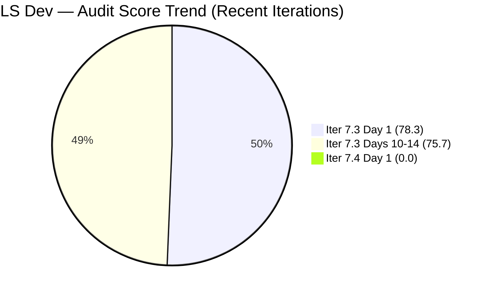
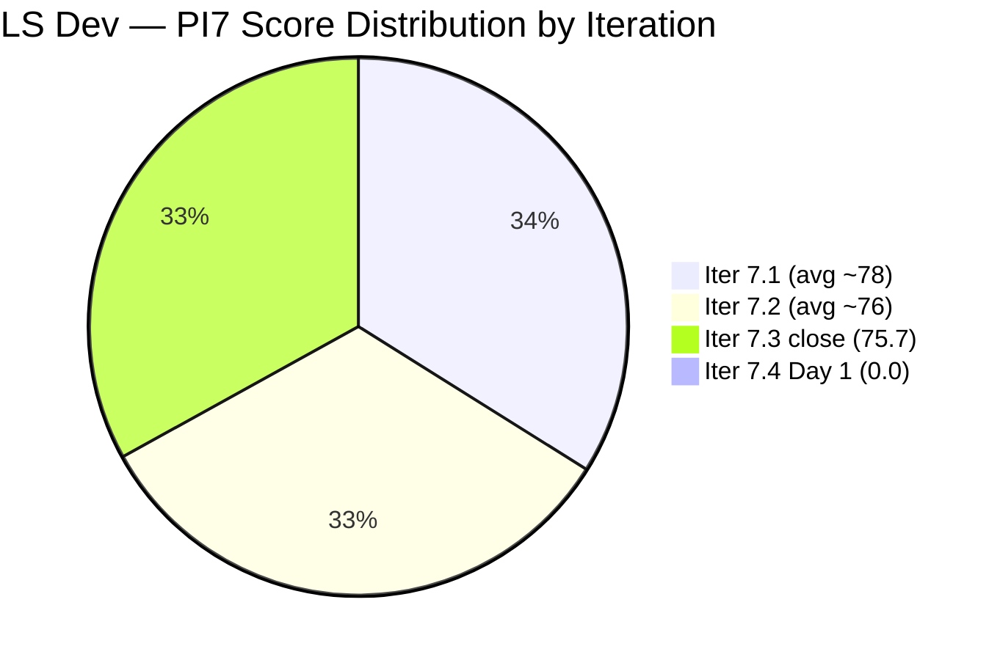

# ADO SAFe Iteration Audit — Life Style Help App Team

**Audit A55 | Iteration 7.4 (May 18 – May 31, 2026) | Day 1 of 14 — Sprint Open**

---

## 1. Audit Metadata

| Field | Value |
|---|---|
| **Audit Date** | May 18, 2026, 09:00 CDT / 15:00 UTC / 23:00 PHT (UTC+8) |
| **Auditor** | Claude Code (ADO SAFe Audit Agent) |
| **Workspace** | `ado_ls_dev` |
| **ADO Project** | Life Style Help App (`0f447778-7156-4451-ab21-27be3c4a5888`) |
| **Team** | Life Style Help App Team (`a2a805bc-0b30-4ef3-9a8a-b7f3081157a6`) |
| **Iteration** | Iteration 7.4 — May 18 to May 31, 2026 |
| **Iteration ID** | `85ef1e2d-7286-4593-9607-5b3df96255f4` |
| **Sprint Day** | Day 1 of 14 (7% elapsed — Sprint Open) |
| **Days Remaining** | 13 |
| **Prior Audit** | AUDIT_20260517_0209.md (A54, Iter 7.3 Sprint Close, Overall 75.7 — Moderate Risk) |
| **Scoring Model** | ADO SAFe v1 (7-dimension rubric) |
| **Overall Score** | **0.0 / 100** |
| **Risk Band** | **Critical** (< 40) |

---

## 2. Executive Summary

Life Style Help App Team opens Iteration 7.4 in a **Critical (0.0 / 100)** state — the worst possible audit outcome under the ADO SAFe v1 rubric. Every structural warning from audits A52 through A54 has gone unaddressed.

**Iteration 7.4 Day 1 Conditions:**
- **0 committed work items** — the iteration backlog is completely empty
- **0 story points committed** — no sprint scope
- **0 team capacity configured** — no activity or days set for either team member
- **0 items in the visible root backlog** — all 9 previously removed items remain in Removed state
- **No sprint planning activity detected** — Sprint open with no evidence of planning

All seven scoring dimensions score 0 simultaneously because the underlying denominators are all zero:  the backlog has no visible items, the iteration has no committed items, and no contributor has current work assigned. This is not a scoring anomaly — it is a complete absence of sprint execution.

The prior audit (A54, Iter 7.3 Sprint Close, May 17) explicitly identified today as the corrective window with a five-item action list, all rated Critical or High. None of the required actions were completed. The team has entered Iteration 7.4 in the same or worse structural position than it closed Iteration 7.3.

**Immediate action is required today (Day 1) to prevent a total sprint loss.**

---

## 3. Previous Audit Delta

| Dimension | A54 (May 17, Iter 7.3 Close, 75.7) | A55 (May 18, Iter 7.4 Day 1, 0.0) | Delta | Driver |
|---|---|---|---|---|
| Iteration Planning | 100.0 | **0.0** | −100.0 | Iter 7.4 backlog is completely empty; 0 visible items |
| Team Capacity | 0.0 | **0.0** | 0.0 | No capacity set — unchanged from 5-day zero streak |
| Estimation | 100.0 | **0.0** | −100.0 | No items to estimate |
| DoR Compliance | 100.0 | **0.0** | −100.0 | No items to assess |
| Work Item Balance | 30.0 | **0.0** | −30.0 | No items — denominator = 0 per rubric |
| Backlog Refinement | 100.0 | **0.0** | −100.0 | Visible backlog = 0; Removed items excluded per rubric |
| Delivery Predictability | 100.0 | **0.0** | −100.0 | No committed SP; early-sprint annotation applies |
| **Overall** | **75.7** | **0.0** | **−75.7** | Complete sprint collapse — iteration started empty |

**Delta narrative:** The −75.7 overall drop from A54 to A55 is the largest single-audit score collapse in the LS Dev audit series. Iter 7.3's artificially high scores (built on a 2-Defect, 3-SP sprint with a collapsed backlog) have given way to a true Critical state. The five high-scoring dimensions in A54 (D1, D3, D4, D6, D7) each scored 100 against a denominator of only 2 items; that denominator is now 0, reducing all five to 0. D2 was already 0 and remains 0. D5 was already 30 (penalized) and is now 0 (no items at all).

---

## 4. Current Iteration Snapshot

| Attribute | Value |
|---|---|
| **Iteration** | Iteration 7.4 |
| **Sprint Dates** | May 18 – May 31, 2026 (14 days) |
| **Sprint Day** | Day 1 of 14 — Sprint Open |
| **Days Remaining** | 13 |
| **Visible Root Backlog Items** | **0** (all 9 prior items remain in Removed state) |
| **Current Iteration Items (IterPath = Iter 7.4)** | **0** |
| **Committed SP** | 0 SP |
| **Closed SP** | 0 SP |
| **Team Capacity** | Samantha Babael: unset (0); Luzmibel Paculanang: unset (0) |
| **Sprint Status** | OPEN — No scope, no capacity, no planning activity detected |
| **Prior Iter 7.3 Close Score** | 75.7 Moderate Risk |

---

## 5. Work Item Analysis

### Iteration 7.4 Committed Items — 0 items

No work items have been committed to Iteration 7.4. The sprint board is empty.

### Removed Items — Still Removed (5+ Days in Removed State)

These 9 items were mass-removed on May 13, 2026 (Day 10 of Iter 7.3) and remain in Removed state as of today (Day 1 of Iter 7.4 — now 5 days since removal):

| ID | Title | Type | Prior State | SP | Recovery Status |
|---|---|---|---|---|---|
| 195716 | Hide "preferanser"/"allergier" in recipe card | User Story | Ready for Dev | 2 | **Unrestored** |
| 194082 | Customize the "Servings" Label | User Story | Ready for Dev | 1 | **Unrestored** |
| 194084 | Schedule Blog Post for Future Publication | User Story | Ready for Dev | 1 | **Unrestored** |
| 196380 | Default Pinned Post for New Users | User Story | Ready for Dev | 3 | **Unrestored** |
| 195727 | Meal time filter search text conflict | User Story | Ready for Dev | 2 | **Unrestored** |
| 195229 | Email Notification for Forum Posts | User Story | Grooming | 1 | **Unrestored** |
| 195373 | Lifestyle App Performance Optimization | Enabler | New | — | **Unrestored** |
| 201334 | Collaboration / Check and Replicate Issues | Spike | New | — | **Unrestored** |
| 202789 | Lifestyle App — Customer CSAT Survey | Spike | New | — | **Unrestored** |

The 5 User Stories (#195716, #194082, #194084, #196380, #195727) represent 9 SP of prepared pipeline. The 3 Enabler/Spike items represent additional technical exploration capacity. **None have been restored or replaced after 5 days.**

### Staleness Note

Per rubric, Removed items are excluded from `visible_root_backlog_items`. With 0 visible root items, staleness metrics cannot be computed. If items are restored, staleness re-evaluation will be required — items with IDs in the 194xxx range are highly likely to be stale_180 (created ~2024).

---

## 6. SAFe Compliance Scorecard

| Dimension | Score | Evidence | Notes |
|---|---|---|---|
| 1. Iteration Planning | 0.0 | visible_root_backlog_items = 0 | Denominator = 0; backlog collapsed — all 9 items in Removed state |
| 2. Team Capacity | 0.0 | contributors_with_current_work = 0 | No sprint items assigned; capacity API returned no data |
| 3. Estimation | 0.0 | point_eligible_current_items = 0 | No committed items to estimate |
| 4. DoR Compliance | 0.0 | current_iteration_root_items = 0 | No committed items to assess |
| 5. Work Item Balance | 0.0 | current_iteration_root_items = 0 | Denominator = 0 per rubric |
| 6. Backlog Refinement | 0.0 | visible_root_backlog_items = 0 | Denominator = 0; Removed items excluded per rubric |
| 7. Delivery Predictability | 0.0 | committed_story_points = 0 | No committed SP; **early-sprint annotation: Day 1 of 14** |
| **Overall** | **0.0** | (0+0+0+0+0+0+0) / 7 = 0.0 | **Critical** (< 40) |

### Score Computation

```
D1 = visible_root_backlog_items = 0 → score 0
D2 = contributors_with_current_work = 0 → score 0
D3 = point_eligible_current_items = 0 → score 0
D4 = current_iteration_root_items = 0 → score 0
D5 = current_iteration_root_items = 0 → score 0
D6 = visible_root_backlog_items = 0 → score 0
D7 = committed_story_points = 0 → score 0
     [early-sprint: Day 1 of 14 — D7=0 expected; no formula adjustment]

Overall = (0 + 0 + 0 + 0 + 0 + 0 + 0) / 7 = 0.0
```

---

## 7. Dimension Findings

### D1 — Iteration Planning: 0.0 (Critical — No Visible Backlog)

```
visible_root_backlog_items   = 0 (backlog API: empty)
current_iteration_root_items = 0 (iteration API: empty)
D1 = denominator 0 → score 0
```

The backlog has no visible root items. The nine items removed on May 13 (Iter 7.3, Day 10) remain in Removed state and are correctly excluded by the rubric. With no backlog and no iteration commitment, D1 cannot score above 0 regardless of the formula — there is nothing to plan against. The entire sprint has started empty.

### D2 — Team Capacity: 0.0 (Critical — Sixth Consecutive Day)

```
contributors_with_current_work = 0 (no sprint items; no assignments)
contributors_with_capacity     = 0 (capacity API: no team capacity assigned)
D2 = denominator 0 → score 0
```

Capacity has been unset for both Samantha Babael and Luzmibel Paculanang since May 13 (now 6 days). The capacity API returned an error ("No team capacity assigned to the team") for Iteration 7.4. With no sprint items, both members appear as having no current work — making D2 denominator = 0 rather than 0/N. This is the worst possible state: not only is capacity zeroed, the team has no work assigned at all. **The sprint cannot begin in any meaningful sense without capacity configuration.**

### D3 — Estimation: 0.0 (Not Applicable — No Items)

```
point_eligible_current_items = 0
D3 = denominator 0 → score 0
```

No items exist to estimate. This dimension will recover immediately once sprint scope is committed with Story Points.

### D4 — DoR Compliance: 0.0 (Not Applicable — No Items)

```
current_iteration_root_items = 0
D4 = denominator 0 → score 0
```

No items exist to evaluate for DoR. If the 5 "Ready for Dev" User Stories are restored and committed, their existing Descriptions and AC should be verified for current relevance — particularly the older items (194082, 194084) which may have outdated AC from their 2024 creation.

### D5 — Work Item Balance: 0.0 (Not Applicable — No Items)

```
current_iteration_root_items = 0
D5 = denominator 0 → score 0
```

Per rubric, when `current_iteration_root_items = 0`, the score is 0. Note: once items are committed, this dimension will be penalized unless User Stories are included. The team has been in Defect-only mode for 11 consecutive sprints. **Any Iter 7.4 commitment that lacks User Stories will immediately draw −40 from D5.**

### D6 — Backlog Refinement: 0.0 (Critical — Zero Visible Items)

```
visible_root_backlog_items = 0
fresh_visible_root_items   = 0
D6 = denominator 0 → score 0
```

The backlog is completely invisible to the scoring engine due to the Removed state of all 9 prior items. When items are restored, staleness analysis must be performed: items #194082 and #194084 are likely stale_180 (IDs suggest 2024 creation), which would subtract −20 from D6. Proactive DoR updates on these items before commitment will prevent D4 penalties.

### D7 — Delivery Predictability: 0.0 (Early-Sprint — Day 1 of 14)

```
committed_story_points = 0
D7 = denominator 0 → score 0
[Early-sprint annotation: Day 1 of 14 — D7=0 is expected at this stage; no formula adjustment]
```

D7 = 0 is expected on Day 1 with no committed scope. Unlike prior sprints where D7 was the only strong dimension (locked at 100% from Day 3 on a 3-SP commitment), this sprint has no committed SP at all. If the sprint continues without commitment, D7 will remain 0 through closure — representing a total delivery failure.

---

## 8. Risks and Bottlenecks



> All 7 dimensions score 0. Chart plotted with equal weight (1 each) for visibility only.



> Iter 7.4 plotted as 1 for chart visibility. Actual score = 0.0.

| Risk | Severity | Status | Action Required |
|---|---|---|---|
| **Complete sprint collapse — 0 committed items** | **Critical** | Iteration 7.4 started with empty board | Commit sprint scope TODAY |
| **Zero team capacity (6 consecutive days)** | **Critical** | No capacity configured for Iter 7.4 | Set capacity TODAY before committing items |
| **9 User Stories in Removed state — no pipeline** | **Critical** | 5 days unresolved; sprint has no scope to pull from | Audit and restore Removed items TODAY |
| **No sprint planning executed** | **Critical** | Sprint open with no planning evidence | Conduct sprint planning session immediately |
| **12th consecutive sprint without User Stories** | **High** | If any scope is committed without US, D5 = 30 or below | Hard gate: minimum 1 User Story in commitment |
| **Items 194082/194084 likely stale_180** | **High** | Created ~2024; DoR may be outdated | Verify and update AC before restoring |
| **Ownership concentration (Samantha only)** | **Moderate** | Luzmibel has 0 sprint items for Iter 7.4 | Assign 1–2 items to Luzmibel |
| **No Iteration Goal** | **Moderate** | Persistent gap across all PI7 sprints | Mandatory — define Iteration Goal at planning |
| **No PI Objectives linkage** | **Low** | Never queried; assumed persistent gap | Address in PI8 planning |

---

## 9. Prioritized Recommendations

1. **[TODAY — IMMEDIATE] Configure Iteration 7.4 team capacity in ADO** — Open the Iteration 7.4 capacity settings and set both members:
   - Samantha Babael: Development activity, 4–6 pts/day (based on team norm)
   - Luzmibel Paculanang: Testing activity, 2–4 pts/day
   Capacity configuration takes under 5 minutes and is a prerequisite for all other sprint planning actions. Capacity must be set before story point commitments can be meaningfully sized.

2. **[TODAY — IMMEDIATE] Conduct Iteration 7.4 Sprint Planning** — This session has not occurred. The sprint planning must define, at minimum:
   - Non-zero capacity for both members
   - Minimum 1 User Story in the committed scope (hard gate; 11-sprint deficit)
   - Story-pointed items only (no unestimated commitments)
   - A written Iteration Goal
   - Maximum 20% Defect budget (≤4 SP if targeting 20 SP sprint)

3. **[TODAY] Resolve the 9 Removed items** — Audit each item's current state:
   - **Restore** the 5 "Ready for Dev" User Stories (#195716, #194082, #194084, #196380, #195727) if removal was an error. Verify DoR on #194082 and #194084 before committing — their AC may be outdated.
   - **Replace** with new scope if items were intentionally deprecated, drawing from the LifeStyleHelpApp.com product roadmap.
   - **Explain** the reason for the May 13 mass removal in an ADO comment or wiki note — this has now been unexplained for 5 days across two sprints.

4. **[Iter 7.4 Commitment] Enforce User Story inclusion** — Any sprint that starts without at least one User Story immediately earns D5 = 30 (capped at −40 for no User Stories + additional penalties). The LifeStyleHelpApp.com product has received zero planned feature work across 11 consecutive sprints. Suggested target: 8–12 SP of User Stories (minimum), with Defects capped at 20% of total sprint capacity.

5. **[Iter 7.4 Day 1] Define the Iteration Goal** — A concrete, measurable goal for the sprint. Suggested: "Deliver three LifeStyle Help App features (recipe card filters, servings label customization, and blog post scheduling) while keeping reactive Defect budget below 20% of sprint capacity."

6. **[Iter 7.4] Assign work to Luzmibel** — Luzmibel Paculanang had 0 committed items in Iter 7.3. For Iter 7.4, assign at least 1–2 User Stories to Luzmibel alongside Samantha to reduce the single-point-of-failure risk and activate the Testing role on planned feature work.

7. **[Before Iter 7.4 Commit] Run DoR verification on all restored items** — Items #194082 ("Customize the 'Servings' Label") and #194084 ("Schedule Blog Post for Future Publication") have ID sequences suggesting 2024 creation. Before committing them to Iter 7.4, verify that their Descriptions and Acceptance Criteria reflect the current product state. Items that are stale_180 will trigger D6 penalties once they re-enter the visible backlog.

---

## 10. Evidence Gaps and Limitations

| Gap | Impact | Mitigation |
|---|---|---|
| **Reason for May 13 mass removal of 9 items** — unexplained for 5 days | **Critical** | No ADO comment or revision history available via API; requires verbal confirmation from Samantha Babael or Ramon |
| **Reason for capacity zeroing (both members since May 13)** | **Critical** | ADO capacity API returns "No team capacity assigned to the team"; no alternative data source available |
| **Sprint planning session** — no ADO evidence of planning activity | **Critical** | Absence of sprint items confirms no planning occurred; no out-of-band evidence available |
| **Creation dates of removed User Stories** — IDs 194082/194084 suggest 2024; staleness uncertain | **High** | Will need DoR re-verification on restore; stale_180 penalty applies if any item is confirmed older than 180 days |
| **Luzmibel Paculanang's availability status** — has had 0 pts/day for extended period | **Moderate** | May indicate departure, leave, or role change; requires explicit documentation under Project Exceptions if intentional |
| **PI Objectives linkage** | **Low** | Not queried; known persistent gap across all LS Dev audits |
| **Iteration Goal field** | **Low** | Not surfaced via ADO standard API; assumed absent given no planning activity |

---

## 11. Structural Context — LS Dev Audit Series (PI7)



> Iter 7.4 plotted as 1 for chart visibility. Actual score = 0.0. PI7 averages are estimates from the audit series; only Iter 7.3 close and Iter 7.4 Day 1 are from current evidence.

| Condition | Iter 7.3 Close (May 17) | Iter 7.4 Day 1 (May 18) | Change |
|---|---|---|---|
| Committed Items | 2 (both Closed) | 0 | −2 |
| Committed SP | 3 SP | 0 SP | −3 |
| User Stories in Sprint | 0 | 0 | No change |
| Team Capacity (pts/day) | 0 (both members) | 0 (unset) | No change |
| Visible Backlog Items | 2 | 0 | −2 |
| Removed Items | 9 (since Day 10) | 9 (still Removed) | No change |
| Overall Score | 75.7 Moderate | 0.0 Critical | −75.7 |

**The team has entered Iteration 7.4 in a worse structural state than it closed Iteration 7.3.** In Iter 7.3, at least 2 items were visible and scored. Today, even those 2 items have rolled off (they were Iter 7.3 items) leaving the board completely empty. Unless corrective action is taken today, Day 2 will record the same 0.0 Critical score — and the team will have effectively wasted the first business day of the sprint.

**Recovery path:** If capacity is set and at least 5 items (including 1+ User Story) are committed to Iter 7.4 today, the score can recover to approximately 65–75 (Moderate Risk) by Day 2. If recovery is completed by Day 3 with proper User Stories and DoR compliance, a Low Risk band (≥80) remains achievable for Iter 7.4.

---

*Report generated: May 18, 2026, 09:00 CDT / 15:00 UTC | Workspace: ado_ls_dev | Auditor: Claude Code ADO SAFe Audit Agent*
