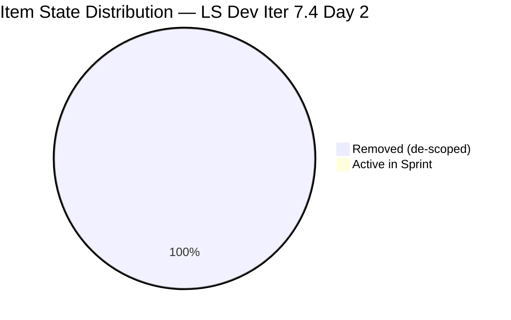
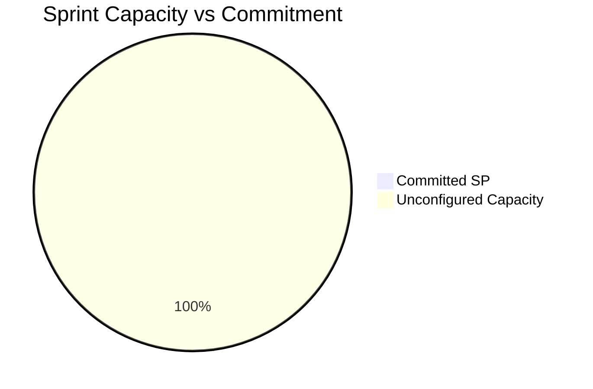
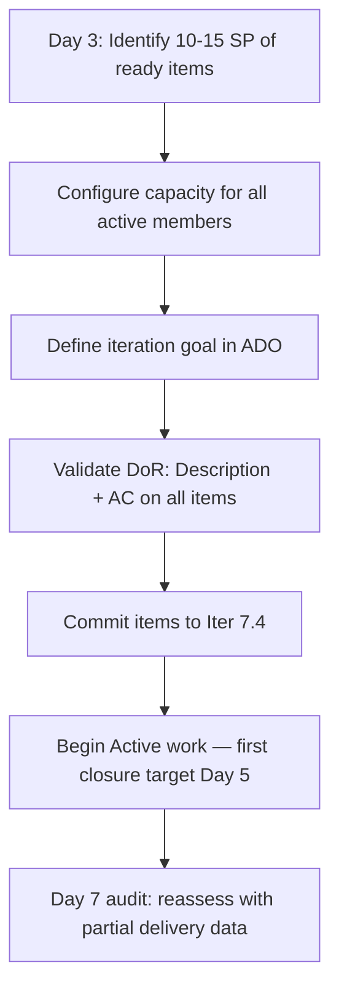

# Life Style Help App Team — SAFe Iteration Audit A56

**Audit Date:** 2026-05-19 02:05
**Auditor:** Claude Code (SAFe PM Consultant)
**Workspace:** `ado_ls_dev`
**ADO Board:** [Life Style Help App Team](https://dev.azure.com/jairo/Jairosoft%20FINOPS/_boards/board/t/Life%20Style%20Help%20App%20Team/Stories%20and%20Deliverables)

---

## 1. Audit Metadata

| Field | Value |
|-------|-------|
| Audit Number | A56 |
| Audit Date | 2026-05-19 |
| Audit Time | 02:05 |
| Iteration | 7.4 |
| Iteration Dates | May 18 – May 31, 2026 |
| Sprint Day | Day 2 of 14 |
| ADO Project | Life Style Help App (`0f447778-7156-4451-ab21-27be3c4a5888`) |
| ADO Team | Life Style Help App Team (`a2a805bc-0b30-4ef3-9a8a-b7f3081157a6`) |
| Iteration ID | `85ef1e2d-7286-4593-9607-5b3df96255f4` |
| Prior Audit | AUDIT_20260518_0900.md (Score: 0.0 — Critical) |

---

## 2. Executive Summary

Iteration 7.4, Day 2. **Sprint collapse continues — no change from Day 1.** The board shows 0 active backlog items, 0 capacity configured, and 9 items in **Removed** state. No items were added to the sprint overnight. No capacity records exist in ADO.

This is **Day 2 of an unrecovered sprint failure**. Without immediate intervention — adding committed items, configuring team capacity, and activating work — the sprint cannot recover. The score remains at **0.0 / 100 (Critical)**.

Urgent escalation to Ramon (Project Owner) is required. At current trajectory, Iteration 7.4 will close as a zero-delivery sprint with no burndown.

**Overall Score: 0.0 / 100 — Critical**

---

## 3. Previous Audit Delta

| Metric | 2026-05-18 (Audit A55) | 2026-05-19 (Audit A56) | Change |
|--------|------------------------|------------------------|--------|
| Sprint Day | Day 1 | Day 2 | +1 |
| Items in Iteration | 0 | 0 | 0 |
| Items Removed | 9 | 9 | 0 |
| Capacity Configured | 0 | 0 | 0 |
| Story Points Committed | 0 SP | 0 SP | 0 |
| SP Closed | 0 | 0 | 0 |
| Overall Score | 0.0 | 0.0 | 0.0 |
| Risk Band | Critical | Critical | — |

**Assessment:** Complete stall. Zero activity in the 24-hour window between audits. Sprint collapse first confirmed in Audit A55 (Day 1). The 9 removed items have not been re-added, re-activated, or replaced with new work. No capacity was configured. This board is effectively dark.

---

## 4. Current Iteration Snapshot

**Iteration 7.4** · May 18 – May 31, 2026 · **Day 2 of 14**

| Field | Value |
|-------|-------|
| Items in Iteration | **0** |
| Items in Removed State | **9** |
| Items Active/Ready/New | **0** |
| Capacity Configured | **0** (no records) |
| Total SP Committed | **0 SP** |
| SP Burned | **0** |
| % Complete (Items) | **N/A** |
| % Complete (SP) | **N/A** |

### Removed Items (Sprint Collapse Evidence)

| Status | Count | Implication |
|--------|-------|-------------|
| Removed from backlog | 9 | Work de-scoped without replacement |
| New items added to sprint | 0 | No recovery action taken |
| Capacity records in ADO | 0 | Team not configured for this sprint |

---

## 5. Work Item Analysis





### Sprint State: Complete Collapse

The Life Style Help App Team board exhibits all three indicators of sprint collapse:

1. **Zero committed items** — no work in Active, New, or Ready states
2. **Zero capacity** — no team member capacity configured in ADO
3. **Nine removed items** — prior sprint work de-scoped without replacement

This pattern has persisted from Day 1 (May 18) to Day 2 (May 19) without any recovery signals.

---

## 6. SAFe Compliance Scorecard

| Dimension | Score | Weight | Weighted | Notes |
|-----------|-------|--------|----------|-------|
| D1 — Iteration Planning | 0.0 | 1/7 | 0.0 | 0 items planned in iteration |
| D2 — Team Capacity | 0.0 | 1/7 | 0.0 | 0 capacity records in ADO |
| D3 — Estimation | 0.0 | 1/7 | 0.0 | 0 items to estimate |
| D4 — DoR Compliance | 0.0 | 1/7 | 0.0 | 0 items to assess DoR |
| D5 — Work Item Balance | 0.0 | 1/7 | 0.0 | 0 items — no balance to measure |
| D6 — Backlog Refinement | 0.0 | 1/7 | 0.0 | 0 active backlog items |
| D7 — Delivery Predictability | 0.0 | 1/7 | 0.0 | 0 SP closed (no items committed) |
| **Overall** | **0.0** | | | **Critical** |

---

## 7. Dimension Findings

### D1 — Iteration Planning (0.0)
Zero items have been planned into Iteration 7.4. The nine Removed items represent work that was de-scoped from the sprint. No replacement items have been pulled in from the backlog. Planning has not occurred.

### D2 — Team Capacity (0.0)
ADO capacity API returns empty for this team and iteration. No team members have been allocated with capacity for Iteration 7.4. This means the sprint was started without any team configuration, violating the SAFe iteration planning prerequisite of committed capacity.

### D3 — Estimation (0.0)
With zero committed items, there is nothing to estimate. Score cannot be computed — defaulted to 0.

### D4 — DoR Compliance (0.0)
With zero active items, there is nothing to assess for Definition of Ready compliance. Score cannot be computed — defaulted to 0.

### D5 — Work Item Balance (0.0)
With zero items, there is no work item composition to measure. Score defaulted to 0.

### D6 — Backlog Refinement (0.0)
The backlog API returns empty for this team. No items are in a refineable state. The nine Removed items are not refineable — they have been de-scoped. Score: 0.

### D7 — Delivery Predictability (0.0)
No items exist to deliver. Historical delivery rate from prior sprints cannot compensate for a fully empty sprint. Score: 0.

---

## 8. Risks and Bottlenecks

```mermaid
quadrantChart
    title Risk Matrix — LS Dev Iteration 7.4 Day 2
    x-axis Low Impact --> High Impact
    y-axis Low Likelihood --> High Likelihood
    quadrant-1 Monitor
    quadrant-2 Critical
    quadrant-3 Low Priority
    quadrant-4 Plan
    Sprint Collapse (0 items): [0.95, 1.0]
    No Capacity Configured: [0.9, 1.0]
    9 Items Removed (no replacement): [0.85, 0.95]
    Zero Delivery Risk: [0.9, 0.95]
    No Recovery Signal (Day 2): [0.8, 0.9]
```

| Risk | Severity | Status |
|------|----------|--------|
| **Sprint collapse — 0 active items** | Critical | Active — Day 2, no change |
| **Zero capacity configured** | Critical | Active — no recovery action taken |
| **9 items removed without replacement** | Critical | Active — no new items added |
| **No delivery in Iter 7.4** (projected) | Critical | High likelihood if Day 3 shows no change |
| **Data visibility gap** — backlog API empty | High | Cannot assess backlog health |

---

## 9. Prioritized Recommendations

| Priority | Recommendation | Due | Owner |
|----------|---------------|-----|-------|
| 🔴 P0 | **ESCALATE: Sprint requires immediate intervention** — contact team lead / Ramon for recovery plan | TODAY May 19 | Ramon |
| 🔴 P0 | **Add committed items** to Iteration 7.4 immediately — pull from backlog or re-add removed items if appropriate | TODAY May 19 | Team Lead |
| 🔴 P0 | **Configure team capacity** in ADO for all active members for Iter 7.4 | TODAY May 19 | Team Lead |
| 🔴 P1 | **Define an iteration goal** before any items are added — establishes sprint purpose | May 19 | Team Lead |
| 🔴 P1 | **Investigate removal of 9 items** — determine if they are de-committed to 7.5 or abandoned | May 19 | Ramon / Team Lead |
| 🟡 P2 | **Establish minimum sprint commitment** — at minimum 10 SP to establish delivery baseline | May 20 | Team Lead |
| 🟡 P2 | **DoR enforcement** — ensure any items added pass Description + AC thresholds before commitment | May 20 | Team Lead |

---

## 10. Evidence Gaps and Limitations

| Gap | Impact | Notes |
|-----|--------|-------|
| Backlog API returns empty (0 items) | High | Cannot assess full backlog health or confirm if items exist outside iteration |
| Capacity API returns error / empty | High | Cannot confirm team roster or individual allocations |
| 9 removed items — no detail on removal reason | Medium | Unknown if de-committed to 7.5, abandoned, or technical error |
| Team member identities not confirmed via API | Medium | Cannot confirm who is on the team for Iter 7.4 |

---

## Sprint Recovery Protocol

If the team lead engages by Day 3 (May 20), the following minimum recovery steps apply:



**Minimum viable recovery**: If 10+ SP are committed and capacity configured by Day 3, it is still theoretically possible to reach a 50%+ SP delivery by sprint close (Day 14). Beyond Day 5 without recovery, the sprint loss becomes structurally unrecoverable.

---

*Generated by Claude Code SAFe Audit Engine · 2026-05-19 02:05 · Report A56*
*Framework: SAFe 6.0 · Risk Bands: Low ≥80 · Moderate 60–79.9 · High 40–59.9 · Critical <40*
