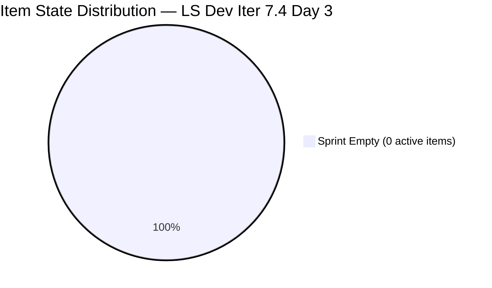
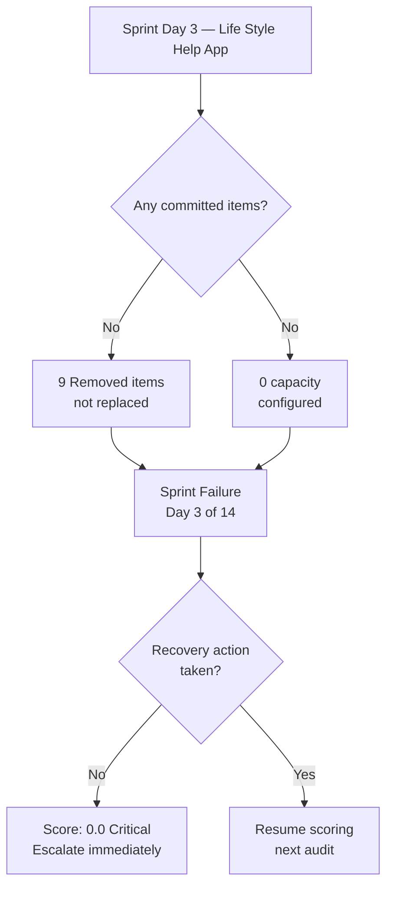
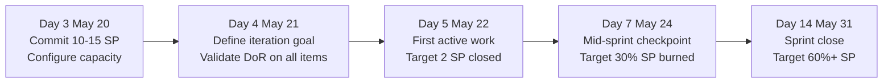

# Life Style Help App Team — SAFe Iteration Audit A57

**Audit Date:** 2026-05-20 02:04 PHT
**Auditor:** Claude Code (SAFe PM Consultant)
**Workspace:** `ado_ls_dev`
**ADO Board:** [Life Style Help App Team](https://dev.azure.com/jairo/Jairosoft%20FINOPS/_boards/board/t/Life%20Style%20Help%20App%20Team/Stories%20and%20Deliverables)

---

## 1. Audit Metadata

| Field | Value |
|-------|-------|
| Audit Number | A57 |
| Audit Date | 2026-05-20 |
| Audit Time | 02:04 PHT |
| Iteration | 7.4 |
| Iteration Dates | May 18 – May 31, 2026 |
| Sprint Day | Day 3 of 14 |
| ADO Project | Life Style Help App (`0f447778-7156-4451-ab21-27be3c4a5888`) |
| ADO Team | Life Style Help App Team (`a2a805bc-0b30-4ef3-9a8a-b7f3081157a6`) |
| Iteration ID | `85ef1e2d-7286-4593-9607-5b3df96255f4` |
| Prior Audit | AUDIT_20260519_0205.md (Score: 0.0 — Critical) |

---

## 2. Executive Summary

Iteration 7.4, Day 3 of 14. **Sprint collapse continues — third consecutive day with zero active work items, zero capacity, and zero delivery.** No recovery action was taken between Day 2 and Day 3. The backlog API returns empty, capacity API returns an error ("No team capacity assigned to the team"), and the 9 previously Removed items remain without replacement.

This is the **third day of an unrecovered sprint failure**. Without immediate intervention today (Day 3), the window for meaningful sprint recovery is narrowing. By Day 5, the mathematical probability of reaching even 50% SP delivery becomes severely constrained.

Score remains at **0.0 / 100 (Critical)** — unchanged for the third consecutive audit.

Urgent escalation to Ramon (Project Owner) remains the top priority.

**Overall Score: 0.0 / 100 — Critical**

---

## 3. Previous Audit Delta

| Metric | 2026-05-19 (Audit A56) | 2026-05-20 (Audit A57) | Change |
|--------|------------------------|------------------------|--------|
| Sprint Day | Day 2 | Day 3 | +1 |
| Items in Iteration | 0 | 0 | 0 |
| Items Removed | 9 | 9 | 0 |
| New Items Added | 0 | 0 | 0 |
| Capacity Configured | 0 | 0 | 0 |
| Story Points Committed | 0 SP | 0 SP | 0 |
| SP Closed | 0 | 0 | 0 |
| Overall Score | 0.0 | 0.0 | 0.0 |
| Risk Band | Critical | Critical | — |

**Assessment:** Complete stall for the third day. Zero signals of recovery. This is now a confirmed sprint failure entering its third day with no recovery action taken. The team appears inactive on ADO or has not re-engaged the board since the sprint began.

---

## 4. Current Iteration Snapshot

**Iteration 7.4** · May 18 – May 31, 2026 · **Day 3 of 14**

| Field | Value |
|-------|-------|
| Visible Root Backlog Items | **0** |
| Items in Iteration 7.4 | **0** |
| Items in Removed State | **9** (estimated — same as prior audit) |
| Items Active/Ready/New | **0** |
| Capacity Configured | **0** (API error: "No team capacity assigned") |
| Total SP Committed | **0 SP** |
| SP Burned | **0** |
| % Complete (Items) | **N/A** |
| % Complete (SP) | **N/A** |

### Sprint Collapse Evidence Summary

| Indicator | Status | Days Active |
|-----------|--------|-------------|
| Zero committed items | Confirmed | Day 1–3 (3 days) |
| Zero capacity configured | Confirmed | Day 1–3 (3 days) |
| No recovery action | Confirmed | Day 1–3 (3 days) |
| Backlog API empty | Confirmed | Day 1–3 (3 days) |

---

## 5. Work Item Analysis





### Sprint State: Confirmed Failure (Day 3)

Three consecutive indicators of sprint failure:

1. **Zero committed items** — no work in Active, New, or Ready states for Iter 7.4
2. **Zero capacity** — `work_get_team_capacity` returns error; no ADO capacity records exist
3. **Nine removed items** — prior work de-scoped without replacement (pattern holds from Day 1)

At Day 3 of a 14-day sprint, without recovery today, the team enters a high-risk zone for delivering even a minimum viable sprint outcome.

---

## 6. SAFe Compliance Scorecard

| Dimension | Score | Evidence | Notes |
|-----------|-------|----------|-------|
| D1 — Iteration Planning | 0.0 | 0 visible root items; 0 planned to Iter 7.4 | No items exist in backlog |
| D2 — Team Capacity | 0.0 | Capacity API error; no records exist | 0/0 contributors with capacity → scored 0 |
| D3 — Estimation | 0.0 | 0 eligible items to estimate | Default 0 per rubric (denominator = 0) |
| D4 — DoR Compliance | 0.0 | 0 items to assess | Default 0 per rubric (denominator = 0) |
| D5 — Work Item Balance | 0.0 | 0 items — no composition to measure | Default 0 per rubric |
| D6 — Backlog Refinement | 0.0 | 0 visible root items | Default 0 per rubric (denominator = 0) |
| D7 — Delivery Predictability | 0.0 | 0 committed SP; 0 closed SP | Default 0 per rubric (committed = 0) |
| **Overall** | **0.0** | **(0+0+0+0+0+0+0)/7** | **Critical** |

---

## 7. Dimension Findings

### D1 — Iteration Planning (0.0)
`wit_list_backlog_work_items` returns 0 items for this team's Stories and Deliverables backlog. No items are assigned to Iteration 7.4. `visible_root_backlog_items = 0` → score = 0 per rubric formula.

### D2 — Team Capacity (0.0)
`work_get_team_capacity` returns error: "No team capacity assigned to the team." No capacity records exist for any team member in Iter 7.4. `contributors_with_current_work = 0` → score = 0 per rubric.

### D3 — Estimation (0.0)
With zero committed items, `point_eligible_current_items = 0` → score = 0 per rubric.

### D4 — DoR Compliance (0.0)
With zero active items, `current_iteration_root_items = 0` → score = 0 per rubric.

### D5 — Work Item Balance (0.0)
With zero items, `current_iteration_root_items = 0` → score = 0 per rubric.

### D6 — Backlog Refinement (0.0)
`visible_root_backlog_items = 0` → score = 0 per rubric formula.

### D7 — Delivery Predictability (0.0)
`committed_story_points = 0` → score = 0 per rubric.

---

## 8. Risks and Bottlenecks

```mermaid
quadrantChart
    title Risk Matrix — LS Dev Iteration 7.4 Day 3
    x-axis Low Impact --> High Impact
    y-axis Low Likelihood --> High Likelihood
    quadrant-1 Monitor
    quadrant-2 Critical
    quadrant-3 Low Priority
    quadrant-4 Plan
    Sprint Collapse Day 3: [0.95, 1.0]
    Zero Capacity Configured: [0.9, 1.0]
    No Recovery Signal Day 3: [0.9, 0.95]
    Window Closing for Recovery: [0.85, 0.9]
    9 Items Removed No Replacement: [0.85, 0.95]
```

| Risk | Severity | Status | Days Active |
|------|----------|--------|-------------|
| **Sprint collapse — 0 active items** | Critical | Active — no change | Day 3 |
| **Zero capacity configured** | Critical | Active — no recovery action | Day 3 |
| **9 items removed without replacement** | Critical | Active — no new items added | Day 3 |
| **Recovery window closing** | Critical | Day 5+ is structural point of no return | Approaching |
| **Zero delivery projected** | Critical | High likelihood if no action today | Day 3 |
| **Data visibility gap** — backlog API empty | High | Cannot confirm if items exist outside API scope | Day 3 |

---

## 9. Prioritized Recommendations

| Priority | Recommendation | Due | Owner |
|----------|---------------|-----|-------|
| P0 | **ESCALATE NOW (Day 3 is critical)** — Ramon must engage team lead for recovery plan immediately | TODAY May 20 | Ramon |
| P0 | **Add committed items to Iter 7.4** — pull from backlog or re-add removed items if scope is valid | TODAY May 20 | Team Lead |
| P0 | **Configure team capacity in ADO** — all active members must be allocated for Iter 7.4 | TODAY May 20 | Team Lead |
| P1 | **Investigate 9 removed items** — determine if de-committed to 7.5 or abandoned; document decision | May 20 | Ramon / Team Lead |
| P1 | **Define iteration goal** — before any items are committed, articulate the sprint objective | May 20 | Team Lead |
| P2 | **Minimum viable recovery** — commit 10+ SP with DoR-compliant items before Day 5 (May 22) | May 22 | Team Lead |
| P2 | **DoR enforcement** — all items added must pass Description ≥30 chars + AC ≥20 chars before commitment | May 22 | Team Lead |

### Recovery Timeline (If Action Taken Today)



> If no committed items by Day 5 (May 22), the sprint will close with 0 delivery regardless of late-stage effort. **Day 3 action is the last viable inflection point.**

---

## 10. Evidence Gaps and Limitations

| Gap | Impact | Notes |
|-----|--------|-------|
| `wit_list_backlog_work_items` returns 0 items | High | Cannot assess whether items exist outside API scope; suggests board is empty |
| `work_get_team_capacity` returns error | High | No capacity data — team not configured for Iter 7.4 |
| Identity of 9 removed items unknown | Medium | Cannot confirm removal reason, responsible party, or target iteration |
| Team member identities not confirmed via API | Medium | ADO capacity API returns no records; team roster for 7.4 unknown |
| Iteration 7.4 ID confirmed from prior audit | None | `85ef1e2d-7286-4593-9607-5b3df96255f4` confirmed via `work_list_team_iterations` |

---

*Generated by Claude Code SAFe Audit Engine · 2026-05-20 02:04 PHT · Report A57*
*Framework: SAFe 6.0 · Risk Bands: Low ≥80 · Moderate 60–79.9 · High 40–59.9 · Critical <40*
*Evidence: `wit_list_backlog_work_items` (empty) + `work_get_team_capacity` (error) + `work_list_team_iterations` (confirmed Iter 7.4 via GUID)*
