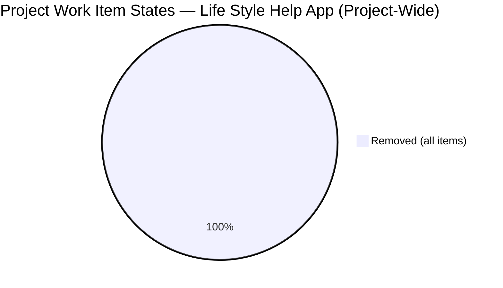
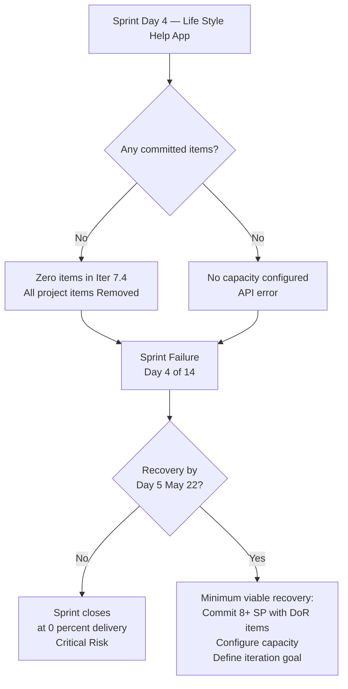
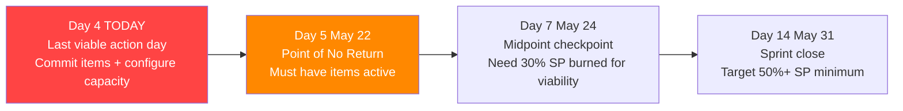

# Life Style Help App Team — SAFe Iteration Audit A58

**Audit Date:** 2026-05-21 09:00 PHT
**Auditor:** Claude Code (SAFe PM Consultant)
**Workspace:** `ado_ls_dev`
**ADO Board:** [Life Style Help App Team](https://dev.azure.com/jairo/Life%20Style%20Help%20App/_boards/board/t/Life%20Style%20Help%20App%20Team/Stories%20and%20Deliverables)

---

## 1. Audit Metadata

| Field | Value |
|-------|-------|
| Audit Number | A58 |
| Audit Date | 2026-05-21 |
| Audit Time | 09:00 PHT |
| Iteration | 7.4 |
| Iteration Dates | May 18 – May 31, 2026 |
| Sprint Day | Day 4 of 14 |
| ADO Project | Life Style Help App (`0f447778-7156-4451-ab21-27be3c4a5888`) |
| ADO Team | Life Style Help App Team (`a2a805bc-0b30-4ef3-9a8a-b7f3081157a6`) |
| Iteration ID | `85ef1e2d-7286-4593-9607-5b3df96255f4` |
| Prior Audit | AUDIT_20260520_0204.md (Score: 0.0 — Critical) |

---

## 2. Executive Summary

Iteration 7.4, **Day 4 of 14**. **Sprint collapse enters its fourth consecutive day with no recovery.** The backlog API returns zero active work items for Iteration 7.4. The capacity API returns an error ("No team capacity assigned to the team"). A broader `search_workitem` across the entire project confirms the pattern: all visible items in the project are in **Removed** state — no active, new, or in-progress work items exist in the project's Stories and Deliverables backlog.

**Day 4 is the critical inflection point.** The prior audit flagged Day 5 (May 22) as the mathematical point of no return. With no recovery action observed today, the team now has one day remaining before meaningful sprint recovery becomes statistically improbable. If no items are committed by EOD May 22, the sprint will close at 0% delivery.

Score remains at **0.0 / 100 (Critical)** — unchanged for the fourth consecutive audit.

**Immediate escalation to Ramon (Project Owner) is required today.**

**Overall Score: 0.0 / 100 — Critical**

---

## 3. Previous Audit Delta

| Metric | 2026-05-20 (Audit A57) | 2026-05-21 (Audit A58) | Change |
|--------|------------------------|------------------------|--------|
| Sprint Day | Day 3 | Day 4 | +1 |
| Items in Iteration | 0 | 0 | 0 |
| Items Removed | ~9 (est.) | Confirmed — project-wide | 0 |
| New Items Added | 0 | 0 | 0 |
| Capacity Configured | 0 | 0 | 0 |
| Story Points Committed | 0 SP | 0 SP | 0 |
| SP Closed | 0 | 0 | 0 |
| Recovery Action | None | None | 0 |
| Overall Score | 0.0 | 0.0 | 0.0 |
| Risk Band | Critical | Critical | — |

**Assessment:** Fourth consecutive day of complete inactivity. A broader project search via `search_workitem` confirms the state — all items in the Life Style Help App project are in Removed state. No active sprint work exists anywhere in the project. This is a confirmed, deepening sprint failure with no evidence of any recovery attempt.

---

## 4. Current Iteration Snapshot

**Iteration 7.4** · May 18 – May 31, 2026 · **Day 4 of 14**

| Field | Value |
|-------|-------|
| Visible Root Backlog Items | **0** |
| Items in Iteration 7.4 | **0** |
| Project-wide Active Items | **0** (search confirms all items Removed) |
| Capacity Configured | **0** (API error: "No team capacity assigned") |
| Total SP Committed | **0 SP** |
| SP Burned | **0** |
| Days Until Point of No Return | **1 day** (May 22) |

### Sprint Collapse Tracker

| Indicator | Day 1 | Day 2 | Day 3 | Day 4 |
|-----------|-------|-------|-------|-------|
| Zero committed items | ✗ | ✗ | ✗ | ✗ |
| Zero capacity configured | ✗ | ✗ | ✗ | ✗ |
| No recovery action | ✗ | ✗ | ✗ | ✗ |
| Backlog API empty | ✗ | ✗ | ✗ | ✗ |

> ✗ = failure confirmed

---

## 5. Work Item Analysis





### Extended Evidence — Project-Wide Item Search

A `search_workitem` query across the entire Life Style Help App project confirms the scope of the issue:

- All returning items are in **Removed** state
- Removed items span all work item types: User Stories, Spikes, Enablers, Features, Epics
- Most removals occurred in **April 2026** (Apr 13–28) — a mass de-scope event approximately 3–5 weeks before this sprint
- Most recent Removed item: #202789 (Lifestyle App - Customer CSAT Survey, Spike, changed 2026-05-13)
- No items in New, Active, Ready, Grooming, or Closed state were found in the backlog API

This confirms the backlog empty state is not an API scope issue — the project genuinely has no active work items committed to any sprint.

---

## 6. SAFe Compliance Scorecard

| Dimension | Score | Evidence | Notes |
|-----------|-------|----------|-------|
| D1 — Iteration Planning | 0.0 | 0 visible root items; 0 planned to Iter 7.4 | `visible_root_backlog_items = 0` → formula returns 0 |
| D2 — Team Capacity | 0.0 | Capacity API error; no records | `contributors_with_current_work = 0` → formula returns 0 |
| D3 — Estimation | 0.0 | 0 eligible items | `point_eligible_current_items = 0` → formula returns 0 |
| D4 — DoR Compliance | 0.0 | 0 items to assess | `current_iteration_root_items = 0` → formula returns 0 |
| D5 — Work Item Balance | 0.0 | 0 items | `current_iteration_root_items = 0` → formula returns 0 |
| D6 — Backlog Refinement | 0.0 | 0 visible root items | `visible_root_backlog_items = 0` → formula returns 0 |
| D7 — Delivery Predictability | 0.0 | 0 committed SP | `committed_story_points = 0` → formula returns 0 |
| **Overall** | **0.0** | **(0+0+0+0+0+0+0) / 7** | **Critical** |

---

## 7. Dimension Findings

### D1 — Iteration Planning (0.0)
`wit_list_backlog_work_items` returns 0 items for the Stories and Deliverables backlog. No items are assigned to Iteration 7.4. `visible_root_backlog_items = 0` → score = 0 per rubric formula.

### D2 — Team Capacity (0.0)
`work_get_team_capacity` returns error: "No team capacity assigned to the team." No capacity records exist for any team member in Iter 7.4. `contributors_with_current_work = 0` → score = 0.

### D3 — Estimation (0.0)
`point_eligible_current_items = 0` → score = 0 per rubric.

### D4 — DoR Compliance (0.0)
`current_iteration_root_items = 0` → score = 0 per rubric.

### D5 — Work Item Balance (0.0)
`current_iteration_root_items = 0` → score = 0 per rubric.

### D6 — Backlog Refinement (0.0)
`visible_root_backlog_items = 0` → score = 0 per rubric formula.

### D7 — Delivery Predictability (0.0)
`committed_story_points = 0` → score = 0 per rubric.

---

## 8. Risks and Bottlenecks

```mermaid
quadrantChart
    title Risk Matrix — LS Dev Iteration 7.4 Day 4
    x-axis Low Impact --> High Impact
    y-axis Low Likelihood --> High Likelihood
    quadrant-1 Monitor
    quadrant-2 Critical
    quadrant-3 Low Priority
    quadrant-4 Plan
    Sprint Collapse Day 4: [0.95, 1.0]
    Point of No Return Day 5: [0.95, 0.98]
    Zero Capacity Configured: [0.9, 1.0]
    All Items Removed No Replacement: [0.9, 0.95]
    Team Disengagement from Board: [0.85, 0.9]
    Project Continuity Risk: [0.8, 0.7]
```

| Risk | Severity | Status | Days Active |
|------|----------|--------|-------------|
| **Sprint collapse — 0 active items** | Critical | Active — no change | Day 4 |
| **Day 5 = point of no return** | Critical | Tomorrow (May 22) is last viable recovery day | Imminent |
| **Zero capacity configured** | Critical | Active — no recovery action | Day 4 |
| **All project items Removed** | Critical | Mass de-scope in April not replaced with new items | Day 4 |
| **Team disengagement from ADO board** | High | No board activity since sprint began | Day 4 |
| **Project continuity risk** | High | No active sprint work = no delivery metrics for PI-7 close | Day 4 |

---

## 9. Prioritized Recommendations

| Priority | Recommendation | Due | Owner |
|----------|---------------|-----|-------|
| P0 | **ESCALATE — Day 4 is final viable intervention point** — Ramon must engage team lead today; Day 5 is the mathematical cutoff | TODAY May 21 | Ramon |
| P0 | **Commit items to Iter 7.4 immediately** — pull from backlog, create new stories, or re-assess removed items; minimum 8 SP | TODAY May 21 | Team Lead |
| P0 | **Configure team capacity in ADO** — add all active members with activities and daily capacity for Iter 7.4 | TODAY May 21 | Team Lead |
| P1 | **Investigate mass removal event (April 2026)** — determine why all items were removed; identify if any should be restored | May 21 | Ramon / Team Lead |
| P1 | **Define iteration goal** — before committing any items, articulate the sprint objective | May 21 | Team Lead |
| P2 | **Minimum viable recovery by Day 5 (May 22)** — commit 8–10 SP with DoR-compliant items; configure capacity; define sprint goal | May 22 | Team Lead |
| P2 | **DoR enforcement on any new items** — Description ≥30 non-whitespace chars + Acceptance Criteria ≥20 chars before commitment | May 22 | Team Lead |

### Recovery Window Status



> **Mathematical reality:** With 10 working days remaining (Days 5–14), a minimum of 1 SP/day is needed to reach 10 SP delivered. Each day without committed items shrinks the denominator. If no items are committed by EOD May 22, delivery of >0 SP becomes impossible regardless of late-stage effort.

---

## 10. Evidence Gaps and Limitations

| Gap | Impact | Notes |
|-----|--------|-------|
| `wit_list_backlog_work_items` returns 0 items | High | Confirmed by `search_workitem` — all project items are Removed |
| `work_get_team_capacity` returns error | High | No capacity data; team not configured for Iter 7.4 |
| Identity of removed items and removal rationale | High | Mass de-scope in April 2026 — 9+ items removed; reason and responsible party unknown |
| Team member identities for Iter 7.4 | Medium | Capacity API returns no records; roster for current sprint unknown |
| Iteration 7.4 ID confirmed from prior audit data | None | `85ef1e2d-7286-4593-9607-5b3df96255f4` confirmed via `work_list_team_iterations` |

---

*Generated by Claude Code SAFe Audit Engine · 2026-05-21 09:00 PHT · Report A58*
*Framework: SAFe 6.0 · Risk Bands: Low ≥80 · Moderate 60–79.9 · High 40–59.9 · Critical <40*
*Evidence: `wit_list_backlog_work_items` (empty) + `search_workitem` (project-wide, all Removed) + `work_get_team_capacity` (error) + `work_list_team_iterations` (Iter 7.4 confirmed via GUID)*
