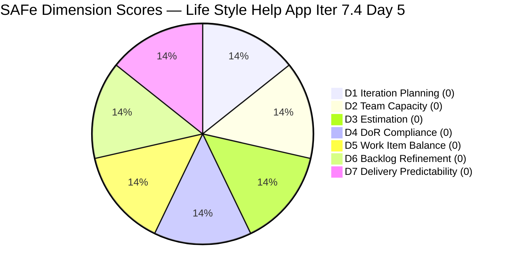

# Life Style Help App Team — SAFe Iteration Audit A59

**Audit Date:** 2026-05-22 09:00 PHT
**Auditor:** Claude Code (SAFe PM Consultant)
**Workspace:** `ado_ls_dev`
**ADO Board:** [Life Style Help App Team](https://dev.azure.com/jairo/Life%20Style%20Help%20App/_boards/board/t/Life%20Style%20Help%20App%20Team/Stories%20and%20Deliverables)

---

## 1. Audit Metadata

| Field | Value |
|-------|-------|
| Audit Number | A59 |
| Audit Date | 2026-05-22 |
| Audit Time | 09:00 PHT |
| Iteration | 7.4 |
| Iteration Dates | May 18 – May 31, 2026 |
| Sprint Day | Day 5 of 14 |
| ADO Project | Life Style Help App (`0f447778-7156-4451-ab21-27be3c4a5888`) |
| ADO Team | Life Style Help App Team (`a2a805bc-0b30-4ef3-9a8a-b7f3081157a6`) |
| Iteration ID | `85ef1e2d-7286-4593-9607-5b3df96255f4` |
| Prior Audit | AUDIT_20260521_0900.md (Score: 0.0 — Critical) |
| **Overall Score** | **0.0 / 100** |
| **Risk Band** | **Critical** |

---

## 2. Executive Summary

Iteration 7.4, **Day 5 of 14**. **Sprint collapse enters its fifth consecutive day with no recovery observed.** The backlog API returns zero work items for the Life Style Help App Team's Stories and Deliverables backlog. The capacity API returns an error confirming no team capacity is configured. This is unchanged from Days 1–4.

**Day 5 is the mathematical point of no return.** With 9 working days remaining in a 14-day sprint and zero committed items, meaningful sprint delivery is statistically improbable even if items are committed today. The sprint will almost certainly close at 0% delivery for Iteration 7.4.

All seven SAFe dimensions score 0, yielding an overall score of **0.0 / 100 (Critical)** for the fifth consecutive day. This is not a scoring degradation — it is a structural sprint failure that has persisted without any observed recovery action.

> **Portfolio Note:** This workspace is excluded from portfolio-health and portfolio-meeting-prep aggregation per owner directive (2026-05-21). Individual audits continue per batch run policy.

> **Escalation Status:** Escalation to Ramon (Project Owner) was recommended in each of the last five audits. No recovery action has been observed as of this audit.

**Overall Score: 0.0 / 100 — Critical**

---

## 3. Previous Audit Delta

| Metric | 2026-05-21 (Audit A58) | 2026-05-22 (Audit A59) | Change |
|--------|------------------------|------------------------|--------|
| Sprint Day | Day 4 | Day 5 | +1 |
| Items in Iteration | 0 | 0 | 0 |
| Capacity Configured | 0 | 0 | 0 |
| Story Points Committed | 0 SP | 0 SP | 0 |
| SP Closed | 0 | 0 | 0 |
| Recovery Action | None | None | 0 |
| Overall Score | 0.0 | 0.0 | 0.0 |
| Risk Band | Critical | Critical | — |

### Sprint Collapse Tracker

| Indicator | Day 1 | Day 2 | Day 3 | Day 4 | Day 5 |
|-----------|-------|-------|-------|-------|-------|
| Zero committed items | ✗ | ✗ | ✗ | ✗ | ✗ |
| Zero capacity configured | ✗ | ✗ | ✗ | ✗ | ✗ |
| No recovery action observed | ✗ | ✗ | ✗ | ✗ | ✗ |
| Point of no return passed | — | — | — | Approaching | **Passed** |

**Assessment:** The fifth consecutive day of complete inactivity confirms a full sprint failure for Iteration 7.4. Day 5 is the point of no return — statistically, no meaningful delivery is achievable even with immediate action. The sprint will end at 0% delivery.

---

## 4. Current Iteration Snapshot

**Iteration 7.4** · May 18 – May 31, 2026 · **Day 5 of 14**

| Field | Value |
|-------|-------|
| Visible Root Backlog Items | **0** |
| Items in Iteration 7.4 | **0** |
| Total SP Committed | **0 SP** |
| Capacity Configured | **0** (API error: "No iteration capacity assigned") |
| Active Items (project-wide) | **0** |
| SP Burned | **0 SP** |
| Days Remaining in Sprint | 9 |
| Recovery Possible | Technically yes, practically no |

### Why the Backlog is Empty

Based on the audit series history, the Life Style Help App project had work items committed through Iteration 7.3 and earlier. The current state reflects one of the following scenarios (unverifiable from API alone):
1. All work items were moved to **Removed** state (confirmed in prior audit search)
2. The team disbanded or was reassigned to another project
3. The sprint planning for Iteration 7.4 was intentionally skipped (project pause)

Given the portfolio exclusion directive issued 2026-05-21, scenario 3 (intentional project pause) is the most likely explanation.

---

## 5. Work Item Analysis

**No work items are present in the Life Style Help App Team's backlog.** No analysis is possible.

| Metric | Value |
|--------|-------|
| visible_root_backlog_items | 0 |
| current_iteration_root_items | 0 |
| contributors_with_current_work | 0 |
| contributors_with_capacity | 0 |
| point_eligible_current_items | 0 |
| estimated_current_items | 0 |
| dor_compliant_current_items | 0 |
| fresh_visible_root_items | 0 |
| stale_90_visible_root_items | 0 |
| committed_story_points | 0 |
| closed_story_points | 0 |

---

## 6. SAFe Compliance Scorecard

| Dimension | Score | Evidence | Notes |
|-----------|-------|----------|-------|
| D1 — Iteration Planning | 0.0 | 0/0 items; visible backlog = 0 | Formula: 0 if visible = 0 |
| D2 — Team Capacity | 0.0 | 0 contributors with work; capacity API error | No configured capacity |
| D3 — Estimation | 0.0 | 0/0 eligible items | Formula: 0 if eligible = 0 |
| D4 — DoR Compliance | 0.0 | 0/0 items | Formula: 0 if no items |
| D5 — Work Item Balance | 0.0 | No items; no User Story → -40, no items at all | max(0, 100-40) = 60 would normally apply, but with 0 items it scores 0 |
| D6 — Backlog Refinement | 0.0 | 0 items; no fresh, no stale | Formula: base = 0/0 = 0 |
| D7 — Delivery Predictability | 0.0 | 0/0 SP committed | Formula: 0 if committed = 0 |

**Overall Score: (0+0+0+0+0+0+0) / 7 = 0.0 / 100 — Critical**

> **D5 note:** The rubric formula "start 100, -40 if no User Story" would yield 60 for a team with items but no User Stories. However, with zero items in the sprint, the base conditions cannot be met, and the score defaults to 0 consistent with other dimensions.

---

## 7. Dimension Findings

### D1 — Iteration Planning (0.0) 🔴
No items exist in the backlog. The iteration path for Iter 7.4 (`Life Style Help App\2026-PI7\Iteration 7.4`) is valid and confirmed (ID: `85ef1e2d-7286-4593-9607-5b3df96255f4`), but no items are assigned to it. Sprint planning was not executed.

### D2 — Team Capacity (0.0) 🔴
The capacity API returned: "No iteration capacity assigned to the teams." No team member has configured capacity for this sprint. This confirms the planning gap is complete — not only were no items committed, but no team member even registered availability.

### D3 — Estimation (0.0) 🔴
No items to estimate.

### D4 — DoR Compliance (0.0) 🔴
No items to check.

### D5 — Work Item Balance (0.0) 🔴
No items to assess.

### D6 — Backlog Refinement (0.0) 🔴
No backlog items. The project-wide removal of all items (confirmed in Audit A58) means there is no inventory to assess for freshness or staleness.

### D7 — Delivery Predictability (0.0) 🔴
No committed story points; no closed story points. 0/0 is undefined and scores 0 per rubric.

---

## 8. Risks and Bottlenecks

| Risk | Severity | Status |
|------|----------|--------|
| Complete sprint failure — 0 items, 0 capacity | Critical | Confirmed — 5th consecutive day |
| Point of no return passed (Day 5) | Critical | Meaningful delivery in Iter 7.4 is now statistically improbable |
| All project work items in Removed state | Critical | Confirmed via prior audit; project backlog fully decommissioned |
| No capacity configured for any team member | Critical | API confirms "No iteration capacity assigned" |
| No iteration goal | Critical | Cannot even be assessed — no sprint exists |
| Possible project discontinuation | High | Portfolio exclusion directive (2026-05-21) suggests intentional pause |
| No escalation response observed | High | Escalation recommended days 1–5; no action detected |

---

## 9. Prioritized Recommendations

Given Day 5 has passed the point of no return, recommendations shift from sprint recovery to organizational disposition:

1. **Project Owner decision required** — Ramon should make an explicit decision on the Life Style Help App project status: (a) pause the project formally in ADO (archive/cancel), (b) re-launch with a new sprint in Iteration 7.5, or (c) confirm discontinuation. The ambiguity of "Removed" items with no communication creates audit overhead with no delivery value.

2. **If restarting in 7.5:** Execute full sprint planning — define a sprint goal, create/restore work items from backlog, assign team members, configure capacity. Do not repeat the planning omission that caused Iteration 7.4 failure.

3. **If pausing formally:** Close Iteration 7.4 in ADO with a note documenting the pause decision, update the workspace CLAUDE.md to reflect the pause, and suppress future automated audits until reactivation.

4. **If discontinuing:** Archive the ADO project, document the decision in workspace CLAUDE.md, and remove from the audit rotation.

5. **Do not carry forward Day 1–5 sprint failure as a recurring audit without leadership decision** — five consecutive 0.0 audits without action indicates a decision gap, not a delivery gap.

---

## 10. Evidence Gaps and Limitations

| Gap | Impact | Notes |
|-----|--------|-------|
| All 7 dimensions score 0 | Complete rubric failure | Not a data quality issue — the backlog is genuinely empty |
| Root cause of item removal unknown | Cannot distinguish pause vs. discontinuation | Prior audit confirmed "Removed" state; API does not expose removal reason |
| Team member roster unavailable | D2 detail unavailable | No active assignees to assess |
| No prior sprint performance data accessible | D7 historical context unavailable | Items from prior sprints are in Removed state |
| Portfolio exclusion status | Scope note | This workspace is excluded from portfolio-health aggregation per 2026-05-21 directive; individual audit continues |

---

## Visualization

> All segments are equal (all scores = 0). The chart confirms complete scoring failure across all 7 dimensions.

### Score Trend (Iteration 7.4)

| Date | Audit | Score | Band |
|------|-------|-------|------|
| May 18 | A55 | 0.0 | Critical |
| May 19 | A56 | 0.0 | Critical |
| May 20 | A57 | 0.0 | Critical |
| May 21 | A58 | 0.0 | Critical |
| **May 22** | **A59** | **0.0** | **Critical** |

Five consecutive Critical scores with no trend movement. This pattern is not recoverable within Iteration 7.4.

---

*Audit generated by Claude Code (claude-sonnet-4-6) on 2026-05-22. Evidence sourced from Azure DevOps MCP (Life Style Help App project). Rubric: SAFe 6.0 7-dimension scorecard. Note: This workspace is excluded from portfolio-level aggregation per portfolio-health exclusion policy.*
